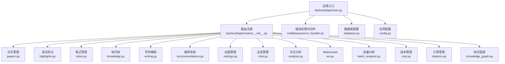
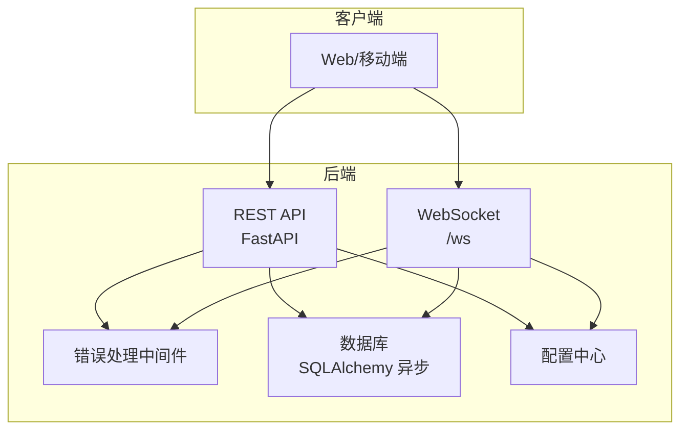
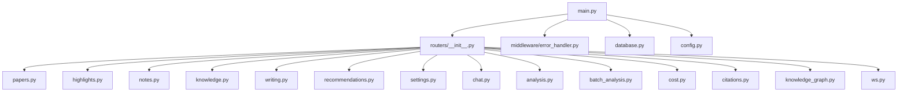

# API 参考文档

<cite>
**本文档引用的文件**
- [backend/app/main.py](file://backend/app/main.py)
- [backend/app/routers/__init__.py](file://backend/app/routers/__init__.py)
- [backend/app/config.py](file://backend/app/config.py)
- [backend/app/middleware/error_handler.py](file://backend/app/middleware/error_handler.py)
- [backend/app/database.py](file://backend/app/database.py)
- [backend/app/routers/papers.py](file://backend/app/routers/papers.py)
- [backend/app/routers/highlights.py](file://backend/app/routers/highlights.py)
- [backend/app/routers/notes.py](file://backend/app/routers/notes.py)
- [backend/app/routers/knowledge.py](file://backend/app/routers/knowledge.py)
- [backend/app/routers/writing.py](file://backend/app/routers/writing.py)
- [backend/app/routers/recommendations.py](file://backend/app/routers/recommendations.py)
- [backend/app/routers/settings.py](file://backend/app/routers/settings.py)
- [backend/app/routers/chat.py](file://backend/app/routers/chat.py)
- [backend/app/routers/analysis.py](file://backend/app/routers/analysis.py)
- [backend/app/routers/ws.py](file://backend/app/routers/ws.py)
- [backend/app/routers/batch_analysis.py](file://backend/app/routers/batch_analysis.py)
- [backend/app/routers/cost.py](file://backend/app/routers/cost.py)
- [backend/app/routers/citations.py](file://backend/app/routers/citations.py)
- [backend/app/routers/knowledge_graph.py](file://backend/app/routers/knowledge_graph.py)
- [backend/app/services/batch_analysis.py](file://backend/app/services/batch_analysis.py)
- [backend/app/models/cost.py](file://backend/app/models/cost.py)
- [backend/app/models/knowledge_graph.py](file://backend/app/models/knowledge_graph.py)
- [frontend/src/api/batchAnalysisApi.ts](file://frontend/src/api/batchAnalysisApi.ts)
- [frontend/src/api/costApi.ts](file://frontend/src/api/costApi.ts)
- [frontend/src/api/citationApi.ts](file://frontend/src/api/citationApi.ts)
- [frontend/src/api/knowledgeGraphApi.ts](file://frontend/src/api/knowledgeGraphApi.ts)
</cite>

## 目录
1. [简介](#简介)
2. [项目结构](#项目结构)
3. [核心组件](#核心组件)
4. [架构总览](#架构总览)
5. [详细组件分析](#详细组件分析)
6. [依赖分析](#依赖分析)
7. [性能考虑](#性能考虑)
8. [故障排除指南](#故障排除指南)
9. [结论](#结论)
10. [附录](#附录)

## 简介
PaperChat 是一个面向学术论文阅读与智能问答的系统，提供论文上传与解析、高亮与笔记、知识库构建、写作辅助、推荐系统以及会话管理等能力。后端基于 FastAPI 构建，采用异步数据库连接与流式响应，支持 SSE 和 WebSocket 实时交互。

## 项目结构
后端采用模块化路由组织方式，按功能域划分 API 路由，并通过统一入口注册到应用实例。核心模块包括：
- 论文管理：上传、查询、更新、删除、文本提取与分块
- 高亮标注：创建、查询、更新、删除
- 笔记管理：创建、查询、更新、删除、全文检索
- 知识库：卡片 CRUD、关系管理、图谱、统计、自动标签
- 写作辅助：大纲生成、段落初稿、学术润色、引用格式
- 推荐系统：相似论文、个性化推荐、网络搜索推荐
- 设置管理：用户配置读取、更新、重置
- 会话管理：聊天会话生命周期管理
- 论文分析：多论文对比、文献综述
- 批量分析：批量摘要、对比分析、批量综述
- 成本管理：模型价格查询、会话费用、日/月费用、预算管理、当前模型切换
- 引用管理：批量导出、Zotero 同步、格式查询
- 知识图谱：用户图谱、论文子图、手动构建、节点搜索
- WebSocket：统一消息路由、实时分析与问答

**图表来源**
- [backend/app/main.py:336-339](file://backend/app/main.py#L336-L339)
- [backend/app/routers/__init__.py:14-20](file://backend/app/routers/__init__.py#L14-L20)

**章节来源**
- [backend/app/main.py:336-339](file://backend/app/main.py#L336-L339)
- [backend/app/routers/__init__.py:14-20](file://backend/app/routers/__init__.py#L14-L20)

## 核心组件
- 应用入口与生命周期：创建 FastAPI 实例、配置 CORS、注册路由、健康检查端点
- 数据库层：异步 SQLAlchemy 引擎与会话工厂，初始化与关闭流程
- 错误处理：统一异常处理器，标准化错误响应
- 配置中心：应用名称、调试模式、数据库连接、JWT、CORS、上传目录与大小限制
- 路由模块：按功能域划分的 API 路由集合

**章节来源**
- [backend/app/main.py:16-53](file://backend/app/main.py#L16-L53)
- [backend/app/database.py:13-81](file://backend/app/database.py#L13-L81)
- [backend/app/middleware/error_handler.py:73-92](file://backend/app/middleware/error_handler.py#L73-L92)
- [backend/app/config.py:15-44](file://backend/app/config.py#L15-L44)

## 架构总览
系统采用前后端分离，后端提供 RESTful API 与 WebSocket 服务，支持流式响应（SSE）。认证通过 JWT 实现，WebSocket 支持可选 token 校验；错误处理统一返回标准结构；数据库采用异步连接池，确保高并发下的稳定性。

**图表来源**
- [backend/app/main.py:102-114](file://backend/app/main.py#L102-L114)
- [backend/app/routers/ws.py:76-102](file://backend/app/routers/ws.py#L76-L102)
- [backend/app/middleware/error_handler.py:73-92](file://backend/app/middleware/error_handler.py#L73-L92)
- [backend/app/config.py:15-44](file://backend/app/config.py#L15-L44)

## 详细组件分析

### 论文管理（/api/papers）
- 功能：上传 PDF、批量上传、ZIP 批量导入、查询列表、详情、更新、删除、获取文件、提取文本与文本块
- 认证：需要登录用户（依赖当前用户）
- 上传限制：单文件大小不超过配置的最大值，ZIP 文件上限更高
- 异步索引：上传完成后异步建立向量索引
- 权限控制：所有操作均校验论文归属当前用户

接口清单
- PATCH /api/papers/{paper_id}/reading-status
  - 请求体：{"status": "unread|reading|finished"}
  - 成功：{"message": "...", "reading_status": "...", "last_read_at": "..."}
- GET /api/papers
  - 查询参数：page、page_size、search、category、reading_status
  - 成功：PaperListResponse
- POST /api/papers/upload
  - 表单：file（PDF）、title、category、tags
  - 成功：PaperResponse（201）
- GET /api/papers/{paper_id}
  - 成功：PaperResponse
- PUT /api/papers/{paper_id}
  - 请求体：PaperUpdate
  - 成功：PaperResponse
- DELETE /api/papers/{paper_id}
  - 成功：204
- GET /api/papers/{paper_id}/file
  - 成功：PDF 文件
- GET /api/papers/{paper_id}/text
  - 查询参数：page（可选）
  - 成功：{"text": "...", "page_count": number}
- GET /api/papers/{paper_id}/blocks
  - 查询参数：page（可选）
  - 成功：{"blocks": [...]}
- POST /api/papers/batch-upload
  - 表单：files（多文件）
  - 成功：BatchUploadResponse
- POST /api/papers/batch-upload-zip
  - 表单：file（ZIP）
  - 成功：BatchUploadResponse

**章节来源**
- [backend/app/routers/papers.py:44-88](file://backend/app/routers/papers.py#L44-L88)
- [backend/app/routers/papers.py:91-153](file://backend/app/routers/papers.py#L91-L153)
- [backend/app/routers/papers.py:156-262](file://backend/app/routers/papers.py#L156-L262)
- [backend/app/routers/papers.py:264-290](file://backend/app/routers/papers.py#L264-L290)
- [backend/app/routers/papers.py:293-338](file://backend/app/routers/papers.py#L293-L338)
- [backend/app/routers/papers.py:341-376](file://backend/app/routers/papers.py#L341-L376)
- [backend/app/routers/papers.py:379-416](file://backend/app/routers/papers.py#L379-L416)
- [backend/app/routers/papers.py:419-462](file://backend/app/routers/papers.py#L419-L462)
- [backend/app/routers/papers.py:465-518](file://backend/app/routers/papers.py#L465-L518)
- [backend/app/routers/papers.py:521-646](file://backend/app/routers/papers.py#L521-L646)
- [backend/app/routers/papers.py:649-800](file://backend/app/routers/papers.py#L649-L800)

### 高亮标注（/api/highlights）
- 功能：按论文查询高亮、创建、更新、删除
- 权限：高亮必须属于当前用户与论文

接口清单
- GET /api/highlights/paper/{paper_id}
  - 成功：List[HighlightResponse]
- POST /api/highlights
  - 请求体：HighlightCreate
  - 成功：HighlightResponse（201）
- PUT /api/highlights/{highlight_id}
  - 请求体：HighlightUpdate
  - 成功：HighlightResponse
- DELETE /api/highlights/{highlight_id}
  - 成功：204

**章节来源**
- [backend/app/routers/highlights.py:20-55](file://backend/app/routers/highlights.py#L20-L55)
- [backend/app/routers/highlights.py:58-105](file://backend/app/routers/highlights.py#L58-L105)
- [backend/app/routers/highlights.py:108-151](file://backend/app/routers/highlights.py#L108-L151)
- [backend/app/routers/highlights.py:154-186](file://backend/app/routers/highlights.py#L154-L186)

### 笔记管理（/api/notes）
- 功能：按论文查询笔记、创建、查询单条、更新、删除、全文搜索
- 关联：可选绑定高亮，查询时返回高亮文本

接口清单
- GET /api/notes
  - 查询参数：paper_id（必填）
  - 成功：List[NoteWithHighlightResponse]
- POST /api/notes
  - 请求体：NoteCreate
  - 成功：NoteResponse（201）
- GET /api/notes/{note_id}
  - 成功：NoteWithHighlightResponse
- PUT /api/notes/{note_id}
  - 请求体：NoteUpdate
  - 成功：NoteResponse
- DELETE /api/notes/{note_id}
  - 成功：204
- GET /api/notes/search
  - 查询参数：q（必填，最小长度1）、paper_id（可选）
  - 成功：List[NoteWithHighlightResponse]

**章节来源**
- [backend/app/routers/notes.py:21-74](file://backend/app/routers/notes.py#L21-L74)
- [backend/app/routers/notes.py:77-137](file://backend/app/routers/notes.py#L77-L137)
- [backend/app/routers/notes.py:140-182](file://backend/app/routers/notes.py#L140-L182)
- [backend/app/routers/notes.py:185-247](file://backend/app/routers/notes.py#L185-L247)
- [backend/app/routers/notes.py:250-282](file://backend/app/routers/notes.py#L250-L282)
- [backend/app/routers/notes.py:285-349](file://backend/app/routers/notes.py#L285-L349)

### 知识库（/api/knowledge）
- 功能：知识卡片 CRUD、从高亮/问答抽取卡片、全局搜索、关系管理、图谱、统计、自动标签
- 权限：所有操作均校验卡片归属当前用户

接口清单
- GET /api/knowledge/cards
  - 查询参数：page、page_size、search、category、source_type、tag
  - 成功：KnowledgeCardListResponse
- POST /api/knowledge/cards
  - 请求体：KnowledgeCardCreate
  - 成功：KnowledgeCardResponse（201）
- GET /api/knowledge/cards/{card_id}
  - 成功：KnowledgeCardResponse
- PUT /api/knowledge/cards/{card_id}
  - 请求体：KnowledgeCardUpdate
  - 成功：KnowledgeCardResponse
- DELETE /api/knowledge/cards/{card_id}
  - 成功：{"message": "..."}
- POST /api/knowledge/cards/from-highlight/{highlight_id}
  - 成功：KnowledgeCardResponse
- POST /api/knowledge/cards/from-chat
  - 请求体：ExtractFromChatRequest
  - 成功：KnowledgeCardResponse
- GET /api/knowledge/search
  - 查询参数：query（必填）、top_k
  - 成功：{"results": [...], "query": "..."}
- GET /api/knowledge/cards/{card_id}/relations
  - 成功：List[KnowledgeRelationResponse]
- POST /api/knowledge/cards/{card_id}/find-relations
  - 成功：FindRelationsResponse
- POST /api/knowledge/relations
  - 请求体：KnowledgeRelationCreate（通过 source_card_id 与请求体组合）
  - 成功：KnowledgeRelationResponse（201）
- DELETE /api/knowledge/relations/{relation_id}
  - 成功：{"message": "..."}
- GET /api/knowledge/graph
  - 成功：GraphDataResponse
- GET /api/knowledge/stats
  - 成功：StatsResponse
- POST /api/knowledge/cards/{card_id}/auto-tag
  - 成功：AutoTagResponse

**章节来源**
- [backend/app/routers/knowledge.py:130-191](file://backend/app/routers/knowledge.py#L130-L191)
- [backend/app/routers/knowledge.py:194-221](file://backend/app/routers/knowledge.py#L194-L221)
- [backend/app/routers/knowledge.py:224-244](file://backend/app/routers/knowledge.py#L224-L244)
- [backend/app/routers/knowledge.py:247-279](file://backend/app/routers/knowledge.py#L247-L279)
- [backend/app/routers/knowledge.py:282-308](file://backend/app/routers/knowledge.py#L282-L308)
- [backend/app/routers/knowledge.py:311-327](file://backend/app/routers/knowledge.py#L311-L327)
- [backend/app/routers/knowledge.py:329-342](file://backend/app/routers/knowledge.py#L329-L342)
- [backend/app/routers/knowledge.py:345-356](file://backend/app/routers/knowledge.py#L345-L356)
- [backend/app/routers/knowledge.py:359-390](file://backend/app/routers/knowledge.py#L359-L390)
- [backend/app/routers/knowledge.py:393-408](file://backend/app/routers/knowledge.py#L393-L408)
- [backend/app/routers/knowledge.py:411-467](file://backend/app/routers/knowledge.py#L411-L467)
- [backend/app/routers/knowledge.py:470-496](file://backend/app/routers/knowledge.py#L470-L496)
- [backend/app/routers/knowledge.py:499-506](file://backend/app/routers/knowledge.py#L499-L506)
- [backend/app/routers/knowledge.py:509-516](file://backend/app/routers/knowledge.py#L509-L516)
- [backend/app/routers/knowledge.py:519-545](file://backend/app/routers/knowledge.py#L519-L545)

### 写作辅助（/api/writing）
- 功能：大纲生成、段落初稿、学术润色、引用格式生成、支持格式与风格枚举
- 流式响应：SSE，逐块推送内容，结束时发送 done 标记
- 权限：需要登录用户

接口清单
- POST /api/writing/outline
  - 请求体：OutlineRequest
  - 成功：SSE 流（data: {"content": "..."}），结束 data: {"done": true}
- POST /api/writing/draft
  - 请求体：DraftRequest
  - 成功：SSE 流
- POST /api/writing/polish
  - 请求体：PolishRequest
  - 成功：SSE 流
- POST /api/writing/citations
  - 请求体：CitationRequest
  - 成功：{"format": "...", "total": number, "citations": [...]}
- GET /api/writing/formats
  - 成功：支持的格式与类型列表

**章节来源**
- [backend/app/routers/writing.py:72-108](file://backend/app/routers/writing.py#L72-L108)
- [backend/app/routers/writing.py:111-139](file://backend/app/routers/writing.py#L111-L139)
- [backend/app/routers/writing.py:142-184](file://backend/app/routers/writing.py#L142-L184)
- [backend/app/routers/writing.py:187-262](file://backend/app/routers/writing.py#L187-L262)
- [backend/app/routers/writing.py:265-287](file://backend/app/routers/writing.py#L265-L287)

### 推荐系统（/api）
- 功能：相似论文推荐、个性化推荐、刷新缓存、网络搜索推荐
- 权限：需要登录用户

接口清单
- GET /api/papers/{paper_id}/recommendations
  - 查询参数：top_k（默认5，最大20）
  - 成功：{"source_paper_id": number, "total": number, "recommendations": [...]}
- GET /api/recommendations
  - 查询参数：top_k（默认5，最大20）
  - 成功：{"total": number, "has_profile": boolean, "recommendations": [...]}
- POST /api/papers/{paper_id}/recommendations/refresh
  - 成功：{"success": boolean, "message": "...", "paper_id": number}
- GET /api/papers/{paper_id}/web-recommendations
  - 查询参数：max_results（默认8，最大20）
  - 成功：{"results": [...], "total": number}

**章节来源**
- [backend/app/routers/recommendations.py:18-75](file://backend/app/routers/recommendations.py#L18-L75)
- [backend/app/routers/recommendations.py:78-118](file://backend/app/routers/recommendations.py#L78-L118)
- [backend/app/routers/recommendations.py:121-177](file://backend/app/routers/recommendations.py#L121-L177)
- [backend/app/routers/recommendations.py:180-233](file://backend/app/routers/recommendations.py#L180-L233)

### 设置管理（/api/settings）
- 功能：获取完整配置、更新配置、重置为默认、获取纯值配置
- 权限：需要登录用户

接口清单
- GET /api/settings
  - 成功：完整配置（含元数据，API Key 脱敏）
- PUT /api/settings
  - 请求体：配置对象（仅需变更的键）
  - 成功：更新后的完整配置
- POST /api/settings/reset
  - 成功：默认配置
- GET /api/settings/values
  - 成功：纯值配置（仅包含 value）

**章节来源**
- [backend/app/routers/settings.py:17-28](file://backend/app/routers/settings.py#L17-L28)
- [backend/app/routers/settings.py:31-60](file://backend/app/routers/settings.py#L31-L60)
- [backend/app/routers/settings.py:65-80](file://backend/app/routers/settings.py#L65-L80)
- [backend/app/routers/settings.py:83-93](file://backend/app/routers/settings.py#L83-L93)

### 会话管理（/api/chat）
- 功能：会话列表、创建、详情（含消息历史）、消息分页、更新标题、删除、按论文获取或创建默认会话、跨文档会话
- 权限：需要登录用户

接口清单
- GET /api/chat/sessions
  - 查询参数：paper_id（可选）
  - 成功：{"sessions": [...]}
- POST /api/chat/sessions
  - 查询参数：paper_id（可选）、paper_ids（可选）、title
  - 成功：{"id": "...", ...}
- GET /api/chat/sessions/{session_id}
  - 成功：{"id": "...", "messages": [...]}
- GET /api/chat/sessions/{session_id}/messages
  - 查询参数：limit、offset
  - 成功：{"messages": [...], "total": number, "limit": number, "offset": number}
- PUT /api/chat/sessions/{session_id}
  - 请求参数：title
  - 成功：{"id": "...", "title": "...", ...}
- DELETE /api/chat/sessions/{session_id}
  - 成功：{"message": "..."}
- GET /api/chat/sessions/by-paper/{paper_id}
  - 成功：{"id": "...", "is_new": boolean, ...}
- POST /api/chat/sessions/cross-doc
  - 请求参数：paper_ids（必填）、title
  - 成功：{"id": "...", "paper_ids": [...], "is_cross_doc": boolean, ...}

**章节来源**
- [backend/app/routers/chat.py:21-65](file://backend/app/routers/chat.py#L21-L65)
- [backend/app/routers/chat.py:68-118](file://backend/app/routers/chat.py#L68-L118)
- [backend/app/routers/chat.py:121-171](file://backend/app/routers/chat.py#L121-L171)
- [backend/app/routers/chat.py:174-224](file://backend/app/routers/chat.py#L174-L224)
- [backend/app/routers/chat.py:227-263](file://backend/app/routers/chat.py#L227-L263)
- [backend/app/routers/chat.py:266-292](file://backend/app/routers/chat.py#L266-L292)
- [backend/app/routers/chat.py:295-351](file://backend/app/routers/chat.py#L295-L351)
- [backend/app/routers/chat.py:354-416](file://backend/app/routers/chat.py#L354-L416)

### 论文分析（/api/analysis）
- 功能：多论文对比分析、文献综述生成（均为流式）
- 权限：需要登录用户
- 上下文限制：单篇最大字符数与总上下文最大字符数限制

接口清单
- POST /api/analysis/compare
  - 请求体：CompareRequest（paper_ids 2-10）
  - 成功：SSE 流（data: {"chunk": "..."}），结束 data: {"done": true}
- POST /api/analysis/review
  - 请求体：CompareRequest（paper_ids 2-10）
  - 成功：SSE 流（Markdown）

**章节来源**
- [backend/app/routers/analysis.py:88-149](file://backend/app/routers/analysis.py#L88-L149)
- [backend/app/routers/analysis.py:152-213](file://backend/app/routers/analysis.py#L152-L213)

### 批量分析（/api/v1/analysis）
- 功能：批量摘要、批量对比分析、批量文献综述，支持任务提交、进度查询、结果获取、任务取消
- 权限：需要登录用户
- 异步处理：使用队列+Worker模式，串行处理避免并发开销

接口清单
- POST /api/v1/analysis/batch
  - 请求体：BatchAnalysisRequest（paper_ids 至少1篇，analysis_type: summary|compare|review）
  - 成功：BatchSubmitResponse（202 Accepted）
- GET /api/v1/analysis/batch/{batch_id}
  - 成功：批量任务状态（不含每篇 result 内容）
- GET /api/v1/analysis/batch/{batch_id}/results
  - 成功：批量任务完整结果（包含每篇论文的分析内容）
- DELETE /api/v1/analysis/batch/{batch_id}
  - 成功：{"message": "...", "batch_id": "..."}

批量分析任务状态字段
- batch_id：任务唯一标识
- analysis_type：分析类型（summary/compare/review）
- status：任务状态（pending/running/completed/failed/cancelled）
- total：总论文数
- completed：已完成数
- failed：失败数
- progress：完成百分比
- paper_results：每篇论文的分析结果列表
- combined_result：整体对比/综述结果（compare/review类型）
- created_at/updated_at：任务创建和更新时间

**章节来源**
- [backend/app/routers/batch_analysis.py:39-73](file://backend/app/routers/batch_analysis.py#L39-L73)
- [backend/app/routers/batch_analysis.py:75-103](file://backend/app/routers/batch_analysis.py#L75-L103)
- [backend/app/routers/batch_analysis.py:105-124](file://backend/app/routers/batch_analysis.py#L105-L124)
- [backend/app/routers/batch_analysis.py:126-146](file://backend/app/routers/batch_analysis.py#L126-L146)
- [backend/app/services/batch_analysis.py:94-190](file://backend/app/services/batch_analysis.py#L94-L190)
- [backend/app/services/batch_analysis.py:175-180](file://backend/app/services/batch_analysis.py#L175-L180)

### 成本管理（/api/v1/cost）
- 功能：模型价格查询、会话费用统计、日/月费用查询、预算管理、当前模型切换
- 权限：需要登录用户

接口清单
- GET /api/v1/cost/models
  - 成功：可用模型列表及单价信息
- GET /api/v1/cost/session/{session_id}
  - 成功：指定会话的费用汇总
- GET /api/v1/cost/daily
  - 查询参数：date（YYYY-MM-DD，默认今天）
  - 成功：日费用统计
- GET /api/v1/cost/monthly
  - 查询参数：year（默认今年）、month（默认今月）
  - 成功：月费用统计及日明细
- GET /api/v1/cost/budget
  - 成功：预算使用状态
- PUT /api/v1/cost/budget
  - 请求体：BudgetSetRequest（monthly_limit）
  - 成功：预算设置结果
- GET /api/v1/cost/current-model
  - 成功：当前使用的模型及单价
- PUT /api/v1/cost/current-model
  - 请求体：ModelSwitchRequest（model）
  - 成功：模型切换结果

费用统计字段
- session_id：会话标识
- total_input_tokens：输入token总数
- total_output_tokens：输出token总数
- total_tokens：token总数
- total_cost：总费用
- call_count：调用次数

预算状态字段
- monthly_limit：月预算上限
- used：已用费用
- remaining：剩余预算
- percent：使用百分比
- over_budget：是否超预算

**章节来源**
- [backend/app/routers/cost.py:29-48](file://backend/app/routers/cost.py#L29-L48)
- [backend/app/routers/cost.py:51-70](file://backend/app/routers/cost.py#L51-L70)
- [backend/app/routers/cost.py:77-82](file://backend/app/routers/cost.py#L77-L82)
- [backend/app/routers/cost.py:84-94](file://backend/app/routers/cost.py#L84-L94)
- [backend/app/routers/cost.py:97-114](file://backend/app/routers/cost.py#L97-L114)
- [backend/app/models/cost.py:11-39](file://backend/app/models/cost.py#L11-L39)

### 引用管理（/api/v1/citations）
- 功能：批量导出论文引用、同步到Zotero、查询支持的引用格式、检查Zotero连接状态
- 权限：需要登录用户

接口清单
- POST /api/v1/citations/export
  - 请求体：ExportRequest（paper_ids，format，默认bibtex）
  - 成功：包含引用内容、格式、数量的对象
- POST /api/v1/citations/sync-zotero
  - 请求体：SyncZoteroRequest（paper_ids）
  - 成功：同步结果（success、synced、total、errors）
- GET /api/v1/citations/formats
  - 成功：支持的引用格式列表
- GET /api/v1/citations/zotero/status
  - 成功：Zotero连接状态（configured、connected）

支持的引用格式
- bibtex、ris、apa、mla、chicago、gbt7714（gbt）

**章节来源**
- [backend/app/routers/citations.py:33-79](file://backend/app/routers/citations.py#L33-L79)
- [backend/app/routers/citations.py:81-154](file://backend/app/routers/citations.py#L81-L154)
- [backend/app/routers/citations.py:156-168](file://backend/app/routers/citations.py#L156-L168)
- [backend/app/routers/citations.py:171-196](file://backend/app/routers/citations.py#L171-L196)

### 知识图谱（/api/v1/knowledge-graph）
- 功能：获取用户完整图谱、按论文筛选子图、手动触发图谱构建、搜索图谱节点
- 权限：需要登录用户，且只能访问自己的图谱
- 数据格式：D3.js力导向图兼容格式

接口清单
- GET /api/v1/knowledge-graph/{user_id}
  - 成功：用户完整图谱（nodes、links）
- GET /api/v1/knowledge-graph/{user_id}/paper/{paper_id}
  - 成功：单篇论文子图
- POST /api/v1/knowledge-graph/build/{paper_id}?user_id={user_id}
  - 成功：构建状态（building）
- GET /api/v1/knowledge-graph/{user_id}/search?query={query}
  - 成功：匹配的节点列表

图谱数据格式
- nodes：节点数组（id、name、type、description、paper_ids）
- links：边数组（source、target、relation_type、weight、evidence）

**章节来源**
- [backend/app/routers/knowledge_graph.py:23-79](file://backend/app/routers/knowledge_graph.py#L23-L79)
- [backend/app/routers/knowledge_graph.py:81-153](file://backend/app/routers/knowledge_graph.py#L81-L153)
- [backend/app/routers/knowledge_graph.py:155-199](file://backend/app/routers/knowledge_graph.py#L155-L199)
- [backend/app/routers/knowledge_graph.py:201-249](file://backend/app/routers/knowledge_graph.py#L201-L249)
- [backend/app/models/knowledge_graph.py:14-75](file://backend/app/models/knowledge_graph.py#L14-L75)

### WebSocket（/ws）
- 功能：统一消息路由，支持分析、问答、RAG、跨文档、Agent、深度分析、统一入口等
- 认证：可选 JWT token，未提供时降级为默认用户
- 任务管理：同一连接内并发任务互斥，支持取消
- 消息类型：analyze、chat、rag_chat、cross_doc_chat、deep_analyze、agent_chat、unified_chat、cancel
- 响应格式：SSE 风格的 JSON 消息，包含片段、来源引用、完成与错误

**章节来源**
- [backend/app/routers/ws.py:76-102](file://backend/app/routers/ws.py#L76-L102)
- [backend/app/routers/ws.py:114-423](file://backend/app/routers/ws.py#L114-L423)

## 依赖分析
- 组件耦合
  - 主应用依赖路由注册器，路由模块依赖数据库会话与认证服务
  - WebSocket 路由依赖各业务 handler 与消息服务
  - 错误处理中间件对全局异常进行统一拦截
- 外部依赖
  - 数据库：SQLAlchemy 异步引擎
  - 认证：JWT（可选）
  - 流式：SSE（text/event-stream）
  - WebSocket：统一消息路由与任务管理

**图表来源**
- [backend/app/main.py:336-339](file://backend/app/main.py#L336-L339)
- [backend/app/routers/__init__.py:14-20](file://backend/app/routers/__init__.py#L14-L20)

**章节来源**
- [backend/app/main.py:336-339](file://backend/app/main.py#L336-L339)
- [backend/app/routers/__init__.py:14-20](file://backend/app/routers/__init__.py#L14-L20)

## 性能考虑
- 异步数据库：使用 SQLAlchemy 异步引擎与会话工厂，减少阻塞
- 流式响应：SSE 与 WebSocket 降低长任务等待时间，提升用户体验
- 缓存与索引：推荐系统与知识库支持缓存与向量索引，提高查询效率
- 上传与压缩：ZIP 批量上传与文件大小限制，平衡存储与传输
- 任务并发：WebSocket 连接内任务互斥与取消机制，避免资源竞争
- 批量分析：队列+Worker串行处理，避免并发LLM请求带来的资源竞争
- 成本控制：模型切换与预算限制，防止意外高额费用

## 故障排除指南
- 统一错误响应
  - 参数验证失败：422，包含字段、消息与类型
  - HTTP 异常：透传状态码与详情
  - 数据库异常：500，统一消息
  - 未捕获异常：500，统一消息
- 常见问题
  - 未登录或权限不足：404/400，提示"不存在或无权限"
  - 文件类型不符：400，提示"只支持 PDF/ZIP"
  - 文件过大：400，提示超出限制
  - WebSocket 未授权：4001，关闭连接
  - 批量分析任务不存在：404，提示任务不存在或已过期
  - 引用格式不支持：400，提示支持的格式列表
- 建议
  - 前端统一处理 4xx/5xx 错误，展示友好提示
  - WebSocket 断线重连与任务取消逻辑需完善
  - 批量分析建议在任务完成后获取完整结果

**章节来源**
- [backend/app/middleware/error_handler.py:11-70](file://backend/app/middleware/error_handler.py#L11-L70)
- [backend/app/routers/papers.py:177-192](file://backend/app/routers/papers.py#L177-L192)
- [backend/app/routers/papers.py:667-682](file://backend/app/routers/papers.py#L667-L682)
- [backend/app/routers/ws.py:103-107](file://backend/app/routers/ws.py#L103-L107)
- [backend/app/routers/batch_analysis.py:92-98](file://backend/app/routers/batch_analysis.py#L92-L98)
- [backend/app/routers/citations.py:47-51](file://backend/app/routers/citations.py#L47-L51)

## 结论
PaperChat 提供了覆盖论文全生命周期的 API 体系，结合流式与 WebSocket 能力，满足学术阅读、写作与知识管理的多样化需求。通过统一的错误处理与配置中心，系统具备良好的可维护性与扩展性。新增的批量分析、成本管理、引用管理和知识图谱等功能进一步增强了系统的实用性和商业价值。

## 附录

### 认证与权限
- REST API：依赖当前用户（登录态），部分端点通过依赖注入获取
- WebSocket：可选 JWT token，未提供时降级为默认用户
- 权限控制：所有论文、高亮、笔记、卡片等操作均校验归属
- 图谱访问：严格限制只能访问自己的图谱数据

**章节来源**
- [backend/app/routers/papers.py:48-49](file://backend/app/routers/papers.py#L48-L49)
- [backend/app/routers/highlights.py:23-24](file://backend/app/routers/highlights.py#L23-L24)
- [backend/app/routers/notes.py:24-25](file://backend/app/routers/notes.py#L24-L25)
- [backend/app/routers/knowledge.py:138-139](file://backend/app/routers/knowledge.py#L138-L139)
- [backend/app/routers/ws.py:103-107](file://backend/app/routers/ws.py#L103-L107)
- [backend/app/routers/knowledge_graph.py:38-42](file://backend/app/routers/knowledge_graph.py#L38-L42)

### 错误响应格式
- {"code": number, "message": "字符串", "data": null | 对象}
- 422：请求参数验证失败，data 为错误数组
- 400/404：HTTP 异常与业务错误
- 500：服务器内部错误

**章节来源**
- [backend/app/middleware/error_handler.py:21-69](file://backend/app/middleware/error_handler.py#L21-L69)

### 速率限制策略
- 仓库未实现显式速率限制中间件
- 建议：在网关或反向代理层配置限流，或在应用层增加令牌桶/漏桶算法

### API 版本管理
- 应用版本：v3.1.0
- 健康检查：GET /api/health
- 新增API版本前缀：/api/v1/（批量分析、成本管理、引用管理、知识图谱）

**章节来源**
- [backend/app/main.py:62-68](file://backend/app/main.py#L62-L68)
- [backend/app/main.py:102-113](file://backend/app/main.py#L102-L113)

### 客户端集成指南（示例思路）
- REST 客户端
  - 使用 fetch/fetch-like 库，携带 Cookie 或 Authorization 头
  - 处理 422/400/404/500 错误，统一弹窗提示
  - 上传 PDF/ZIP 时使用 multipart/form-data
  - 批量分析：先提交任务获取batch_id，轮询进度，完成后获取结果
  - 成本管理：定期查询预算状态，及时调整模型和预算
- WebSocket 客户端
  - 连接 /ws，发送消息类型（如 analyze、rag_chat、cross_doc_chat）
  - 监听 SSE 风格消息，拼接片段，显示完成与错误
  - 支持 cancel 取消当前任务
- 最佳实践
  - 前端本地存储用户偏好与会话 ID
  - 大文件上传采用分片或进度条反馈
  - WebSocket 断线自动重连与消息去重
  - 批量分析任务建议设置合理的超时和重试机制
  - 成本管理建议设置预算预警通知

**章节来源**
- [frontend/src/api/batchAnalysisApi.ts:35-74](file://frontend/src/api/batchAnalysisApi.ts#L35-L74)
- [frontend/src/api/costApi.ts:62-99](file://frontend/src/api/costApi.ts#L62-L99)
- [frontend/src/api/citationApi.ts:4-27](file://frontend/src/api/citationApi.ts#L4-L27)
- [frontend/src/api/knowledgeGraphApi.ts:7-25](file://frontend/src/api/knowledgeGraphApi.ts#L7-L25)