# WebSocket 实时通信 API

<cite>
**本文档引用的文件**
- [ws.py](file://backend/app/routers/ws.py)
- [useWebSocket.js](file://frontend/src/hooks/useWebSocket.js)
- [chat_handler.py](file://backend/app/handlers/chat_handler.py)
- [analyze_handler.py](file://backend/app/handlers/analyze_handler.py)
- [rag_handler.py](file://backend/app/handlers/rag_handler.py)
- [cross_doc_handler.py](file://backend/app/handlers/cross_doc_handler.py)
- [agent_handler.py](file://backend/app/handlers/agent_handler.py)
- [session_service.py](file://backend/app/services/session_service.py)
- [message_service.py](file://backend/app/services/message_service.py)
- [llm_service.py](file://backend/app/services/llm_service.py)
- [main.py](file://backend/app/main.py)
- [config.py](file://backend/app/config.py)
- [README.md](file://README.md)
</cite>

## 目录
1. [简介](#简介)
2. [项目结构](#项目结构)
3. [核心组件](#核心组件)
4. [架构概览](#架构概览)
5. [详细组件分析](#详细组件分析)
6. [消息协议规范](#消息协议规范)
7. [连接管理](#连接管理)
8. [消息处理机制](#消息处理机制)
9. [状态管理](#状态管理)
10. [性能优化](#性能优化)
11. [故障排除](#故障排除)
12. [结论](#结论)

## 简介

PaperChat 是一个基于 WebSocket 的实时通信系统，专为学术论文智能阅读与问答而设计。该系统实现了双向实时通信，支持多种消息类型和复杂的业务逻辑处理，包括论文分析、智能问答、跨文档检索等功能。

系统采用 FastAPI 作为后端框架，React 作为前端框架，通过 WebSocket 实现实时数据传输。整个架构支持断线重连、任务取消、流式响应等高级特性。

## 项目结构

WebSocket 实时通信系统的核心架构如下：

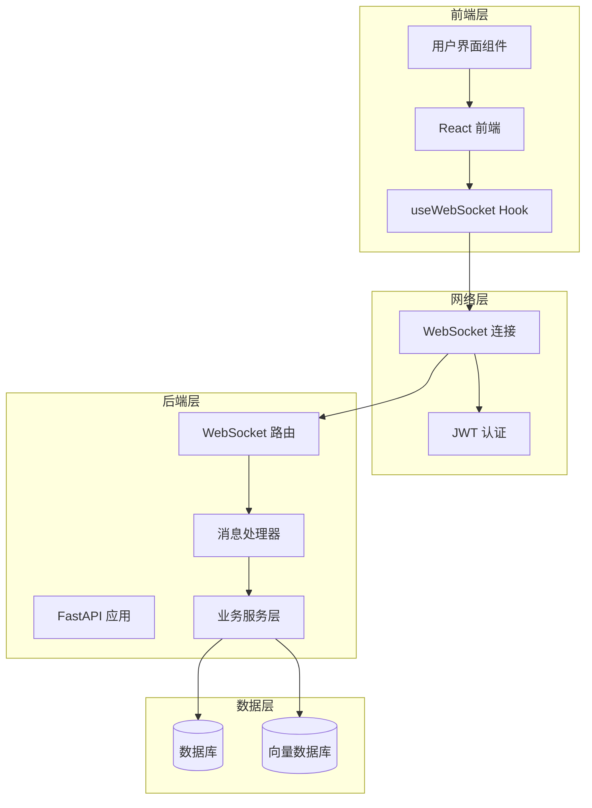

**图表来源**
- [ws.py:76-102](file://backend/app/routers/ws.py#L76-L102)
- [useWebSocket.js:19-59](file://frontend/src/hooks/useWebSocket.js#L19-L59)
- [main.py:55-95](file://backend/app/main.py#L55-L95)

**章节来源**
- [ws.py:1-436](file://backend/app/routers/ws.py#L1-L436)
- [useWebSocket.js:1-180](file://frontend/src/hooks/useWebSocket.js#L1-L180)
- [main.py:1-114](file://backend/app/main.py#L1-L114)

## 核心组件

### WebSocket 路由器 (ws.py)

WebSocket 路由器是整个实时通信系统的核心，负责：
- 连接生命周期管理
- 消息类型路由分发
- 任务状态跟踪
- JWT 令牌验证

### 前端 WebSocket Hook (useWebSocket.js)

前端 Hook 提供了完整的 WebSocket 通信能力：
- 自动连接管理
- 断线重连机制
- 消息监听器
- 统一的消息发送接口

### 消息处理器

系统包含多个专门的消息处理器：
- **基础问答处理器**：处理简单的问答请求
- **论文分析处理器**：处理论文章节概述和深度分析
- **RAG 问答处理器**：处理基于检索增强的智能问答
- **跨文档处理器**：处理多论文间的问答
- **Agent 处理器**：处理智能体模式的复杂问答

**章节来源**
- [ws.py:56-65](file://backend/app/routers/ws.py#L56-L65)
- [useWebSocket.js:84-179](file://frontend/src/hooks/useWebSocket.js#L84-L179)

## 架构概览

系统采用分层架构设计，确保了良好的可维护性和扩展性：

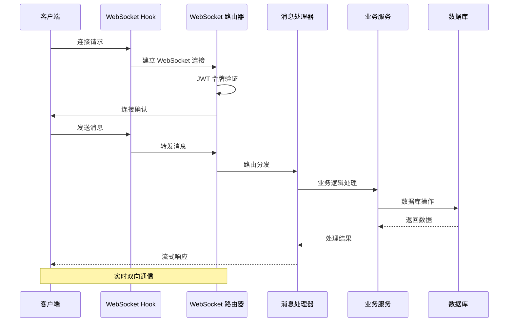

**图表来源**
- [ws.py:114-120](file://backend/app/routers/ws.py#L114-L120)
- [useWebSocket.js:100-107](file://frontend/src/hooks/useWebSocket.js#L100-L107)

## 详细组件分析

### 连接状态管理

ConnectionState 类负责维护连接的全局状态：

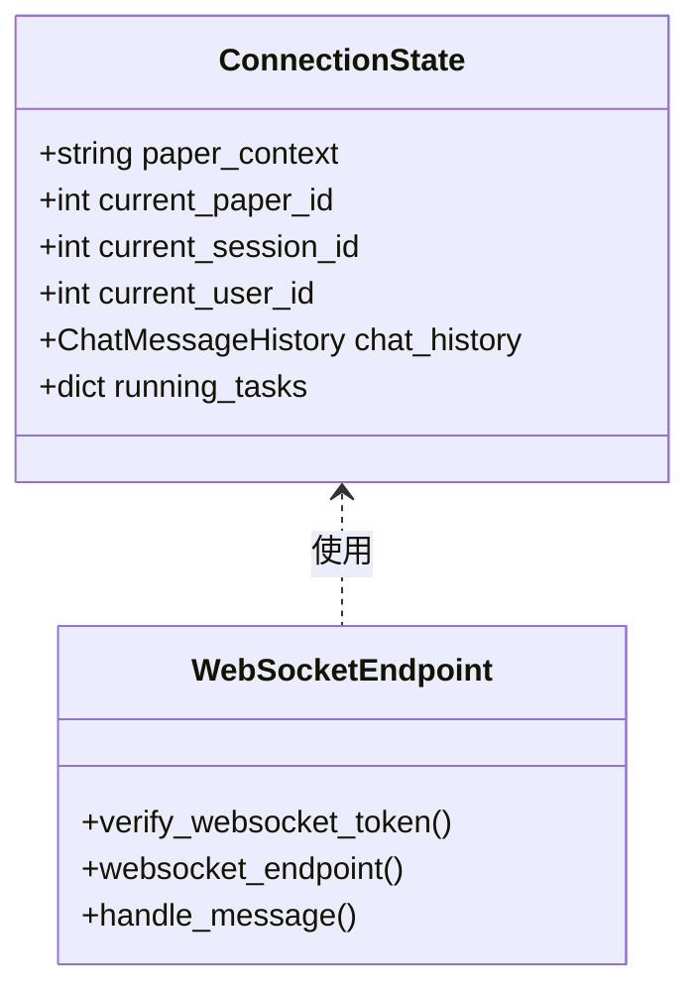

**图表来源**
- [ws.py:56-65](file://backend/app/routers/ws.py#L56-L65)
- [ws.py:103-113](file://backend/app/routers/ws.py#L103-L113)

### 消息处理器架构

每个消息处理器都遵循相同的模式：

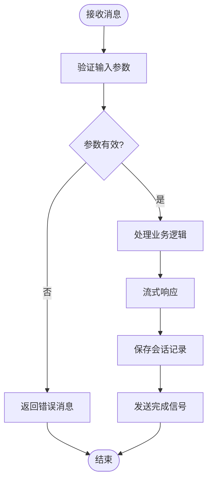

**图表来源**
- [chat_handler.py:11-32](file://backend/app/handlers/chat_handler.py#L11-L32)
- [analyze_handler.py:13-49](file://backend/app/handlers/analyze_handler.py#L13-L49)

**章节来源**
- [ws.py:120-251](file://backend/app/routers/ws.py#L120-L251)
- [chat_handler.py:1-32](file://backend/app/handlers/chat_handler.py#L1-L32)
- [analyze_handler.py:1-87](file://backend/app/handlers/analyze_handler.py#L1-L87)

### 任务调度机制

系统支持并发任务处理和任务取消：

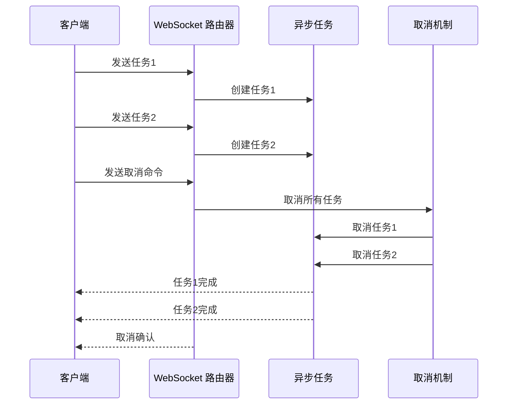

**图表来源**
- [ws.py:252-260](file://backend/app/routers/ws.py#L252-L260)
- [ws.py:130-135](file://backend/app/routers/ws.py#L130-L135)

**章节来源**
- [ws.py:252-260](file://backend/app/routers/ws.py#L252-L260)
- [ws.py:130-135](file://backend/app/routers/ws.py#L130-L135)

## 消息协议规范

### 客户端 → 服务器 消息类型

| 类型 | 字段 | 说明 |
|------|------|------|
| `analyze` | `text`, `paper_id` | 论文章节分析 |
| `deep_analyze` | `text`, `paper_id` | 论文深度分析 |
| `chat` | `message` | 基础问答 |
| `rag_chat` | `message`, `paper_id`, `session_id`, `user_id`, `enable_search` | RAG 增强问答 |
| `cross_doc_chat` | `message`, `paper_ids`, `session_id`, `user_id` | 跨文档问答 |
| `unified_chat` | `message`, `paper_id`, `paper_ids`, `session_id`, `enable_search` | 统一聊天入口（自动路由） |
| `agent_chat` | `message`, `paper_id`, `paper_ids` | Agent 智能问答 |
| `cancel` | - | 取消当前任务 |

### 服务器 → 客户端 响应类型

| 类型 | 字段 | 说明 |
|------|------|------|
| `analyze_chunk` | `data` | 章节分析流式数据 |
| `deep_analyze_chunk` | `data` | 深度分析流式数据 |
| `chat_chunk` | `data` | 基础问答流式数据 |
| `rag_chat_chunk` | `content` | RAG 问答流式数据 |
| `rag_sources` | `sources` | 引用来源列表 |
| `cross_doc_chunk` | `content` | 跨文档问答流式数据 |
| `cross_doc_sources` | `sources` | 跨文档引用来源 |
| `search_status` | `status`, `results_count` | 联网搜索状态 |
| `intent_detected` | `intent`, `tool`, `confidence`, `matched` | 意图识别结果（统一聊天入口） |
| `agent_intent` | `intent` | Agent 意图识别结果 |
| `agent_plan` | `plan` | Agent 任务计划 |
| `agent_step` | `step`, `description` | Agent 步骤开始 |
| `agent_step_result` | `step`, `result` | Agent 步骤结果 |
| `agent_answer_chunk` | `content` | Agent 最终答案片段 |
| `cancelled` | `message` | 任务取消确认 |
| `keywords_result` | `keywords` | 关键词提取结果 |
| `done` | `channel`, `session_id` | 传输完成 |
| `error` | `message` | 错误信息 |

**章节来源**
- [ws.py:84-102](file://backend/app/routers/ws.py#L84-L102)
- [ws.py:314-331](file://backend/app/routers/ws.py#L314-L331)

## 连接管理

### 连接建立流程

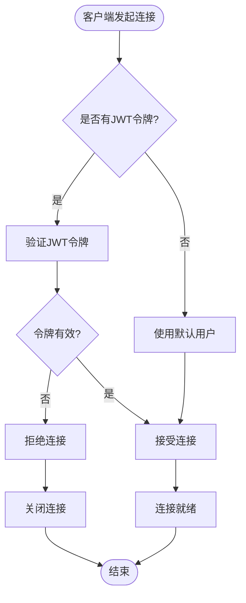

**图表来源**
- [ws.py:32-53](file://backend/app/routers/ws.py#L32-L53)
- [ws.py:103-107](file://backend/app/routers/ws.py#L103-L107)

### 断线重连机制

前端实现了智能的断线重连策略：

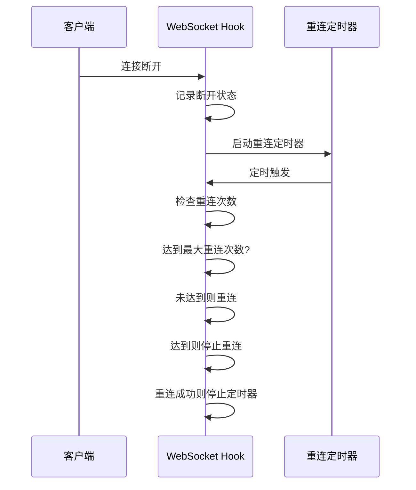

**图表来源**
- [useWebSocket.js:45-52](file://frontend/src/hooks/useWebSocket.js#L45-L52)
- [useWebSocket.js:48-51](file://frontend/src/hooks/useWebSocket.js#L48-L51)

**章节来源**
- [ws.py:32-53](file://backend/app/routers/ws.py#L32-L53)
- [useWebSocket.js:19-59](file://frontend/src/hooks/useWebSocket.js#L19-L59)

## 消息处理机制

### 统一聊天入口

系统提供了智能的消息路由机制：

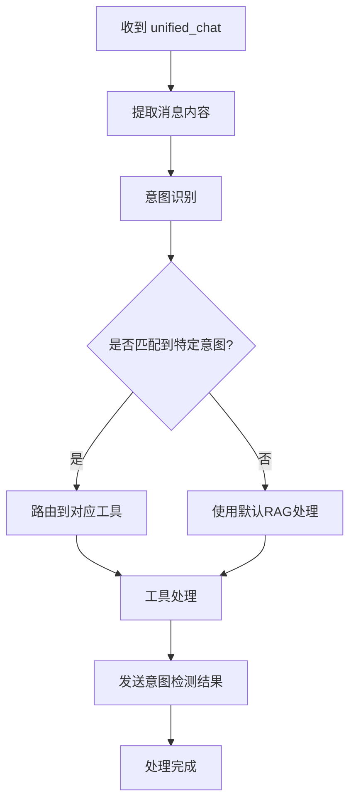

**图表来源**
- [ws.py:262-417](file://backend/app/routers/ws.py#L262-L417)

### 会话管理

系统支持持久化的会话管理：

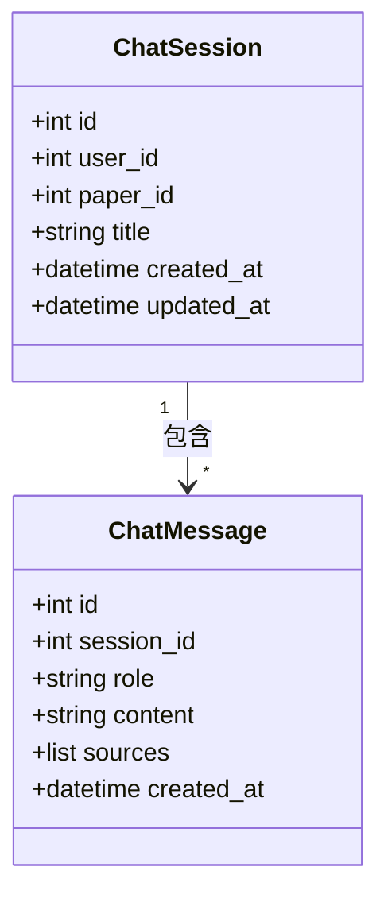

**图表来源**
- [session_service.py:17-42](file://backend/app/services/session_service.py#L17-L42)
- [message_service.py:45-54](file://backend/app/services/message_service.py#L45-L54)

**章节来源**
- [ws.py:262-417](file://backend/app/routers/ws.py#L262-L417)
- [session_service.py:17-42](file://backend/app/services/session_service.py#L17-L42)
- [message_service.py:24-42](file://backend/app/services/message_service.py#L24-L42)

## 状态管理

### 连接状态跟踪

系统维护了完整的连接状态信息：

| 状态字段 | 类型 | 描述 |
|----------|------|------|
| `paper_context` | string | 当前论文上下文 |
| `current_paper_id` | int | 当前论文ID |
| `current_session_id` | int | 当前后台会话ID |
| `current_user_id` | int | 当前用户ID |
| `chat_history` | ChatMessageHistory | 聊天历史记录 |
| `running_tasks` | dict | 正在运行的任务列表 |

### 任务状态管理

每个处理器都会维护自己的任务状态：

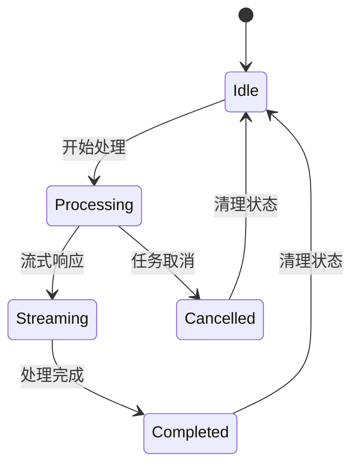

**图表来源**
- [ws.py:64](file://backend/app/routers/ws.py#L64)
- [ws.py:430-431](file://backend/app/routers/ws.py#L430-L431)

**章节来源**
- [ws.py:56-65](file://backend/app/routers/ws.py#L56-L65)
- [ws.py:424-435](file://backend/app/routers/ws.py#L424-L435)

## 性能优化

### 流式响应优化

系统采用了高效的流式响应机制：

1. **异步处理**：所有消息处理都是异步的，避免阻塞连接
2. **增量传输**：支持增量响应，减少内存占用
3. **任务取消**：支持快速取消长时间运行的任务
4. **并发控制**：限制同时运行的任务数量

### 缓冲区管理

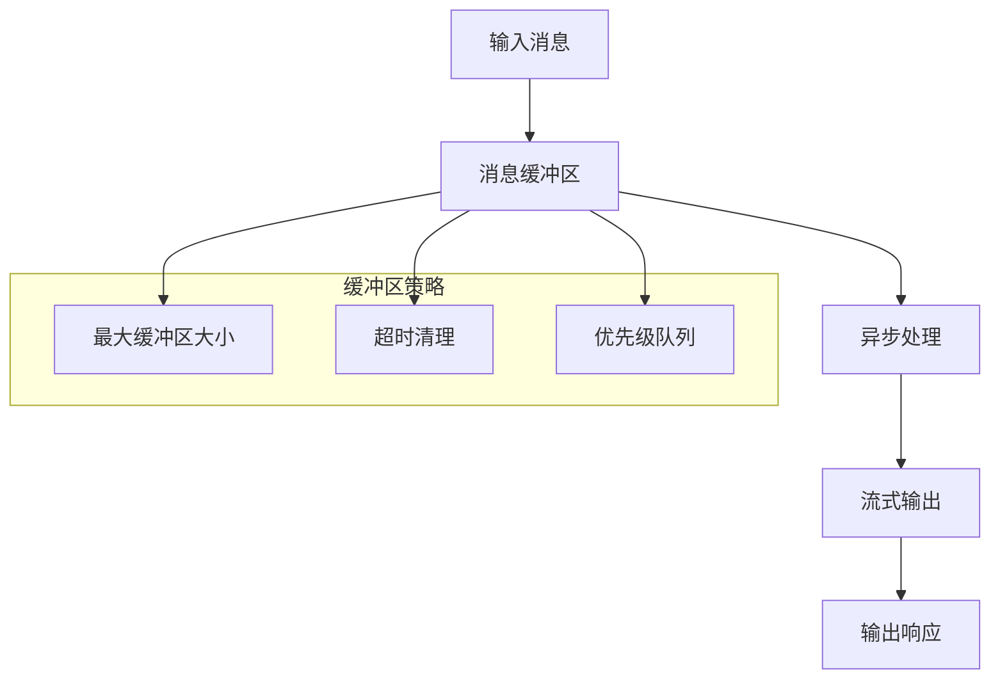

**图表来源**
- [ws.py:115-120](file://backend/app/routers/ws.py#L115-L120)
- [useWebSocket.js:100-107](file://frontend/src/hooks/useWebSocket.js#L100-L107)

### 错误处理策略

系统实现了多层次的错误处理：

1. **连接级错误**：处理连接建立和断开
2. **消息级错误**：处理单个消息的处理错误
3. **任务级错误**：处理异步任务的异常
4. **资源级错误**：处理数据库和外部服务的异常

**章节来源**
- [ws.py:424-427](file://backend/app/routers/ws.py#L424-L427)
- [useWebSocket.js:54-56](file://frontend/src/hooks/useWebSocket.js#L54-L56)

## 故障排除

### 常见问题诊断

| 问题类型 | 症状 | 可能原因 | 解决方案 |
|----------|------|----------|----------|
| 连接失败 | 无法建立WebSocket连接 | JWT令牌无效或过期 | 检查令牌有效性，重新登录 |
| 消息丢失 | 部分消息未到达 | 网络不稳定或连接中断 | 启用断线重连，检查网络状况 |
| 处理超时 | 任务长时间无响应 | LLM服务响应慢或数据库查询慢 | 优化查询，增加超时时间 |
| 内存泄漏 | 内存使用持续增长 | 任务未正确清理或循环引用 | 检查任务清理逻辑，修复循环引用 |

### 调试接口

系统提供了以下调试功能：

1. **健康检查端点**：`/api/health` - 检查服务状态
2. **连接状态监控**：实时查看连接数和任务状态
3. **错误日志**：详细的错误信息记录
4. **性能指标**：响应时间和资源使用情况

**章节来源**
- [main.py:102-114](file://backend/app/main.py#L102-L114)
- [ws.py:424-427](file://backend/app/routers/ws.py#L424-L427)

## 结论

PaperChat 的 WebSocket 实时通信系统是一个功能完整、性能优异的实时通信解决方案。系统的主要特点包括：

1. **完整的协议规范**：定义了清晰的消息类型和数据格式
2. **强大的消息路由**：支持智能的意图识别和自动路由
3. **可靠的连接管理**：实现了断线重连和任务取消机制
4. **高效的性能优化**：采用流式响应和异步处理
5. **完善的错误处理**：多层次的错误处理和恢复机制

该系统为学术论文智能阅读与问答提供了坚实的技术基础，支持多种复杂的业务场景，并具有良好的扩展性和维护性。