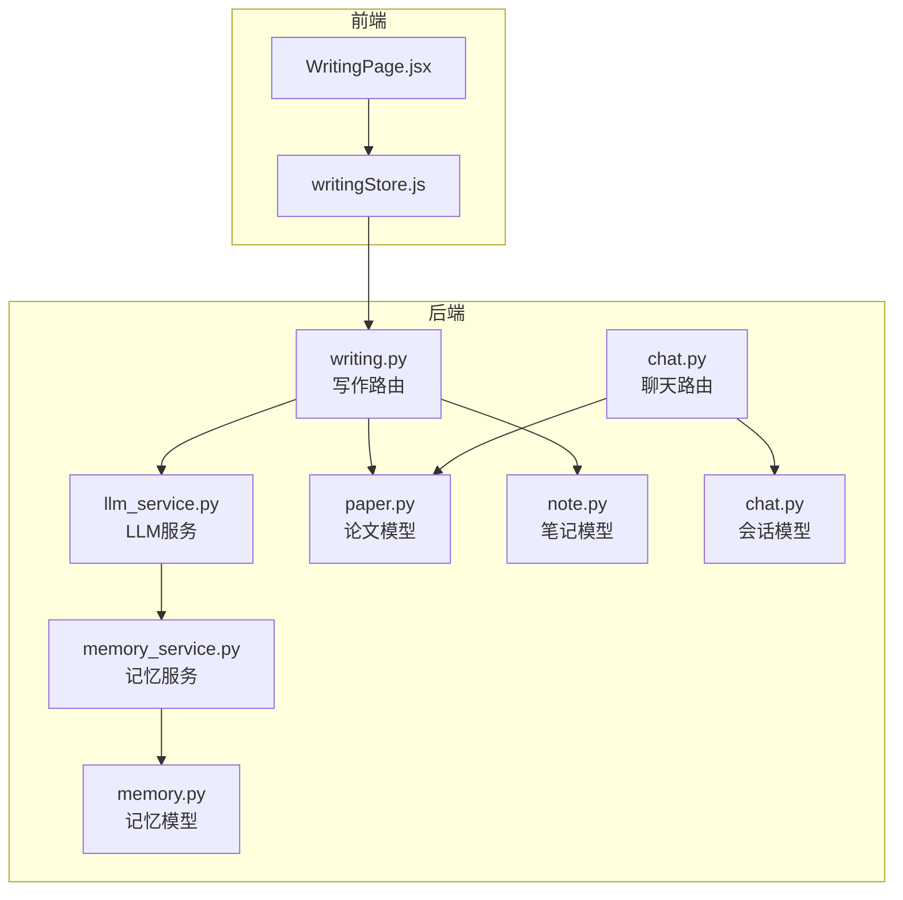
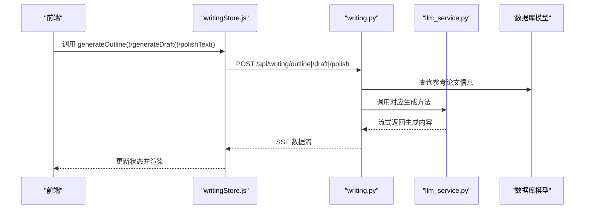
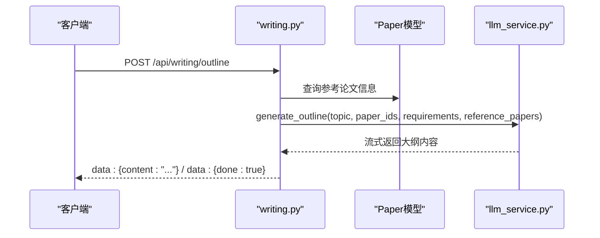
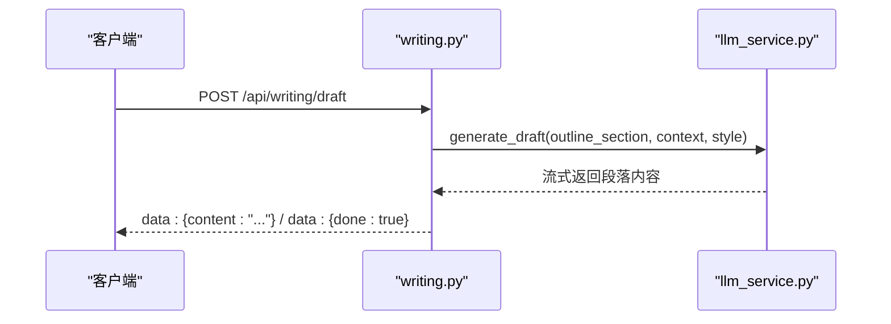
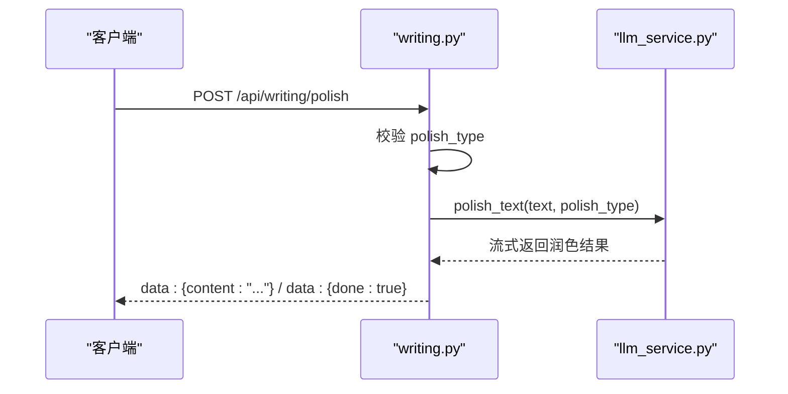
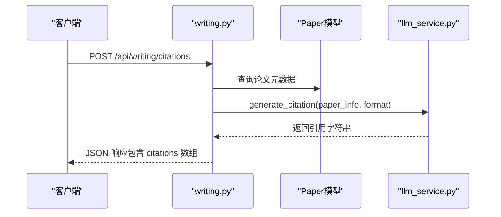
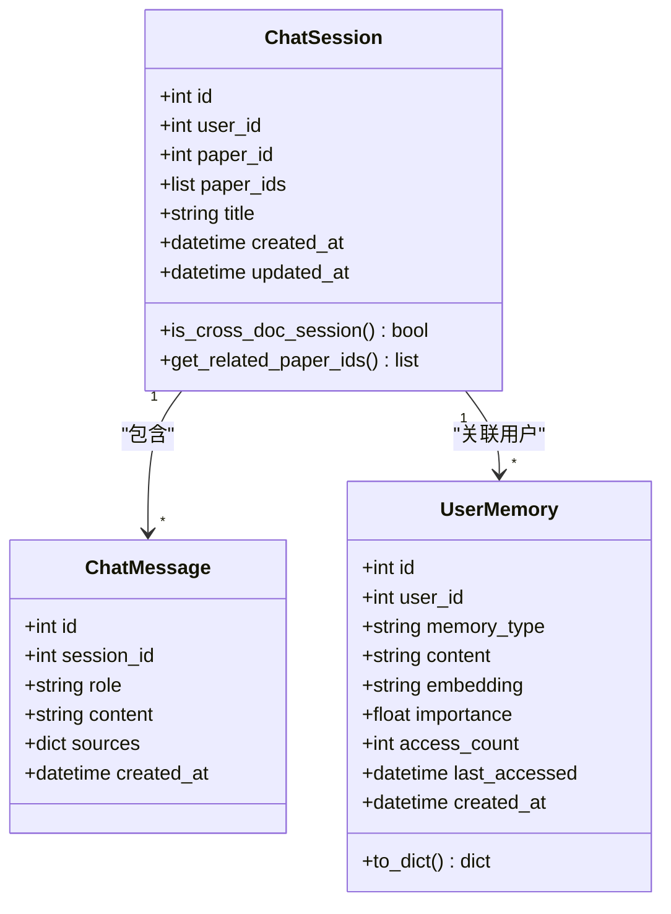
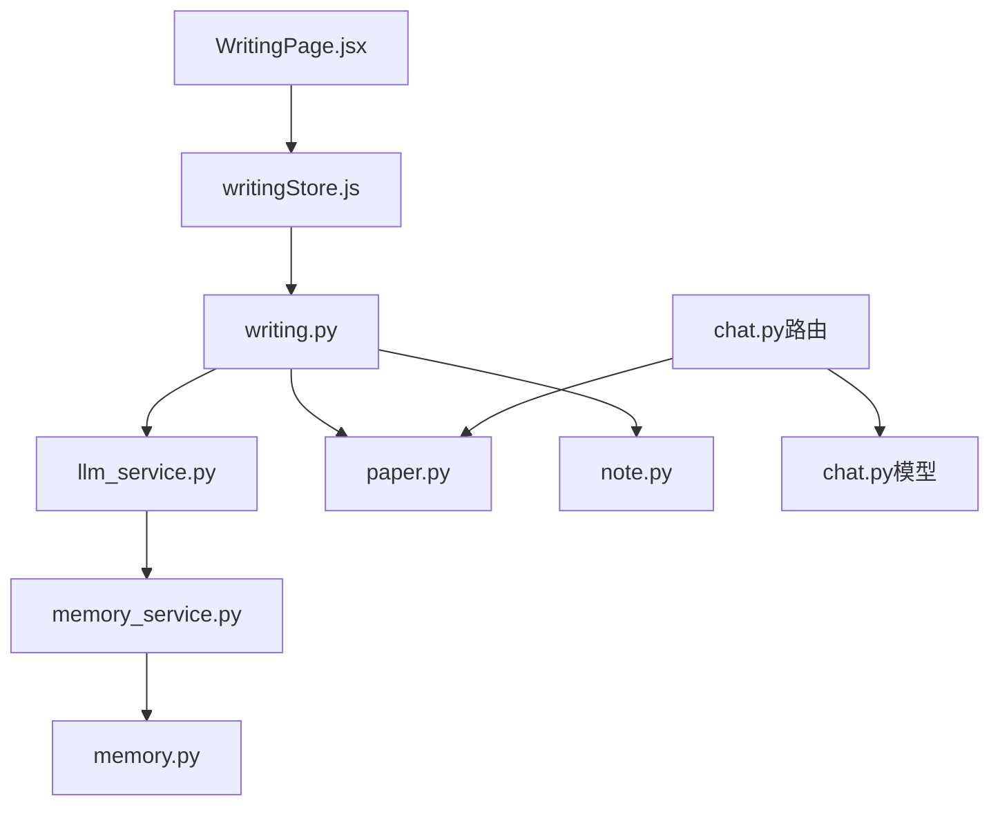

# 写作辅助 API

<cite>
**本文档引用的文件**
- [writing.py](file://backend/app/routers/writing.py)
- [llm_service.py](file://backend/app/services/llm/llm_service.py)
- [llm_service.py（兼容层）](file://backend/app/services/llm_service.py)
- [writingStore.js](file://frontend/src/stores/writingStore.js)
- [WritingPage.jsx](file://frontend/src/pages/WritingPage.jsx)
- [paper.py](file://backend/app/models/paper.py)
- [note.py](file://backend/app/models/note.py)
- [chat.py](file://backend/app/models/chat.py)
- [memory_service.py](file://backend/app/services/memory_service.py)
- [memory.py](file://backend/app/models/memory.py)
- [chat.py（路由）](file://backend/app/routers/chat.py)
</cite>

## 目录
1. [简介](#简介)
2. [项目结构](#项目结构)
3. [核心组件](#核心组件)
4. [架构概览](#架构概览)
5. [详细组件分析](#详细组件分析)
6. [依赖分析](#依赖分析)
7. [性能考虑](#性能考虑)
8. [故障排除指南](#故障排除指南)
9. [结论](#结论)
10. [附录](#附录)

## 简介
本文件为写作辅助系统的完整 API 文档，涵盖大纲生成、段落生成、学术润色、引用格式生成等核心写作功能。文档详细说明了写作模板、风格控制、内容优化的接口规范，以及写作进度跟踪、草稿管理、多轮对话与上下文保持机制。同时包含写作质量评估与建议生成的接口说明，帮助开发者和使用者全面理解和使用该系统。

## 项目结构
写作辅助系统采用前后端分离架构，后端基于 FastAPI 提供 RESTful API，前端使用 React + Zustand 管理状态。核心模块包括：
- 后端路由层：提供写作相关接口（大纲、段落、润色、引用）
- 服务层：LLM 服务封装、记忆服务、RAG 服务等
- 模型层：论文、笔记、会话、记忆等数据模型
- 前端状态管理：Zustand store 管理写作状态与流式数据

**图表来源**
- [writing.py:1-287](file://backend/app/routers/writing.py#L1-L287)
- [llm_service.py:1-727](file://backend/app/services/llm/llm_service.py#L1-L727)
- [writingStore.js:1-275](file://frontend/src/stores/writingStore.js#L1-L275)
- [WritingPage.jsx:1-800](file://frontend/src/pages/WritingPage.jsx#L1-L800)

**章节来源**
- [writing.py:1-287](file://backend/app/routers/writing.py#L1-L287)
- [llm_service.py:1-727](file://backend/app/services/llm/llm_service.py#L1-L727)
- [writingStore.js:1-275](file://frontend/src/stores/writingStore.js#L1-L275)

## 核心组件
- 写作路由（writing.py）：提供大纲生成、段落生成、学术润色、引用格式生成等接口，均采用流式响应（SSE）返回结果。
- LLM 服务（llm_service.py）：封装 DeepSeek 大模型调用，提供大纲生成、段落生成、润色、引用格式生成等方法。
- 前端 Store（writingStore.js）：管理写作状态（大纲、草稿、润色后文本、引用列表），处理流式数据接收与展示。
- 记忆服务（memory_service.py）：提供用户长期记忆的提取、存储、召回功能，增强上下文理解能力。
- 数据模型：论文、笔记、会话、记忆等模型支撑写作过程的数据持久化。

**章节来源**
- [writing.py:72-287](file://backend/app/routers/writing.py#L72-L287)
- [llm_service.py:29-727](file://backend/app/services/llm/llm_service.py#L29-L727)
- [writingStore.js:4-275](file://frontend/src/stores/writingStore.js#L4-L275)
- [memory_service.py:46-438](file://backend/app/services/memory_service.py#L46-L438)

## 架构概览
系统通过路由层接收前端请求，调用 LLM 服务生成内容，使用数据库模型存储论文、笔记、会话等数据。记忆服务在对话过程中增强上下文，提升生成质量。

**图表来源**
- [writing.py:72-184](file://backend/app/routers/writing.py#L72-L184)
- [llm_service.py:491-577](file://backend/app/services/llm/llm_service.py#L491-L577)
- [writingStore.js:37-222](file://frontend/src/stores/writingStore.js#L37-L222)

## 详细组件分析

### 写作接口规范

#### 大纲生成接口
- 路径：/api/writing/outline
- 方法：POST
- 请求体：
  - topic: 研究主题（必填）
  - paper_ids: 参考论文ID列表（可选）
  - requirements: 额外要求（可选）
- 响应：SSE 流式响应，包含 content（增量内容）和 done（结束标记），错误时返回 error。
- 上下文：若提供 paper_ids，会查询论文摘要作为参考上下文。

**图表来源**
- [writing.py:72-108](file://backend/app/routers/writing.py#L72-L108)
- [llm_service.py:491-534](file://backend/app/services/llm/llm_service.py#L491-L534)

**章节来源**
- [writing.py:22-108](file://backend/app/routers/writing.py#L22-L108)
- [llm_service.py:491-534](file://backend/app/services/llm/llm_service.py#L491-L534)

#### 段落生成接口
- 路径：/api/writing/draft
- 方法：POST
- 请求体：
  - outline_section: 大纲节点文本（必填）
  - context: 参考内容/上下文（可选）
  - style: 写作风格（academic/formal/concise，默认 academic）
- 响应：SSE 流式响应，包含 content、done、error。

**图表来源**
- [writing.py:111-139](file://backend/app/routers/writing.py#L111-L139)
- [llm_service.py:536-577](file://backend/app/services/llm/llm_service.py#L536-L577)

**章节来源**
- [writing.py:29-139](file://backend/app/routers/writing.py#L29-L139)
- [llm_service.py:536-577](file://backend/app/services/llm/llm_service.py#L536-L577)

#### 学术润色接口
- 路径：/api/writing/polish
- 方法：POST
- 请求体：
  - text: 待润色文本（必填）
  - polish_type: 润色类型（academic/grammar/fluency/concise，默认 academic）
- 响应：SSE 流式响应，包含 content、done、error。
- 错误处理：校验 polish_type，不支持的类型返回 400。

**图表来源**
- [writing.py:142-184](file://backend/app/routers/writing.py#L142-L184)
- [llm_service.py:579-614](file://backend/app/services/llm/llm_service.py#L579-L614)

**章节来源**
- [writing.py:36-184](file://backend/app/routers/writing.py#L36-L184)
- [llm_service.py:579-614](file://backend/app/services/llm/llm_service.py#L579-L614)

#### 引用格式生成接口
- 路径：/api/writing/citations
- 方法：POST
- 请求体：
  - paper_ids: 论文ID列表（必填）
  - format: 引用格式（apa/mla/chicago/gbt7714，默认 apa）
- 响应：非流式，返回格式列表、总数和每条引用的生成结果（包含错误信息）。
- 错误处理：校验 format；对每篇论文单独生成，失败时返回错误信息。

**图表来源**
- [writing.py:187-262](file://backend/app/routers/writing.py#L187-L262)
- [llm_service.py:616-676](file://backend/app/services/llm/llm_service.py#L616-L676)

**章节来源**
- [writing.py:42-262](file://backend/app/routers/writing.py#L42-L262)
- [llm_service.py:616-676](file://backend/app/services/llm/llm_service.py#L616-L676)

#### 支持格式查询接口
- 路径：/api/writing/formats
- 方法：GET
- 响应：返回支持的引用格式、润色类型和写作风格列表。

**章节来源**
- [writing.py:265-286](file://backend/app/routers/writing.py#L265-L286)

### 写作模板与风格控制
- 大纲生成模板：基于主题、参考论文摘要和额外要求生成结构化大纲。
- 段落生成模板：根据大纲节点、参考内容和写作风格生成学术段落。
- 润色模板：根据文本和润色类型（学术表达、语法修正、流畅性、精简）进行优化。
- 引用格式模板：内置多种格式模板，支持直接生成引用字符串。

**章节来源**
- [llm_service.py:491-676](file://backend/app/services/llm/llm_service.py#L491-L676)

### 内容优化与质量评估
- 内容优化：通过润色接口对文本进行学术表达、语法、流畅性和简洁性的优化。
- 质量评估：系统支持对论文进行多维度质量评估（创新性、方法论、实验设计、数据分析、结论可信度、写作规范性），并提供改进建议。

**章节来源**
- [llm_service.py:579-614](file://backend/app/services/llm/llm_service.py#L579-L614)
- [memory_service.py:248-311](file://backend/app/services/memory_service.py#L248-L311)

### 写作进度跟踪与草稿管理
- 进度跟踪：所有生成接口均采用 SSE 流式响应，前端实时接收增量内容并更新界面。
- 草稿管理：前端 Store 维护 outline、draft、polishedText 等状态，支持导出为 Markdown 文件。
- 前端实现：WritingPage.jsx 提供大纲、段落、润色、引用四个标签页，分别调用对应接口。

**章节来源**
- [writingStore.js:4-275](file://frontend/src/stores/writingStore.js#L4-L275)
- [WritingPage.jsx:35-414](file://frontend/src/pages/WritingPage.jsx#L35-L414)

### 多轮对话与上下文保持
- 会话管理：后端提供聊天会话接口，支持创建、查询、更新、删除会话，以及消息历史查询。
- 上下文保持：LLM 服务在问答过程中维护对话历史，支持基于 RAG 的精准上下文检索。
- 记忆增强：记忆服务在对话中召回用户长期记忆，增强个性化回答质量。

**图表来源**
- [chat.py:14-71](file://backend/app/models/chat.py#L14-L71)
- [memory.py:14-54](file://backend/app/models/memory.py#L14-L54)

**章节来源**
- [chat.py（路由）:21-417](file://backend/app/routers/chat.py#L21-L417)
- [chat.py:14-71](file://backend/app/models/chat.py#L14-L71)
- [memory_service.py:46-438](file://backend/app/services/memory_service.py#L46-L438)

## 依赖分析
- 写作路由依赖 LLM 服务进行内容生成，依赖数据库模型进行论文信息查询。
- LLM 服务依赖 LangChain 和 DeepSeek API，提供流式生成能力。
- 前端 Store 依赖后端 API，通过 fetch 和 SSE 接收流式数据。
- 记忆服务与会话模型配合，实现长期记忆的存储与召回。

**图表来源**
- [writing.py:1-287](file://backend/app/routers/writing.py#L1-L287)
- [llm_service.py:1-727](file://backend/app/services/llm/llm_service.py#L1-L727)
- [paper.py:1-85](file://backend/app/models/paper.py#L1-L85)
- [note.py:1-34](file://backend/app/models/note.py#L1-L34)
- [memory_service.py:1-438](file://backend/app/services/memory_service.py#L1-L438)
- [memory.py:1-54](file://backend/app/models/memory.py#L1-L54)
- [chat.py（路由）:1-417](file://backend/app/routers/chat.py#L1-L417)
- [chat.py:1-71](file://backend/app/models/chat.py#L1-L71)
- [writingStore.js:1-275](file://frontend/src/stores/writingStore.js#L1-L275)
- [WritingPage.jsx:1-800](file://frontend/src/pages/WritingPage.jsx#L1-L800)

**章节来源**
- [writing.py:1-287](file://backend/app/routers/writing.py#L1-L287)
- [llm_service.py:1-727](file://backend/app/services/llm/llm_service.py#L1-L727)
- [writingStore.js:1-275](file://frontend/src/stores/writingStore.js#L1-L275)

## 性能考虑
- 流式响应：所有生成接口采用 SSE 流式返回，减少等待时间，提升用户体验。
- 上下文优化：段落生成和润色接口支持风格控制和上下文注入，提高生成质量。
- 记忆服务：通过向量相似度召回用户记忆，增强个性化回答，避免重复检索。
- 错误处理：接口对无效输入进行校验并返回明确错误信息，便于前端处理。

[本节为一般性指导，无需具体文件分析]

## 故障排除指南
- API Key 配置：确保后端配置了有效的 DeepSeek API Key，避免流式调用失败。
- 网络连接：检查前端与后端的网络连接，确保 SSE 流式数据能够正常传输。
- 输入参数：确认请求体参数格式正确，特别是 polish_type 和 format 的取值范围。
- 数据权限：确保论文 ID 属于当前登录用户，避免无权限访问导致的错误。

**章节来源**
- [llm_service.py:49-127](file://backend/app/services/llm/llm_service.py#L49-L127)
- [writing.py:155-161](file://backend/app/routers/writing.py#L155-L161)
- [writing.py:201-207](file://backend/app/routers/writing.py#L201-L207)

## 结论
写作辅助系统通过完善的 API 设计和流式响应机制，为用户提供从大纲生成到段落撰写、从学术润色到引用格式生成的一站式写作体验。结合记忆服务与会话管理，系统能够在多轮对话中保持上下文一致性，提升生成质量与个性化程度。开发者可根据本文档快速集成与扩展相关功能。

[本节为总结性内容，无需具体文件分析]

## 附录

### 接口一览表
- GET /api/writing/formats：获取支持的引用格式、润色类型和写作风格
- POST /api/writing/outline：生成论文大纲（流式）
- POST /api/writing/draft：生成段落初稿（流式）
- POST /api/writing/polish：学术润色（流式）
- POST /api/writing/citations：批量生成引用格式（非流式）

**章节来源**
- [writing.py:72-286](file://backend/app/routers/writing.py#L72-L286)