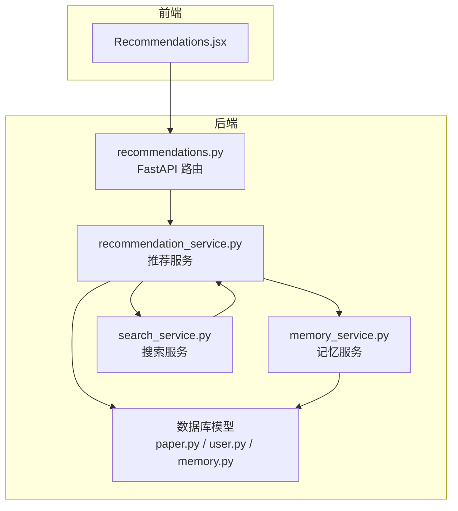
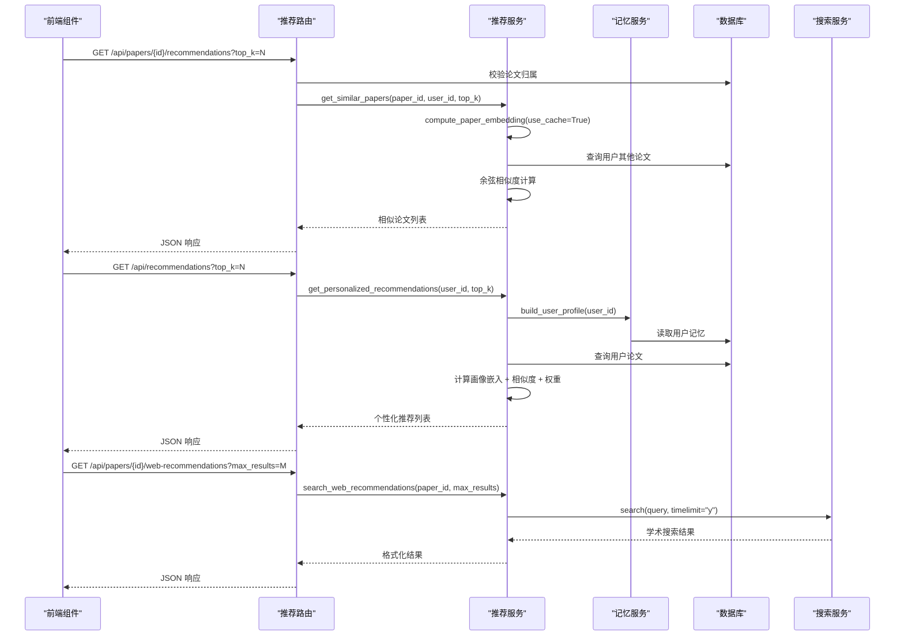
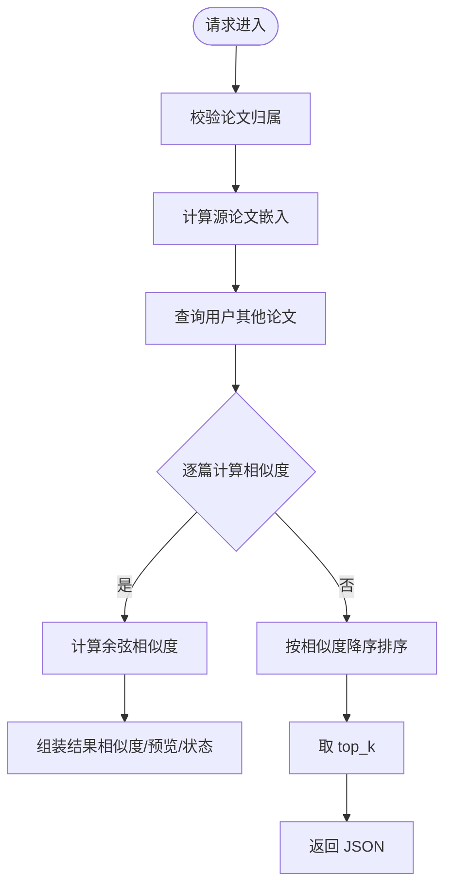
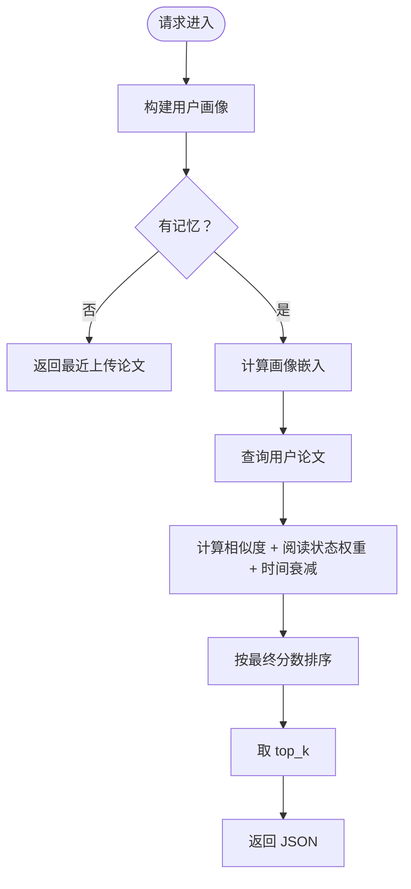
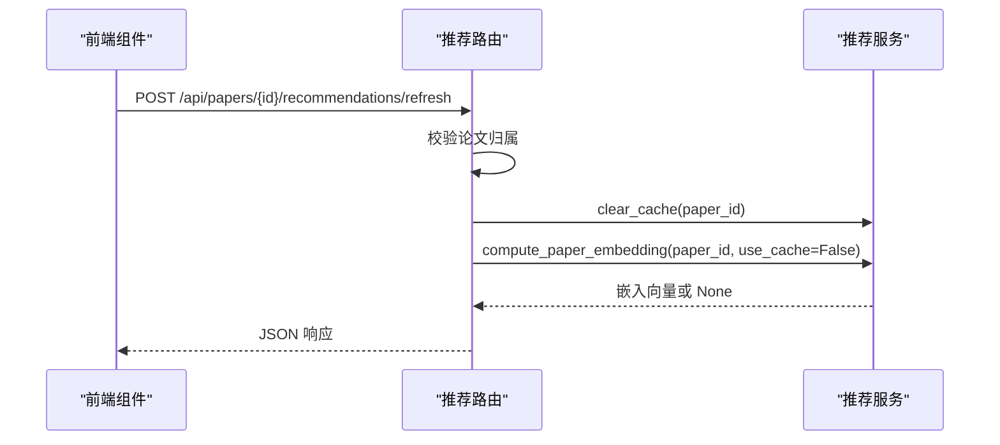
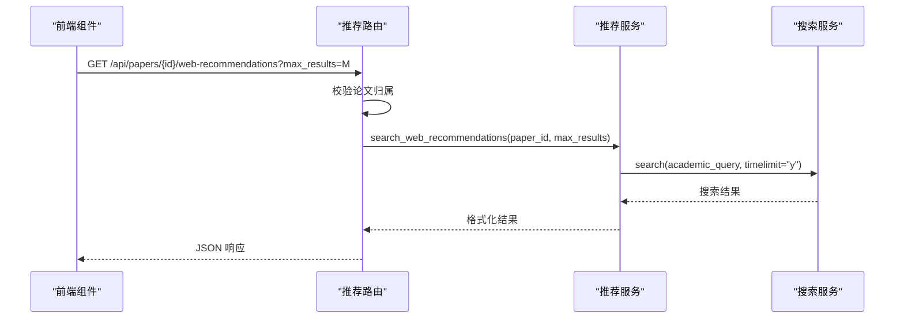
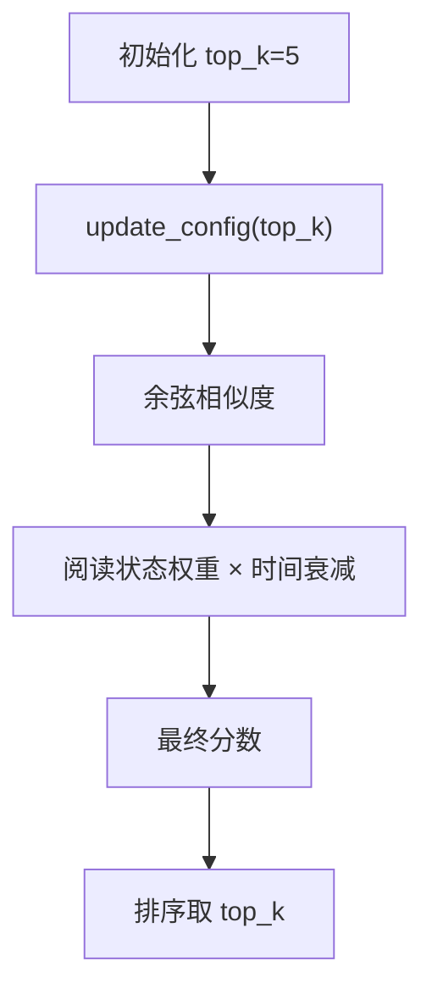
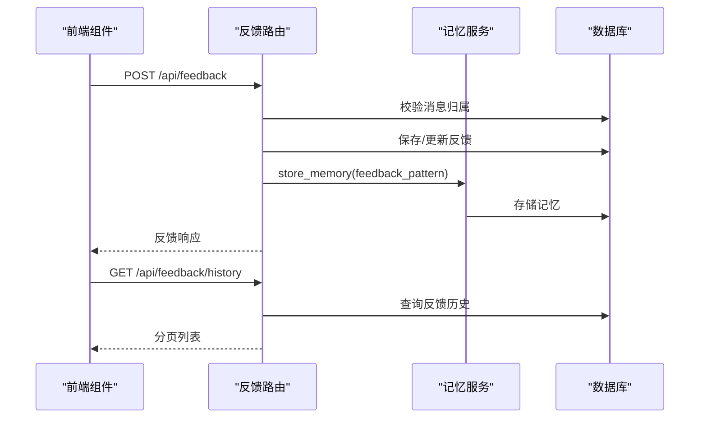
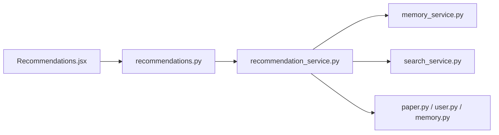
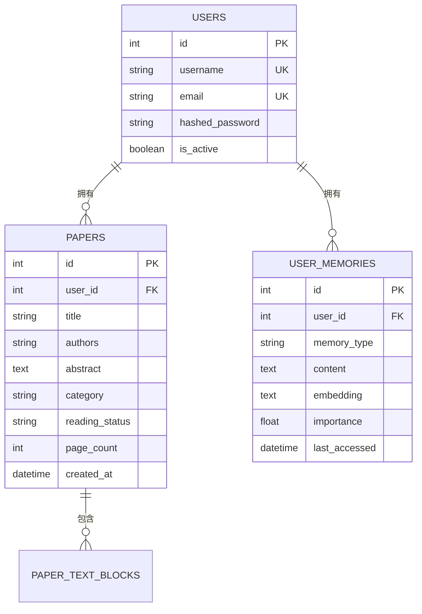

# 推荐系统 API

<cite>
**本文引用的文件**
- [recommendations.py](file://backend/app/routers/recommendations.py)
- [recommendation_service.py](file://backend/app/services/recommendation_service.py)
- [paper.py](file://backend/app/models/paper.py)
- [user.py](file://backend/app/models/user.py)
- [memory.py](file://backend/app/models/memory.py)
- [memory_service.py](file://backend/app/services/memory_service.py)
- [search_service.py](file://backend/app/services/search_service.py)
- [feedback.py](file://backend/app/routers/feedback.py)
- [paper_schemas.py](file://backend/app/schemas/paper.py)
- [user_schemas.py](file://backend/app/schemas/user.py)
- [config.py](file://backend/app/config.py)
- [Recommendations.jsx](file://frontend/src/components/Recommendations/Recommendations.jsx)
</cite>

## 目录
1. [简介](#简介)
2. [项目结构](#项目结构)
3. [核心组件](#核心组件)
4. [架构总览](#架构总览)
5. [详细组件分析](#详细组件分析)
6. [依赖分析](#依赖分析)
7. [性能考虑](#性能考虑)
8. [故障排查指南](#故障排查指南)
9. [结论](#结论)
10. [附录](#附录)

## 简介
本文件为推荐系统的完整 API 文档，覆盖论文相似度推荐、个性化推荐、混合策略（内容+画像）、网络学术搜索、推荐配置与权重调整、结果排序、推荐历史与反馈收集，以及推荐效果评估与 A/B 测试的接口说明。系统采用 FastAPI 构建后端，前端 React 组件负责展示与交互。

## 项目结构
后端采用分层设计：
- 路由层：定义 REST API 端点（论文推荐、个性化推荐、网络搜索、反馈）
- 服务层：实现推荐算法、嵌入计算、画像构建、网络搜索、记忆管理
- 模型层：SQLAlchemy ORM 定义论文、用户、记忆等实体
- 前端组件：React 展示推荐卡片、网络搜索结果、交互操作

图表来源
- [recommendations.py:1-234](file://backend/app/routers/recommendations.py#L1-L234)
- [recommendation_service.py:1-565](file://backend/app/services/recommendation_service.py#L1-L565)
- [memory_service.py:1-438](file://backend/app/services/memory_service.py#L1-L438)
- [search_service.py:1-113](file://backend/app/services/search_service.py#L1-L113)
- [paper.py:1-85](file://backend/app/models/paper.py#L1-L85)
- [user.py:1-36](file://backend/app/models/user.py#L1-L36)
- [memory.py:1-54](file://backend/app/models/memory.py#L1-L54)

章节来源
- [recommendations.py:1-234](file://backend/app/routers/recommendations.py#L1-L234)
- [recommendation_service.py:1-565](file://backend/app/services/recommendation_service.py#L1-L565)
- [paper.py:1-85](file://backend/app/models/paper.py#L1-L85)
- [user.py:1-36](file://backend/app/models/user.py#L1-L36)
- [memory.py:1-54](file://backend/app/models/memory.py#L1-L54)
- [memory_service.py:1-438](file://backend/app/services/memory_service.py#L1-L438)
- [search_service.py:1-113](file://backend/app/services/search_service.py#L1-L113)
- [Recommendations.jsx:1-265](file://frontend/src/components/Recommendations/Recommendations.jsx#L1-L265)

## 核心组件
- 推荐路由：提供相似论文推荐、个性化推荐、刷新缓存、网络学术搜索接口
- 推荐服务：实现内容相似度（余弦相似度）、个性化推荐（画像+阅读状态+时间衰减）、嵌入缓存与清理
- 记忆服务：LLM 提取用户记忆、向量化、召回、画像构建、记忆衰减
- 搜索服务：集成 DuckDuckGo 的网络搜索，带缓存与超时控制
- 数据模型：论文、用户、记忆实体及关系
- 前端组件：推荐卡片渲染、网络搜索区域、交互按钮

章节来源
- [recommendations.py:18-234](file://backend/app/routers/recommendations.py#L18-L234)
- [recommendation_service.py:20-565](file://backend/app/services/recommendation_service.py#L20-L565)
- [memory_service.py:46-438](file://backend/app/services/memory_service.py#L46-L438)
- [search_service.py:10-113](file://backend/app/services/search_service.py#L10-L113)
- [paper.py:11-85](file://backend/app/models/paper.py#L11-L85)
- [user.py:11-36](file://backend/app/models/user.py#L11-L36)
- [memory.py:14-54](file://backend/app/models/memory.py#L14-L54)
- [Recommendations.jsx:28-265](file://frontend/src/components/Recommendations/Recommendations.jsx#L28-L265)

## 架构总览
推荐系统采用“内容相似 + 个性化画像”的混合策略：
- 内容相似：对论文文本块组合计算嵌入，使用余弦相似度排序
- 个性化：基于用户记忆构建画像，结合阅读状态权重与时间衰减
- 网络扩展：通过学术搜索引擎补充外部高质量论文
- 缓存优化：嵌入向量与搜索结果缓存，提升响应速度

图表来源
- [recommendations.py:18-234](file://backend/app/routers/recommendations.py#L18-L234)
- [recommendation_service.py:150-560](file://backend/app/services/recommendation_service.py#L150-L560)
- [memory_service.py:312-357](file://backend/app/services/memory_service.py#L312-L357)
- [search_service.py:41-113](file://backend/app/services/search_service.py#L41-L113)

## 详细组件分析

### 相似论文推荐接口
- 端点：GET /api/papers/{paper_id}/recommendations
- 功能：基于内容相似度（余弦相似度）推荐与当前论文相似的其他论文
- 参数：
  - 路径参数：paper_id（当前论文 ID）
  - 查询参数：top_k（默认 5，范围 1-20）
- 行为：
  - 校验论文归属（当前用户）
  - 计算源论文嵌入，遍历用户其他论文计算相似度
  - 返回包含相似度百分比、摘要预览、阅读状态、页数、分类等字段的列表
- 性能：
  - 首次嵌入计算约 100-200ms/篇，结果缓存
  - 100 篇论文的相似度计算约 200ms

图表来源
- [recommendations.py:18-76](file://backend/app/routers/recommendations.py#L18-L76)
- [recommendation_service.py:150-258](file://backend/app/services/recommendation_service.py#L150-L258)

章节来源
- [recommendations.py:18-76](file://backend/app/routers/recommendations.py#L18-L76)
- [recommendation_service.py:150-258](file://backend/app/services/recommendation_service.py#L150-L258)

### 个性化论文推荐接口
- 端点：GET /api/recommendations
- 功能：基于用户画像（研究兴趣、术语使用、背景等）与阅读状态进行个性化推荐
- 参数：
  - 查询参数：top_k（默认 5，范围 1-20）
- 行为：
  - 构建用户画像文本，计算画像嵌入
  - 与用户所有论文计算相似度，叠加阅读状态权重与时间衰减
  - 若无画像，则返回最近上传论文
  - 返回包含匹配原因、相似度、摘要预览、阅读状态等字段的列表
- 性能：
  - 依赖画像构建（约 300ms），嵌入计算约 100-200ms/篇
  - 无画像时返回最近上传论文

图表来源
- [recommendations.py:78-118](file://backend/app/routers/recommendations.py#L78-L118)
- [recommendation_service.py:259-399](file://backend/app/services/recommendation_service.py#L259-L399)

章节来源
- [recommendations.py:78-118](file://backend/app/routers/recommendations.py#L78-L118)
- [recommendation_service.py:259-399](file://backend/app/services/recommendation_service.py#L259-L399)

### 刷新论文推荐缓存接口
- 端点：POST /api/papers/{paper_id}/recommendations/refresh
- 功能：清除指定论文嵌入缓存并重新计算，适用于论文内容更新后
- 参数：
  - 路径参数：paper_id
- 行为：
  - 校验论文归属
  - 清理缓存并重新计算嵌入
  - 返回成功/失败状态与论文 ID

图表来源
- [recommendations.py:121-178](file://backend/app/routers/recommendations.py#L121-L178)
- [recommendation_service.py:487-497](file://backend/app/services/recommendation_service.py#L487-L497)

章节来源
- [recommendations.py:121-178](file://backend/app/routers/recommendations.py#L121-L178)
- [recommendation_service.py:487-497](file://backend/app/services/recommendation_service.py#L487-L497)

### 网络学术搜索接口
- 端点：GET /api/papers/{paper_id}/web-recommendations
- 功能：基于论文标题从 arXiv、Google Scholar、ResearchGate、Semantic Scholar 等学术站点搜索相关文献
- 参数：
  - 路径参数：paper_id
  - 查询参数：max_results（默认 8，范围 1-20）
- 行为：
  - 校验论文归属
  - 构建学术查询（限定学术站点与时效一年）
  - 调用搜索服务，格式化结果（标题、链接、摘要、来源）
- 性能：
  - 网络搜索约 3-5 秒延迟，结果缓存

图表来源
- [recommendations.py:180-234](file://backend/app/routers/recommendations.py#L180-L234)
- [recommendation_service.py:498-561](file://backend/app/services/recommendation_service.py#L498-L561)
- [search_service.py:41-113](file://backend/app/services/search_service.py#L41-L113)

章节来源
- [recommendations.py:180-234](file://backend/app/routers/recommendations.py#L180-L234)
- [recommendation_service.py:498-561](file://backend/app/services/recommendation_service.py#L498-L561)
- [search_service.py:41-113](file://backend/app/services/search_service.py#L41-L113)

### 推荐算法配置与权重调整
- 运行时配置：
  - 推荐数量 top_k：可通过服务层方法动态更新
- 权重与排序：
  - 相似度：余弦相似度转百分比
  - 阅读状态权重：未读 1.2、阅读中 1.1、已完成 0.8
  - 时间衰减：论文创建时间越近权重越高（一年内从 1.0 衰减到 0.8）
- 嵌入缓存：
  - 内存级缓存，支持按论文 ID 清理或全量清理

图表来源
- [recommendation_service.py:35-43](file://backend/app/services/recommendation_service.py#L35-L43)
- [recommendation_service.py:337-350](file://backend/app/services/recommendation_service.py#L337-L350)
- [recommendation_service.py:487-497](file://backend/app/services/recommendation_service.py#L487-L497)

章节来源
- [recommendation_service.py:35-43](file://backend/app/services/recommendation_service.py#L35-L43)
- [recommendation_service.py:337-350](file://backend/app/services/recommendation_service.py#L337-L350)
- [recommendation_service.py:487-497](file://backend/app/services/recommendation_service.py#L487-L497)

### 推荐历史记录与反馈收集
- 反馈路由：
  - 提交反馈：POST /api/feedback（rating: 1 或 -1，可选 comment）
  - 获取反馈统计：GET /api/feedback/stats
  - 获取指定消息反馈：GET /api/feedback/message/{message_id}
  - 反馈历史：GET /api/feedback/history?limit&offset
  - 负面反馈自动重跑：POST /api/feedback/regenerate/{message_id}
- 行为：
  - 校验消息归属（同一会话用户）
  - 收集差评到记忆中，用于学习用户偏好
  - 自动重跑时结合记忆与检索增强生成新回答

图表来源
- [feedback.py:50-136](file://backend/app/routers/feedback.py#L50-L136)
- [feedback.py:138-171](file://backend/app/routers/feedback.py#L138-L171)
- [feedback.py:173-203](file://backend/app/routers/feedback.py#L173-L203)
- [feedback.py:205-363](file://backend/app/routers/feedback.py#L205-L363)
- [feedback.py:365-408](file://backend/app/routers/feedback.py#L365-L408)
- [memory_service.py:156-225](file://backend/app/services/memory_service.py#L156-L225)

章节来源
- [feedback.py:50-136](file://backend/app/routers/feedback.py#L50-L136)
- [feedback.py:138-171](file://backend/app/routers/feedback.py#L138-L171)
- [feedback.py:173-203](file://backend/app/routers/feedback.py#L173-L203)
- [feedback.py:205-363](file://backend/app/routers/feedback.py#L205-L363)
- [feedback.py:365-408](file://backend/app/routers/feedback.py#L365-L408)
- [memory_service.py:156-225](file://backend/app/services/memory_service.py#L156-L225)

### 协同过滤与内容推荐的混合策略
- 内容推荐：基于论文文本嵌入与余弦相似度
- 个性化推荐：基于用户记忆画像与阅读状态权重、时间衰减
- 混合策略建议：
  - 将内容相似度与个性化分数加权融合（例如 0.6×内容 + 0.4×个性化）
  - 引入“新颖性”权重，鼓励推荐用户未见过但高匹配的论文
  - 引入“多样性”约束，避免推荐过于相似的论文

[本节为概念性说明，不直接分析具体文件]

### 推荐效果评估与 A/B 测试
- 评估指标建议：
  - 点击率（CTR）、转化率（打开/完成阅读）、平均停留时长
  - 用户反馈评分分布（好评率、差评率）
  - 多样性与新颖性（覆盖率、基尼系数）
- A/B 测试方案：
  - 将用户随机分为两组：对照组（仅内容推荐）vs 实验组（混合策略）
  - 对比关键指标差异，使用统计检验判断显著性
  - 前端组件支持切换不同推荐策略（通过路由参数或配置）

[本节为概念性说明，不直接分析具体文件]

## 依赖分析
- 路由依赖服务：recommendations.py 依赖 recommendation_service
- 推荐服务依赖：
  - memory_service（画像构建、嵌入模型）
  - search_service（网络学术搜索）
  - SQLAlchemy 模型（Paper、User、UserMemory）
- 前端依赖后端接口：Recommendations.jsx 调用相似推荐、网络搜索接口

图表来源
- [recommendations.py:1-234](file://backend/app/routers/recommendations.py#L1-L234)
- [recommendation_service.py:1-565](file://backend/app/services/recommendation_service.py#L1-L565)
- [memory_service.py:1-438](file://backend/app/services/memory_service.py#L1-L438)
- [search_service.py:1-113](file://backend/app/services/search_service.py#L1-L113)
- [paper.py:1-85](file://backend/app/models/paper.py#L1-L85)
- [user.py:1-36](file://backend/app/models/user.py#L1-36)
- [memory.py:1-54](file://backend/app/models/memory.py#L1-L54)
- [Recommendations.jsx:1-265](file://frontend/src/components/Recommendations/Recommendations.jsx#L1-L265)

章节来源
- [recommendations.py:1-234](file://backend/app/routers/recommendations.py#L1-L234)
- [recommendation_service.py:1-565](file://backend/app/services/recommendation_service.py#L1-L565)
- [memory_service.py:1-438](file://backend/app/services/memory_service.py#L1-L438)
- [search_service.py:1-113](file://backend/app/services/search_service.py#L1-L113)
- [paper.py:1-85](file://backend/app/models/paper.py#L1-L85)
- [user.py:1-36](file://backend/app/models/user.py#L1-L36)
- [memory.py:1-54](file://backend/app/models/memory.py#L1-L54)
- [Recommendations.jsx:1-265](file://frontend/src/components/Recommendations/Recommendations.jsx#L1-L265)

## 性能考虑
- 嵌入缓存：内存级缓存显著减少重复计算；支持按论文 ID 清理
- 搜索缓存：搜索服务维护 LRU 缓存，避免重复网络请求
- 并发执行：嵌入计算与相似度计算使用线程池异步执行
- 限流与超时：搜索服务设置超时时间，防止阻塞
- 前端懒加载：推荐组件按需加载，网络搜索按钮触发

[本节提供通用指导，不直接分析具体文件]

## 故障排查指南
- 嵌入计算失败：
  - 检查论文文本长度是否足够（少于 50 字将返回 None）
  - 确认嵌入模型可用与缓存状态
- 相似度为空：
  - 确认用户存在其他论文
  - 检查缓存是否命中
- 网络搜索异常：
  - 查看搜索服务日志与超时设置
  - 检查学术查询构造与站点可用性
- 反馈无效：
  - 确认消息归属与用户权限
  - 检查重复提交逻辑与数据库事务

章节来源
- [recommendation_service.py:104-128](file://backend/app/services/recommendation_service.py#L104-L128)
- [recommendation_service.py:195-196](file://backend/app/services/recommendation_service.py#L195-L196)
- [search_service.py:68-103](file://backend/app/services/search_service.py#L68-L103)
- [feedback.py:67-84](file://backend/app/routers/feedback.py#L67-L84)

## 结论
该推荐系统通过“内容相似 + 个性化画像”的混合策略，结合嵌入缓存与网络学术搜索，提供了高效、可扩展的论文推荐能力。配合反馈收集与历史记录，可形成闭环优化。建议在生产环境中引入 A/B 测试与评估指标体系，持续迭代推荐算法与权重配置。

## 附录

### 数据模型概览

图表来源
- [paper.py:11-85](file://backend/app/models/paper.py#L11-L85)
- [user.py:11-36](file://backend/app/models/user.py#L11-L36)
- [memory.py:14-54](file://backend/app/models/memory.py#L14-L54)

### 前端组件交互要点
- 相似度与匹配原因可视化：根据相似度百分比设置颜色与徽标
- 网络搜索区域：点击按钮触发搜索，外部链接在新窗口打开
- 刷新推荐：调用刷新缓存接口，重新计算嵌入

章节来源
- [Recommendations.jsx:55-84](file://frontend/src/components/Recommendations/Recommendations.jsx#L55-L84)
- [Recommendations.jsx:206-259](file://frontend/src/components/Recommendations/Recommendations.jsx#L206-L259)