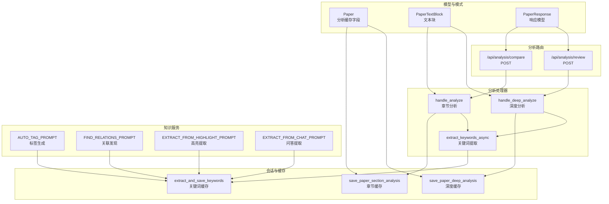
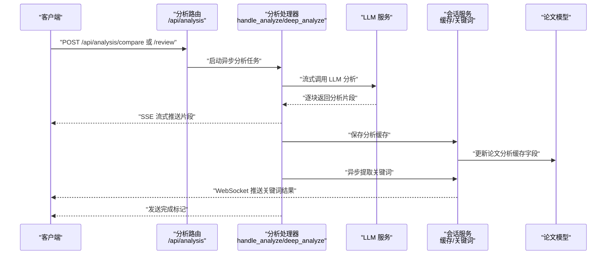
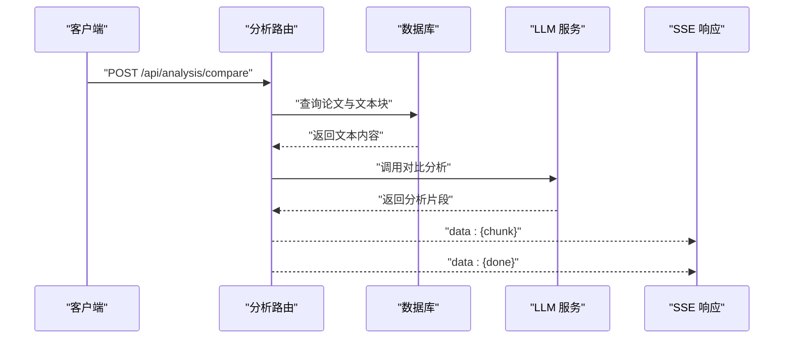
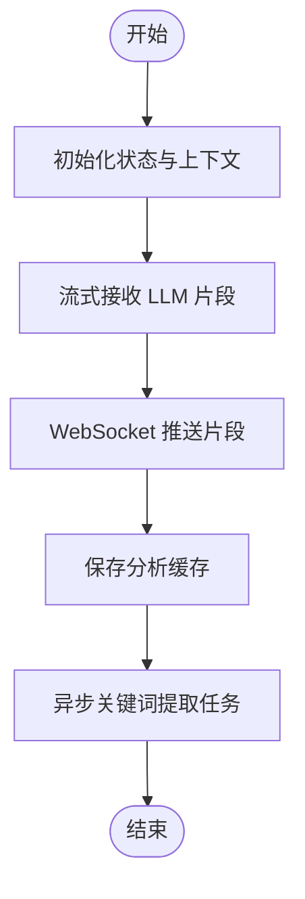
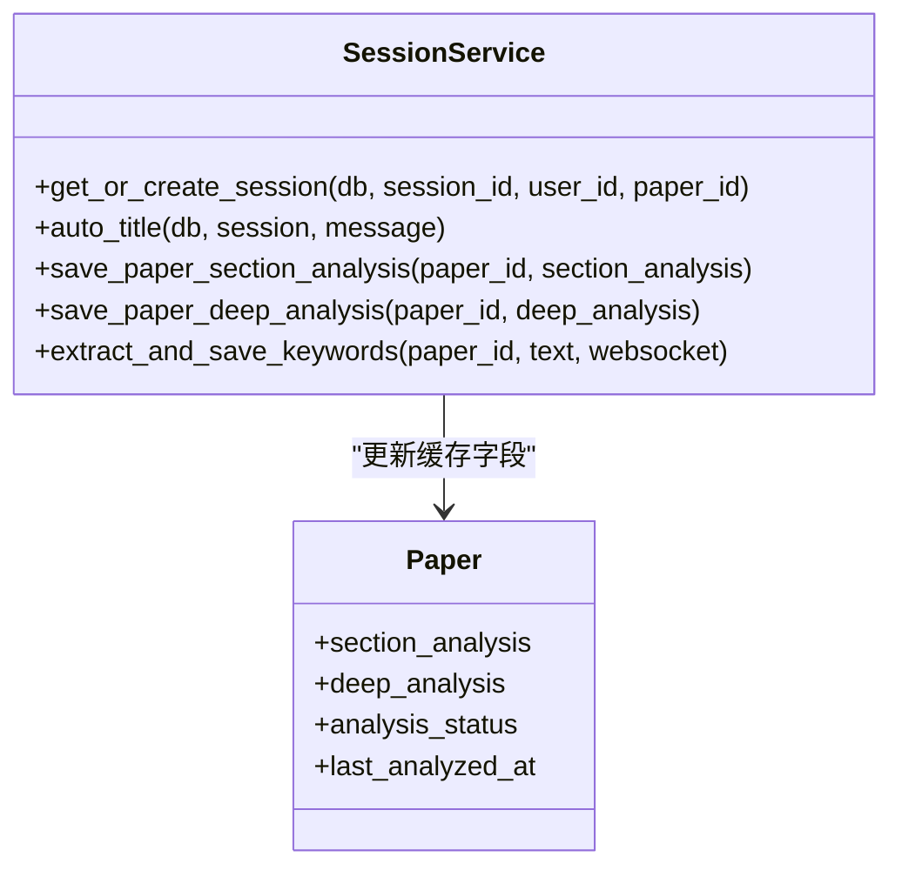
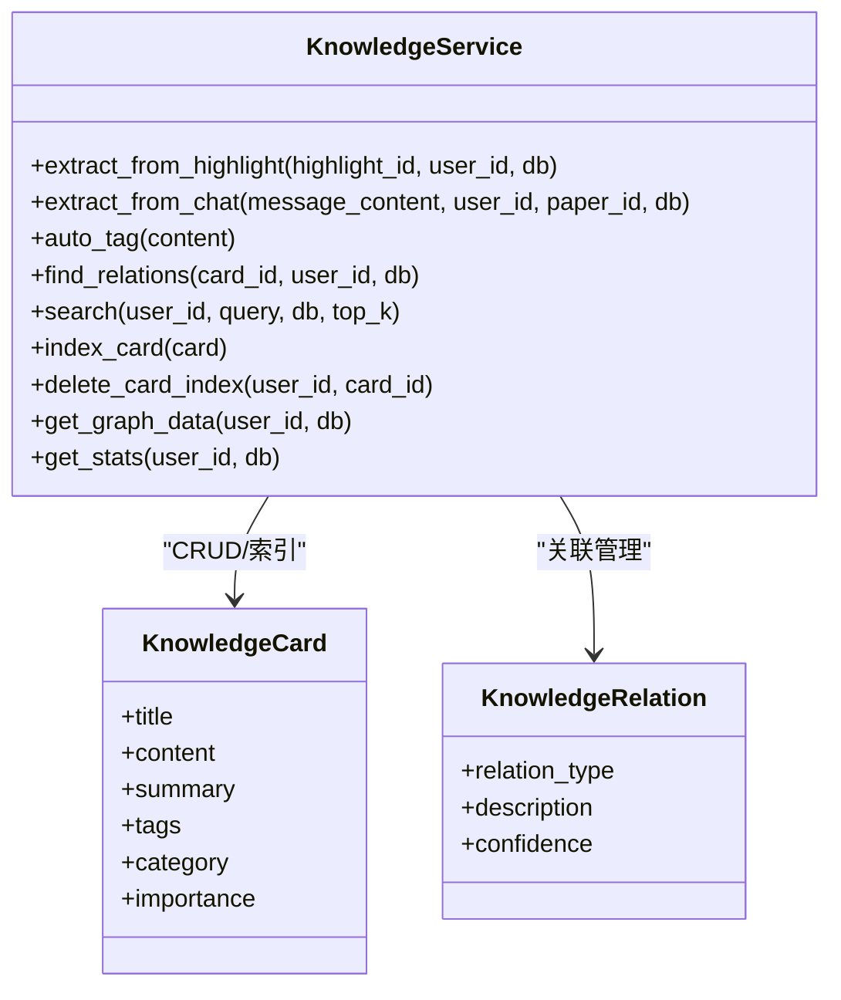
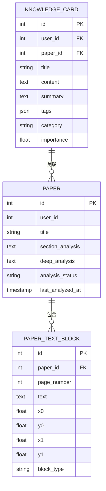
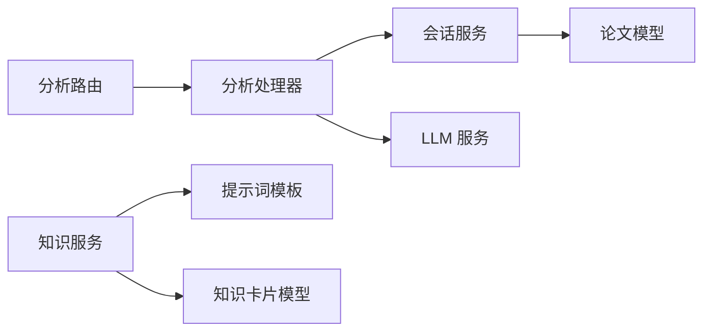

# 智能分析 API

<cite>
**本文引用的文件**
- [backend/app/routers/analysis.py](file://backend/app/routers/analysis.py)
- [backend/app/handlers/analyze_handler.py](file://backend/app/handlers/analyze_handler.py)
- [backend/app/handlers/rag_handler.py](file://backend/app/handlers/rag_handler.py)
- [backend/app/services/session_service.py](file://backend/app/services/session_service.py)
- [backend/app/services/knowledge_service.py](file://backend/app/services/knowledge_service.py)
- [backend/app/models/paper.py](file://backend/app/models/paper.py)
- [backend/app/schemas/paper.py](file://backend/app/schemas/paper.py)
- [backend/app/routers/knowledge.py](file://backend/app/routers/knowledge.py)
- [backend/app/models/knowledge.py](file://backend/app/models/knowledge.py)
- [backend/app/routers/writing.py](file://backend/app/routers/writing.py)
- [backend/app/routers/recommendations.py](file://backend/app/routers/recommendations.py)
- [backend/app/services/llm_service.py](file://backend/app/services/llm_service.py)
</cite>

## 目录
1. [简介](#简介)
2. [项目结构](#项目结构)
3. [核心组件](#核心组件)
4. [架构总览](#架构总览)
5. [详细组件分析](#详细组件分析)
6. [依赖分析](#依赖分析)
7. [性能考量](#性能考量)
8. [故障排查指南](#故障排查指南)
9. [结论](#结论)
10. [附录](#附录)

## 简介
本文件为智能分析系统的完整 API 文档，聚焦论文结构化解析、深度分析报告与关键词提取的接口规范；同时覆盖 LLM 服务集成与提示词管理、分析结果的获取与缓存更新机制、分析任务的状态跟踪与异步处理流程，以及分析质量评估与结果验证的相关接口说明。文档面向开发者与产品使用者，既提供高层概览，也包含代码级的架构与数据流图示。

## 项目结构
后端采用 FastAPI + SQLAlchemy 异步 ORM，按功能模块组织路由与服务层。分析相关能力主要分布在以下模块：
- 分析路由：多论文对比分析、文献综述生成
- 分析处理器：论文章节与深度分析的异步处理与流式推送
- 会话与缓存：分析结果缓存与关键词提取
- 知识服务：提示词模板与知识卡片管理
- 论文模型与模式：论文文本块、分析缓存字段与响应模型
- 写作与推荐：辅助写作、引用格式、相似推荐等生态能力

图表来源
- [backend/app/routers/analysis.py:88-214](file://backend/app/routers/analysis.py#L88-L214)
- [backend/app/handlers/analyze_handler.py:13-87](file://backend/app/handlers/analyze_handler.py#L13-L87)
- [backend/app/services/session_service.py:62-134](file://backend/app/services/session_service.py#L62-L134)
- [backend/app/services/knowledge_service.py:20-77](file://backend/app/services/knowledge_service.py#L20-L77)
- [backend/app/models/paper.py:11-85](file://backend/app/models/paper.py#L11-L85)
- [backend/app/schemas/paper.py:26-83](file://backend/app/schemas/paper.py#L26-L83)

章节来源
- [backend/app/routers/analysis.py:1-214](file://backend/app/routers/analysis.py#L1-L214)
- [backend/app/handlers/analyze_handler.py:1-87](file://backend/app/handlers/analyze_handler.py#L1-L87)
- [backend/app/services/session_service.py:1-134](file://backend/app/services/session_service.py#L1-L134)
- [backend/app/services/knowledge_service.py:1-662](file://backend/app/services/knowledge_service.py#L1-L662)
- [backend/app/models/paper.py:1-85](file://backend/app/models/paper.py#L1-L85)
- [backend/app/schemas/paper.py:1-83](file://backend/app/schemas/paper.py#L1-L83)

## 核心组件
- 分析路由（/api/analysis）
  - 多论文对比分析：POST /api/analysis/compare，返回 SSE 流式响应，逐块推送 JSON 片段，最后发送完成标记
  - 文献综述生成：POST /api/analysis/review，返回 SSE 流式响应，逐块推送 Markdown 片段，最后发送完成标记
- 分析处理器
  - handle_analyze：异步执行 LLM 分析，流式推送章节分析片段，完成后保存章节分析缓存并触发关键词提取
  - handle_deep_analyze：异步执行 LLM 深度分析，流式推送深度分析片段，完成后保存深度分析缓存并触发关键词提取
- 会话与缓存
  - save_paper_section_analysis：保存章节分析缓存至论文记录
  - save_paper_deep_analysis：保存深度分析缓存至论文记录
  - extract_and_save_keywords：异步提取关键词并更新论文标签，支持 WebSocket 实时推送结果
- 提示词与知识服务
  - 知识服务内置多条提示词模板，用于标签生成、关联发现、高亮提取与问答提取
- 论文模型与模式
  - Paper：新增分析缓存字段与状态字段，支撑缓存与状态追踪
  - PaperTextBlock：存储解析后的文本块，用于分析上下文拼接
  - PaperResponse：统一论文响应模型

章节来源
- [backend/app/routers/analysis.py:88-214](file://backend/app/routers/analysis.py#L88-L214)
- [backend/app/handlers/analyze_handler.py:13-87](file://backend/app/handlers/analyze_handler.py#L13-L87)
- [backend/app/services/session_service.py:62-134](file://backend/app/services/session_service.py#L62-L134)
- [backend/app/services/knowledge_service.py:20-77](file://backend/app/services/knowledge_service.py#L20-L77)
- [backend/app/models/paper.py:11-85](file://backend/app/models/paper.py#L11-L85)
- [backend/app/schemas/paper.py:26-83](file://backend/app/schemas/paper.py#L26-L83)

## 架构总览
系统通过 FastAPI 路由接收请求，调用 LLM 服务进行分析与生成，同时通过会话服务实现分析结果的缓存与关键词提取的异步处理。RAG 能力在问答场景中提供检索增强与来源标注，知识服务提供提示词模板与知识卡片管理。

图表来源
- [backend/app/routers/analysis.py:88-214](file://backend/app/routers/analysis.py#L88-L214)
- [backend/app/handlers/analyze_handler.py:13-87](file://backend/app/handlers/analyze_handler.py#L13-L87)
- [backend/app/services/session_service.py:62-134](file://backend/app/services/session_service.py#L62-L134)
- [backend/app/models/paper.py:11-85](file://backend/app/models/paper.py#L11-L85)

## 详细组件分析

### 分析路由与端点
- 多论文对比分析
  - 方法与路径：POST /api/analysis/compare
  - 请求体：paper_ids（2-10 个论文 ID）
  - 行为：按顺序获取各论文文本内容（截断策略），调用 LLM 对比分析，SSE 流式返回 JSON 片段，最后发送完成标记
  - 错误处理：非法数量、权限校验失败、数据库异常均返回相应 HTTP 错误
- 文献综述生成
  - 方法与路径：POST /api/analysis/review
  - 请求体：paper_ids（2-10 个论文 ID）
  - 行为：按顺序获取各论文文本内容，调用 LLM 生成综述，SSE 流式返回 Markdown 片段，最后发送完成标记
  - 错误处理：同上

图表来源
- [backend/app/routers/analysis.py:88-214](file://backend/app/routers/analysis.py#L88-L214)

章节来源
- [backend/app/routers/analysis.py:88-214](file://backend/app/routers/analysis.py#L88-L214)

### 分析处理器与异步流程
- handle_analyze
  - 输入：WebSocket、状态对象、文本、可选论文 ID
  - 行为：清空聊天历史，流式接收 LLM 片段并通过 WebSocket 推送；完成后保存章节分析缓存并触发关键词提取
  - 异常：捕获取消与异常，推送错误消息
- handle_deep_analyze
  - 输入：WebSocket、状态对象、文本、可选论文 ID
  - 行为：与章节分析类似，但保存深度分析缓存
- extract_keywords_async
  - 输入：论文 ID、原始文本、WebSocket
  - 行为：委托会话服务异步提取并保存关键词，必要时通过 WebSocket 推送结果

图表来源
- [backend/app/handlers/analyze_handler.py:13-87](file://backend/app/handlers/analyze_handler.py#L13-L87)
- [backend/app/services/session_service.py:90-134](file://backend/app/services/session_service.py#L90-L134)

章节来源
- [backend/app/handlers/analyze_handler.py:13-87](file://backend/app/handlers/analyze_handler.py#L13-L87)
- [backend/app/services/session_service.py:90-134](file://backend/app/services/session_service.py#L90-L134)

### 会话服务与缓存机制
- 保存章节分析缓存：更新论文的章节分析缓存字段与最后分析时间
- 保存深度分析缓存：更新论文的深度分析缓存字段与最后分析时间
- 关键词提取与标签更新：限制输入长度与超时，避免阻塞主流程；若已有标签则直接回传；支持 WebSocket 推送结果

图表来源
- [backend/app/services/session_service.py:17-134](file://backend/app/services/session_service.py#L17-L134)
- [backend/app/models/paper.py:11-85](file://backend/app/models/paper.py#L11-L85)

章节来源
- [backend/app/services/session_service.py:62-134](file://backend/app/services/session_service.py#L62-L134)
- [backend/app/models/paper.py:30-36](file://backend/app/models/paper.py#L30-L36)

### 提示词管理与知识服务
- 提示词模板
  - AUTO_TAG_PROMPT：为内容自动生成 3-5 个标签
  - FIND_RELATIONS_PROMPT：分析新知识与现有卡片的关联关系
  - EXTRACT_FROM_HIGHLIGHT_PROMPT：从高亮文本提取知识点
  - EXTRACT_FROM_CHAT_PROMPT：从问答内容提取知识点
- 知识服务方法
  - auto_tag：调用 LLM 生成标签
  - find_relations：识别卡片间关联
  - index_card/delete_card_index：向量化索引与删除
  - search：向量检索 + 关键词检索的混合搜索
  - get_graph_data/get_stats：知识图谱与统计信息

图表来源
- [backend/app/services/knowledge_service.py:79-662](file://backend/app/services/knowledge_service.py#L79-L662)
- [backend/app/models/knowledge.py:14-80](file://backend/app/models/knowledge.py#L14-L80)

章节来源
- [backend/app/services/knowledge_service.py:20-77](file://backend/app/services/knowledge_service.py#L20-L77)
- [backend/app/routers/knowledge.py:24-127](file://backend/app/routers/knowledge.py#L24-L127)
- [backend/app/models/knowledge.py:14-80](file://backend/app/models/knowledge.py#L14-L80)

### 论文模型与响应模式
- Paper 模型
  - 新增分析缓存字段：section_analysis、deep_analysis
  - 新增状态字段：analysis_status、last_analyzed_at
  - 关系：与 PaperTextBlock、笔记、高亮、知识卡片等关联
- PaperTextBlock 模型
  - 存储解析后的文本块，包含页面与坐标信息
- 响应模型
  - PaperResponse：统一论文响应结构
  - PaperTextBlockResponse：文本块响应结构

图表来源
- [backend/app/models/paper.py:11-85](file://backend/app/models/paper.py#L11-L85)
- [backend/app/models/knowledge.py:14-80](file://backend/app/models/knowledge.py#L14-L80)

章节来源
- [backend/app/models/paper.py:11-85](file://backend/app/models/paper.py#L11-L85)
- [backend/app/schemas/paper.py:26-83](file://backend/app/schemas/paper.py#L26-L83)

### 写作辅助与引用格式
- 大纲生成：POST /api/writing/outline，支持主题、参考论文与额外要求
- 段落初稿：POST /api/writing/draft，支持风格选择
- 学术润色：POST /api/writing/polish，支持多种润色类型
- 引用格式：POST /api/writing/citations，支持多种格式（APA、MLA、Chicago、GB/T 7714）
- 支持格式查询：GET /api/writing/formats

章节来源
- [backend/app/routers/writing.py:72-287](file://backend/app/routers/writing.py#L72-L287)

### 相似推荐与刷新缓存
- 相似论文推荐：GET /api/papers/{paper_id}/recommendations
- 个性化推荐：GET /api/recommendations
- 刷新推荐缓存：POST /api/papers/{paper_id}/recommendations/refresh
- 网络学术搜索：GET /api/papers/{paper_id}/web-recommendations

章节来源
- [backend/app/routers/recommendations.py:18-234](file://backend/app/routers/recommendations.py#L18-L234)

## 依赖分析
- 路由到处理器：分析路由依赖分析处理器进行异步分析与流式推送
- 处理器到服务：分析处理器依赖会话服务进行缓存与关键词提取
- 服务到模型：会话服务更新论文模型的缓存字段
- 知识服务到提示词：知识服务使用内置提示词模板进行标签与关联分析
- LLM 服务：分析路由与处理器通过 LLM 服务进行流式调用

图表来源
- [backend/app/routers/analysis.py:88-214](file://backend/app/routers/analysis.py#L88-L214)
- [backend/app/handlers/analyze_handler.py:13-87](file://backend/app/handlers/analyze_handler.py#L13-L87)
- [backend/app/services/session_service.py:62-134](file://backend/app/services/session_service.py#L62-L134)
- [backend/app/services/knowledge_service.py:20-77](file://backend/app/services/knowledge_service.py#L20-L77)
- [backend/app/models/paper.py:11-85](file://backend/app/models/paper.py#L11-L85)
- [backend/app/models/knowledge.py:14-80](file://backend/app/models/knowledge.py#L14-L80)

章节来源
- [backend/app/routers/analysis.py:88-214](file://backend/app/routers/analysis.py#L88-L214)
- [backend/app/handlers/analyze_handler.py:13-87](file://backend/app/handlers/analyze_handler.py#L13-L87)
- [backend/app/services/session_service.py:62-134](file://backend/app/services/session_service.py#L62-L134)
- [backend/app/services/knowledge_service.py:20-77](file://backend/app/services/knowledge_service.py#L20-L77)
- [backend/app/models/paper.py:11-85](file://backend/app/models/paper.py#L11-L85)
- [backend/app/models/knowledge.py:14-80](file://backend/app/models/knowledge.py#L14-L80)

## 性能考量
- 流式响应：SSE 流式返回降低首字节延迟，提升用户体验
- 文本截断：对比分析与综述生成对论文文本进行合理截断，控制上下文长度
- 缓存策略：分析结果与关键词提取结果写入论文缓存字段，减少重复计算
- 异步任务：关键词提取与缓存更新采用异步任务，避免阻塞主分析流程
- 向量检索：知识服务结合向量检索与关键词检索，提高搜索效率与准确性

## 故障排查指南
- HTTP 400/404：请求参数非法或资源不存在，检查 paper_ids 与权限
- HTTP 500：数据库或 LLM 服务异常，查看日志并重试
- 关键词提取超时：关键词提取设置超时阈值，必要时缩短输入文本或增加超时
- 缓存更新失败：会话服务打印警告信息，检查数据库连接与事务提交

章节来源
- [backend/app/routers/analysis.py:103-127](file://backend/app/routers/analysis.py#L103-L127)
- [backend/app/services/session_service.py:130-134](file://backend/app/services/session_service.py#L130-L134)

## 结论
本系统通过路由、处理器、服务与模型的清晰分层，实现了论文结构化解析、深度分析与关键词提取的完整链路。结合 LLM 服务与提示词管理，提供流式响应与异步处理能力；通过论文模型的缓存字段与会话服务，实现分析结果的持久化与复用。写作辅助、推荐与知识服务进一步完善了学术研究的生态闭环。

## 附录
- LLM 服务兼容层：通过兼容入口保持现有导入路径稳定
- RAG 能力：在问答场景中提供检索增强与来源标注，支持联网搜索

章节来源
- [backend/app/services/llm_service.py:1-6](file://backend/app/services/llm_service.py#L1-L6)