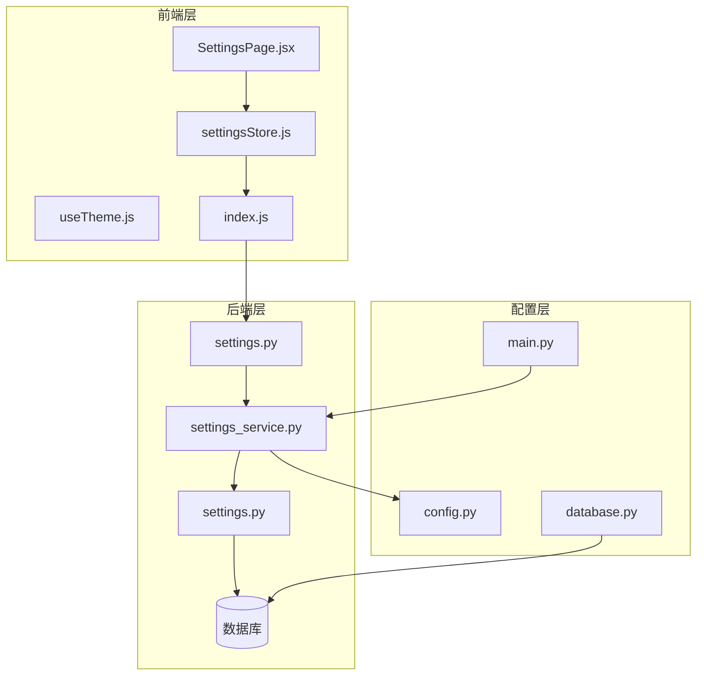
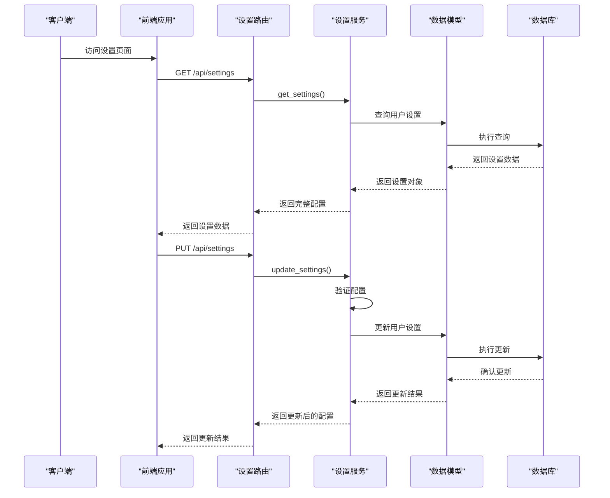
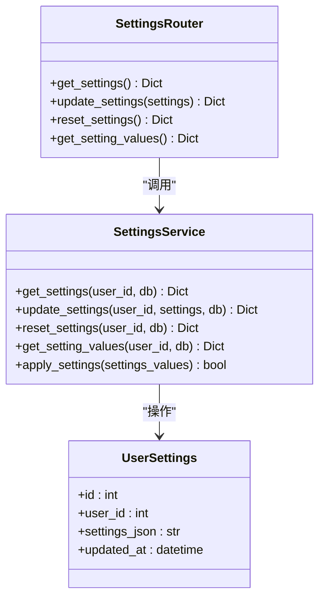
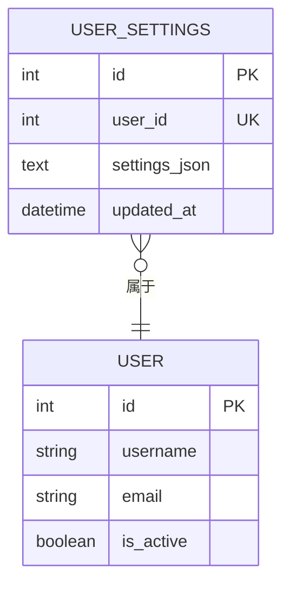
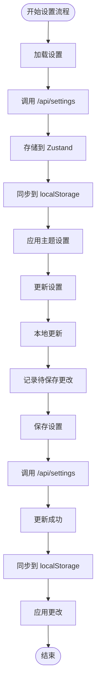
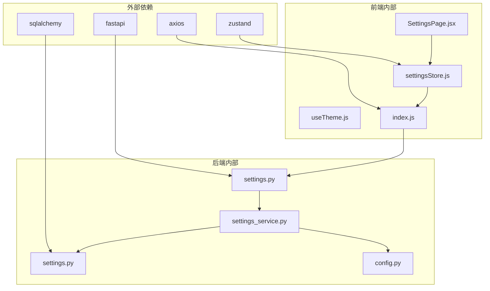

# 用户设置 API

<cite>
**本文引用的文件**
- [settings.py](file://backend/app/routers/settings.py)
- [settings.py](file://backend/app/models/settings.py)
- [settings_service.py](file://backend/app/services/settings_service.py)
- [settingsStore.js](file://frontend/src/stores/settingsStore.js)
- [SettingsPage.jsx](file://frontend/src/pages/SettingsPage.jsx)
- [useTheme.js](file://frontend/src/hooks/useTheme.js)
- [index.js](file://frontend/src/api/index.js)
- [config.py](file://backend/app/config.py)
- [main.py](file://backend/app/main.py)
- [database.py](file://backend/app/database.py)
</cite>

## 目录
1. [简介](#简介)
2. [项目结构](#项目结构)
3. [核心组件](#核心组件)
4. [架构概览](#架构概览)
5. [详细组件分析](#详细组件分析)
6. [依赖分析](#依赖分析)
7. [性能考虑](#性能考虑)
8. [故障排除指南](#故障排除指南)
9. [结论](#结论)
10. [附录](#附录)

## 简介
本文件提供用户设置系统的完整 API 文档，涵盖用户配置、偏好设置和系统选项的接口规范。系统支持主题切换、语言设置和通知配置等核心功能，并提供设置项的验证、保存和同步机制。文档详细说明了设置继承和默认值管理策略，以及设置备份恢复和批量导入导出的接口说明。

## 项目结构
用户设置系统采用前后端分离架构，后端基于 FastAPI，前端基于 React。系统通过统一的设置服务管理用户配置，支持实时同步和持久化存储。

**图表来源**
- [settings.py:1-94](file://backend/app/routers/settings.py#L1-L94)
- [settings_service.py:1-523](file://backend/app/services/settings_service.py#L1-L523)
- [settingsStore.js:1-131](file://frontend/src/stores/settingsStore.js#L1-L131)

**章节来源**
- [settings.py:1-94](file://backend/app/routers/settings.py#L1-L94)
- [settings_service.py:1-523](file://backend/app/services/settings_service.py#L1-L523)
- [settingsStore.js:1-131](file://frontend/src/stores/settingsStore.js#L1-L131)

## 核心组件
用户设置系统由以下核心组件构成：

### 后端组件
- **设置路由层**: 提供 RESTful API 接口
- **设置服务层**: 实现业务逻辑和配置管理
- **数据模型层**: 定义数据库表结构
- **配置管理层**: 管理应用级配置

### 前端组件
- **设置页面**: 用户界面和交互逻辑
- **设置存储**: 状态管理和本地持久化
- **主题钩子**: 外观设置的实时应用
- **API 客户端**: 与后端通信

**章节来源**
- [settings.py:1-94](file://backend/app/routers/settings.py#L1-L94)
- [settings_service.py:168-523](file://backend/app/services/settings_service.py#L168-L523)
- [settings.py:1-30](file://backend/app/models/settings.py#L1-L30)

## 架构概览
系统采用分层架构设计，确保关注点分离和可维护性。

**图表来源**
- [settings.py:17-94](file://backend/app/routers/settings.py#L17-L94)
- [settings_service.py:245-404](file://backend/app/services/settings_service.py#L245-L404)

## 详细组件分析

### 设置路由层
设置路由层提供完整的 RESTful API 接口，包括获取、更新、重置和值获取等操作。

#### 核心端点
- `GET /api/settings`: 获取用户完整设置（含元数据）
- `PUT /api/settings`: 更新用户设置
- `POST /api/settings/reset`: 重置为默认设置
- `GET /api/settings/values`: 获取用户设置值（不含元数据）

**图表来源**
- [settings.py:1-94](file://backend/app/routers/settings.py#L1-L94)
- [settings_service.py:168-523](file://backend/app/services/settings_service.py#L168-L523)
- [settings.py:11-30](file://backend/app/models/settings.py#L11-L30)

**章节来源**
- [settings.py:17-94](file://backend/app/routers/settings.py#L17-L94)

### 设置服务层
设置服务层是系统的核心业务逻辑实现，负责配置验证、合并、应用和持久化。

#### 默认配置结构
系统定义了完整的默认配置结构，包含以下分类：

| 分类 | 配置项 | 类型 | 描述 |
|------|--------|------|------|
| appearance | theme | select | 主题模式（light/dark/auto） |
| appearance | accent_color | select | 强调色（blue/purple/green/orange） |
| appearance | font_size | slider | 字体大小（0.85-1.2） |
| appearance | compact_mode | toggle | 紧凑模式 |
| llm | model | select | AI 模型选择 |
| llm | temperature | slider | 回答温度（0.0-2.0） |
| llm | max_tokens | number | 最大Token数（512-32000） |
| llm | api_key | password | API Key（支持脱敏） |
| rag | top_k | slider | 检索数量（1-20） |
| rag | chunk_size | number | 分块大小（200-2000） |
| rag | chunk_overlap | number | 块重叠（50-500） |
| search | max_results | slider | 最大搜索结果（1-20） |
| search | timeout | number | 搜索超时（5-60秒） |
| recommendation | top_k | slider | 推荐数量（1-20） |
| general | max_file_size_mb | number | 最大文件大小（10-500MB） |
| general | chat_history_limit | number | 对话历史条数（5-100） |

**章节来源**
- [settings_service.py:19-165](file://backend/app/services/settings_service.py#L19-L165)

### 数据模型层
用户设置数据模型采用 JSON 格式存储，支持灵活的配置扩展。

**图表来源**
- [settings.py:11-30](file://backend/app/models/settings.py#L11-L30)

**章节来源**
- [settings.py:11-30](file://backend/app/models/settings.py#L11-L30)

### 前端组件层

#### 设置存储管理
前端使用 Zustand 管理设置状态，提供本地持久化和实时同步功能。

**图表来源**
- [settingsStore.js:18-125](file://frontend/src/stores/settingsStore.js#L18-L125)

**章节来源**
- [settingsStore.js:1-131](file://frontend/src/stores/settingsStore.js#L1-L131)

#### 主题管理钩子
主题钩子负责实时应用外观设置，避免界面闪烁。

**章节来源**
- [useTheme.js:1-91](file://frontend/src/hooks/useTheme.js#L1-L91)

## 依赖分析

### 组件依赖关系
系统采用松耦合设计，各组件间依赖清晰。

**图表来源**
- [settings.py:5-12](file://backend/app/routers/settings.py#L5-L12)
- [settingsStore.js:1-2](file://frontend/src/stores/settingsStore.js#L1-L2)

**章节来源**
- [settings.py:5-12](file://backend/app/routers/settings.py#L5-L12)
- [settingsStore.js:1-2](file://frontend/src/stores/settingsStore.js#L1-L2)

### 数据流分析
设置数据在系统中的流转过程如下：

1. **读取流程**: 前端 → 后端路由 → 设置服务 → 数据库
2. **写入流程**: 前端 → 后端路由 → 设置服务 → 数据库
3. **应用流程**: 设置服务 → 各业务服务 → 运行时配置

**章节来源**
- [settings_service.py:245-519](file://backend/app/services/settings_service.py#L245-L519)

## 性能考虑
系统在设计时充分考虑了性能优化：

### 缓存策略
- **本地缓存**: 使用 localStorage 缓存外观设置，避免闪烁
- **状态缓存**: Zustand 状态管理减少不必要的重新渲染
- **数据库缓存**: SQLAlchemy 连接池提高数据库访问效率

### 异步处理
- **异步数据库操作**: 使用 SQLAlchemy AsyncSession 支持高并发
- **异步配置应用**: 配置更新采用异步方式，不影响主线程

### 内存管理
- **配置合并**: 仅合并用户自定义配置，保持默认配置不变
- **JSON 序列化**: 优化 JSON 处理，减少内存占用

## 故障排除指南

### 常见问题及解决方案

#### 配置验证错误
**症状**: 更新设置时报错，提示配置无效
**原因**: 配置值超出范围或类型不匹配
**解决方法**: 检查配置值是否在允许范围内

#### API Key 脱敏问题
**症状**: API Key 显示为脱敏格式
**原因**: 系统自动脱敏保护敏感信息
**解决方法**: 在设置页面输入真实 API Key

#### 数据库连接问题
**症状**: 设置无法保存或加载
**原因**: 数据库连接异常
**解决方法**: 检查数据库配置和连接状态

**章节来源**
- [settings_service.py:190-230](file://backend/app/services/settings_service.py#L190-L230)
- [settings_service.py:232-244](file://backend/app/services/settings_service.py#L232-L244)

## 结论
用户设置系统提供了完整的配置管理解决方案，具有以下特点：

1. **模块化设计**: 清晰的分层架构便于维护和扩展
2. **强类型验证**: 完善的配置验证机制确保数据完整性
3. **实时同步**: 前后端双向同步保证用户体验
4. **安全保护**: 敏感信息脱敏和权限控制
5. **性能优化**: 多层次缓存和异步处理提升响应速度

系统支持主题切换、语言设置和通知配置等核心功能，为用户提供个性化的使用体验。

## 附录

### API 接口规范

#### 获取设置
- **方法**: GET
- **路径**: `/api/settings`
- **认证**: 需要登录
- **响应**: 完整配置（含元数据）

#### 更新设置
- **方法**: PUT
- **路径**: `/api/settings`
- **认证**: 需要登录
- **请求体**: 部分配置对象
- **响应**: 更新后的完整配置

#### 重置设置
- **方法**: POST
- **路径**: `/api/settings/reset`
- **认证**: 需要登录
- **响应**: 默认配置

#### 获取设置值
- **方法**: GET
- **路径**: `/api/settings/values`
- **认证**: 需要登录
- **响应**: 纯值配置（不含元数据）

### 配置验证规则
- **数值范围**: 滑块和数字类型配置有严格的范围限制
- **枚举值**: 下拉选择配置必须在预定义选项中
- **类型检查**: 不同类型的配置有不同的数据类型要求
- **必填字段**: 敏感信息（如 API Key）可以为空

### 设置继承策略
系统采用"默认配置 + 用户自定义配置"的继承策略：
1. 首先加载默认配置
2. 从数据库加载用户自定义配置
3. 将用户配置合并到默认配置中
4. 用户配置优先于默认配置

### 安全特性
- **API Key 脱敏**: 在前端显示时自动脱敏保护
- **权限控制**: 所有设置操作都需要身份验证
- **数据验证**: 严格的输入验证防止恶意数据
- **日志记录**: 完整的操作日志便于审计

**章节来源**
- [settings.py:17-94](file://backend/app/routers/settings.py#L17-L94)
- [settings_service.py:190-230](file://backend/app/services/settings_service.py#L190-L230)