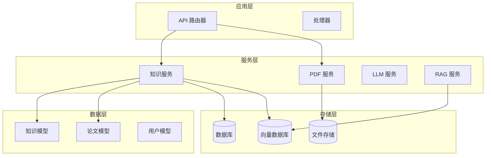
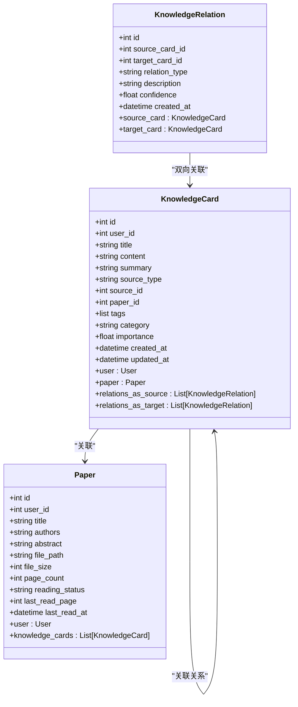
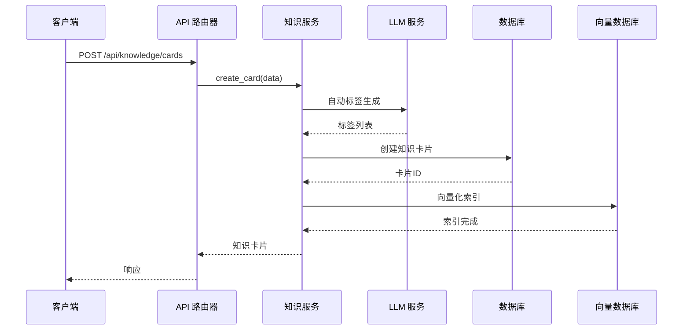
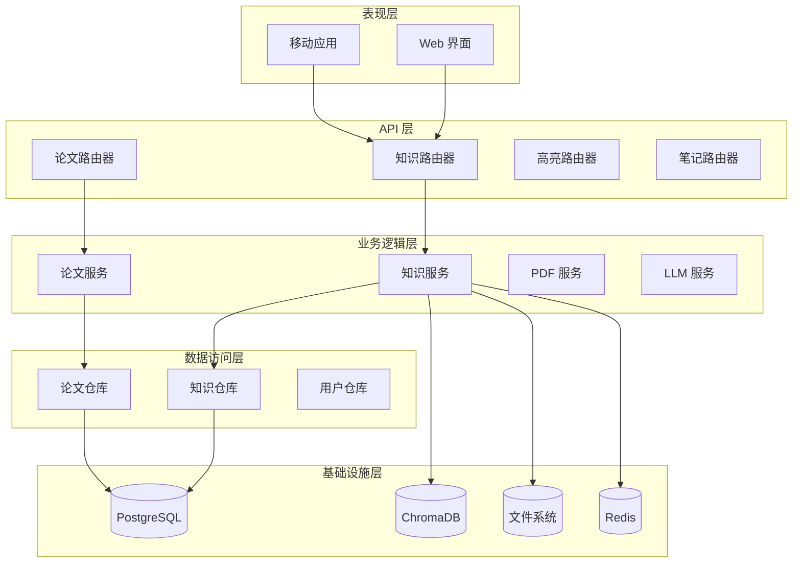
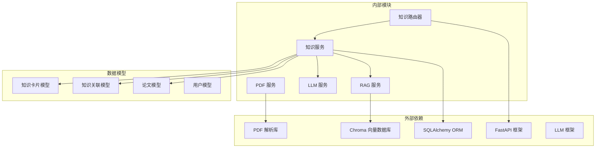

# 知识库管理 API

<cite>
**本文档引用的文件**
- [backend/app/routers/knowledge.py](file://backend/app/routers/knowledge.py)
- [backend/app/models/knowledge.py](file://backend/app/models/knowledge.py)
- [backend/app/services/knowledge_service.py](file://backend/app/services/knowledge_service.py)
- [backend/app/routers/papers.py](file://backend/app/routers/papers.py)
- [backend/app/models/paper.py](file://backend/app/models/paper.py)
- [backend/app/services/pdf_service.py](file://backend/app/services/pdf_service.py)
- [backend/app/routers/highlights.py](file://backend/app/routers/highlights.py)
- [backend/app/routers/notes.py](file://backend/app/routers/notes.py)
- [backend/app/main.py](file://backend/app/main.py)
- [backend/app/config.py](file://backend/app/config.py)
</cite>

## 目录
1. [简介](#简介)
2. [项目结构](#项目结构)
3. [核心组件](#核心组件)
4. [架构概览](#架构概览)
5. [详细组件分析](#详细组件分析)
6. [依赖关系分析](#依赖关系分析)
7. [性能考虑](#性能考虑)
8. [故障排除指南](#故障排除指南)
9. [结论](#结论)

## 简介

知识库管理系统是一个基于 FastAPI 的学术知识管理平台，提供完整的知识卡片创建、编辑、管理和关联功能。系统集成了自然语言处理技术，支持从论文高亮、问答对话中自动提取知识，提供智能搜索、分类标签管理和知识图谱可视化功能。

## 项目结构

系统采用模块化设计，主要分为以下几个核心模块：

**图表来源**
- [backend/app/main.py:55-95](file://backend/app/main.py#L55-L95)
- [backend/app/routers/knowledge.py:19](file://backend/app/routers/knowledge.py#L19)

**章节来源**
- [backend/app/main.py:55-95](file://backend/app/main.py#L55-L95)
- [backend/app/config.py:15-44](file://backend/app/config.py#L15-L44)

## 核心组件

### 知识卡片模型

知识卡片是系统的核心实体，支持多种来源类型和丰富的元数据管理：

**图表来源**
- [backend/app/models/knowledge.py:14-80](file://backend/app/models/knowledge.py#L14-L80)
- [backend/app/models/paper.py:11-62](file://backend/app/models/paper.py#L11-L62)

### 知识服务架构

系统采用服务层架构，将业务逻辑与数据访问分离：

**图表来源**
- [backend/app/routers/knowledge.py:194-222](file://backend/app/routers/knowledge.py#L194-L222)
- [backend/app/services/knowledge_service.py:466-510](file://backend/app/services/knowledge_service.py#L466-L510)

**章节来源**
- [backend/app/models/knowledge.py:14-80](file://backend/app/models/knowledge.py#L14-L80)
- [backend/app/services/knowledge_service.py:79-662](file://backend/app/services/knowledge_service.py#L79-L662)

## 架构概览

系统采用分层架构设计，确保关注点分离和代码可维护性：

**图表来源**
- [backend/app/main.py:82-93](file://backend/app/main.py#L82-L93)
- [backend/app/routers/knowledge.py:19](file://backend/app/routers/knowledge.py#L19)

## 详细组件分析

### 知识卡片管理 API

#### 基础 CRUD 操作

系统提供完整的知识卡片 CRUD 操作，支持分页、筛选和搜索功能：

**获取知识卡片列表**
- **端点**: `GET /api/knowledge/cards`
- **分页参数**: `page` (默认 1), `page_size` (默认 20, 最大 100)
- **筛选参数**: `search` (关键词), `category` (分类), `source_type` (来源类型), `tag` (标签)
- **排序**: 按创建时间降序排列

**创建知识卡片**
- **端点**: `POST /api/knowledge/cards`
- **请求体**: 包含标题、内容、摘要、来源类型、论文ID、标签、分类、重要性等字段
- **自动处理**: 自动生成标签、向量化索引、权限验证

**获取知识卡片详情**
- **端点**: `GET /api/knowledge/cards/{card_id}`
- **权限**: 仅限卡片所属用户访问

**更新知识卡片**
- **端点**: `PUT /api/knowledge/cards/{card_id}`
- **部分更新**: 支持选择性字段更新
- **重新索引**: 更新后自动重新向量化

**删除知识卡片**
- **端点**: `DELETE /api/knowledge/cards/{card_id}`
- **级联删除**: 同时删除关联的向量索引

**章节来源**
- [backend/app/routers/knowledge.py:130-191](file://backend/app/routers/knowledge.py#L130-L191)
- [backend/app/routers/knowledge.py:194-222](file://backend/app/routers/knowledge.py#L194-L222)
- [backend/app/routers/knowledge.py:224-280](file://backend/app/routers/knowledge.py#L224-L280)
- [backend/app/routers/knowledge.py:282-308](file://backend/app/routers/knowledge.py#L282-L308)

#### 知识提取功能

系统支持从多种来源自动提取知识：

**从高亮提取**
- **端点**: `POST /api/knowledge/cards/from-highlight/{highlight_id}`
- **流程**: 从论文高亮中提取关键知识点，自动生成标题、内容和摘要
- **LLM 集成**: 使用预定义提示模板进行知识提取

**从问答提取**
- **端点**: `POST /api/knowledge/cards/from-chat`
- **输入**: 问答内容字符串
- **自动标签**: 提取完成后自动生成相关标签

**自动标签生成**
- **端点**: `POST /api/knowledge/cards/{card_id}/auto-tag`
- **算法**: 基于内容语义分析生成 3-5 个相关标签
- **质量控制**: 过滤通用标签，确保标签的专业性和准确性

**章节来源**
- [backend/app/routers/knowledge.py:311-343](file://backend/app/routers/knowledge.py#L311-L343)
- [backend/app/routers/knowledge.py:519-546](file://backend/app/routers/knowledge.py#L519-L546)
- [backend/app/services/knowledge_service.py:82-162](file://backend/app/services/knowledge_service.py#L82-L162)
- [backend/app/services/knowledge_service.py:164-231](file://backend/app/services/knowledge_service.py#L164-L231)
- [backend/app/services/knowledge_service.py:233-258](file://backend/app/services/knowledge_service.py#L233-L258)

#### 知识关联管理

系统提供强大的知识关联功能，支持多种关联类型和自动发现：

**关联类型**
- `related`: 相关
- `prerequisite`: 前置知识
- `extends`: 扩展
- `contradicts`: 矛盾
- `supports`: 支持

**获取关联关系**
- **端点**: `GET /api/knowledge/cards/{card_id}/relations`
- **功能**: 获取指定卡片的所有关联关系（包括作为源和目标）

**自动发现关联**
- **端点**: `POST /api/knowledge/cards/{card_id}/find-relations`
- **算法**: 使用 LLM 分析新卡片与现有知识的潜在关联
- **输出**: 返回候选关联列表，包含目标卡片ID、关联类型、置信度等

**手动创建关联**
- **端点**: `POST /api/knowledge/relations`
- **验证**: 确保源卡片和目标卡片都存在且属于当前用户
- **去重**: 防止重复创建相同的关联关系

**章节来源**
- [backend/app/routers/knowledge.py:359-409](file://backend/app/routers/knowledge.py#L359-L409)
- [backend/app/routers/knowledge.py:393-409](file://backend/app/routers/knowledge.py#L393-L409)
- [backend/app/routers/knowledge.py:411-467](file://backend/app/routers/knowledge.py#L411-L467)

#### 搜索和过滤功能

系统提供多维度的搜索和过滤能力：

**全局搜索**
- **端点**: `GET /api/knowledge/search`
- **算法**: 结合向量检索和关键词搜索，提供语义相似度排序
- **参数**: `query` (搜索关键词), `top_k` (返回数量，默认 10)

**高级过滤**
- **分类过滤**: 按知识分类筛选
- **来源过滤**: 按创建来源（高亮、问答、手动等）筛选
- **标签过滤**: 按标签精确匹配
- **组合筛选**: 支持多条件组合查询

**章节来源**
- [backend/app/routers/knowledge.py:345-356](file://backend/app/routers/knowledge.py#L345-L356)
- [backend/app/routers/knowledge.py:130-191](file://backend/app/routers/knowledge.py#L130-L191)
- [backend/app/services/knowledge_service.py:350-464](file://backend/app/services/knowledge_service.py#L350-L464)

#### 知识图谱和统计

**知识图谱数据**
- **端点**: `GET /api/knowledge/graph`
- **输出**: 包含节点（知识卡片）和边（关联关系）的完整图数据
- **用途**: 支持前端可视化展示

**统计信息**
- **端点**: `GET /api/knowledge/stats`
- **指标**: 总卡片数、总关联数、分类分布、来源分布、标签云
- **实时性**: 基于当前用户数据动态计算

**章节来源**
- [backend/app/routers/knowledge.py:499-516](file://backend/app/routers/knowledge.py#L499-L516)
- [backend/app/routers/knowledge.py:509-516](file://backend/app/routers/knowledge.py#L509-L516)
- [backend/app/services/knowledge_service.py:526-592](file://backend/app/services/knowledge_service.py#L526-L592)
- [backend/app/services/knowledge_service.py:594-657](file://backend/app/services/knowledge_service.py#L594-L657)

### 论文集成管理

系统与论文管理紧密集成，支持从论文中提取知识：

**论文上传**
- **端点**: `POST /api/papers/upload`
- **功能**: PDF 文件上传、元数据提取、文本块解析
- **异步处理**: 上传完成后异步建立向量索引

**批量上传**
- **端点**: `POST /api/papers/batch-upload`
- **端点**: `POST /api/papers/batch-upload-zip`
- **支持**: 单文件和 ZIP 包批量上传
- **错误处理**: 详细的上传结果统计和错误信息

**章节来源**
- [backend/app/routers/papers.py:156-261](file://backend/app/routers/papers.py#L156-L261)
- [backend/app/routers/papers.py:521-646](file://backend/app/routers/papers.py#L521-L646)
- [backend/app/services/pdf_service.py:11-194](file://backend/app/services/pdf_service.py#L11-L194)

### 辅助功能集成

**高亮管理**
- **端点**: `GET /api/highlights/paper/{paper_id}`
- **功能**: 获取论文的所有高亮标注
- **用途**: 为知识提取提供精确的文本片段

**笔记管理**
- **端点**: `GET /api/notes`
- **功能**: 获取论文笔记，支持与高亮的关联显示
- **搜索**: 支持按内容关键词搜索笔记

**章节来源**
- [backend/app/routers/highlights.py:20-55](file://backend/app/routers/highlights.py#L20-L55)
- [backend/app/routers/notes.py:21-74](file://backend/app/routers/notes.py#L21-L74)

## 依赖关系分析

系统采用松耦合的设计模式，各组件间通过清晰的接口交互：

**图表来源**
- [backend/app/services/knowledge_service.py:12-17](file://backend/app/services/knowledge_service.py#L12-L17)
- [backend/app/routers/knowledge.py:8-16](file://backend/app/routers/knowledge.py#L8-L16)

### 数据流分析

系统的关键数据流包括：

1. **知识提取流程**: 高亮/问答 → LLM → 知识卡片 → 向量索引
2. **搜索流程**: 用户查询 → 向量检索 + 关键词搜索 → 结果合并 → 排序返回
3. **关联发现流程**: 新卡片 → LLM 分析 → 关联建议 → 手动确认

**章节来源**
- [backend/app/services/knowledge_service.py:350-464](file://backend/app/services/knowledge_service.py#L350-L464)
- [backend/app/services/knowledge_service.py:259-349](file://backend/app/services/knowledge_service.py#L259-L349)

## 性能考虑

### 向量检索优化

系统采用混合检索策略：
- **向量检索**: 使用余弦相似度计算，适合语义匹配
- **关键词检索**: 支持精确匹配和模糊搜索
- **结果融合**: 按权重合并不同来源的结果

### 缓存策略

- **向量索引缓存**: ChromaDB 内存缓存提高检索速度
- **LLM 响应缓存**: 避免重复的昂贵计算
- **数据库查询缓存**: 频繁访问的统计数据缓存

### 并发处理

- **异步操作**: PDF 解析、向量索引、LLM 调用均采用异步处理
- **批量操作**: 支持批量上传和批量处理
- **连接池**: 数据库连接池管理，避免连接泄漏

## 故障排除指南

### 常见问题

**向量检索失败**
- 检查 ChromaDB 服务状态
- 验证嵌入模型配置
- 确认知识卡片已正确索引

**LLM 服务异常**
- 检查 API 密钥配置
- 验证网络连接
- 查看服务日志获取详细错误信息

**PDF 处理失败**
- 验证文件格式和完整性
- 检查磁盘空间
- 确认 pdfplumber 库版本兼容性

### 调试建议

1. **启用调试模式**: 在配置中设置 `DEBUG=True`
2. **查看日志**: 关注服务启动和运行时的日志输出
3. **单元测试**: 运行现有的测试套件验证功能正常
4. **健康检查**: 访问 `/api/health` 端点确认服务状态

**章节来源**
- [backend/app/main.py:102-114](file://backend/app/main.py#L102-L114)
- [backend/app/config.py:20-21](file://backend/app/config.py#L20-L21)

## 结论

知识库管理系统提供了完整的学术知识管理解决方案，具有以下特点：

**核心优势**
- **智能化**: 集成 LLM 技术，支持自动知识提取和标签生成
- **可扩展**: 模块化设计，易于扩展新的功能和集成
- **高性能**: 向量检索 + 关键词搜索的混合策略
- **易用性**: 清晰的 API 设计和完善的错误处理

**应用场景**
- 学术研究知识管理
- 论文阅读辅助工具
- 知识图谱构建
- 智能问答系统

系统为研究人员和学生提供了一个强大而易用的知识管理平台，能够显著提高学术工作的效率和质量。