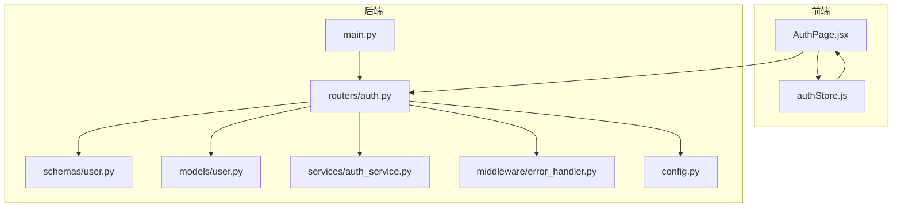
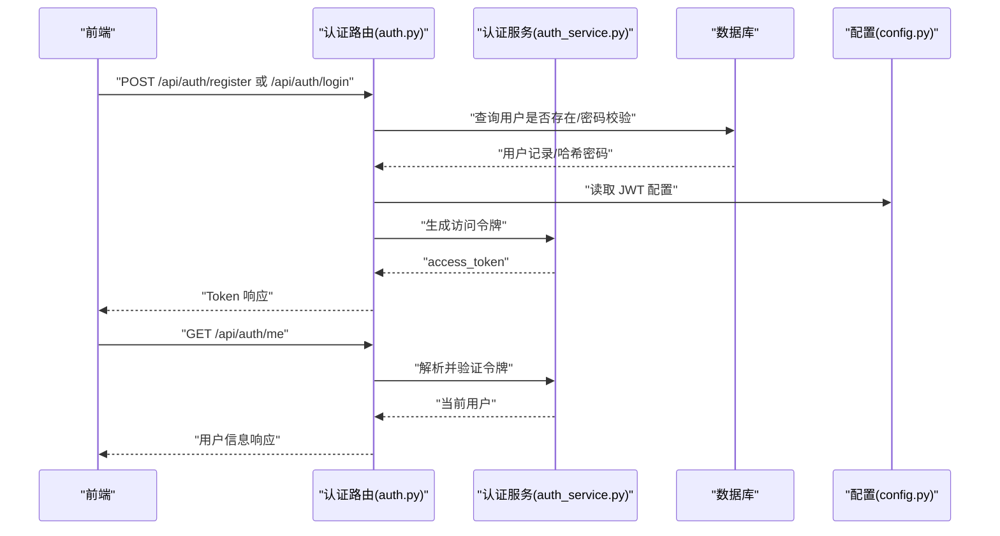
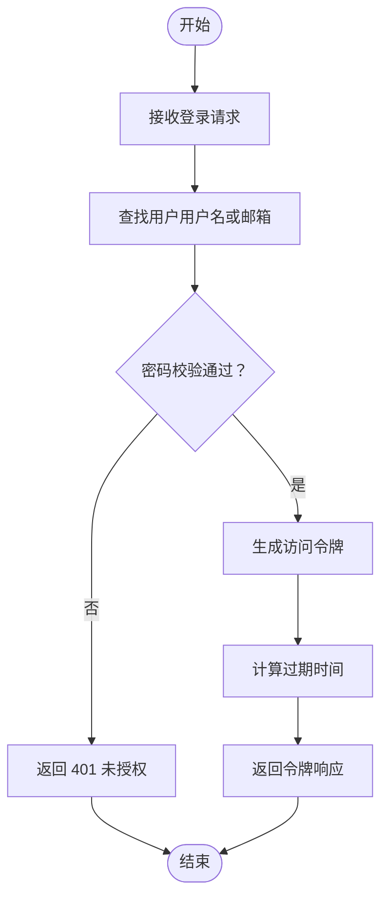
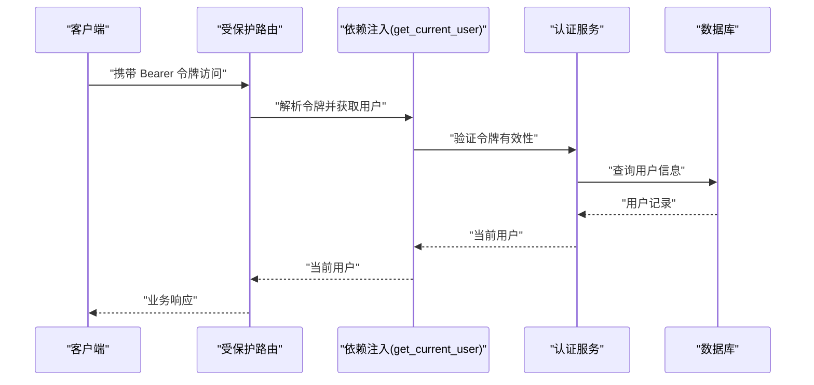
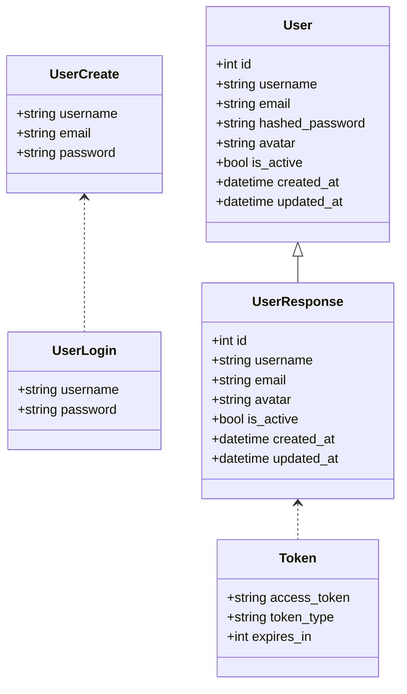
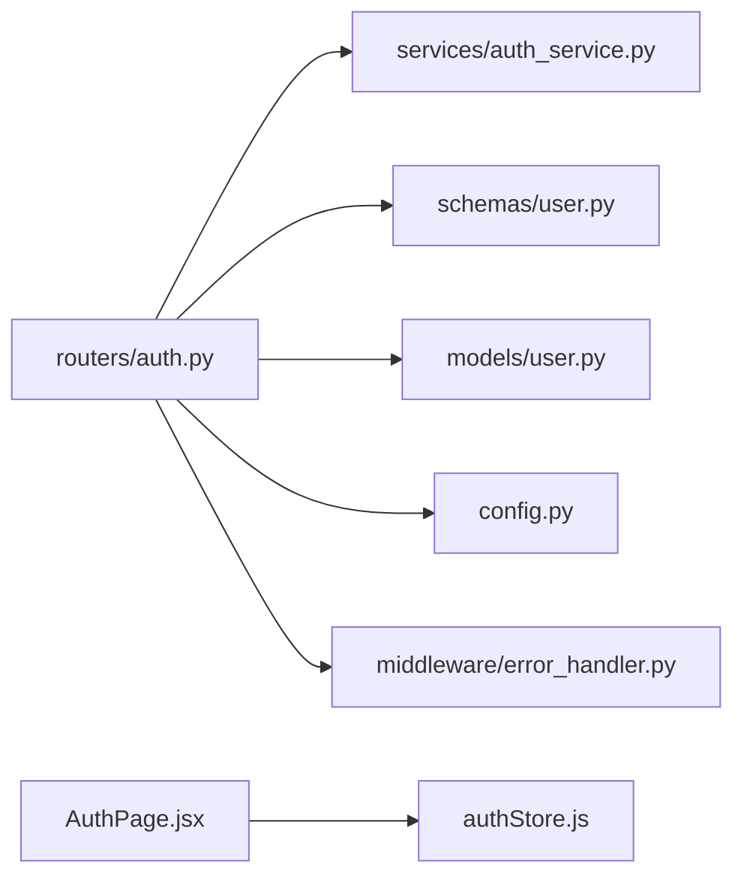

# 认证与授权 API

<cite>
**本文引用的文件**
- [backend/app/routers/auth.py](file://backend/app/routers/auth.py)
- [backend/app/schemas/user.py](file://backend/app/schemas/user.py)
- [backend/app/models/user.py](file://backend/app/models/user.py)
- [backend/app/services/auth_service.py](file://backend/app/services/auth_service.py)
- [backend/app/middleware/error_handler.py](file://backend/app/middleware/error_handler.py)
- [backend/app/config.py](file://backend/app/config.py)
- [backend/app/main.py](file://backend/app/main.py)
- [frontend/src/pages/AuthPage.jsx](file://frontend/src/pages/AuthPage.jsx)
- [frontend/src/stores/authStore.js](file://frontend/src/stores/authStore.js)
</cite>

## 目录
1. [简介](#简介)
2. [项目结构](#项目结构)
3. [核心组件](#核心组件)
4. [架构总览](#架构总览)
5. [详细组件分析](#详细组件分析)
6. [依赖分析](#依赖分析)
7. [性能考虑](#性能考虑)
8. [故障排查指南](#故障排查指南)
9. [结论](#结论)
10. [附录](#附录)

## 简介
本文件为认证与授权系统的完整 API 文档，覆盖用户注册、登录、登出、获取当前用户信息以及用户信息更新等接口。文档详细说明了 JWT 令牌的生成、验证与刷新机制，提供请求参数、响应格式与错误处理示例，并解释认证中间件的工作原理与权限控制策略。同时给出安全最佳实践与常见认证问题的解决方案。

## 项目结构
后端采用 FastAPI + SQLAlchemy 架构，认证相关模块分布如下：
- 路由层：认证接口集中在认证路由模块中
- 服务层：认证服务负责用户获取与 JWT 相关逻辑
- 模型层：用户模型定义数据结构与关系
- 模式层：Pydantic 模型定义请求与响应结构
- 中间件层：全局异常处理，统一封装错误响应
- 配置层：JWT 密钥、算法与过期时间等配置项

图表来源
- [backend/app/main.py:55-95](file://backend/app/main.py#L55-L95)
- [backend/app/routers/auth.py:18-186](file://backend/app/routers/auth.py#L18-L186)
- [backend/app/schemas/user.py:8-42](file://backend/app/schemas/user.py#L8-L42)
- [backend/app/models/user.py:11-36](file://backend/app/models/user.py#L11-L36)
- [backend/app/services/auth_service.py:13-40](file://backend/app/services/auth_service.py#L13-L40)
- [backend/app/middleware/error_handler.py:73-92](file://backend/app/middleware/error_handler.py#L73-L92)
- [backend/app/config.py:28-31](file://backend/app/config.py#L28-L31)

章节来源
- [backend/app/main.py:55-95](file://backend/app/main.py#L55-L95)
- [backend/app/routers/auth.py:18-186](file://backend/app/routers/auth.py#L18-L186)
- [backend/app/schemas/user.py:8-42](file://backend/app/schemas/user.py#L8-L42)
- [backend/app/models/user.py:11-36](file://backend/app/models/user.py#L11-L36)
- [backend/app/services/auth_service.py:13-40](file://backend/app/services/auth_service.py#L13-L40)
- [backend/app/middleware/error_handler.py:73-92](file://backend/app/middleware/error_handler.py#L73-L92)
- [backend/app/config.py:28-31](file://backend/app/config.py#L28-L31)

## 核心组件
- 认证路由模块：提供注册、登录、登出、获取当前用户信息、更新当前用户信息等接口
- 认证服务模块：提供默认用户获取能力（个人使用模式）
- 用户模型与模式：定义用户实体、创建/登录/响应/令牌等 Pydantic 模型
- 全局异常处理：统一封装 422、400、401、500 等错误响应
- 配置模块：JWT 密钥、算法与过期时间等配置

章节来源
- [backend/app/routers/auth.py:27-186](file://backend/app/routers/auth.py#L27-L186)
- [backend/app/services/auth_service.py:13-40](file://backend/app/services/auth_service.py#L13-L40)
- [backend/app/schemas/user.py:8-42](file://backend/app/schemas/user.py#L8-L42)
- [backend/app/middleware/error_handler.py:11-92](file://backend/app/middleware/error_handler.py#L11-L92)
- [backend/app/config.py:28-31](file://backend/app/config.py#L28-L31)

## 架构总览
认证流程概览：
- 前端通过认证页面与状态管理发起注册/登录请求
- 后端认证路由接收请求，调用认证服务与数据库校验
- 成功后签发 JWT 令牌；失败返回标准化错误响应
- 后续受保护接口通过依赖注入获取当前用户，实现权限控制

图表来源
- [backend/app/routers/auth.py:27-186](file://backend/app/routers/auth.py#L27-L186)
- [backend/app/services/auth_service.py:13-40](file://backend/app/services/auth_service.py#L13-L40)
- [backend/app/config.py:28-31](file://backend/app/config.py#L28-L31)

## 详细组件分析

### 认证路由与接口规范
- 接口前缀：/api/auth
- 主要接口：
  - POST /register：用户注册
  - POST /login：用户登录
  - POST /logout：用户登出
  - GET /me：获取当前用户信息
  - PUT /me：更新当前用户信息

请求与响应要点：
- 注册：用户名、邮箱、密码；返回用户信息
- 登录：用户名或邮箱、密码；返回 access_token、token_type、expires_in
- 登出：无请求体；返回登出成功消息
- 获取当前用户：需携带有效令牌；返回用户信息
- 更新当前用户：可选更新邮箱与头像；返回更新后的用户信息

章节来源
- [backend/app/routers/auth.py:27-186](file://backend/app/routers/auth.py#L27-L186)
- [backend/app/schemas/user.py:14-42](file://backend/app/schemas/user.py#L14-L42)

### JWT 令牌生成与验证机制
- 令牌类型：Bearer
- 算法：HS256
- 过期时间：配置项控制（分钟）
- 令牌内容：包含 sub（用户标识）
- 验证方式：依赖注入获取当前用户，若令牌无效则抛出 401

图表来源
- [backend/app/routers/auth.py:71-118](file://backend/app/routers/auth.py#L71-L118)
- [backend/app/config.py:28-31](file://backend/app/config.py#L28-L31)

章节来源
- [backend/app/routers/auth.py:71-118](file://backend/app/routers/auth.py#L71-L118)
- [backend/app/config.py:28-31](file://backend/app/config.py#L28-L31)

### 权限控制与中间件
- 权限控制：受保护接口通过依赖注入 get_current_user 获取当前用户，实现基于令牌的权限控制
- 中间件：全局异常处理统一返回标准化错误响应，包括参数验证错误、HTTP 异常、数据库异常与通用异常

图表来源
- [backend/app/routers/auth.py:134-144](file://backend/app/routers/auth.py#L134-L144)
- [backend/app/services/auth_service.py:13-40](file://backend/app/services/auth_service.py#L13-L40)

章节来源
- [backend/app/routers/auth.py:134-144](file://backend/app/routers/auth.py#L134-L144)
- [backend/app/services/auth_service.py:13-40](file://backend/app/services/auth_service.py#L13-L40)
- [backend/app/middleware/error_handler.py:11-92](file://backend/app/middleware/error_handler.py#L11-L92)

### 数据模型与模式
- 用户模型：包含 id、username、email、hashed_password、avatar、is_active、时间戳等字段及关联关系
- 用户模式：注册/登录/响应/令牌等 Pydantic 模型，约束字段长度与类型

图表来源
- [backend/app/models/user.py:11-36](file://backend/app/models/user.py#L11-L36)
- [backend/app/schemas/user.py:8-42](file://backend/app/schemas/user.py#L8-L42)

章节来源
- [backend/app/models/user.py:11-36](file://backend/app/models/user.py#L11-L36)
- [backend/app/schemas/user.py:8-42](file://backend/app/schemas/user.py#L8-L42)

### 前端交互与状态管理
- 认证页面：支持登录/注册切换、表单校验、错误提示
- 状态管理：默认用户（个人使用模式）始终视为已登录，简化前端逻辑

章节来源
- [frontend/src/pages/AuthPage.jsx:67-97](file://frontend/src/pages/AuthPage.jsx#L67-L97)
- [frontend/src/stores/authStore.js:3-20](file://frontend/src/stores/authStore.js#L3-L20)

## 依赖分析
- 认证路由依赖：
  - 认证服务：用于获取当前用户与密码哈希/校验
  - 数据库：查询用户、写入新用户
  - 配置：读取 JWT 密钥、算法与过期时间
  - 模式：请求/响应数据结构
  - 中间件：全局异常处理
- 前端依赖：
  - 认证页面与状态管理：驱动注册/登录流程

图表来源
- [backend/app/routers/auth.py:14-16](file://backend/app/routers/auth.py#L14-L16)
- [backend/app/services/auth_service.py:13-40](file://backend/app/services/auth_service.py#L13-L40)
- [backend/app/schemas/user.py:8-42](file://backend/app/schemas/user.py#L8-L42)
- [backend/app/models/user.py:11-36](file://backend/app/models/user.py#L11-L36)
- [backend/app/config.py:28-31](file://backend/app/config.py#L28-L31)
- [backend/app/middleware/error_handler.py:73-92](file://backend/app/middleware/error_handler.py#L73-L92)
- [frontend/src/pages/AuthPage.jsx:6-11](file://frontend/src/pages/AuthPage.jsx#L6-L11)
- [frontend/src/stores/authStore.js:1-3](file://frontend/src/stores/authStore.js#L1-L3)

章节来源
- [backend/app/routers/auth.py:14-16](file://backend/app/routers/auth.py#L14-L16)
- [backend/app/services/auth_service.py:13-40](file://backend/app/services/auth_service.py#L13-L40)
- [backend/app/schemas/user.py:8-42](file://backend/app/schemas/user.py#L8-L42)
- [backend/app/models/user.py:11-36](file://backend/app/models/user.py#L11-L36)
- [backend/app/config.py:28-31](file://backend/app/config.py#L28-L31)
- [backend/app/middleware/error_handler.py:73-92](file://backend/app/middleware/error_handler.py#L73-L92)
- [frontend/src/pages/AuthPage.jsx:6-11](file://frontend/src/pages/AuthPage.jsx#L6-L11)
- [frontend/src/stores/authStore.js:1-3](file://frontend/src/stores/authStore.js#L1-L3)

## 性能考虑
- 令牌无状态：JWT 无状态设计减少服务端存储开销
- 密钥与算法：建议在生产环境使用强密钥与安全算法
- 过期时间：合理设置过期时间，平衡安全性与用户体验
- 数据库查询：对用户名/邮箱建立唯一索引，避免重复注册与登录查询瓶颈

## 故障排查指南
- 参数验证失败（422）：检查请求体字段类型与长度约束
- 未授权访问（401）：确认令牌格式与有效期，确保携带正确的 Authorization 头
- 数据库操作失败（500）：检查数据库连接与事务提交
- 通用服务器错误（500）：查看服务端日志定位异常

章节来源
- [backend/app/middleware/error_handler.py:11-92](file://backend/app/middleware/error_handler.py#L11-L92)

## 结论
本认证与授权系统通过简洁的路由与服务层实现用户注册、登录、登出与当前用户信息管理，并以 JWT 实现无状态认证。配合全局异常处理与合理的配置，系统具备良好的可维护性与扩展性。建议在生产环境中强化密钥管理、引入令牌黑名单与刷新策略，并完善前端令牌持久化与刷新机制。

## 附录

### 接口定义与示例

- 注册
  - 方法与路径：POST /api/auth/register
  - 请求体字段：
    - username：字符串，长度 3-50
    - email：邮箱地址
    - password：字符串，长度 6-100
  - 成功响应：用户信息对象
  - 常见错误：400（用户名/邮箱已存在）

- 登录
  - 方法与路径：POST /api/auth/login
  - 请求体字段：
    - username：字符串（用户名或邮箱）
    - password：字符串
  - 成功响应：令牌对象（access_token、token_type、expires_in）
  - 常见错误：401（用户名或密码错误、用户被禁用）

- 登出
  - 方法与路径：POST /api/auth/logout
  - 请求体：无
  - 成功响应：登出成功消息
  - 说明：JWT 为无状态，登出即客户端删除令牌

- 获取当前用户
  - 方法与路径：GET /api/auth/me
  - 请求头：Authorization: Bearer <token>
  - 成功响应：用户信息对象
  - 常见错误：401（令牌无效或过期）

- 更新当前用户
  - 方法与路径：PUT /api/auth/me
  - 请求头：Authorization: Bearer <token>
  - 请求体字段：
    - email：邮箱（可选）
    - avatar：头像 URL（可选）
  - 成功响应：更新后的用户信息对象
  - 常见错误：400（邮箱被其他用户使用）、404（用户不存在）

章节来源
- [backend/app/routers/auth.py:27-186](file://backend/app/routers/auth.py#L27-L186)
- [backend/app/schemas/user.py:14-42](file://backend/app/schemas/user.py#L14-L42)

### 安全最佳实践
- 生产环境配置
  - 更改默认 JWT_SECRET_KEY
  - 使用 HTTPS 传输
  - 合理设置过期时间与刷新策略
- 令牌管理
  - 客户端安全存储令牌
  - 避免在本地存储中明文保存
  - 实施令牌刷新与黑名单机制（如需）
- 输入校验
  - 严格遵循 Pydantic 模型约束
  - 对敏感字段进行二次校验
- 日志与监控
  - 记录认证相关事件
  - 监控异常与攻击行为

### 常见问题与解决方案
- 登录后无法访问受保护接口
  - 检查 Authorization 头是否正确携带 Bearer 令牌
  - 确认令牌未过期
- 注册时报用户名/邮箱已存在
  - 检查是否重复提交或数据冲突
- 登录返回 401 未授权
  - 核对用户名/密码是否正确
  - 确认用户状态为激活
- 前端显示“未登录”
  - 检查前端状态管理与路由守卫逻辑
  - 确认认证页面与状态同步