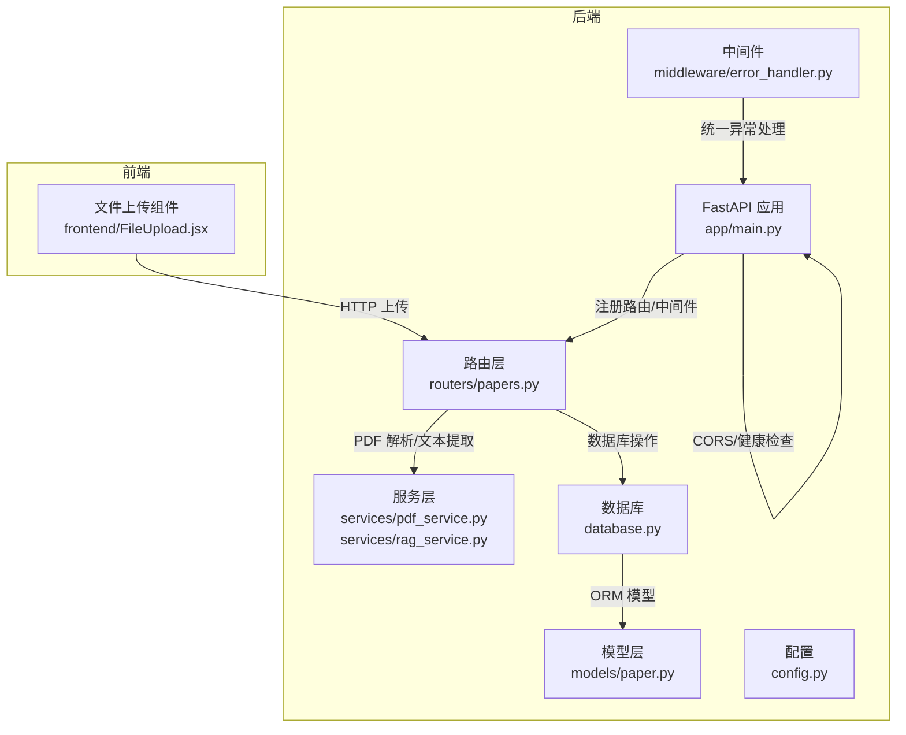
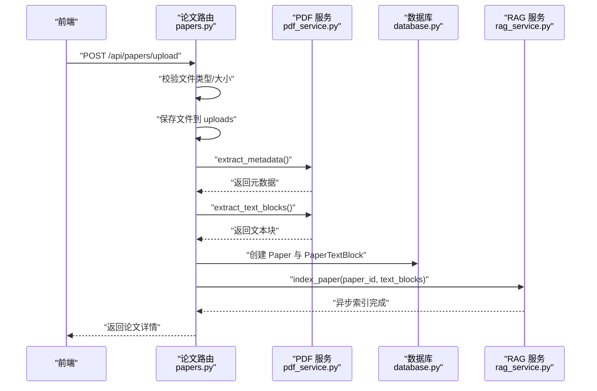
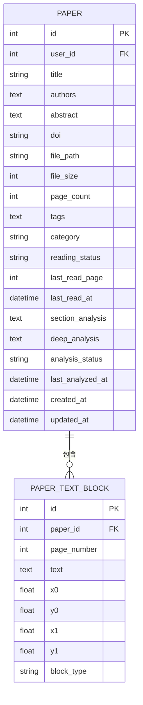
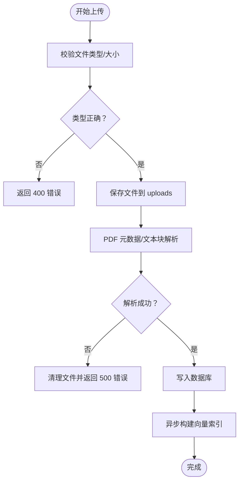
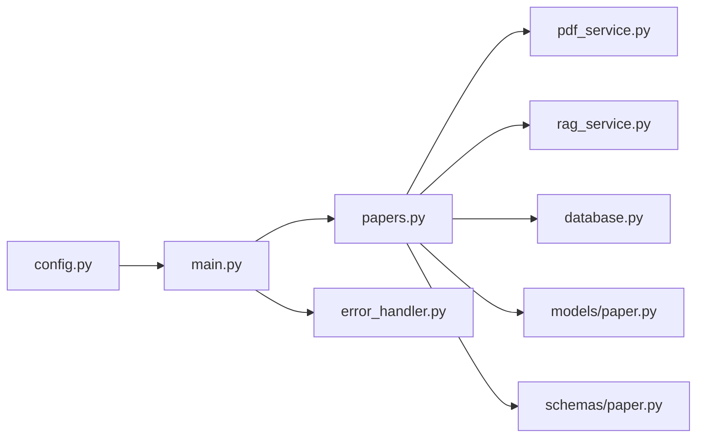

# 论文管理 API

<cite>
**本文档引用的文件**
- [backend/app/routers/papers.py](file://backend/app/routers/papers.py)
- [backend/app/models/paper.py](file://backend/app/models/paper.py)
- [backend/app/schemas/paper.py](file://backend/app/schemas/paper.py)
- [backend/app/services/pdf_service.py](file://backend/app/services/pdf_service.py)
- [backend/app/services/rag_service.py](file://backend/app/services/rag_service.py)
- [backend/app/services/llm_service.py](file://backend/app/services/llm_service.py)
- [backend/app/config.py](file://backend/app/config.py)
- [backend/app/main.py](file://backend/app/main.py)
- [backend/app/database.py](file://backend/app/database.py)
- [backend/app/middleware/error_handler.py](file://backend/app/middleware/error_handler.py)
- [frontend/src/components/FileUpload/FileUpload.jsx](file://frontend/src/components/FileUpload/FileUpload.jsx)
- [README.md](file://README.md)
</cite>

## 目录
1. [简介](#简介)
2. [项目结构](#项目结构)
3. [核心组件](#核心组件)
4. [架构总览](#架构总览)
5. [详细组件分析](#详细组件分析)
6. [依赖关系分析](#依赖关系分析)
7. [性能考虑](#性能考虑)
8. [故障排除指南](#故障排除指南)
9. [结论](#结论)

## 简介
本文件为论文管理系统的完整 API 文档，覆盖论文上传、下载、删除、元数据管理、PDF 文件处理、文本提取、元数据解析、论文列表查询与分页、搜索、进度跟踪与错误处理、状态管理与版本控制策略等。系统采用 FastAPI + SQLAlchemy 异步架构，结合 pdfplumber 进行 PDF 解析，ChromaDB + Sentence-Transformers 实现向量检索，支持 RAG 混合检索与关键词提取。

## 项目结构
后端采用模块化组织，按功能划分为 routers、services、models、schemas、middleware 等层次；前端通过 Dropzone 实现文件拖拽上传，配合后端进行进度反馈与错误提示。

**图表来源**
- [backend/app/main.py:55-95](file://backend/app/main.py#L55-L95)
- [backend/app/routers/papers.py:30](file://backend/app/routers/papers.py#L30)
- [backend/app/services/pdf_service.py:11](file://backend/app/services/pdf_service.py#L11)
- [backend/app/services/rag_service.py:16](file://backend/app/services/rag_service.py#L16)
- [backend/app/models/paper.py:11](file://backend/app/models/paper.py#L11)
- [backend/app/config.py:15](file://backend/app/config.py#L15)
- [backend/app/database.py:30](file://backend/app/database.py#L30)
- [backend/app/middleware/error_handler.py:73](file://backend/app/middleware/error_handler.py#L73)
- [frontend/src/components/FileUpload/FileUpload.jsx:12](file://frontend/src/components/FileUpload/FileUpload.jsx#L12)

**章节来源**
- [backend/app/main.py:55-95](file://backend/app/main.py#L55-L95)
- [README.md:72-183](file://README.md#L72-L183)

## 核心组件
- 论文路由与控制器：提供上传、列表、详情、更新、删除、下载、文本提取、文本块查询、批量上传、索引重建、关键词提取等端点。
- PDF 服务：负责元数据提取、文本块提取、全文提取、页数获取与有效性校验。
- RAG 服务：基于 ChromaDB 的向量索引与检索，结合 BM25 关键词检索，支持跨文档检索与索引状态查询。
- LLM 服务：提供关键词提取等能力的兼容入口。
- 数据模型：Paper 与 PaperTextBlock，定义论文元数据、文本块位置信息与关系。
- 配置与中间件：应用配置、CORS、健康检查、全局异常处理。

**章节来源**
- [backend/app/routers/papers.py:156-262](file://backend/app/routers/papers.py#L156-L262)
- [backend/app/services/pdf_service.py:11](file://backend/app/services/pdf_service.py#L11)
- [backend/app/services/rag_service.py:16](file://backend/app/services/rag_service.py#L16)
- [backend/app/models/paper.py:11](file://backend/app/models/paper.py#L11)
- [backend/app/config.py:15](file://backend/app/config.py#L15)
- [backend/app/middleware/error_handler.py:73](file://backend/app/middleware/error_handler.py#L73)

## 架构总览
系统采用前后端分离架构，前端通过 HTTP 与 WebSocket 与后端交互。论文上传流程包括文件校验、持久化、PDF 元数据与文本块解析、数据库写入、向量索引异步构建；检索流程结合语义向量与 BM25 关键词检索，使用 RRF 融合排序。

**图表来源**
- [backend/app/routers/papers.py:156-262](file://backend/app/routers/papers.py#L156-L262)
- [backend/app/services/pdf_service.py:14](file://backend/app/services/pdf_service.py#L14)
- [backend/app/services/rag_service.py:183](file://backend/app/services/rag_service.py#L183)
- [backend/app/database.py:30](file://backend/app/database.py#L30)

## 详细组件分析

### 论文管理 API 规范

#### 1) 论文上传
- 端点：POST /api/papers/upload
- 请求体：multipart/form-data
  - file: PDF 文件（必填）
  - title: 标题（可选）
  - category: 分类（可选）
  - tags: 标签（可选，逗号分隔）
- 响应：PaperResponse
- 处理流程：
  - 校验文件类型与大小
  - 保存文件至 uploads 目录
  - 调用 PDF 服务提取元数据与文本块
  - 写入 Paper 与 PaperTextBlock 记录
  - 异步构建向量索引
- 错误处理：文件类型不符、大小超限、PDF 解析失败、数据库异常统一由全局中间件返回标准错误格式

**章节来源**
- [backend/app/routers/papers.py:156-262](file://backend/app/routers/papers.py#L156-L262)
- [backend/app/services/pdf_service.py:14](file://backend/app/services/pdf_service.py#L14)
- [backend/app/services/rag_service.py:183](file://backend/app/services/rag_service.py#L183)
- [backend/app/middleware/error_handler.py:31](file://backend/app/middleware/error_handler.py#L31)

#### 2) 批量上传（单文件列表）
- 端点：POST /api/papers/batch-upload
- 请求体：multipart/form-data
  - files: PDF 文件数组
- 响应：BatchUploadResponse
- 特点：逐个处理，记录成功/失败项，清理失败文件

**章节来源**
- [backend/app/routers/papers.py:521-646](file://backend/app/routers/papers.py#L521-L646)

#### 3) 批量上传（ZIP 包）
- 端点：POST /api/papers/batch-upload-zip
- 请求体：multipart/form-data
  - file: ZIP 文件（包含 PDF）
- 响应：BatchUploadResponse
- 特点：解压后遍历 PDF，支持子目录，严格校验 ZIP 结构

**章节来源**
- [backend/app/routers/papers.py:649-810](file://backend/app/routers/papers.py#L649-L810)

#### 4) 论文列表查询与分页
- 端点：GET /api/papers
- 查询参数：
  - page: 页码（默认 1）
  - page_size: 每页数量（默认 20，最小 1，最大 100）
  - search: 搜索关键词（模糊匹配标题/作者）
  - category: 分类筛选
  - reading_status: 阅读状态筛选
- 响应：PaperListResponse（total + papers）

**章节来源**
- [backend/app/routers/papers.py:91-153](file://backend/app/routers/papers.py#L91-L153)

#### 5) 论文详情
- 端点：GET /api/papers/{paper_id}
- 响应：PaperResponse

**章节来源**
- [backend/app/routers/papers.py:264-290](file://backend/app/routers/papers.py#L264-L290)

#### 6) 更新论文元数据
- 端点：PUT /api/papers/{paper_id}
- 请求体：PaperUpdate（可选字段：title、authors、abstract、doi、category、tags、reading_status、last_read_page）
- 响应：PaperResponse

**章节来源**
- [backend/app/routers/papers.py:293-338](file://backend/app/routers/papers.py#L293-L338)

#### 7) 删除论文
- 端点：DELETE /api/papers/{paper_id}
- 行为：删除本地 PDF 文件与数据库记录（级联删除 text_blocks、highlights、notes、knowledge_cards）

**章节来源**
- [backend/app/routers/papers.py:341-376](file://backend/app/routers/papers.py#L341-L376)

#### 8) 下载论文文件
- 端点：GET /api/papers/{paper_id}/file
- 响应：application/pdf 文件流

**章节来源**
- [backend/app/routers/papers.py:379-416](file://backend/app/routers/papers.py#L379-L416)

#### 9) 获取论文文本内容
- 端点：GET /api/papers/{paper_id}/text
- 查询参数：page: 指定页码（可选）
- 响应：包含 text 与 page_count 的对象

**章节来源**
- [backend/app/routers/papers.py:419-462](file://backend/app/routers/papers.py#L419-L462)

#### 10) 获取论文文本块（带位置信息）
- 端点：GET /api/papers/{paper_id}/blocks
- 查询参数：page: 指定页码（可选）
- 响应：包含 blocks 列表的对象（含坐标与类型）

**章节来源**
- [backend/app/routers/papers.py:465-518](file://backend/app/routers/papers.py#L465-L518)

#### 11) 搜索论文内容
- 端点：POST /api/papers/{paper_id}/search
- 表单参数：query（关键词）、top_k（默认 5）
- 响应：包含检索结果列表的对象

**章节来源**
- [backend/app/routers/papers.py:813-854](file://backend/app/routers/papers.py#L813-L854)

#### 12) 重建论文向量索引
- 端点：POST /api/papers/{paper_id}/reindex
- 响应：重建结果与索引状态

**章节来源**
- [backend/app/routers/papers.py:857-922](file://backend/app/routers/papers.py#L857-L922)

#### 13) 获取索引状态
- 端点：GET /api/papers/{paper_id}/index-status
- 响应：索引状态信息（是否已索引、块数量）

**章节来源**
- [backend/app/routers/papers.py:925-953](file://backend/app/routers/papers.py#L925-L953)

#### 14) 获取论文分析缓存
- 端点：GET /api/papers/{paper_id}/analysis
- 响应：章节概述与深度分析缓存状态

**章节来源**
- [backend/app/routers/papers.py:956-988](file://backend/app/routers/papers.py#L956-L988)

#### 15) 手动触发关键词提取
- 端点：POST /api/papers/{paper_id}/extract-keywords
- 响应：关键词列表并更新 tags

**章节来源**
- [backend/app/routers/papers.py:991-1034](file://backend/app/routers/papers.py#L991-L1034)

#### 16) 标记阅读状态
- 端点：PATCH /api/papers/{paper_id}/reading-status
- 请求体：ReadingStatusUpdate（status: unread/reading/finished）
- 响应：更新后的状态与最后阅读时间

**章节来源**
- [backend/app/routers/papers.py:44-88](file://backend/app/routers/papers.py#L44-L88)

### 数据模型与关系

**图表来源**
- [backend/app/models/paper.py:11](file://backend/app/models/paper.py#L11)
- [backend/app/models/paper.py:65](file://backend/app/models/paper.py#L65)

**章节来源**
- [backend/app/models/paper.py:11](file://backend/app/models/paper.py#L11)

### PDF 处理与文本提取
- 元数据提取：标题、作者、页数；若 PDF 元数据缺失则从第一页文本提取标题。
- 文本块提取：按字符坐标聚合并合并为行，计算边界框，返回带页码与坐标的文本块列表。
- 全文提取：按页拼接文本，供 LLM 分析使用。
- 页数获取与有效性校验：通过 pdfplumber 打开并检查页数与文件头。

**章节来源**
- [backend/app/services/pdf_service.py:14](file://backend/app/services/pdf_service.py#L14)
- [backend/app/services/pdf_service.py:58](file://backend/app/services/pdf_service.py#L58)
- [backend/app/services/pdf_service.py:120](file://backend/app/services/pdf_service.py#L120)
- [backend/app/services/pdf_service.py:145](file://backend/app/services/pdf_service.py#L145)
- [backend/app/services/pdf_service.py:162](file://backend/app/services/pdf_service.py#L162)

### RAG 检索与索引
- 智能分块：按自然边界分块，支持重叠，保留页码信息。
- 向量索引：ChromaDB 持久化，Sentence-Transformers 编码，metadata 中页码序列以 JSON 字符串存储。
- 混合检索：语义检索 + BM25 关键词检索，RRF 融合排序。
- 跨文档检索：并行检索多个论文集合，统一排序。
- 索引管理：删除、重建、状态查询与缓存失效。

**章节来源**
- [backend/app/services/rag_service.py:102](file://backend/app/services/rag_service.py#L102)
- [backend/app/services/rag_service.py:183](file://backend/app/services/rag_service.py#L183)
- [backend/app/services/rag_service.py:233](file://backend/app/services/rag_service.py#L233)
- [backend/app/services/rag_service.py:308](file://backend/app/services/rag_service.py#L308)
- [backend/app/services/rag_service.py:337](file://backend/app/services/rag_service.py#L337)
- [backend/app/services/rag_service.py:355](file://backend/app/services/rag_service.py#L355)
- [backend/app/services/rag_service.py:372](file://backend/app/services/rag_service.py#L372)

### LLM 关键词提取
- 通过 llm_service 兼容入口调用关键词提取，将结果写回 Paper.tags（JSON 字符串）。

**章节来源**
- [backend/app/services/llm_service.py:1](file://backend/app/services/llm_service.py#L1)
- [backend/app/routers/papers.py:1026](file://backend/app/routers/papers.py#L1026)

### 文件上传进度跟踪与错误处理
- 前端：FileUpload 组件支持上传中状态与进度条展示，错误信息通过 state 管理并在 UI 展示。
- 后端：全局异常处理器统一返回标准错误格式（422/400/500），包含错误码、消息与数据。

**图表来源**
- [backend/app/routers/papers.py:177-261](file://backend/app/routers/papers.py#L177-L261)
- [backend/app/middleware/error_handler.py:31](file://backend/app/middleware/error_handler.py#L31)
- [frontend/src/components/FileUpload/FileUpload.jsx:12](file://frontend/src/components/FileUpload/FileUpload.jsx#L12)

**章节来源**
- [frontend/src/components/FileUpload/FileUpload.jsx:12](file://frontend/src/components/FileUpload/FileUpload.jsx#L12)
- [backend/app/middleware/error_handler.py:31](file://backend/app/middleware/error_handler.py#L31)

### 状态管理与版本控制策略
- 阅读状态：unread/reading/finished，每次更新自动记录 last_read_at。
- 分析缓存：section_analysis、deep_analysis 两个缓存字段，analysis_status 标识生成状态。
- 版本控制：Paper 模型包含 created_at/updated_at，支持后续扩展为多版本管理（如基于 created_at 的快照策略）。

**章节来源**
- [backend/app/routers/papers.py:44](file://backend/app/routers/papers.py#L44)
- [backend/app/models/paper.py:27](file://backend/app/models/paper.py#L27)
- [backend/app/models/paper.py:33](file://backend/app/models/paper.py#L33)

## 依赖关系分析

**图表来源**
- [backend/app/routers/papers.py:20](file://backend/app/routers/papers.py#L20)
- [backend/app/main.py:82](file://backend/app/main.py#L82)
- [backend/app/middleware/error_handler.py:73](file://backend/app/middleware/error_handler.py#L73)
- [backend/app/config.py:15](file://backend/app/config.py#L15)

**章节来源**
- [backend/app/routers/papers.py:20](file://backend/app/routers/papers.py#L20)
- [backend/app/main.py:82](file://backend/app/main.py#L82)

## 性能考虑
- 异步处理：上传完成后异步构建向量索引，避免阻塞响应。
- 分块策略：RAG 分块大小与重叠可配置，平衡召回与性能。
- 检索优化：BM25 索引缓存与 RRF 融合减少重复计算。
- 数据库：Paper 与 PaperTextBlock 关系使用级联删除，保证数据一致性。

[本节为通用指导，无需特定文件引用]

## 故障排除指南
- 上传失败（400）：检查文件类型是否为 PDF、文件大小是否超过限制。
- 解析失败（500）：确认 PDF 文件有效，查看后端日志定位具体异常。
- 数据库错误（500）：检查数据库连接与权限，必要时重启服务。
- 健康检查：GET /api/health 用于快速判断服务可用性。

**章节来源**
- [backend/app/routers/papers.py:177-192](file://backend/app/routers/papers.py#L177-L192)
- [backend/app/middleware/error_handler.py:43](file://backend/app/middleware/error_handler.py#L43)
- [backend/app/main.py:102](file://backend/app/main.py#L102)

## 结论
本论文管理 API 提供了完整的论文生命周期管理能力，涵盖上传、解析、检索、分析与状态管理。通过异步与缓存策略保障性能，通过统一异常处理提升稳定性。建议在生产环境中进一步完善前端进度上报、断点续传与版本控制策略，以满足大规模论文库管理需求。