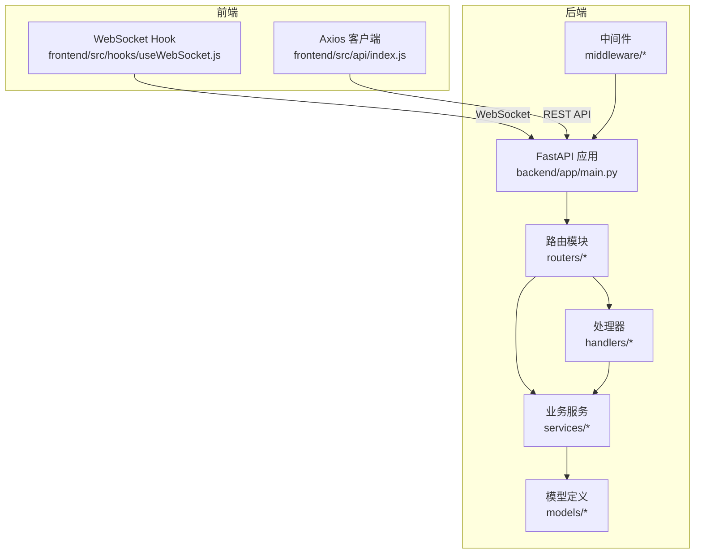
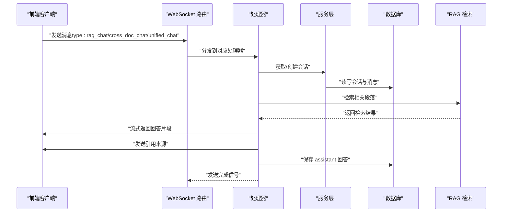
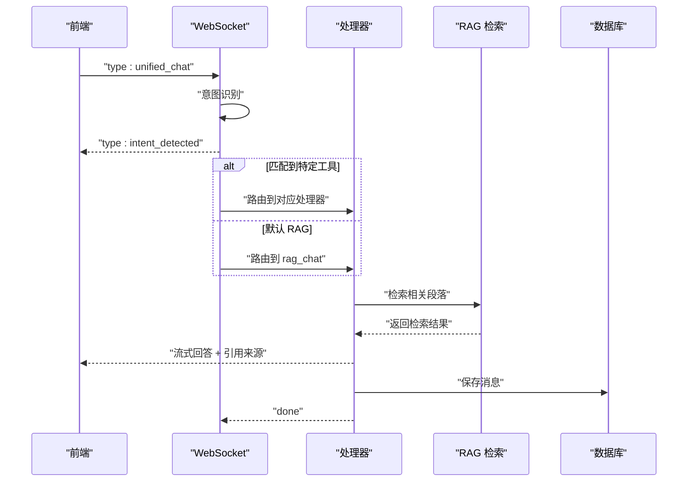
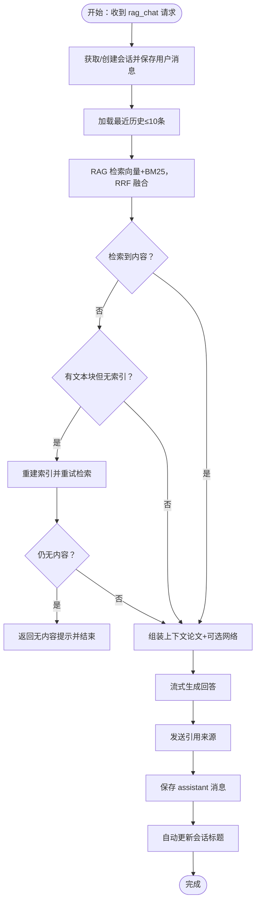
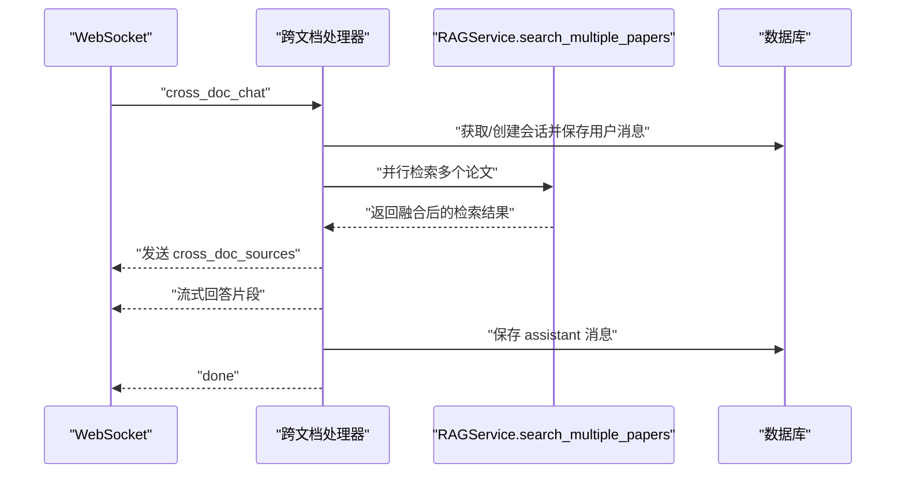
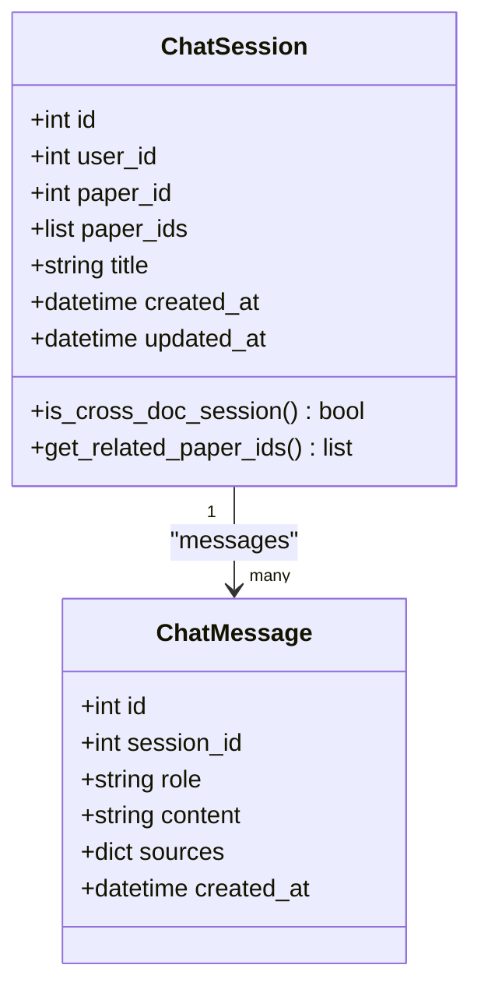
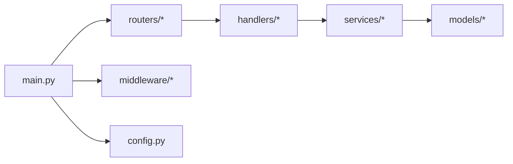

# 问答系统 API

<cite>
**本文档引用的文件**
- [backend/app/main.py](file://backend/app/main.py)
- [backend/app/routers/chat.py](file://backend/app/routers/chat.py)
- [backend/app/routers/ws.py](file://backend/app/routers/ws.py)
- [backend/app/handlers/chat_handler.py](file://backend/app/handlers/chat_handler.py)
- [backend/app/handlers/rag_handler.py](file://backend/app/handlers/rag_handler.py)
- [backend/app/handlers/cross_doc_handler.py](file://backend/app/handlers/cross_doc_handler.py)
- [backend/app/models/chat.py](file://backend/app/models/chat.py)
- [backend/app/services/rag_service.py](file://backend/app/services/rag_service.py)
- [backend/app/services/session_service.py](file://backend/app/services/session_service.py)
- [backend/app/services/message_service.py](file://backend/app/services/message_service.py)
- [backend/app/services/memory_service.py](file://backend/app/services/memory_service.py)
- [backend/app/services/llm_service.py](file://backend/app/services/llm_service.py)
- [backend/app/middleware/error_handler.py](file://backend/app/middleware/error_handler.py)
- [backend/app/config.py](file://backend/app/config.py)
- [frontend/src/hooks/useWebSocket.js](file://frontend/src/hooks/useWebSocket.js)
- [frontend/src/api/index.js](file://frontend/src/api/index.js)
</cite>

## 目录
1. [简介](#简介)
2. [项目结构](#项目结构)
3. [核心组件](#核心组件)
4. [架构总览](#架构总览)
5. [详细组件分析](#详细组件分析)
6. [依赖关系分析](#依赖关系分析)
7. [性能考虑](#性能考虑)
8. [故障排除指南](#故障排除指南)
9. [结论](#结论)
10. [附录](#附录)

## 简介
本文件为“问答系统 API”完整技术文档，覆盖基础问答、RAG 增强问答与跨文档问答的接口规范；详述消息发送、接收与历史记录管理的 REST API 与 WebSocket 实时通信协议；说明 RAG 检索机制与上下文管理策略；并提供对话状态管理与会话持久化的接口说明。文档面向前后端开发者与产品/测试人员，兼顾可读性与工程落地。

## 项目结构
后端采用 FastAPI + SQLAlchemy + LangChain + ChromaDB 的架构，前端通过 WebSocket 与后端进行实时交互，并通过 Axios 访问 REST API。

图表来源
- [backend/app/main.py:55-95](file://backend/app/main.py#L55-L95)
- [backend/app/routers/chat.py:18](file://backend/app/routers/chat.py#L18)
- [backend/app/routers/ws.py:29](file://backend/app/routers/ws.py#L29)

章节来源
- [backend/app/main.py:55-95](file://backend/app/main.py#L55-L95)
- [backend/app/routers/chat.py:18](file://backend/app/routers/chat.py#L18)
- [backend/app/routers/ws.py:29](file://backend/app/routers/ws.py#L29)

## 核心组件
- REST 路由与会话管理：提供会话创建、查询、更新、删除与消息分页查询。
- WebSocket 路由与实时处理：统一入口分发至基础问答、RAG 问答、跨文档问答、深度分析、Agent 问答等处理器。
- RAG 检索服务：基于 ChromaDB 向量检索与 BM25 关键词检索的混合检索，支持跨文档检索与重排序。
- 会话与消息持久化：通过 SQLAlchemy 模型与服务封装实现会话与消息的增删改查。
- 上下文与历史管理：LangChain ChatMessageHistory 与数据库历史结合，支持多轮对话与溯源引用。
- 错误处理与配置：全局异常处理中间件与配置中心。

章节来源
- [backend/app/routers/chat.py:21-417](file://backend/app/routers/chat.py#L21-L417)
- [backend/app/routers/ws.py:76-436](file://backend/app/routers/ws.py#L76-L436)
- [backend/app/services/rag_service.py:16-400](file://backend/app/services/rag_service.py#L16-L400)
- [backend/app/models/chat.py:14-71](file://backend/app/models/chat.py#L14-L71)
- [backend/app/middleware/error_handler.py:73-92](file://backend/app/middleware/error_handler.py#L73-L92)
- [backend/app/config.py:15-44](file://backend/app/config.py#L15-L44)

## 架构总览
系统通过 REST API 管理会话与消息，通过 WebSocket 提供实时问答能力。RAG 问答结合论文向量索引与可选网络搜索，跨文档问答聚合多篇论文的检索结果。会话状态与消息持久化于数据库，上下文通过 LangChain 历史与检索结果共同构成。

图表来源
- [backend/app/routers/ws.py:114-436](file://backend/app/routers/ws.py#L114-L436)
- [backend/app/handlers/rag_handler.py:29-217](file://backend/app/handlers/rag_handler.py#L29-L217)
- [backend/app/handlers/cross_doc_handler.py:14-95](file://backend/app/handlers/cross_doc_handler.py#L14-L95)
- [backend/app/services/rag_service.py:233-336](file://backend/app/services/rag_service.py#L233-L336)
- [backend/app/services/message_service.py:24-55](file://backend/app/services/message_service.py#L24-L55)

## 详细组件分析

### REST API：会话与消息管理
- 会话列表查询
  - 方法与路径：GET /api/chat/sessions
  - 查询参数：paper_id（可选）
  - 返回：会话列表（含标题、关联论文、是否跨文档、消息数等）
- 创建会话
  - 方法与路径：POST /api/chat/sessions
  - 请求体字段：paper_id（可选）、paper_ids（可选，跨文档）、title（可选）
  - 返回：新会话详情
- 获取会话详情（含消息历史）
  - 方法与路径：GET /api/chat/sessions/{session_id}
  - 返回：会话信息 + 消息数组（含角色、内容、来源、时间）
- 分页获取消息
  - 方法与路径：GET /api/chat/sessions/{session_id}/messages
  - 查询参数：limit（默认100）、offset（默认0）
  - 返回：消息列表 + 总数/分页信息
- 更新会话标题
  - 方法与路径：PUT /api/chat/sessions/{session_id}
  - 请求体字段：title
  - 返回：更新后的会话信息
- 删除会话
  - 方法与路径：DELETE /api/chat/sessions/{session_id}
  - 返回：删除成功消息
- 按论文获取或创建默认会话
  - 方法与路径：GET /api/chat/sessions/by-paper/{paper_id}
  - 返回：会话信息 + is_new 标记
- 创建跨文档会话
  - 方法与路径：POST /api/chat/sessions/cross-doc
  - 请求体字段：paper_ids（必填）、title（可选）
  - 返回：跨文档会话详情

章节来源
- [backend/app/routers/chat.py:21-417](file://backend/app/routers/chat.py#L21-L417)
- [backend/app/models/chat.py:14-71](file://backend/app/models/chat.py#L14-L71)

### WebSocket：实时通信协议与消息格式
- 连接与认证
  - 端点：/ws
  - 查询参数：token（JWT，可选）
  - 未提供 token 时降级为默认用户
- 支持的消息类型
  - analyze：论文分析（需要 text，长度≥50）
  - chat：基础问答（需要 message）
  - rag_chat：RAG 问答（需要 message、paper_id；可选 session_id、user_id、enable_search）
  - cross_doc_chat：跨文档问答（需要 message、paper_ids；可选 session_id、user_id）
  - deep_analyze：深度分析（需要 text，长度≥50）
  - agent_chat：Agent 问答（需要 message，可选 paper_id/paper_ids）
  - unified_chat：统一入口（根据关键词自动路由）
  - cancel：取消当前运行的任务
- 响应消息类型
  - analyze_chunk / chat_chunk / rag_chat_chunk / cross_doc_chunk：流式回答片段
  - rag_sources / cross_doc_sources：引用来源列表
  - search_status：网络搜索状态（searching/completed）
  - done：任务完成（携带 channel 与 session_id）
  - error：错误信息
  - intent_detected：统一入口的意图识别结果
  - keywords_result：关键词提取结果（异步）
  - status：索引建立过程状态
- 前端集成要点
  - 自动重连：最大重试次数与延迟
  - 消息订阅：按 type 或通配符订阅回调
  - 发送方法：sendMessage、sendRagMessage、sendCrossDocMessage、sendUnifiedChatMessage、sendCancel

图表来源
- [backend/app/routers/ws.py:76-436](file://backend/app/routers/ws.py#L76-L436)
- [frontend/src/hooks/useWebSocket.js:100-180](file://frontend/src/hooks/useWebSocket.js#L100-L180)

章节来源
- [backend/app/routers/ws.py:76-436](file://backend/app/routers/ws.py#L76-L436)
- [frontend/src/hooks/useWebSocket.js:100-180](file://frontend/src/hooks/useWebSocket.js#L100-L180)

### 基础问答（非 RAG）
- 处理器：handle_chat
- 输入：message、state.paper_context、state.chat_history
- 输出：流式回答片段 + done
- 适用场景：无需论文上下文的基础问答

章节来源
- [backend/app/handlers/chat_handler.py:11-32](file://backend/app/handlers/chat_handler.py#L11-L32)

### RAG 增强问答
- 处理器：handle_rag_chat
- 关键流程
  - 获取/创建会话并保存用户消息
  - 加载最近历史（最多10条）
  - 论文 RAG 检索（默认 top_k=5）
  - 可选网络搜索（enable_search=true）
  - 组装上下文与系统提示词
  - 流式获取回答，发送引用来源
  - 保存 assistant 回答与更新会话标题
- 检索机制
  - 向量检索：ChromaDB + SentenceTransformer 嵌入
  - 关键词检索：BM25（缓存优化）
  - 结果融合：RRF（Reciprocal Rank Fusion）
- 上下文管理
  - 会话历史：LangChain ChatMessageHistory
  - 引用来源：paper/web，含页码与分数

图表来源
- [backend/app/handlers/rag_handler.py:29-217](file://backend/app/handlers/rag_handler.py#L29-L217)
- [backend/app/services/rag_service.py:233-307](file://backend/app/services/rag_service.py#L233-L307)

章节来源
- [backend/app/handlers/rag_handler.py:29-217](file://backend/app/handlers/rag_handler.py#L29-L217)
- [backend/app/services/rag_service.py:16-400](file://backend/app/services/rag_service.py#L16-L400)

### 跨文档问答
- 处理器：handle_cross_doc_chat
- 关键流程
  - 获取/创建跨文档会话并保存用户消息（附带 paper_ids）
  - 并行检索多个论文（默认 top_k=8）
  - 发送引用来源（含 paper_id）
  - 流式生成回答
  - 保存 assistant 消息与更新会话标题

图表来源
- [backend/app/handlers/cross_doc_handler.py:14-95](file://backend/app/handlers/cross_doc_handler.py#L14-L95)
- [backend/app/services/rag_service.py:308-336](file://backend/app/services/rag_service.py#L308-L336)

章节来源
- [backend/app/handlers/cross_doc_handler.py:14-95](file://backend/app/handlers/cross_doc_handler.py#L14-L95)
- [backend/app/services/rag_service.py:308-336](file://backend/app/services/rag_service.py#L308-L336)

### 对话状态管理与会话持久化
- 会话模型
  - ChatSession：用户、论文（单/多）关联、标题、创建/更新时间
  - ChatMessage：角色、内容、来源、创建时间
- 服务封装
  - get_or_create_session：按 session_id 或创建新会话
  - auto_title：前两条消息自动更新标题
  - load_chat_history：从数据库加载最近历史
  - save_message：保存消息（含 sources）
- 关键策略
  - 跨文档会话：paper_ids 非空即为跨文档
  - 会话标题：默认“新对话”，前两条消息内自动命名
  - 消息来源：RAG/CrossDoc 返回引用来源，便于溯源

图表来源
- [backend/app/models/chat.py:14-71](file://backend/app/models/chat.py#L14-L71)

章节来源
- [backend/app/models/chat.py:14-71](file://backend/app/models/chat.py#L14-L71)
- [backend/app/services/session_service.py:17-54](file://backend/app/services/session_service.py#L17-L54)
- [backend/app/services/message_service.py:24-55](file://backend/app/services/message_service.py#L24-L55)

### RAG 检索机制与上下文管理策略
- 检索组件
  - ChromaDB：每篇论文独立 collection，向量存储与查询
  - BM25：关键词检索，缓存构建结果，避免重复开销
  - RRF 融合：综合语义与关键词排序
- 文本分块
  - 智能分块：按自然边界、固定 chunk_size、相邻块重叠
  - 元数据：页码集合、起始块索引
- 运行时配置
  - top_k、chunk_size、chunk_overlap 可运行时调整（部分即时生效）
- 跨文档检索
  - 并行检索多个论文，合并后按分数排序

章节来源
- [backend/app/services/rag_service.py:16-400](file://backend/app/services/rag_service.py#L16-L400)

### 用户记忆与个性化（扩展能力）
- 记忆服务
  - 提取：从对话中提取研究方向、偏好、术语用法、背景等
  - 存储：去重（相似度阈值）、向量化、重要性评分、时间衰减
  - 召回：向量相似度 + 重要性 + 时间衰减综合评分
  - 可选：构建用户画像、定期衰减
- 与问答结合
  - 可在系统提示词中注入用户记忆，提升个性化体验

章节来源
- [backend/app/services/memory_service.py:46-438](file://backend/app/services/memory_service.py#L46-L438)

## 依赖关系分析
- 应用入口与路由注册
  - main.py 负责创建 FastAPI 实例、配置 CORS、注册路由与异常处理
- 路由与处理器
  - chat 路由：REST 会话与消息管理
  - ws 路由：WebSocket 统一分发，处理器按消息类型执行
- 服务层
  - rag_service：RAG 检索核心
  - session_service/message_service：会话与消息持久化
  - memory_service：用户记忆（可选）
- 中间件与配置
  - 全局异常处理中间件
  - 配置中心（数据库、JWT、CORS、上传等）

图表来源
- [backend/app/main.py:55-95](file://backend/app/main.py#L55-L95)
- [backend/app/routers/chat.py:18](file://backend/app/routers/chat.py#L18)
- [backend/app/routers/ws.py:29](file://backend/app/routers/ws.py#L29)

章节来源
- [backend/app/main.py:55-95](file://backend/app/main.py#L55-L95)
- [backend/app/middleware/error_handler.py:73-92](file://backend/app/middleware/error_handler.py#L73-L92)
- [backend/app/config.py:15-44](file://backend/app/config.py#L15-L44)

## 性能考虑
- 检索性能
  - ChromaDB 向量检索与 BM25 缓存减少重复构建开销
  - RRF 融合在小 top_k 下效果稳定
- 并发与异步
  - WebSocket 任务并发控制与取消机制
  - RAGService 使用线程池异步调用嵌入模型
- I/O 与数据库
  - 会话历史与消息分页查询，限制返回数量
  - 关系预加载与索引优化（paper_id/paper_ids/user_id）

## 故障排除指南
- WebSocket 连接失败
  - 检查 token 是否有效或是否允许匿名连接
  - 查看前端自动重连逻辑与控制台错误
- RAG 问答无结果
  - 确认论文已解析且存在文本块
  - 若无索引，系统会尝试重建索引；等待完成后重试
  - 启用网络搜索（enable_search=true）以扩大知识源
- REST API 返回 4xx/5xx
  - 校验请求参数与权限
  - 查看全局异常处理中间件返回的标准化错误信息

章节来源
- [backend/app/middleware/error_handler.py:11-92](file://backend/app/middleware/error_handler.py#L11-L92)
- [backend/app/routers/ws.py:120-130](file://backend/app/routers/ws.py#L120-L130)
- [backend/app/handlers/rag_handler.py:48-90](file://backend/app/handlers/rag_handler.py#L48-L90)

## 结论
本系统提供从 REST 到 WebSocket 的完整问答能力，RAG 问答结合论文向量与关键词检索，跨文档问答支持多论文聚合检索。通过会话与消息持久化、上下文与历史管理、以及可选的用户记忆服务，系统在准确性与个性化方面具备良好扩展性。建议在生产环境中完善监控、限流与缓存策略，并持续优化检索与生成提示词。

## 附录

### 健康检查端点
- GET /api/health
- 返回应用状态与版本信息

章节来源
- [backend/app/main.py:102-114](file://backend/app/main.py#L102-L114)

### 前端集成要点
- Axios 基础地址：/api
- WebSocket 地址：ws/wss://host/ws（带 token 查询参数）
- 重连策略：最大重试次数与延迟
- 消息订阅：按 type 或通配符注册回调

章节来源
- [frontend/src/api/index.js:4-12](file://frontend/src/api/index.js#L4-L12)
- [frontend/src/hooks/useWebSocket.js:3-180](file://frontend/src/hooks/useWebSocket.js#L3-L180)