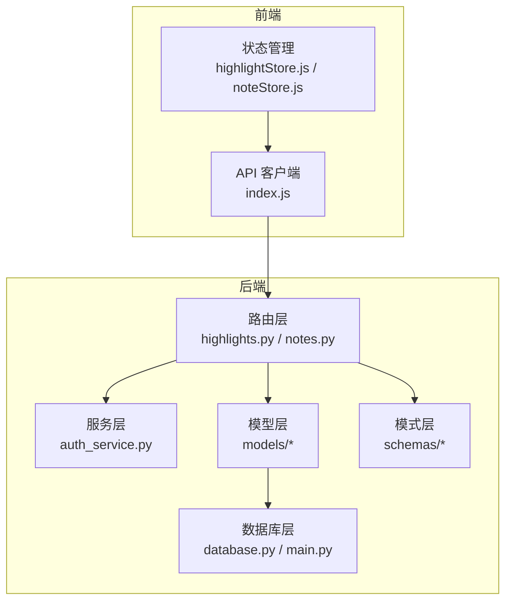
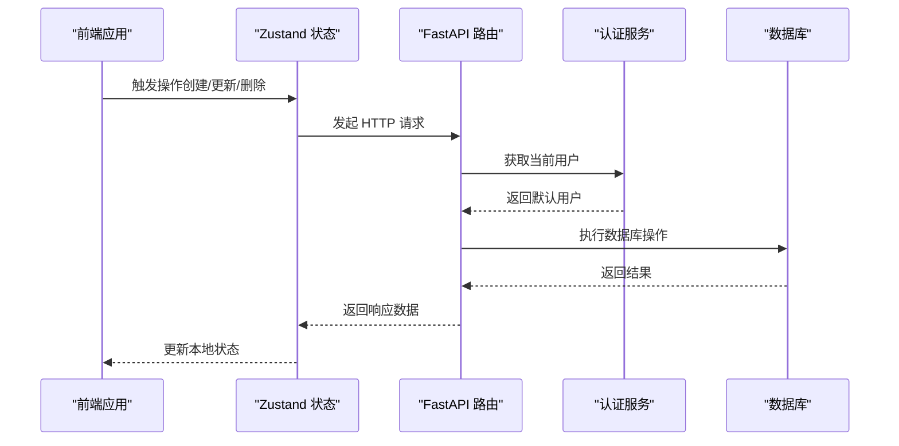
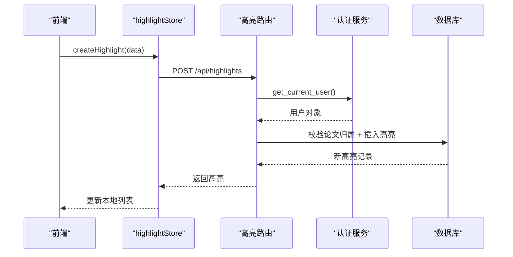
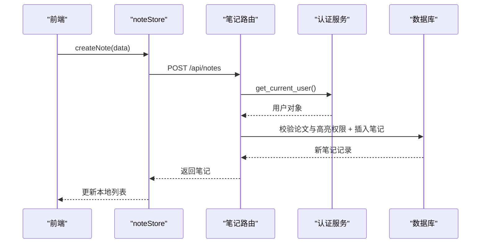
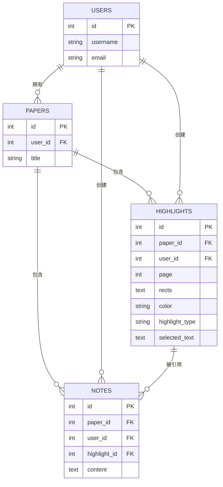
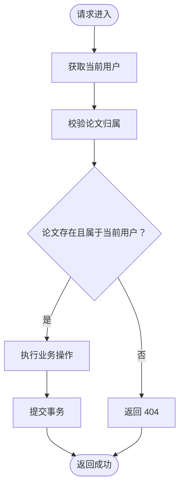
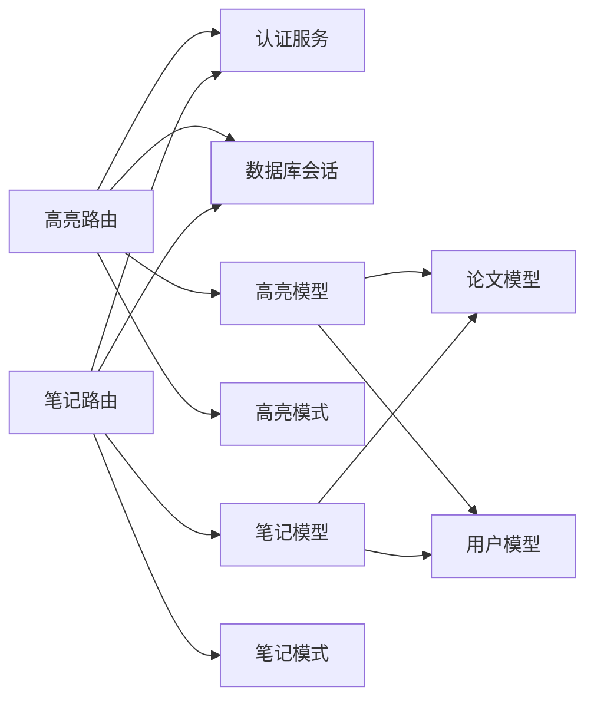

# 高亮与笔记 API

<cite>
**本文引用的文件**
- [backend/app/routers/highlights.py](file://backend/app/routers/highlights.py)
- [backend/app/routers/notes.py](file://backend/app/routers/notes.py)
- [backend/app/models/highlight.py](file://backend/app/models/highlight.py)
- [backend/app/models/note.py](file://backend/app/models/note.py)
- [backend/app/schemas/highlight.py](file://backend/app/schemas/highlight.py)
- [backend/app/schemas/note.py](file://backend/app/schemas/note.py)
- [backend/app/models/paper.py](file://backend/app/models/paper.py)
- [backend/app/models/user.py](file://backend/app/models/user.py)
- [backend/app/services/auth_service.py](file://backend/app/services/auth_service.py)
- [backend/app/database.py](file://backend/app/database.py)
- [backend/app/main.py](file://backend/app/main.py)
- [frontend/src/stores/highlightStore.js](file://frontend/src/stores/highlightStore.js)
- [frontend/src/stores/noteStore.js](file://frontend/src/stores/noteStore.js)
</cite>

## 目录
1. [简介](#简介)
2. [项目结构](#项目结构)
3. [核心组件](#核心组件)
4. [架构总览](#架构总览)
5. [详细组件分析](#详细组件分析)
6. [依赖分析](#依赖分析)
7. [性能考虑](#性能考虑)
8. [故障排除指南](#故障排除指南)
9. [结论](#结论)
10. [附录](#附录)

## 简介
本文件为高亮与笔记管理系统的完整 API 文档，覆盖高亮标注与笔记的创建、查询、更新、删除等 CRUD 接口，以及文本选择、坐标计算与标注同步的端点设计思路。系统采用 FastAPI + SQLAlchemy 异步 ORM 架构，前端通过 Zustand 状态管理与后端进行交互。文档同时说明了标注数据的存储格式、检索机制、高亮样式定制与笔记模板管理的接口设计。

## 项目结构
后端采用分层架构：路由层负责暴露 API；服务层处理业务逻辑；模型层定义数据库实体；模式层定义请求/响应数据结构；数据库层负责连接与生命周期管理。前端使用 Zustand 管理高亮与笔记的状态，统一通过 API 进行数据同步。

**图表来源**
- [backend/app/routers/highlights.py:1-189](file://backend/app/routers/highlights.py#L1-L189)
- [backend/app/routers/notes.py:1-350](file://backend/app/routers/notes.py#L1-L350)
- [backend/app/services/auth_service.py:1-40](file://backend/app/services/auth_service.py#L1-L40)
- [backend/app/models/highlight.py:1-37](file://backend/app/models/highlight.py#L1-L37)
- [backend/app/models/note.py:1-34](file://backend/app/models/note.py#L1-L34)
- [backend/app/database.py:1-81](file://backend/app/database.py#L1-L81)
- [backend/app/main.py:1-114](file://backend/app/main.py#L1-L114)
- [frontend/src/stores/highlightStore.js:1-102](file://frontend/src/stores/highlightStore.js#L1-L102)
- [frontend/src/stores/noteStore.js:1-145](file://frontend/src/stores/noteStore.js#L1-L145)

**章节来源**
- [backend/app/main.py:1-114](file://backend/app/main.py#L1-L114)
- [backend/app/database.py:1-81](file://backend/app/database.py#L1-L81)

## 核心组件
- 高亮标注模块：提供按论文维度的高亮查询、创建、更新、删除接口，支持颜色与标注类型的定制。
- 笔记模块：提供按论文维度的笔记查询、创建、更新、删除接口，支持与高亮的关联与全文搜索。
- 权限控制：通过默认用户机制实现个人使用场景下的无登录认证，确保资源隔离。
- 数据模型：高亮与笔记均与论文、用户建立外键关联，支持级联删除与空值处理。

**章节来源**
- [backend/app/routers/highlights.py:1-189](file://backend/app/routers/highlights.py#L1-L189)
- [backend/app/routers/notes.py:1-350](file://backend/app/routers/notes.py#L1-L350)
- [backend/app/models/highlight.py:1-37](file://backend/app/models/highlight.py#L1-L37)
- [backend/app/models/note.py:1-34](file://backend/app/models/note.py#L1-L34)
- [backend/app/models/paper.py:1-85](file://backend/app/models/paper.py#L1-L85)
- [backend/app/models/user.py:1-36](file://backend/app/models/user.py#L1-L36)
- [backend/app/services/auth_service.py:1-40](file://backend/app/services/auth_service.py#L1-L40)

## 架构总览
系统采用前后端分离架构，后端提供 RESTful API，前端通过状态管理与 API 交互。数据库为异步 SQLAlchemy，支持 SQLite（开发环境）。

**图表来源**
- [frontend/src/stores/highlightStore.js:1-102](file://frontend/src/stores/highlightStore.js#L1-L102)
- [frontend/src/stores/noteStore.js:1-145](file://frontend/src/stores/noteStore.js#L1-L145)
- [backend/app/routers/highlights.py:1-189](file://backend/app/routers/highlights.py#L1-L189)
- [backend/app/routers/notes.py:1-350](file://backend/app/routers/notes.py#L1-L350)
- [backend/app/services/auth_service.py:1-40](file://backend/app/services/auth_service.py#L1-L40)
- [backend/app/database.py:1-81](file://backend/app/database.py#L1-L81)

## 详细组件分析

### 高亮标注 API
- 获取论文的所有高亮
  - 方法与路径：GET /api/highlights/paper/{paper_id}
  - 权限：仅允许访问当前用户的论文高亮
  - 响应：高亮标注列表（按页码与创建时间排序）
- 创建高亮
  - 方法与路径：POST /api/highlights
  - 请求体：paper_id、page、rects（JSON 字符串）、color、highlight_type、selected_text
  - 响应：创建成功的高亮对象
- 更新高亮
  - 方法与路径：PUT /api/highlights/{highlight_id}
  - 请求体：color、highlight_type（可选）
  - 响应：更新后的高亮对象
- 删除高亮
  - 方法与路径：DELETE /api/highlights/{highlight_id}
  - 响应：204 No Content

**图表来源**
- [frontend/src/stores/highlightStore.js:26-44](file://frontend/src/stores/highlightStore.js#L26-L44)
- [backend/app/routers/highlights.py:58-106](file://backend/app/routers/highlights.py#L58-L106)
- [backend/app/services/auth_service.py:13-39](file://backend/app/services/auth_service.py#L13-L39)

**章节来源**
- [backend/app/routers/highlights.py:20-106](file://backend/app/routers/highlights.py#L20-L106)
- [backend/app/schemas/highlight.py:7-37](file://backend/app/schemas/highlight.py#L7-L37)
- [backend/app/models/highlight.py:10-37](file://backend/app/models/highlight.py#L10-L37)

### 笔记 API
- 获取论文的所有笔记（含关联高亮文本）
  - 方法与路径：GET /api/notes?paper_id={paper_id}
  - 响应：笔记列表（包含 highlight_text 字段）
- 创建笔记（可选绑定高亮）
  - 方法与路径：POST /api/notes
  - 请求体：paper_id、highlight_id（可选）、content
  - 响应：创建成功的笔记对象
- 获取单个笔记详情（含关联高亮文本）
  - 方法与路径：GET /api/notes/{note_id}
  - 响应：笔记详情（包含 highlight_text 字段）
- 更新笔记（可选更新高亮绑定）
  - 方法与路径：PUT /api/notes/{note_id}
  - 请求体：content（可选）、highlight_id（可选）
  - 响应：更新后的笔记对象
- 删除笔记
  - 方法与路径：DELETE /api/notes/{note_id}
  - 响应：204 No Content
- 搜索笔记（模糊匹配内容）
  - 方法与路径：GET /api/notes/search?q={query}&paper_id={paper_id}
  - 响应：匹配的笔记列表（可选限定论文）

**图表来源**
- [frontend/src/stores/noteStore.js:27-45](file://frontend/src/stores/noteStore.js#L27-L45)
- [backend/app/routers/notes.py:77-138](file://backend/app/routers/notes.py#L77-L138)
- [backend/app/services/auth_service.py:13-39](file://backend/app/services/auth_service.py#L13-L39)

**章节来源**
- [backend/app/routers/notes.py:21-75](file://backend/app/routers/notes.py#L21-L75)
- [backend/app/routers/notes.py:77-138](file://backend/app/routers/notes.py#L77-L138)
- [backend/app/routers/notes.py:140-183](file://backend/app/routers/notes.py#L140-L183)
- [backend/app/routers/notes.py:185-248](file://backend/app/routers/notes.py#L185-L248)
- [backend/app/routers/notes.py:250-282](file://backend/app/routers/notes.py#L250-L282)
- [backend/app/routers/notes.py:285-350](file://backend/app/routers/notes.py#L285-L350)
- [backend/app/schemas/note.py:7-36](file://backend/app/schemas/note.py#L7-L36)
- [backend/app/models/note.py:11-34](file://backend/app/models/note.py#L11-L34)

### 数据模型与关系
高亮与笔记均与论文、用户建立外键关联，支持级联删除与空值处理。高亮可被多个笔记引用，删除高亮时笔记的高亮引用会被置空。

**图表来源**
- [backend/app/models/user.py:11-36](file://backend/app/models/user.py#L11-L36)
- [backend/app/models/paper.py:11-63](file://backend/app/models/paper.py#L11-L63)
- [backend/app/models/highlight.py:10-37](file://backend/app/models/highlight.py#L10-L37)
- [backend/app/models/note.py:11-34](file://backend/app/models/note.py#L11-L34)

**章节来源**
- [backend/app/models/user.py:1-36](file://backend/app/models/user.py#L1-L36)
- [backend/app/models/paper.py:1-85](file://backend/app/models/paper.py#L1-L85)
- [backend/app/models/highlight.py:1-37](file://backend/app/models/highlight.py#L1-L37)
- [backend/app/models/note.py:1-34](file://backend/app/models/note.py#L1-L34)

### 权限控制与认证
- 默认用户机制：系统始终返回 id=1 的默认用户，无需登录即可使用。
- 资源访问控制：所有高亮与笔记操作均要求 paper_id 属于当前用户，否则返回 404。
- 外键约束：高亮与笔记均带有 user_id 外键，确保数据隔离。

**图表来源**
- [backend/app/services/auth_service.py:13-39](file://backend/app/services/auth_service.py#L13-L39)
- [backend/app/routers/highlights.py:35-55](file://backend/app/routers/highlights.py#L35-L55)
- [backend/app/routers/notes.py:36-47](file://backend/app/routers/notes.py#L36-L47)

**章节来源**
- [backend/app/services/auth_service.py:1-40](file://backend/app/services/auth_service.py#L1-L40)
- [backend/app/routers/highlights.py:35-55](file://backend/app/routers/highlights.py#L35-L55)
- [backend/app/routers/notes.py:36-47](file://backend/app/routers/notes.py#L36-L47)

### 数据存储格式与检索机制
- 高亮坐标存储：rects 字段以 JSON 字符串形式存储矩形数组，每个元素包含 x0、y0、x1、y1。
- 高亮样式定制：color 支持任意合法颜色值；highlight_type 支持 highlight/underline/strikethrough。
- 笔记内容：content 为文本字段，支持长文本存储。
- 检索机制：按论文与用户过滤；高亮按 page 与创建时间排序；笔记按创建时间倒序；支持全文模糊搜索。

**章节来源**
- [backend/app/models/highlight.py:19-22](file://backend/app/models/highlight.py#L19-L22)
- [backend/app/schemas/highlight.py:11-14](file://backend/app/schemas/highlight.py#L11-L14)
- [backend/app/routers/notes.py:285-350](file://backend/app/routers/notes.py#L285-L350)

### 前端集成与状态管理
- 高亮状态：highlightStore 提供加载、创建、更新、删除高亮的操作，自动维护本地列表与错误状态。
- 笔记状态：noteStore 提供加载、创建、更新、删除、搜索、详情获取等操作，支持搜索结果与活动笔记状态管理。
- API 调用：前端通过统一的 API 客户端发起请求，路由层完成权限校验与数据持久化。

**章节来源**
- [frontend/src/stores/highlightStore.js:1-102](file://frontend/src/stores/highlightStore.js#L1-L102)
- [frontend/src/stores/noteStore.js:1-145](file://frontend/src/stores/noteStore.js#L1-L145)

## 依赖分析
- 路由依赖：高亮与笔记路由分别依赖认证服务、数据库会话与对应模型/模式。
- 模型依赖：高亮与笔记模型依赖论文与用户模型，形成清晰的外键关系。
- 前端依赖：状态管理依赖 API 客户端，API 客户端依赖后端路由。

**图表来源**
- [backend/app/routers/highlights.py:1-189](file://backend/app/routers/highlights.py#L1-L189)
- [backend/app/routers/notes.py:1-350](file://backend/app/routers/notes.py#L1-L350)
- [backend/app/services/auth_service.py:1-40](file://backend/app/services/auth_service.py#L1-L40)
- [backend/app/models/highlight.py:1-37](file://backend/app/models/highlight.py#L1-L37)
- [backend/app/models/note.py:1-34](file://backend/app/models/note.py#L1-L34)
- [backend/app/models/paper.py:1-85](file://backend/app/models/paper.py#L1-L85)
- [backend/app/models/user.py:1-36](file://backend/app/models/user.py#L1-L36)

**章节来源**
- [backend/app/routers/highlights.py:1-189](file://backend/app/routers/highlights.py#L1-L189)
- [backend/app/routers/notes.py:1-350](file://backend/app/routers/notes.py#L1-L350)
- [backend/app/models/highlight.py:1-37](file://backend/app/models/highlight.py#L1-L37)
- [backend/app/models/note.py:1-34](file://backend/app/models/note.py#L1-L34)

## 性能考虑
- 异步数据库：使用 SQLAlchemy 异步引擎与会话，减少阻塞，提升并发能力。
- 索引策略：高亮与笔记对 paper_id、user_id 建有索引，查询效率较高。
- 批量操作建议：前端可通过本地状态聚合多次变更，减少网络往返；后端未提供专门的批量接口，建议在前端合并后再发起请求。
- 缓存与搜索：笔记支持全文模糊搜索，建议在高频查询场景下增加全文索引或搜索引擎集成。

[本节为通用性能建议，不直接分析具体文件]

## 故障排除指南
- 404 错误：常见于论文不存在或无权限访问。请确认 paper_id 属于当前用户。
- 高亮/笔记不存在：更新或删除时若找不到目标记录会返回 404，请确认 ID 正确。
- 高亮类型非法：highlight_type 仅支持预设值，非法值可能导致校验失败。
- 笔记高亮绑定无效：更新笔记时若指定新的 highlight_id，需确保其属于同一论文且属于当前用户。

**章节来源**
- [backend/app/routers/highlights.py:136-141](file://backend/app/routers/highlights.py#L136-L141)
- [backend/app/routers/notes.py:213-218](file://backend/app/routers/notes.py#L213-L218)
- [backend/app/routers/notes.py:232-237](file://backend/app/routers/notes.py#L232-L237)

## 结论
本系统提供了完整的高亮与笔记管理 API，具备良好的权限控制与数据一致性保障。高亮标注支持坐标存储与样式定制，笔记支持与高亮关联与全文搜索。前端通过状态管理与后端 API 协同，实现高效的标注与笔记工作流。后续可在批量操作、全文检索性能与样式模板管理方面进一步增强。

[本节为总结性内容，不直接分析具体文件]

## 附录

### API 端点一览
- 高亮标注
  - GET /api/highlights/paper/{paper_id}：获取论文的所有高亮
  - POST /api/highlights：创建高亮
  - PUT /api/highlights/{highlight_id}：更新高亮
  - DELETE /api/highlights/{highlight_id}：删除高亮
- 笔记
  - GET /api/notes?paper_id={paper_id}：获取论文的所有笔记
  - POST /api/notes：创建笔记
  - GET /api/notes/{note_id}：获取单个笔记详情
  - PUT /api/notes/{note_id}：更新笔记
  - DELETE /api/notes/{note_id}：删除笔记
  - GET /api/notes/search?q={query}&paper_id={paper_id}：搜索笔记

**章节来源**
- [backend/app/routers/highlights.py:20-189](file://backend/app/routers/highlights.py#L20-L189)
- [backend/app/routers/notes.py:21-350](file://backend/app/routers/notes.py#L21-L350)

### 数据模型字段说明
- 高亮（highlights）
  - id、paper_id、user_id、page、rects（JSON 字符串）、color、highlight_type、selected_text、created_at、updated_at
- 笔记（notes）
  - id、paper_id、user_id、highlight_id（可空）、content、created_at、updated_at

**章节来源**
- [backend/app/models/highlight.py:15-28](file://backend/app/models/highlight.py#L15-L28)
- [backend/app/models/note.py:16-30](file://backend/app/models/note.py#L16-L30)