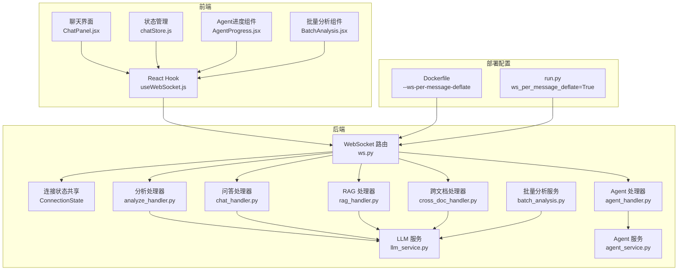
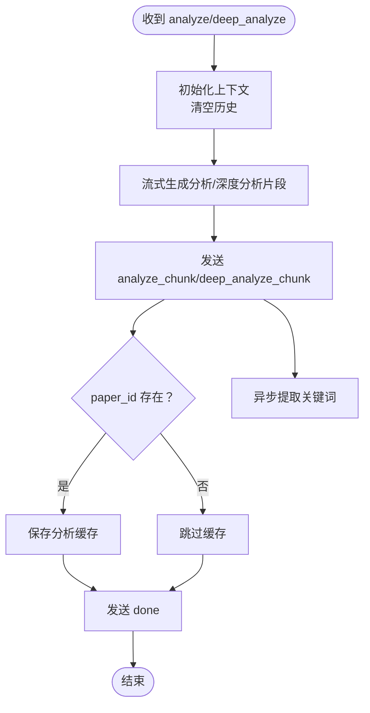
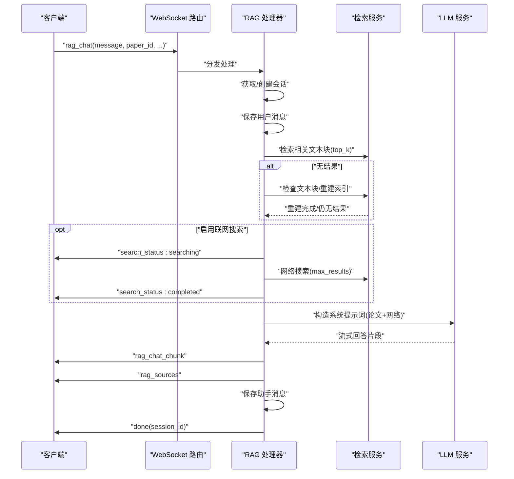
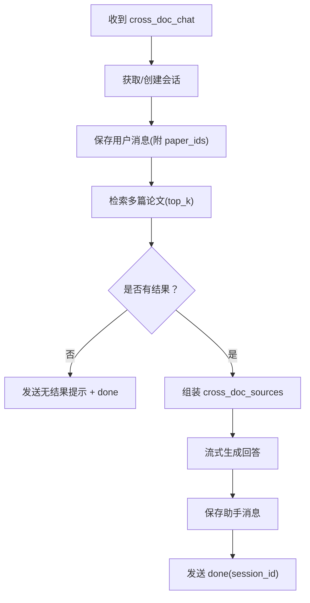
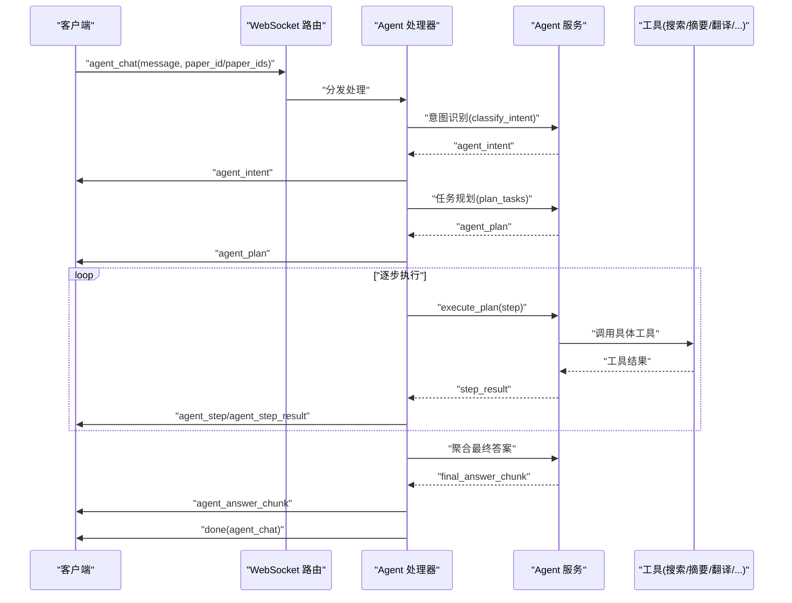
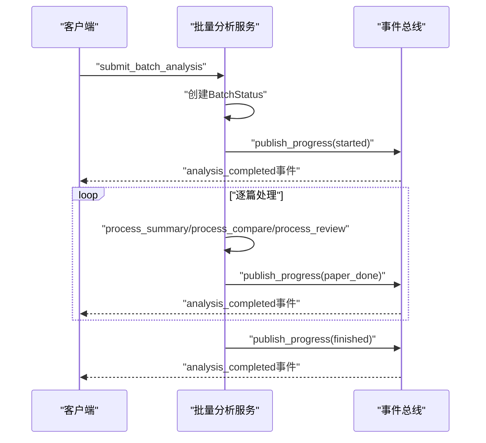
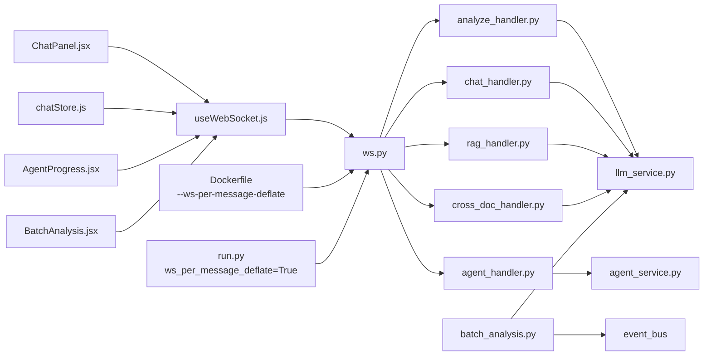

# WebSocket 通信协议

<cite>
**本文引用的文件**
- [backend/app/routers/ws.py](file://backend/app/routers/ws.py)
- [backend/app/handlers/analyze_handler.py](file://backend/app/handlers/analyze_handler.py)
- [backend/app/handlers/chat_handler.py](file://backend/app/handlers/chat_handler.py)
- [backend/app/handlers/rag_handler.py](file://backend/app/handlers/rag_handler.py)
- [backend/app/handlers/cross_doc_handler.py](file://backend/app/handlers/cross_doc_handler.py)
- [backend/app/handlers/agent_handler.py](file://backend/app/handlers/agent_handler.py)
- [backend/app/services/agent_service.py](file://backend/app/services/agent_service.py)
- [backend/app/services/llm/llm_service.py](file://backend/app/services/llm/llm_service.py)
- [backend/app/handlers/ws_utils.py](file://backend/app/handlers/ws_utils.py)
- [backend/app/routers/batch_analysis.py](file://backend/app/routers/batch_analysis.py)
- [backend/app/services/batch_analysis.py](file://backend/app/services/batch_analysis.py)
- [frontend/src/hooks/useWebSocket.js](file://frontend/src/hooks/useWebSocket.js)
- [frontend/src/components/ChatPanel/ChatPanel.jsx](file://frontend/src/components/ChatPanel/ChatPanel.jsx)
- [frontend/src/stores/chatStore.js](file://frontend/src/stores/chatStore.js)
- [frontend/src/components/AgentProgress/AgentProgress.jsx](file://frontend/src/components/AgentProgress/AgentProgress.jsx)
- [frontend/src/components/BatchAnalysis/BatchAnalysis.jsx](file://frontend/src/components/BatchAnalysis/BatchAnalysis.jsx)
- [backend/app/middleware/error_handler.py](file://backend/app/middleware/error_handler.py)
- [backend/Dockerfile](file://backend/Dockerfile)
- [backend/run.py](file://backend/run.py)
</cite>

## 更新摘要
**变更内容**
- 新增Agent进度流式传输消息类型：agent_intent、agent_plan、agent_step、agent_step_result、agent_answer_chunk
- 新增批量处理状态更新机制：通过事件总线推送批量分析进度
- 新增WebSocket permessage-deflate压缩优化章节
- 更新部署配置以反映压缩参数设置
- 增强性能考量部分以包含压缩优化说明
- 更新故障排查指南以包含压缩相关问题诊断

## 目录
1. [简介](#简介)
2. [项目结构](#项目结构)
3. [核心组件](#核心组件)
4. [架构总览](#架构总览)
5. [详细组件分析](#详细组件分析)
6. [依赖关系分析](#依赖关系分析)
7. [性能考量](#性能考量)
8. [故障排查指南](#故障排查指南)
9. [结论](#结论)
10. [附录](#附录)

## 简介
本文件面向 PaperChat 的 WebSocket 实时通信协议，系统性阐述双向实时通信的架构设计、连接建立、消息传递与断线重连机制；明确客户端到服务器的消息类型定义（分析请求、问答请求、跨文档问答、Agent 智能体通信），以及服务器到客户端的响应格式（流式数据、引用来源列表、错误处理）。同时提供完整的消息协议规范、字段定义、状态码说明、连接生命周期管理、心跳与异常处理策略，并给出客户端集成示例与调试技巧。

**更新** 本版本新增了WebSocket permessage-deflate压缩优化功能，通过在Dockerfile和本地开发环境中启用压缩参数，显著提升了WebSocket通信性能和带宽利用率。同时新增了Agent智能体进度流式传输和批量处理状态更新等新消息类型，增强了实时交互体验。

## 项目结构
PaperChat 的 WebSocket 位于后端 FastAPI 路由模块，通过独立的 WebSocket 端点接收消息并分发至各业务处理器；前端通过自定义 React Hook 管理连接、消息收发与重连逻辑。



**图表来源**
- [backend/app/routers/ws.py:29-275](file://backend/app/routers/ws.py#L29-L275)
- [backend/app/handlers/analyze_handler.py:13-87](file://backend/app/handlers/analyze_handler.py#L13-L87)
- [backend/app/handlers/chat_handler.py:11-32](file://backend/app/handlers/chat_handler.py#L11-L32)
- [backend/app/handlers/rag_handler.py:29-217](file://backend/app/handlers/rag_handler.py#L29-L217)
- [backend/app/handlers/cross_doc_handler.py:14-95](file://backend/app/handlers/cross_doc_handler.py#L14-L95)
- [backend/app/handlers/agent_handler.py:12-75](file://backend/app/handlers/agent_handler.py#L12-L75)
- [backend/app/services/llm/llm_service.py:29-200](file://backend/app/services/llm/llm_service.py#L29-L200)
- [backend/app/services/agent_service.py:528-800](file://backend/app/services/agent_service.py#L528-800)
- [backend/app/services/batch_analysis.py:94-370](file://backend/app/services/batch_analysis.py#L94-370)
- [frontend/src/hooks/useWebSocket.js:1-180](file://frontend/src/hooks/useWebSocket.js#L1-L180)
- [frontend/src/components/ChatPanel/ChatPanel.jsx:132-200](file://frontend/src/components/ChatPanel/ChatPanel.jsx#L132-L200)
- [frontend/src/stores/chatStore.js:1-200](file://frontend/src/stores/chatStore.js#L1-L200)
- [frontend/src/components/AgentProgress/AgentProgress.jsx:1-219](file://frontend/src/components/AgentProgress/AgentProgress.jsx#L1-L219)
- [frontend/src/components/BatchAnalysis/BatchAnalysis.jsx:1-320](file://frontend/src/components/BatchAnalysis/BatchAnalysis.jsx#L1-L320)
- [backend/Dockerfile:19](file://backend/Dockerfile#L19)
- [backend/run.py:30](file://backend/run.py#L30)

**章节来源**
- [backend/app/routers/ws.py:29-275](file://backend/app/routers/ws.py#L29-L275)
- [frontend/src/hooks/useWebSocket.js:1-180](file://frontend/src/hooks/useWebSocket.js#L1-L180)
- [backend/Dockerfile:19](file://backend/Dockerfile#L19)
- [backend/run.py:30](file://backend/run.py#L30)

## 核心组件
- WebSocket 路由与连接管理：负责认证、连接接受、消息分发、任务并发控制与清理。
- 处理器层：按消息类型分发到具体业务处理器（分析、问答、RAG、跨文档、Agent）。
- 服务层：LLM 服务提供流式生成能力；Agent 服务提供意图识别、任务规划与工具执行；批量分析服务提供异步任务处理。
- 前端 Hook：封装 WebSocket 连接、消息订阅、重连策略与发送接口。
- **压缩优化层**：通过permessage-deflate压缩算法减少WebSocket消息传输大小，提升带宽利用率。
- **进度监控层**：批量分析通过事件总线推送进度状态，支持实时监控。

**章节来源**
- [backend/app/routers/ws.py:29-275](file://backend/app/routers/ws.py#L29-L275)
- [backend/app/handlers/analyze_handler.py:13-87](file://backend/app/handlers/analyze_handler.py#L13-L87)
- [backend/app/handlers/chat_handler.py:11-32](file://backend/app/handlers/chat_handler.py#L11-L32)
- [backend/app/handlers/rag_handler.py:29-217](file://backend/app/handlers/rag_handler.py#L29-L217)
- [backend/app/handlers/cross_doc_handler.py:14-95](file://backend/app/handlers/cross_doc_handler.py#L14-L95)
- [backend/app/handlers/agent_handler.py:12-75](file://backend/app/handlers/agent_handler.py#L12-L75)
- [backend/app/services/llm/llm_service.py:29-200](file://backend/app/services/llm/llm_service.py#L29-L200)
- [backend/app/services/agent_service.py:528-800](file://backend/app/services/agent_service.py#L528-800)
- [backend/app/services/batch_analysis.py:94-370](file://backend/app/services/batch_analysis.py#L94-370)
- [frontend/src/hooks/useWebSocket.js:1-180](file://frontend/src/hooks/useWebSocket.js#L1-L180)

## 架构总览
WebSocket 采用"路由分发 + 处理器执行"的模式，每个消息类型映射到一个异步处理函数，支持流式响应与引用来源回传。连接状态在处理器间共享，便于会话持久化与上下文维护。**更新** 新增的压缩优化层在网络传输层面提供性能增强，新增的Agent进度流式传输机制提供实时的智能体执行状态反馈，批量分析服务通过事件总线实现异步任务的实时监控。

```mermaid
sequenceDiagram
participant FE as "前端客户端"
participant WS as "WebSocket 路由(ws.py)"
participant COMP as "压缩优化层"
participant ST as "连接状态(ConnectionState)"
participant HD as "业务处理器"
participant SV as "LLM/Agent 服务"
FE->>WS : "建立连接(token 可选)"
WS->>COMP : "启用 permessage-deflate 压缩"
COMP-->>FE : "压缩后的连接"
loop "消息循环"
FE->>WS : "type : 消息类型 + 载荷"
WS->>ST : "更新状态(会话/上下文)"
WS->>HD : "分发到对应处理器"
HD->>SV : "调用服务(流式/非流式)"
SV-->>HD : "流式片段/最终结果"
HD-->>WS : "组装响应(片段/来源/完成)"
WS->>COMP : "应用压缩算法"
COMP-->>FE : "type : 压缩后的响应 + 数据"
opt "Agent进度流式传输"
FE->>WS : "agent_chat"
WS->>HD : "handle_agent_chat"
HD->>SV : "classify_intent/plan_tasks"
SV-->>HD : "agent_intent/agent_plan"
HD-->>WS : "agent_intent/agent_plan"
loop "逐步执行"
HD->>SV : "execute_plan(step)"
SV-->>HD : "agent_step/agent_step_result"
HD-->>WS : "agent_step/agent_step_result"
end
HD->>SV : "aggregate_results"
SV-->>HD : "agent_answer_chunk"
HD-->>WS : "agent_answer_chunk"
end
opt "批量分析状态更新"
SV->>SV : "publish_progress(event_bus)"
SV-->>FE : "analysis_completed事件"
end
WS-->>COMP : "关闭压缩连接"
COMP-->>FE : "关闭连接(异常/断开)"
```

**图表来源**
- [backend/app/routers/ws.py:157-176](file://backend/app/routers/ws.py#L157-L176)
- [backend/app/handlers/agent_handler.py:17-64](file://backend/app/handlers/agent_handler.py#L17-L64)
- [backend/app/services/agent_service.py:680-761](file://backend/app/services/agent_service.py#L680-761)
- [backend/app/services/batch_analysis.py:352-365](file://backend/app/services/batch_analysis.py#L352-365)

## 详细组件分析

### WebSocket 路由与连接生命周期
- 认证：支持 JWT token；无 token 时允许连接但后续行为受限。
- 连接接受：成功后初始化连接状态对象，存储用户、会话、论文上下文与运行中的任务集合。
- 消息循环：读取文本消息，解析 JSON，按 type 分发；同一类型消息到达时取消之前的任务。
- 断线与清理：捕获断开与异常，取消所有任务并安全关闭连接。
- **压缩支持**：自动启用permessage-deflate压缩，减少消息传输大小。

**章节来源**
- [backend/app/routers/ws.py:29-275](file://backend/app/routers/ws.py#L29-L275)

### 客户端到服务器的消息类型定义
- 分析论文
  - 类型：analyze
  - 载荷字段：text（论文文本）、paper_id（可选）
  - 行为：校验文本长度，流式返回分析片段，完成后发送完成信号
- 问答（全文上下文）
  - 类型：chat
  - 载荷字段：message（问题）
  - 行为：基于全文上下文的流式问答，返回片段与完成信号
- RAG 问答
  - 类型：rag_chat
  - 载荷字段：message（问题）、paper_id（必需）、session_id（可选）、user_id（可选）、enable_search（布尔）
  - 行为：检索相关文本块，可选联网搜索，流式返回回答与引用来源，保存消息与会话标题
- 跨文档问答
  - 类型：cross_doc_chat
  - 载荷字段：message（问题）、paper_ids（论文 ID 列表，至少一个）、session_id（可选）、user_id（可选）
  - 行为：跨多篇论文检索，返回引用来源与流式回答，保存消息
- 深度分析
  - 类型：deep_analyze
  - 载荷字段：text（论文文本）、paper_id（可选）
  - 行为：深度分析流式返回，完成后发送完成信号
- Agent 智能问答
  - 类型：agent_chat
  - 载荷字段：message（问题）、paper_id（可选）、paper_ids（可选）
  - 行为：意图识别 → 任务规划 → 步骤执行 → 最终答案聚合，期间发送意图、计划、步骤与答案片段
- 取消任务
  - 类型：cancel
  - 行为：取消所有运行中的任务并返回取消确认
- 统一聊天入口
  - 类型：unified_chat
  - 载荷字段：message（问题）、paper_id（可选）、paper_ids（可选）、session_id（可选）、enable_search（布尔）
  - 行为：基于关键词识别意图，自动路由到对应处理器，并返回意图检测结果

**章节来源**
- [backend/app/routers/ws.py:75-255](file://backend/app/routers/ws.py#L75-L255)

### 服务器到客户端的响应格式
- 分析片段
  - 类型：analyze_chunk
  - 字段：data（片段文本）
- 问答片段
  - 类型：chat_chunk
  - 字段：data（片段文本）
- RAG 问答片段
  - 类型：rag_chat_chunk
  - 字段：content（片段文本）
- 跨文档问答片段
  - 类型：cross_doc_chunk
  - 字段：content（片段文本）
- 引用来源（RAG）
  - 类型：rag_sources
  - 字段：sources（数组，元素包含 text、pages、score；网络来源含 title、href）
- 引用来源（跨文档）
  - 类型：cross_doc_sources
  - 字段：sources（数组，元素包含 text、pages、paper_id、score）
- 搜索状态
  - 类型：search_status
  - 字段：status（searching/completed）、results_count（整数）
- 完成信号
  - 类型：done
  - 字段：channel（analyze/chat/rag_chat/cross_doc_chat/agent_chat/unified）、session_id（可选）
- 错误
  - 类型：error
  - 字段：message（错误信息）
- Agent 特有
  - 类型：agent_intent、agent_plan、agent_step、agent_step_result、agent_answer_chunk
- 批量分析特有
  - 类型：analysis_completed
  - 字段：event（started/finished/paper_done/compare_done/review_done）、progress（百分比）、batch_id（批次ID）
  - **新增** 批量分析状态更新消息，通过事件总线推送实时进度

**章节来源**
- [backend/app/routers/ws.py:45-55](file://backend/app/routers/ws.py#L45-L55)
- [backend/app/handlers/analyze_handler.py:20-48](file://backend/app/handlers/analyze_handler.py#L20-L48)
- [backend/app/handlers/chat_handler.py:14-31](file://backend/app/handlers/chat_handler.py#L14-L31)
- [backend/app/handlers/rag_handler.py:180-206](file://backend/app/handlers/rag_handler.py#L180-L206)
- [backend/app/handlers/cross_doc_handler.py:58-84](file://backend/app/handlers/cross_doc_handler.py#L58-L84)
- [backend/app/handlers/agent_handler.py:18-72](file://backend/app/handlers/agent_handler.py#L18-L72)
- [backend/app/services/batch_analysis.py:352-365](file://backend/app/services/batch_analysis.py#L352-365)

### 处理器工作流与数据流

#### 分析处理器（章节概述/深度分析）


**图表来源**
- [backend/app/handlers/analyze_handler.py:13-87](file://backend/app/handlers/analyze_handler.py#L13-L87)

**章节来源**
- [backend/app/handlers/analyze_handler.py:13-87](file://backend/app/handlers/analyze_handler.py#L13-L87)

#### RAG 处理器（检索增强问答）


**图表来源**
- [backend/app/handlers/rag_handler.py:29-217](file://backend/app/handlers/rag_handler.py#L29-L217)
- [backend/app/services/llm/llm_service.py:173-200](file://backend/app/services/llm/llm_service.py#L173-L200)

**章节来源**
- [backend/app/handlers/rag_handler.py:29-217](file://backend/app/handlers/rag_handler.py#L29-L217)
- [backend/app/services/llm/llm_service.py:173-200](file://backend/app/services/llm/llm_service.py#L173-L200)

#### 跨文档处理器


**图表来源**
- [backend/app/handlers/cross_doc_handler.py:14-95](file://backend/app/handlers/cross_doc_handler.py#L14-L95)

**章节来源**
- [backend/app/handlers/cross_doc_handler.py:14-95](file://backend/app/handlers/cross_doc_handler.py#L14-L95)

#### Agent 智能体处理器


**图表来源**
- [backend/app/handlers/agent_handler.py:12-75](file://backend/app/handlers/agent_handler.py#L12-L75)
- [backend/app/services/agent_service.py:680-761](file://backend/app/services/agent_service.py#L680-761)

**章节来源**
- [backend/app/handlers/agent_handler.py:12-75](file://backend/app/handlers/agent_handler.py#L12-L75)
- [backend/app/services/agent_service.py:528-800](file://backend/app/services/agent_service.py#L528-800)

#### 批量分析处理器


**图表来源**
- [backend/app/services/batch_analysis.py:112-173](file://backend/app/services/batch_analysis.py#L112-L173)
- [backend/app/services/batch_analysis.py:234-254](file://backend/app/services/batch_analysis.py#L234-L254)
- [backend/app/services/batch_analysis.py:352-365](file://backend/app/services/batch_analysis.py#L352-365)

**章节来源**
- [backend/app/services/batch_analysis.py:94-370](file://backend/app/services/batch_analysis.py#L94-370)

### 客户端集成与使用示例
- 连接建立
  - 自动携带本地 token（若存在），否则匿名连接
  - 连接状态通过全局状态管理，支持订阅与重连
- 发送消息
  - 基础问答：sendMessage(type='chat', { message })
  - RAG 问答：sendRagMessage(message, paperId, sessionId?, userId?, enableSearch?)
  - 跨文档问答：sendCrossDocMessage(message, paperIds[], sessionId?, userId?)
  - 统一入口：sendUnifiedChatMessage(message, paperId?, paperIds?, sessionId?, enableSearch?)
  - 取消任务：sendCancel()
  - **Agent智能体**：sendAgentMessage(message, paperId?, paperIds?)
- 订阅响应
  - onMessage('rag_chat_chunk', handler) 订阅流式回答
  - onMessage('rag_sources', handler) 订阅引用来源
  - onMessage('done', handler) 订阅完成信号
  - onMessage('error', handler) 订阅错误
  - onMessage('*', handler) 订阅所有消息
  - **Agent进度**：onMessage('agent_intent', handler)、onMessage('agent_plan', handler)、onMessage('agent_step', handler)、onMessage('agent_answer_chunk', handler)
  - **批量分析**：onMessage('analysis_completed', handler) 订阅进度事件
- 前端展示
  - ChatPanel 根据 sources/crossDocSources 渲染引用来源
  - chatStore 管理会话、消息与搜索状态
  - AgentProgress 组件展示Agent执行进度
  - BatchAnalysis 组件展示批量分析状态

**章节来源**
- [frontend/src/hooks/useWebSocket.js:1-180](file://frontend/src/hooks/useWebSocket.js#L1-L180)
- [frontend/src/components/ChatPanel/ChatPanel.jsx:132-200](file://frontend/src/components/ChatPanel/ChatPanel.jsx#L132-L200)
- [frontend/src/stores/chatStore.js:1-200](file://frontend/src/stores/chatStore.js#L1-L200)
- [frontend/src/components/AgentProgress/AgentProgress.jsx:1-219](file://frontend/src/components/AgentProgress/AgentProgress.jsx#L1-L219)
- [frontend/src/components/BatchAnalysis/BatchAnalysis.jsx:1-320](file://frontend/src/components/BatchAnalysis/BatchAnalysis.jsx#L1-L320)

## 依赖关系分析
- 路由层依赖各处理器与服务层；处理器依赖 LLM/Agent 服务；前端 Hook 依赖路由层。
- 并发控制：同一类型消息到达时取消旧任务，避免资源浪费。
- 会话持久化：RAG/跨文档处理器通过会话 ID 与历史消息实现上下文延续。
- **压缩优化**：部署层自动启用permessage-deflate压缩，无需业务代码修改。
- **事件驱动**：批量分析通过事件总线推送状态更新，实现松耦合的进度监控。



**图表来源**
- [backend/app/routers/ws.py:17-22](file://backend/app/routers/ws.py#L17-L22)
- [backend/app/handlers/analyze_handler.py:17-10](file://backend/app/handlers/analyze_handler.py#L17-L10)
- [backend/app/handlers/rag_handler.py:19-17](file://backend/app/handlers/rag_handler.py#L19-L17)
- [backend/app/handlers/cross_doc_handler.py:21-11](file://backend/app/handlers/cross_doc_handler.py#L21-L11)
- [backend/app/handlers/agent_handler.py:8](file://backend/app/handlers/agent_handler.py#L8)
- [backend/app/services/llm/llm_service.py:29-47](file://backend/app/services/llm/llm_service.py#L29-L47)
- [backend/app/services/agent_service.py:528-553](file://backend/app/services/agent_service.py#L528-553)
- [backend/app/services/batch_analysis.py:355-365](file://backend/app/services/batch_analysis.py#L355-365)
- [frontend/src/hooks/useWebSocket.js:1-180](file://frontend/src/hooks/useWebSocket.js#L1-L180)
- [frontend/src/components/ChatPanel/ChatPanel.jsx:132-200](file://frontend/src/components/ChatPanel/ChatPanel.jsx#L132-L200)
- [frontend/src/stores/chatStore.js:1-200](file://frontend/src/stores/chatStore.js#L1-L200)
- [frontend/src/components/AgentProgress/AgentProgress.jsx:1-219](file://frontend/src/components/AgentProgress/AgentProgress.jsx#L1-L219)
- [frontend/src/components/BatchAnalysis/BatchAnalysis.jsx:1-320](file://frontend/src/components/BatchAnalysis/BatchAnalysis.jsx#L1-L320)
- [backend/Dockerfile:19](file://backend/Dockerfile#L19)
- [backend/run.py:30](file://backend/run.py#L30)

**章节来源**
- [backend/app/routers/ws.py:17-22](file://backend/app/routers/ws.py#L17-L22)
- [frontend/src/hooks/useWebSocket.js:1-180](file://frontend/src/hooks/useWebSocket.js#L1-L180)

## 性能考量
- 流式输出：LLM 服务开启流式生成，前端可即时渲染，降低感知延迟。
- 检索优化：RAG 通过向量检索减少上下文长度，显著降低 token 消耗与响应时间。
- 并发与取消：同一类型消息到达时取消旧任务，避免重复计算。
- 异步关键词提取：分析完成后异步提取关键词，不阻塞主流程。
- 前端渲染优化：React.memo 与键控渲染减少不必要的重绘。
- **压缩优化**：**更新** 启用permessage-deflate压缩，显著减少WebSocket消息传输大小，提升带宽利用率，特别是在流式响应场景下效果更明显。
- **缓冲优化**：Agent进度流式传输使用ChunkBuffer合并高频消息，减少50ms内的多次发送，提升整体流畅度。
- **事件驱动**：批量分析通过事件总线推送状态，避免轮询造成的资源浪费。

**章节来源**
- [backend/app/services/llm/llm_service.py:129-200](file://backend/app/services/llm/llm_service.py#L129-L200)
- [backend/app/handlers/analyze_handler.py:37-48](file://backend/app/handlers/analyze_handler.py#L37-L48)
- [backend/app/routers/ws.py:85-90](file://backend/app/routers/ws.py#L85-L90)
- [backend/app/handlers/ws_utils.py:10-63](file://backend/app/handlers/ws_utils.py#L10-L63)
- [backend/Dockerfile:19](file://backend/Dockerfile#L19)
- [backend/run.py:30](file://backend/run.py#L30)

## 故障排查指南
- 连接失败
  - 检查 token 是否有效；无 token 时可连接但需注意权限限制。
  - 查看后端日志与异常处理器返回的标准化错误。
- 消息无效
  - 确认消息类型与必填字段；后端会对缺失字段返回错误。
- RAG 无结果
  - 检查论文是否解析完成；若无索引，处理器会尝试重建索引。
  - 若启用联网搜索，确认网络可达与搜索结果数量。
- Agent 未按预期执行
  - 关注 agent_intent 与 agent_plan 等中间事件，定位意图识别或任务规划阶段。
  - 检查工具执行结果，关注 agent_step_result 中的错误信息。
- 前端无响应
  - 确认 onMessage 订阅是否正确；检查连接状态与重连逻辑。
- **压缩相关问题**：**更新**
  - 如果发现消息传输异常或连接不稳定，检查浏览器对permessage-deflate的支持情况。
  - 在某些网络环境下，压缩可能导致额外的CPU开销，可通过禁用压缩参数进行对比测试。
  - 确认代理服务器或防火墙是否支持WebSocket压缩。
- **Agent进度异常**
  - 检查ChunkBuffer是否正确flush，确保高频消息得到及时处理。
  - 确认前端AgentProgress组件正确订阅了所有Agent相关消息类型。
- **批量分析状态更新**
  - 检查事件总线配置，确认publish_progress调用正常。
  - 验证analysis_completed消息格式与前端订阅逻辑。

**章节来源**
- [backend/app/middleware/error_handler.py:11-92](file://backend/app/middleware/error_handler.py#L11-L92)
- [backend/app/routers/ws.py:75-90](file://backend/app/routers/ws.py#L75-L90)
- [backend/app/handlers/rag_handler.py:48-90](file://backend/app/handlers/rag_handler.py#L48-L90)
- [backend/app/handlers/ws_utils.py:10-63](file://backend/app/handlers/ws_utils.py#L10-L63)
- [frontend/src/hooks/useWebSocket.js:19-71](file://frontend/src/hooks/useWebSocket.js#L19-L71)

## 结论
PaperChat 的 WebSocket 协议通过清晰的消息类型与响应格式、完善的流式传输与引用来源回传、严格的连接生命周期管理与错误处理，实现了论文分析、问答与跨文档检索的高效实时通信。前端 Hook 提供了简洁的接入方式与健壮的重连策略，配合后端处理器与服务层，满足从简单问答到复杂 Agent 多步推理的多样化需求。

**更新** 新增的permessage-deflate压缩优化进一步提升了WebSocket通信性能，通过减少消息传输大小显著改善了带宽利用率，特别是在高频流式响应场景下效果显著。该优化在部署层自动启用，无需修改业务代码即可获得性能提升。新增的Agent进度流式传输机制提供了实时的智能体执行状态反馈，增强了用户体验。批量分析服务通过事件总线实现了异步任务的实时监控，为大规模数据分析提供了可靠的技术支撑。

## 附录

### 消息协议规范

- 连接建立
  - 地址：/ws
  - 查询参数：token（可选）
  - 成功：接受连接；失败：关闭连接并返回 4001（未授权）
  - **压缩支持**：自动启用permessage-deflate压缩

- 客户端发送（type 字段）
  - analyze：text（字符串，≥50 字符）、paper_id（可选）
  - chat：message（字符串，非空）
  - rag_chat：message（字符串，非空）、paper_id（整数，必需）、session_id（整数，可选）、user_id（整数，可选）、enable_search（布尔）
  - cross_doc_chat：message（字符串，非空）、paper_ids（数组，至少一项）、session_id（整数，可选）、user_id（整数，可选）
  - deep_analyze：text（字符串，≥50 字符）、paper_id（可选）
  - agent_chat：message（字符串，非空）、paper_id（整数，可选）、paper_ids（数组，可选）
  - cancel：无字段
  - unified_chat：message（字符串，非空）、paper_id（整数，可选）、paper_ids（数组，可选）、session_id（整数，可选）、enable_search（布尔）

- 服务器响应（type 字段）
  - analyze_chunk：data（字符串）
  - chat_chunk：data（字符串）
  - rag_chat_chunk：content（字符串）
  - cross_doc_chunk：content（字符串）
  - rag_sources：sources（数组，元素含 text、pages、score；网络来源含 title、href）
  - cross_doc_sources：sources（数组，元素含 text、pages、paper_id、score）
  - search_status：status（字符串，searching/completed）、results_count（整数）
  - done：channel（字符串）、session_id（整数，可选）
  - error：message（字符串）
  - agent_intent/agent_plan/agent_step/agent_step_result/agent_answer_chunk：Agent 中间与最终结果
  - **analysis_completed**：批量分析状态更新，包含event（started/finished/paper_done/compare_done/review_done）、progress（百分比）、batch_id（批次ID）

- 状态码
  - 4001：未授权（token 无效或用户不可用）

- **部署配置**
  - **Dockerfile**：CMD ["uvicorn", "app.main:app", "--host", "0.0.0.0", "--port", "8000", "--ws-per-message-deflate"]
  - **本地开发**：uvicorn.run(..., ws_per_message_deflate=True)

**章节来源**
- [backend/app/routers/ws.py:29-275](file://backend/app/routers/ws.py#L29-L275)
- [backend/app/routers/ws.py:75-255](file://backend/app/routers/ws.py#L75-L255)
- [backend/app/handlers/analyze_handler.py:20-48](file://backend/app/handlers/analyze_handler.py#L20-L48)
- [backend/app/handlers/rag_handler.py:180-206](file://backend/app/handlers/rag_handler.py#L180-L206)
- [backend/app/handlers/cross_doc_handler.py:58-84](file://backend/app/handlers/cross_doc_handler.py#L58-L84)
- [backend/app/handlers/agent_handler.py:18-72](file://backend/app/handlers/agent_handler.py#L18-L72)
- [backend/app/services/batch_analysis.py:352-365](file://backend/app/services/batch_analysis.py#L352-365)
- [backend/Dockerfile:19](file://backend/Dockerfile#L19)
- [backend/run.py:30](file://backend/run.py#L30)