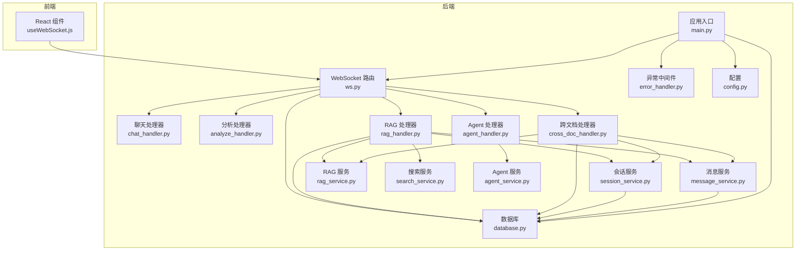
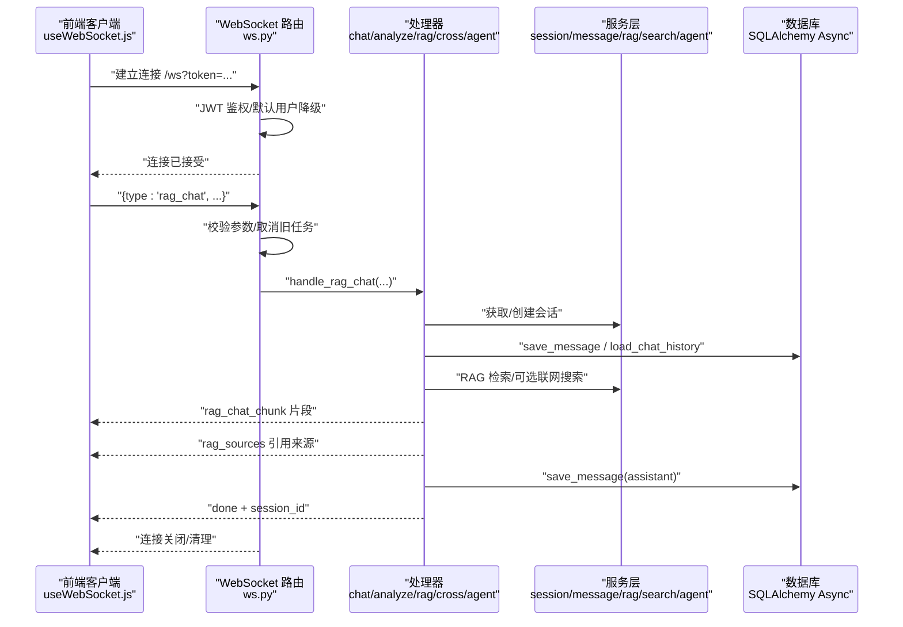
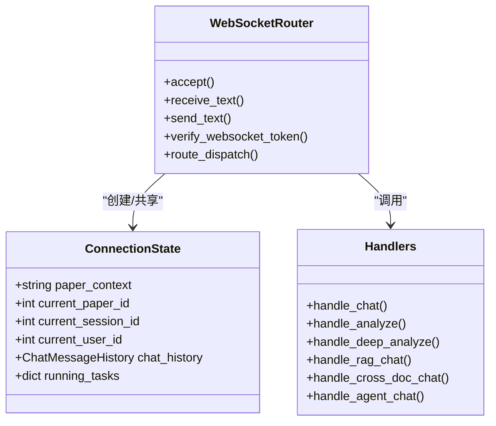
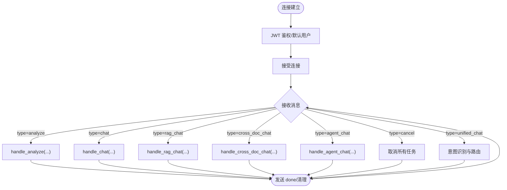
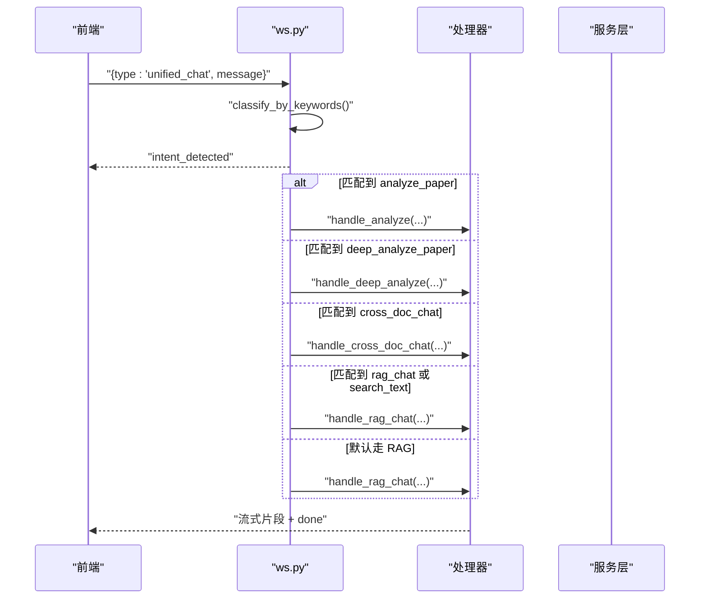
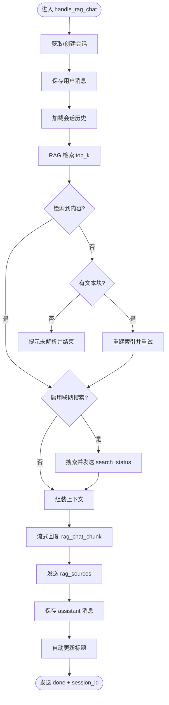
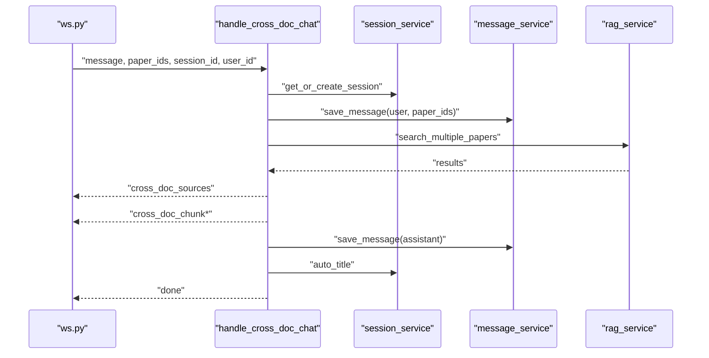
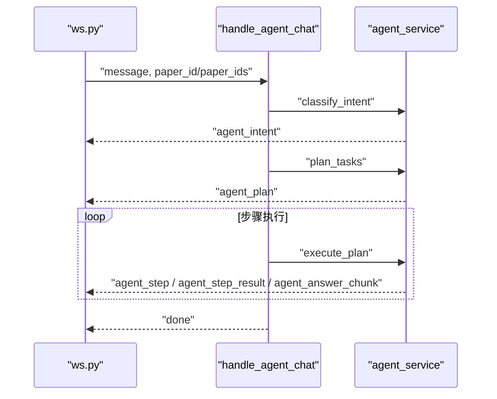
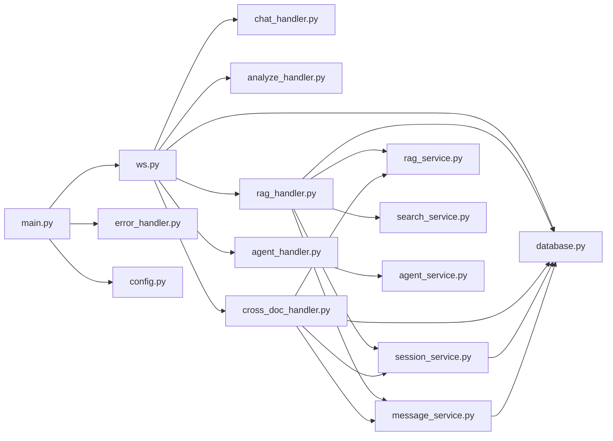

# 协议设计与架构

<cite>
**本文引用的文件**
- [backend/app/routers/ws.py](file://backend/app/routers/ws.py)
- [backend/app/handlers/analyze_handler.py](file://backend/app/handlers/analyze_handler.py)
- [backend/app/handlers/chat_handler.py](file://backend/app/handlers/chat_handler.py)
- [backend/app/handlers/rag_handler.py](file://backend/app/handlers/rag_handler.py)
- [backend/app/handlers/cross_doc_handler.py](file://backend/app/handlers/cross_doc_handler.py)
- [backend/app/handlers/agent_handler.py](file://backend/app/handlers/agent_handler.py)
- [backend/app/services/session_service.py](file://backend/app/services/session_service.py)
- [backend/app/services/message_service.py](file://backend/app/services/message_service.py)
- [backend/app/services/rag_service.py](file://backend/app/services/rag_service.py)
- [backend/app/services/search_service.py](file://backend/app/services/search_service.py)
- [backend/app/services/agent_service.py](file://backend/app/services/agent_service.py)
- [backend/app/middleware/error_handler.py](file://backend/app/middleware/error_handler.py)
- [backend/app/main.py](file://backend/app/main.py)
- [backend/app/config.py](file://backend/app/config.py)
- [backend/app/database.py](file://backend/app/database.py)
- [frontend/src/hooks/useWebSocket.js](file://frontend/src/hooks/useWebSocket.js)
</cite>

## 目录
1. [简介](#简介)
2. [项目结构](#项目结构)
3. [核心组件](#核心组件)
4. [架构总览](#架构总览)
5. [详细组件分析](#详细组件分析)
6. [依赖关系分析](#依赖关系分析)
7. [性能考量](#性能考量)
8. [故障排查指南](#故障排查指南)
9. [结论](#结论)
10. [附录](#附录)

## 简介
本文面向 PaperChat 的 WebSocket 协议设计与架构，系统阐述连接生命周期管理、消息类型路由分发、状态管理策略、并发与连接池控制、异常处理与恢复机制。重点解析 ConnectionState 的设计理念与状态变量作用，梳理 analyze、chat、rag_chat、cross_doc_chat、agent_chat 等消息类型的处理流程，并提供协议架构图与状态转换图，帮助开发者快速理解整体设计与实现细节。

## 项目结构
后端采用 FastAPI + SQLAlchemy Async + LangChain 的异步架构，WebSocket 路由集中于 ws.py，消息类型路由与状态管理在此文件中实现；各业务处理逻辑拆分为独立 handler；底层能力通过 service 层抽象（RAG、搜索、会话、消息、Agent 等）。前端通过 useWebSocket.js 提供统一的 WebSocket 客户端封装与重连策略。

图表来源
- [backend/app/routers/ws.py:76-436](file://backend/app/routers/ws.py#L76-L436)
- [backend/app/handlers/chat_handler.py:11-32](file://backend/app/handlers/chat_handler.py#L11-L32)
- [backend/app/handlers/analyze_handler.py:13-87](file://backend/app/handlers/analyze_handler.py#L13-L87)
- [backend/app/handlers/rag_handler.py:29-217](file://backend/app/handlers/rag_handler.py#L29-L217)
- [backend/app/handlers/cross_doc_handler.py:14-95](file://backend/app/handlers/cross_doc_handler.py#L14-L95)
- [backend/app/handlers/agent_handler.py:11-67](file://backend/app/handlers/agent_handler.py#L11-L67)
- [backend/app/services/session_service.py:17-134](file://backend/app/services/session_service.py#L17-L134)
- [backend/app/services/message_service.py:14-72](file://backend/app/services/message_service.py#L14-L72)
- [backend/app/services/rag_service.py:16-400](file://backend/app/services/rag_service.py#L16-L400)
- [backend/app/services/search_service.py:10-113](file://backend/app/services/search_service.py#L10-L113)
- [backend/app/services/agent_service.py:473-760](file://backend/app/services/agent_service.py#L473-L760)
- [backend/app/middleware/error_handler.py:73-92](file://backend/app/middleware/error_handler.py#L73-L92)
- [backend/app/main.py:55-114](file://backend/app/main.py#L55-L114)
- [backend/app/config.py:15-44](file://backend/app/config.py#L15-L44)
- [backend/app/database.py:13-81](file://backend/app/database.py#L13-L81)

章节来源
- [backend/app/routers/ws.py:1-436](file://backend/app/routers/ws.py#L1-L436)
- [backend/app/main.py:55-114](file://backend/app/main.py#L55-L114)

## 核心组件
- WebSocket 路由与生命周期管理：负责连接鉴权、接受消息、路由分发、并发任务管理、连接关闭清理。
- ConnectionState：在各 handler 之间共享的状态容器，承载 paper_context、current_paper_id、current_session_id、current_user_id、chat_history、running_tasks 等关键状态。
- 消息类型路由：根据 type 字段分派到不同处理器，支持 cancel、unified_chat 等控制与路由消息。
- 处理器层：chat、analyze、rag_chat、cross_doc_chat、agent_chat 各自实现异步流式输出与状态维护。
- 服务层：RAG、搜索、会话、消息、Agent 等服务提供检索、索引、会话持久化、联网搜索、工具调用等能力。
- 异常与中间件：统一异常处理，保障错误响应一致性。

章节来源
- [backend/app/routers/ws.py:56-113](file://backend/app/routers/ws.py#L56-L113)
- [backend/app/handlers/rag_handler.py:29-217](file://backend/app/handlers/rag_handler.py#L29-L217)
- [backend/app/handlers/cross_doc_handler.py:14-95](file://backend/app/handlers/cross_doc_handler.py#L14-L95)
- [backend/app/handlers/agent_handler.py:11-67](file://backend/app/handlers/agent_handler.py#L11-L67)
- [backend/app/middleware/error_handler.py:73-92](file://backend/app/middleware/error_handler.py#L73-L92)

## 架构总览
PaperChat 的 WebSocket 协议围绕“连接-路由-处理-持久化-反馈”的闭环展开。连接建立后，服务端根据消息类型将请求分发至对应处理器；处理器通过服务层完成检索、会话管理、联网搜索等操作；通过流式消息向客户端推送分片结果与完成信号；异常通过中间件统一捕获与返回。

图表来源
- [backend/app/routers/ws.py:76-436](file://backend/app/routers/ws.py#L76-L436)
- [backend/app/handlers/rag_handler.py:29-217](file://backend/app/handlers/rag_handler.py#L29-L217)
- [backend/app/services/session_service.py:17-54](file://backend/app/services/session_service.py#L17-L54)
- [backend/app/services/message_service.py:45-54](file://backend/app/services/message_service.py#L45-L54)
- [frontend/src/hooks/useWebSocket.js:19-71](file://frontend/src/hooks/useWebSocket.js#L19-L71)

## 详细组件分析

### ConnectionState 设计与状态管理
ConnectionState 作为连接级别的共享状态容器，贯穿所有消息处理流程，其关键字段与职责如下：
- paper_context：全文上下文，用于基础问答与分析场景。
- current_paper_id：当前论文 ID，用于 RAG 与跨文档检索的上下文绑定。
- current_session_id：当前会话 ID，用于消息持久化与会话标题自动更新。
- current_user_id：当前用户 ID，用于会话归属与权限控制。
- chat_history：LangChain ChatMessageHistory，维护会话历史消息。
- running_tasks：字典，记录当前活跃的任务 Task，支持取消与并发控制。

图表来源
- [backend/app/routers/ws.py:56-113](file://backend/app/routers/ws.py#L56-L113)
- [backend/app/routers/ws.py:114-436](file://backend/app/routers/ws.py#L114-L436)

章节来源
- [backend/app/routers/ws.py:56-113](file://backend/app/routers/ws.py#L56-L113)

### 连接生命周期管理
- 建立连接：鉴权通过后接受连接，初始化 ConnectionState 并注入 current_user_id。
- 消息接收与路由：循环接收文本消息，解析 JSON，按 type 分发到对应处理器。
- 并发与取消：同一类型消息到达时取消旧任务，创建新任务；支持显式 cancel。
- 异常与关闭：捕获断开与异常，清理 running_tasks 并关闭连接。

图表来源
- [backend/app/routers/ws.py:76-436](file://backend/app/routers/ws.py#L76-L436)

章节来源
- [backend/app/routers/ws.py:76-113](file://backend/app/routers/ws.py#L76-L113)
- [backend/app/routers/ws.py:114-436](file://backend/app/routers/ws.py#L114-L436)

### 消息类型路由机制
- analyze：章节概述分析，流式输出 analyze_chunk，完成后发送 done。
- chat：基于 paper_context 的基础问答，流式输出 chat_chunk，完成后发送 done。
- rag_chat：RAG 问答，支持检索增强与可选联网搜索，流式输出 rag_chat_chunk，发送 rag_sources 与 done。
- cross_doc_chat：跨文档检索问答，流式输出 cross_doc_chunk，发送 cross_doc_sources 与 done。
- agent_chat：Agent 多步推理，流式输出 agent_* 事件，最终发送 done。
- unified_chat：基于关键词的意图识别，自动路由到对应功能（analyze/deep_analyze/cross_doc/rag）。
- cancel：取消所有运行中的任务。

图表来源
- [backend/app/routers/ws.py:262-416](file://backend/app/routers/ws.py#L262-L416)
- [backend/app/services/agent_service.py:401-434](file://backend/app/services/agent_service.py#L401-L434)

章节来源
- [backend/app/routers/ws.py:84-102](file://backend/app/routers/ws.py#L84-L102)
- [backend/app/routers/ws.py:120-416](file://backend/app/routers/ws.py#L120-L416)
- [backend/app/services/agent_service.py:401-434](file://backend/app/services/agent_service.py#L401-L434)

### RAG 问答处理流程
- 会话管理：获取/创建会话，保存用户消息，加载历史。
- 检索：RAG 检索论文文本块，若无索引则重建索引。
- 联网搜索：可选开启，发送 search_status，完成后汇总来源。
- 上下文组装：根据是否启用搜索选择不同系统提示词。
- 流式回复：逐块输出 rag_chat_chunk，最后发送 rag_sources 与 done。
- 持久化：保存 assistant 消息与引用来源，自动更新会话标题。

图表来源
- [backend/app/handlers/rag_handler.py:29-217](file://backend/app/handlers/rag_handler.py#L29-L217)
- [backend/app/services/session_service.py:17-54](file://backend/app/services/session_service.py#L17-L54)
- [backend/app/services/message_service.py:45-54](file://backend/app/services/message_service.py#L45-L54)
- [backend/app/services/rag_service.py:233-307](file://backend/app/services/rag_service.py#L233-L307)
- [backend/app/services/search_service.py:41-104](file://backend/app/services/search_service.py#L41-L104)

章节来源
- [backend/app/handlers/rag_handler.py:29-217](file://backend/app/handlers/rag_handler.py#L29-L217)

### 跨文档问答处理流程
- 会话管理：获取/创建会话，保存用户消息（携带 paper_ids）。
- 检索：对多个论文并行检索，合并结果并按分数排序。
- 引用来源：发送 cross_doc_sources，包含每条结果的 paper_id。
- 流式回复：逐块输出 cross_doc_chunk。
- 持久化与标题更新：保存 assistant 消息并自动更新标题。

图表来源
- [backend/app/handlers/cross_doc_handler.py:14-95](file://backend/app/handlers/cross_doc_handler.py#L14-L95)
- [backend/app/services/session_service.py:17-54](file://backend/app/services/session_service.py#L17-L54)
- [backend/app/services/message_service.py:45-54](file://backend/app/services/message_service.py#L45-L54)
- [backend/app/services/rag_service.py:308-335](file://backend/app/services/rag_service.py#L308-L335)

章节来源
- [backend/app/handlers/cross_doc_handler.py:14-95](file://backend/app/handlers/cross_doc_handler.py#L14-L95)

### Agent 智能问答处理流程
- 意图识别：classify_intent 输出 intent。
- 任务规划：plan_tasks 生成多步计划。
- 逐步执行：execute_plan 逐步执行工具，推送 step_start/step_result/final_answer_chunk。
- 完成：发送 done。

图表来源
- [backend/app/handlers/agent_handler.py:11-67](file://backend/app/handlers/agent_handler.py#L11-L67)
- [backend/app/services/agent_service.py:494-684](file://backend/app/services/agent_service.py#L494-L684)

章节来源
- [backend/app/handlers/agent_handler.py:11-67](file://backend/app/handlers/agent_handler.py#L11-L67)
- [backend/app/services/agent_service.py:473-760](file://backend/app/services/agent_service.py#L473-L760)

### 基础问答与分析处理流程
- chat：基于 paper_context 与 chat_history，流式输出 chat_chunk，完成后 done。
- analyze：清空历史，流式输出 analyze_chunk，完成后 done，并异步提取关键词。
- deep_analyze：与 analyze 类似，输出 deep_analyze_chunk。

章节来源
- [backend/app/handlers/chat_handler.py:11-32](file://backend/app/handlers/chat_handler.py#L11-L32)
- [backend/app/handlers/analyze_handler.py:13-87](file://backend/app/handlers/analyze_handler.py#L13-L87)

## 依赖关系分析
- 路由层依赖：ws.py 依赖 handlers/* 与服务层；handlers 依赖 session_service、message_service、rag_service、search_service、agent_service。
- 数据层：所有数据库操作通过 SQLAlchemy AsyncSession，统一在 session_service 与 message_service 中封装。
- 检索与索引：rag_service 封装 ChromaDB 向量检索与 BM25 混合检索，支持智能分块、RRF 融合排序、缓存与重建。
- 搜索：search_service 封装 DuckDuckGo 搜索，支持超时与缓存。
- 异常：error_handler 提供全局异常处理，保证错误响应一致。
- 前端：useWebSocket.js 提供连接、消息订阅、重连与发送封装。

图表来源
- [backend/app/routers/ws.py:23-27](file://backend/app/routers/ws.py#L23-L27)
- [backend/app/handlers/rag_handler.py:13-17](file://backend/app/handlers/rag_handler.py#L13-L17)
- [backend/app/handlers/cross_doc_handler.py:10-11](file://backend/app/handlers/cross_doc_handler.py#L10-L11)
- [backend/app/handlers/agent_handler.py](file://backend/app/handlers/agent_handler.py#L8)
- [backend/app/services/session_service.py:12-14](file://backend/app/services/session_service.py#L12-L14)
- [backend/app/services/message_service.py:5-11](file://backend/app/services/message_service.py#L5-L11)
- [backend/app/services/rag_service.py:16-46](file://backend/app/services/rag_service.py#L16-L46)
- [backend/app/services/search_service.py:10-24](file://backend/app/services/search_service.py#L10-L24)
- [backend/app/services/agent_service.py:17-21](file://backend/app/services/agent_service.py#L17-L21)
- [backend/app/middleware/error_handler.py:73-92](file://backend/app/middleware/error_handler.py#L73-L92)
- [backend/app/main.py:55-95](file://backend/app/main.py#L55-L95)
- [backend/app/config.py:15-44](file://backend/app/config.py#L15-L44)
- [backend/app/database.py:13-81](file://backend/app/database.py#L13-L81)

章节来源
- [backend/app/routers/ws.py:23-27](file://backend/app/routers/ws.py#L23-L27)
- [backend/app/handlers/rag_handler.py:13-17](file://backend/app/handlers/rag_handler.py#L13-L17)
- [backend/app/handlers/cross_doc_handler.py:10-11](file://backend/app/handlers/cross_doc_handler.py#L10-L11)
- [backend/app/handlers/agent_handler.py](file://backend/app/handlers/agent_handler.py#L8)
- [backend/app/services/session_service.py:12-14](file://backend/app/services/session_service.py#L12-L14)
- [backend/app/services/message_service.py:5-11](file://backend/app/services/message_service.py#L5-L11)
- [backend/app/services/rag_service.py:16-46](file://backend/app/services/rag_service.py#L16-L46)
- [backend/app/services/search_service.py:10-24](file://backend/app/services/search_service.py#L10-L24)
- [backend/app/services/agent_service.py:17-21](file://backend/app/services/agent_service.py#L17-L21)
- [backend/app/middleware/error_handler.py:73-92](file://backend/app/middleware/error_handler.py#L73-L92)
- [backend/app/main.py:55-95](file://backend/app/main.py#L55-L95)
- [backend/app/config.py:15-44](file://backend/app/config.py#L15-L44)
- [backend/app/database.py:13-81](file://backend/app/database.py#L13-L81)

## 性能考量
- 并发与取消：同一类型消息到达时取消旧任务，避免资源浪费；支持显式 cancel。
- 异步与流式：处理器均采用异步生成器与流式输出，降低延迟，提升用户体验。
- 检索与索引：RAG 服务内置 BM25 缓存与 RRF 融合排序，减少重复计算；支持重建索引与增量优化。
- 线程池与懒加载：Embedding 模型懒加载并在线程池中初始化，避免阻塞事件循环。
- 超时与缓存：搜索服务设置超时与缓存，防止阻塞与抖动。
- 数据库事务：依赖注入与自动回滚/提交，保障一致性与稳定性。

[本节为通用性能讨论，无需列出章节来源]

## 故障排查指南
- 连接失败
  - 检查 token 是否有效或是否允许匿名模式。
  - 查看服务端日志与异常中间件返回的错误信息。
- 消息处理异常
  - 确认消息格式与必填字段（如 paper_id、message）。
  - 检查处理器内部异常捕获与错误消息返回。
- RAG 检索无结果
  - 确认论文是否已完成文本块解析与索引。
  - 若无索引，等待重建索引后重试。
- 联网搜索失败
  - 检查网络与 DuckDuckGo 服务可用性，关注超时与缓存命中情况。
- Agent 执行异常
  - 关注工具执行结果与聚合阶段的异常，查看 step_result 的错误信息。

章节来源
- [backend/app/routers/ws.py:424-435](file://backend/app/routers/ws.py#L424-L435)
- [backend/app/middleware/error_handler.py:58-70](file://backend/app/middleware/error_handler.py#L58-L70)
- [backend/app/handlers/rag_handler.py:210-216](file://backend/app/handlers/rag_handler.py#L210-L216)
- [backend/app/services/search_service.py:98-103](file://backend/app/services/search_service.py#L98-L103)
- [backend/app/services/rag_service.py:355-370](file://backend/app/services/rag_service.py#L355-L370)

## 结论
PaperChat 的 WebSocket 协议以 ConnectionState 为核心状态容器，通过 ws.py 的路由与并发控制，将不同消息类型分发至专门的处理器；处理器借助 session_service、message_service、rag_service、search_service、agent_service 等服务完成检索、会话管理、联网搜索与多步推理；前端通过 useWebSocket.js 提供统一的连接与消息订阅体验。该架构在保证功能完整性的同时，兼顾了并发控制、异常处理与性能优化，适合学术论文阅读与问答场景的扩展与演进。

[本节为总结性内容，无需列出章节来源]

## 附录
- 前端 WebSocket 客户端：提供连接、消息订阅、重连与发送封装，支持多种消息类型发送与取消。
- 应用入口与中间件：统一异常处理、CORS 配置、数据库初始化与关闭。
- 配置与数据库：集中式配置管理与异步数据库连接工厂。

章节来源
- [frontend/src/hooks/useWebSocket.js:1-180](file://frontend/src/hooks/useWebSocket.js#L1-L180)
- [backend/app/main.py:55-114](file://backend/app/main.py#L55-L114)
- [backend/app/middleware/error_handler.py:73-92](file://backend/app/middleware/error_handler.py#L73-L92)
- [backend/app/config.py:15-44](file://backend/app/config.py#L15-L44)
- [backend/app/database.py:13-81](file://backend/app/database.py#L13-L81)