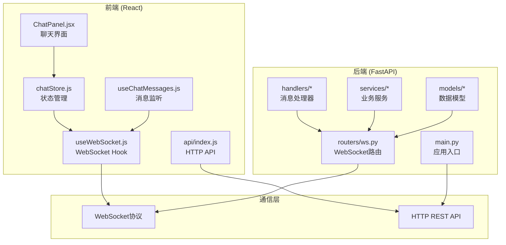
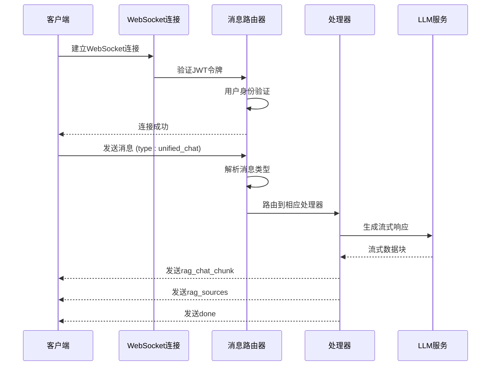
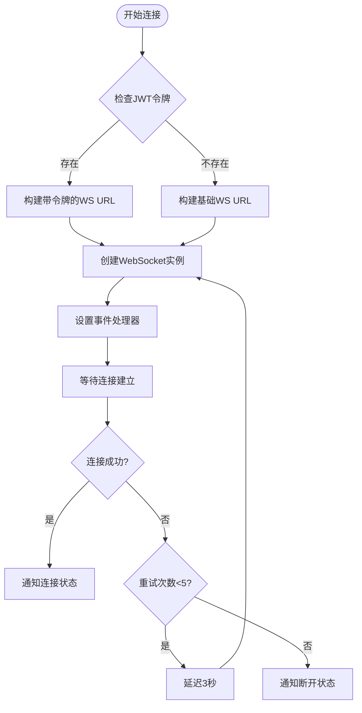
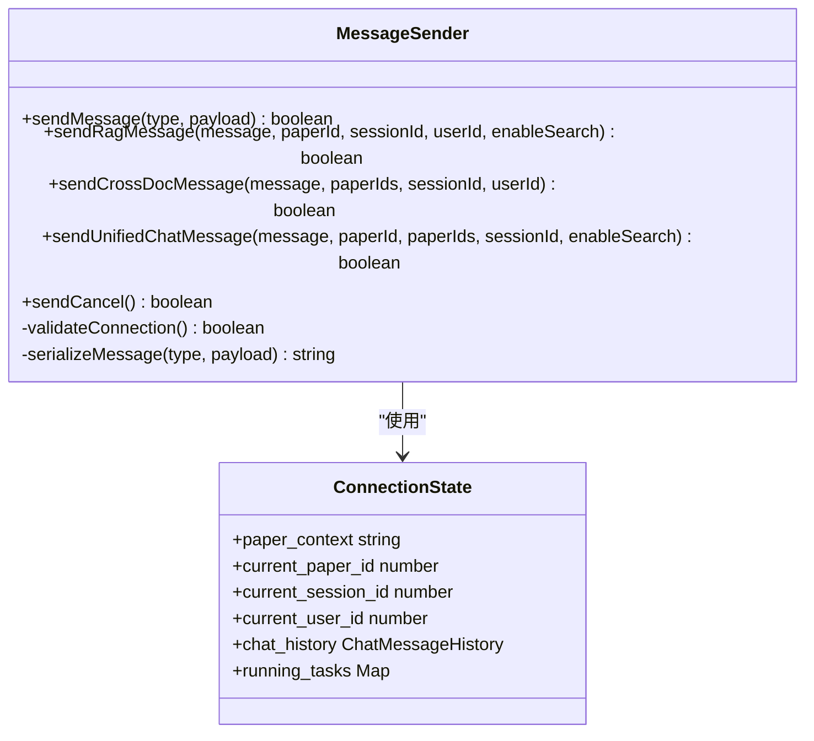
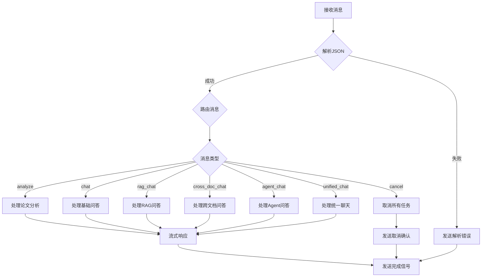
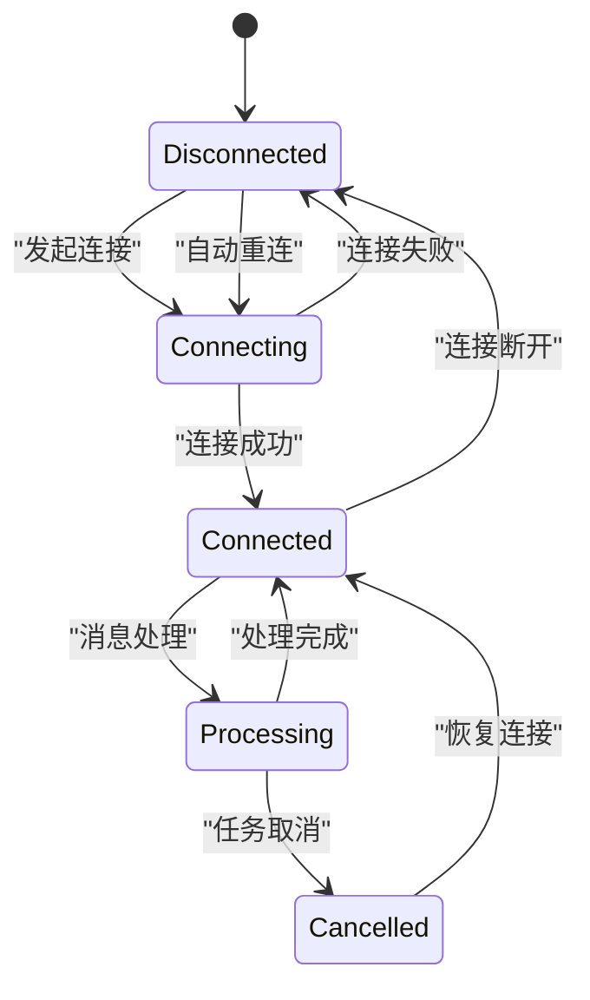
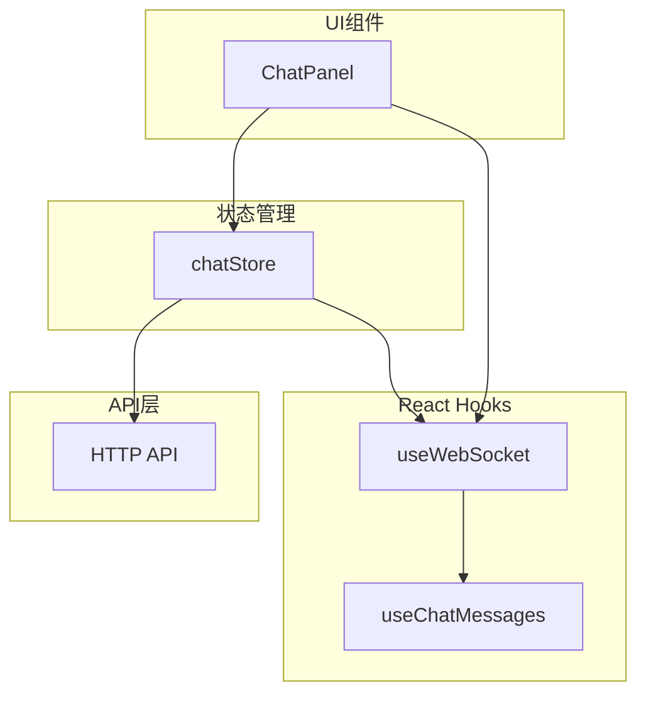
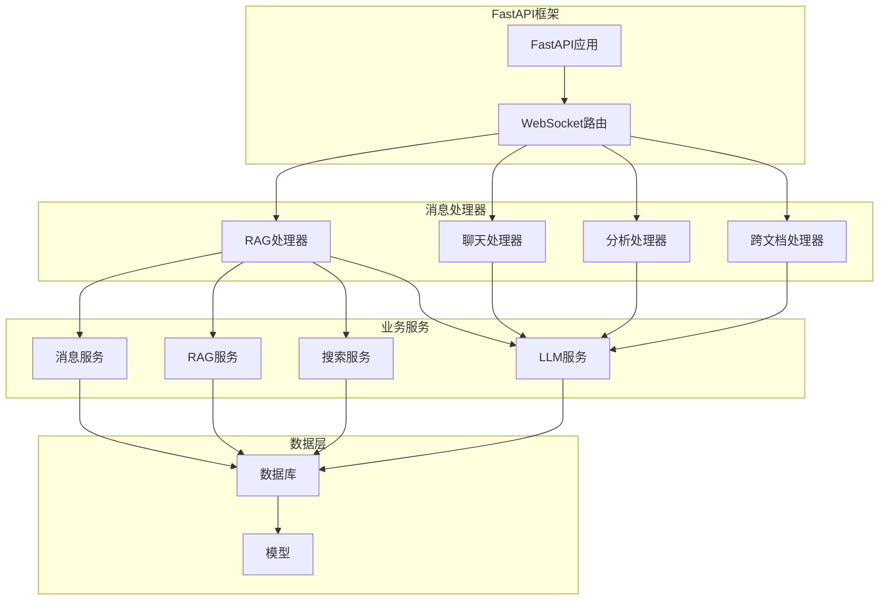
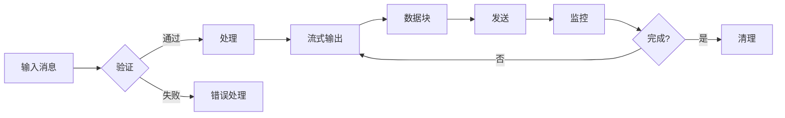

# 客户端-服务器通信

<cite>
**本文档引用的文件**
- [useWebSocket.js](file://frontend/src/hooks/useWebSocket.js)
- [ws.py](file://backend/app/routers/ws.py)
- [chatStore.js](file://frontend/src/stores/chatStore.js)
- [chat_handler.py](file://backend/app/handlers/chat_handler.py)
- [rag_handler.py](file://backend/app/handlers/rag_handler.py)
- [useChatMessages.js](file://frontend/src/hooks/useChatMessages.js)
- [ChatPanel.jsx](file://frontend/src/components/ChatPanel/ChatPanel.jsx)
- [main.py](file://backend/app/main.py)
- [config.py](file://backend/app/config.py)
- [index.js](file://frontend/src/api/index.js)
</cite>

## 目录
1. [简介](#简介)
2. [项目结构](#项目结构)
3. [核心组件](#核心组件)
4. [架构概览](#架构概览)
5. [详细组件分析](#详细组件分析)
6. [依赖关系分析](#依赖关系分析)
7. [性能考虑](#性能考虑)
8. [故障排除指南](#故障排除指南)
9. [结论](#结论)
10. [附录](#附录)

## 简介

PaperChat 是一个基于 WebSocket 的实时论文智能问答系统，采用前后端分离架构设计。该系统实现了高效的客户端-服务器通信机制，支持多种对话模式（RAG 问答、跨文档问答、智能分析等），并通过流式传输提供流畅的用户体验。

系统的核心通信架构基于 React Hooks 和 FastAPI WebSocket，实现了完整的连接管理、消息路由、状态同步和错误处理机制。前端通过自定义 Hook 管理 WebSocket 连接，后端通过路由器处理各种消息类型并分发到相应的处理器。

## 项目结构

PaperChat 采用模块化的项目组织方式，前后端分离清晰：



**图表来源**
- [useWebSocket.js:1-180](file://frontend/src/hooks/useWebSocket.js#L1-L180)
- [ws.py:1-436](file://backend/app/routers/ws.py#L1-L436)
- [main.py:1-114](file://backend/app/main.py#L1-L114)

**章节来源**
- [useWebSocket.js:1-180](file://frontend/src/hooks/useWebSocket.js#L1-L180)
- [ws.py:1-436](file://backend/app/routers/ws.py#L1-L436)
- [main.py:1-114](file://backend/app/main.py#L1-L114)

## 核心组件

### WebSocket 连接管理器

前端实现了全局的 WebSocket 连接管理器，提供以下核心功能：

- **连接生命周期管理**：自动连接、断线重连、优雅关闭
- **消息路由**：基于消息类型的动态路由分发
- **状态监控**：连接状态的实时通知和订阅
- **错误处理**：完善的错误捕获和恢复机制

### 消息处理器

后端实现了多种消息处理器，每种处理器专注于特定的功能领域：

- **RAG 问答处理器**：基于检索增强生成的智能问答
- **基础问答处理器**：简单的上下文问答
- **跨文档处理器**：多论文联合分析和问答
- **分析处理器**：论文章节概述和深度分析

### 状态管理系统

前端使用 Zustand 实现高效的状态管理，涵盖：

- **会话管理**：会话创建、切换、删除
- **消息流控制**：流式消息的实时更新
- **引用来源管理**：论文引用和网络搜索结果
- **用户界面状态**：聊天模式、搜索状态等

**章节来源**
- [useWebSocket.js:19-71](file://frontend/src/hooks/useWebSocket.js#L19-L71)
- [ws.py:56-65](file://backend/app/routers/ws.py#L56-L65)
- [chatStore.js:4-282](file://frontend/src/stores/chatStore.js#L4-L282)

## 架构概览

PaperChat 的通信架构采用事件驱动的设计模式，实现了松耦合的消息传递机制：



**图表来源**
- [useWebSocket.js:100-154](file://frontend/src/hooks/useWebSocket.js#L100-L154)
- [ws.py:262-416](file://backend/app/routers/ws.py#L262-L416)
- [rag_handler.py:29-217](file://backend/app/handlers/rag_handler.py#L29-L217)

系统架构的关键特点：

1. **异步处理**：所有消息处理都是异步的，避免阻塞主线程
2. **流式传输**：支持实时流式响应，提升用户体验
3. **任务管理**：支持并发任务的创建、取消和清理
4. **状态共享**：连接状态在多个处理器之间共享

## 详细组件分析

### 客户端 WebSocket 连接建立

#### 连接参数配置

客户端连接建立过程包含以下关键步骤：



**图表来源**
- [useWebSocket.js:19-59](file://frontend/src/hooks/useWebSocket.js#L19-L59)
- [useWebSocket.js:4-6](file://frontend/src/hooks/useWebSocket.js#L4-L6)

#### 认证机制

系统支持两种认证模式：

1. **JWT 令牌认证**：生产环境推荐使用
2. **匿名访问**：开发和测试环境使用

认证流程：
- 从本地存储获取 JWT 令牌
- 将令牌附加到 WebSocket URL 查询参数
- 后端验证令牌有效性并获取用户信息

#### 初始化流程

连接建立后的初始化步骤：

1. **状态重置**：清除之前的连接状态
2. **事件绑定**：注册消息处理回调
3. **状态通知**：向订阅者广播连接状态
4. **会话准备**：准备接收和处理消息

**章节来源**
- [useWebSocket.js:19-59](file://frontend/src/hooks/useWebSocket.js#L19-L59)
- [useWebSocket.js:3-5](file://frontend/src/hooks/useWebSocket.js#L3-L5)

### 客户端消息发送机制

#### 消息序列化

前端实现了灵活的消息发送机制：



**图表来源**
- [useWebSocket.js:100-154](file://frontend/src/hooks/useWebSocket.js#L100-L154)
- [ws.py:56-65](file://backend/app/routers/ws.py#L56-L65)

#### 发送队列管理

系统采用简单的队列管理策略：

- **即时发送**：消息立即发送，无需排队
- **状态检查**：发送前检查连接状态
- **错误处理**：连接不可用时记录警告信息

#### 错误重试策略

客户端实现了指数退避的重试机制：

- **最大重试次数**：5次
- **初始延迟**：3秒
- **重试间隔**：固定3秒（简化实现）
- **取消条件**：达到最大重试次数或手动断开

**章节来源**
- [useWebSocket.js:4-6](file://frontend/src/hooks/useWebSocket.js#L4-L6)
- [useWebSocket.js:48-52](file://frontend/src/hooks/useWebSocket.js#L48-L52)

### 服务器响应处理流程

#### 流式数据接收

后端实现了完整的流式数据处理机制：



**图表来源**
- [ws.py:114-436](file://backend/app/routers/ws.py#L114-L436)

#### 消息解析和状态更新

消息处理的核心流程：

1. **消息验证**：检查必需字段和格式
2. **任务管理**：启动或取消相关任务
3. **状态更新**：更新连接状态和会话信息
4. **流式响应**：实时发送处理结果

#### 并发任务管理

系统支持多个并发任务的管理：

- **任务标识**：使用键值对管理不同类型的任务
- **任务取消**：支持优雅的任务取消
- **资源清理**：确保任务完成后释放资源

**章节来源**
- [ws.py:114-436](file://backend/app/routers/ws.py#L114-L436)

### 连接状态监控

#### 状态变更通知

系统实现了完整的状态监控机制：



**图表来源**
- [useWebSocket.js:14-17](file://frontend/src/hooks/useWebSocket.js#L14-L17)
- [useWebSocket.js:75-78](file://frontend/src/hooks/useWebSocket.js#L75-L78)

#### 心跳检测和断线重连

虽然系统没有实现传统的心跳机制，但具备以下特性：

- **自动重连**：断开后自动尝试重连
- **状态同步**：重连后重新建立消息订阅
- **连接状态**：提供实时的连接状态反馈

**章节来源**
- [useWebSocket.js:14-17](file://frontend/src/hooks/useWebSocket.js#L14-L17)
- [useWebSocket.js:45-52](file://frontend/src/hooks/useWebSocket.js#L45-L52)

## 依赖关系分析

### 前端依赖关系



**图表来源**
- [useWebSocket.js:84-179](file://frontend/src/hooks/useWebSocket.js#L84-L179)
- [useChatMessages.js:22-97](file://frontend/src/hooks/useChatMessages.js#L22-L97)
- [chatStore.js:395-414](file://frontend/src/stores/chatStore.js#L395-L414)

### 后端依赖关系



**图表来源**
- [main.py:55-95](file://backend/app/main.py#L55-L95)
- [ws.py:23-27](file://backend/app/routers/ws.py#L23-L27)

**章节来源**
- [useWebSocket.js:84-179](file://frontend/src/hooks/useWebSocket.js#L84-L179)
- [ws.py:23-27](file://backend/app/routers/ws.py#L23-L27)

## 性能考虑

### 连接池管理

系统采用单连接池设计，具有以下优势：

- **资源效率**：减少连接开销和内存占用
- **状态一致性**：确保消息顺序和状态同步
- **简化管理**：降低连接管理复杂度

### 流式传输优化



**图表来源**
- [rag_handler.py:179-187](file://backend/app/handlers/rag_handler.py#L179-L187)

### 内存管理

- **任务清理**：及时清理已完成的任务
- **状态重置**：断开连接时重置状态
- **资源回收**：确保事件监听器被正确移除

## 故障排除指南

### 常见连接问题

| 问题类型 | 症状 | 解决方案 |
|---------|------|----------|
| 认证失败 | 连接被拒绝，状态保持断开 | 检查JWT令牌有效性，确认用户状态 |
| 网络中断 | 连接频繁断开 | 检查网络稳定性，调整重试策略 |
| 服务器超时 | 连接建立超时 | 检查服务器负载，优化连接参数 |
| 消息丢失 | 部分消息未收到 | 检查消息序列化，确认处理器注册 |

### 调试技巧

1. **浏览器开发者工具**
   - Network标签查看WebSocket连接
   - Console查看错误日志
   - Application查看localStorage中的令牌

2. **后端日志**
   ```bash
   # 启用详细日志
   export DEBUG=true
   python backend/main.py
   ```

3. **状态监控**
   - 使用React DevTools监控组件状态
   - 检查Zustand状态变化
   - 监控WebSocket事件

**章节来源**
- [useWebSocket.js:45-56](file://frontend/src/hooks/useWebSocket.js#L45-L56)
- [ws.py:424-428](file://backend/app/routers/ws.py#L424-L428)

## 结论

PaperChat 的客户端-服务器通信系统展现了现代Web应用的最佳实践：

### 技术优势

1. **架构清晰**：前后端职责明确，接口设计合理
2. **扩展性强**：模块化设计便于功能扩展
3. **用户体验佳**：流式传输提供实时响应
4. **可靠性高**：完善的错误处理和重连机制

### 改进建议

1. **心跳机制**：实现标准的心跳检测
2. **消息确认**：添加消息确认和重发机制
3. **连接池优化**：支持多连接池以提高吞吐量
4. **监控告警**：添加更详细的性能监控

该系统为学术论文智能问答提供了坚实的技术基础，其设计理念和实现方式值得其他类似应用参考。

## 附录

### 客户端集成示例

#### 基本连接示例

```javascript
// 在组件中使用
const { status, sendMessage, onMessage } = useWebSocket();

// 订阅消息
const unsubscribe = onMessage('rag_chat_chunk', (data) => {
  console.log('收到消息:', data);
});

// 发送消息
sendMessage('rag_chat', {
  message: '如何理解量子力学的基本原理？',
  paper_id: 123,
  enable_search: true
});
```

#### 高级集成示例

```javascript
// 结合状态管理使用
const { messages, addMessage, updateLastMessage } = useChatStore();
const { status, sendMessage, onMessage } = useWebSocket();

// 订阅流式消息
onMessage('rag_chat_chunk', (data) => {
  updateLastMessage(data.content);
});

// 发送跨文档消息
sendMessage('cross_doc_chat', {
  message: '比较两篇论文的观点差异',
  paper_ids: [1, 2],
  session_id: 456
});
```

### 服务器配置要点

1. **JWT配置**：确保密钥安全，生产环境使用强密码
2. **CORS设置**：正确配置允许的源地址
3. **数据库连接**：优化连接池大小和超时设置
4. **日志配置**：平衡日志详细程度和性能影响