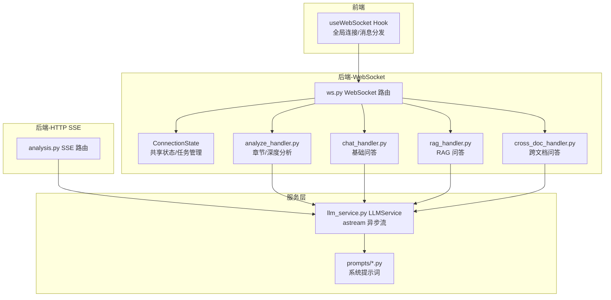
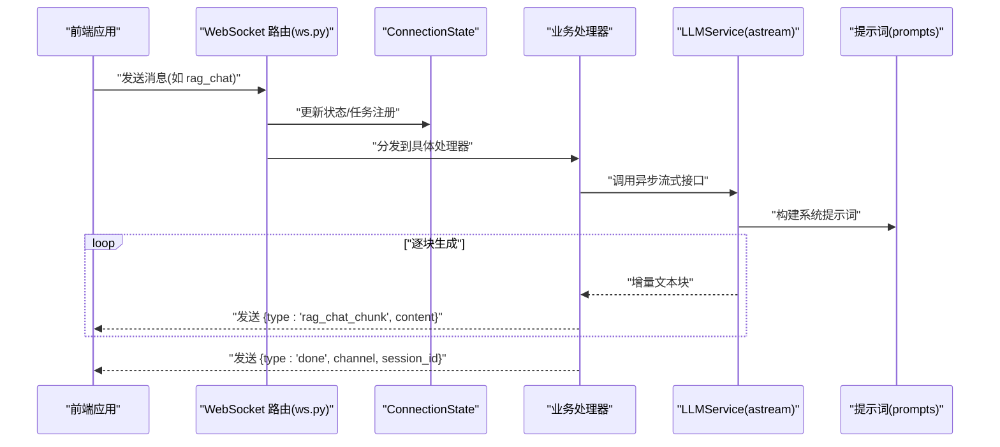
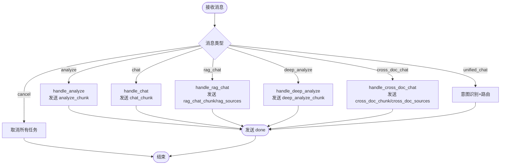
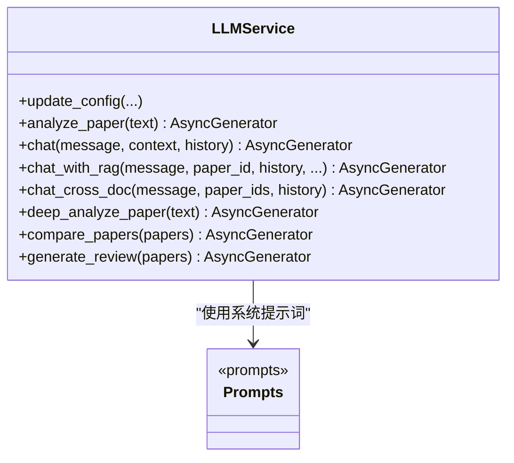
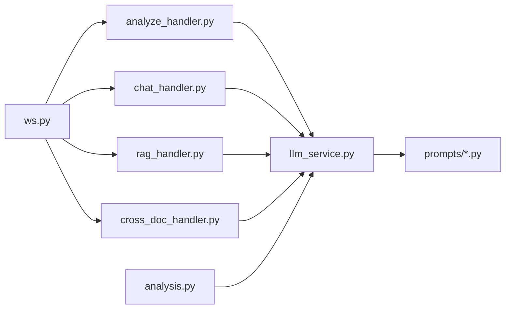
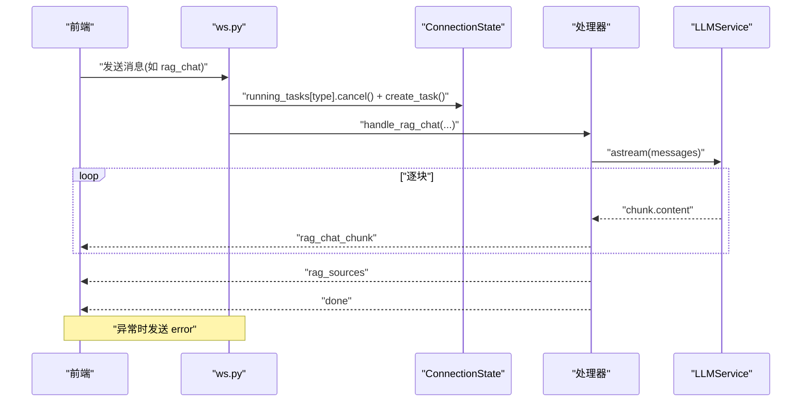
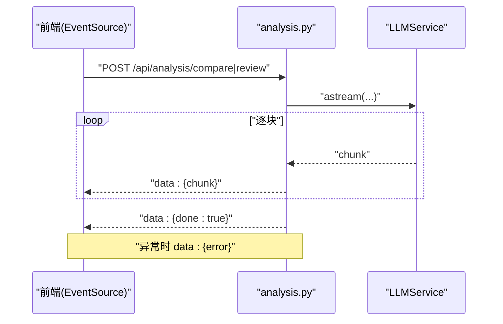

# 流式数据传输

<cite>
**本文档引用的文件**
- [backend/app/routers/ws.py](file://backend/app/routers/ws.py)
- [backend/app/handlers/analyze_handler.py](file://backend/app/handlers/analyze_handler.py)
- [backend/app/handlers/chat_handler.py](file://backend/app/handlers/chat_handler.py)
- [backend/app/handlers/rag_handler.py](file://backend/app/handlers/rag_handler.py)
- [backend/app/handlers/cross_doc_handler.py](file://backend/app/handlers/cross_doc_handler.py)
- [backend/app/services/llm/llm_service.py](file://backend/app/services/llm/llm_service.py)
- [backend/app/services/llm/prompts/analyze.py](file://backend/app/services/llm/prompts/analyze.py)
- [backend/app/services/llm/prompts/rag.py](file://backend/app/services/llm/prompts/rag.py)
- [backend/app/routers/analysis.py](file://backend/app/routers/analysis.py)
- [frontend/src/hooks/useWebSocket.js](file://frontend/src/hooks/useWebSocket.js)
</cite>

## 目录
1. [简介](#简介)
2. [项目结构](#项目结构)
3. [核心组件](#核心组件)
4. [架构总览](#架构总览)
5. [详细组件分析](#详细组件分析)
6. [依赖分析](#依赖分析)
7. [性能考虑](#性能考虑)
8. [故障排查指南](#故障排查指南)
9. [结论](#结论)
10. [附录](#附录)

## 简介
本文件系统性梳理 PaperChat 的流式数据传输实现，覆盖 WebSocket 实时流与 HTTP SSE 两种模式，重点解释以下内容：
- 流式响应消息类型与格式规范（analyze_chunk、chat_chunk、rag_chat_chunk、cross_doc_chunk 等）
- 异步任务管理与 asyncio 并发控制
- 异步 I/O 与 LangChain astream 的集成
- 缓冲策略、背压处理与内存管理
- 完整传输链路与端到端序列图
- 性能优化、延迟控制与吞吐量调节
- 客户端处理最佳实践与错误恢复

## 项目结构
PaperChat 的流式传输由后端 FastAPI 路由与处理器、LLM 服务层以及前端 WebSocket Hook 共同组成。WebSocket 负责实时双向通信，HTTP SSE 负责服务端推送；LLM 服务通过 LangChain 的异步流式接口产生增量响应。

图表来源
- [backend/app/routers/ws.py:76-436](file://backend/app/routers/ws.py#L76-L436)
- [backend/app/routers/analysis.py:88-214](file://backend/app/routers/analysis.py#L88-L214)
- [backend/app/services/llm/llm_service.py:29-727](file://backend/app/services/llm/llm_service.py#L29-L727)

章节来源
- [backend/app/routers/ws.py:76-436](file://backend/app/routers/ws.py#L76-L436)
- [backend/app/routers/analysis.py:88-214](file://backend/app/routers/analysis.py#L88-L214)
- [backend/app/services/llm/llm_service.py:29-727](file://backend/app/services/llm/llm_service.py#L29-L727)

## 核心组件
- WebSocket 路由与消息分发：负责连接生命周期、消息类型路由、并发任务管理与取消。
- 处理器层：按业务拆分，分别处理分析、问答、RAG、跨文档等场景。
- LLM 服务层：封装 LangChain ChatOpenAI 的异步流式接口，统一产出增量文本块。
- SSE 路由：HTTP 流式返回，用于多论文对比与综述生成。
- 前端 Hook：统一 WebSocket 连接、消息订阅与重连策略。

章节来源
- [backend/app/routers/ws.py:76-436](file://backend/app/routers/ws.py#L76-L436)
- [backend/app/handlers/analyze_handler.py:13-87](file://backend/app/handlers/analyze_handler.py#L13-L87)
- [backend/app/handlers/chat_handler.py:11-32](file://backend/app/handlers/chat_handler.py#L11-L32)
- [backend/app/handlers/rag_handler.py:29-217](file://backend/app/handlers/rag_handler.py#L29-L217)
- [backend/app/handlers/cross_doc_handler.py:14-95](file://backend/app/handlers/cross_doc_handler.py#L14-L95)
- [backend/app/services/llm/llm_service.py:29-727](file://backend/app/services/llm/llm_service.py#L29-L727)
- [backend/app/routers/analysis.py:88-214](file://backend/app/routers/analysis.py#L88-L214)
- [frontend/src/hooks/useWebSocket.js:1-180](file://frontend/src/hooks/useWebSocket.js#L1-L180)

## 架构总览
PaperChat 的流式传输采用“事件驱动 + 异步生成”的模式：
- WebSocket 场景：前端发送指令 → 后端路由分发 → 处理器调用 LLM 服务 → LLM 通过 astream 逐块返回 → 处理器包装为 JSON 消息 → 前端 onMessage 分发到 UI。
- SSE 场景：HTTP 请求触发 → 服务端异步生成器逐块返回 data: 行 → 前端 EventSource 自动解析。

图表来源
- [backend/app/routers/ws.py:114-436](file://backend/app/routers/ws.py#L114-L436)
- [backend/app/handlers/rag_handler.py:179-206](file://backend/app/handlers/rag_handler.py#L179-L206)
- [backend/app/services/llm/llm_service.py:173-252](file://backend/app/services/llm/llm_service.py#L173-L252)
- [backend/app/services/llm/prompts/rag.py:3-36](file://backend/app/services/llm/prompts/rag.py#L3-L36)

## 详细组件分析

### WebSocket 路由与消息分发
- 连接认证：支持 JWT 校验，未提供 token 时降级为默认用户。
- 消息类型路由：支持 analyze、chat、rag_chat、deep_analyze、agent_chat、cross_doc_chat、unified_chat、cancel 等。
- 并发控制：使用 ConnectionState 维护 running_tasks，同一类型消息到达时先取消旧任务再创建新任务。
- 任务取消：收到 cancel 消息或连接断开时，遍历并取消所有运行中的任务。
- 响应格式：统一为 JSON，包含 type、data/content/sources/session_id/done/error 等字段。

图表来源
- [backend/app/routers/ws.py:114-436](file://backend/app/routers/ws.py#L114-L436)
- [backend/app/handlers/analyze_handler.py:13-87](file://backend/app/handlers/analyze_handler.py#L13-L87)
- [backend/app/handlers/chat_handler.py:11-32](file://backend/app/handlers/chat_handler.py#L11-L32)
- [backend/app/handlers/rag_handler.py:29-217](file://backend/app/handlers/rag_handler.py#L29-L217)
- [backend/app/handlers/cross_doc_handler.py:14-95](file://backend/app/handlers/cross_doc_handler.py#L14-L95)

章节来源
- [backend/app/routers/ws.py:76-436](file://backend/app/routers/ws.py#L76-L436)

### 分析类处理器（analyze_chunk、deep_analyze_chunk）
- analyze_chunk：章节概述分析，逐块返回 JSON 结构化的解释，最后发送 done 标记。
- deep_analyze_chunk：深度分析，逐块返回多维度 JSON 结构，最后发送 done 标记。
- 关键点：处理器内部维护 full_response，便于后续缓存；异常捕获后发送 error；finally 中清理 running_tasks。

章节来源
- [backend/app/handlers/analyze_handler.py:13-87](file://backend/app/handlers/analyze_handler.py#L13-L87)
- [backend/app/services/llm/llm_service.py:129-141](file://backend/app/services/llm/llm_service.py#L129-L141)
- [backend/app/services/llm/llm_service.py:420-444](file://backend/app/services/llm/llm_service.py#L420-L444)
- [backend/app/services/llm/prompts/analyze.py:3-18](file://backend/app/services/llm/prompts/analyze.py#L3-L18)
- [backend/app/services/llm/prompts/analyze.py:20-60](file://backend/app/services/llm/prompts/analyze.py#L20-L60)

### 基础问答处理器（chat_chunk）
- chat_chunk：基于全文上下文的问答，逐块返回回答文本，最后发送 done。
- 关键点：处理器通过 llm_service.chat 逐块产出；内部维护对话历史；异常与取消处理一致。

章节来源
- [backend/app/handlers/chat_handler.py:11-32](file://backend/app/handlers/chat_handler.py#L11-L32)
- [backend/app/services/llm/llm_service.py:142-171](file://backend/app/services/llm/llm_service.py#L142-L171)

### RAG 问答处理器（rag_chat_chunk、rag_sources）
- rag_chat_chunk：基于检索增强的问答，逐块返回回答文本。
- rag_sources：在开始流式回答前，先发送引用来源列表（论文/网页），便于前端展示引用。
- 关键点：先检索相关文本块，组装上下文与系统提示词，再逐块流式生成；完成后保存消息与自动更新会话标题；支持网络搜索状态推送。

章节来源
- [backend/app/handlers/rag_handler.py:29-217](file://backend/app/handlers/rag_handler.py#L29-L217)
- [backend/app/services/llm/prompts/rag.py:3-36](file://backend/app/services/llm/prompts/rag.py#L3-L36)
- [backend/app/services/llm/llm_service.py:173-252](file://backend/app/services/llm/llm_service.py#L173-L252)

### 跨文档问答处理器（cross_doc_chunk、cross_doc_sources）
- cross_doc_chunk：跨多篇论文检索并流式生成回答，逐块返回回答文本。
- cross_doc_sources：在流式回答前发送引用来源（含 paper_id、页码等）。
- 关键点：先获取/创建会话、保存用户消息、加载历史；检索多论文结果并组装来源；流式回答完成后保存 assistant 消息并更新标题。

章节来源
- [backend/app/handlers/cross_doc_handler.py:14-95](file://backend/app/handlers/cross_doc_handler.py#L14-L95)
- [backend/app/services/llm/prompts/rag.py:38-54](file://backend/app/services/llm/prompts/rag.py#L38-L54)
- [backend/app/services/llm/llm_service.py:253-308](file://backend/app/services/llm/llm_service.py#L253-L308)

### SSE 路由（多论文对比与综述）
- SSE 路由：HTTP 流式返回，逐块返回 data: {...} 行，最后返回 done 或 error 标记。
- 关键点：禁用 Nginx 缓冲，保证低延迟；逐块拼接并返回，前端 EventSource 自动解析。

章节来源
- [backend/app/routers/analysis.py:88-214](file://backend/app/routers/analysis.py#L88-L214)

### LLM 服务层（异步 I/O 与 LangChain astream）
- LLMService：封装 ChatOpenAI，初始化时开启 streaming=True。
- analyze_paper、chat、chat_with_rag、chat_cross_doc、deep_analyze_paper、compare_papers、generate_review 等均通过 astream 逐块产出。
- 错误兜底：异常时返回包含错误信息的文本块，避免中断流。

图表来源
- [backend/app/services/llm/llm_service.py:29-727](file://backend/app/services/llm/llm_service.py#L29-L727)
- [backend/app/services/llm/prompts/analyze.py:1-89](file://backend/app/services/llm/prompts/analyze.py#L1-L89)
- [backend/app/services/llm/prompts/rag.py:1-54](file://backend/app/services/llm/prompts/rag.py#L1-L54)

章节来源
- [backend/app/services/llm/llm_service.py:29-727](file://backend/app/services/llm/llm_service.py#L29-L727)

### 前端 WebSocket Hook（useWebSocket）
- 全局连接：自动重连（最多 5 次，间隔 3 秒），状态变更通知。
- 消息订阅：按 type 分发到回调，支持通配符 *。
- 发送封装：提供 sendRagMessage、sendCrossDocMessage、sendUnifiedChatMessage、sendCancel 等便捷方法。
- 断线处理：onclose 触发重连计数与定时器清理。

章节来源
- [frontend/src/hooks/useWebSocket.js:1-180](file://frontend/src/hooks/useWebSocket.js#L1-L180)

## 依赖分析
- WebSocket 路由依赖各处理器模块，处理器依赖 LLM 服务与业务服务（会话、消息、RAG、搜索等）。
- LLM 服务依赖 LangChain 与提示词模块，提示词模块定义系统提示词模板。
- SSE 路由直接依赖 LLM 服务与数据库服务（论文文本截断与拼接）。

图表来源
- [backend/app/routers/ws.py:23-27](file://backend/app/routers/ws.py#L23-L27)
- [backend/app/handlers/analyze_handler.py:8-10](file://backend/app/handlers/analyze_handler.py#L8-L10)
- [backend/app/handlers/chat_handler.py](file://backend/app/handlers/chat_handler.py#L8)
- [backend/app/handlers/rag_handler.py:10-17](file://backend/app/handlers/rag_handler.py#L10-L17)
- [backend/app/handlers/cross_doc_handler.py:8-11](file://backend/app/handlers/cross_doc_handler.py#L8-L11)
- [backend/app/routers/analysis.py](file://backend/app/routers/analysis.py#L18)
- [backend/app/services/llm/llm_service.py:9-26](file://backend/app/services/llm/llm_service.py#L9-L26)

章节来源
- [backend/app/routers/ws.py:23-27](file://backend/app/routers/ws.py#L23-L27)
- [backend/app/routers/analysis.py](file://backend/app/routers/analysis.py#L18)

## 性能考虑
- 异步 I/O 与流式生成
  - LLMService 初始化时 streaming=True，通过 astream 逐块产出，避免一次性聚合大文本。
  - 处理器侧逐块发送，前端即时渲染，降低首屏延迟。
- 并发与背压
  - WebSocket 路由在同一类型消息到达时取消旧任务，避免并发堆积。
  - 前端 onmessage 串行分发，避免 UI 抖动；必要时可在前端做节流/防抖。
- 缓冲与内存
  - 处理器内部维护 full_response 用于缓存/持久化，但仅在流结束后写入，避免中间态占用。
  - SSE 路由对论文文本进行截断与句号边界处理，减少上下文长度。
- 延迟与吞吐
  - SSE 禁用 Nginx 缓冲，降低服务端到客户端的等待时间。
  - RAG 与跨文档场景先发送 sources，前端可提前展示引用，改善感知延迟。
- 可观测性
  - 处理器在 finally 中清理 running_tasks，避免资源泄漏。
  - 前端重连与状态监听，便于定位连接问题。

章节来源
- [backend/app/routers/analysis.py:22-25](file://backend/app/routers/analysis.py#L22-L25)
- [backend/app/routers/analysis.py:70-80](file://backend/app/routers/analysis.py#L70-L80)
- [backend/app/routers/ws.py:130-135](file://backend/app/routers/ws.py#L130-L135)
- [backend/app/routers/ws.py:424-436](file://backend/app/routers/ws.py#L424-L436)
- [frontend/src/hooks/useWebSocket.js:4-52](file://frontend/src/hooks/useWebSocket.js#L4-L52)

## 故障排查指南
- WebSocket 连接失败
  - 检查 JWT token 是否有效，后端会进行解码与用户校验。
  - 前端重连逻辑：最多 5 次，每次间隔 3 秒；onclose 触发重连计数与定时器清理。
- 任务被取消
  - 同一类型消息到达时会取消旧任务；若出现频繁取消，检查前端发送频率。
- 流式响应异常
  - LLMService 在异常时返回包含错误信息的文本块；前端应识别 error 类型并提示用户。
  - SSE 路由在异常时返回 data: {error}；前端 EventSource 可监听 error 事件。
- RAG 无结果
  - 若检索不到相关内容，处理器会发送提示文本；前端应提示用户重新表述或检查论文索引状态。
- 跨文档无结果
  - 处理器会在无结果时发送提示文本并结束；前端应提示用户检查论文列表或索引状态。

章节来源
- [backend/app/routers/ws.py:32-53](file://backend/app/routers/ws.py#L32-L53)
- [frontend/src/hooks/useWebSocket.js:4-52](file://frontend/src/hooks/useWebSocket.js#L4-L52)
- [backend/app/handlers/rag_handler.py:108-121](file://backend/app/handlers/rag_handler.py#L108-L121)
- [backend/app/handlers/cross_doc_handler.py:32-45](file://backend/app/handlers/cross_doc_handler.py#L32-L45)
- [backend/app/services/llm/llm_service.py:139-140](file://backend/app/services/llm/llm_service.py#L139-L140)
- [backend/app/services/llm/llm_service.py:251-252](file://backend/app/services/llm/llm_service.py#L251-L252)

## 结论
PaperChat 的流式传输以 WebSocket 与 SSE 两条主线协同工作，结合 LLM 的异步流式能力，实现了低延迟、高交互性的实时问答与分析体验。通过 ConnectionState 的任务管理、处理器的逐块发送与 done/error 标记、前端的统一订阅与重连策略，整体链路具备良好的稳定性与可观测性。建议在生产环境中配合限流、超时与熔断策略，进一步提升系统鲁棒性。

## 附录

### 流式响应消息类型与格式规范
- analyze_chunk：{"type": "analyze_chunk", "data": "文本块"}
- chat_chunk：{"type": "chat_chunk", "data": "文本块"}
- rag_chat_chunk：{"type": "rag_chat_chunk", "content": "文本块"}
- cross_doc_chunk：{"type": "cross_doc_chunk", "content": "文本块"}
- cross_doc_sources：{"type": "cross_doc_sources", "sources": [...]}
- rag_sources：{"type": "rag_sources", "sources": [...]}
- search_status：{"type": "search_status", "status": "searching|completed", "results_count": N}
- done：{"type": "done", "channel": "analyze|chat|rag_chat|cross_doc_chat", "session_id": 123}
- error：{"type": "error", "message": "错误信息"}

章节来源
- [backend/app/routers/ws.py:84-102](file://backend/app/routers/ws.py#L84-L102)
- [backend/app/handlers/analyze_handler.py:22-35](file://backend/app/handlers/analyze_handler.py#L22-L35)
- [backend/app/handlers/chat_handler.py:14-22](file://backend/app/handlers/chat_handler.py#L14-L22)
- [backend/app/handlers/rag_handler.py:184-193](file://backend/app/handlers/rag_handler.py#L184-L193)
- [backend/app/handlers/cross_doc_handler.py:59-84](file://backend/app/handlers/cross_doc_handler.py#L59-L84)

### 完整传输流程图（WebSocket）

图表来源
- [backend/app/routers/ws.py:176-183](file://backend/app/routers/ws.py#L176-L183)
- [backend/app/handlers/rag_handler.py:179-206](file://backend/app/handlers/rag_handler.py#L179-L206)
- [backend/app/services/llm/llm_service.py:173-252](file://backend/app/services/llm/llm_service.py#L173-L252)

### 完整传输流程图（SSE）

图表来源
- [backend/app/routers/analysis.py:129-149](file://backend/app/routers/analysis.py#L129-L149)
- [backend/app/services/llm/llm_service.py:446-488](file://backend/app/services/llm/llm_service.py#L446-L488)

### 客户端处理最佳实践与错误恢复
- 订阅与分发
  - 使用 onMessage(type, handler) 订阅指定类型消息；对 done/error 做特殊处理。
  - 对 sources 类型消息提前渲染引用面板，提升感知速度。
- 错误恢复
  - 识别 error 类型消息并提示用户；必要时引导重新发送或检查网络。
  - 对 RAG 无结果场景，引导用户调整问题或检查论文索引。
- 背压与节流
  - 前端可对高频消息做节流/防抖，避免 UI 抖动。
  - 对长文本分段渲染，避免一次性插入 DOM 导致卡顿。
- 重连策略
  - 前端内置指数退避与最大重试次数；onclose 时清理定时器与状态。
  - 重连成功后可请求历史消息或重新发起未完成的任务（视业务而定）。

章节来源
- [frontend/src/hooks/useWebSocket.js:164-176](file://frontend/src/hooks/useWebSocket.js#L164-L176)
- [frontend/src/hooks/useWebSocket.js:45-52](file://frontend/src/hooks/useWebSocket.js#L45-L52)
- [backend/app/handlers/rag_handler.py:108-121](file://backend/app/handlers/rag_handler.py#L108-L121)
- [backend/app/handlers/cross_doc_handler.py:32-45](file://backend/app/handlers/cross_doc_handler.py#L32-L45)