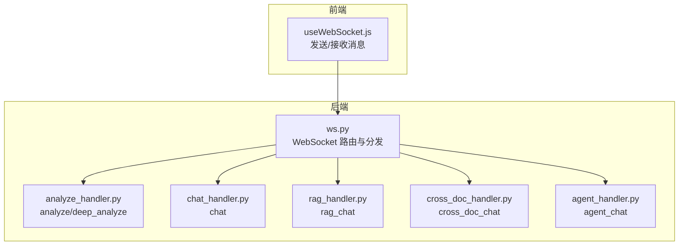
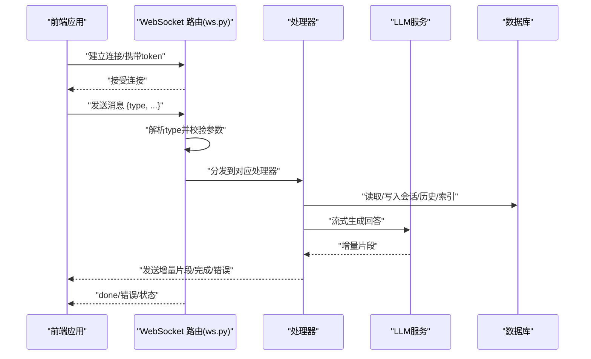
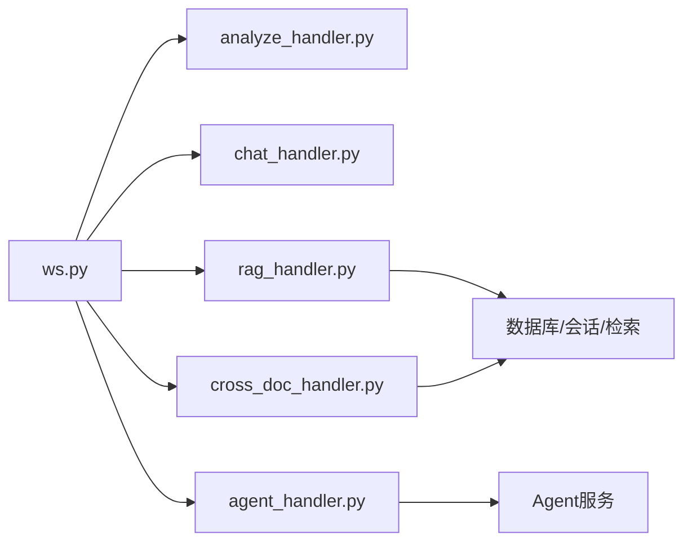

# 消息类型定义

<cite>
**本文档引用的文件**
- [ws.py](file://backend/app/routers/ws.py)
- [analyze_handler.py](file://backend/app/handlers/analyze_handler.py)
- [chat_handler.py](file://backend/app/handlers/chat_handler.py)
- [rag_handler.py](file://backend/app/handlers/rag_handler.py)
- [cross_doc_handler.py](file://backend/app/handlers/cross_doc_handler.py)
- [agent_handler.py](file://backend/app/handlers/agent_handler.py)
- [useWebSocket.js](file://frontend/src/hooks/useWebSocket.js)
</cite>

## 目录
1. [简介](#简介)
2. [项目结构](#项目结构)
3. [核心组件](#核心组件)
4. [架构总览](#架构总览)
5. [详细组件分析](#详细组件分析)
6. [依赖分析](#依赖分析)
7. [性能考虑](#性能考虑)
8. [故障排除指南](#故障排除指南)
9. [结论](#结论)

## 简介
本文件系统性梳理 PaperChat 的 WebSocket 消息类型定义，覆盖以下消息类型：
- analyze：论文章节概述分析
- chat：基于全文上下文的基础问答
- rag_chat：基于论文检索增强的问答（支持联网搜索）
- cross_doc_chat：跨多篇论文的检索增强问答
- deep_analyze：深度分析
- agent_chat：Agent 智能问答（意图识别、任务规划、逐步执行）
- unified_chat：统一聊天入口（根据关键词自动路由）
- cancel：取消当前运行的任务

文档提供每种消息类型的 JSON 规范、触发条件、参数要求、预期行为、验证规则、错误处理与边界情况，以及使用场景与最佳实践建议。同时给出关键流程的时序图与类图，帮助开发者快速理解与实现。

## 项目结构
PaperChat 的 WebSocket 能力由后端 FastAPI 路由集中管理，按消息类型分发至对应的处理器；前端通过 React Hook 封装 WebSocket 交互，统一发送与接收消息。

图表来源
- [ws.py:76-436](file://backend/app/routers/ws.py#L76-L436)
- [useWebSocket.js:1-180](file://frontend/src/hooks/useWebSocket.js#L1-L180)

章节来源
- [ws.py:1-436](file://backend/app/routers/ws.py#L1-L436)
- [useWebSocket.js:1-180](file://frontend/src/hooks/useWebSocket.js#L1-L180)

## 核心组件
- WebSocket 路由与分发：负责连接认证、消息解析、按 type 路由到具体处理器、并发任务管理与取消。
- 处理器模块：按功能拆分，分别处理 analyze、chat、rag_chat、cross_doc_chat、agent_chat 等。
- 前端 Hook：封装连接、重连、消息发送与事件订阅，屏蔽底层细节。

章节来源
- [ws.py:76-436](file://backend/app/routers/ws.py#L76-L436)
- [useWebSocket.js:1-180](file://frontend/src/hooks/useWebSocket.js#L1-L180)

## 架构总览
WebSocket 生命周期与消息流概览如下：

图表来源
- [ws.py:76-436](file://backend/app/routers/ws.py#L76-L436)
- [rag_handler.py:29-217](file://backend/app/handlers/rag_handler.py#L29-L217)
- [cross_doc_handler.py:14-95](file://backend/app/handlers/cross_doc_handler.py#L14-L95)
- [agent_handler.py:11-67](file://backend/app/handlers/agent_handler.py#L11-L67)

## 详细组件分析

### analyze（论文章节概述分析）
- 触发条件
  - 用户提交完整论文文本，长度需满足最小阈值。
- 请求格式
  - 必填字段：type（固定为 analyze）、text（论文文本）
  - 可选字段：paper_id（用于后续分析缓存）
- 预期行为
  - 流式返回分析片段（analyze_chunk），完成后发送 done（channel=analyze）。
  - 若提供 paper_id，分析结果将被缓存以便后续使用。
- 响应片段
  - analyze_chunk：增量输出
  - done：分析完成
  - error：输入过短或内部异常
- 边界与验证
  - 文本长度不足将返回错误。
  - 并发 analyze 会被取消旧任务。
- 使用场景与最佳实践
  - 适合首次上传论文后的整体结构与要点提取。
  - 建议在前端显示加载态，收到 done 后刷新界面。

章节来源
- [ws.py:120-136](file://backend/app/routers/ws.py#L120-L136)
- [analyze_handler.py:13-49](file://backend/app/handlers/analyze_handler.py#L13-L49)

### chat（基础问答）
- 触发条件
  - 用户提出问题，系统以“全文上下文”作为背景。
- 请求格式
  - 必填字段：type（固定为 chat）、message（问题）
- 预期行为
  - 流式返回问答片段（chat_chunk），完成后发送 done（channel=chat）。
- 响应片段
  - chat_chunk：增量输出
  - done：问答完成
  - error：内部异常
- 边界与验证
  - message 为空将返回错误。
  - 并发 chat 会被取消旧任务。
- 使用场景与最佳实践
  - 适合对已加载论文的快速问答。
  - 建议结合 paper_context 与历史对话提升准确性。

章节来源
- [ws.py:137-151](file://backend/app/routers/ws.py#L137-L151)
- [chat_handler.py:11-32](file://backend/app/handlers/chat_handler.py#L11-L32)

### rag_chat（论文检索增强问答）
- 触发条件
  - 用户提出问题，系统基于指定论文的检索上下文生成回答。
- 请求格式
  - 必填字段：type（固定为 rag_chat）、message（问题）、paper_id（论文ID）
  - 可选字段：session_id（会话ID）、user_id（用户ID，默认来自token）、enable_search（是否联网搜索，默认false）
- 预期行为
  - 创建或复用会话，保存用户消息与历史。
  - 检索相关文本块，必要时重建索引。
  - 可选地执行网络搜索并聚合上下文。
  - 流式返回问答片段（rag_chat_chunk），随后发送引用来源（rag_sources），最后发送 done（channel=rag_chat, session_id）。
- 响应片段
  - rag_chat_chunk：增量输出
  - rag_sources：引用来源列表（含论文与网络来源）
  - search_status：搜索状态（searching/completed）
  - done：问答完成
  - error：内部异常
- 边界与验证
  - 缺少 message 或 paper_id 返回错误。
  - 无检索结果且无网络结果时返回提示并完成。
  - 并发 rag_chat 会被取消旧任务。
- 使用场景与最佳实践
  - 适合精确引用来源的学术问答。
  - 建议开启 enable_search 以增强时效性与覆盖面。

章节来源
- [ws.py:153-183](file://backend/app/routers/ws.py#L153-L183)
- [rag_handler.py:29-217](file://backend/app/handlers/rag_handler.py#L29-L217)

### cross_doc_chat（跨文档问答）
- 触发条件
  - 用户提出问题，系统在多篇论文之间检索并生成回答。
- 请求格式
  - 必填字段：type（固定为 cross_doc_chat）、message（问题）、paper_ids（论文ID数组）
  - 可选字段：session_id（会话ID）、user_id（用户ID，默认来自token）
- 预期行为
  - 创建或复用会话，保存用户消息（含 paper_ids）与历史。
  - 在多篇论文中检索相关文本块。
  - 发送引用来源（cross_doc_sources），随后流式返回问答片段（cross_doc_chunk），最后发送 done（channel=cross_doc_chat, session_id）。
- 响应片段
  - cross_doc_chunk：增量输出
  - cross_doc_sources：引用来源列表（含 paper_id）
  - done：问答完成
  - error：内部异常
- 边界与验证
  - 缺少 message 或 paper_ids 返回错误。
  - 无检索结果时返回提示并完成。
  - 并发 cross_doc_chat 会被取消旧任务。
- 使用场景与最佳实践
  - 适合主题对比、综述类问题。
  - 建议合理控制 paper_ids 数量以平衡性能与质量。

章节来源
- [ws.py:223-250](file://backend/app/routers/ws.py#L223-L250)
- [cross_doc_handler.py:14-95](file://backend/app/handlers/cross_doc_handler.py#L14-L95)

### deep_analyze（深度分析）
- 触发条件
  - 用户提交完整论文文本，长度需满足最小阈值。
- 请求格式
  - 必填字段：type（固定为 deep_analyze）、text（论文文本）
  - 可选字段：paper_id（用于后续深度分析缓存）
- 预期行为
  - 流式返回深度分析片段（deep_analyze_chunk），完成后发送 done（channel=deep_analyze）。
  - 若提供 paper_id，深度分析结果将被缓存。
- 响应片段
  - deep_analyze_chunk：增量输出
  - done：分析完成
  - error：输入过短或内部异常
- 边界与验证
  - 文本长度不足将返回错误。
  - 并发 deep_analyze 会被取消旧任务。
- 使用场景与最佳实践
  - 适合深入解读论文方法、实验与结论。
  - 建议在前端显示加载态，收到 done 后刷新界面。

章节来源
- [ws.py:185-200](file://backend/app/routers/ws.py#L185-L200)
- [analyze_handler.py:51-87](file://backend/app/handlers/analyze_handler.py#L51-L87)

### agent_chat（Agent 智能问答）
- 触发条件
  - 用户提出复杂或多步骤问题，系统通过 Agent 模式进行意图识别、任务规划与逐步执行。
- 请求格式
  - 必填字段：type（固定为 agent_chat）、message（问题）
  - 可选字段：paper_id（单篇论文ID）、paper_ids（多篇论文ID）
- 预期行为
  - 意图识别（agent_intent）与任务规划（agent_plan）通知。
  - 逐步执行过程中的步骤开始与结果（agent_step、agent_step_result）。
  - 最终流式返回聚合答案片段（agent_answer_chunk），最后发送 done（channel=agent_chat）。
- 响应片段
  - agent_intent：识别到的意图
  - agent_plan：规划的步骤
  - agent_step / agent_step_result：执行进度与阶段性结果
  - agent_answer_chunk：最终答案片段
  - done：问答完成
  - error：内部异常
- 边界与验证
  - message 为空将返回错误。
  - 并发 agent_chat 会被取消旧任务。
- 使用场景与最佳实践
  - 适合需要多源检索、推理与整合的复杂问题。
  - 建议在前端展示意图与计划，提升用户体验。

章节来源
- [ws.py:202-221](file://backend/app/routers/ws.py#L202-L221)
- [agent_handler.py:11-67](file://backend/app/handlers/agent_handler.py#L11-L67)

### unified_chat（统一聊天入口）
- 触发条件
  - 用户输入任意消息，系统根据关键词自动识别意图并路由到相应功能。
- 请求格式
  - 必填字段：type（固定为 unified_chat）、message（问题）
  - 可选字段：paper_id、paper_ids、session_id、user_id（默认来自token）、enable_search
- 预期行为
  - 先发送意图检测结果（intent_detected），包含 intent、tool、confidence、matched。
  - 根据识别结果路由到 analyze、deep_analyze、cross_doc_chat 或 rag_chat。
  - 支持 fallback 到 rag_chat，若无法确定论文则提示。
- 响应片段
  - intent_detected：意图识别结果
  - 对应子流程的增量片段与完成信号
  - error：参数缺失或无法确定论文等
- 边界与验证
  - message 为空将返回错误。
  - 未匹配到特定意图时回退到 rag_chat。
  - 并发 unified 会被取消旧任务。
- 使用场景与最佳实践
  - 适合新手用户，降低选择成本。
  - 建议在前端展示意图检测结果，便于用户确认。

章节来源
- [ws.py:262-417](file://backend/app/routers/ws.py#L262-L417)

### cancel（取消当前任务）
- 触发条件
  - 用户主动取消正在进行的任务。
- 请求格式
  - 必填字段：type（固定为 cancel）
- 预期行为
  - 取消所有运行中的任务并清理状态，返回 cancelled 状态。
- 响应片段
  - cancelled：取消成功
- 使用场景与最佳实践
  - 在长耗时任务（如深度分析、跨文档检索）中提供中断能力。

章节来源
- [ws.py:252-260](file://backend/app/routers/ws.py#L252-L260)

## 依赖分析
- 消息类型与处理器映射
  - analyze/deep_analyze → analyze_handler
  - chat → chat_handler
  - rag_chat → rag_handler
  - cross_doc_chat → cross_doc_handler
  - agent_chat → agent_handler
  - unified_chat → ws.py 内部路由
  - cancel → ws.py 内部处理
- 并发与取消
  - 每个通道维护 running_tasks 字典，同一通道再次触发会取消旧任务。
- 数据库与会话
  - rag_chat 与 cross_doc_chat 使用会话持久化、历史加载与标题自动生成。
- LLM 与检索
  - 各处理器通过 LLM 服务与检索服务获取上下文与答案。

图表来源
- [ws.py:23-27](file://backend/app/routers/ws.py#L23-L27)
- [rag_handler.py:13-17](file://backend/app/handlers/rag_handler.py#L13-L17)
- [cross_doc_handler.py:10-11](file://backend/app/handlers/cross_doc_handler.py#L10-L11)
- [agent_handler.py](file://backend/app/handlers/agent_handler.py#L8)

章节来源
- [ws.py:23-27](file://backend/app/routers/ws.py#L23-L27)
- [rag_handler.py:13-17](file://backend/app/handlers/rag_handler.py#L13-L17)
- [cross_doc_handler.py:10-11](file://backend/app/handlers/cross_doc_handler.py#L10-L11)
- [agent_handler.py](file://backend/app/handlers/agent_handler.py#L8)

## 性能考虑
- 流式输出：所有问答与分析均采用流式增量返回，降低首屏延迟。
- 并发控制：同一通道只保留一个活跃任务，避免资源竞争。
- 异步检索与索引重建：当论文索引缺失时异步重建，不影响主线程。
- 网络搜索：按需开启，避免不必要的外部请求。
- 关键词提取：分析完成后异步执行，不阻塞主流程。

## 故障排除指南
- 常见错误类型
  - 输入校验错误：消息为空、缺少必要参数（如 paper_id、paper_ids）。
  - 论文状态错误：论文未解析或内容为空。
  - 检索失败：无相关文本块且无网络结果。
  - 任务取消：用户主动 cancel 或新任务抢占。
- 前端处理建议
  - 订阅 error 与 done 消息，及时更新 UI 状态。
  - 对于 search_status，显示搜索进度与结果数量。
  - 对于 cancelled，提示用户并允许重新发起任务。
- 后端处理建议
  - 在处理器内捕获 CancelledError，确保资源释放。
  - 对异常进行统一包装，避免泄露内部细节。

章节来源
- [ws.py:123-128](file://backend/app/routers/ws.py#L123-L128)
- [ws.py:167-172](file://backend/app/routers/ws.py#L167-L172)
- [ws.py:236-241](file://backend/app/routers/ws.py#L236-L241)
- [rag_handler.py:78-89](file://backend/app/handlers/rag_handler.py#L78-L89)
- [rag_handler.py:108-121](file://backend/app/handlers/rag_handler.py#L108-L121)
- [cross_doc_handler.py:32-45](file://backend/app/handlers/cross_doc_handler.py#L32-L45)

## 结论
PaperChat 的 WebSocket 消息体系以清晰的类型划分与严格的参数校验为基础，结合流式输出与并发控制，提供了稳定高效的论文分析与问答体验。通过统一聊天入口与 Agent 模式，系统进一步降低了使用门槛并提升了复杂问题的解决能力。建议在实际集成中严格遵循本文档的消息规范与最佳实践，确保前后端一致的交互体验与健壮的错误处理。