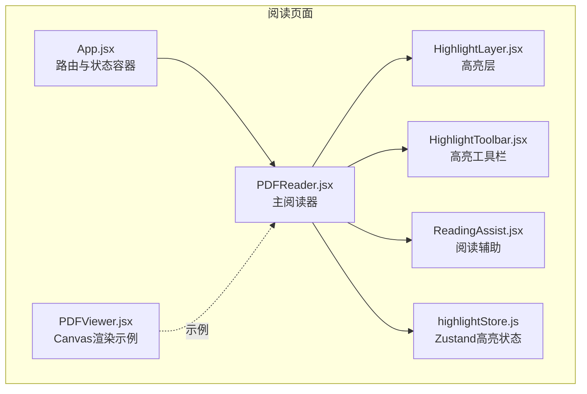
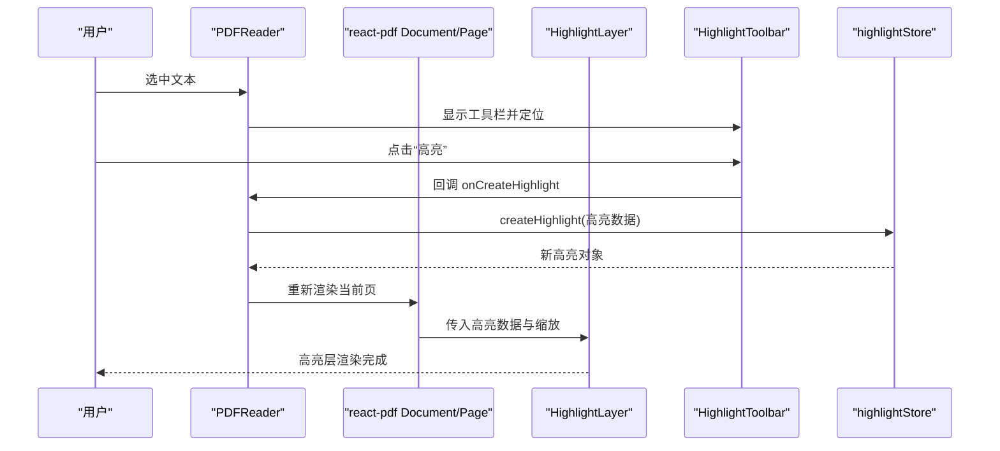
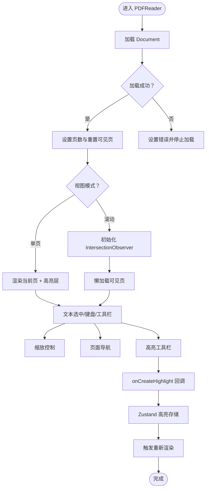
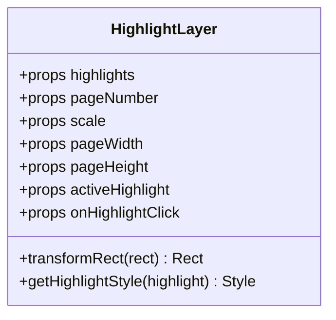
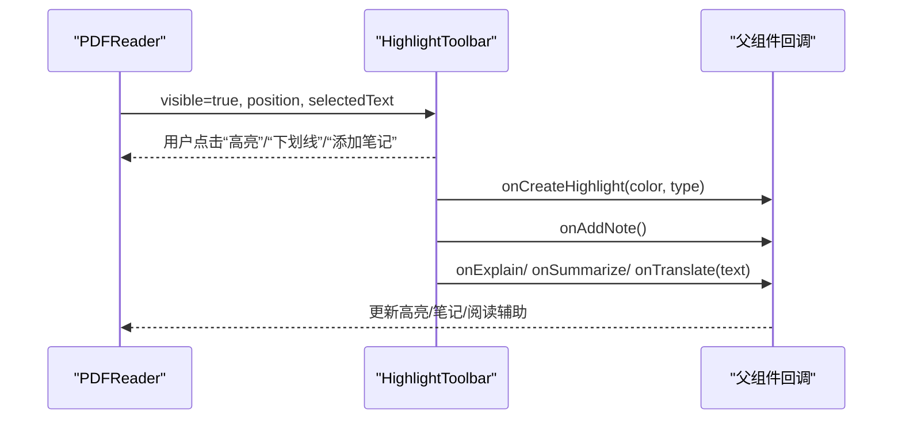
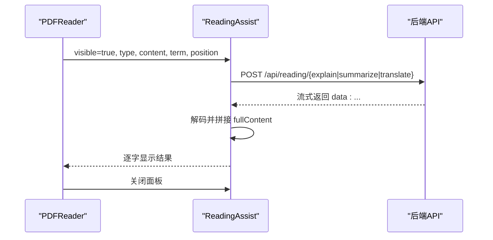
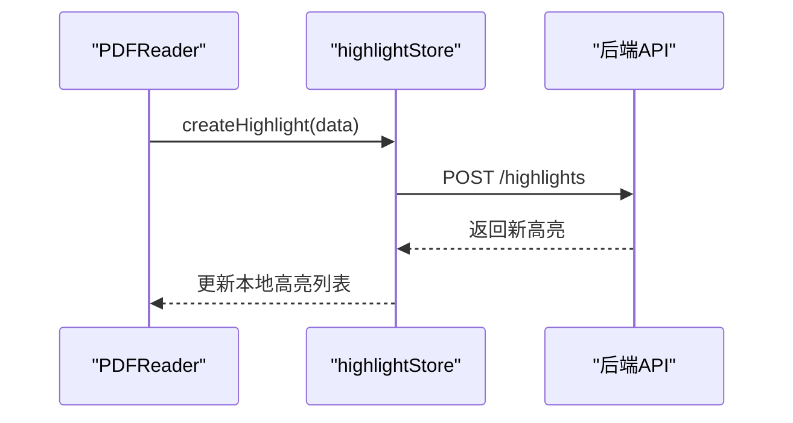
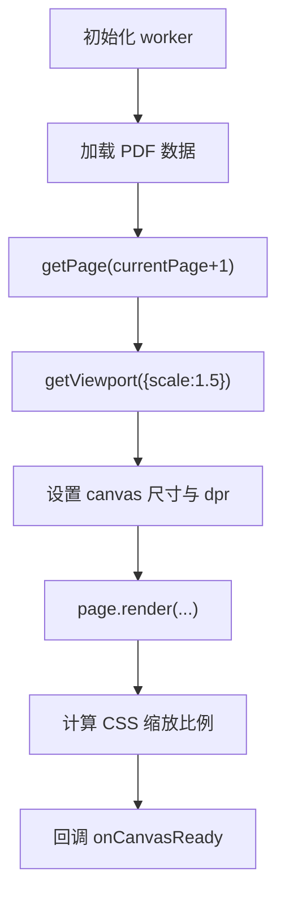
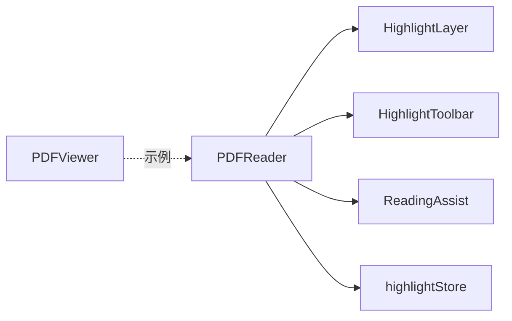

# PDF 阅读器组件

<cite>
**本文引用的文件**
- [PDFReader.jsx](file://frontend/src/components/PDFReader/PDFReader.jsx)
- [PDFReader.module.css](file://frontend/src/components/PDFReader/PDFReader.module.css)
- [PDFViewer.jsx](file://frontend/src/components/PDFViewer/PDFViewer.jsx)
- [PDFViewer.module.css](file://frontend/src/components/PDFViewer/PDFViewer.module.css)
- [HighlightLayer.jsx](file://frontend/src/components/HighlightLayer/HighlightLayer.jsx)
- [HighlightToolbar.jsx](file://frontend/src/components/HighlightToolbar/HighlightToolbar.jsx)
- [ReadingAssist.jsx](file://frontend/src/components/ReadingAssist/ReadingAssist.jsx)
- [highlightStore.js](file://frontend/src/stores/highlightStore.js)
- [App.jsx](file://frontend/src/App.jsx)
- [PaperList.jsx](file://frontend/src/pages/PaperList.jsx)
</cite>

## 目录
1. [简介](#简介)
2. [项目结构](#项目结构)
3. [核心组件](#核心组件)
4. [架构总览](#架构总览)
5. [详细组件分析](#详细组件分析)
6. [依赖关系分析](#依赖关系分析)
7. [性能考量](#性能考量)
8. [故障排查指南](#故障排查指南)
9. [结论](#结论)
10. [附录](#附录)

## 简介
本技术文档围绕前端 PDF 阅读器组件进行系统化剖析，重点覆盖以下方面：
- 设计架构与实现原理：文档加载、页面渲染、缩放控制、页面导航、高亮与工具栏、阅读辅助、滚动模式与懒加载、坐标系转换等。
- 组件接口与状态管理：props 定义、内部状态、事件回调、与全局状态（Zustand）的集成。
- 交互与可用性：键盘快捷键、工具栏行为、术语解释/摘要/翻译的流式展示与缓存。
- 性能优化与可扩展性：IntersectionObserver 懒加载、设备像素比适配、坐标转换、错误处理策略。

## 项目结构
PDF 阅读器相关文件主要位于 frontend/src/components 下，并在应用入口通过路由注入到阅读页面中：
- PDFReader：主阅读器组件，负责文档加载、页面渲染、工具栏、高亮层、滚动模式与懒加载、键盘快捷键。
- PDFViewer：基于 pdfjs-dist 的 Canvas 渲染示例组件，演示基础渲染流程与设备像素比适配。
- HighlightLayer：在 Page 上叠加的高亮层，负责将 PDF 坐标转换为页面像素坐标并渲染高亮矩形。
- HighlightToolbar：文本选中后的浮动工具栏，提供高亮、下划线、添加笔记、术语解释、摘要、翻译等操作。
- ReadingAssist：阅读辅助面板，支持术语解释、摘要、翻译的流式展示与缓存。
- highlightStore：Zustand 状态存储，封装高亮的增删改查与激活态管理。
- App.jsx：路由与页面容器，承载 PDFReader 并注入高亮、笔记等状态与回调。
- PaperList.jsx：论文列表页面，演示如何上传 PDF 并跳转至阅读页面。

图表来源
- [App.jsx](file://frontend/src/App.jsx)
- [PDFReader.jsx](file://frontend/src/components/PDFReader/PDFReader.jsx)
- [PDFViewer.jsx](file://frontend/src/components/PDFViewer/PDFViewer.jsx)
- [HighlightLayer.jsx](file://frontend/src/components/HighlightLayer/HighlightLayer.jsx)
- [HighlightToolbar.jsx](file://frontend/src/components/HighlightToolbar/HighlightToolbar.jsx)
- [ReadingAssist.jsx](file://frontend/src/components/ReadingAssist/ReadingAssist.jsx)
- [highlightStore.js](file://frontend/src/stores/highlightStore.js)

章节来源
- [App.jsx](file://frontend/src/App.jsx)
- [PDFReader.jsx](file://frontend/src/components/PDFReader/PDFReader.jsx)
- [PDFViewer.jsx](file://frontend/src/components/PDFViewer/PDFViewer.jsx)
- [HighlightLayer.jsx](file://frontend/src/components/HighlightLayer/HighlightLayer.jsx)
- [HighlightToolbar.jsx](file://frontend/src/components/HighlightToolbar/HighlightToolbar.jsx)
- [ReadingAssist.jsx](file://frontend/src/components/ReadingAssist/ReadingAssist.jsx)
- [highlightStore.js](file://frontend/src/stores/highlightStore.js)

## 核心组件
- PDFReader：负责文档加载、页面渲染、缩放、页面导航、单页/滚动模式切换、IntersectionObserver 懒加载、文本选中与高亮创建、键盘快捷键、错误与加载状态管理。
- HighlightLayer：在 Page 上叠加高亮层，将 PDF 坐标转换为页面像素坐标并渲染矩形。
- HighlightToolbar：浮动工具栏，根据选中文本长度动态显示功能按钮，支持高亮、下划线、添加笔记、术语解释、摘要、翻译。
- ReadingAssist：术语解释/摘要/翻译的流式展示面板，支持缓存与复制。
- highlightStore：Zustand 高亮状态管理，提供加载、创建、更新、删除、激活态设置等方法。
- PDFViewer：基于 pdfjs-dist 的 Canvas 渲染示例，演示 viewport、设备像素比与缩放计算。

章节来源
- [PDFReader.jsx](file://frontend/src/components/PDFReader/PDFReader.jsx)
- [HighlightLayer.jsx](file://frontend/src/components/HighlightLayer/HighlightLayer.jsx)
- [HighlightToolbar.jsx](file://frontend/src/components/HighlightToolbar/HighlightToolbar.jsx)
- [ReadingAssist.jsx](file://frontend/src/components/ReadingAssist/ReadingAssist.jsx)
- [highlightStore.js](file://frontend/src/stores/highlightStore.js)
- [PDFViewer.jsx](file://frontend/src/components/PDFViewer/PDFViewer.jsx)

## 架构总览
PDFReader 作为阅读器核心，组合多个子组件与状态存储：
- 文档加载：通过 react-pdf 的 Document/ Page 实现；错误与成功回调分别设置 error 与 isLoading。
- 页面渲染：单页模式渲染当前页；滚动模式使用容器包裹多页，结合 IntersectionObserver 控制可见页。
- 交互与事件：文本选中、键盘快捷键、工具栏与阅读辅助面板联动。
- 高亮系统：HighlightLayer 渲染高亮；HighlightToolbar 创建高亮；highlightStore 管理高亮生命周期。
- 坐标转换：PDF 坐标系（左下原点，y 向上）与页面像素坐标系（左上原点，y 向下）之间的转换。
- 性能优化：滚动模式懒加载、fitToWidth 自适应缩放、设备像素比适配（PDFViewer 示例）。

图表来源
- [PDFReader.jsx](file://frontend/src/components/PDFReader/PDFReader.jsx)
- [HighlightLayer.jsx](file://frontend/src/components/HighlightLayer/HighlightLayer.jsx)
- [HighlightToolbar.jsx](file://frontend/src/components/HighlightToolbar/HighlightToolbar.jsx)
- [highlightStore.js](file://frontend/src/stores/highlightStore.js)

## 详细组件分析

### PDFReader 组件
- 职责与能力
  - 文档加载与错误处理：onDocumentLoadSuccess/onDocumentLoadError 控制 isLoading 与 error。
  - 页面导航：goToPage/goToPrevPage/goToNextPage，支持 Home/End/方向键。
  - 缩放控制：zoomIn/zoomOut/fitToWidth，scale 限制在 [0.5, 3.0]。
  - 视图模式：单页 single 与滚动 scroll，滚动模式启用 IntersectionObserver 懒加载。
  - 文本选中与高亮：getSelectionRectsInPDF 将像素坐标转换为 PDF 坐标，触发 onCreateHighlight。
  - 阅读辅助：术语解释、摘要、翻译，ReadingAssist 流式展示与缓存。
  - 高亮层：按页渲染 HighlightLayer，支持 activeHighlight 点击回调。
  - 状态：numPages/pageNumber/scale/loading/error/viewMode/toolbarVisible/selectionRects 等。
- Props 接口
  - file：File 或字符串，支持本地上传与远程 URL。
  - onTextSelected：(text, clientRects, pageNum) => void。
  - onPageChange：(pageNum) => void。
  - onCreateHighlight：(highlightData) => void。
  - onHighlightClick：(highlight) => void。
  - onAddNote：() => void。
  - initialPage：初始页码。
  - highlights：当前论文高亮数组。
  - activeHighlight：当前激活高亮。
  - paperId：论文 ID。
- 关键实现要点
  - Worker 配置：使用 unpkg CDN 的 pdf.worker.min.mjs。
  - 懒加载：IntersectionObserver + rootMargin: '200%'，阈值 0，预加载邻近页面。
  - 坐标转换：PDF 坐标系与页面像素坐标系的 y 轴翻转与 scale 缩放。
  - 键盘快捷键：阻止默认行为，避免在输入框中触发。
  - 页面尺寸缓存：handlePageLoadSuccess 缓存每页 originalWidth/originalHeight。
- 事件与回调
  - onTextSelected：传递选中文本、客户端矩形与页码。
  - onPageChange：页码变更回调。
  - onCreateHighlight：创建高亮数据（含 paper_id、page、rects、color、highlight_type、selected_text）。
  - onHighlightClick：点击高亮回调，用于跳转或编辑。

图表来源
- [PDFReader.jsx](file://frontend/src/components/PDFReader/PDFReader.jsx)
- [highlightStore.js](file://frontend/src/stores/highlightStore.js)

章节来源
- [PDFReader.jsx](file://frontend/src/components/PDFReader/PDFReader.jsx)
- [PDFReader.module.css](file://frontend/src/components/PDFReader/PDFReader.module.css)

### HighlightLayer 组件
- 功能：在 Page 上叠加一层，将 PDF 坐标转换为页面像素坐标并渲染高亮矩形。
- 关键点
  - transformRect：将 PDF 坐标 (x0,y0,x1,y1) 转换为页面像素坐标（考虑 y 轴翻转与 scale）。
  - 支持多种高亮类型：实心高亮、下划线、删除线。
  - 点击高亮：透传 onHighlightClick，用于跳转或编辑。
- 输入参数：highlights、pageNumber、scale、pageWidth、pageHeight、activeHighlight、onHighlightClick。

图表来源
- [HighlightLayer.jsx](file://frontend/src/components/HighlightLayer/HighlightLayer.jsx)

章节来源
- [HighlightLayer.jsx](file://frontend/src/components/HighlightLayer/HighlightLayer.jsx)

### HighlightToolbar 组件
- 功能：文本选中后在选区上方弹出工具栏，提供颜色选择、下划线、添加笔记、术语解释、摘要、翻译等。
- 关键点
  - 根据选中文本长度动态显示按钮（短文本术语解释，长文本摘要/翻译）。
  - 点击外部自动关闭，边界检查确保不超出视口。
  - 调用父组件回调：onCreateHighlight、onAddNote、onExplain、onSummarize、onTranslate。
- 输入参数：position、selectedText、onCreateHighlight、onAddNote、onExplain、onSummarize、onTranslate、onClose、visible。

图表来源
- [HighlightToolbar.jsx](file://frontend/src/components/HighlightToolbar/HighlightToolbar.jsx)
- [PDFReader.jsx](file://frontend/src/components/PDFReader/PDFReader.jsx)

章节来源
- [HighlightToolbar.jsx](file://frontend/src/components/HighlightToolbar/HighlightToolbar.jsx)

### ReadingAssist 组件
- 功能：术语解释、摘要、翻译的流式展示面板，支持缓存与复制。
- 关键点
  - 流式读取：fetchStreamResult 使用 ReadableStream 逐步解码并逐字显示。
  - 缓存：termCache 对术语解释进行缓存，避免重复请求。
  - 边界检查：面板位置在视口内自适应。
  - 错误处理：统一捕获 AbortError 与网络错误。
- 输入参数：type、content、term、position、visible、onClose。

图表来源
- [ReadingAssist.jsx](file://frontend/src/components/ReadingAssist/ReadingAssist.jsx)
- [PDFReader.jsx](file://frontend/src/components/PDFReader/PDFReader.jsx)

章节来源
- [ReadingAssist.jsx](file://frontend/src/components/ReadingAssist/ReadingAssist.jsx)

### highlightStore 状态管理
- 能力：加载高亮、创建高亮、更新高亮、删除高亮、设置激活高亮、清空与错误处理。
- 与 PDFReader 的集成：PDFReader 通过 onCreateHighlight 调用 createHighlight，再由状态存储更新本地高亮列表与激活态。

图表来源
- [highlightStore.js](file://frontend/src/stores/highlightStore.js)
- [PDFReader.jsx](file://frontend/src/components/PDFReader/PDFReader.jsx)

章节来源
- [highlightStore.js](file://frontend/src/stores/highlightStore.js)

### PDFViewer 组件（Canvas 渲染示例）
- 能力：基于 pdfjs-dist 的 Canvas 渲染，演示 viewport、设备像素比适配与缩放计算。
- 关键点：getDocument -> getPage -> getViewport -> canvas.getContext('2d') -> render -> 计算 CSS 缩放比例。

图表来源
- [PDFViewer.jsx](file://frontend/src/components/PDFViewer/PDFViewer.jsx)
- [PDFViewer.module.css](file://frontend/src/components/PDFViewer/PDFViewer.module.css)

章节来源
- [PDFViewer.jsx](file://frontend/src/components/PDFViewer/PDFViewer.jsx)
- [PDFViewer.module.css](file://frontend/src/components/PDFViewer/PDFViewer.module.css)

## 依赖关系分析
- 组件耦合
  - PDFReader 与 HighlightLayer/HighlightToolbar/ReadingAssist 为组合关系，通过 props 与回调交互。
  - PDFReader 与 highlightStore 通过回调集成，实现高亮的持久化与状态同步。
- 外部依赖
  - react-pdf：文档与页面渲染、文本层与注释层。
  - pdfjs-dist（示例）：Canvas 渲染与 viewport 计算。
  - Zustand：高亮状态管理。
- 潜在循环依赖
  - 当前结构无循环依赖；若未来引入更复杂的跨组件通信，建议通过上下文或集中式状态管理降低耦合。

图表来源
- [PDFReader.jsx](file://frontend/src/components/PDFReader/PDFReader.jsx)
- [HighlightLayer.jsx](file://frontend/src/components/HighlightLayer/HighlightLayer.jsx)
- [HighlightToolbar.jsx](file://frontend/src/components/HighlightToolbar/HighlightToolbar.jsx)
- [ReadingAssist.jsx](file://frontend/src/components/ReadingAssist/ReadingAssist.jsx)
- [highlightStore.js](file://frontend/src/stores/highlightStore.js)
- [PDFViewer.jsx](file://frontend/src/components/PDFViewer/PDFViewer.jsx)

章节来源
- [PDFReader.jsx](file://frontend/src/components/PDFReader/PDFReader.jsx)
- [highlightStore.js](file://frontend/src/stores/highlightStore.js)

## 性能考量
- 懒加载与滚动模式
  - IntersectionObserver rootMargin: '200%' 提前渲染邻近页面，减少滚动卡顿。
  - 滚动容器使用占位符高度，避免 DOM 结构变化导致的跳动。
- 缩放与渲染
  - fitToWidth 基于标准 A4/Letter 宽度计算 scale，限制范围 [0.5, 3.0]。
  - 单页模式仅渲染当前页，减少内存占用。
- 坐标转换
  - PDF 坐标系与页面像素坐标系的 y 轴翻转与 scale 缩放，避免重复计算。
- 设备像素比（示例）
  - PDFViewer 展示了 dpr 适配与 CSS 尺寸分离，保证清晰度与性能平衡。
- 键盘与事件
  - 键盘事件在窗口级别监听，注意在输入框中拦截，避免干扰用户输入。

[本节为通用性能讨论，无需特定文件引用]

## 故障排查指南
- 文档加载失败
  - 现象：error 字段提示“PDF 文件加载失败，请检查文件格式”，isLoading 变为 false。
  - 排查：确认 file 是否为有效 File 或合法 URL；检查网络与权限。
- 页面渲染异常
  - 现象：页面空白或报错。
  - 排查：确认 react-pdf 版本与 worker URL；检查 Document/ Page 的 file 与 onLoadSuccess/onLoadError。
- 高亮不显示
  - 现象：选中文本后无法创建高亮或高亮层不出现。
  - 排查：确认 pageDimensions 已缓存；scale 是否为 0；rects 是否为有效数组；paperId 是否传入。
- 滚动模式卡顿
  - 现象：滚动时页面跳动或渲染延迟。
  - 排查：检查 rootMargin 与阈值；确保占位符高度与实际页面高度一致；避免频繁重排。
- 阅读辅助无响应
  - 现象：点击术语解释/摘要/翻译无输出。
  - 排查：确认后端 API 可用；检查流式响应格式；查看 termCache 是否命中。

章节来源
- [PDFReader.jsx](file://frontend/src/components/PDFReader/PDFReader.jsx)
- [ReadingAssist.jsx](file://frontend/src/components/ReadingAssist/ReadingAssist.jsx)

## 结论
PDFReader 组件通过模块化设计实现了完整的 PDF 阅读体验：文档加载、页面渲染、缩放与导航、文本选中与高亮、滚动懒加载、阅读辅助与流式展示。其与 highlightStore 的集成确保高亮的持久化与状态一致性；坐标转换与设备像素比适配保障了渲染质量与性能。整体架构清晰、职责明确，具备良好的可扩展性与可维护性。

[本节为总结，无需特定文件引用]

## 附录

### Props 接口定义（PDFReader）
- file：File | string
- onTextSelected：(text, clientRects, pageNum) => void
- onPageChange：(pageNum) => void
- onCreateHighlight：(highlightData) => void
- onHighlightClick：(highlight) => void
- onAddNote：() => void
- initialPage：number
- highlights：Array
- activeHighlight：Object | null
- paperId：string | number

章节来源
- [PDFReader.jsx](file://frontend/src/components/PDFReader/PDFReader.jsx)

### 键盘快捷键
- 方向键左右/上下：页面导航
- 空格：下一页
- Home/End：首页/末页
- 阻止在输入框中触发

章节来源
- [PDFReader.jsx](file://frontend/src/components/PDFReader/PDFReader.jsx)

### 坐标系转换算法
- PDF 坐标系：左下角为原点，y 轴向上
- 页面像素坐标系：左上角为原点，y 轴向下
- 转换公式（像素 -> PDF）：x0=(left-leftPage)/scale；y0=(pageHeight-(bottom-topPage))/scale；x1=(right-leftPage)/scale；y1=(pageHeight-(top-topPage))/scale

章节来源
- [PDFReader.jsx](file://frontend/src/components/PDFReader/PDFReader.jsx)
- [HighlightLayer.jsx](file://frontend/src/components/HighlightLayer/HighlightLayer.jsx)

### 使用示例（路由与页面容器）
- App.jsx 中 ReaderPage 通过路由参数 id 加载论文并注入 PDFReader。
- PaperList.jsx 支持拖拽上传 PDF 并跳转到阅读页面。

章节来源
- [App.jsx](file://frontend/src/App.jsx)
- [PaperList.jsx](file://frontend/src/pages/PaperList.jsx)