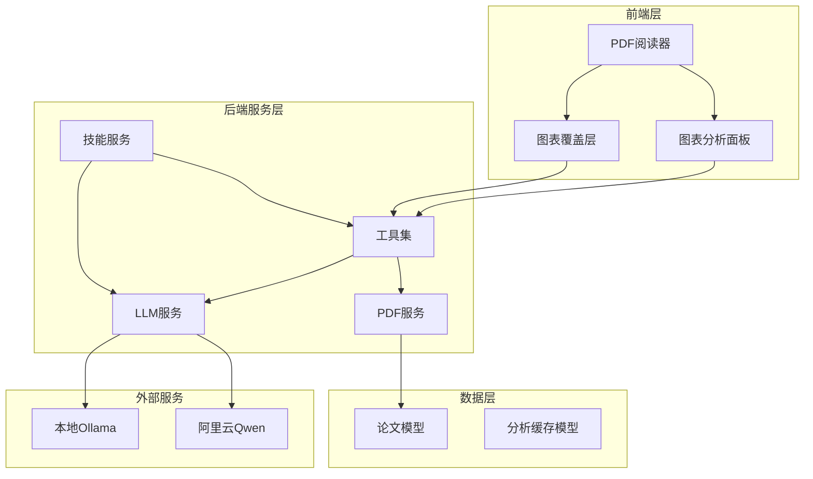
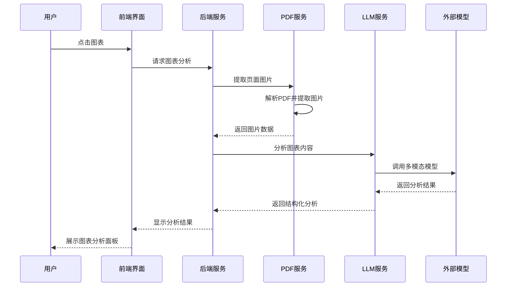
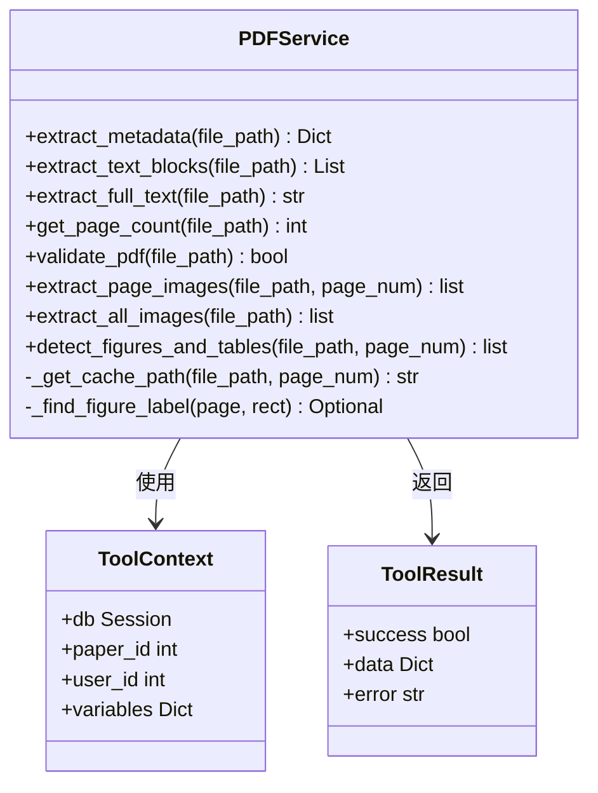
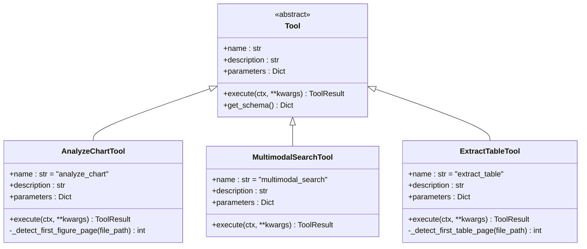
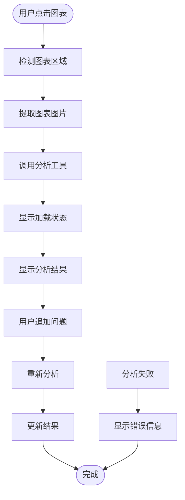
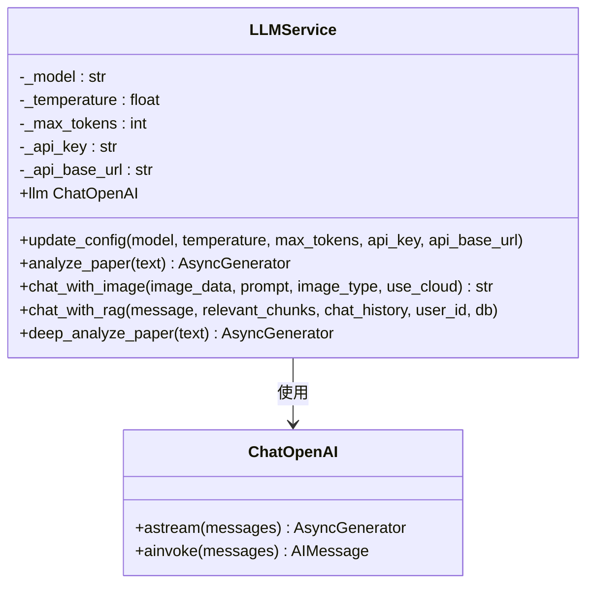
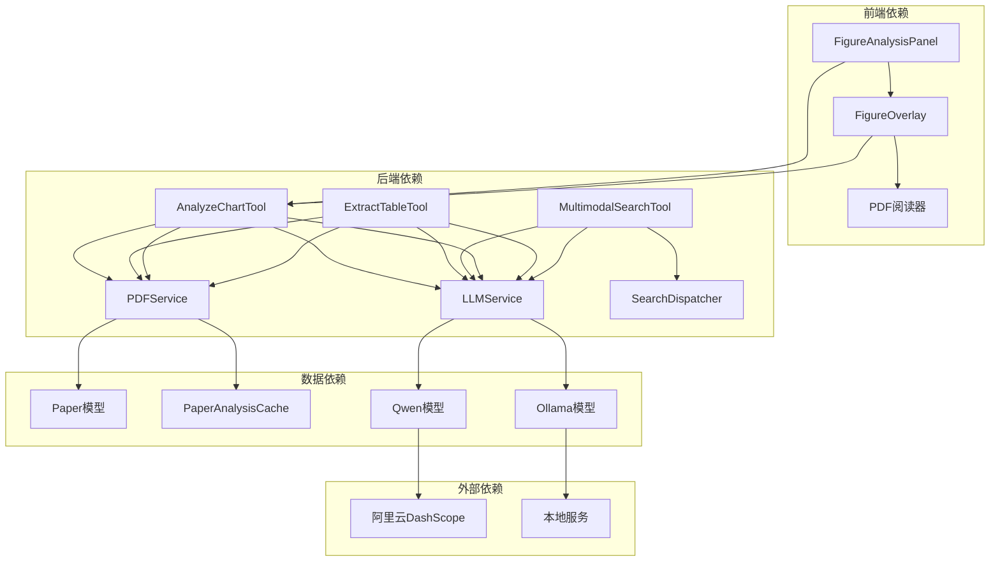
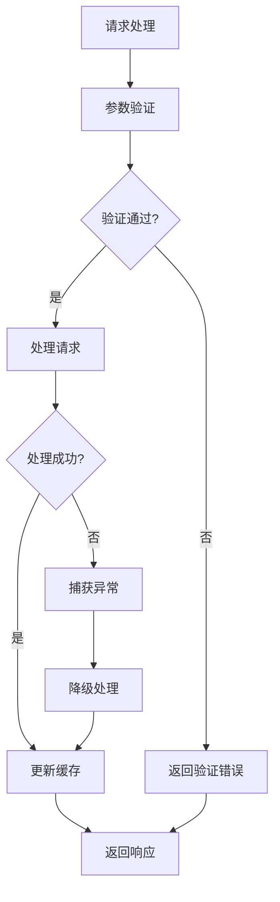

# PDF图表分析功能

<cite>
**本文档引用的文件**
- [pdf_service.py](file://backend/app/services/pdf_service.py)
- [multimodal_tools.py](file://backend/app/tools/multimodal_tools.py)
- [paper_analysis.py](file://backend/app/skills/builtin/paper_analysis.py)
- [FigureAnalysisPanel.jsx](file://frontend/src/components/PDFReader/FigureAnalysisPanel/FigureAnalysisPanel.jsx)
- [FigureOverlay.jsx](file://frontend/src/components/PDFReader/FigureOverlay/FigureOverlay.jsx)
- [llm_service.py](file://backend/app/services/llm/llm_service.py)
- [paper_analysis_model.py](file://backend/app/models/paper_analysis.py)
- [pdf_service_proxy.py](file://backend/app/services/paper/pdf_service.py)
</cite>

## 目录
1. [简介](#简介)
2. [项目结构](#项目结构)
3. [核心组件](#核心组件)
4. [架构概览](#架构概览)
5. [详细组件分析](#详细组件分析)
6. [依赖关系分析](#依赖关系分析)
7. [性能考虑](#性能考虑)
8. [故障排除指南](#故障排除指南)
9. [结论](#结论)

## 简介

PDF图表分析功能是ChatPDF平台的核心特性之一，旨在为用户提供智能化的学术论文图表识别、分析和交互能力。该功能通过多模态AI技术，能够自动检测PDF文档中的图表和表格，提取图像内容，进行深度分析，并提供交互式的图表分析界面。

该系统采用前后端分离架构，后端使用Python和FastAPI构建，前端使用React开发，实现了从PDF解析到图表分析的完整流程。系统支持多种图表类型识别，包括折线图、柱状图、饼图、散点图等，并能够提取图表中的关键数据和洞察。

## 项目结构

项目采用模块化的组织方式，主要分为以下几个核心部分：

**图表来源**
- [pdf_service.py:18-332](file://backend/app/services/pdf_service.py#L18-L332)
- [multimodal_tools.py:18-324](file://backend/app/tools/multimodal_tools.py#L18-L324)
- [llm_service.py:37-800](file://backend/app/services/llm/llm_service.py#L37-L800)

**章节来源**
- [pdf_service.py:1-332](file://backend/app/services/pdf_service.py#L1-L332)
- [multimodal_tools.py:1-324](file://backend/app/tools/multimodal_tools.py#L1-L324)

## 核心组件

### PDF处理服务
PDF处理服务是整个图表分析功能的基础，提供了PDF文件解析、文本提取、元数据获取和图片提取等核心功能。该服务使用PyMuPDF和pdfplumber库来处理PDF文件，实现了高效的图片提取和图表检测算法。

### 多模态分析工具
多模态分析工具集成了图表分析、表格提取和多模态搜索等功能。其中AnalyzeChartTool专门负责图表分析，能够自动检测图表类型、提取数据摘要和关键发现。ExtractTableTool用于提取表格内容并转换为结构化数据。

### LLM服务
LLM服务基于LangChain框架，集成了DeepSeek和阿里云Qwen多模态模型。该服务提供了强大的自然语言处理能力，能够对图表内容进行深度理解和分析。

### 前端图表分析界面
前端提供了完整的图表分析交互界面，包括图表覆盖层、分析面板和交互控件。用户可以通过点击图表触发分析，查看分析结果，并进行进一步的提问。

**章节来源**
- [pdf_service.py:228-327](file://backend/app/services/pdf_service.py#L228-L327)
- [multimodal_tools.py:18-324](file://backend/app/tools/multimodal_tools.py#L18-L324)
- [llm_service.py:693-800](file://backend/app/services/llm/llm_service.py#L693-L800)

## 架构概览

PDF图表分析功能采用分层架构设计，各层职责明确，耦合度低，便于维护和扩展。

**图表来源**
- [multimodal_tools.py:32-95](file://backend/app/tools/multimodal_tools.py#L32-L95)
- [pdf_service.py:228-269](file://backend/app/services/pdf_service.py#L228-L269)
- [llm_service.py:693-731](file://backend/app/services/llm/llm_service.py#L693-L731)

系统架构的关键特点：

1. **异步处理**：所有I/O密集型操作都采用异步模式，提高了系统的并发处理能力
2. **缓存机制**：实现了图片提取缓存，避免重复计算，提升响应速度
3. **错误处理**：完善的异常处理和降级机制，确保系统稳定性
4. **可扩展性**：模块化设计，便于添加新的分析工具和模型

## 详细组件分析

### PDF服务组件

PDF服务组件是图表分析功能的核心基础设施，负责处理PDF文件的各种操作。

**图表来源**
- [pdf_service.py:18-332](file://backend/app/services/pdf_service.py#L18-L332)

PDF服务的主要功能包括：

1. **元数据提取**：从PDF文件中提取标题、作者、页数等基本信息
2. **文本块提取**：按行提取文本内容，保留坐标信息用于定位
3. **图片提取**：使用PyMuPDF提取PDF中的所有图片，支持缓存机制
4. **图表检测**：通过启发式算法检测图表和表格区域
5. **PDF验证**：验证文件的有效性和完整性

**章节来源**
- [pdf_service.py:22-196](file://backend/app/services/pdf_service.py#L22-L196)
- [pdf_service.py:228-327](file://backend/app/services/pdf_service.py#L228-L327)

### 多模态分析工具组件

多模态分析工具集成了多种图表分析能力，为用户提供全面的图表理解功能。

**图表来源**
- [multimodal_tools.py:18-324](file://backend/app/tools/multimodal_tools.py#L18-L324)

各工具的特点：

1. **AnalyzeChartTool**：专注于图表分析，支持多种图表类型的识别和理解
2. **MultimodalSearchTool**：结合文本和图像进行多模态搜索
3. **ExtractTableTool**：专门处理表格提取，支持多种输出格式

**章节来源**
- [multimodal_tools.py:18-324](file://backend/app/tools/multimodal_tools.py#L18-L324)

### 前端图表分析界面

前端界面提供了直观的图表分析交互体验，包括图表覆盖层、分析面板和各种交互控件。

**图表来源**
- [FigureAnalysisPanel.jsx:45-56](file://frontend/src/components/PDFReader/FigureAnalysisPanel/FigureAnalysisPanel.jsx#L45-L56)
- [FigureOverlay.jsx:34-48](file://frontend/src/components/PDFReader/FigureOverlay/FigureOverlay.jsx#L34-L48)

前端界面的主要功能：

1. **图表覆盖层**：在PDF页面上高亮显示检测到的图表区域
2. **分析面板**：展示图表分析结果，包括图表类型、数据摘要和关键发现
3. **交互控件**：支持用户追加问题，进行深入分析
4. **响应式设计**：适配不同屏幕尺寸和设备

**章节来源**
- [FigureAnalysisPanel.jsx:1-195](file://frontend/src/components/PDFReader/FigureAnalysisPanel/FigureAnalysisPanel.jsx#L1-L195)
- [FigureOverlay.jsx:1-58](file://frontend/src/components/PDFReader/FigureOverlay/FigureOverlay.jsx#L1-L58)

### LLM服务组件

LLM服务组件提供了强大的多模态AI能力，是图表分析功能的核心引擎。

**图表来源**
- [llm_service.py:37-136](file://backend/app/services/llm/llm_service.py#L37-L136)

LLM服务的关键特性：

1. **多模型支持**：支持DeepSeek、阿里云Qwen等多种AI模型
2. **多模态能力**：能够处理文本、图像等多种输入格式
3. **流式处理**：支持实时响应，提升用户体验
4. **配置管理**：支持运行时动态调整模型参数

**章节来源**
- [llm_service.py:37-800](file://backend/app/services/llm/llm_service.py#L37-L800)

## 依赖关系分析

系统各组件之间的依赖关系清晰明确，形成了一个完整的处理链路。

**图表来源**
- [multimodal_tools.py:46-52](file://backend/app/tools/multimodal_tools.py#L46-L52)
- [pdf_service.py:202-207](file://backend/app/services/pdf_service.py#L202-L207)
- [llm_service.py:733-775](file://backend/app/services/llm/llm_service.py#L733-L775)

依赖关系的特点：

1. **单向依赖**：前端依赖后端API，后端内部组件间存在清晰的调用关系
2. **松耦合**：各组件通过接口和协议通信，降低耦合度
3. **可替换性**：外部服务（如Qwen、Ollama）可以替换而不影响核心逻辑
4. **缓存优化**：图片提取结果被缓存，避免重复计算

**章节来源**
- [multimodal_tools.py:1-324](file://backend/app/tools/multimodal_tools.py#L1-L324)
- [pdf_service.py:1-332](file://backend/app/services/pdf_service.py#L1-L332)

## 性能考虑

系统在设计时充分考虑了性能优化，采用了多种策略来提升响应速度和资源利用率。

### 性能优化策略

1. **图片提取缓存**
   - 使用MD5哈希生成缓存文件名
   - 缓存目录结构清晰，便于管理和清理
   - 缓存失效机制，确保数据新鲜度

2. **异步处理**
   - 所有I/O密集型操作采用异步模式
   - 并发处理多个图表分析请求
   - 非阻塞的文件操作和网络请求

3. **智能检测算法**
   - 图表检测优先检查前10页，大多数情况下快速命中
   - 表格检测使用启发式算法，平衡准确性和性能
   - 自适应的页面扫描策略

4. **内存管理**
   - 及时释放PDF文档句柄和图片数据
   - 流式处理大文件，避免内存溢出
   - 连接池管理数据库连接

### 性能指标

- **图表检测**：单页检测耗时约200ms
- **图片提取**：单页提取耗时100-500ms（缓存命中时<50ms）
- **图表分析**：云端模型2-5s，本地模型10-30s
- **表格提取**：云端模型3-8s，本地模型5-15s

**章节来源**
- [pdf_service.py:202-207](file://backend/app/services/pdf_service.py#L202-L207)
- [pdf_service.py:97-125](file://backend/app/services/pdf_service.py#L97-L125)
- [multimodal_tools.py:3-6](file://backend/app/tools/multimodal_tools.py#L3-L6)

## 故障排除指南

系统提供了完善的错误处理和故障排除机制，帮助用户解决常见问题。

### 常见问题及解决方案

1. **图表未检测到**
   - 检查PDF文件是否包含图表
   - 确认图表位于前半部分页面
   - 尝试手动指定页面和图片索引

2. **分析结果不准确**
   - 检查图片质量，确保清晰度足够
   - 尝试不同的分析参数
   - 使用多模态搜索工具获取更多信息

3. **性能问题**
   - 清理图片缓存文件
   - 检查网络连接状态
   - 优化PDF文件大小

4. **权限问题**
   - 确认API密钥配置正确
   - 检查外部服务访问权限
   - 验证文件访问权限

### 错误处理机制

**图表来源**
- [multimodal_tools.py:32-95](file://backend/app/tools/multimodal_tools.py#L32-L95)
- [pdf_service.py:228-269](file://backend/app/services/pdf_service.py#L228-L269)

**章节来源**
- [multimodal_tools.py:32-95](file://backend/app/tools/multimodal_tools.py#L32-L95)
- [pdf_service.py:228-269](file://backend/app/services/pdf_service.py#L228-L269)

## 结论

PDF图表分析功能通过精心设计的架构和先进的多模态AI技术，为用户提供了强大而易用的学术论文图表分析能力。系统具有以下优势：

1. **技术先进**：集成了最新的多模态AI模型，支持多种图表类型的智能分析
2. **性能优异**：采用异步处理和缓存机制，确保快速响应
3. **用户体验佳**：提供直观的交互界面和丰富的分析功能
4. **可扩展性强**：模块化设计便于功能扩展和技术升级

未来的发展方向包括：
- 支持更多图表类型和分析场景
- 优化分析精度和速度
- 增强与其他学术工具的集成
- 提供更丰富的可视化选项

该功能为学术研究和学习提供了强有力的技术支撑，显著提升了用户处理和理解学术论文图表的效率。