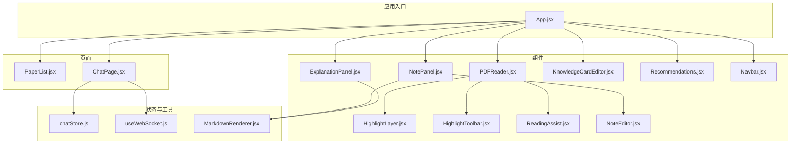
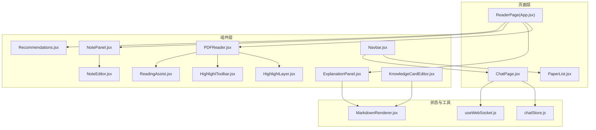
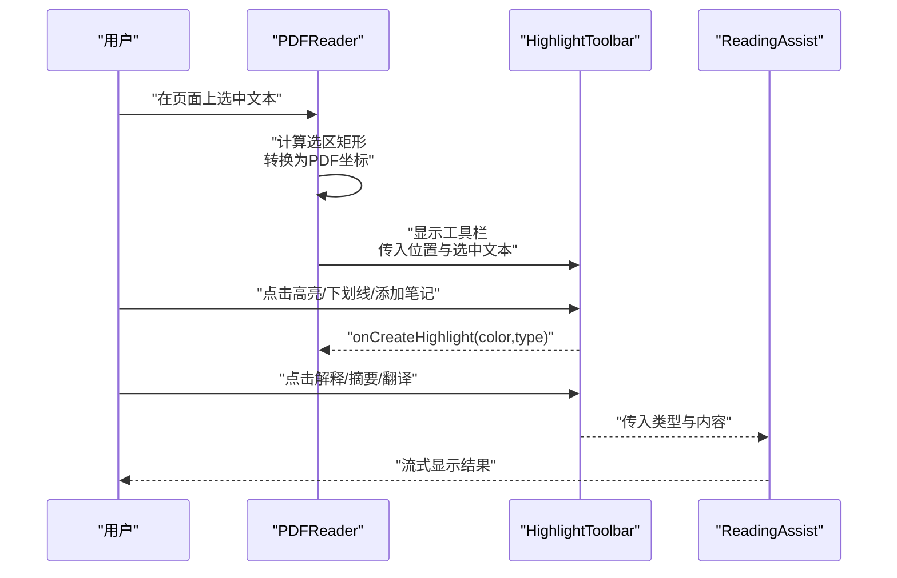
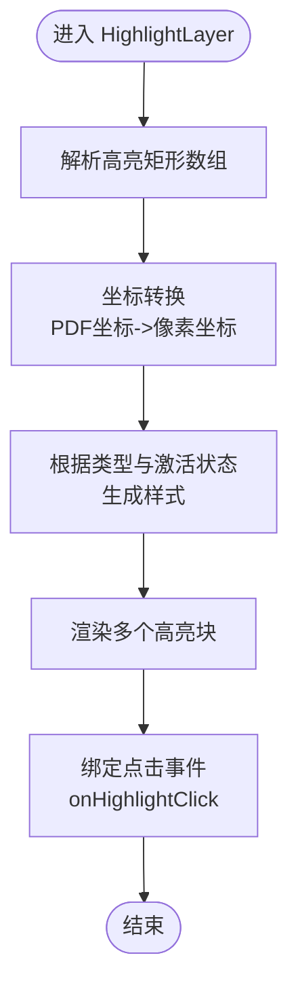
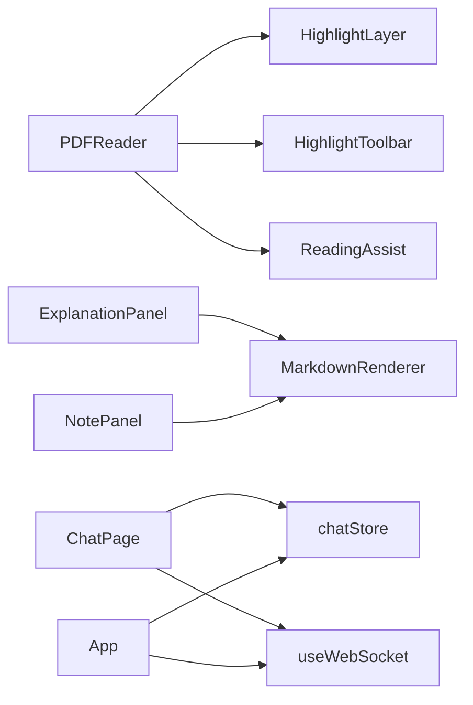

# UI 组件系统

<cite>
**本文引用的文件**
- [PDFReader.jsx](file://frontend/src/components/PDFReader/PDFReader.jsx)
- [ChatPanel.jsx](file://frontend/src/components/ChatPanel/ChatPanel.jsx)
- [NotePanel.jsx](file://frontend/src/components/NotePanel/NotePanel.jsx)
- [HighlightLayer.jsx](file://frontend/src/components/HighlightLayer/HighlightLayer.jsx)
- [ExplanationPanel.jsx](file://frontend/src/components/ExplanationPanel/ExplanationPanel.jsx)
- [Recommendations.jsx](file://frontend/src/components/Recommendations/Recommendations.jsx)
- [Navbar.jsx](file://frontend/src/components/Navbar/Navbar.jsx)
- [HighlightToolbar.jsx](file://frontend/src/components/HighlightToolbar/HighlightToolbar.jsx)
- [ReadingAssist.jsx](file://frontend/src/components/ReadingAssist/ReadingAssist.jsx)
- [NoteEditor.jsx](file://frontend/src/components/NoteEditor/NoteEditor.jsx)
- [KnowledgeCardEditor.jsx](file://frontend/src/components/KnowledgeCardEditor/KnowledgeCardEditor.jsx)
- [useWebSocket.js](file://frontend/src/hooks/useWebSocket.js)
- [MarkdownRenderer.jsx](file://frontend/src/utils/MarkdownRenderer.jsx)
- [App.jsx](file://frontend/src/App.jsx)
- [PaperList.jsx](file://frontend/src/pages/PaperList.jsx)
- [ChatPage.jsx](file://frontend/src/pages/ChatPage.jsx)
- [chatStore.js](file://frontend/src/stores/chatStore.js)
</cite>

## 目录
1. [简介](#简介)
2. [项目结构](#项目结构)
3. [核心组件](#核心组件)
4. [架构总览](#架构总览)
5. [详细组件分析](#详细组件分析)
6. [依赖关系分析](#依赖关系分析)
7. [性能考量](#性能考量)
8. [故障排查指南](#故障排查指南)
9. [结论](#结论)
10. [附录](#附录)

## 简介
本技术文档面向 PaperChat 的 UI 组件系统，系统性梳理 PDF 阅读器、聊天面板、笔记面板、高亮层、解释面板、推荐组件和导航栏等核心组件的设计架构与实现原理。文档覆盖组件的 props 接口、事件处理机制、状态管理策略、组件间通信模式、数据绑定方式与样式系统，并提供可复用性设计、扩展性考虑与性能优化方案，以及测试策略、调试方法与最佳实践。

## 项目结构
前端采用模块化组件与页面分离的组织方式，核心组件位于 components 目录，页面位于 pages 目录，状态管理通过 zustand store 实现，通用工具与钩子位于 utils 与 hooks 目录。应用入口在 App.jsx 中定义路由与懒加载页面组件。

图表来源
- [App.jsx](file://frontend/src/App.jsx)
- [PaperList.jsx](file://frontend/src/pages/PaperList.jsx)
- [ChatPage.jsx](file://frontend/src/pages/ChatPage.jsx)
- [PDFReader.jsx](file://frontend/src/components/PDFReader/PDFReader.jsx)
- [HighlightLayer.jsx](file://frontend/src/components/HighlightLayer/HighlightLayer.jsx)
- [HighlightToolbar.jsx](file://frontend/src/components/HighlightToolbar/HighlightToolbar.jsx)
- [ReadingAssist.jsx](file://frontend/src/components/ReadingAssist/ReadingAssist.jsx)
- [ExplanationPanel.jsx](file://frontend/src/components/ExplanationPanel/ExplanationPanel.jsx)
- [NotePanel.jsx](file://frontend/src/components/NotePanel/NotePanel.jsx)
- [NoteEditor.jsx](file://frontend/src/components/NoteEditor/NoteEditor.jsx)
- [KnowledgeCardEditor.jsx](file://frontend/src/components/KnowledgeCardEditor/KnowledgeCardEditor.jsx)
- [Recommendations.jsx](file://frontend/src/components/Recommendations/Recommendations.jsx)
- [Navbar.jsx](file://frontend/src/components/Navbar/Navbar.jsx)
- [chatStore.js](file://frontend/src/stores/chatStore.js)
- [useWebSocket.js](file://frontend/src/hooks/useWebSocket.js)
- [MarkdownRenderer.jsx](file://frontend/src/utils/MarkdownRenderer.jsx)

章节来源
- [App.jsx](file://frontend/src/App.jsx)
- [PaperList.jsx](file://frontend/src/pages/PaperList.jsx)
- [ChatPage.jsx](file://frontend/src/pages/ChatPage.jsx)

## 核心组件
- PDF 阅读器：负责 PDF 渲染、文本选择、高亮创建、阅读辅助、分页与缩放控制，支持单页与滚动两种视图模式。
- 高亮层：在 PDF 页面上叠加绝对定位层，渲染高亮区域，支持多种高亮样式与点击交互。
- 高亮工具栏：在选中文本后弹出，提供高亮、下划线、添加笔记、术语解释、摘要、翻译等操作。
- 阅读辅助面板：展示术语解释、摘要、翻译的流式结果，支持逐字显示与复制。
- 解释面板：提供章节概览与深度分析的双 Tab 切换，支持导出报告。
- 笔记面板：展示论文笔记列表，支持搜索、展开/收起、编辑与删除。
- 笔记编辑器：弹窗式编辑器，支持快捷键、外部点击关闭、删除现有笔记。
- 知识卡片编辑器：知识库卡片的创建与编辑，支持标签、分类、来源类型、重要性与关联发现。
- 推荐组件：论文相似推荐，支持网络学术推荐区域。
- 导航栏：全局导航与设置入口。

章节来源
- [PDFReader.jsx](file://frontend/src/components/PDFReader/PDFReader.jsx)
- [HighlightLayer.jsx](file://frontend/src/components/HighlightLayer/HighlightLayer.jsx)
- [HighlightToolbar.jsx](file://frontend/src/components/HighlightToolbar/HighlightToolbar.jsx)
- [ReadingAssist.jsx](file://frontend/src/components/ReadingAssist/ReadingAssist.jsx)
- [ExplanationPanel.jsx](file://frontend/src/components/ExplanationPanel/ExplanationPanel.jsx)
- [NotePanel.jsx](file://frontend/src/components/NotePanel/NotePanel.jsx)
- [NoteEditor.jsx](file://frontend/src/components/NoteEditor/NoteEditor.jsx)
- [KnowledgeCardEditor.jsx](file://frontend/src/components/KnowledgeCardEditor/KnowledgeCardEditor.jsx)
- [Recommendations.jsx](file://frontend/src/components/Recommendations/Recommendations.jsx)
- [Navbar.jsx](file://frontend/src/components/Navbar/Navbar.jsx)

## 架构总览
系统采用“页面-组件-状态/工具”的分层架构。页面负责业务编排与路由，组件负责 UI 与交互，状态通过 zustand store 管理，工具与钩子提供通用能力（WebSocket、Markdown 渲染、主题等）。组件间通过 props 与回调进行解耦通信，状态通过 store 共享。

图表来源
- [App.jsx](file://frontend/src/App.jsx)
- [ChatPage.jsx](file://frontend/src/pages/ChatPage.jsx)
- [PaperList.jsx](file://frontend/src/pages/PaperList.jsx)
- [PDFReader.jsx](file://frontend/src/components/PDFReader/PDFReader.jsx)
- [HighlightLayer.jsx](file://frontend/src/components/HighlightLayer/HighlightLayer.jsx)
- [HighlightToolbar.jsx](file://frontend/src/components/HighlightToolbar/HighlightToolbar.jsx)
- [ReadingAssist.jsx](file://frontend/src/components/ReadingAssist/ReadingAssist.jsx)
- [ExplanationPanel.jsx](file://frontend/src/components/ExplanationPanel/ExplanationPanel.jsx)
- [NotePanel.jsx](file://frontend/src/components/NotePanel/NotePanel.jsx)
- [NoteEditor.jsx](file://frontend/src/components/NoteEditor/NoteEditor.jsx)
- [KnowledgeCardEditor.jsx](file://frontend/src/components/KnowledgeCardEditor/KnowledgeCardEditor.jsx)
- [Recommendations.jsx](file://frontend/src/components/Recommendations/Recommendations.jsx)
- [Navbar.jsx](file://frontend/src/components/Navbar/Navbar.jsx)
- [chatStore.js](file://frontend/src/stores/chatStore.js)
- [useWebSocket.js](file://frontend/src/hooks/useWebSocket.js)
- [MarkdownRenderer.jsx](file://frontend/src/utils/MarkdownRenderer.jsx)

## 详细组件分析

### PDF 阅读器（PDFReader）
- 功能特性
  - 支持单页与滚动两种视图模式，滚动模式使用 IntersectionObserver 懒加载。
  - 文本选择与坐标转换，将浏览器客户端矩形转换为 PDF 坐标，用于高亮绘制。
  - 工具栏与阅读辅助面板联动，支持术语解释、摘要、翻译。
  - 缩放控制、页码跳转、键盘快捷键（方向键、Home、End）。
  - 加载状态、错误处理与页面尺寸缓存。
- Props 接口
  - file: File|string
  - onTextSelected: (text, rects, pageNum) => void
  - onPageChange: (pageNum) => void
  - onCreateHighlight: (data) => void
  - onHighlightClick: (highlight) => void
  - onAddNote: () => void
  - initialPage: number
  - highlights: Array
  - activeHighlight: Object|null
  - paperId: number
- 事件与状态
  - 通过内部状态管理缩放、页码、视图模式、工具栏可见性与位置、选中文本与矩形、页面尺寸与可见页集合。
  - 通过回调与父组件通信，传递文本选择、页面变更、高亮创建等事件。
- 性能优化
  - 滚动模式懒加载减少 DOM 节点数量。
  - 页面尺寸缓存避免重复计算。
  - IntersectionObserver 控制可见页集合，降低渲染压力。
- 交互逻辑
  - 选中文本 -> 显示工具栏 -> 用户选择操作（高亮、下划线、添加笔记、解释、摘要、翻译）-> 触发相应回调或面板。

图表来源
- [PDFReader.jsx](file://frontend/src/components/PDFReader/PDFReader.jsx)
- [HighlightToolbar.jsx](file://frontend/src/components/HighlightToolbar/HighlightToolbar.jsx)
- [ReadingAssist.jsx](file://frontend/src/components/ReadingAssist/ReadingAssist.jsx)

章节来源
- [PDFReader.jsx](file://frontend/src/components/PDFReader/PDFReader.jsx)

### 高亮层（HighlightLayer）
- 功能特性
  - 将 PDF 坐标转换为页面像素坐标，叠加绝对定位层渲染高亮区域。
  - 支持多种高亮类型（背景高亮、下划线、删除线），根据激活状态调整透明度。
  - 接受高亮数组与页面尺寸，按 JSON 字符串解析矩形数组。
- Props 接口
  - highlights: Array
  - pageNumber: number
  - scale: number
  - pageWidth: number
  - pageHeight: number
  - activeHighlight: Object|null
  - onHighlightClick: (highlight) => void
- 数据绑定
  - 通过 JSON.parse 解析存储的矩形字符串，逐个绘制高亮块。
- 样式系统
  - 使用 CSS Module，通过内联样式控制定位与尺寸，结合主题变量实现颜色与透明度。

图表来源
- [HighlightLayer.jsx](file://frontend/src/components/HighlightLayer/HighlightLayer.jsx)

章节来源
- [HighlightLayer.jsx](file://frontend/src/components/HighlightLayer/HighlightLayer.jsx)

### 高亮工具栏（HighlightToolbar）
- 功能特性
  - 根据选中文本长度动态显示操作按钮（术语解释 vs 长文本摘要/翻译）。
  - 点击外部关闭，边界检查保证不越界。
  - 提供颜色选择、下划线、添加笔记、取消、术语解释、摘要、翻译等操作。
- Props 接口
  - position: {x,y}
  - selectedText: string
  - onCreateHighlight: (color,type) => void
  - onAddNote: () => void
  - onExplain: (text) => void
  - onSummarize: (text) => void
  - onTranslate: (text) => void
  - onSaveToKnowledge: (text) => void
  - onClose: () => void
  - visible: boolean
- 交互逻辑
  - 依据文本长度与类型决定可用按钮集；点击后调用对应回调并关闭工具栏。

章节来源
- [HighlightToolbar.jsx](file://frontend/src/components/HighlightToolbar/HighlightToolbar.jsx)

### 阅读辅助面板（ReadingAssist）
- 功能特性
  - 支持术语解释、摘要、翻译三种类型，通过 WebSocket 流式接收结果。
  - 逐字显示效果，支持复制与点击外部关闭。
  - 术语解释具备简单缓存（termCache）。
- Props 接口
  - type: 'explain'|'summarize'|'translate'
  - content: string
  - term: string
  - position: {x,y}
  - visible: boolean
  - onClose: () => void
- 事件与状态
  - 使用 AbortController 取消前次请求，避免竞态。
  - 通过定时器实现逐字显示，支持完成状态与错误处理。
- 通信模式
  - 通过 useWebSocket 发送请求，监听特定通道消息，解析流式数据。

章节来源
- [ReadingAssist.jsx](file://frontend/src/components/ReadingAssist/ReadingAssist.jsx)
- [useWebSocket.js](file://frontend/src/hooks/useWebSocket.js)

### 解释面板（ExplanationPanel）
- 功能特性
  - 双 Tab：章节概览（overview）、深度分析（deep）、关键词（keywords）。
  - 自动滚动至底部，支持导出深度分析报告为 Markdown。
  - 展开/折叠维度与知识点，支持点击切换。
- Props 接口
  - pdfText: string
  - explanations: Array
  - deepAnalysis: {dimensions:[], knowledgePoints:[]}
  - isAnalyzing: boolean
  - isDeepAnalyzing: boolean
  - keywords: Array
- 数据绑定
  - 通过 MarkdownRenderer 渲染内容，支持标题、段落、列表、表格、代码块等。
- 性能与体验
  - 使用 CSS 动画延迟，提升展开体验；空状态友好提示。

章节来源
- [ExplanationPanel.jsx](file://frontend/src/components/ExplanationPanel/ExplanationPanel.jsx)
- [MarkdownRenderer.jsx](file://frontend/src/utils/MarkdownRenderer.jsx)

### 笔记面板（NotePanel）
- 功能特性
  - 展示论文笔记列表，支持搜索、展开/收起、编辑与删除。
  - 时间格式化、高亮关联指示器、空状态与加载状态。
- Props 接口
  - notes: Array
  - onNoteClick: (note) => void
  - onAddNote: () => void
  - onEditNote: (note) => void
  - onDeleteNote: (note) => void
  - activeNoteId: number
  - loading: boolean
- 交互逻辑
  - 点击笔记触发跳转；编辑/删除通过回调处理；搜索过滤笔记列表。

章节来源
- [NotePanel.jsx](file://frontend/src/components/NotePanel/NotePanel.jsx)

### 笔记编辑器（NoteEditor）
- 功能特性
  - 弹窗式编辑器，支持快捷键（Ctrl/Cmd+Enter 保存）、外部点击关闭、删除现有笔记。
  - 自动聚焦与光标定位，编辑模式末尾插入。
- Props 接口
  - isOpen: boolean
  - onClose: () => void
  - onSave: (content) => void
  - onDelete: () => void
  - initialContent: string
  - highlightText: string
  - isEditing: boolean
- 交互逻辑
  - ESC 关闭；保存/删除禁用无效输入；异步保存与错误处理。

章节来源
- [NoteEditor.jsx](file://frontend/src/components/NoteEditor/NoteEditor.jsx)

### 知识卡片编辑器（KnowledgeCardEditor）
- 功能特性
  - 支持标题、内容（Markdown）、摘要、标签、分类、来源类型、重要性。
  - AI 自动生成标签与发现关联，支持添加/删除关联。
  - 关联类型枚举，论文信息查询。
- Props 接口
  - card: Object
  - onClose: () => void
  - isNew: boolean
- 交互逻辑
  - 保存前校验必填项；保存后关闭；关联发现与管理。

章节来源
- [KnowledgeCardEditor.jsx](file://frontend/src/components/KnowledgeCardEditor/KnowledgeCardEditor.jsx)

### 推荐组件（Recommendations）
- 功能特性
  - 支持水平/垂直布局、可折叠、刷新、网络学术推荐区域。
  - 相似度与匹配原因展示，阅读状态徽章。
- Props 接口
  - papers: Array
  - title: string
  - layout: 'horizontal'|'vertical'
  - loading: boolean
  - collapsible: boolean
  - defaultCollapsed: boolean
  - onRefresh: () => void
  - emptyText: string
  - paperId: number
  - showWebRecommendations: boolean
- 交互逻辑
  - 点击卡片跳转阅读页；网络推荐区域触发后端搜索。

章节来源
- [Recommendations.jsx](file://frontend/src/components/Recommendations/Recommendations.jsx)

### 导航栏（Navbar）
- 功能特性
  - 固定导航与设置入口，高亮当前路径。
- 交互逻辑
  - 点击跳转至对应页面。

章节来源
- [Navbar.jsx](file://frontend/src/components/Navbar/Navbar.jsx)

### 聊天面板（ChatPanel）
- 功能特性
  - 会话管理、消息渲染、跨文档问答、联网搜索开关、引用来源展示。
  - 意图检测与提示、Markdown 渲染、论文选择器。
- Props 接口
  - pdfText: string
  - paperId: number
  - isChatting: boolean
  - setIsChatting: (bool) => void
  - sendRagMessage: (text,paperId,sessionId,userId,enableSearch) => void
  - sendCrossDocMessage: (text,paperIds,sessionId) => void
  - sendUnifiedChatMessage: (text,paperId,paperIds,sessionId,enableSearch) => void
  - onMessage: (msg) => void
  - wsStatus: string
  - onNavigateToPage: (pageNum) => void
  - onSwitchPaper: (paperId, pageNum) => void
- 状态与存储
  - 使用 chatStore 管理会话、消息、来源、跨文档模式与联网搜索状态。
- 性能优化
  - 使用 memo 优化消息项渲染，虚拟滚动提升长列表性能。

章节来源
- [ChatPanel.jsx](file://frontend/src/components/ChatPanel/ChatPanel.jsx)
- [chatStore.js](file://frontend/src/stores/chatStore.js)

## 依赖关系分析
- 组件依赖
  - PDFReader 依赖 HighlightLayer、HighlightToolbar、ReadingAssist。
  - ExplanationPanel、NotePanel 依赖 MarkdownRenderer。
  - ChatPage 依赖 chatStore 与 useWebSocket。
- 状态依赖
  - 多数组件共享 WebSocket 状态（连接状态、消息订阅），通过 useWebSocket 统一管理。
  - chatStore 提供聊天相关的全局状态，避免层层 props 下传。
- 外部集成
  - PDF 渲染依赖 react-pdf 与 pdfjs worker。
  - Markdown 渲染依赖 react-markdown。
  - 路由与懒加载依赖 React Router。

图表来源
- [PDFReader.jsx](file://frontend/src/components/PDFReader/PDFReader.jsx)
- [HighlightLayer.jsx](file://frontend/src/components/HighlightLayer/HighlightLayer.jsx)
- [HighlightToolbar.jsx](file://frontend/src/components/HighlightToolbar/HighlightToolbar.jsx)
- [ReadingAssist.jsx](file://frontend/src/components/ReadingAssist/ReadingAssist.jsx)
- [ExplanationPanel.jsx](file://frontend/src/components/ExplanationPanel/ExplanationPanel.jsx)
- [NotePanel.jsx](file://frontend/src/components/NotePanel/NotePanel.jsx)
- [MarkdownRenderer.jsx](file://frontend/src/utils/MarkdownRenderer.jsx)
- [ChatPage.jsx](file://frontend/src/pages/ChatPage.jsx)
- [chatStore.js](file://frontend/src/stores/chatStore.js)
- [useWebSocket.js](file://frontend/src/hooks/useWebSocket.js)
- [App.jsx](file://frontend/src/App.jsx)

章节来源
- [PDFReader.jsx](file://frontend/src/components/PDFReader/PDFReader.jsx)
- [ChatPage.jsx](file://frontend/src/pages/ChatPage.jsx)
- [App.jsx](file://frontend/src/App.jsx)

## 性能考量
- 渲染优化
  - ChatPanel 使用 memo 与虚拟滚动（@tanstack/react-virtual）减少重渲染与 DOM 节点数量。
  - PDFReader 滚动模式使用 IntersectionObserver 懒加载，避免一次性渲染所有页面。
- 状态与通信
  - 使用 zustand store 集中式状态管理，避免不必要的 props 传递与深层组件重渲染。
  - WebSocket 全局连接与消息分发，避免重复连接与重复订阅。
- 资源与网络
  - PDF.js worker 通过 CDN 加载，减少打包体积。
  - 术语解释结果具备简单缓存，减少重复请求。
- 交互体验
  - 逐字显示与自动滚动增强反馈；空状态与加载状态提示提升可用性。

## 故障排查指南
- WebSocket 连接问题
  - 检查 useWebSocket 状态与重连逻辑；确认 token 与 URL 参数正确。
  - 若消息未到达，检查 onMessage 订阅与通道名称是否一致。
- PDF 加载失败
  - 查看 PDFReader 的错误状态与错误信息；确认文件 URL 或 File 对象有效。
  - 检查 pdfjs worker 资源加载路径。
- 高亮与笔记异常
  - 确认高亮坐标转换逻辑与页面尺寸缓存；检查 JSON 矩形字符串解析。
  - 笔记编辑器需确保保存回调正确处理异步错误。
- 聊天消息流中断
  - 检查发送消息的参数与会话 ID；确认 WebSocket 连接状态；必要时调用取消接口。

章节来源
- [useWebSocket.js](file://frontend/src/hooks/useWebSocket.js)
- [PDFReader.jsx](file://frontend/src/components/PDFReader/PDFReader.jsx)
- [NoteEditor.jsx](file://frontend/src/components/NoteEditor/NoteEditor.jsx)
- [ChatPage.jsx](file://frontend/src/pages/ChatPage.jsx)

## 结论
PaperChat UI 组件系统通过清晰的分层架构与模块化设计，实现了 PDF 阅读、高亮、笔记、聊天、分析与推荐等核心功能的协同。组件间通过 props 与回调解耦，状态通过 zustand 集中管理，工具与钩子提供通用能力。系统在性能方面采用懒加载、虚拟滚动与缓存等策略，在交互方面提供丰富的反馈与可访问性支持。建议持续完善测试策略与错误监控，以保障复杂场景下的稳定性与可维护性。

## 附录
- 测试策略建议
  - 单元测试：针对高亮坐标转换、Markdown 渲染、工具栏按钮逻辑等。
  - 集成测试：WebSocket 消息流、PDF 选择与高亮创建、笔记编辑与保存。
  - 端到端测试：完整阅读流程（上传/选择论文 -> 阅读 -> 高亮/笔记 -> 分析 -> 推荐）。
- 调试方法
  - 使用浏览器开发者工具观察组件树与状态变化；利用 Redux DevTools（zustand 可配合插件）查看 store 变更。
  - WebSocket 消息监听与断点调试，定位流式数据解析问题。
- 最佳实践
  - 保持组件单一职责；通过 store 管理跨组件共享状态。
  - 优先使用 memo 与虚拟滚动优化长列表；合理使用懒加载与缓存。
  - 为关键交互提供明确的视觉反馈与无障碍支持。