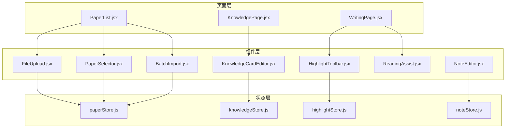
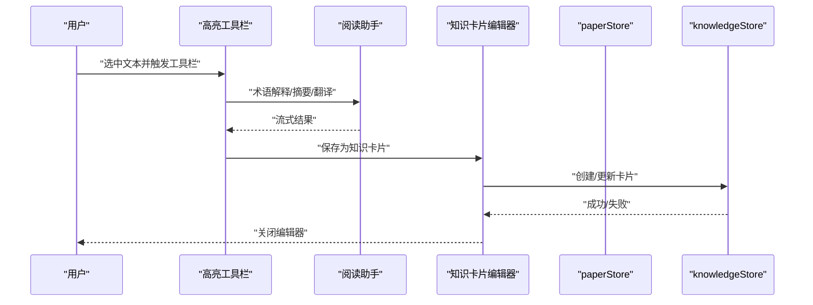
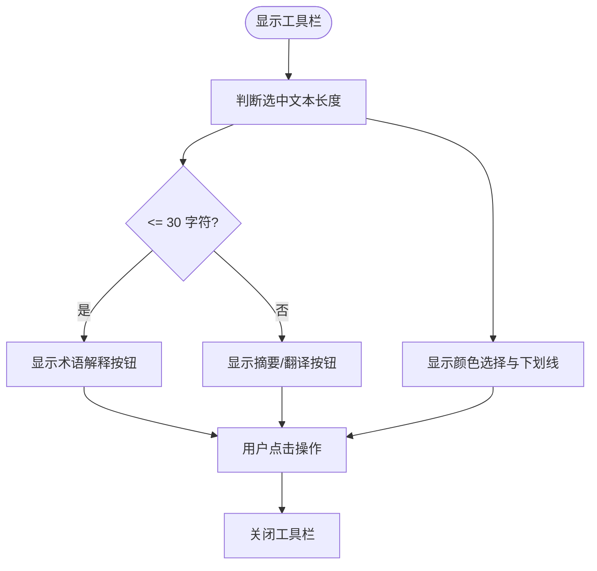
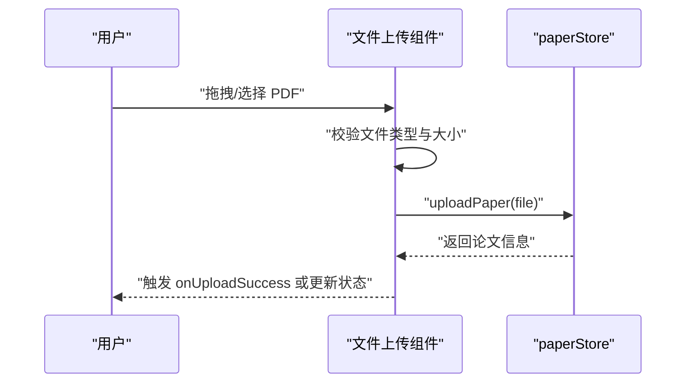
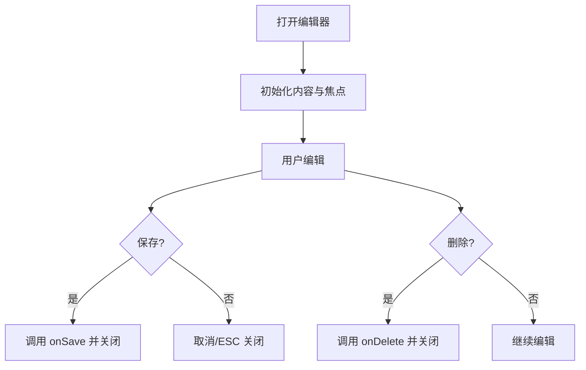
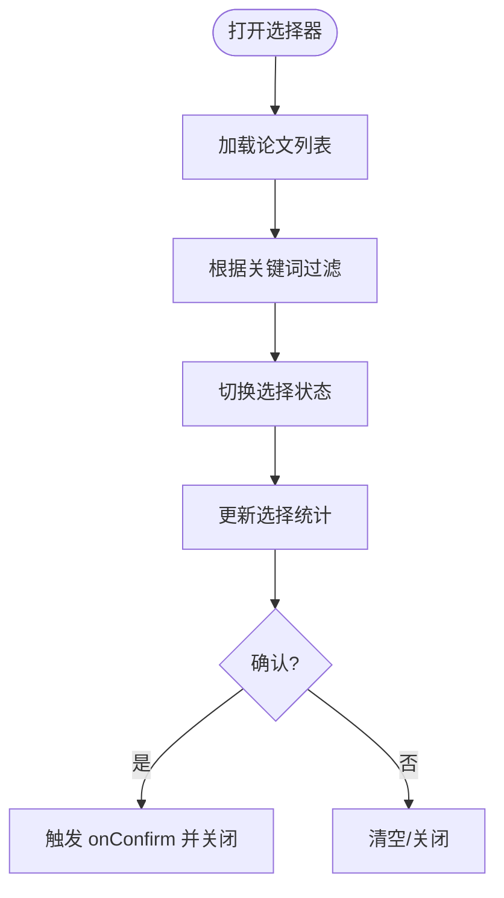
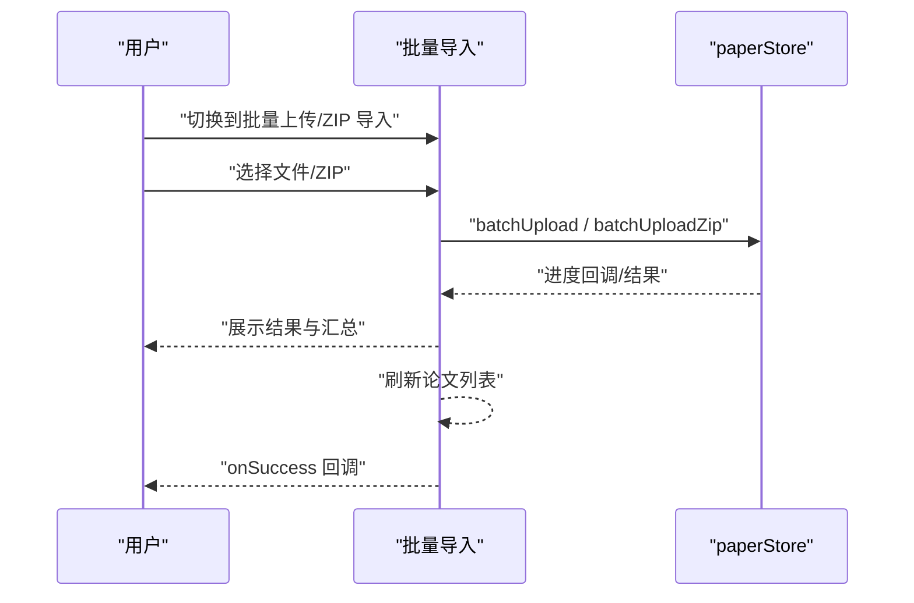
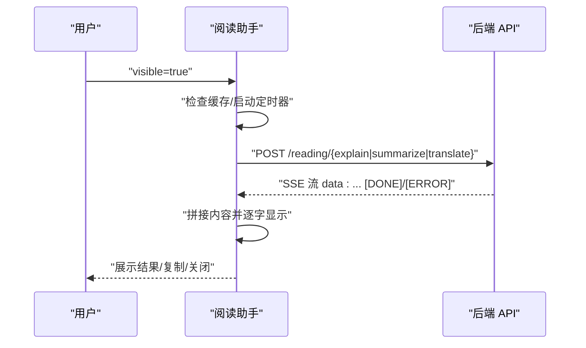
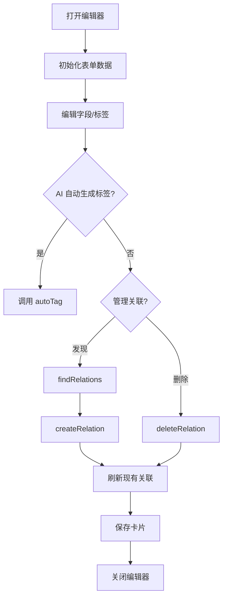
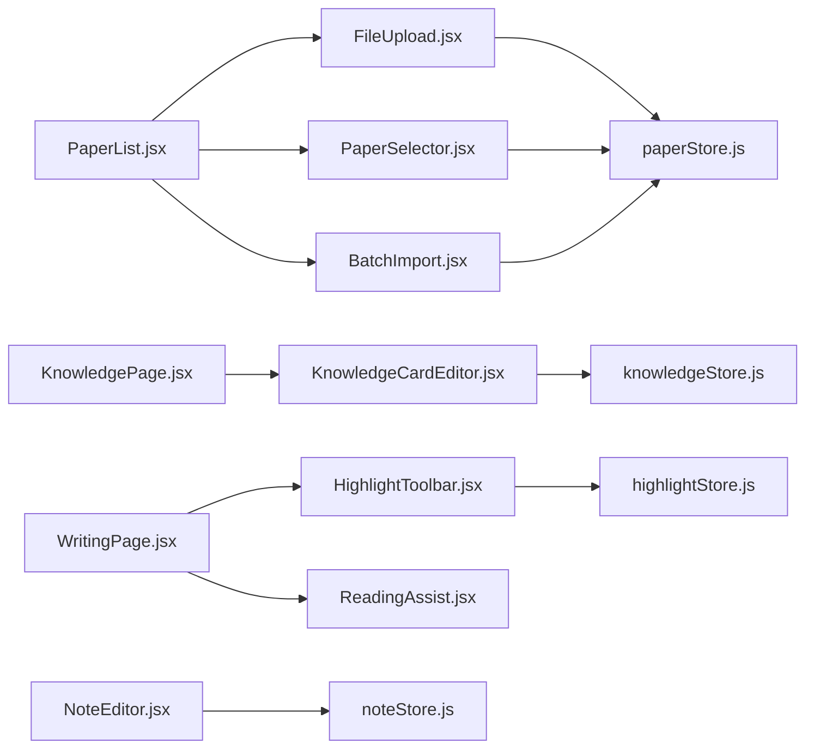

# 其他 UI 组件

<cite>
**本文档引用的文件**
- [HighlightToolbar.jsx](file://frontend/src/components/HighlightToolbar/HighlightToolbar.jsx)
- [FileUpload.jsx](file://frontend/src/components/FileUpload/FileUpload.jsx)
- [NoteEditor.jsx](file://frontend/src/components/NoteEditor/NoteEditor.jsx)
- [PaperSelector.jsx](file://frontend/src/components/PaperSelector/PaperSelector.jsx)
- [BatchImport.jsx](file://frontend/src/components/BatchImport/BatchImport.jsx)
- [ReadingAssist.jsx](file://frontend/src/components/ReadingAssist/ReadingAssist.jsx)
- [KnowledgeCardEditor.jsx](file://frontend/src/components/KnowledgeCardEditor/KnowledgeCardEditor.jsx)
- [paperStore.js](file://frontend/src/stores/paperStore.js)
- [knowledgeStore.js](file://frontend/src/stores/knowledgeStore.js)
- [highlightStore.js](file://frontend/src/stores/highlightStore.js)
- [noteStore.js](file://frontend/src/stores/noteStore.js)
- [WritingPage.jsx](file://frontend/src/pages/WritingPage.jsx)
- [KnowledgePage.jsx](file://frontend/src/pages/KnowledgePage.jsx)
- [PaperList.jsx](file://frontend/src/pages/PaperList.jsx)
</cite>

## 目录
1. [简介](#简介)
2. [项目结构](#项目结构)
3. [核心组件](#核心组件)
4. [架构总览](#架构总览)
5. [详细组件分析](#详细组件分析)
6. [依赖分析](#依赖分析)
7. [性能考量](#性能考量)
8. [故障排查指南](#故障排查指南)
9. [结论](#结论)
10. [附录](#附录)

## 简介
本文件面向“其他 UI 组件”的技术文档，重点覆盖以下组件的设计与实现：高亮工具栏、文件上传、笔记编辑器、论文选择器、批量导入、阅读助手与知识卡片编辑器。文档从系统架构、组件职责、状态管理、用户交互、数据流、事件处理、可复用性与扩展性、性能优化、测试策略与调试方法等方面进行深入剖析，并给出可视化图示帮助理解。

## 项目结构
前端采用组件化与状态分离架构：
- 组件层：独立的 UI 组件，负责渲染与用户交互
- 存储层：基于 Zustand 的状态管理，封装 API 调用与本地状态
- 页面层：组合组件与存储，编排业务流程

图表来源
- [WritingPage.jsx](file://frontend/src/pages/WritingPage.jsx)
- [KnowledgePage.jsx](file://frontend/src/pages/KnowledgePage.jsx)
- [PaperList.jsx](file://frontend/src/pages/PaperList.jsx)
- [HighlightToolbar.jsx](file://frontend/src/components/HighlightToolbar/HighlightToolbar.jsx)
- [FileUpload.jsx](file://frontend/src/components/FileUpload/FileUpload.jsx)
- [NoteEditor.jsx](file://frontend/src/components/NoteEditor/NoteEditor.jsx)
- [PaperSelector.jsx](file://frontend/src/components/PaperSelector/PaperSelector.jsx)
- [BatchImport.jsx](file://frontend/src/components/BatchImport/BatchImport.jsx)
- [ReadingAssist.jsx](file://frontend/src/components/ReadingAssist/ReadingAssist.jsx)
- [KnowledgeCardEditor.jsx](file://frontend/src/components/KnowledgeCardEditor/KnowledgeCardEditor.jsx)
- [paperStore.js](file://frontend/src/stores/paperStore.js)
- [knowledgeStore.js](file://frontend/src/stores/knowledgeStore.js)
- [highlightStore.js](file://frontend/src/stores/highlightStore.js)
- [noteStore.js](file://frontend/src/stores/noteStore.js)

章节来源
- [WritingPage.jsx](file://frontend/src/pages/WritingPage.jsx)
- [KnowledgePage.jsx](file://frontend/src/pages/KnowledgePage.jsx)
- [PaperList.jsx](file://frontend/src/pages/PaperList.jsx)

## 核心组件
- 高亮工具栏：在 PDF 阅读场景中，当用户选中文本时弹出，提供高亮、下划线、添加笔记、术语解释、摘要生成、翻译、保存为知识卡片等操作入口。
- 文件上传：支持单文件拖拽上传，带进度条与错误提示，集成论文存储状态。
- 笔记编辑器：弹窗式编辑器，支持保存、删除、快捷键、外部点击关闭、高亮文本预览。
- 论文选择器：多选论文弹窗，支持搜索、全选、清空、最大选择数限制、状态徽标展示。
- 批量导入：支持多文件批量上传与 ZIP 包导入，分别展示进度与结果汇总。
- 阅读助手：术语解释、摘要、翻译的流式展示面板，支持逐字打字机效果、复制、边界定位与外部点击关闭。
- 知识卡片编辑器：知识卡片的创建与编辑，支持来源类型、标签、分类、重要性、AI 自动生成标签、发现与管理关联关系。

章节来源
- [HighlightToolbar.jsx](file://frontend/src/components/HighlightToolbar/HighlightToolbar.jsx)
- [FileUpload.jsx](file://frontend/src/components/FileUpload/FileUpload.jsx)
- [NoteEditor.jsx](file://frontend/src/components/NoteEditor/NoteEditor.jsx)
- [PaperSelector.jsx](file://frontend/src/components/PaperSelector/PaperSelector.jsx)
- [BatchImport.jsx](file://frontend/src/components/BatchImport/BatchImport.jsx)
- [ReadingAssist.jsx](file://frontend/src/components/ReadingAssist/ReadingAssist.jsx)
- [KnowledgeCardEditor.jsx](file://frontend/src/components/KnowledgeCardEditor/KnowledgeCardEditor.jsx)

## 架构总览
组件间协作遵循“页面编排 + 组件交互 + 状态驱动 + API 通信”的模式：
- 页面层通过 props 与回调控制组件行为，如位置、可见性、数据与动作。
- 组件通过存储层访问全局状态与 API，实现数据持久化与跨组件共享。
- 事件流：用户交互 → 组件内部状态/回调 → 存储层 API 调用 → 状态更新 → 视图刷新。

图表来源
- [HighlightToolbar.jsx](file://frontend/src/components/HighlightToolbar/HighlightToolbar.jsx)
- [ReadingAssist.jsx](file://frontend/src/components/ReadingAssist/ReadingAssist.jsx)
- [KnowledgeCardEditor.jsx](file://frontend/src/components/KnowledgeCardEditor/KnowledgeCardEditor.jsx)
- [paperStore.js](file://frontend/src/stores/paperStore.js)
- [knowledgeStore.js](file://frontend/src/stores/knowledgeStore.js)

## 详细组件分析

### 高亮工具栏（HighlightToolbar）
- 功能特性
  - 根据选中文本长度动态显示不同操作按钮（术语解释、摘要生成、翻译等）。
  - 支持多种高亮颜色与下划线样式。
  - 自适应定位，避免超出视口。
  - 点击外部自动关闭。
- 接口设计
  - 属性：position、selectedText、visible；回调：onCreateHighlight、onAddNote、onExplain、onSummarize、onTranslate、onSaveToKnowledge、onClose。
- 状态管理
  - 使用本地 DOM 事件监听与定时器延迟绑定，避免误触。
  - 位置计算包含边界检测，保证工具栏始终可见。
- 用户交互
  - 点击颜色按钮创建高亮；点击“保存为知识卡片”触发知识卡片编辑器；点击“添加笔记”打开笔记编辑器。
- 可复用性与扩展
  - 可作为通用“上下文菜单”组件抽象，通过传入 actions 数组扩展更多操作。
  - 建议引入主题配置与无障碍属性。

图表来源
- [HighlightToolbar.jsx](file://frontend/src/components/HighlightToolbar/HighlightToolbar.jsx)

章节来源
- [HighlightToolbar.jsx](file://frontend/src/components/HighlightToolbar/HighlightToolbar.jsx)

### 文件上传（FileUpload）
- 功能特性
  - 基于 react-dropzone 的拖拽上传，支持单文件、PDF 校验、大小限制。
  - 上传进度条与错误提示，支持新旧两种回调模式（onFileSelect 与 onUploadSuccess）。
- 接口设计
  - 属性：onFileSelect、onUploadSuccess；内部状态：uploading、uploadProgress、error。
- 数据流
  - onDrop → 调用 paperStore.uploadPaper → 更新列表与状态 → 触发回调。
- 性能与健壮性
  - 上传中禁用 dropzone，防止重复提交。
  - 错误信息从响应体提取，增强可读性。

图表来源
- [FileUpload.jsx](file://frontend/src/components/FileUpload/FileUpload.jsx)
- [paperStore.js](file://frontend/src/stores/paperStore.js)

章节来源
- [FileUpload.jsx](file://frontend/src/components/FileUpload/FileUpload.jsx)
- [paperStore.js](file://frontend/src/stores/paperStore.js)

### 笔记编辑器（NoteEditor）
- 功能特性
  - 弹窗式编辑器，支持高亮文本预览、快捷键保存、外部点击与 ESC 关闭。
  - 支持新建与编辑两种模式，编辑模式自动定位光标至末尾。
- 接口设计
  - 属性：isOpen、onClose、onSave、onDelete、initialContent、highlightText、isEditing。
- 状态管理
  - 内部维护 content、isSaving；外部通过 props 控制打开/关闭与初始值。
- 交互细节
  - Ctrl/Cmd + Enter 保存；点击遮罩层与 ESC 关闭；删除前二次确认。

图表来源
- [NoteEditor.jsx](file://frontend/src/components/NoteEditor/NoteEditor.jsx)

章节来源
- [NoteEditor.jsx](file://frontend/src/components/NoteEditor/NoteEditor.jsx)

### 论文选择器（PaperSelector）
- 功能特性
  - 多选弹窗，支持搜索、全选、清空、最大选择数限制与状态徽标。
  - 加载状态、空状态与过滤逻辑。
- 接口设计
  - 属性：isOpen、onClose、onConfirm、initialSelectedIds、maxSelection、minSelection。
- 状态管理
  - 内部维护 selectedIds、searchQuery；与 store 的 papers 同步。
- 交互细节
  - 点击遮罩层取消；确认时触发 onConfirm 并关闭；支持键盘清除搜索。

图表来源
- [PaperSelector.jsx](file://frontend/src/components/PaperSelector/PaperSelector.jsx)

章节来源
- [PaperSelector.jsx](file://frontend/src/components/PaperSelector/PaperSelector.jsx)

### 批量导入（BatchImport）
- 功能特性
  - 两 Tab：批量上传（多文件）与 ZIP 导入。
  - 进度条、结果汇总（成功/失败计数与失败详情）、清空与移除操作。
- 接口设计
  - 属性：onClose、onSuccess；内部状态：activeTab、isUploading、uploadProgress、uploadResult。
- 数据流
  - 批量上传：收集 files → 调用 batchUpload → 刷新列表 → 触发 onSuccess。
  - ZIP 导入：选择 zip → 调用 batchUploadZip → 刷新列表 → 触发 onSuccess。
- 错误处理
  - 捕获异常并提示；失败详情列表展示具体文件与错误消息。

图表来源
- [BatchImport.jsx](file://frontend/src/components/BatchImport/BatchImport.jsx)
- [paperStore.js](file://frontend/src/stores/paperStore.js)

章节来源
- [BatchImport.jsx](file://frontend/src/components/BatchImport/BatchImport.jsx)
- [paperStore.js](file://frontend/src/stores/paperStore.js)

### 阅读助手（ReadingAssist）
- 功能特性
  - 术语解释、摘要、翻译三类面板，支持流式输出与逐字打字机效果。
  - 术语解释具备缓存；支持复制、外部点击关闭、边界定位。
- 接口设计
  - 属性：type、content、term、position、visible、onClose。
- 数据流
  - visible 为真时发起 fetchStreamResult，使用 AbortController 取消上一次请求。
  - 通过 SSE 流式读取，拼接数据并启动逐字显示。
- 性能与体验
  - 缓存术语解释结果；逐字显示降低感知延迟；边界检测避免面板溢出。

图表来源
- [ReadingAssist.jsx](file://frontend/src/components/ReadingAssist/ReadingAssist.jsx)

章节来源
- [ReadingAssist.jsx](file://frontend/src/components/ReadingAssist/ReadingAssist.jsx)

### 知识卡片编辑器（KnowledgeCardEditor）
- 功能特性
  - 标题、内容、摘要、标签、分类、来源类型、重要性、关联论文、AI 自动生成标签、发现与管理关联关系。
- 接口设计
  - 属性：card、onClose、isNew。
- 状态管理
  - 内部维护 formData、标签输入、发现的关联与现有关联；通过 knowledgeStore 与 highlightStore、paperStore 协作。
- 关联管理
  - 发现关联：findRelations → 展示候选 → 添加关联 createRelation → 刷新现有关联。
  - 删除关联：deleteRelation → 重新加载。
- 可复用性
  - 可抽取为通用“实体编辑器”，通过 schema 定义字段与校验规则。

图表来源
- [KnowledgeCardEditor.jsx](file://frontend/src/components/KnowledgeCardEditor/KnowledgeCardEditor.jsx)
- [knowledgeStore.js](file://frontend/src/stores/knowledgeStore.js)
- [paperStore.js](file://frontend/src/stores/paperStore.js)

章节来源
- [KnowledgeCardEditor.jsx](file://frontend/src/components/KnowledgeCardEditor/KnowledgeCardEditor.jsx)
- [knowledgeStore.js](file://frontend/src/stores/knowledgeStore.js)
- [paperStore.js](file://frontend/src/stores/paperStore.js)

## 依赖分析
- 组件到存储
  - FileUpload、PaperSelector、BatchImport 依赖 paperStore（上传、批量上传、列表刷新）。
  - KnowledgeCardEditor 依赖 knowledgeStore（创建/更新卡片、发现/管理关联、自动生成标签）。
  - NoteEditor 依赖 noteStore（增删改查笔记）。
  - HighlightToolbar 依赖 highlightStore（高亮 CRUD）。
- 页面到组件
  - PaperList 展示论文列表并承载 FileUpload、PaperSelector、BatchImport。
  - KnowledgePage 承载 KnowledgeCardEditor。
  - WritingPage 承载 HighlightToolbar 与 ReadingAssist（在写作页中使用）。

图表来源
- [PaperList.jsx](file://frontend/src/pages/PaperList.jsx)
- [KnowledgePage.jsx](file://frontend/src/pages/KnowledgePage.jsx)
- [WritingPage.jsx](file://frontend/src/pages/WritingPage.jsx)
- [FileUpload.jsx](file://frontend/src/components/FileUpload/FileUpload.jsx)
- [PaperSelector.jsx](file://frontend/src/components/PaperSelector/PaperSelector.jsx)
- [BatchImport.jsx](file://frontend/src/components/BatchImport/BatchImport.jsx)
- [KnowledgeCardEditor.jsx](file://frontend/src/components/KnowledgeCardEditor/KnowledgeCardEditor.jsx)
- [HighlightToolbar.jsx](file://frontend/src/components/HighlightToolbar/HighlightToolbar.jsx)
- [ReadingAssist.jsx](file://frontend/src/components/ReadingAssist/ReadingAssist.jsx)
- [paperStore.js](file://frontend/src/stores/paperStore.js)
- [knowledgeStore.js](file://frontend/src/stores/knowledgeStore.js)
- [highlightStore.js](file://frontend/src/stores/highlightStore.js)
- [noteStore.js](file://frontend/src/stores/noteStore.js)

章节来源
- [PaperList.jsx](file://frontend/src/pages/PaperList.jsx)
- [KnowledgePage.jsx](file://frontend/src/pages/KnowledgePage.jsx)
- [WritingPage.jsx](file://frontend/src/pages/WritingPage.jsx)

## 性能考量
- 组件级
  - 高亮工具栏与阅读助手使用边界检测与最小 DOM 更新，避免布局抖动。
  - 批量导入与文件上传使用 AbortController 取消上一请求，减少资源浪费。
  - 知识卡片编辑器对标签输入使用防抖与去重，降低渲染压力。
- 状态层
  - Zustand store 将网络请求与本地状态解耦，避免不必要的重渲染。
  - 分页与筛选参数集中管理，减少重复请求。
- 网络层
  - SSE 流式读取与逐字显示，提升感知性能；术语解释缓存减少重复请求。
- 可选优化
  - 将高频组件使用 React.memo 或 useMemo 包裹。
  - 对长列表使用虚拟滚动（如后续扩展）。

## 故障排查指南
- 上传失败
  - 检查文件类型与大小限制；查看错误提示；确认 token 与后端连通性。
  - 参考路径：[FileUpload.jsx](file://frontend/src/components/FileUpload/FileUpload.jsx)、[paperStore.js](file://frontend/src/stores/paperStore.js)
- 批量导入异常
  - 查看失败详情列表；确认 ZIP 结构与文件数量；关注进度回调与最终结果。
  - 参考路径：[BatchImport.jsx](file://frontend/src/components/BatchImport/BatchImport.jsx)
- 阅读助手无输出
  - 确认 visible 为真；检查网络请求与 SSE 流；查看错误提示与缓存命中情况。
  - 参考路径：[ReadingAssist.jsx](file://frontend/src/components/ReadingAssist/ReadingAssist.jsx)
- 知识卡片保存失败
  - 校验必填字段；查看 store 错误状态；确认关联关系 ID 有效性。
  - 参考路径：[KnowledgeCardEditor.jsx](file://frontend/src/components/KnowledgeCardEditor/KnowledgeCardEditor.jsx)、[knowledgeStore.js](file://frontend/src/stores/knowledgeStore.js)
- 笔记编辑器无法关闭
  - 检查外部点击与 ESC 事件绑定；确认 isSaving 状态未阻塞关闭。
  - 参考路径：[NoteEditor.jsx](file://frontend/src/components/NoteEditor/NoteEditor.jsx)

章节来源
- [FileUpload.jsx](file://frontend/src/components/FileUpload/FileUpload.jsx)
- [BatchImport.jsx](file://frontend/src/components/BatchImport/BatchImport.jsx)
- [ReadingAssist.jsx](file://frontend/src/components/ReadingAssist/ReadingAssist.jsx)
- [KnowledgeCardEditor.jsx](file://frontend/src/components/KnowledgeCardEditor/KnowledgeCardEditor.jsx)
- [NoteEditor.jsx](file://frontend/src/components/NoteEditor/NoteEditor.jsx)

## 结论
上述组件围绕“阅读—标注—整理—关联”的知识工作流构建，通过清晰的接口、完善的事件与状态管理、以及合理的错误处理与性能优化，实现了良好的用户体验与可维护性。建议在后续迭代中进一步抽象通用组件、完善单元测试与 E2E 场景，并持续优化网络与渲染性能。

## 附录
- 测试策略建议
  - 单元测试：针对组件的 props、回调与内部状态进行断言；对异步流程使用 fake timers 与 mock store。
  - 集成测试：模拟用户交互（拖拽、点击、键盘事件）验证组件协作与状态变更。
  - 端到端测试：覆盖上传、高亮、笔记、知识卡片与关联管理的完整流程。
- 调试方法
  - 使用浏览器开发者工具观察组件树与状态变化；利用 React DevTools Profiler 分析渲染热点。
  - 在 store 中打印关键 API 请求与响应，定位网络问题。
- 最佳实践
  - 组件保持纯函数式与无副作用；通过 props 与回调解耦。
  - 将可变状态收敛到 store，避免跨组件的重复状态。
  - 对耗时操作提供明确的加载态与错误提示，保障可恢复性。