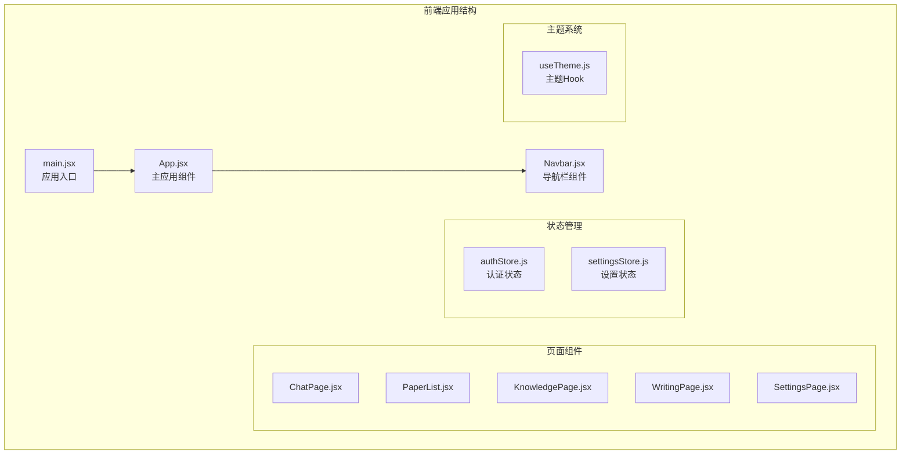
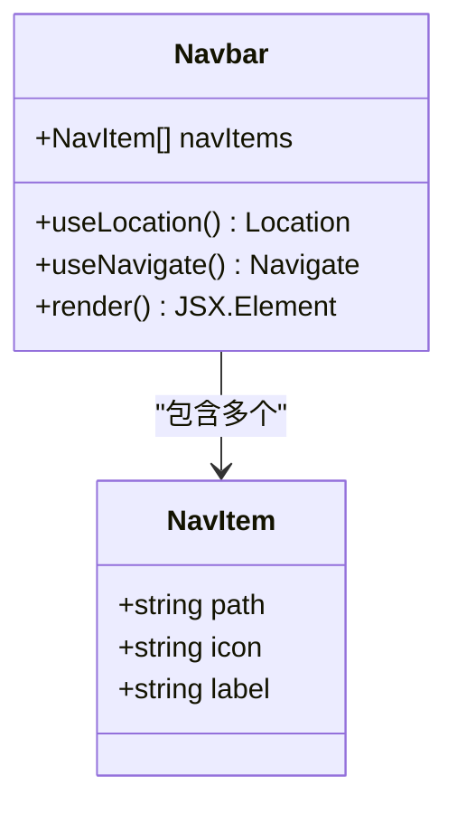
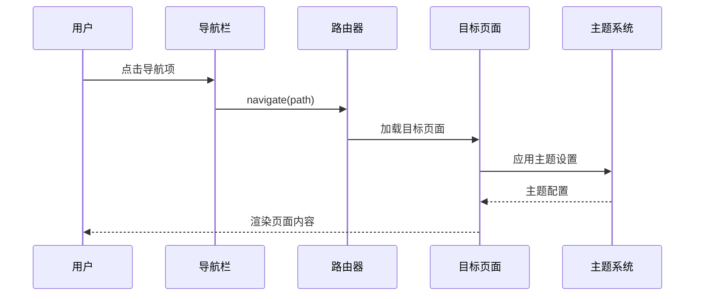
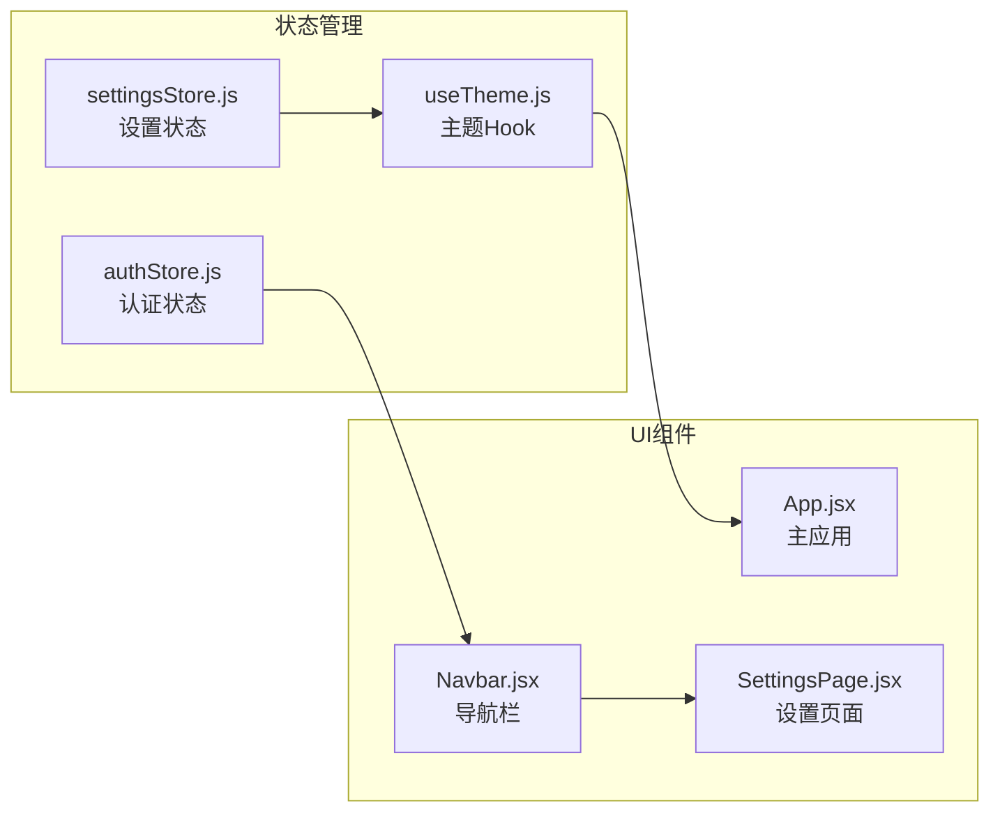
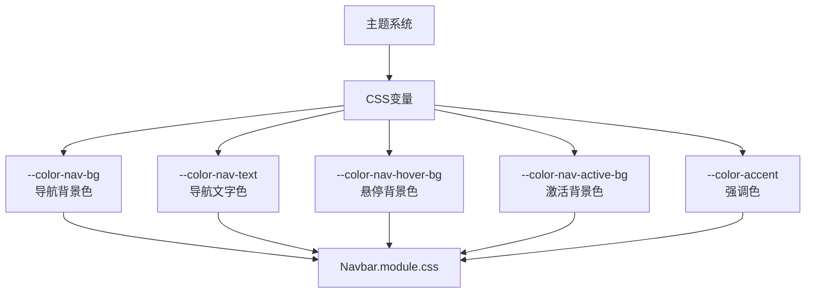
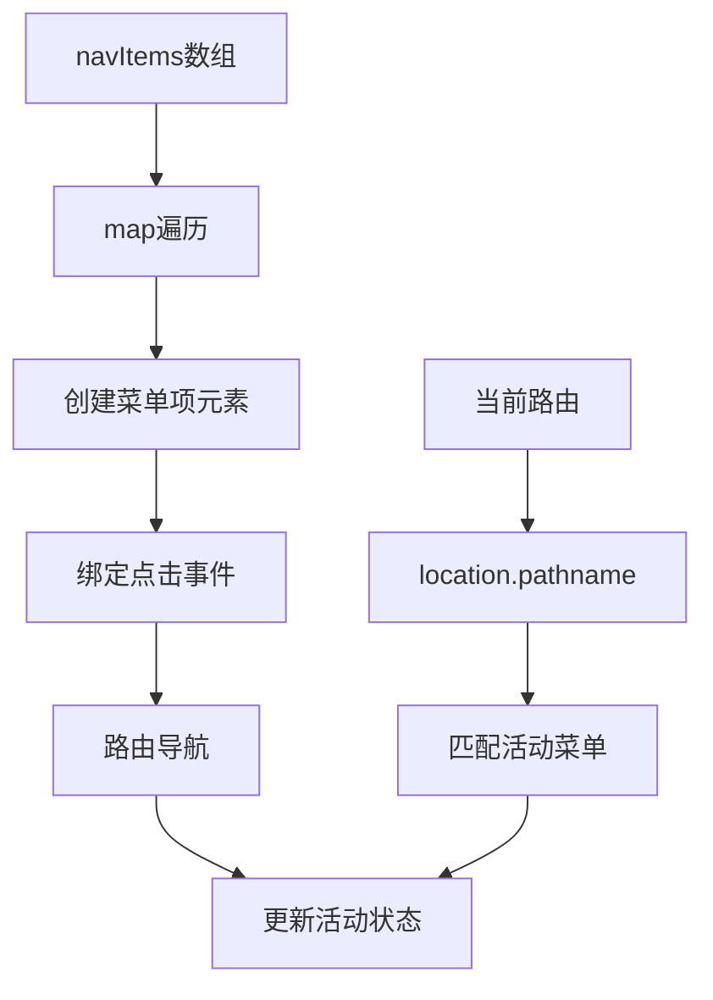
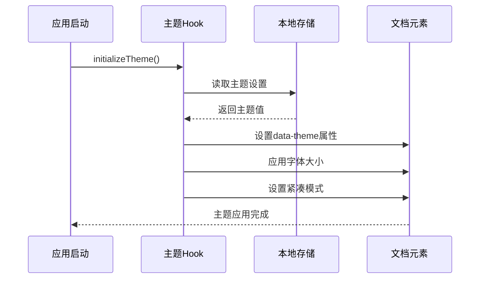
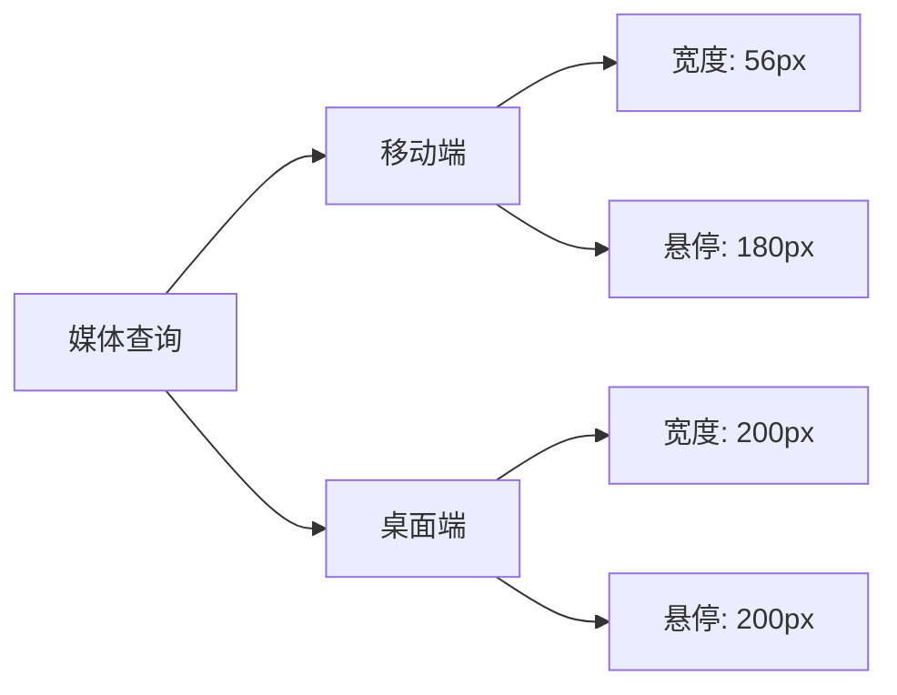
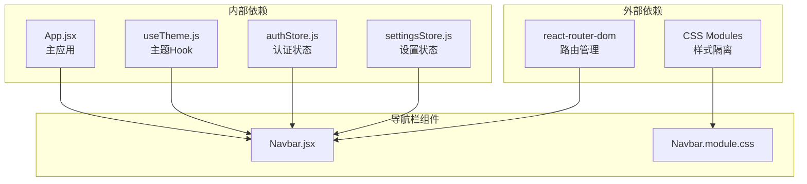
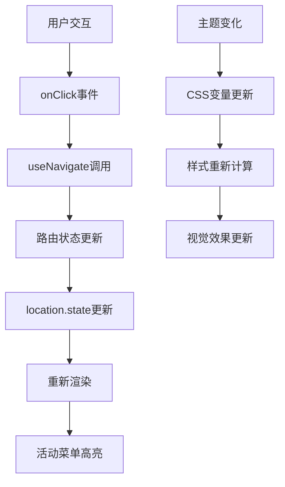

# 导航栏组件

<cite>
**本文档引用的文件**
- [Navbar.jsx](file://frontend/src/components/Navbar/Navbar.jsx)
- [Navbar.module.css](file://frontend/src/components/Navbar/Navbar.module.css)
- [App.jsx](file://frontend/src/App.jsx)
- [useTheme.js](file://frontend/src/hooks/useTheme.js)
- [authStore.js](file://frontend/src/stores/authStore.js)
- [settingsStore.js](file://frontend/src/stores/settingsStore.js)
- [SettingsPage.jsx](file://frontend/src/pages/SettingsPage.jsx)
- [ChatPage.jsx](file://frontend/src/pages/ChatPage.jsx)
- [PaperList.jsx](file://frontend/src/pages/PaperList.jsx)
- [KnowledgePage.jsx](file://frontend/src/pages/KnowledgePage.jsx)
- [WritingPage.jsx](file://frontend/src/pages/WritingPage.jsx)
- [main.jsx](file://frontend/src/main.jsx)
</cite>

## 目录
1. [简介](#简介)
2. [项目结构](#项目结构)
3. [核心组件](#核心组件)
4. [架构概览](#架构概览)
5. [详细组件分析](#详细组件分析)
6. [依赖关系分析](#依赖关系分析)
7. [性能考虑](#性能考虑)
8. [故障排除指南](#故障排除指南)
9. [结论](#结论)

## 简介

导航栏组件是 PaperChat 应用程序的核心界面元素，采用侧边导航栏设计，提供学术书架风格的用户界面。该组件实现了现代化的导航功能，包括动态菜单、主题切换、响应式布局和用户状态管理。

导航栏采用固定定位设计，初始宽度为 64px，在悬停时扩展到 200px，展示完整的菜单标签和用户信息。组件支持多种导航场景，包括聊天、论文库、知识库、写作辅助等核心功能模块。

## 项目结构

导航栏组件位于前端项目的组件目录中，与应用程序的主要入口点紧密集成：



**图表来源**
- [main.jsx:1-14](file://frontend/src/main.jsx#L1-L14)
- [App.jsx:1-32](file://frontend/src/App.jsx#L1-L32)

**章节来源**
- [main.jsx:1-14](file://frontend/src/main.jsx#L1-L14)
- [App.jsx:1-32](file://frontend/src/App.jsx#L1-L32)

## 核心组件

### 导航栏组件架构

导航栏组件采用简洁而高效的架构设计，主要包含以下核心功能：

- **静态菜单配置**：通过常量数组定义导航项，包含路径、图标和标签
- **路由集成**：使用 React Router 进行页面导航
- **状态管理**：基于当前路由状态显示活动菜单项
- **主题适配**：与全局主题系统无缝集成
- **响应式设计**：支持桌面和移动设备的不同显示模式

### 菜单项配置

导航栏包含固定的导航项配置，每个菜单项都包含以下属性：
- `path`: 路由路径
- `icon`: Unicode 图标字符
- `label`: 显示标签



**图表来源**
- [Navbar.jsx:4-9](file://frontend/src/components/Navbar/Navbar.jsx#L4-L9)

**章节来源**
- [Navbar.jsx:4-9](file://frontend/src/components/Navbar/Navbar.jsx#L4-L9)

## 架构概览

导航栏组件在整个应用程序架构中扮演着关键角色，作为统一的导航入口点：



**图表来源**
- [Navbar.jsx:11-51](file://frontend/src/components/Navbar/Navbar.jsx#L11-L51)
- [App.jsx:10-13](file://frontend/src/App.jsx#L10-L13)

### 状态管理集成

导航栏与应用程序的状态管理系统深度集成：



**图表来源**
- [authStore.js:1-23](file://frontend/src/stores/authStore.js#L1-L23)
- [settingsStore.js:1-131](file://frontend/src/stores/settingsStore.js#L1-L131)
- [useTheme.js:1-91](file://frontend/src/hooks/useTheme.js#L1-L91)

**章节来源**
- [authStore.js:1-23](file://frontend/src/stores/authStore.js#L1-L23)
- [settingsStore.js:1-131](file://frontend/src/stores/settingsStore.js#L1-L131)
- [useTheme.js:1-91](file://frontend/src/hooks/useTheme.js#L1-L91)

## 详细组件分析

### 导航栏样式系统

导航栏采用模块化的CSS架构，支持完整的主题定制：

#### 核心样式特性

- **固定定位布局**：使用 `position: fixed` 实现侧边导航栏效果
- **过渡动画**：宽度变化采用 0.3 秒的缓动曲线
- **悬停扩展**：鼠标悬停时自动扩展显示完整内容
- **响应式适配**：针对不同屏幕尺寸的优化

#### 主题变量系统

导航栏使用 CSS 自定义属性实现主题化：



**图表来源**
- [Navbar.module.css:1-16](file://frontend/src/components/Navbar/Navbar.module.css#L1-L16)

#### 动画和交互效果

导航栏实现了多层次的动画效果：

- **宽度过渡**：从 64px 到 200px 的平滑过渡
- **透明度变化**：标签和文本的渐显渐隐效果
- **悬停反馈**：颜色和样式的即时变化
- **滚动条定制**：自定义的滚动条样式

**章节来源**
- [Navbar.module.css:1-251](file://frontend/src/components/Navbar/Navbar.module.css#L1-L251)

### 菜单项渲染机制

导航栏使用动态渲染机制生成菜单项：



**图表来源**
- [Navbar.jsx:22-34](file://frontend/src/components/Navbar/Navbar.jsx#L22-L34)
- [Navbar.jsx:11-51](file://frontend/src/components/Navbar/Navbar.jsx#L11-L51)

#### 用户界面元素

导航栏包含以下用户界面组件：

- **Logo区域**：包含图标和品牌名称
- **导航菜单**：动态生成的菜单项列表
- **用户区域**：设置入口和个人信息显示
- **注销按钮**：用户退出功能

**章节来源**
- [Navbar.jsx:15-49](file://frontend/src/components/Navbar/Navbar.jsx#L15-L49)

### 主题集成机制

导航栏与主题系统的集成采用了先进的技术架构：

#### 主题初始化流程



**图表来源**
- [useTheme.js:72-90](file://frontend/src/hooks/useTheme.js#L72-L90)

#### 主题持久化

主题设置通过本地存储实现持久化：

- **主题偏好**：存储在 `localStorage` 中
- **字体大小**：支持动态调整
- **紧凑模式**：影响整体布局密度

**章节来源**
- [useTheme.js:1-91](file://frontend/src/hooks/useTheme.js#L1-L91)

### 响应式设计实现

导航栏实现了完整的响应式设计，支持多种设备：

#### 移动端适配



**图表来源**
- [Navbar.module.css:216-251](file://frontend/src/components/Navbar/Navbar.module.css#L216-L251)

#### 响应式断点

- **768px 以下**：移动端优化布局
- **图标尺寸调整**：从 40px 缩小到 36px
- **间距优化**：减少内边距和外边距
- **文字省略**：超出长度的文本自动省略

**章节来源**
- [Navbar.module.css:216-251](file://frontend/src/components/Navbar/Navbar.module.css#L216-L251)

## 依赖关系分析

### 组件依赖图

导航栏组件的依赖关系相对简单但功能完整：



**图表来源**
- [Navbar.jsx:1-2](file://frontend/src/components/Navbar/Navbar.jsx#L1-L2)
- [App.jsx:10-13](file://frontend/src/App.jsx#L10-L13)

### 数据流分析

导航栏的数据流主要围绕路由状态和用户交互：



**图表来源**
- [Navbar.jsx:26-27](file://frontend/src/components/Navbar/Navbar.jsx#L26-L27)
- [Navbar.jsx:12-13](file://frontend/src/components/Navbar/Navbar.jsx#L12-L13)

**章节来源**
- [Navbar.jsx:1-54](file://frontend/src/components/Navbar/Navbar.jsx#L1-L54)

## 性能考虑

### 渲染优化策略

导航栏组件采用了多项性能优化措施：

#### 虚拟化和懒加载

- **菜单项虚拟化**：使用 `map` 方法动态生成，避免不必要的重渲染
- **样式模块化**：CSS Modules 提供局部作用域，减少样式冲突
- **条件渲染**：仅在悬停时显示完整标签，减少DOM元素数量

#### 内存管理

- **事件监听器**：使用 React Router 的 `useNavigate` 和 `useLocation` Hook
- **状态管理**：依赖全局状态管理，避免组件内部状态复杂化
- **生命周期**：组件卸载时自动清理事件监听器

### 主题性能优化

主题系统实现了高效的性能优化：

- **初始化优化**：应用启动时立即应用主题，避免闪烁
- **本地存储**：主题设置持久化，减少重复计算
- **批量更新**：主题变化时批量更新相关样式

**章节来源**
- [useTheme.js:72-90](file://frontend/src/hooks/useTheme.js#L72-L90)

## 故障排除指南

### 常见问题诊断

#### 导航失效问题

**症状**：点击菜单项无反应
**可能原因**：
- 路由配置错误
- `useNavigate` Hook 使用不当
- 路径拼写错误

**解决方案**：
1. 检查路由配置是否正确
2. 验证菜单项路径与路由定义一致
3. 确认 React Router 版本兼容性

#### 主题不生效问题

**症状**：主题切换后样式未更新
**可能原因**：
- CSS 变量未正确设置
- 本地存储访问失败
- 样式优先级问题

**解决方案**：
1. 检查浏览器开发者工具中的 CSS 变量
2. 验证 `localStorage` 访问权限
3. 确认样式文件加载顺序

#### 响应式布局问题

**症状**：移动端显示异常
**可能原因**：
- 媒体查询断点设置不当
- 样式优先级冲突
- 视口设置问题

**解决方案**：
1. 检查媒体查询语法
2. 验证断点值设置
3. 确认视口 meta 标签配置

**章节来源**
- [Navbar.module.css:216-251](file://frontend/src/components/Navbar/Navbar.module.css#L216-L251)

### 调试技巧

#### 开发者工具使用

1. **Elements 面板**：检查导航栏元素和样式
2. **Console 面板**：查看路由和状态变化日志
3. **Network 面板**：监控主题资源加载
4. **Performance 面板**：分析渲染性能

#### 日志记录

建议在开发环境中添加适当的日志记录：

```javascript
// 在导航栏组件中添加调试日志
console.log('Current path:', location.pathname);
console.log('Navigation item clicked:', item.path);
```

## 结论

导航栏组件展现了现代前端开发的最佳实践，通过精心设计的架构实现了功能完整性、性能优化和用户体验的平衡。

### 设计优势

- **简洁高效**：组件结构清晰，功能职责单一
- **主题友好**：完全支持主题系统，易于定制
- **响应式设计**：适应多种设备和屏幕尺寸
- **性能优化**：采用多项优化策略确保流畅体验

### 技术亮点

- **模块化架构**：CSS Modules 提供样式隔离
- **状态管理集成**：与全局状态系统无缝协作
- **动画流畅**：CSS 过渡和 JavaScript 动画结合
- **无障碍支持**：具备基本的键盘导航和屏幕阅读器支持

### 改进建议

未来可以考虑的功能增强：
- 添加菜单项动态加载
- 实现多级菜单支持
- 增加快捷键导航
- 优化触摸设备交互体验

导航栏组件为整个应用程序提供了稳定可靠的导航基础，其设计原则和实现模式值得在其他类似项目中借鉴和应用。