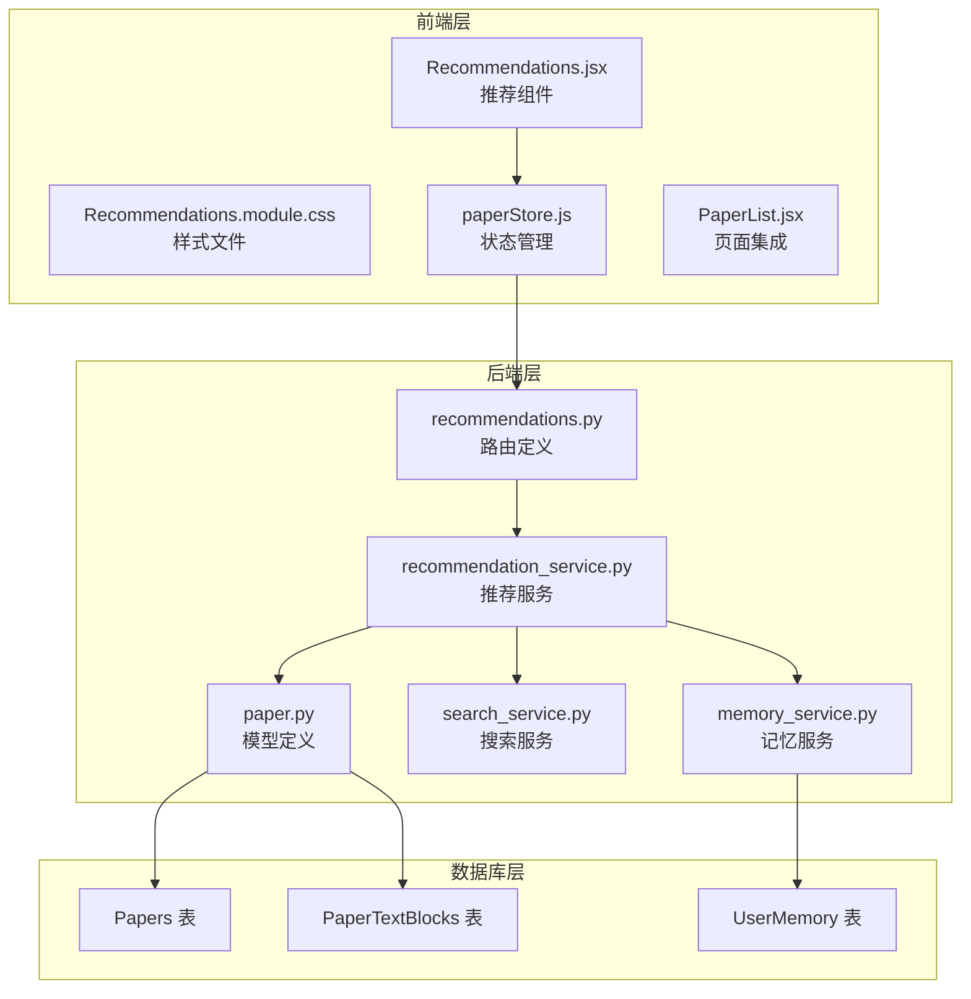
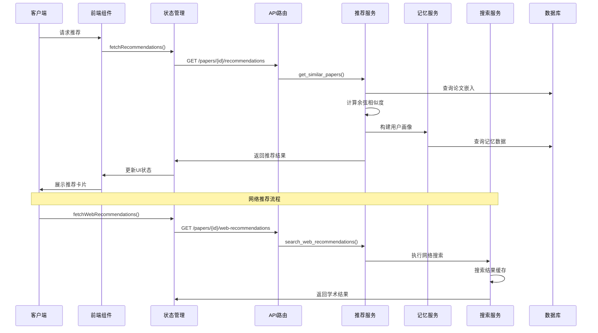
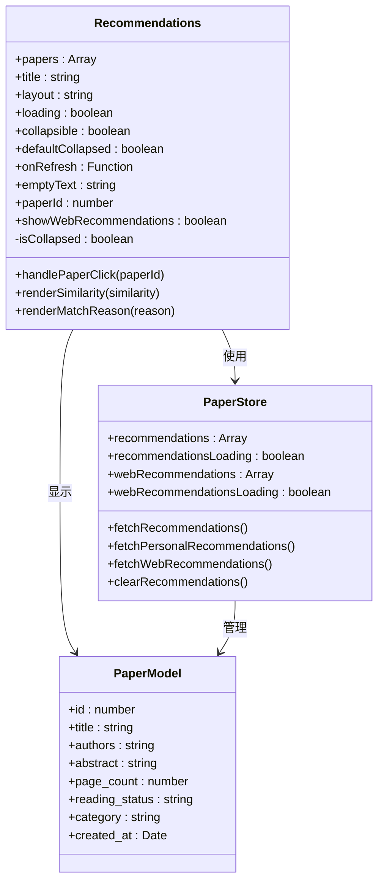
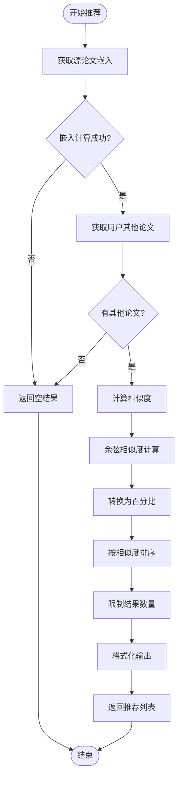
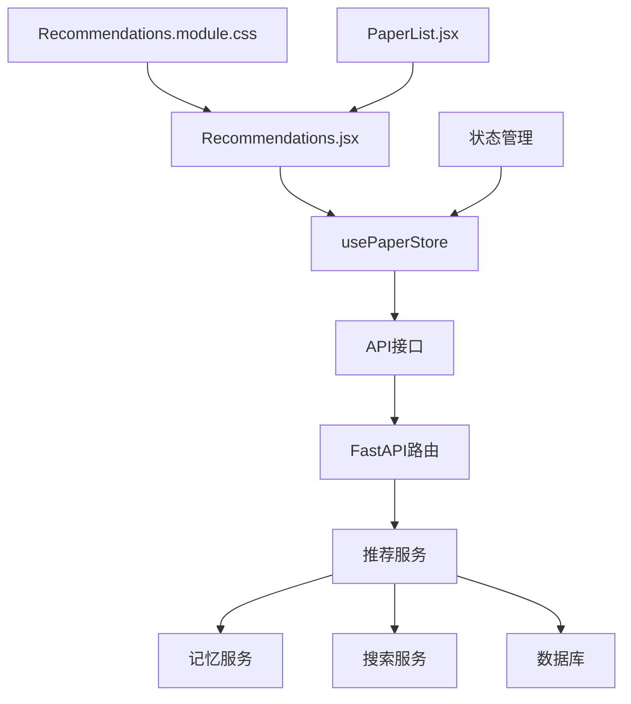
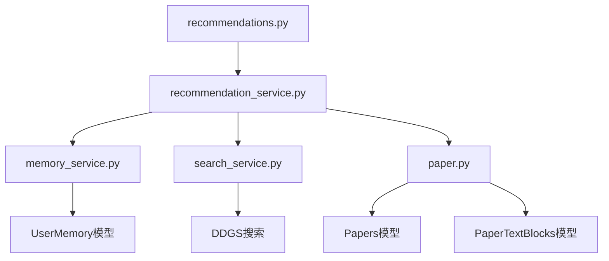
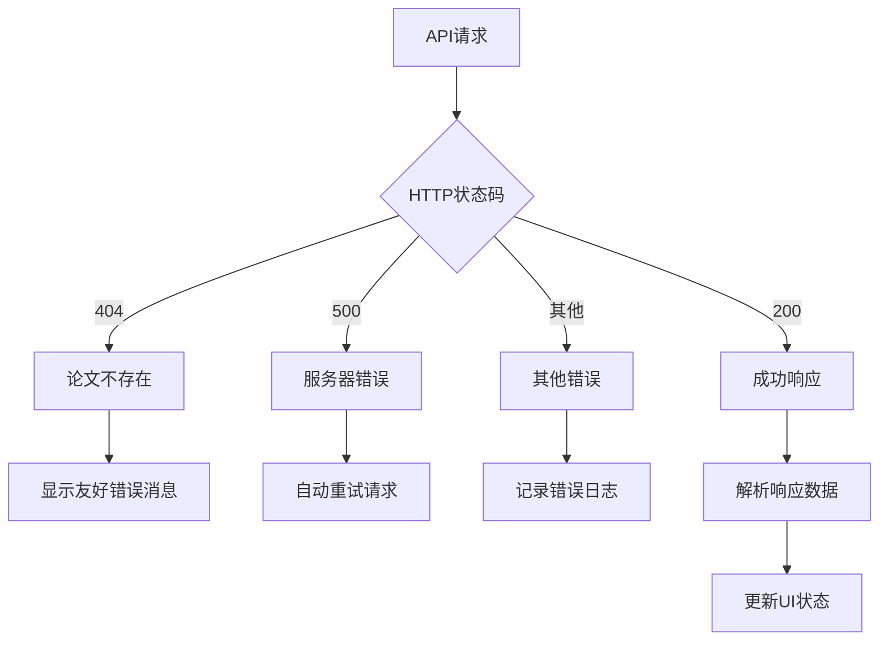

# 推荐组件

<cite>
**本文档引用的文件**
- [Recommendations.jsx](file://frontend/src/components/Recommendations/Recommendations.jsx)
- [Recommendations.module.css](file://frontend/src/components/Recommendations/Recommendations.module.css)
- [recommendations.py](file://backend/app/routers/recommendations.py)
- [recommendation_service.py](file://backend/app/services/recommendation_service.py)
- [paper.py](file://backend/app/models/paper.py)
- [paperStore.js](file://frontend/src/stores/paperStore.js)
- [memory_service.py](file://backend/app/services/memory_service.py)
- [search_service.py](file://backend/app/services/search_service.py)
- [PaperList.jsx](file://frontend/src/pages/PaperList.jsx)
</cite>

## 目录
1. [简介](#简介)
2. [项目结构](#项目结构)
3. [核心组件](#核心组件)
4. [架构概览](#架构概览)
5. [详细组件分析](#详细组件分析)
6. [依赖关系分析](#依赖关系分析)
7. [性能考虑](#性能考虑)
8. [故障排除指南](#故障排除指南)
9. [结论](#结论)

## 简介

推荐组件是 PaperChat 文献管理系统中的核心功能模块，负责为用户提供个性化的论文推荐体验。该组件集成了多种推荐算法，包括基于内容相似性的论文推荐、基于用户画像的个性化推荐，以及网络学术资源的扩展推荐功能。

推荐组件采用前后端分离的架构设计，前端使用 React 构建用户界面，后端基于 FastAPI 提供 RESTful API 接口。系统支持实时推荐、缓存优化、用户偏好设置和结果过滤等多种高级功能。

## 项目结构

推荐组件在项目中的组织结构如下：

**图表来源**
- [Recommendations.jsx:1-265](file://frontend/src/components/Recommendations/Recommendations.jsx#L1-L265)
- [recommendations.py:1-234](file://backend/app/routers/recommendations.py#L1-L234)

**章节来源**
- [Recommendations.jsx:1-265](file://frontend/src/components/Recommendations/Recommendations.jsx#L1-L265)
- [recommendations.py:1-234](file://backend/app/routers/recommendations.py#L1-L234)

## 核心组件

### 前端推荐组件

推荐组件的核心功能由 `Recommendations.jsx` 实现，提供了丰富的用户交互和视觉效果：

#### 主要特性
- **双布局模式**：支持垂直列表和水平滚动两种布局
- **动态加载状态**：优雅的加载动画和空状态处理
- **交互式卡片**：悬停效果、点击导航、折叠功能
- **相似度可视化**：颜色编码的相似度徽章
- **网络推荐集成**：可选的外部学术资源搜索

#### 关键属性
- `papers`: 推荐论文列表数据
- `title`: 组件标题，默认"相关推荐"
- `layout`: 布局模式，'horizontal' | 'vertical'
- `loading`: 加载状态标志
- `collapsible`: 是否支持折叠展开
- `defaultCollapsed`: 默认折叠状态
- `onRefresh`: 刷新回调函数
- `emptyText`: 空状态提示文本
- `paperId`: 当前论文ID（用于网络推荐）
- `showWebRecommendations`: 是否显示网络推荐区域

**章节来源**
- [Recommendations.jsx:13-39](file://frontend/src/components/Recommendations/Recommendations.jsx#L13-L39)

### 后端推荐服务

推荐服务位于 `recommendation_service.py`，实现了复杂的推荐算法逻辑：

#### 核心算法
- **余弦相似度计算**：基于论文嵌入向量的相似性分析
- **用户画像构建**：整合记忆服务生成个性化推荐
- **时间衰减机制**：考虑论文新鲜度的影响
- **阅读状态权重**：优先推荐未读论文

#### 缓存策略
- **嵌入向量缓存**：内存级缓存提升查询性能
- **搜索结果缓存**：网络搜索结果的短期缓存
- **配置动态更新**：运行时调整推荐参数

**章节来源**
- [recommendation_service.py:20-565](file://backend/app/services/recommendation_service.py#L20-L565)

## 架构概览

推荐系统的整体架构采用分层设计，确保了良好的可维护性和扩展性：

**图表来源**
- [recommendations.py:18-75](file://backend/app/routers/recommendations.py#L18-L75)
- [recommendation_service.py:150-258](file://backend/app/services/recommendation_service.py#L150-L258)
- [paperStore.js:206-223](file://frontend/src/stores/paperStore.js#L206-L223)

## 详细组件分析

### 前端组件架构

#### 组件结构图

**图表来源**
- [Recommendations.jsx:28-39](file://frontend/src/components/Recommendations/Recommendations.jsx#L28-L39)
- [paperStore.js:4-20](file://frontend/src/stores/paperStore.js#L4-L20)

#### 数据流分析

推荐组件的数据流遵循单向数据绑定原则：

1. **初始化阶段**：组件接收 props 参数
2. **状态管理**：通过 zustand store 管理推荐状态
3. **API调用**：异步获取推荐数据
4. **渲染更新**：根据数据状态更新UI
5. **用户交互**：处理点击、刷新、折叠等事件

**章节来源**
- [Recommendations.jsx:41-261](file://frontend/src/components/Recommendations/Recommendations.jsx#L41-L261)
- [paperStore.js:206-267](file://frontend/src/stores/paperStore.js#L206-L267)

### 推荐算法实现

#### 相似论文推荐算法

相似论文推荐基于论文嵌入向量的余弦相似度计算：

**图表来源**
- [recommendation_service.py:150-258](file://backend/app/services/recommendation_service.py#L150-L258)

#### 个性化推荐算法

个性化推荐结合用户画像和论文特征：

1. **用户画像构建**：从记忆服务获取研究兴趣、偏好等信息
2. **画像向量化**：将文本描述转换为嵌入向量
3. **相似度计算**：计算用户画像与论文的相似度
4. **权重应用**：应用阅读状态和时间衰减权重
5. **最终排序**：综合评分排序输出

**章节来源**
- [recommendation_service.py:259-399](file://backend/app/services/recommendation_service.py#L259-L399)

### 网络学术推荐

推荐组件还集成了网络学术资源搜索功能：

#### 搜索策略
- **学术搜索引擎**：使用 DuckDuckGo 进行学术搜索
- **结果过滤**：限定 arXiv、Google Scholar、ResearchGate 等学术网站
- **时间限制**：优先显示最近一年的学术文献
- **结果格式化**：统一不同来源的搜索结果格式

**章节来源**
- [recommendation_service.py:498-560](file://backend/app/services/recommendation_service.py#L498-L560)

## 依赖关系分析

### 前端依赖关系

**图表来源**
- [Recommendations.jsx:1-4](file://frontend/src/components/Recommendations/Recommendations.jsx#L1-L4)
- [paperStore.js:1-2](file://frontend/src/stores/paperStore.js#L1-L2)

### 后端依赖关系

**图表来源**
- [recommendations.py:13-13](file://backend/app/routers/recommendations.py#L13-L13)
- [recommendation_service.py:14-15](file://backend/app/services/recommendation_service.py#L14-L15)

**章节来源**
- [recommendations.py:1-234](file://backend/app/routers/recommendations.py#L1-L234)
- [recommendation_service.py:1-565](file://backend/app/services/recommendation_service.py#L1-L565)

## 性能考虑

### 前端性能优化

#### 渲染优化
- **虚拟滚动**：长列表使用虚拟滚动减少DOM节点
- **懒加载**：图片和内容按需加载
- **CSS动画**：使用硬件加速的CSS过渡效果
- **防抖处理**：搜索和筛选操作的防抖优化

#### 状态管理
- **局部状态**：仅管理组件必要的状态
- **缓存策略**：利用浏览器缓存减少请求
- **错误边界**：优雅处理渲染错误

### 后端性能优化

#### 缓存机制
- **嵌入向量缓存**：内存级缓存提升相似度计算速度
- **搜索结果缓存**：网络搜索结果的短期缓存
- **配置缓存**：运行时配置的快速访问

#### 并发处理
- **异步I/O**：使用异步数据库操作
- **线程池**：嵌入向量计算使用线程池
- **超时控制**：网络请求设置合理的超时时间

**章节来源**
- [Recommendations.module.css:87-103](file://frontend/src/components/Recommendations/Recommendations.module.css#L87-L103)
- [recommendation_service.py:29-43](file://backend/app/services/recommendation_service.py#L29-L43)
- [search_service.py:19-24](file://backend/app/services/search_service.py#L19-L24)

## 故障排除指南

### 常见问题及解决方案

#### 推荐结果为空
**可能原因**：
- 用户没有足够的论文数据
- 论文内容不足无法生成嵌入向量
- 网络搜索失败

**解决方法**：
- 建议用户上传更多论文
- 检查论文内容完整性
- 稍后重试网络搜索

#### 性能问题
**症状**：推荐加载缓慢

**诊断步骤**：
1. 检查嵌入向量缓存是否正常工作
2. 监控数据库查询性能
3. 查看网络请求响应时间

**优化建议**：
- 增加缓存容量
- 优化数据库索引
- 调整并发查询限制

#### API错误处理

**图表来源**
- [recommendations.py:57-61](file://backend/app/routers/recommendations.py#L57-L61)

**章节来源**
- [recommendations.py:57-61](file://backend/app/routers/recommendations.py#L57-L61)
- [paperStore.js:216-222](file://frontend/src/stores/paperStore.js#L216-L222)

## 结论

推荐组件作为 PaperChat 系统的核心功能模块，展现了现代推荐系统的设计理念和技术实现。通过前后端分离的架构设计、多算法融合的推荐策略、以及完善的性能优化措施，该组件为用户提供了高质量的个性化论文推荐体验。

### 技术亮点

1. **多算法融合**：结合内容相似度和用户画像的混合推荐
2. **实时交互**：支持动态刷新和用户反馈
3. **性能优化**：多层次缓存和异步处理机制
4. **可扩展性**：模块化设计便于功能扩展和算法升级

### 未来发展方向

- **深度学习集成**：引入更先进的嵌入模型
- **协同过滤**：基于用户行为的协同推荐
- **实时更新**：增量更新推荐结果
- **A/B测试**：多算法对比和优化

推荐组件不仅满足了当前的功能需求，更为未来的功能扩展奠定了坚实的技术基础。