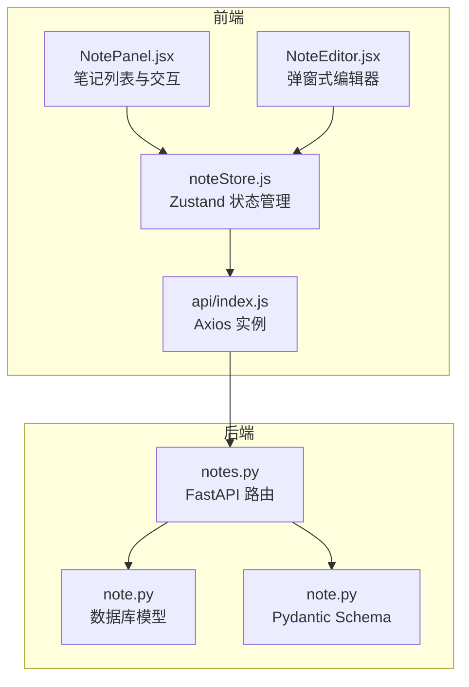
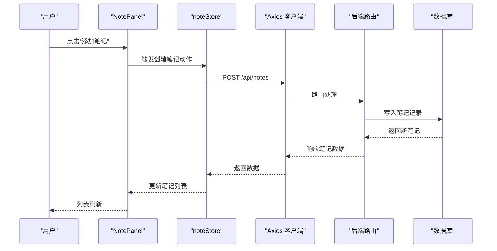
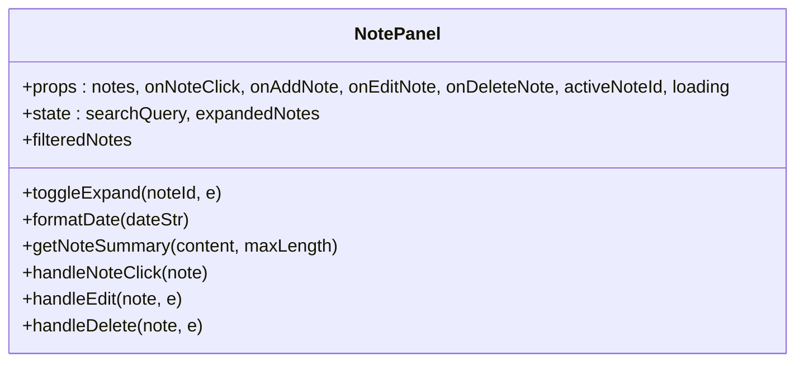
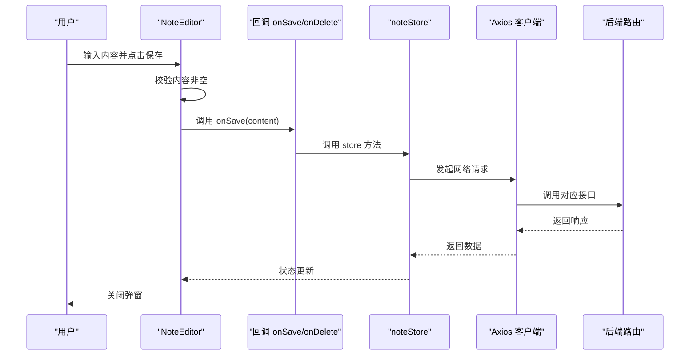
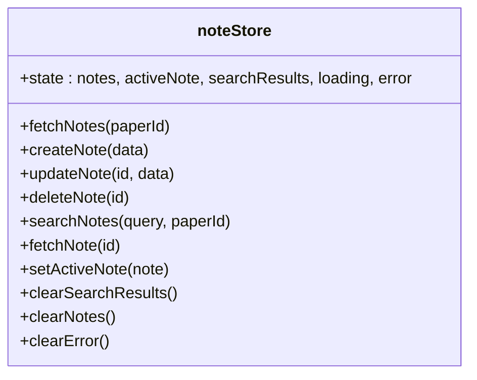
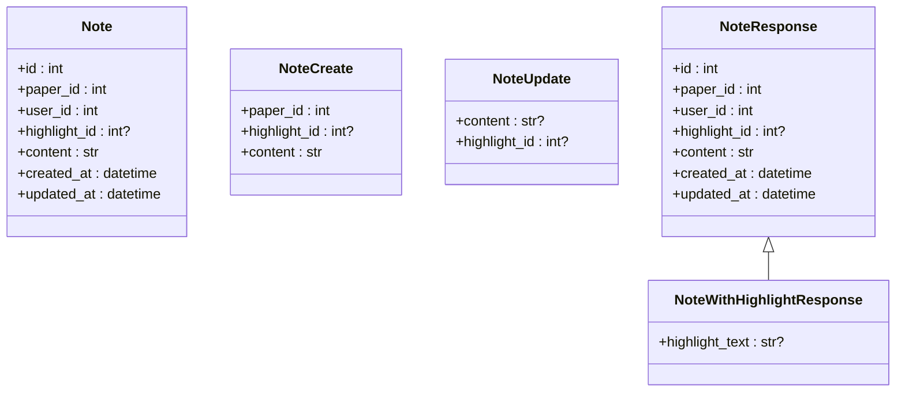
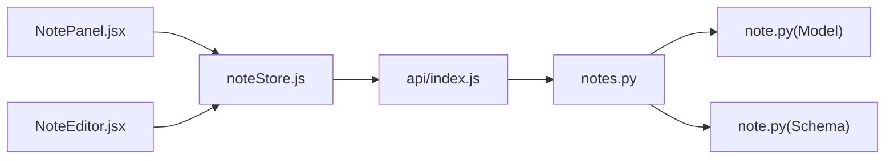

# 笔记面板组件

<cite>
**本文档引用的文件**
- [NotePanel.jsx](file://frontend/src/components/NotePanel/NotePanel.jsx)
- [NotePanel.module.css](file://frontend/src/components/NotePanel/NotePanel.module.css)
- [NoteEditor.jsx](file://frontend/src/components/NoteEditor/NoteEditor.jsx)
- [NoteEditor.module.css](file://frontend/src/components/NoteEditor/NoteEditor.module.css)
- [noteStore.js](file://frontend/src/stores/noteStore.js)
- [api/index.js](file://frontend/src/api/index.js)
- [notes.py](file://backend/app/routers/notes.py)
- [note.py](file://backend/app/models/note.py)
- [note.py](file://backend/app/schemas/note.py)
</cite>

## 目录
1. [简介](#简介)
2. [项目结构](#项目结构)
3. [核心组件](#核心组件)
4. [架构总览](#架构总览)
5. [详细组件分析](#详细组件分析)
6. [依赖关系分析](#依赖关系分析)
7. [性能考量](#性能考量)
8. [故障排查指南](#故障排查指南)
9. [结论](#结论)

## 简介
本文件为“笔记面板组件”的技术文档，围绕前端 NotePanel 组件与其配套的 NoteEditor 编辑器、Zustand 状态管理、以及后端 FastAPI 路由与数据库模型进行系统化梳理。重点覆盖以下方面：
- 笔记列表展示、搜索过滤、展开/收起、时间格式化与高亮关联标识
- 笔记创建、编辑、删除的交互流程与状态同步
- 前端状态管理与后端 API 的数据绑定与同步机制
- 本地存储与云端同步的实现思路与注意事项
- 与 PDF 阅读器的集成场景与最佳实践
- 性能优化、数据持久化与用户体验设计要点

## 项目结构
NotePanel 作为阅读与写作辅助模块的一部分，位于前端组件目录下，并通过 Zustand 状态管理与 API 客户端与后端交互；后端提供 REST 接口，数据库模型定义了笔记实体及与论文、高亮的关联关系。

图表来源
- [NotePanel.jsx:1-275](file://frontend/src/components/NotePanel/NotePanel.jsx#L1-L275)
- [NoteEditor.jsx:1-204](file://frontend/src/components/NoteEditor/NoteEditor.jsx#L1-L204)
- [noteStore.js:1-145](file://frontend/src/stores/noteStore.js#L1-L145)
- [api/index.js:1-12](file://frontend/src/api/index.js#L1-L12)
- [notes.py:1-350](file://backend/app/routers/notes.py#L1-L350)
- [note.py:1-34](file://backend/app/models/note.py#L1-L34)
- [note.py:1-36](file://backend/app/schemas/note.py#L1-L36)

章节来源
- [NotePanel.jsx:1-275](file://frontend/src/components/NotePanel/NotePanel.jsx#L1-L275)
- [NoteEditor.jsx:1-204](file://frontend/src/components/NoteEditor/NoteEditor.jsx#L1-L204)
- [noteStore.js:1-145](file://frontend/src/stores/noteStore.js#L1-L145)
- [api/index.js:1-12](file://frontend/src/api/index.js#L1-L12)
- [notes.py:1-350](file://backend/app/routers/notes.py#L1-L350)
- [note.py:1-34](file://backend/app/models/note.py#L1-L34)
- [note.py:1-36](file://backend/app/schemas/note.py#L1-L36)

## 核心组件
- NotePanel：负责渲染笔记列表、搜索过滤、展开/收起、时间格式化、高亮关联提示、以及触发新增/编辑/删除等操作回调。
- NoteEditor：弹窗式编辑器，支持高亮文本预览、内容编辑、保存/删除、快捷键与外部点击关闭。
- noteStore：基于 Zustand 的全局状态，封装笔记的增删改查、搜索、激活笔记、清空等操作，并与后端 API 保持数据同步。
- 后端路由与模型：提供笔记 CRUD、搜索、按论文筛选、高亮关联等接口，并通过 Pydantic Schema 控制请求/响应结构。

章节来源
- [NotePanel.jsx:1-275](file://frontend/src/components/NotePanel/NotePanel.jsx#L1-L275)
- [NoteEditor.jsx:1-204](file://frontend/src/components/NoteEditor/NoteEditor.jsx#L1-L204)
- [noteStore.js:1-145](file://frontend/src/stores/noteStore.js#L1-L145)
- [notes.py:1-350](file://backend/app/routers/notes.py#L1-L350)
- [note.py:1-34](file://backend/app/models/note.py#L1-L34)
- [note.py:1-36](file://backend/app/schemas/note.py#L1-L36)

## 架构总览
NotePanel 通过 props 接收外部回调，内部维护搜索状态与展开状态；noteStore 负责与后端 API 通信，统一管理笔记列表、激活笔记与错误状态；后端路由对请求进行鉴权与权限校验，确保仅允许用户访问其拥有的论文与笔记。

图表来源
- [NotePanel.jsx:17-25](file://frontend/src/components/NotePanel/NotePanel.jsx#L17-L25)
- [noteStore.js:27-45](file://frontend/src/stores/noteStore.js#L27-L45)
- [api/index.js:1-12](file://frontend/src/api/index.js#L1-L12)
- [notes.py:77-137](file://backend/app/routers/notes.py#L77-L137)

## 详细组件分析

### NotePanel 组件
- 功能职责
  - 列表渲染：根据传入的 notes 数组渲染笔记项，支持空态与加载态。
  - 搜索过滤：基于内容与高亮文本进行模糊匹配，支持清空搜索。
  - 展开/收起：长内容笔记默认折叠，点击箭头切换展开状态。
  - 时间格式化：相对时间（分钟/小时前/天前）与日期显示。
  - 高亮关联：若笔记绑定高亮，显示关联指示器与高亮文本预览。
  - 操作按钮：编辑、删除、展开/收起，均阻止事件冒泡避免误触列表项。
  - 回调驱动：通过 onNoteClick/onAddNote/onEditNote/onDeleteNote 与父组件协作。

- 数据绑定与状态同步
  - 外部属性：notes、activeNoteId、loading。
  - 内部状态：searchQuery、expandedNotes（Set）。
  - 与 noteStore 的关系：NotePanel 不直接持有笔记数据，而是通过 props 与回调与 noteStore 协作。

- 用户体验
  - hover 显示操作按钮，移动端始终可见。
  - 空态时提供“添加第一条笔记”入口。
  - 高亮文本预览与时间戳增强可读性。

章节来源
- [NotePanel.jsx:17-275](file://frontend/src/components/NotePanel/NotePanel.jsx#L17-L275)
- [NotePanel.module.css:1-312](file://frontend/src/components/NotePanel/NotePanel.module.css#L1-L312)

#### 类图：NotePanel 与交互行为

图表来源
- [NotePanel.jsx:17-275](file://frontend/src/components/NotePanel/NotePanel.jsx#L17-L275)

### NoteEditor 组件
- 功能职责
  - 弹窗式编辑器：支持创建与编辑两种模式，编辑模式显示删除按钮。
  - 高亮文本预览：当存在关联高亮时显示预览。
  - 输入与快捷键：支持 Ctrl/Cmd + Enter 保存，Esc 关闭，点击外部区域关闭。
  - 保存与删除：调用 onSave/onDelete 回调，禁用无效状态。

- 交互细节
  - 打开时自动聚焦并定位光标至末尾（编辑模式）。
  - 保存过程中显示加载动画与禁用状态，防止重复提交。
  - 删除前二次确认，避免误删。

章节来源
- [NoteEditor.jsx:17-204](file://frontend/src/components/NoteEditor/NoteEditor.jsx#L17-L204)
- [NoteEditor.module.css:1-262](file://frontend/src/components/NoteEditor/NoteEditor.module.css#L1-L262)

#### 序列图：编辑器保存流程

图表来源
- [NoteEditor.jsx:72-97](file://frontend/src/components/NoteEditor/NoteEditor.jsx#L72-L97)
- [noteStore.js:27-87](file://frontend/src/stores/noteStore.js#L27-L87)
- [api/index.js:1-12](file://frontend/src/api/index.js#L1-L12)
- [notes.py:77-137](file://backend/app/routers/notes.py#L77-L137)

### noteStore 状态管理
- 状态字段
  - notes、activeNote、searchResults、loading、error。
- 主要方法
  - fetchNotes：按论文 ID 获取笔记列表。
  - createNote/updateNote/deleteNote：CRUD 操作，成功后更新本地状态。
  - searchNotes：全文模糊搜索，支持按论文过滤。
  - fetchNote：获取单条笔记详情。
  - setActiveNote/clearSearchResults/clearNotes/clearError：辅助状态控制。

- 错误处理
  - 统一捕获异常，设置 error 字段与 loading=false，便于 UI 层展示。

- 与 NotePanel 的协作
  - NotePanel 通过 props 接收回调，由 noteStore 在内部执行 API 调用并更新状态，NotePanel 仅消费状态与触发回调。

章节来源
- [noteStore.js:1-145](file://frontend/src/stores/noteStore.js#L1-L145)

#### 类图：noteStore 方法与状态

图表来源
- [noteStore.js:4-142](file://frontend/src/stores/noteStore.js#L4-L142)

### 后端路由与模型
- 路由接口
  - GET /api/notes：按论文 ID 获取笔记列表，包含高亮文本信息，按创建时间倒序。
  - POST /api/notes：创建笔记，支持绑定高亮。
  - GET /api/notes/{id}：获取单条笔记详情。
  - PUT /api/notes/{id}：更新笔记内容或高亮。
  - DELETE /api/notes/{id}：删除笔记。
  - GET /api/notes/search：全文模糊搜索，支持按论文过滤，按更新时间倒序。

- 权限与安全
  - 每个接口均进行用户鉴权与资源归属校验，确保仅能访问当前用户拥有的论文与笔记。
  - 高亮绑定校验：更新或创建时若提供 highlight_id，需同时满足用户与论文归属。

- 数据模型与 Schema
  - Note 模型：主键、论文外键、用户外键、高亮外键（可空）、内容、创建/更新时间。
  - Pydantic Schema：NoteCreate/NoteUpdate/NoteResponse/NoteWithHighlightResponse，统一请求/响应结构。

章节来源
- [notes.py:21-350](file://backend/app/routers/notes.py#L21-L350)
- [note.py:11-34](file://backend/app/models/note.py#L11-L34)
- [note.py:7-36](file://backend/app/schemas/note.py#L7-L36)

#### 类图：后端模型与路由

图表来源
- [note.py:11-34](file://backend/app/models/note.py#L11-L34)
- [note.py:7-36](file://backend/app/schemas/note.py#L7-L36)

### 数据流与状态同步
- 列表加载：NotePanel 接收 notes 与 loading，noteStore 在 fetchNotes 中设置 loading 并更新 notes。
- 搜索：searchNotes 设置 loading 并更新 searchResults，NotePanel 可直接消费 filteredNotes。
- 编辑/删除：NotePanel 触发 onEditNote/onDeleteNote，noteStore 调用对应 API 并更新本地状态。
- 激活笔记：setActiveNote 更新 activeNote，NotePanel 通过 activeNoteId 高亮当前项。

章节来源
- [NotePanel.jsx:17-275](file://frontend/src/components/NotePanel/NotePanel.jsx#L17-L275)
- [noteStore.js:11-123](file://frontend/src/stores/noteStore.js#L11-L123)

### 编辑器集成与富文本/Markdown 支持
- 当前实现
  - NoteEditor 使用原生 textarea，支持高亮文本预览与快捷键保存。
  - Markdown 渲染在其他页面（如写作页）使用 react-markdown，NotePanel 未内置 Markdown 预览。
- 集成建议
  - 若需富文本编辑，可在 NoteEditor 中引入编辑器库（如 tiptap/quill），并保留现有保存逻辑。
  - Markdown 支持：在 NotePanel 中增加“预览”按钮，调用 Markdown 渲染组件展示内容。
  - 实时预览：在编辑器中监听内容变化，异步渲染预览区域，注意防抖与性能。

章节来源
- [NoteEditor.jsx:17-204](file://frontend/src/components/NoteEditor/NoteEditor.jsx#L17-L204)

### 分类管理、搜索过滤与排序
- 分类管理
  - 当前未实现“标签/分类”字段；可通过扩展 Note 模型与后端接口实现。
- 搜索过滤
  - 前端：NotePanel 基于 content 与 highlight_text 进行本地过滤。
  - 后端：notes/search 提供全文模糊搜索，支持按论文过滤。
- 排序
  - 列表默认按 created_at 倒序；搜索结果按 updated_at 倒序。
  - 可在 UI 上增加排序控件（创建时间/更新时间/标题），并结合后端排序参数。

章节来源
- [NotePanel.jsx:29-38](file://frontend/src/components/NotePanel/NotePanel.jsx#L29-L38)
- [notes.py:21-74](file://backend/app/routers/notes.py#L21-L74)
- [notes.py:285-350](file://backend/app/routers/notes.py#L285-L350)

### 批量操作支持
- 当前未实现批量勾选与批量删除；可通过以下方式扩展：
  - 在 NotePanel 中增加复选框列，维护 selectedIds 集合。
  - 新增批量删除按钮，调用后端批量删除接口（需后端支持）。
  - 或采用循环逐个删除，但需注意错误处理与用户体验。

章节来源
- [NotePanel.jsx:184-268](file://frontend/src/components/NotePanel/NotePanel.jsx#L184-L268)

### 本地存储与云端同步
- 本地存储
  - noteStore 使用内存状态，刷新即丢失；可结合浏览器存储（localStorage/sessionStorage）实现轻量持久化。
- 云端同步
  - 通过 noteStore 的 API 方法与后端保持一致；错误时展示 error 并回滚 UI。
- 建议
  - 对关键操作（如创建/更新）增加乐观更新与回滚策略，提升离线/弱网体验。
  - 对搜索结果与列表缓存进行合理过期策略，避免陈旧数据影响体验。

章节来源
- [noteStore.js:1-145](file://frontend/src/stores/noteStore.js#L1-L145)

### 与 PDF 阅读器的集成
- 关联高亮：NotePanel 展示高亮文本预览，编辑器可直接引用高亮文本。
- 跳转能力：NotePanel 的 onNoteClick 可触发 PDF 阅读器定位到高亮位置（需在父组件中实现）。
- 最佳实践
  - 保持笔记与高亮的双向关联，确保删除高亮时清理相关笔记。
  - 在 PDF 阅读器中提供“从笔记跳转”与“从高亮创建笔记”的快捷入口。

章节来源
- [NotePanel.jsx:186-212](file://frontend/src/components/NotePanel/NotePanel.jsx#L186-L212)
- [NoteEditor.jsx:124-137](file://frontend/src/components/NoteEditor/NoteEditor.jsx#L124-L137)

## 依赖关系分析
- 前端依赖
  - NotePanel 依赖 noteStore 的状态与方法，通过 props 与回调与父组件解耦。
  - NoteEditor 依赖 noteStore 的保存/删除方法，通过回调与父组件协作。
  - api/index.js 提供统一的 Axios 实例，集中配置 baseURL 与请求头。
- 后端依赖
  - notes.py 路由依赖数据库会话、用户鉴权、论文与高亮模型，确保数据一致性与权限控制。
  - note.py 模型定义外键关系，note.py Schema 定义请求/响应结构。

图表来源
- [NotePanel.jsx:1-275](file://frontend/src/components/NotePanel/NotePanel.jsx#L1-L275)
- [NoteEditor.jsx:1-204](file://frontend/src/components/NoteEditor/NoteEditor.jsx#L1-L204)
- [noteStore.js:1-145](file://frontend/src/stores/noteStore.js#L1-L145)
- [api/index.js:1-12](file://frontend/src/api/index.js#L1-L12)
- [notes.py:1-350](file://backend/app/routers/notes.py#L1-L350)
- [note.py:1-34](file://backend/app/models/note.py#L1-L34)
- [note.py:1-36](file://backend/app/schemas/note.py#L1-L36)

章节来源
- [NotePanel.jsx:1-275](file://frontend/src/components/NotePanel/NotePanel.jsx#L1-L275)
- [NoteEditor.jsx:1-204](file://frontend/src/components/NoteEditor/NoteEditor.jsx#L1-L204)
- [noteStore.js:1-145](file://frontend/src/stores/noteStore.js#L1-L145)
- [api/index.js:1-12](file://frontend/src/api/index.js#L1-L12)
- [notes.py:1-350](file://backend/app/routers/notes.py#L1-L350)
- [note.py:1-34](file://backend/app/models/note.py#L1-L34)
- [note.py:1-36](file://backend/app/schemas/note.py#L1-L36)

## 性能考量
- 列表渲染
  - 使用 useMemo 缓存 filteredNotes，避免每次渲染都重新计算。
  - 对长内容笔记采用折叠策略，减少 DOM 节点数量。
- 搜索性能
  - 前端模糊匹配在小规模数据集表现良好；大规模数据建议后端分页与索引优化。
- 状态更新
  - 使用 Set 管理展开状态，避免频繁对象拷贝。
  - noteStore 的状态更新采用不可变更新策略，减少不必要的重渲染。
- 网络请求
  - 统一错误处理与 loading 状态，避免 UI 卡顿。
  - 对高频操作（如搜索）可加入防抖策略。

章节来源
- [NotePanel.jsx:29-52](file://frontend/src/components/NotePanel/NotePanel.jsx#L29-L52)
- [noteStore.js:1-145](file://frontend/src/stores/noteStore.js#L1-L145)

## 故障排查指南
- 笔记无法加载
  - 检查网络请求是否成功，查看 noteStore 的 error 字段。
  - 确认当前用户是否拥有目标论文与笔记的访问权限。
- 搜索无结果
  - 确认搜索关键词长度与大小写；后端使用 ilike 进行模糊匹配。
- 编辑/删除失败
  - 查看后端返回的错误信息，确认高亮绑定是否有效。
- UI 卡顿
  - 检查是否有大量笔记导致渲染压力，考虑分页或虚拟滚动。

章节来源
- [noteStore.js:18-24](file://frontend/src/stores/noteStore.js#L18-L24)
- [notes.py:42-46](file://backend/app/routers/notes.py#L42-L46)
- [notes.py:100-104](file://backend/app/routers/notes.py#L100-L104)

## 结论
NotePanel 与 NoteEditor 构成了一个清晰、可扩展的笔记管理界面：NotePanel 负责列表与交互，NoteEditor 提供弹窗式编辑体验，noteStore 统一管理状态与 API 调用，后端路由与模型保障数据一致性与权限控制。后续可在以下方向持续演进：
- 增加标签/分类、批量操作、排序与导出功能；
- 在编辑器中集成富文本与 Markdown 预览；
- 优化大列表渲染与搜索性能；
- 增强离线与缓存策略，提升弱网体验。