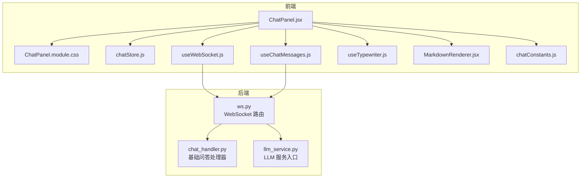
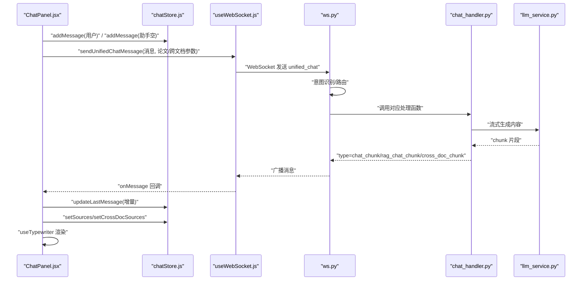
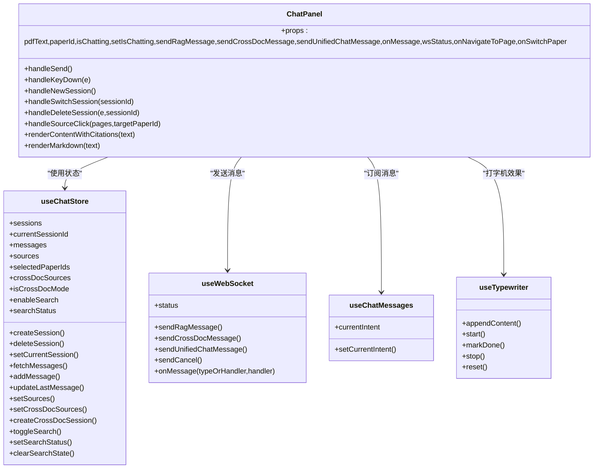
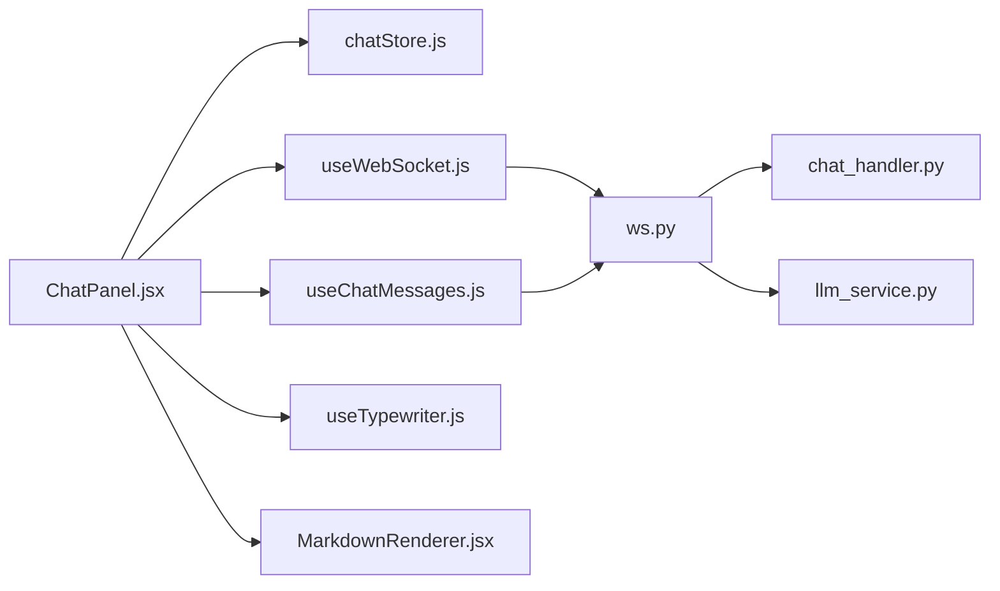

# 聊天面板组件

<cite>
**本文档引用的文件**
- [ChatPanel.jsx](file://frontend/src/components/ChatPanel/ChatPanel.jsx)
- [ChatPanel.module.css](file://frontend/src/components/ChatPanel/ChatPanel.module.css)
- [chatStore.js](file://frontend/src/stores/chatStore.js)
- [useWebSocket.js](file://frontend/src/hooks/useWebSocket.js)
- [useChatMessages.js](file://frontend/src/hooks/useChatMessages.js)
- [useTypewriter.js](file://frontend/src/hooks/useTypewriter.js)
- [MarkdownRenderer.jsx](file://frontend/src/utils/MarkdownRenderer.jsx)
- [chatConstants.js](file://frontend/src/utils/chatConstants.js)
- [ChatPage.jsx](file://frontend/src/pages/ChatPage.jsx)
- [ws.py](file://backend/app/routers/ws.py)
- [chat_handler.py](file://backend/app/handlers/chat_handler.py)
- [llm_service.py](file://backend/app/services/llm_service.py)
</cite>

## 目录
1. [简介](#简介)
2. [项目结构](#项目结构)
3. [核心组件](#核心组件)
4. [架构总览](#架构总览)
5. [详细组件分析](#详细组件分析)
6. [依赖关系分析](#依赖关系分析)
7. [性能考量](#性能考量)
8. [故障排查指南](#故障排查指南)
9. [结论](#结论)
10. [附录](#附录)

## 简介
本文件为聊天面板组件的技术文档，聚焦于 ChatPanel 组件的设计架构与实现原理，涵盖实时消息展示、用户输入处理、消息发送机制、状态管理、WebSocket 连接处理、消息历史记录与流式响应处理、布局与样式、消息气泡与引用来源、输入框行为与快捷键支持、消息格式规范、错误处理策略与用户体验优化、可扩展性设计、主题适配与无障碍支持等方面。文档同时提供代码级架构图与流程图，帮助开发者快速理解与维护该组件。

## 项目结构
前端采用模块化组件与状态管理分离的设计：
- ChatPanel.jsx：聊天面板主组件，负责布局、输入、消息渲染、会话与跨文档模式管理、引用来源展示与跳转。
- ChatPanel.module.css：组件样式，包含主题变量、响应式适配与交互态。
- chatStore.js：Zustand 状态管理，封装会话、消息、跨文档模式、联网搜索状态与 API 调用。
- hooks：useWebSocket.js（全局 WebSocket）、useChatMessages.js（消息订阅与流式处理）、useTypewriter.js（打字机效果）。
- utils：MarkdownRenderer.jsx（Markdown 渲染）、chatConstants.js（意图标签与建议词）。
- backend：WebSocket 路由 ws.py，消息类型路由与分发；handlers 与 llm_service.py 提供具体处理能力。

图表来源
- [ChatPanel.jsx:120-644](file://frontend/src/components/ChatPanel/ChatPanel.jsx#L120-L644)
- [ChatPanel.module.css:1-793](file://frontend/src/components/ChatPanel/ChatPanel.module.css#L1-L793)
- [chatStore.js:1-417](file://frontend/src/stores/chatStore.js#L1-L417)
- [useWebSocket.js:1-180](file://frontend/src/hooks/useWebSocket.js#L1-L180)
- [useChatMessages.js:1-103](file://frontend/src/hooks/useChatMessages.js#L1-L103)
- [useTypewriter.js:1-117](file://frontend/src/hooks/useTypewriter.js#L1-L117)
- [MarkdownRenderer.jsx:1-33](file://frontend/src/utils/MarkdownRenderer.jsx#L1-L33)
- [chatConstants.js:1-23](file://frontend/src/utils/chatConstants.js#L1-L23)
- [ws.py:76-436](file://backend/app/routers/ws.py#L76-L436)
- [chat_handler.py:1-32](file://backend/app/handlers/chat_handler.py#L1-L32)
- [llm_service.py:1-53](file://backend/app/services/llm_service.py#L1-L53)

章节来源
- [ChatPanel.jsx:1-644](file://frontend/src/components/ChatPanel/ChatPanel.jsx#L1-L644)
- [ChatPanel.module.css:1-793](file://frontend/src/components/ChatPanel/ChatPanel.module.css#L1-L793)
- [chatStore.js:1-417](file://frontend/src/stores/chatStore.js#L1-L417)
- [useWebSocket.js:1-180](file://frontend/src/hooks/useWebSocket.js#L1-L180)
- [useChatMessages.js:1-103](file://frontend/src/hooks/useChatMessages.js#L1-L103)
- [useTypewriter.js:1-117](file://frontend/src/hooks/useTypewriter.js#L1-L117)
- [MarkdownRenderer.jsx:1-33](file://frontend/src/utils/MarkdownRenderer.jsx#L1-L33)
- [chatConstants.js:1-23](file://frontend/src/utils/chatConstants.js#L1-L23)
- [ws.py:76-436](file://backend/app/routers/ws.py#L76-L436)
- [chat_handler.py:1-32](file://backend/app/handlers/chat_handler.py#L1-L32)
- [llm_service.py:1-53](file://backend/app/services/llm_service.py#L1-L53)

## 核心组件
- ChatPanel 主组件：负责整体布局、输入框与快捷键、消息虚拟滚动、引用来源渲染、跨文档模式与论文选择、会话管理、WebSocket 消息发送与流式接收。
- chatStore：集中管理会话、消息、跨文档模式、联网搜索状态与 API 调用，提供创建/切换/删除会话、获取消息、设置引用来源等方法。
- useWebSocket：全局 WebSocket 管理，提供连接状态、消息发送（RAG、跨文档、统一聊天、取消）、消息订阅。
- useChatMessages：订阅 WebSocket 消息类型，处理流式片段、意图检测、引用来源、搜索状态、完成事件与错误处理。
- useTypewriter：基于 requestAnimationFrame 的打字机效果，逐字符增量更新消息内容。
- MarkdownRenderer：Markdown 渲染器，定制标题、段落、表格、代码块等组件样式。
- chatConstants：意图标签与建议词常量，用于 UI 展示与提示。

章节来源
- [ChatPanel.jsx:120-644](file://frontend/src/components/ChatPanel/ChatPanel.jsx#L120-L644)
- [chatStore.js:1-417](file://frontend/src/stores/chatStore.js#L1-L417)
- [useWebSocket.js:1-180](file://frontend/src/hooks/useWebSocket.js#L1-L180)
- [useChatMessages.js:1-103](file://frontend/src/hooks/useChatMessages.js#L1-L103)
- [useTypewriter.js:1-117](file://frontend/src/hooks/useTypewriter.js#L1-L117)
- [MarkdownRenderer.jsx:1-33](file://frontend/src/utils/MarkdownRenderer.jsx#L1-L33)
- [chatConstants.js:1-23](file://frontend/src/utils/chatConstants.js#L1-L23)

## 架构总览
前端通过 ChatPanel 与 chatStore 协作，使用 useWebSocket 发送统一聊天消息（unified_chat），后端 ws.py 接收消息并根据关键词进行意图识别，路由到不同处理函数（RAG、跨文档、分析等）。后端通过 llm_service.py 调用底层 LLM，按消息类型返回流式片段（chat_chunk、rag_chat_chunk、cross_doc_chunk 等），前端通过 useChatMessages 订阅并在 useTypewriter 中逐步展示，最终通过 chatStore 更新消息与引用来源。

图表来源
- [ChatPanel.jsx:231-256](file://frontend/src/components/ChatPanel/ChatPanel.jsx#L231-L256)
- [chatStore.js:235-260](file://frontend/src/stores/chatStore.js#L235-L260)
- [useWebSocket.js:140-154](file://frontend/src/hooks/useWebSocket.js#L140-L154)
- [ws.py:262-417](file://backend/app/routers/ws.py#L262-L417)
- [chat_handler.py:11-32](file://backend/app/handlers/chat_handler.py#L11-L32)
- [llm_service.py:1-53](file://backend/app/services/llm_service.py#L1-L53)

## 详细组件分析

### ChatPanel 组件
- 布局与交互
  - 侧边栏：会话列表、新建会话、跨文档论文选择与管理、会话删除。
  - 聊天区：欢迎语、消息列表（虚拟滚动）、输入区（文本域、发送按钮、联网搜索开关、停止生成）。
  - 引用来源：单文档与跨文档两种来源展示，支持点击跳转到指定页码或论文。
- 实时消息展示
  - 使用 @tanstack/react-virtual 实现消息列表虚拟滚动，estimateSize 估算高度，measureElement 测量实际高度，overscan 控制预渲染数量。
  - 最后一条消息使用打字机效果，逐步增量更新内容。
- 用户输入处理
  - 文本域自动高度调整，最大高度限制。
  - Enter 快捷键发送，Shift+Enter 换行。
  - 输入禁用条件：正在聊天或 WebSocket 未连接。
- 会话与跨文档模式
  - 支持单文档与跨文档两种模式，切换会话时加载对应消息。
  - 跨文档模式下可选择多篇论文，创建跨文档会话。
- 引用来源与跳转
  - 单文档：显示论文页码与文本片段；跨文档：显示论文标题与页码。
  - 点击来源可跳转到目标页码或切换到对应论文。
- 意图检测与提示
  - 前端显示当前意图标签与置信度，引导用户使用关键词触发特定功能（如章节概述、深度分析、核心知识点等）。

章节来源
- [ChatPanel.jsx:120-644](file://frontend/src/components/ChatPanel/ChatPanel.jsx#L120-L644)
- [ChatPanel.module.css:1-793](file://frontend/src/components/ChatPanel/ChatPanel.module.css#L1-L793)

#### 类图：组件与钩子关系

图表来源
- [ChatPanel.jsx:120-644](file://frontend/src/components/ChatPanel/ChatPanel.jsx#L120-L644)
- [chatStore.js:1-417](file://frontend/src/stores/chatStore.js#L1-L417)
- [useWebSocket.js:1-180](file://frontend/src/hooks/useWebSocket.js#L1-L180)
- [useChatMessages.js:1-103](file://frontend/src/hooks/useChatMessages.js#L1-L103)
- [useTypewriter.js:1-117](file://frontend/src/hooks/useTypewriter.js#L1-L117)

### 状态管理（chatStore）
- 会话管理
  - fetchSessions/fetchMessages：获取会话列表与消息。
  - createSession/getOrCreateSessionByPaper/deleteSession/renameSession/autoNameSession：CRUD 与自动命名。
  - setCurrentSession：切换当前会话并清空来源。
- 跨文档模式
  - addPaperToCrossDoc/removePaperFromCrossDoc/clearCrossDocPapers/setCrossDocPapers/createCrossDocSession：跨文档论文选择与会话创建。
- 联网搜索
  - toggleSearch/setSearchStatus/clearSearchState：控制搜索开关与状态。
- 统一聊天消息
  - sendUnifiedChatMessage：通过 WebSocket 发送统一聊天消息，携带 paper_id、paper_ids、session_id、enable_search。

章节来源
- [chatStore.js:1-417](file://frontend/src/stores/chatStore.js#L1-L417)

### WebSocket 连接与消息处理（useWebSocket 与 useChatMessages）
- 连接管理
  - 全局连接池：单例 WebSocket，自动重连（最多 5 次，间隔 3 秒），状态变更通知。
  - 认证：带 token 查询参数，无 token 时降级为默认用户。
- 消息发送
  - sendRagMessage/sendCrossDocMessage/sendUnifiedChatMessage/sendCancel/onMessage：统一聊天入口、RAG、跨文档、取消与订阅。
- 流式接收
  - useChatMessages 订阅 rag_chat_chunk/cross_doc_chunk/analyze_chunk/deep_analyze_chunk、intent_detected、rag_sources/cross_doc_sources、search_status、done/error 等类型，驱动 chatStore 更新与 UI 渲染。

章节来源
- [useWebSocket.js:1-180](file://frontend/src/hooks/useWebSocket.js#L1-L180)
- [useChatMessages.js:1-103](file://frontend/src/hooks/useChatMessages.js#L1-L103)

### 打字机效果（useTypewriter）
- 基于 requestAnimationFrame 的增量渲染，避免 setTimeout 的时间漂移。
- 支持字符间隔与每帧字符数配置，完成标记后触发回调。
- 提供 appendContent/start/markDone/stop/reset 等方法，便于与 WebSocket 流式数据配合。

章节来源
- [useTypewriter.js:1-117](file://frontend/src/hooks/useTypewriter.js#L1-L117)

### Markdown 渲染（MarkdownRenderer）
- 使用 react-markdown 渲染，定制标题、段落、列表、表格、代码块等组件样式，适配卡片内展示。
- 降低标题层级，避免 h1 在卡片中过大。

章节来源
- [MarkdownRenderer.jsx:1-33](file://frontend/src/utils/MarkdownRenderer.jsx#L1-L33)

### 消息格式规范与后端路由
- 前端发送消息类型
  - unified_chat：统一聊天入口，包含 message、paper_id、paper_ids、session_id、enable_search。
  - rag_chat：RAG 问答，包含 message、paper_id、session_id、user_id、enable_search。
  - cross_doc_chat：跨文档问答，包含 message、paper_ids、session_id、user_id。
  - cancel：取消当前任务。
- 后端响应消息类型
  - chat_chunk/rag_chat_chunk/cross_doc_chunk/analyze_chunk/deep_analyze_chunk：流式片段。
  - rag_sources/cross_doc_sources：引用来源数组。
  - search_status：联网搜索状态（searching/completed）。
  - done：通道完成，携带 channel 与 session_id。
  - error：错误消息。
  - intent_detected：意图识别结果（intent/tool/confidence/matched）。

章节来源
- [useWebSocket.js:140-154](file://frontend/src/hooks/useWebSocket.js#L140-L154)
- [ws.py:84-102](file://backend/app/routers/ws.py#L84-L102)
- [ws.py:262-417](file://backend/app/routers/ws.py#L262-L417)

### 引用来源与跨文档展示
- 单文档来源：显示页码与文本片段，点击跳转到对应页。
- 跨文档来源：显示论文标题、页码与文本片段，点击跳转到对应论文与页。
- 引用标记解析：支持 [p.X] 与 [论文X, p.Y] 两种格式，点击跳转。

章节来源
- [ChatPanel.jsx:323-396](file://frontend/src/components/ChatPanel/ChatPanel.jsx#L323-L396)
- [ChatPanel.jsx:437-517](file://frontend/src/components/ChatPanel/ChatPanel.jsx#L437-L517)

### 布局设计与样式
- 主容器：flex 布局，侧边栏可折叠，聊天区自适应。
- 消息气泡：用户消息右对齐，助手消息左对齐，圆角与阴影增强层次感。
- 引用来源：左侧强调色边框，hover 效果，跨文档来源使用成功色区分。
- 输入区：文本域自适应高度，发送按钮禁用态，联网搜索开关与指示器。
- 响应式：针对中屏、小屏、超小屏的宽度与字体大小调整。

章节来源
- [ChatPanel.module.css:1-793](file://frontend/src/components/ChatPanel/ChatPanel.module.css#L1-L793)

### 快捷键与无障碍支持
- 快捷键：Enter 发送，Shift+Enter 换行；Esc 编辑标题时取消。
- 无障碍：按钮具备 title 提示，链接 target="_blank" 并 rel="noopener noreferrer"，输入框禁用态明确反馈。
- 可访问性建议：为发送按钮与停止按钮提供键盘可达性与 ARIA 标签（当前代码未显式使用 ARIA，可在扩展时补充）。

章节来源
- [ChatPanel.jsx:258-263](file://frontend/src/components/ChatPanel/ChatPanel.jsx#L258-L263)
- [ChatPanel.jsx:40-41](file://frontend/src/components/ChatPanel/ChatPanel.jsx#L40-L41)
- [ChatPanel.jsx:310-316](file://frontend/src/components/ChatPanel/ChatPanel.jsx#L310-L316)

### 错误处理策略与用户体验优化
- 错误处理：订阅 error 类型消息，显示错误提示并重置流状态。
- 停止生成：发送 cancel，前端显示“已停止”提示并重置状态。
- 自动命名：首次消息时根据内容自动命名会话标题。
- 意图提示：显示当前意图标签与置信度，提升交互透明度。
- 搜索状态：联网搜索时显示旋转指示器，完成后显示完成提示。

章节来源
- [useChatMessages.js:84-92](file://frontend/src/hooks/useChatMessages.js#L84-L92)
- [ChatPage.jsx:100-109](file://frontend/src/pages/ChatPage.jsx#L100-L109)
- [chatStore.js:174-187](file://frontend/src/stores/chatStore.js#L174-L187)

## 依赖关系分析
- 组件耦合
  - ChatPanel 与 chatStore 高内聚，通过状态驱动 UI。
  - ChatPanel 与 useWebSocket 解耦，通过 onMessage 与 send* 方法交互。
  - useChatMessages 作为消息订阅中枢，解耦 UI 与后端消息类型。
- 外部依赖
  - @tanstack/react-virtual：虚拟滚动。
  - react-markdown：Markdown 渲染。
  - requestAnimationFrame：打字机动画。
- 循环依赖
  - 未发现循环依赖，模块职责清晰。

图表来源
- [ChatPanel.jsx:1-644](file://frontend/src/components/ChatPanel/ChatPanel.jsx#L1-L644)
- [chatStore.js:1-417](file://frontend/src/stores/chatStore.js#L1-L417)
- [useWebSocket.js:1-180](file://frontend/src/hooks/useWebSocket.js#L1-L180)
- [useChatMessages.js:1-103](file://frontend/src/hooks/useChatMessages.js#L1-L103)
- [useTypewriter.js:1-117](file://frontend/src/hooks/useTypewriter.js#L1-L117)
- [MarkdownRenderer.jsx:1-33](file://frontend/src/utils/MarkdownRenderer.jsx#L1-L33)
- [ws.py:76-436](file://backend/app/routers/ws.py#L76-L436)
- [chat_handler.py:1-32](file://backend/app/handlers/chat_handler.py#L1-L32)
- [llm_service.py:1-53](file://backend/app/services/llm_service.py#L1-L53)

章节来源
- [ChatPanel.jsx:1-644](file://frontend/src/components/ChatPanel/ChatPanel.jsx#L1-L644)
- [chatStore.js:1-417](file://frontend/src/stores/chatStore.js#L1-L417)
- [useWebSocket.js:1-180](file://frontend/src/hooks/useWebSocket.js#L1-L180)
- [useChatMessages.js:1-103](file://frontend/src/hooks/useChatMessages.js#L1-L103)
- [useTypewriter.js:1-117](file://frontend/src/hooks/useTypewriter.js#L1-L117)
- [MarkdownRenderer.jsx:1-33](file://frontend/src/utils/MarkdownRenderer.jsx#L1-L33)
- [ws.py:76-436](file://backend/app/routers/ws.py#L76-L436)
- [chat_handler.py:1-32](file://backend/app/handlers/chat_handler.py#L1-L32)
- [llm_service.py:1-53](file://backend/app/services/llm_service.py#L1-L53)

## 性能考量
- 虚拟滚动：useVirtualizer 估算高度、测量元素、overscan 控制，减少 DOM 节点数量，提升长消息列表滚动性能。
- 渲染优化：MessageItem 使用 memo 与自定义比较函数，避免无关属性变化导致的重渲染。
- 打字机动画：requestAnimationFrame 与节流，避免高频更新造成掉帧。
- 状态最小化：chatStore 将消息、来源、搜索状态等拆分管理，减少不必要的状态更新。
- WebSocket 复用：全局连接池，避免重复连接与资源浪费。

章节来源
- [ChatPanel.jsx:13-118](file://frontend/src/components/ChatPanel/ChatPanel.jsx#L13-L118)
- [ChatPanel.jsx:180-189](file://frontend/src/components/ChatPanel/ChatPanel.jsx#L180-L189)
- [useTypewriter.js:24-51](file://frontend/src/hooks/useTypewriter.js#L24-L51)
- [chatStore.js:1-417](file://frontend/src/stores/chatStore.js#L1-L417)
- [useWebSocket.js:19-59](file://frontend/src/hooks/useWebSocket.js#L19-L59)

## 故障排查指南
- WebSocket 未连接
  - 现象：发送按钮禁用、输入区不可用。
  - 排查：检查 useWebSocket 状态与 token，确认后端路由 /ws 可达。
- 消息未显示或卡住
  - 现象：打字机不更新、最后一条消息无变化。
  - 排查：确认 onMessage 订阅是否生效、是否被取消、是否收到 done。
- 引用来源不显示
  - 现象：助手消息末尾无来源块。
  - 排查：确认后端是否返回 rag_sources 或 cross_doc_sources，前端是否 setSources/setCrossDocSources。
- 跨文档模式异常
  - 现象：无法创建跨文档会话或来源不正确。
  - 排查：确认 paper_ids 是否为空、createCrossDocSession 是否成功、后端路由是否正确路由到 cross_doc_chat。
- 错误提示频繁出现
  - 现象：前端弹出错误消息。
  - 排查：查看后端 error 类型消息，定位具体异常（如缺少 paper_id、消息为空、论文不存在等）。

章节来源
- [useWebSocket.js:100-107](file://frontend/src/hooks/useWebSocket.js#L100-L107)
- [useChatMessages.js:84-92](file://frontend/src/hooks/useChatMessages.js#L84-L92)
- [chatStore.js:257-260](file://frontend/src/stores/chatStore.js#L257-L260)
- [ws.py:153-200](file://backend/app/routers/ws.py#L153-L200)
- [ws.py:223-250](file://backend/app/routers/ws.py#L223-L250)

## 结论
ChatPanel 组件通过清晰的模块划分与状态管理，实现了高性能、可扩展的聊天体验。前端与后端通过统一聊天入口与消息类型协议协作，结合虚拟滚动、打字机效果与引用来源展示，提供了流畅的实时对话与知识检索体验。建议在后续迭代中进一步完善无障碍支持与错误恢复策略，并持续优化意图识别与路由逻辑以提升智能化水平。

## 附录
- 可扩展性设计
  - 新增消息类型：在 useWebSocket 与 useChatMessages 中增加订阅与处理逻辑，后端 ws.py 中新增路由分支与处理器。
  - 新增功能：通过 chatConstants 扩展意图标签与建议词，前端 UI 增加相应入口。
- 主题适配
  - 使用 CSS 变量（如 --color-*）统一主题色，支持浅色/深色主题切换。
- 无障碍访问
  - 建议：为按钮与输入框添加 aria-label/aria-describedby，为链接添加适当的 title，确保键盘可达性与屏幕阅读器友好。