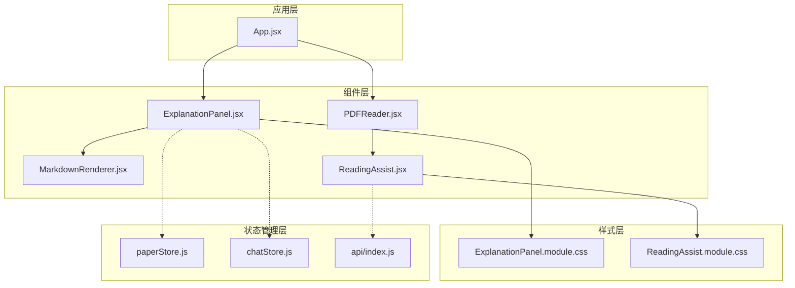
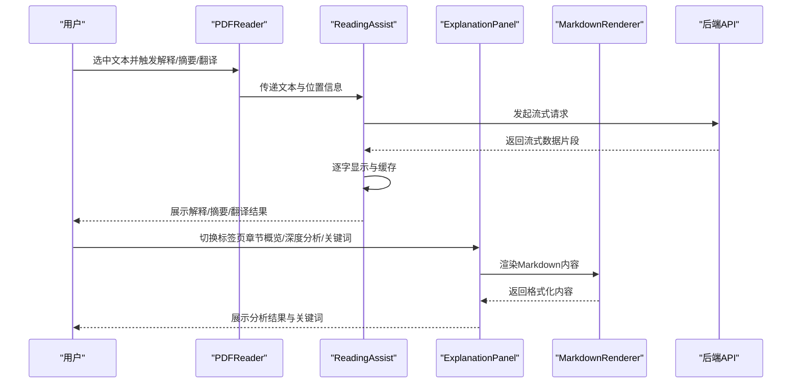
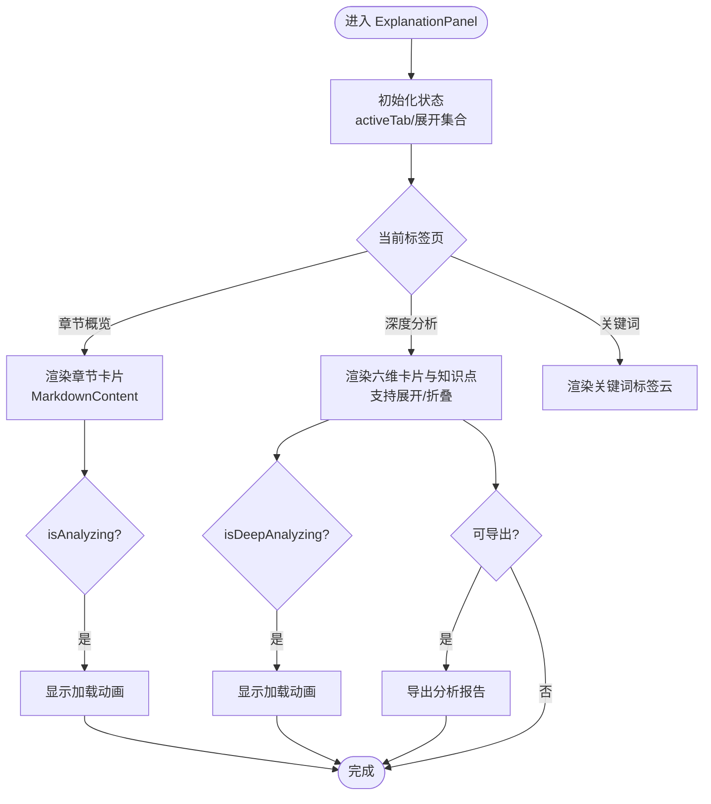
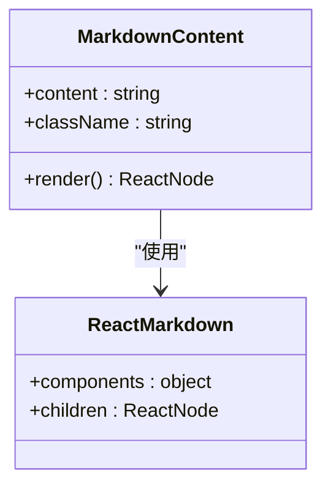
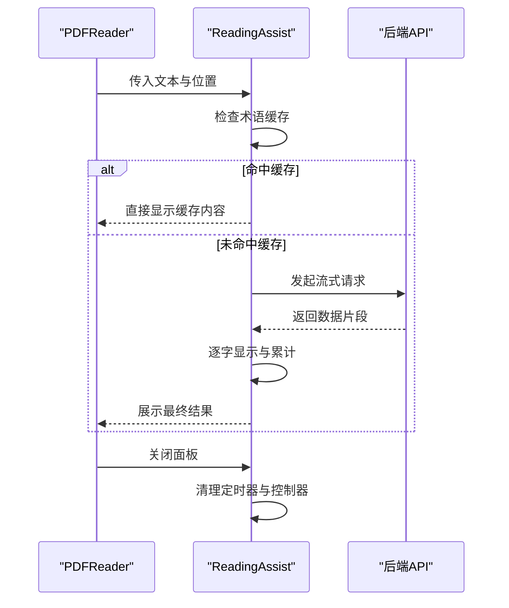
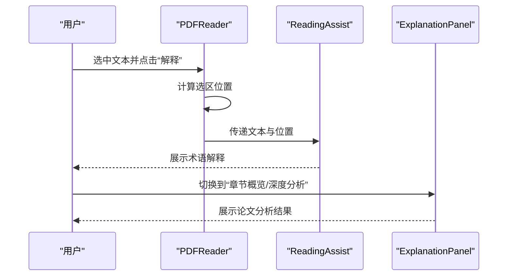
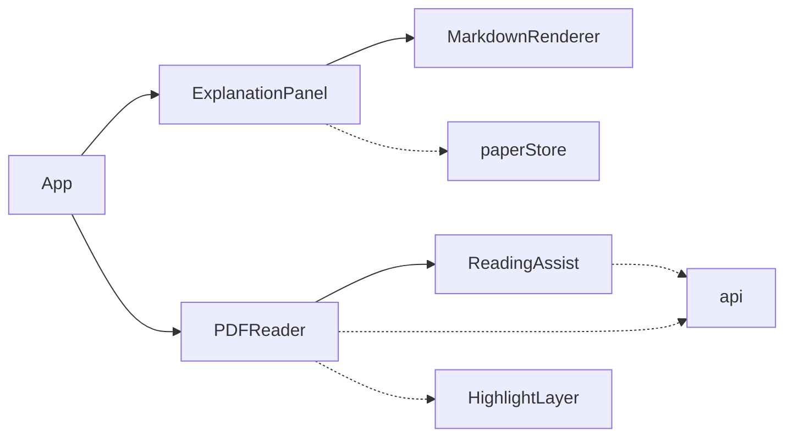

# 解释面板组件

<cite>
**本文档引用的文件**
- [ExplanationPanel.jsx](file://frontend/src/components/ExplanationPanel/ExplanationPanel.jsx)
- [ExplanationPanel.module.css](file://frontend/src/components/ExplanationPanel/ExplanationPanel.module.css)
- [MarkdownRenderer.jsx](file://frontend/src/utils/MarkdownRenderer.jsx)
- [PDFReader.jsx](file://frontend/src/components/PDFReader/PDFReader.jsx)
- [ReadingAssist.jsx](file://frontend/src/components/ReadingAssist/ReadingAssist.jsx)
- [ReadingAssist.module.css](file://frontend/src/components/ReadingAssist/ReadingAssist.module.css)
- [paperStore.js](file://frontend/src/stores/paperStore.js)
- [chatStore.js](file://frontend/src/stores/chatStore.js)
- [api/index.js](file://frontend/src/api/index.js)
- [App.jsx](file://frontend/src/App.jsx)
</cite>

## 目录
1. [简介](#简介)
2. [项目结构](#项目结构)
3. [核心组件](#核心组件)
4. [架构总览](#架构总览)
5. [详细组件分析](#详细组件分析)
6. [依赖关系分析](#依赖关系分析)
7. [性能考虑](#性能考虑)
8. [故障排除指南](#故障排除指南)
9. [结论](#结论)

## 简介
解释面板组件（ExplanationPanel）是论文阅读与分析系统中的核心交互组件，负责展示论文的章节概述、深度分析、关键词提取以及导出功能。该组件与 PDF 阅读器、术语解释、文本摘要、翻译等 AI 助手能力深度集成，提供流畅的阅读体验与强大的内容理解能力。

## 项目结构
解释面板位于前端组件目录中，采用模块化设计，配合 Markdown 渲染器、样式模块与状态管理共同工作。

**图表来源**
- [ExplanationPanel.jsx:1-310](file://frontend/src/components/ExplanationPanel/ExplanationPanel.jsx#L1-L310)
- [ExplanationPanel.module.css:1-518](file://frontend/src/components/ExplanationPanel/ExplanationPanel.module.css#L1-L518)
- [MarkdownRenderer.jsx:1-33](file://frontend/src/utils/MarkdownRenderer.jsx#L1-L33)
- [PDFReader.jsx:1-656](file://frontend/src/components/PDFReader/PDFReader.jsx#L1-L656)
- [ReadingAssist.jsx:1-309](file://frontend/src/components/ReadingAssist/ReadingAssist.jsx#L1-L309)
- [ReadingAssist.module.css:1-153](file://frontend/src/components/ReadingAssist/ReadingAssist.module.css#L1-L153)
- [paperStore.js:1-357](file://frontend/src/stores/paperStore.js#L1-L357)
- [chatStore.js:1-417](file://frontend/src/stores/chatStore.js#L1-L417)
- [api/index.js:1-12](file://frontend/src/api/index.js#L1-L12)
- [App.jsx:670-880](file://frontend/src/App.jsx#L670-L880)

**章节来源**
- [ExplanationPanel.jsx:1-310](file://frontend/src/components/ExplanationPanel/ExplanationPanel.jsx#L1-L310)
- [ExplanationPanel.module.css:1-518](file://frontend/src/components/ExplanationPanel/ExplanationPanel.module.css#L1-L518)
- [App.jsx:670-880](file://frontend/src/App.jsx#L670-L880)

## 核心组件
- ExplanationPanel：提供章节概览、深度分析、关键词三个标签页，支持动态加载、进度指示与错误处理。
- MarkdownContent：轻量级 Markdown 渲染器，统一段落、标题、代码块等元素的样式。
- ReadingAssist：术语解释、文本摘要、翻译的阅读辅助面板，支持流式输出与缓存。
- PDFReader：PDF 阅读器，提供术语解释、摘要、翻译触发入口，并与高亮工具栏联动。
- 状态管理：paperStore 提供论文文本、关键词提取等数据；chatStore 提供会话与跨文档问答能力。

**章节来源**
- [ExplanationPanel.jsx:27-307](file://frontend/src/components/ExplanationPanel/ExplanationPanel.jsx#L27-L307)
- [MarkdownRenderer.jsx:23-30](file://frontend/src/utils/MarkdownRenderer.jsx#L23-L30)
- [ReadingAssist.jsx:21-305](file://frontend/src/components/ReadingAssist/ReadingAssist.jsx#L21-L305)
- [PDFReader.jsx:269-297](file://frontend/src/components/PDFReader/PDFReader.jsx#L269-L297)
- [paperStore.js:269-284](file://frontend/src/stores/paperStore.js#L269-L284)
- [chatStore.js:4-417](file://frontend/src/stores/chatStore.js#L4-L417)

## 架构总览
解释面板与阅读器协同工作，术语解释、摘要、翻译通过 ReadingAssist 进行流式展示，MarkdownContent 统一渲染内容，样式模块提供响应式与深色主题支持。

**图表来源**
- [PDFReader.jsx:269-297](file://frontend/src/components/PDFReader/PDFReader.jsx#L269-L297)
- [ReadingAssist.jsx:79-181](file://frontend/src/components/ReadingAssist/ReadingAssist.jsx#L79-L181)
- [ExplanationPanel.jsx:114-274](file://frontend/src/components/ExplanationPanel/ExplanationPanel.jsx#L114-L274)
- [MarkdownRenderer.jsx:23-30](file://frontend/src/utils/MarkdownRenderer.jsx#L23-L30)

## 详细组件分析

### ExplanationPanel 组件
- 功能特性
  - 章节概览：按章节展示解释内容，支持自动滚动到底部。
  - 深度分析：六维分析卡片与核心知识点区域，支持展开/折叠与导出报告。
  - 关键词：关键词标签云展示，支持数量徽章。
  - 进度指示：分析中与深度分析中状态下的加载动画。
  - 错误处理：空状态提示与占位信息。
- 数据流
  - 输入：pdfText、explanations、deepAnalysis、isAnalyzing、isDeepAnalyzing、keywords。
  - 渲染：根据 activeTab 渲染不同内容区域。
  - 交互：切换标签页、展开/折叠维度、导出报告。
- 性能与体验
  - 使用 Set 结构维护展开状态，避免不必要的重渲染。
  - 为每个卡片设置动画延迟，形成有序入场效果。
  - 自动滚动至底部，提升阅读连贯性。

**图表来源**
- [ExplanationPanel.jsx:37-307](file://frontend/src/components/ExplanationPanel/ExplanationPanel.jsx#L37-L307)

**章节来源**
- [ExplanationPanel.jsx:27-307](file://frontend/src/components/ExplanationPanel/ExplanationPanel.jsx#L27-L307)
- [ExplanationPanel.module.css:76-518](file://frontend/src/components/ExplanationPanel/ExplanationPanel.module.css#L76-L518)

### MarkdownContent 渲染器
- 设计要点
  - 统一标题层级（h1/h2降级），避免在卡片中显得过大。
  - 统一样式：段落、列表、代码块、表格、引用等。
  - 使用 ReactMarkdown 并通过 memo 包装，减少重渲染。
- 适用场景
  - ExplanationPanel 的章节解释与深度分析内容。
  - ReadingAssist 的术语解释、摘要、翻译内容。

**图表来源**
- [MarkdownRenderer.jsx:23-30](file://frontend/src/utils/MarkdownRenderer.jsx#L23-L30)

**章节来源**
- [MarkdownRenderer.jsx:1-33](file://frontend/src/utils/MarkdownRenderer.jsx#L1-L33)

### ReadingAssist 阅读辅助面板
- 功能特性
  - 术语解释：支持术语缓存，避免重复请求。
  - 文本摘要：对选中文本进行摘要生成。
  - 翻译：将外语文本翻译为中文。
  - 流式输出：逐字显示，提升感知速度。
  - 位置计算：根据选区位置与边界检测自动调整面板位置。
- 技术实现
  - 使用 AbortController 取消上一次请求，避免竞态。
  - 使用 TextDecoder 与 ReadableStream 处理 SSE 风格的流式数据。
  - termCache 全局缓存术语解释结果。
- 用户交互
  - 支持复制结果、点击外部关闭、键盘快捷键等。

**图表来源**
- [ReadingAssist.jsx:79-181](file://frontend/src/components/ReadingAssist/ReadingAssist.jsx#L79-L181)
- [ReadingAssist.module.css:1-153](file://frontend/src/components/ReadingAssist/ReadingAssist.module.css#L1-L153)

**章节来源**
- [ReadingAssist.jsx:1-309](file://frontend/src/components/ReadingAssist/ReadingAssist.jsx#L1-L309)
- [ReadingAssist.module.css:1-153](file://frontend/src/components/ReadingAssist/ReadingAssist.module.css#L1-L153)

### PDFReader 与术语解释集成
- 触发方式
  - 高亮工具栏提供“解释/摘要/翻译”入口，调用 PDFReader 的回调。
- 位置计算
  - 根据选区矩形中心点计算面板位置，结合边界检测保证面板不溢出。
- 与 ExplanationPanel 的关系
  - ExplanationPanel 作为侧边分析面板，PDFReader 作为主内容面板，两者通过 App.jsx 协同布局。

**图表来源**
- [PDFReader.jsx:269-297](file://frontend/src/components/PDFReader/PDFReader.jsx#L269-L297)
- [ReadingAssist.jsx:224-241](file://frontend/src/components/ReadingAssist/ReadingAssist.jsx#L224-L241)
- [ExplanationPanel.jsx:114-151](file://frontend/src/components/ExplanationPanel/ExplanationPanel.jsx#L114-L151)

**章节来源**
- [PDFReader.jsx:1-656](file://frontend/src/components/PDFReader/PDFReader.jsx#L1-L656)
- [App.jsx:670-880](file://frontend/src/App.jsx#L670-L880)

## 依赖关系分析
- 组件耦合
  - ExplanationPanel 依赖 MarkdownRenderer 进行内容渲染。
  - PDFReader 与 ReadingAssist 紧密协作，提供术语解释、摘要、翻译能力。
  - App.jsx 将 ExplanationPanel 与 PDFReader 组合为双栏布局。
- 状态管理
  - paperStore 提供论文文本与关键词提取能力，为 ExplanationPanel 提供数据源。
  - chatStore 提供会话与跨文档问答能力，间接影响阅读体验。
- 外部依赖
  - axios 实例 api 用于与后端通信。
  - react-pdf 用于 PDF 渲染与高亮层叠加。

**图表来源**
- [ExplanationPanel.jsx:1-3](file://frontend/src/components/ExplanationPanel/ExplanationPanel.jsx#L1-L3)
- [PDFReader.jsx:6-8](file://frontend/src/components/PDFReader/PDFReader.jsx#L6-L8)
- [App.jsx:670-880](file://frontend/src/App.jsx#L670-L880)
- [paperStore.js:1-3](file://frontend/src/stores/paperStore.js#L1-L3)
- [api/index.js:1-12](file://frontend/src/api/index.js#L1-L12)

**章节来源**
- [paperStore.js:1-357](file://frontend/src/stores/paperStore.js#L1-L357)
- [chatStore.js:1-417](file://frontend/src/stores/chatStore.js#L1-L417)
- [api/index.js:1-12](file://frontend/src/api/index.js#L1-L12)

## 性能考虑
- 渲染优化
  - MarkdownContent 使用 memo 包装，避免重复渲染。
  - ExplanationPanel 使用 Set 结构存储展开状态，降低状态更新成本。
  - 卡片动画采用延迟策略，避免同时大量动画造成卡顿。
- 网络与流式处理
  - ReadingAssist 使用 AbortController 取消过期请求，避免资源浪费。
  - 流式输出逐字显示，减少首屏等待时间。
- 缓存策略
  - termCache 对术语解释结果进行缓存，显著提升重复查询性能。
- 响应式设计
  - ExplanationPanel.module.css 与 ReadingAssist.module.css 提供多断点适配，保证在不同设备上的良好体验。

**章节来源**
- [MarkdownRenderer.jsx:23-30](file://frontend/src/utils/MarkdownRenderer.jsx#L23-L30)
- [ExplanationPanel.jsx:37-83](file://frontend/src/components/ExplanationPanel/ExplanationPanel.jsx#L37-L83)
- [ReadingAssist.jsx:7-31](file://frontend/src/components/ReadingAssist/ReadingAssist.jsx#L7-L31)

## 故障排除指南
- 术语解释无响应
  - 检查后端接口是否可用，确认网络请求是否被 AbortController 取消。
  - 查看终端错误信息，确认流式数据格式是否正确。
- 深度分析内容为空
  - 确认 pdfText 是否已加载，检查 isDeepAnalyzing 状态是否正确更新。
  - 验证后端返回的数据结构是否符合预期。
- 关键词未显示
  - 确认 paperStore.extractKeywords 是否成功调用并更新状态。
  - 检查 keywords 数组是否为空或格式异常。
- 面板位置异常
  - 检查边界检测逻辑，确认窗口尺寸变化时是否重新计算位置。
- 性能问题
  - 检查是否有过多卡片同时展开，适当限制一次性展开数量。
  - 确认 Markdown 内容是否过大导致渲染卡顿。

**章节来源**
- [ReadingAssist.jsx:174-181](file://frontend/src/components/ReadingAssist/ReadingAssist.jsx#L174-L181)
- [ExplanationPanel.jsx:180-198](file://frontend/src/components/ExplanationPanel/ExplanationPanel.jsx#L180-L198)
- [paperStore.js:269-284](file://frontend/src/stores/paperStore.js#L269-L284)

## 结论
解释面板组件通过清晰的分层设计与高效的渲染策略，实现了论文分析与阅读辅助的无缝集成。其与 PDFReader、术语解释、摘要、翻译等能力的协同，为用户提供了高效、直观的学术阅读体验。通过缓存、流式处理与响应式设计，组件在性能与可用性方面均表现出色。建议后续可进一步引入懒加载与虚拟化技术，以支持更长文档的高性能渲染。