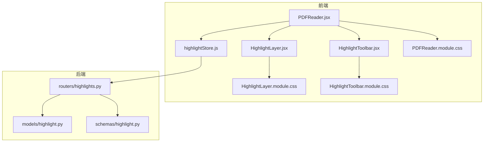
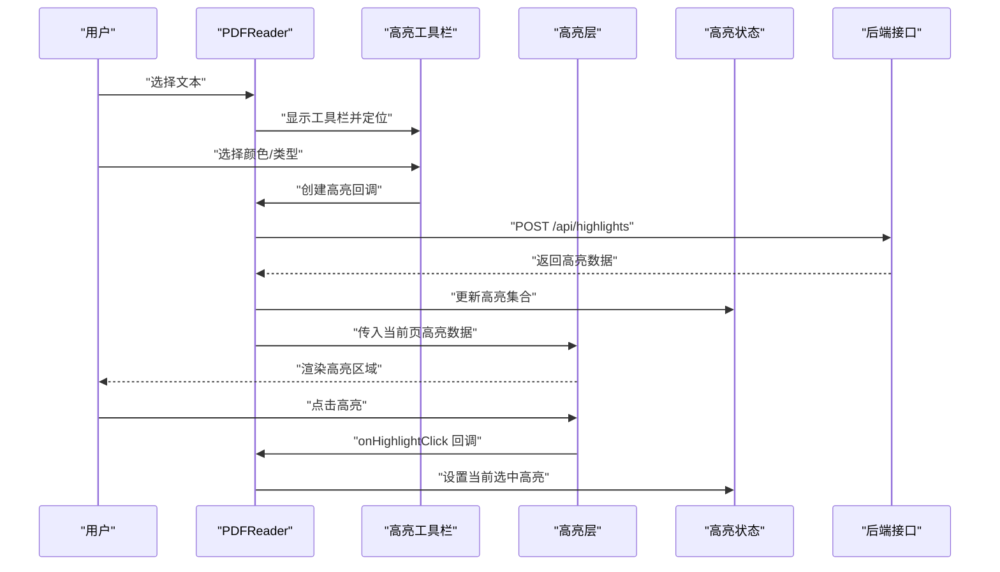
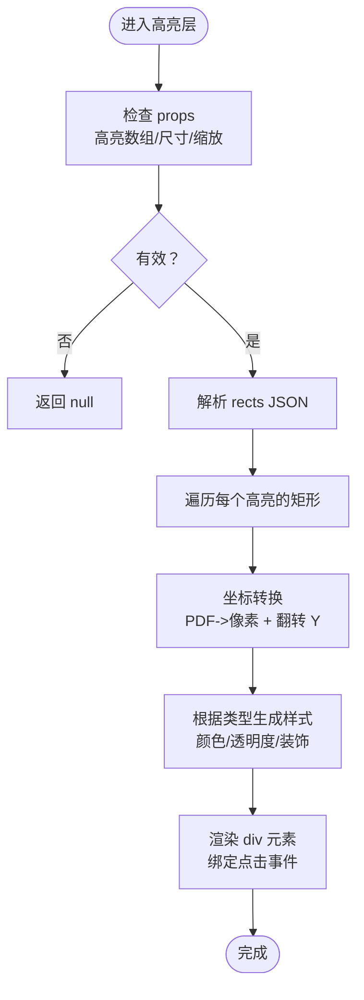
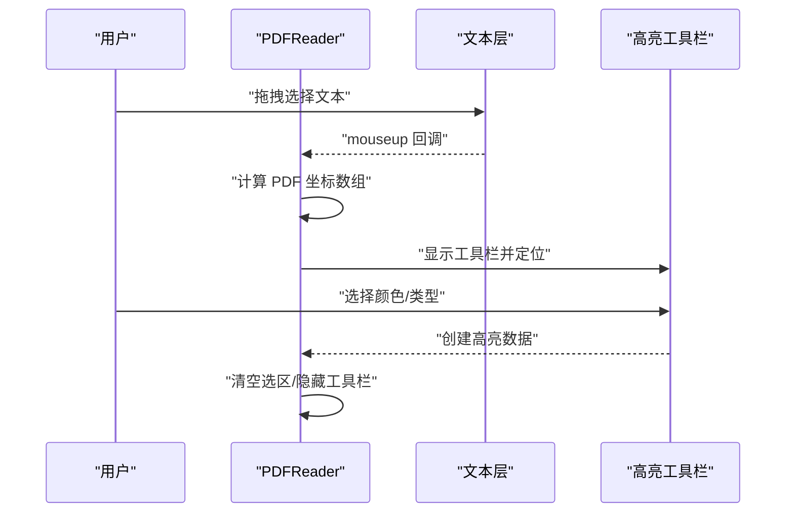
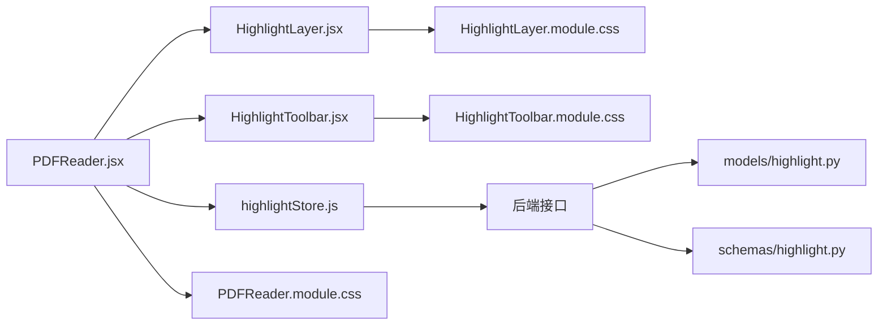

# 高亮层组件

<cite>
**本文引用的文件**
- [HighlightLayer.jsx](file://frontend/src/components/HighlightLayer/HighlightLayer.jsx)
- [HighlightLayer.module.css](file://frontend/src/components/HighlightLayer/HighlightLayer.module.css)
- [PDFReader.jsx](file://frontend/src/components/PDFReader/PDFReader.jsx)
- [PDFReader.module.css](file://frontend/src/components/PDFReader/PDFReader.module.css)
- [HighlightToolbar.jsx](file://frontend/src/components/HighlightToolbar/HighlightToolbar.jsx)
- [HighlightToolbar.module.css](file://frontend/src/components/HighlightToolbar/HighlightToolbar.module.css)
- [highlightStore.js](file://frontend/src/stores/highlightStore.js)
- [highlight.py](file://backend/app/models/highlight.py)
- [highlight.py (schema)](file://backend/app/schemas/highlight.py)
- [highlights.py](file://backend/app/routers/highlights.py)
</cite>

## 目录
1. [简介](#简介)
2. [项目结构](#项目结构)
3. [核心组件](#核心组件)
4. [架构总览](#架构总览)
5. [详细组件分析](#详细组件分析)
6. [依赖关系分析](#依赖关系分析)
7. [性能考量](#性能考量)
8. [故障排查指南](#故障排查指南)
9. [结论](#结论)
10. [附录](#附录)

## 简介
本文件围绕“高亮层组件”进行系统化技术文档整理，重点覆盖以下方面：
- 高亮区域绘制机制（SVG/绝对定位层）
- PDF 坐标与页面像素坐标之间的转换
- 高亮数据结构与渲染优化策略
- 高亮点击处理与交互反馈
- 层级管理、透明度控制、动画与响应式适配
- 性能优化、内存管理与渲染效率提升
- 可定制性设计、主题支持与无障碍访问建议

## 项目结构
高亮层组件位于前端组件目录中，配合 PDF 阅读器、高亮工具栏与全局状态管理共同工作，后端提供高亮数据的增删改查接口。

图表来源
- [PDFReader.jsx:1-656](file://frontend/src/components/PDFReader/PDFReader.jsx#L1-L656)
- [HighlightLayer.jsx:1-119](file://frontend/src/components/HighlightLayer/HighlightLayer.jsx#L1-L119)
- [HighlightToolbar.jsx:1-210](file://frontend/src/components/HighlightToolbar/HighlightToolbar.jsx#L1-L210)
- [highlightStore.js:1-102](file://frontend/src/stores/highlightStore.js#L1-L102)
- [highlights.py:1-189](file://backend/app/routers/highlights.py#L1-L189)
- [highlight.py:1-37](file://backend/app/models/highlight.py#L1-L37)
- [highlight.py (schema):1-37](file://backend/app/schemas/highlight.py#L1-L37)

章节来源
- [PDFReader.jsx:1-656](file://frontend/src/components/PDFReader/PDFReader.jsx#L1-L656)
- [HighlightLayer.jsx:1-119](file://frontend/src/components/HighlightLayer/HighlightLayer.jsx#L1-L119)
- [HighlightToolbar.jsx:1-210](file://frontend/src/components/HighlightToolbar/HighlightToolbar.jsx#L1-L210)
- [highlightStore.js:1-102](file://frontend/src/stores/highlightStore.js#L1-L102)
- [highlights.py:1-189](file://backend/app/routers/highlights.py#L1-L189)
- [highlight.py:1-37](file://backend/app/models/highlight.py#L1-L37)
- [highlight.py (schema):1-37](file://backend/app/schemas/highlight.py#L1-L37)

## 核心组件
- 高亮层组件：负责在 PDF 页面上叠加一层绝对定位的高亮区域，支持多种高亮类型（实心、下划线、删除线），并处理点击事件。
- PDF 阅读器：承载 PDF 渲染、文本选择、坐标转换、高亮工具栏弹出与高亮层挂载。
- 高亮工具栏：提供颜色选择、操作按钮与阅读辅助入口。
- 全局状态：集中管理高亮集合、当前选中高亮、加载与错误状态，并通过 API 与后端交互。
- 后端接口：提供高亮的增删改查接口，模型与序列化定义清晰。

章节来源
- [HighlightLayer.jsx:1-119](file://frontend/src/components/HighlightLayer/HighlightLayer.jsx#L1-L119)
- [PDFReader.jsx:1-656](file://frontend/src/components/PDFReader/PDFReader.jsx#L1-L656)
- [HighlightToolbar.jsx:1-210](file://frontend/src/components/HighlightToolbar/HighlightToolbar.jsx#L1-L210)
- [highlightStore.js:1-102](file://frontend/src/stores/highlightStore.js#L1-L102)
- [highlights.py:1-189](file://backend/app/routers/highlights.py#L1-L189)

## 架构总览
高亮层组件采用“分层叠加”的思路：在 react-pdf 的 Page 上方叠加一个绝对定位的层，将后端返回的 PDF 坐标转换为页面像素坐标，逐个绘制高亮矩形或应用特殊样式（下划线/删除线）。点击事件由高亮层捕获并回调至父组件，实现选中态与后续操作。

图表来源
- [PDFReader.jsx:192-261](file://frontend/src/components/PDFReader/PDFReader.jsx#L192-L261)
- [HighlightLayer.jsx:105-110](file://frontend/src/components/HighlightLayer/HighlightLayer.jsx#L105-L110)
- [highlightStore.js:27-44](file://frontend/src/stores/highlightStore.js#L27-L44)
- [highlights.py:58-106](file://backend/app/routers/highlights.py#L58-L106)

## 详细组件分析

### 高亮层组件（HighlightLayer）
- 功能职责
  - 接收当前页高亮数组、缩放比例、页面原始宽高、当前选中高亮以及点击回调。
  - 将后端存储的 PDF 坐标（左下原点）转换为页面像素坐标（左上原点），并翻转 Y 轴。
  - 根据高亮类型返回不同样式：实心高亮、下划线、删除线；激活态与悬停态有不同透明度与边框。
  - 对每个高亮的多个矩形进行映射渲染，点击事件冒泡到父组件处理。
- 数据结构
  - 高亮对象包含：页码、颜色、类型、选中文本、PDF 坐标数组（JSON 字符串）。
  - 坐标转换函数将 JSON 字符串解析为矩形数组，再按缩放比例映射到像素坐标。
- 样式与交互
  - 高亮层整体禁用指针事件，使点击透传给文字层；单个高亮启用指针事件以接收点击。
  - 通过 CSS 过渡实现透明度变化，激活态带边框强调。
  - 不同高亮类型使用混合模式与背景/边框/文本装饰属性实现视觉差异。
- 性能要点
  - 仅在存在高亮且页面尺寸有效时渲染；对每个高亮的矩形逐一计算位置与样式。
  - 建议在父组件按页裁剪高亮数据，避免不必要的渲染。

图表来源
- [HighlightLayer.jsx:68-115](file://frontend/src/components/HighlightLayer/HighlightLayer.jsx#L68-L115)

章节来源
- [HighlightLayer.jsx:1-119](file://frontend/src/components/HighlightLayer/HighlightLayer.jsx#L1-L119)
- [HighlightLayer.module.css:1-40](file://frontend/src/components/HighlightLayer/HighlightLayer.module.css#L1-L40)

### PDF 阅读器（PDFReader）
- 文本选择与坐标转换
  - 通过浏览器 Selection API 获取客户端矩形，结合页面尺寸与缩放比例反推 PDF 坐标。
  - 将多段选区映射为 PDF 坐标数组，作为高亮创建的数据来源。
- 高亮层挂载
  - 在单页模式与滚动模式下分别渲染高亮层，传入当前页高亮、缩放比例与页面尺寸。
- 工具栏与阅读辅助
  - 选中文本后弹出高亮工具栏，支持颜色选择、下划线、术语解释、摘要、翻译、保存为知识卡片等。
- 性能与懒加载
  - 滚动模式使用 IntersectionObserver 预加载邻近页面，减少首屏压力。
  - 页面占位符保持布局稳定，避免滚动抖动。

图表来源
- [PDFReader.jsx:192-261](file://frontend/src/components/PDFReader/PDFReader.jsx#L192-L261)
- [PDFReader.jsx:380-481](file://frontend/src/components/PDFReader/PDFReader.jsx#L380-L481)

章节来源
- [PDFReader.jsx:1-656](file://frontend/src/components/PDFReader/PDFReader.jsx#L1-L656)
- [PDFReader.module.css:1-350](file://frontend/src/components/PDFReader/PDFReader.module.css#L1-L350)

### 高亮工具栏（HighlightToolbar）
- 功能职责
  - 提供预设颜色按钮，支持下划线快速创建。
  - 根据选中文本长度动态展示术语解释或长文本摘要/翻译等按钮。
  - 支持点击外部关闭与边界检测，确保工具栏始终在视口内。
- 样式与动画
  - 使用固定定位与 backdrop-filter 实现半透明背景与淡入动画。
  - 按钮 hover/active 状态具备过渡与阴影变化，提升交互反馈。

章节来源
- [HighlightToolbar.jsx:1-210](file://frontend/src/components/HighlightToolbar/HighlightToolbar.jsx#L1-L210)
- [HighlightToolbar.module.css:1-88](file://frontend/src/components/HighlightToolbar/HighlightToolbar.module.css#L1-L88)

### 全局高亮状态（Zustand Store）
- 能力概览
  - 加载论文高亮、创建、更新、删除、设置当前选中高亮、清空与错误清理。
  - 与后端 API 交互，统一错误处理与 loading 状态。
- 与组件协作
  - PDFReader 通过回调将创建高亮数据提交至 Store，Store 再调用后端接口并更新本地状态。
  - 高亮层通过 onHighlightClick 与 Store 的 activeHighlight 协作实现选中态联动。

章节来源
- [highlightStore.js:1-102](file://frontend/src/stores/highlightStore.js#L1-L102)

### 后端高亮模型与接口
- 模型字段
  - 包含论文 ID、用户 ID、页码、PDF 坐标（JSON 字符串）、颜色、类型、选中文本、时间戳等。
- 接口能力
  - 获取论文高亮列表、创建高亮、更新高亮、删除高亮。
  - 均包含用户鉴权与资源归属校验，确保数据安全。

章节来源
- [highlight.py:1-37](file://backend/app/models/highlight.py#L1-L37)
- [highlight.py (schema):1-37](file://backend/app/schemas/highlight.py#L1-L37)
- [highlights.py:1-189](file://backend/app/routers/highlights.py#L1-L189)

## 依赖关系分析
- 组件耦合
  - PDFReader 与 HighlightLayer 强耦合：前者负责坐标转换与数据准备，后者负责渲染与交互。
  - HighlightToolbar 与 PDFReader 松耦合：通过回调解耦，便于复用。
  - highlightStore 与后端接口解耦：通过统一 API 调用，便于替换与测试。
- 外部依赖
  - react-pdf：提供 PDF 渲染与文本层。
  - pdfjs-dist：提供 Worker 与版本号。
  - @tanstack/react-virtual：用于聊天页虚拟滚动（与高亮层无直接关系）。

图表来源
- [PDFReader.jsx:1-656](file://frontend/src/components/PDFReader/PDFReader.jsx#L1-L656)
- [HighlightLayer.jsx:1-119](file://frontend/src/components/HighlightLayer/HighlightLayer.jsx#L1-L119)
- [HighlightToolbar.jsx:1-210](file://frontend/src/components/HighlightToolbar/HighlightToolbar.jsx#L1-L210)
- [highlightStore.js:1-102](file://frontend/src/stores/highlightStore.js#L1-L102)
- [highlights.py:1-189](file://backend/app/routers/highlights.py#L1-L189)

章节来源
- [PDFReader.jsx:1-656](file://frontend/src/components/PDFReader/PDFReader.jsx#L1-L656)
- [HighlightLayer.jsx:1-119](file://frontend/src/components/HighlightLayer/HighlightLayer.jsx#L1-L119)
- [HighlightToolbar.jsx:1-210](file://frontend/src/components/HighlightToolbar/HighlightToolbar.jsx#L1-L210)
- [highlightStore.js:1-102](file://frontend/src/stores/highlightStore.js#L1-L102)
- [highlights.py:1-189](file://backend/app/routers/highlights.py#L1-L189)

## 性能考量
- 渲染优化
  - 仅在高亮存在且页面尺寸有效时渲染高亮层，避免空渲染。
  - 按页裁剪高亮数据，减少不必要的 DOM 节点数量。
  - 使用 CSS 过渡而非复杂动画，降低重排开销。
- 坐标转换
  - 将 JSON 解析与坐标转换放在组件内部，避免重复计算；如需进一步优化，可在父组件缓存解析结果。
- 交互与事件
  - 高亮层整体禁用指针事件，点击透传至文字层，减少事件处理负担。
  - 点击事件仅在高亮元素上生效，避免无关节点的事件监听。
- 懒加载与滚动
  - 滚动模式下使用 IntersectionObserver 预加载页面，减少首屏压力。
  - 页面占位符保持布局稳定，避免滚动抖动带来的额外重绘。
- 主题与响应式
  - 使用 CSS 变量与媒体查询，确保在不同设备与主题下表现一致。
  - 高亮层的 z-index 与 pointer-events 设计保证层级正确与交互流畅。

[本节为通用性能建议，无需特定文件引用]

## 故障排查指南
- 高亮不显示
  - 检查 props：高亮数组是否为空、页面宽高与缩放比例是否有效。
  - 检查坐标转换：确认 rects JSON 是否可解析，解析失败会记录错误并跳过该高亮。
- 点击无响应
  - 确认高亮层整体禁用指针事件但子元素启用，点击事件是否被父元素阻止冒泡。
  - 确认 onHighlightClick 回调是否正确传递至父组件。
- 样式异常
  - 检查 CSS 变量与主题配置，确保 --accent-border、--color-* 等变量可用。
  - 确认不同高亮类型的样式类名与 data-type 属性是否正确应用。
- 后端交互失败
  - 查看 Store 中的错误状态与提示，确认请求路径、鉴权与资源归属校验是否通过。
  - 检查后端接口返回的错误信息与状态码。

章节来源
- [HighlightLayer.jsx:82-87](file://frontend/src/components/HighlightLayer/HighlightLayer.jsx#L82-L87)
- [HighlightLayer.jsx:105-110](file://frontend/src/components/HighlightLayer/HighlightLayer.jsx#L105-L110)
- [highlightStore.js:17-23](file://frontend/src/stores/highlightStore.js#L17-L23)
- [highlights.py:35-55](file://backend/app/routers/highlights.py#L35-L55)

## 结论
高亮层组件通过“坐标转换 + 绝对定位 + 类型化样式”的方式实现了对 PDF 高亮的高效渲染与交互。其设计遵循“低耦合、可扩展、可维护”的原则：父组件负责数据与坐标转换，高亮层专注渲染与事件，工具栏与状态管理分别承担交互入口与数据一致性。配合后端完善的鉴权与接口能力，整体方案在功能完整性与性能稳定性之间取得良好平衡。

[本节为总结性内容，无需特定文件引用]

## 附录

### 数据模型与接口对照
- 高亮模型字段
  - id、paper_id、user_id、page、rects（JSON 字符串）、color、highlight_type、selected_text、created_at、updated_at
- 创建高亮请求体
  - paper_id、page、rects（JSON 字符串）、color、highlight_type、selected_text
- 更新高亮请求体
  - color、highlight_type
- 高亮列表响应
  - id、paper_id、user_id、page、rects、color、highlight_type、selected_text、created_at、updated_at

章节来源
- [highlight.py:1-37](file://backend/app/models/highlight.py#L1-L37)
- [highlight.py (schema):1-37](file://backend/app/schemas/highlight.py#L1-L37)
- [highlights.py:20-55](file://backend/app/routers/highlights.py#L20-L55)
- [highlights.py:58-106](file://backend/app/routers/highlights.py#L58-L106)
- [highlights.py:108-152](file://backend/app/routers/highlights.py#L108-L152)
- [highlights.py:154-186](file://backend/app/routers/highlights.py#L154-L186)