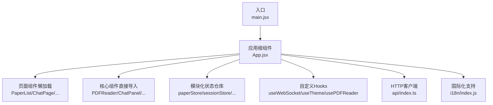
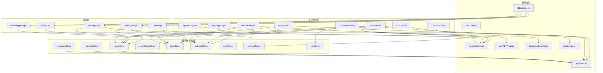
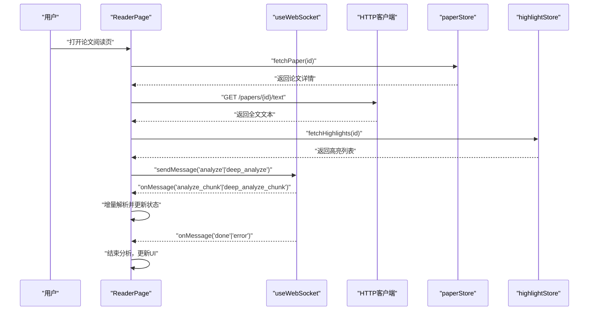
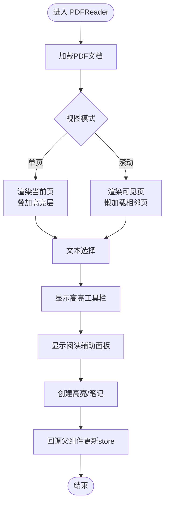
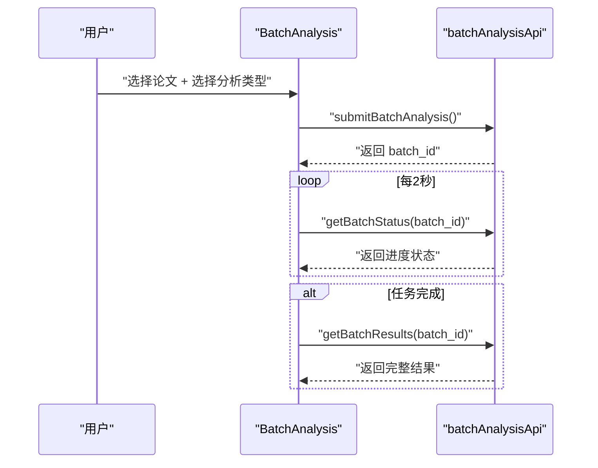
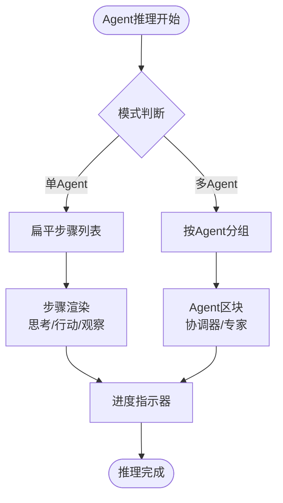
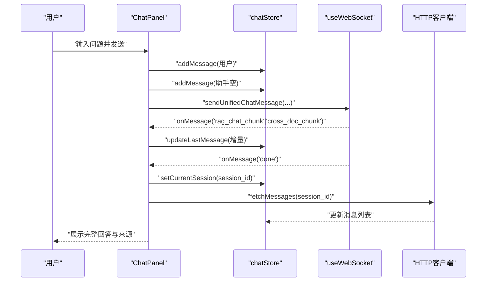
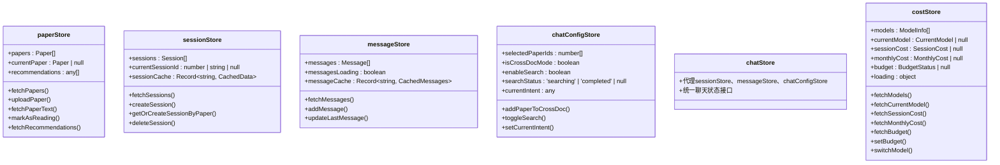
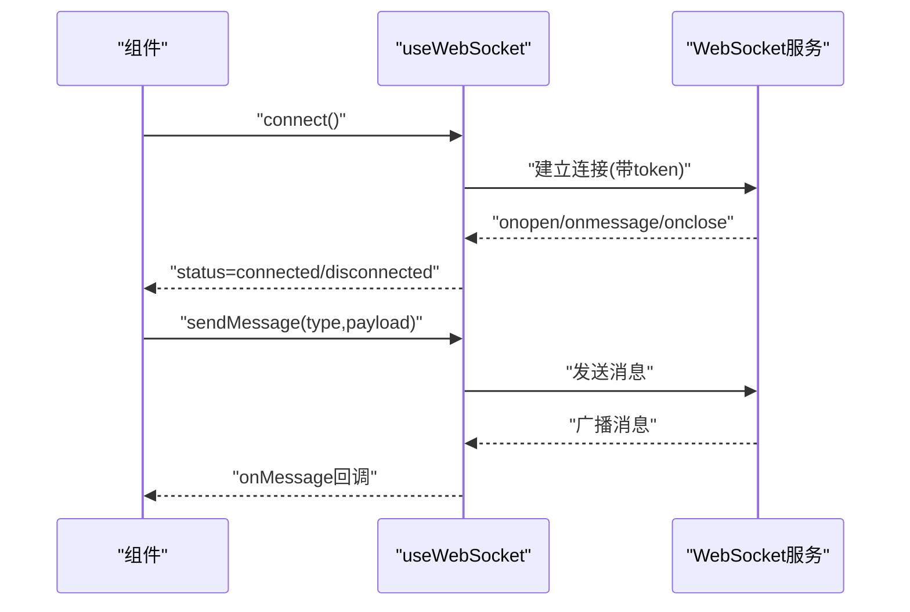
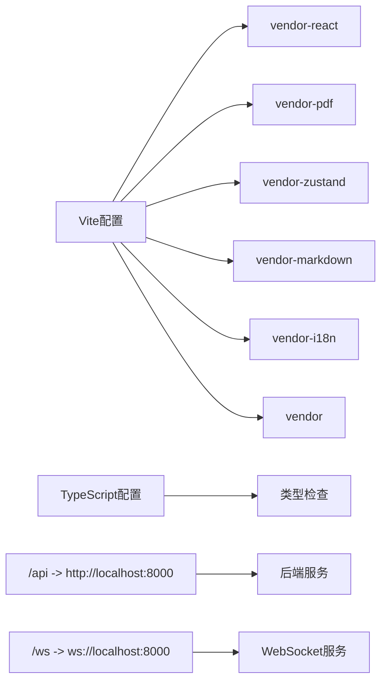

# 前端系统

<cite>
**本文引用的文件**
- [main.jsx](file://frontend/src/main.jsx)
- [App.jsx](file://frontend/src/App.jsx)
- [package.json](file://frontend/package.json)
- [vite.config.js](file://frontend/vite.config.js)
- [tsconfig.json](file://frontend/tsconfig.json)
- [api/index.ts](file://frontend/src/api/index.ts)
- [api/chatApi.ts](file://frontend/src/api/chatApi.ts)
- [api/paperApi.ts](file://frontend/src/api/paperApi.ts)
- [api/knowledgeApi.ts](file://frontend/src/api/knowledgeApi.ts)
- [api/writingApi.ts](file://frontend/src/api/writingApi.ts)
- [api/batchAnalysisApi.ts](file://frontend/src/api/batchAnalysisApi.ts)
- [api/citationApi.ts](file://frontend/src/api/citationApi.ts)
- [hooks/useWebSocket.js](file://frontend/src/hooks/useWebSocket.js)
- [hooks/useTheme.js](file://frontend/src/hooks/useTheme.js)
- [hooks/usePDFReader.js](file://frontend/src/hooks/usePDFReader.js)
- [stores/authStore.ts](file://frontend/src/stores/authStore.ts)
- [stores/paperStore.ts](file://frontend/src/stores/paperStore.ts)
- [stores/sessionStore.ts](file://frontend/src/stores/sessionStore.ts)
- [stores/messageStore.ts](file://frontend/src/stores/messageStore.ts)
- [stores/chatConfigStore.ts](file://frontend/src/stores/chatConfigStore.ts)
- [stores/chatStore.ts](file://frontend/src/stores/chatStore.ts)
- [stores/highlightStore.ts](file://frontend/src/stores/highlightStore.ts)
- [stores/noteStore.ts](file://frontend/src/stores/noteStore.ts)
- [stores/knowledgeStore.ts](file://frontend/src/stores/knowledgeStore.ts)
- [stores/writingStore.ts](file://frontend/src/stores/writingStore.ts)
- [stores/agentStore.ts](file://frontend/src/stores/agentStore.ts)
- [stores/settingsStore.ts](file://frontend/src/stores/settingsStore.ts)
- [stores/toastStore.ts](file://frontend/src/stores/toastStore.ts)
- [stores/costStore.ts](file://frontend/src/stores/costStore.ts)
- [i18n/index.js](file://frontend/src/i18n/index.js)
- [i18n/locales/zh.json](file://frontend/src/i18n/locales/zh.json)
- [i18n/locales/en.json](file://frontend/src/i18n/locales/en.json)
- [components/PDFReader/PDFReader.jsx](file://frontend/src/components/PDFReader/PDFReader.jsx)
- [components/PDFReader/usePDFReader.js](file://frontend/src/hooks/usePDFReader.js)
- [components/ChatPanel/ChatPanel.jsx](file://frontend/src/components/ChatPanel/ChatPanel.jsx)
- [components/NotePanel/NotePanel.jsx](file://frontend/src/components/NotePanel/NotePanel.jsx)
- [components/HighlightLayer/HighlightLayer.jsx](file://frontend/src/components/HighlightLayer/HighlightLayer.jsx)
- [components/BatchAnalysis/BatchAnalysis.jsx](file://frontend/src/components/BatchAnalysis/BatchAnalysis.jsx)
- [components/Cost/CostDashboard.jsx](file://frontend/src/components/Cost/CostDashboard.jsx)
- [components/Citations/CitationExport.jsx](file://frontend/src/components/Citations/CitationExport.jsx)
- [components/AgentProgress/AgentProgress.jsx](file://frontend/src/components/AgentProgress/AgentProgress.jsx)
- [components/ChatPage/AgentProgress.jsx](file://frontend/src/components/ChatPage/AgentProgress.jsx)
- [components/ChatPage/BatchProgress.jsx](file://frontend/src/components/ChatPage/BatchProgress.jsx)
</cite>

## 更新摘要
**所做更改**
- 新增批量分析功能，支持批量摘要、对比分析、文献综述三种模式
- 新增成本仪表板，提供月度费用统计、预算管理、Token使用监控
- 新增引用导出功能，支持多种引用格式（BibTeX、RIS、APA、MLA、Chicago、GB/T 7714）
- 新增Agent进度可视化，支持单Agent和多Agent协作模式的步骤追踪
- 增强PDF阅读器，新增usePDFReader Hook和多项阅读辅助功能
- 新增批量分析进度面板和成本确认对话框组件

## 目录
1. [简介](#简介)
2. [项目结构](#项目结构)
3. [核心组件](#核心组件)
4. [架构总览](#架构总览)
5. [详细组件分析](#详细组件分析)
6. [依赖关系分析](#依赖关系分析)
7. [性能考量](#性能考量)
8. [故障排查指南](#故障排查指南)
9. [结论](#结论)
10. [附录](#附录)

## 简介
本文件为 PaperChat 前端系统的全面技术文档，面向 React 19 + TypeScript 应用，聚焦于模块化的状态管理架构、增强的聊天界面组件、国际化支持、路由配置、页面组件组织、UI 组件系统（PDF 阅读器、聊天面板、高亮标注、笔记管理、知识库等）、Zustand 状态管理、自定义 Hooks（WebSocket 连接管理、主题切换、PDF阅读器Hook）、组件间通信与事件处理、以及响应式设计与性能优化策略。

## 项目结构
- **构建与运行**
  - 使用 Vite 作为构建工具，支持 TypeScript 编译和国际化配置
  - TypeScript 配置支持 ES2020 目标、严格模式和 JSX 编译
  - 依赖管理：React 19、React Router DOM 7、Zustand 5、i18next 国际化、react-pdf/pdfjs-dist、axios、react-markdown、framer-motion 等
- **目录组织**
  - src/api：TypeScript 类型安全的 HTTP 客户端封装（axios 实例）
  - src/stores：模块化的 Zustand 状态仓库，按领域拆分（认证、论文、会话、消息、聊天配置、高亮、笔记、知识库、写作、Agent、成本等）
  - src/components：可复用 UI 组件（PDFReader、ChatPanel、NotePanel、HighlightLayer、ChatPage子组件、BatchAnalysis、Cost、Citations等）
  - src/hooks：自定义 Hooks（WebSocket、主题初始化与切换、PDF阅读器状态管理）
  - src/pages：页面级组件（PaperList、ChatPage、WritingPage、KnowledgePage、SettingsPage 等），采用懒加载与 Suspense
  - src/utils：通用工具（Markdown 渲染器）
  - src/i18n：国际化支持，包含中英文资源文件
  - public：静态资源
- **路由与入口**
  - 入口文件创建根节点并包裹 BrowserRouter；App.jsx 定义路由与页面级布局，核心阅读页面直接导入，其余页面懒加载

**图表来源**
- [main.jsx:1-15](file://frontend/src/main.jsx#L1-L15)
- [App.jsx:1-800](file://frontend/src/App.jsx#L1-L800)
- [vite.config.js:1-54](file://frontend/vite.config.js#L1-L54)
- [tsconfig.json:1-22](file://frontend/tsconfig.json#L1-L22)

**章节来源**
- [main.jsx:1-15](file://frontend/src/main.jsx#L1-L15)
- [App.jsx:1-800](file://frontend/src/App.jsx#L1-L800)
- [package.json:1-47](file://frontend/package.json#L1-L47)
- [vite.config.js:1-54](file://frontend/vite.config.js#L1-L54)
- [tsconfig.json:1-22](file://frontend/tsconfig.json#L1-L22)

## 核心组件
- **路由与页面组织**
  - 使用 React Router v7 的 Routes/Route/Navigate，页面组件采用 React.lazy 与 Suspense 实现代码分割与加载态展示
  - 核心阅读页面（PDF 阅读与分析）在 App.jsx 中集中管理，其他页面按需懒加载
- **模块化状态管理（Zustand）**
  - paperStore：论文列表、详情、上传、删除、全文文本、推荐、关键词提取、批处理上传等
  - sessionStore：会话管理、缓存机制、跨文档会话、会话列表缓存
  - messageStore：消息管理、分页加载、流式消息、消息缓存
  - chatConfigStore：聊天配置、跨文档问答、联网搜索、意图检测
  - chatStore：状态代理层，整合 sessionStore、messageStore、chatConfigStore
  - highlightStore：高亮的增删改查、激活状态、清理
  - authStore：个人使用模式下的"始终已登录"模拟
  - settingsStore：外观设置（主题、字号、紧凑模式）由 useTheme Hook 应用
  - costStore：成本管理，包括模型列表、当前模型、会话费用、月度费用、预算状态
- **国际化支持**
  - 使用 i18next 框架，支持中英文双语
  - 自动语言检测，fallback 到中文
  - 资源文件包含通用词汇、导航、聊天、论文、错误等分类
- **自定义 Hooks**
  - useWebSocket：全局 WebSocket 连接、消息订阅、重连、发送统一消息（RAG、跨文档、统一聊天、取消）
  - useTheme：主题、字号、紧凑模式的持久化与初始化应用
  - usePDFReader：PDF阅读器状态管理，包括页面导航、缩放、文本选择、高亮、阅读辅助
- **API 客户端**
  - TypeScript 类型安全的 axios 实例，baseURL 指向 /api，统一处理 JSON 请求头
  - 新增批量分析API、引用导出API、成本管理API

**章节来源**
- [App.jsx:1-800](file://frontend/src/App.jsx#L1-L800)
- [stores/paperStore.ts:1-390](file://frontend/src/stores/paperStore.ts#L1-L390)
- [stores/sessionStore.ts:1-316](file://frontend/src/stores/sessionStore.ts#L1-L316)
- [stores/messageStore.ts:1-273](file://frontend/src/stores/messageStore.ts#L1-L273)
- [stores/chatConfigStore.ts:1-186](file://frontend/src/stores/chatConfigStore.ts#L1-L186)
- [stores/chatStore.ts:1-150](file://frontend/src/stores/chatStore.ts#L1-L150)
- [stores/highlightStore.ts:1-102](file://frontend/src/stores/highlightStore.ts#L1-L102)
- [stores/authStore.ts:1-23](file://frontend/src/stores/authStore.ts#L1-L23)
- [stores/costStore.ts:1-136](file://frontend/src/stores/costStore.ts#L1-L136)
- [hooks/useWebSocket.js:1-180](file://frontend/src/hooks/useWebSocket.js#L1-L180)
- [hooks/useTheme.js:1-91](file://frontend/src/hooks/useTheme.js#L1-L91)
- [hooks/usePDFReader.js:1-297](file://frontend/src/hooks/usePDFReader.js#L1-L297)
- [api/index.ts:1-12](file://frontend/src/api/index.ts#L1-L12)
- [api/batchAnalysisApi.ts:1-74](file://frontend/src/api/batchAnalysisApi.ts#L1-L74)
- [api/citationApi.ts](file://frontend/src/api/citationApi.ts)
- [i18n/index.js:1-22](file://frontend/src/i18n/index.js#L1-L22)

## 架构总览
整体采用"页面级组件 + 核心组件 + 模块化状态仓库 + 自定义 Hooks + 国际化"的分层架构。页面负责路由与布局，核心组件负责具体交互（PDF 阅读、聊天、高亮、笔记、批量分析、成本管理、引用导出），Zustand 提供跨层级的状态共享，自定义 Hooks 抽离网络与主题等横切关注点，i18n 提供国际化支持。

**图表来源**
- [App.jsx:1-800](file://frontend/src/App.jsx#L1-L800)
- [components/PDFReader/PDFReader.jsx:1-662](file://frontend/src/components/PDFReader/PDFReader.jsx#L1-L662)
- [components/ChatPanel/ChatPanel.jsx:1-678](file://frontend/src/components/ChatPanel/ChatPanel.jsx#L1-L678)
- [components/NotePanel/NotePanel.jsx:1-275](file://frontend/src/components/NotePanel/NotePanel.jsx#L1-L275)
- [components/HighlightLayer/HighlightLayer.jsx:1-119](file://frontend/src/components/HighlightLayer/HighlightLayer.jsx#L1-L119)
- [components/BatchAnalysis/BatchAnalysis.jsx:1-320](file://frontend/src/components/BatchAnalysis/BatchAnalysis.jsx#L1-L320)
- [components/Cost/CostDashboard.jsx:1-164](file://frontend/src/components/Cost/CostDashboard.jsx#L1-L164)
- [components/Citations/CitationExport.jsx:1-242](file://frontend/src/components/Citations/CitationExport.jsx#L1-L242)
- [components/AgentProgress/AgentProgress.jsx:1-219](file://frontend/src/components/AgentProgress/AgentProgress.jsx#L1-L219)
- [components/ChatPage/AgentProgress.jsx:1-315](file://frontend/src/components/ChatPage/AgentProgress.jsx#L1-L315)
- [stores/paperStore.ts:1-390](file://frontend/src/stores/paperStore.ts#L1-L390)
- [stores/sessionStore.ts:1-316](file://frontend/src/stores/sessionStore.ts#L1-L316)
- [stores/messageStore.ts:1-273](file://frontend/src/stores/messageStore.ts#L1-L273)
- [stores/chatConfigStore.ts:1-186](file://frontend/src/stores/chatConfigStore.ts#L1-L186)
- [stores/chatStore.ts:1-150](file://frontend/src/stores/chatStore.ts#L1-L150)
- [stores/highlightStore.ts:1-102](file://frontend/src/stores/highlightStore.ts#L1-L102)
- [stores/costStore.ts:1-136](file://frontend/src/stores/costStore.ts#L1-L136)
- [hooks/useWebSocket.js:1-180](file://frontend/src/hooks/useWebSocket.js#L1-L180)
- [hooks/useTheme.js:1-91](file://frontend/src/hooks/useTheme.js#L1-L91)
- [hooks/usePDFReader.js:1-297](file://frontend/src/hooks/usePDFReader.js#L1-L297)
- [api/index.ts:1-12](file://frontend/src/api/index.ts#L1-L12)
- [api/batchAnalysisApi.ts:1-74](file://frontend/src/api/batchAnalysisApi.ts#L1-L74)
- [api/citationApi.ts](file://frontend/src/api/citationApi.ts)
- [i18n/index.js:1-22](file://frontend/src/i18n/index.js#L1-L22)

## 详细组件分析

### 路由与页面组织（App.jsx）
- **页面懒加载与加载态**
  - 使用 React.lazy 与 Suspense，PageLoader 提供统一加载反馈
- **核心阅读页面 ReaderPage**
  - 聚合论文数据、高亮、笔记、推荐、分析（章节概述、深度分析）与 Agent 流程
  - 通过 useWebSocket 订阅分析与 Agent 相关消息，实现流式解析与状态更新
  - 支持拖拽调整左右面板宽度，三栏布局
- **页面级状态与副作用**
  - 加载论文详情、全文文本、高亮与笔记；并行请求优化加载体验
  - 分析消息的增量解析与最终合并，避免重复渲染
  - 清理副作用（清理高亮、笔记、推荐、Agent 状态）

**图表来源**
- [App.jsx:134-307](file://frontend/src/App.jsx#L134-L307)
- [App.jsx:421-437](file://frontend/src/App.jsx#L421-L437)
- [hooks/useWebSocket.js:164-178](file://frontend/src/hooks/useWebSocket.js#L164-L178)
- [stores/paperStore.ts:96-123](file://frontend/src/stores/paperStore.ts#L96-L123)
- [stores/highlightStore.ts:10-24](file://frontend/src/stores/highlightStore.ts#L10-L24)

**章节来源**
- [App.jsx:1-800](file://frontend/src/App.jsx#L1-L800)

### PDF 阅读器（PDFReader）
- **功能特性**
  - 基于 react-pdf/pdfjs-dist，支持单页/滚动两种视图模式，键盘快捷键导航，缩放与适配宽度
  - 文本选择与高亮工具栏，术语解释、摘要、翻译等阅读辅助
  - 高亮层叠加渲染，支持多种高亮类型（背景高亮、下划线、删除线）
  - IntersectionObserver 懒加载，滚动模式下减少内存占用
  - 新增 usePDFReader Hook，封装所有非渲染逻辑状态管理
- **数据流**
  - 从父组件接收 highlights、activeHighlight，并在页面加载成功后计算页面尺寸，用于坐标转换
  - 选中文本后计算 PDF 坐标，传递给父组件以创建高亮或笔记

**图表来源**
- [components/PDFReader/PDFReader.jsx:1-662](file://frontend/src/components/PDFReader/PDFReader.jsx#L1-L662)
- [components/HighlightLayer/HighlightLayer.jsx:1-119](file://frontend/src/components/HighlightLayer/HighlightLayer.jsx#L1-L119)
- [hooks/usePDFReader.js:1-297](file://frontend/src/hooks/usePDFReader.js#L1-L297)

**章节来源**
- [components/PDFReader/PDFReader.jsx:1-662](file://frontend/src/components/PDFReader/PDFReader.jsx#L1-L662)
- [components/HighlightLayer/HighlightLayer.jsx:1-119](file://frontend/src/components/HighlightLayer/HighlightLayer.jsx#L1-L119)
- [hooks/usePDFReader.js:1-297](file://frontend/src/hooks/usePDFReader.js#L1-L297)

### 批量分析组件（BatchAnalysis）
- **功能特性**
  - 支持三种分析类型：批量摘要、对比分析、批量综述
  - 实时进度监控，支持任务取消
  - 每篇论文结果展开/折叠查看
  - 2秒轮询更新任务状态
- **数据流**
  - 通过 batchAnalysisApi 与后端交互
  - 使用轮询机制获取任务进度和结果
  - 支持全选/反选论文选择

**图表来源**
- [components/BatchAnalysis/BatchAnalysis.jsx:1-320](file://frontend/src/components/BatchAnalysis/BatchAnalysis.jsx#L1-L320)
- [api/batchAnalysisApi.ts:1-74](file://frontend/src/api/batchAnalysisApi.ts#L1-L74)

**章节来源**
- [components/BatchAnalysis/BatchAnalysis.jsx:1-320](file://frontend/src/components/BatchAnalysis/BatchAnalysis.jsx#L1-L320)
- [api/batchAnalysisApi.ts:1-74](file://frontend/src/api/batchAnalysisApi.ts#L1-L74)

### 成本仪表板（CostDashboard）
- **功能特性**
  - 月度预算进度条显示（已用/预算）
  - 月度总费用、Token统计、调用次数
  - 每日费用趋势柱状图（纯CSS实现）
  - 预算设置与修改功能
- **数据流**
  - 通过 costStore 管理成本状态
  - 支持预算超支警告提示
  - 实时更新费用统计信息

**章节来源**
- [components/Cost/CostDashboard.jsx:1-164](file://frontend/src/components/Cost/CostDashboard.jsx#L1-L164)
- [stores/costStore.ts:1-136](file://frontend/src/stores/costStore.ts#L1-L136)

### 引用导出组件（CitationExport）
- **功能特性**
  - 支持6种引用格式：BibTeX、RIS、APA、MLA、Chicago、GB/T 7714
  - 实时预览引用内容
  - 直接下载文件或复制到剪贴板
  - 同步到Zotero功能（需要配置）
- **数据流**
  - 通过 citationApi 与后端交互
  - 支持Zotero状态检查和同步
  - 错误处理和用户反馈

**章节来源**
- [components/Citations/CitationExport.jsx:1-242](file://frontend/src/components/Citations/CitationExport.jsx#L1-L242)

### Agent进度可视化（AgentProgress）
- **功能特性**
  - 支持单Agent和多Agent协作模式
  - 实时显示Thought/Action/Observation过程
  - 研究阶段自动分组（检索、分析、推荐）
  - 进度条和状态指示器
- **数据流**
  - props驱动的数据展示
  - 支持展开/折叠子Agent区块
  - 自动滚动到最后一步

**图表来源**
- [components/ChatPage/AgentProgress.jsx:1-315](file://frontend/src/components/ChatPage/AgentProgress.jsx#L1-L315)
- [components/AgentProgress/AgentProgress.jsx:1-219](file://frontend/src/components/AgentProgress/AgentProgress.jsx#L1-L219)

**章节来源**
- [components/ChatPage/AgentProgress.jsx:1-315](file://frontend/src/components/ChatPage/AgentProgress.jsx#L1-L315)
- [components/AgentProgress/AgentProgress.jsx:1-219](file://frontend/src/components/AgentProgress/AgentProgress.jsx#L1-L219)

### 聊天面板（ChatPanel）
- **功能特性**
  - 会话管理：新建、切换、删除、自动命名
  - 跨文档问答：选择多篇论文，动态创建跨文档会话
  - 联网搜索：开关控制与状态提示
  - 流式渲染：字符级增量显示，支持引用来源（单文档与跨文档）
  - 引用跳转：点击 [p.X] 或 [论文N,p.X] 跳转到对应页面或论文
  - 新增批量分析进度显示
- **数据流**
  - 通过 useChatStore 管理消息、会话、来源与跨文档状态
  - 通过 useWebSocket 接收 rag_chat_chunk、cross_doc_chunk、search_status、done、error 等消息，驱动 UI 更新

**图表来源**
- [components/ChatPanel/ChatPanel.jsx:1-678](file://frontend/src/components/ChatPanel/ChatPanel.jsx#L1-L678)
- [stores/chatStore.ts:73-147](file://frontend/src/stores/chatStore.ts#L73-L147)
- [hooks/useWebSocket.js:140-154](file://frontend/src/hooks/useWebSocket.js#L140-L154)

**章节来源**
- [components/ChatPanel/ChatPanel.jsx:1-678](file://frontend/src/components/ChatPanel/ChatPanel.jsx#L1-L678)
- [stores/chatStore.ts:1-150](file://frontend/src/stores/chatStore.ts#L1-L150)

### 笔记面板（NotePanel）
- **功能特性**
  - 列表展示、搜索过滤、展开/收起、时间格式化、关联高亮指示
  - 支持添加、编辑、删除笔记，点击笔记跳转到高亮所在页面
- **数据流**
  - 从父组件接收 notes 列表与回调，内部维护搜索与展开状态

**章节来源**
- [components/NotePanel/NotePanel.jsx:1-275](file://frontend/src/components/NotePanel/NotePanel.jsx#L1-L275)

### 高亮层（HighlightLayer）
- **功能特性**
  - 将 PDF 坐标转换为页面像素坐标，叠加渲染高亮区域
  - 支持不同高亮类型（背景、下划线、删除线），并根据是否激活高亮调整透明度
- **数据流**
  - 从 PDFReader 获取当前页高亮集合与页面尺寸，计算并渲染高亮矩形

**章节来源**
- [components/HighlightLayer/HighlightLayer.jsx:1-119](file://frontend/src/components/HighlightLayer/HighlightLayer.jsx#L1-L119)

### 模块化状态管理
- **paperStore**
  - 论文 CRUD、全文文本、推荐、关键词提取、批处理上传、阅读状态标记
  - TypeScript 类型安全，支持缓存机制和错误处理
- **sessionStore**
  - 会话管理、缓存机制、跨文档会话、会话列表缓存
  - 支持按论文 ID 缓存和强制刷新机制
- **messageStore**
  - 消息管理、分页加载、流式消息、消息缓存
  - 支持增量加载和缓存失效机制
- **chatConfigStore**
  - 聊天配置、跨文档问答、联网搜索、意图检测
  - 独立的配置状态管理，便于测试和维护
- **chatStore（代理层）**
  - 整合 sessionStore、messageStore、chatConfigStore
  - 提供统一的聊天状态访问接口
- **highlightStore**
  - 高亮 CRUD、激活状态、清理
- **authStore**
  - 个人使用模式下的"始终已登录"模拟
- **settingsStore + useTheme**
  - 主题、字号、紧凑模式持久化与初始化应用
- **costStore**
  - 成本管理：模型列表、当前模型、会话费用、月度费用、预算状态
  - 支持加载状态管理和异步操作

**图表来源**
- [stores/paperStore.ts:18-52](file://frontend/src/stores/paperStore.ts#L18-L52)
- [stores/sessionStore.ts:17-39](file://frontend/src/stores/sessionStore.ts#L17-L39)
- [stores/messageStore.ts:17-44](file://frontend/src/stores/messageStore.ts#L17-L44)
- [stores/chatConfigStore.ts:3-39](file://frontend/src/stores/chatConfigStore.ts#L3-L39)
- [stores/chatStore.ts:7-71](file://frontend/src/stores/chatStore.ts#L7-L71)
- [stores/costStore.ts:10-38](file://frontend/src/stores/costStore.ts#L10-L38)

**章节来源**
- [stores/paperStore.ts:1-390](file://frontend/src/stores/paperStore.ts#L1-L390)
- [stores/sessionStore.ts:1-316](file://frontend/src/stores/sessionStore.ts#L1-L316)
- [stores/messageStore.ts:1-273](file://frontend/src/stores/messageStore.ts#L1-L273)
- [stores/chatConfigStore.ts:1-186](file://frontend/src/stores/chatConfigStore.ts#L1-L186)
- [stores/chatStore.ts:1-150](file://frontend/src/stores/chatStore.ts#L1-L150)
- [stores/highlightStore.ts:1-102](file://frontend/src/stores/highlightStore.ts#L1-L102)
- [stores/authStore.ts:1-23](file://frontend/src/stores/authStore.ts#L1-L23)
- [stores/costStore.ts:1-136](file://frontend/src/stores/costStore.ts#L1-L136)

### 国际化支持（i18n）
- **框架集成**
  - 使用 i18next + react-i18next 框架
  - 自动语言检测，支持中文（fallback）和英文
  - 资源文件按功能模块组织
- **资源文件结构**
  - common：通用词汇（加载中、错误、重试、取消、确认、保存、删除、搜索、无数据、关闭）
  - nav：导航菜单（聊天、论文库、知识库、写作辅助、设置、个人工作区、系统设置）
  - chat：聊天功能（新建对话、输入占位符、发送）
  - paper：论文相关（上传论文、正在分析、论文分析）
  - error：错误提示（网络错误、服务器错误、未知错误）
- **初始化配置**
  - 在 main.jsx 中初始化国际化
  - 支持插值和转义配置

**章节来源**
- [i18n/index.js:1-22](file://frontend/src/i18n/index.js#L1-L22)
- [i18n/locales/zh.json:1-39](file://frontend/src/i18n/locales/zh.json#L1-L39)
- [i18n/locales/en.json:1-39](file://frontend/src/i18n/locales/en.json#L1-L39)
- [main.jsx:5](file://frontend/src/main.jsx#L5)

### 自定义 Hooks
- **useWebSocket**
  - 全局 WebSocket 连接、消息订阅（支持通配符）、重连策略、发送统一消息（RAG、跨文档、统一聊天、取消）
- **useTheme**
  - 主题、字号、紧凑模式的持久化与初始化应用，避免闪烁
- **usePDFReader**
  - PDF阅读器状态管理 Hook，封装页面导航、缩放、文本选中、高亮、阅读辅助面板等逻辑
  - 支持单页/滚动视图模式、IntersectionObserver 懒加载、键盘快捷键

**图表来源**
- [hooks/useWebSocket.js:1-180](file://frontend/src/hooks/useWebSocket.js#L1-L180)
- [hooks/usePDFReader.js:1-297](file://frontend/src/hooks/usePDFReader.js#L1-L297)

**章节来源**
- [hooks/useWebSocket.js:1-180](file://frontend/src/hooks/useWebSocket.js#L1-L180)
- [hooks/useTheme.js:1-91](file://frontend/src/hooks/useTheme.js#L1-L91)
- [hooks/usePDFReader.js:1-297](file://frontend/src/hooks/usePDFReader.js#L1-L297)

## 依赖关系分析
- **构建与打包**
  - Vite 配置对 React 核心、PDF 相关、Zustand、Markdown 渲染、国际化等进行手动分包，chunkSize 警告阈值 500KB
  - TypeScript 配置支持 ES2020 目标、严格模式和 JSX 编译
- **运行时依赖**
  - React 19、React Router DOM 7、Zustand 5、i18next 国际化、react-pdf/pdfjs-dist、axios、react-markdown、framer-motion
- **代理与后端通信**
  - /api 代理到 http://localhost:8000，/ws 代理到 ws://localhost:8000

**图表来源**
- [vite.config.js:19-52](file://frontend/vite.config.js#L19-L52)
- [tsconfig.json:2-18](file://frontend/tsconfig.json#L2-L18)

**章节来源**
- [vite.config.js:1-54](file://frontend/vite.config.js#L1-L54)
- [package.json:14-28](file://frontend/package.json#L14-L28)
- [tsconfig.json:1-22](file://frontend/tsconfig.json#L1-L22)

## 性能考量
- **代码分割与懒加载**
  - 页面组件懒加载与 Suspense，减少首屏体积与白屏时间
- **PDF 渲染优化**
  - 滚动模式使用 IntersectionObserver 懒加载，限制可见页数量，降低内存占用
  - 单页模式下预加载前后页，提升翻页体验
  - usePDFReader Hook 优化状态管理，避免不必要的重渲染
- **状态更新与渲染**
  - Zustand 以原子状态更新，避免不必要的重渲染
  - ChatPanel 使用字符级增量渲染，提升长文本流式体验
  - 模块化 store 设计，避免状态耦合
  - 新增的 AgentProgress 组件使用 React.memo 优化渲染性能
- **缓存机制**
  - 论文、会话、消息均实现缓存机制，CACHE_TTL 5分钟
  - 支持缓存失效和强制刷新
- **批量分析优化**
  - 2秒轮询机制平衡实时性和性能
  - 任务取消后及时清理轮询定时器
- **成本管理优化**
  - 成本数据加载状态管理，避免重复请求
  - 预算超支颜色渐变提示，提升用户体验
- **国际化性能**
  - 资源文件按需加载，避免一次性加载所有语言包
- **打包与分包**
  - 手动分包策略减少 vendor 包体积，提升缓存命中率
- **响应式与主题**
  - useTheme 初始化应用主题与字号，避免 FOUC（Flash of Unstyled Content）

**章节来源**
- [components/PDFReader/PDFReader.jsx:315-362](file://frontend/src/components/PDFReader/PDFReader.jsx#L315-L362)
- [components/ChatPanel/ChatPanel.jsx:102-123](file://frontend/src/components/ChatPanel/ChatPanel.jsx#L102-L123)
- [components/ChatPage/AgentProgress.jsx:314-315](file://frontend/src/components/ChatPage/AgentProgress.jsx#L314-L315)
- [hooks/useTheme.js:72-90](file://frontend/src/hooks/useTheme.js#L72-L90)
- [hooks/usePDFReader.js:271-297](file://frontend/src/hooks/usePDFReader.js#L271-L297)
- [vite.config.js:23-47](file://frontend/vite.config.js#L23-L47)
- [stores/paperStore.ts:54](file://frontend/src/stores/paperStore.ts#L54)
- [stores/sessionStore.ts:41](file://frontend/src/stores/sessionStore.ts#L41)
- [stores/messageStore.ts:46](file://frontend/src/stores/messageStore.ts#L46)

## 故障排查指南
- **WebSocket 连接**
  - 检查 useWebSocket 的状态监听与重连逻辑，确认 token 注入与地址拼接
  - 若消息未到达，确认 onMessage 订阅类型与通配符使用
- **PDF 加载失败**
  - 查看 PDFReader 的错误处理与加载态，确认 PDF.js Worker 配置与文件源
  - 检查 usePDFReader Hook 的状态管理是否正常
- **高亮与笔记异常**
  - 确认 highlightStore 的 fetch/create/update/delete 流程，检查坐标转换与页面尺寸缓存
- **聊天消息不显示**
  - 检查 chatStore 的 addMessage/updateLastMessage 与 onMessage 订阅，确认 done/error 信号处理
- **批量分析任务异常**
  - 检查 batchAnalysisApi 的请求参数和响应格式
  - 确认轮询定时器的创建和清理逻辑
- **成本数据加载失败**
  - 检查 costStore 的异步操作和错误处理
  - 确认 API 响应格式与 store 状态映射
- **引用导出功能异常**
  - 检查 citationApi 的请求和响应处理
  - 确认文件下载和剪贴板权限
- **Agent进度显示异常**
  - 检查 AgentProgress 组件的 props 数据结构
  - 确认多Agent模式下的分组逻辑
- **主题切换无效**
  - 确认 useTheme 的初始化与 localStorage 读写，检查 data-theme 属性与 CSS 变量
- **国际化问题**
  - 检查 i18n 配置和资源文件加载，确认语言检测和 fallback 机制
- **TypeScript 类型错误**
  - 检查 store 接口定义和类型导入，确认泛型参数正确使用
- **模块化 store 问题**
  - 确认 chatStore 代理层正确调用各 store 方法，检查状态同步机制

**章节来源**
- [hooks/useWebSocket.js:14-71](file://frontend/src/hooks/useWebSocket.js#L14-L71)
- [components/PDFReader/PDFReader.jsx:62-67](file://frontend/src/components/PDFReader/PDFReader.jsx#L62-L67)
- [hooks/usePDFReader.js:42-54](file://frontend/src/hooks/usePDFReader.js#L42-L54)
- [stores/highlightStore.ts:10-85](file://frontend/src/stores/highlightStore.ts#L10-L85)
- [stores/chatStore.ts:104-146](file://frontend/src/stores/chatStore.ts#L104-L146)
- [components/BatchAnalysis/BatchAnalysis.jsx:56-75](file://frontend/src/components/BatchAnalysis/BatchAnalysis.jsx#L56-L75)
- [stores/costStore.ts:54-132](file://frontend/src/stores/costStore.ts#L54-L132)
- [components/Citations/CitationExport.jsx:54-68](file://frontend/src/components/Citations/CitationExport.jsx#L54-L68)
- [components/ChatPage/AgentProgress.jsx:202-253](file://frontend/src/components/ChatPage/AgentProgress.jsx#L202-L253)
- [hooks/useTheme.js:17-65](file://frontend/src/hooks/useTheme.js#L17-L65)
- [i18n/index.js:7-19](file://frontend/src/i18n/index.js#L7-L19)
- [stores/paperStore.ts:56-387](file://frontend/src/stores/paperStore.ts#L56-L387)

## 结论
PaperChat 前端系统已完成从 JavaScript 到 TypeScript 的完整迁移，采用模块化的状态管理架构，结合增强的聊天界面组件、国际化支持、批量分析、成本管理、引用导出和Agent进度可视化等功能，形成了更加健壮和可维护的前端系统。系统以 React 19 + TypeScript 为基础，通过模块化的 Zustand store 实现清晰的状态分层，通过自定义 Hooks 抽离横切关注点，采用懒加载与 PDF 渲染优化保障性能。新增的批量分析、成本仪表板、引用导出和Agent进度可视化组件进一步丰富了系统的功能生态，配合 WebSocket 实现实时分析与问答，国际化支持提升了用户体验。整体架构具备良好的可扩展性与可维护性，适合持续迭代与功能拓展。

## 附录
- **API 客户端**
  - TypeScript 类型安全的 axios 实例，baseURL=/api，统一 JSON 请求头
  - 新增批量分析API、引用导出API、成本管理API
- **代理配置**
  - /api -> http://localhost:8000，/ws -> ws://localhost:8000
- **TypeScript 配置**
  - ES2020 目标、严格模式、JSX 编译、模块解析
- **国际化配置**
  - i18next 框架，中英文双语支持，自动语言检测

**章节来源**
- [api/index.ts:1-12](file://frontend/src/api/index.ts#L1-L12)
- [api/batchAnalysisApi.ts:1-74](file://frontend/src/api/batchAnalysisApi.ts#L1-L74)
- [api/citationApi.ts](file://frontend/src/api/citationApi.ts)
- [vite.config.js:7-17](file://frontend/vite.config.js#L7-L17)
- [tsconfig.json:1-22](file://frontend/tsconfig.json#L1-L22)
- [i18n/index.js:1-22](file://frontend/src/i18n/index.js#L1-L22)