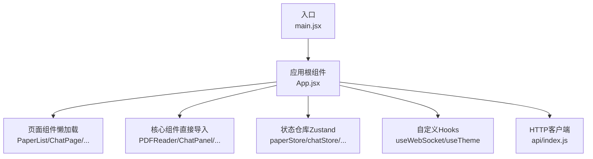
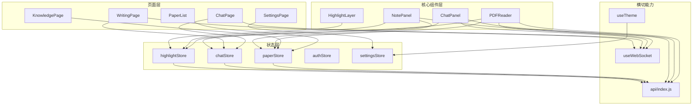
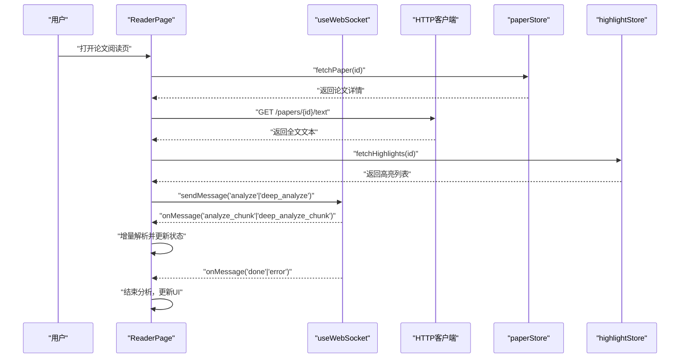
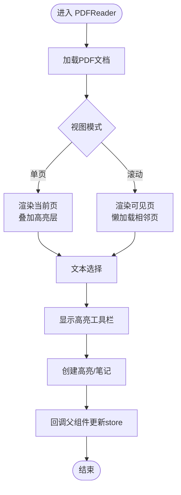
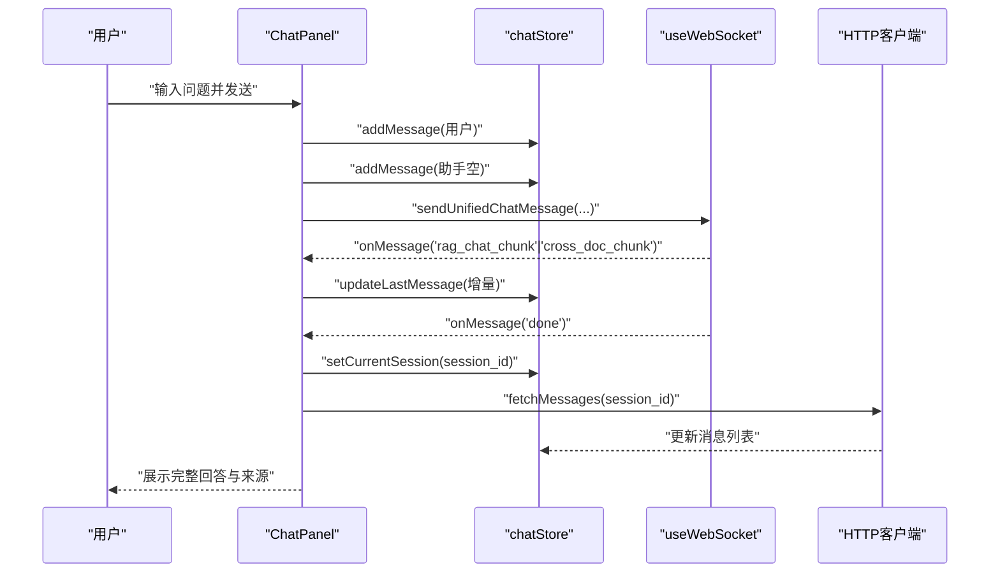
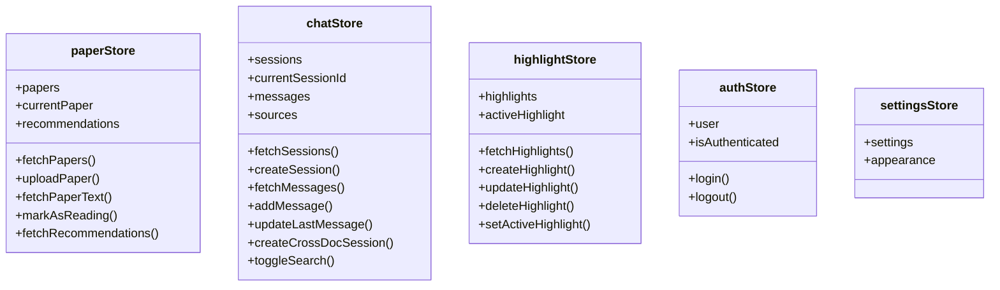
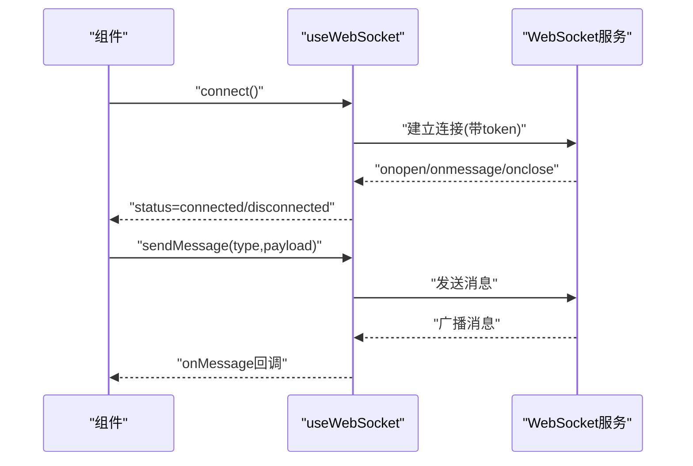
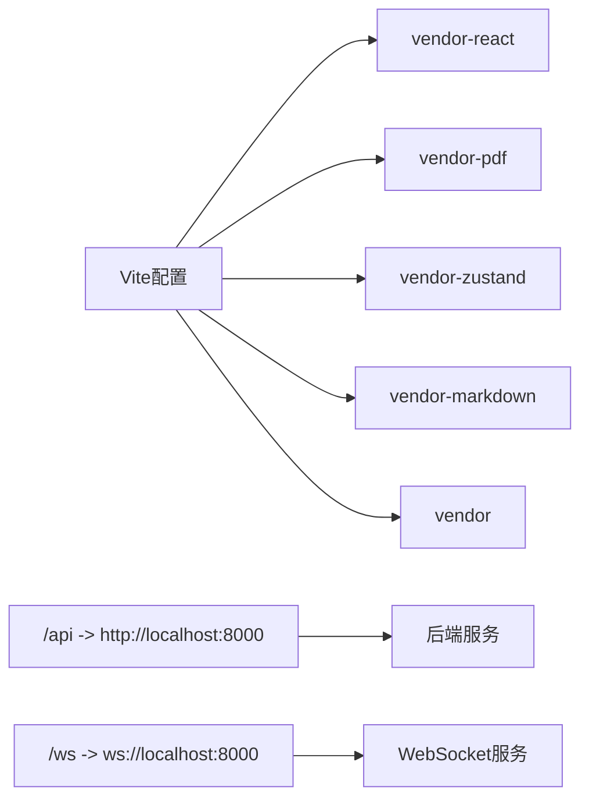

# 前端系统

<cite>
**本文引用的文件**
- [main.jsx](file://frontend/src/main.jsx)
- [App.jsx](file://frontend/src/App.jsx)
- [package.json](file://frontend/package.json)
- [vite.config.js](file://frontend/vite.config.js)
- [api/index.js](file://frontend/src/api/index.js)
- [hooks/useWebSocket.js](file://frontend/src/hooks/useWebSocket.js)
- [hooks/useTheme.js](file://frontend/src/hooks/useTheme.js)
- [stores/authStore.js](file://frontend/src/stores/authStore.js)
- [stores/paperStore.js](file://frontend/src/stores/paperStore.js)
- [stores/chatStore.js](file://frontend/src/stores/chatStore.js)
- [stores/highlightStore.js](file://frontend/src/stores/highlightStore.js)
- [components/PDFReader/PDFReader.jsx](file://frontend/src/components/PDFReader/PDFReader.jsx)
- [components/ChatPanel/ChatPanel.jsx](file://frontend/src/components/ChatPanel/ChatPanel.jsx)
- [components/NotePanel/NotePanel.jsx](file://frontend/src/components/NotePanel/NotePanel.jsx)
- [components/HighlightLayer/HighlightLayer.jsx](file://frontend/src/components/HighlightLayer/HighlightLayer.jsx)
</cite>

## 目录
1. [简介](#简介)
2. [项目结构](#项目结构)
3. [核心组件](#核心组件)
4. [架构总览](#架构总览)
5. [详细组件分析](#详细组件分析)
6. [依赖关系分析](#依赖关系分析)
7. [性能考量](#性能考量)
8. [故障排查指南](#故障排查指南)
9. [结论](#结论)
10. [附录](#附录)

## 简介
本文件为 PaperChat 前端系统的全面技术文档，面向 React 19 应用，聚焦于路由配置、页面组件组织、状态管理模式、UI 组件系统（PDF 阅读器、聊天面板、高亮标注、笔记管理、知识库等）、Zustand 状态管理、自定义 Hooks（WebSocket 连接管理、主题切换）、组件间通信与事件处理、以及响应式设计与性能优化策略。

## 项目结构
- 构建与运行
  - 使用 Vite 作为构建工具，开发服务器与代理配置指向后端服务。
  - 依赖管理：React 19、React Router DOM 7、Zustand 5、react-pdf/pdfjs-dist、axios、react-markdown、framer-motion 等。
- 目录组织
  - src/api：统一的 HTTP 客户端封装（axios 实例）。
  - src/stores：Zustand 状态仓库，按领域拆分（认证、论文、聊天、高亮、笔记、知识库、写作、设置、Agent 等）。
  - src/components：可复用 UI 组件（PDFReader、ChatPanel、NotePanel、HighlightLayer、ChatPanel 子组件等）。
  - src/hooks：自定义 Hooks（WebSocket、主题初始化与切换）。
  - src/pages：页面级组件（PaperList、ChatPage、WritingPage、KnowledgePage、SettingsPage 等），采用懒加载与 Suspense。
  - src/utils：通用工具（Markdown 渲染器）。
  - public：静态资源。
- 路由与入口
  - 入口文件创建根节点并包裹 BrowserRouter；App.jsx 定义路由与页面级布局，核心阅读页面直接导入，其余页面懒加载。

图表来源
- [main.jsx:1-14](file://frontend/src/main.jsx#L1-L14)
- [App.jsx:1-800](file://frontend/src/App.jsx#L1-L800)
- [vite.config.js:1-54](file://frontend/vite.config.js#L1-L54)

章节来源
- [main.jsx:1-14](file://frontend/src/main.jsx#L1-L14)
- [App.jsx:1-800](file://frontend/src/App.jsx#L1-L800)
- [package.json:1-36](file://frontend/package.json#L1-L36)
- [vite.config.js:1-54](file://frontend/vite.config.js#L1-L54)

## 核心组件
- 路由与页面组织
  - 使用 React Router v7 的 Routes/Route/Navigate，页面组件采用 React.lazy 与 Suspense 实现代码分割与加载态展示。
  - 核心阅读页面（PDF 阅读与分析）在 App.jsx 中集中管理，其他页面按需懒加载。
- 状态管理（Zustand）
  - paperStore：论文列表、详情、上传、删除、全文文本、推荐、关键词提取、批处理上传等。
  - chatStore：会话管理、消息流式渲染、跨文档问答、联网搜索开关、引用来源管理。
  - highlightStore：高亮的增删改查、激活状态、清理。
  - authStore：个人使用模式下的“始终已登录”模拟。
  - settingsStore：外观设置（主题、字号、紧凑模式）由 useTheme Hook 应用。
- 自定义 Hooks
  - useWebSocket：全局 WebSocket 连接、消息订阅、重连、发送统一消息（RAG、跨文档、统一聊天、取消）。
  - useTheme：主题、字号、紧凑模式的持久化与初始化应用。
- API 客户端
  - axios 实例，baseURL 指向 /api，统一处理 JSON 请求头。

章节来源
- [App.jsx:1-800](file://frontend/src/App.jsx#L1-L800)
- [stores/paperStore.js:1-357](file://frontend/src/stores/paperStore.js#L1-L357)
- [stores/chatStore.js:1-417](file://frontend/src/stores/chatStore.js#L1-L417)
- [stores/highlightStore.js:1-102](file://frontend/src/stores/highlightStore.js#L1-L102)
- [stores/authStore.js:1-23](file://frontend/src/stores/authStore.js#L1-L23)
- [hooks/useWebSocket.js:1-180](file://frontend/src/hooks/useWebSocket.js#L1-L180)
- [hooks/useTheme.js:1-91](file://frontend/src/hooks/useTheme.js#L1-L91)
- [api/index.js:1-12](file://frontend/src/api/index.js#L1-L12)

## 架构总览
整体采用“页面级组件 + 核心组件 + Zustand Store + 自定义 Hooks”的分层架构。页面负责路由与布局，核心组件负责具体交互（PDF 阅读、聊天、高亮、笔记），Zustand 提供跨层级的状态共享，自定义 Hooks 抽离网络与主题等横切关注点。

图表来源
- [App.jsx:1-800](file://frontend/src/App.jsx#L1-L800)
- [components/PDFReader/PDFReader.jsx:1-656](file://frontend/src/components/PDFReader/PDFReader.jsx#L1-L656)
- [components/ChatPanel/ChatPanel.jsx:1-678](file://frontend/src/components/ChatPanel/ChatPanel.jsx#L1-L678)
- [components/NotePanel/NotePanel.jsx:1-275](file://frontend/src/components/NotePanel/NotePanel.jsx#L1-L275)
- [components/HighlightLayer/HighlightLayer.jsx:1-119](file://frontend/src/components/HighlightLayer/HighlightLayer.jsx#L1-L119)
- [stores/paperStore.js:1-357](file://frontend/src/stores/paperStore.js#L1-L357)
- [stores/chatStore.js:1-417](file://frontend/src/stores/chatStore.js#L1-L417)
- [stores/highlightStore.js:1-102](file://frontend/src/stores/highlightStore.js#L1-L102)
- [hooks/useWebSocket.js:1-180](file://frontend/src/hooks/useWebSocket.js#L1-L180)
- [hooks/useTheme.js:1-91](file://frontend/src/hooks/useTheme.js#L1-L91)
- [api/index.js:1-12](file://frontend/src/api/index.js#L1-L12)

## 详细组件分析

### 路由与页面组织（App.jsx）
- 页面懒加载与加载态
  - 使用 React.lazy 与 Suspense，PageLoader 提供统一加载反馈。
- 核心阅读页面 ReaderPage
  - 聚合论文数据、高亮、笔记、推荐、分析（章节概述、深度分析）与 Agent 流程。
  - 通过 useWebSocket 订阅分析与 Agent 相关消息，实现流式解析与状态更新。
  - 支持拖拽调整左右面板宽度，三栏布局。
- 页面级状态与副作用
  - 加载论文详情、全文文本、高亮与笔记；并行请求优化加载体验。
  - 分析消息的增量解析与最终合并，避免重复渲染。
  - 清理副作用（清理高亮、笔记、推荐、Agent 状态）。

图表来源
- [App.jsx:134-307](file://frontend/src/App.jsx#L134-L307)
- [App.jsx:421-437](file://frontend/src/App.jsx#L421-L437)
- [hooks/useWebSocket.js:164-178](file://frontend/src/hooks/useWebSocket.js#L164-L178)
- [stores/paperStore.js:161-169](file://frontend/src/stores/paperStore.js#L161-L169)
- [stores/highlightStore.js:10-24](file://frontend/src/stores/highlightStore.js#L10-L24)

章节来源
- [App.jsx:1-800](file://frontend/src/App.jsx#L1-L800)

### PDF 阅读器（PDFReader）
- 功能特性
  - 基于 react-pdf/pdfjs-dist，支持单页/滚动两种视图模式，键盘快捷键导航，缩放与适配宽度。
  - 文本选择与高亮工具栏，术语解释、摘要、翻译等阅读辅助。
  - 高亮层叠加渲染，支持多种高亮类型（背景高亮、下划线、删除线）。
  - IntersectionObserver 懒加载，滚动模式下减少内存占用。
- 数据流
  - 从父组件接收 highlights、activeHighlight，并在页面加载成功后计算页面尺寸，用于坐标转换。
  - 选中文本后计算 PDF 坐标，传递给父组件以创建高亮或笔记。

图表来源
- [components/PDFReader/PDFReader.jsx:1-656](file://frontend/src/components/PDFReader/PDFReader.jsx#L1-L656)
- [components/HighlightLayer/HighlightLayer.jsx:1-119](file://frontend/src/components/HighlightLayer/HighlightLayer.jsx#L1-L119)

章节来源
- [components/PDFReader/PDFReader.jsx:1-656](file://frontend/src/components/PDFReader/PDFReader.jsx#L1-L656)
- [components/HighlightLayer/HighlightLayer.jsx:1-119](file://frontend/src/components/HighlightLayer/HighlightLayer.jsx#L1-L119)

### 聊天面板（ChatPanel）
- 功能特性
  - 会话管理：新建、切换、删除、自动命名。
  - 跨文档问答：选择多篇论文，动态创建跨文档会话。
  - 联网搜索：开关控制与状态提示。
  - 流式渲染：字符级增量显示，支持引用来源（单文档与跨文档）。
  - 引用跳转：点击 [p.X] 或 [论文N,p.X] 跳转到对应页面或论文。
- 数据流
  - 通过 useChatStore 管理消息、会话、来源与跨文档状态。
  - 通过 useWebSocket 接收 rag_chat_chunk、cross_doc_chunk、search_status、done、error 等消息，驱动 UI 更新。

图表来源
- [components/ChatPanel/ChatPanel.jsx:1-678](file://frontend/src/components/ChatPanel/ChatPanel.jsx#L1-L678)
- [stores/chatStore.js:1-417](file://frontend/src/stores/chatStore.js#L1-L417)
- [hooks/useWebSocket.js:140-154](file://frontend/src/hooks/useWebSocket.js#L140-L154)

章节来源
- [components/ChatPanel/ChatPanel.jsx:1-678](file://frontend/src/components/ChatPanel/ChatPanel.jsx#L1-L678)
- [stores/chatStore.js:1-417](file://frontend/src/stores/chatStore.js#L1-L417)

### 笔记面板（NotePanel）
- 功能特性
  - 列表展示、搜索过滤、展开/收起、时间格式化、关联高亮指示。
  - 支持添加、编辑、删除笔记，点击笔记跳转到高亮所在页面。
- 数据流
  - 从父组件接收 notes 列表与回调，内部维护搜索与展开状态。

章节来源
- [components/NotePanel/NotePanel.jsx:1-275](file://frontend/src/components/NotePanel/NotePanel.jsx#L1-L275)

### 高亮层（HighlightLayer）
- 功能特性
  - 将 PDF 坐标转换为页面像素坐标，叠加渲染高亮区域。
  - 支持不同高亮类型（背景、下划线、删除线），并根据是否激活高亮调整透明度。
- 数据流
  - 从 PDFReader 获取当前页高亮集合与页面尺寸，计算并渲染高亮矩形。

章节来源
- [components/HighlightLayer/HighlightLayer.jsx:1-119](file://frontend/src/components/HighlightLayer/HighlightLayer.jsx#L1-L119)

### Zustand 状态管理
- paperStore
  - 论文 CRUD、全文文本、推荐、关键词提取、批处理上传、阅读状态标记。
- chatStore
  - 会话生命周期、消息流式渲染、跨文档问答、联网搜索、引用来源。
- highlightStore
  - 高亮 CRUD、激活状态、清理。
- authStore
  - 个人使用模式下的“始终已登录”模拟。
- settingsStore + useTheme
  - 主题、字号、紧凑模式持久化与初始化应用。

图表来源
- [stores/paperStore.js:1-357](file://frontend/src/stores/paperStore.js#L1-L357)
- [stores/chatStore.js:1-417](file://frontend/src/stores/chatStore.js#L1-L417)
- [stores/highlightStore.js:1-102](file://frontend/src/stores/highlightStore.js#L1-L102)
- [stores/authStore.js:1-23](file://frontend/src/stores/authStore.js#L1-L23)

章节来源
- [stores/paperStore.js:1-357](file://frontend/src/stores/paperStore.js#L1-L357)
- [stores/chatStore.js:1-417](file://frontend/src/stores/chatStore.js#L1-L417)
- [stores/highlightStore.js:1-102](file://frontend/src/stores/highlightStore.js#L1-L102)
- [stores/authStore.js:1-23](file://frontend/src/stores/authStore.js#L1-L23)

### 自定义 Hooks
- useWebSocket
  - 全局 WebSocket 连接、消息订阅（支持通配符）、重连策略、发送统一消息（RAG、跨文档、统一聊天、取消）。
- useTheme
  - 主题、字号、紧凑模式的持久化与初始化应用，避免闪烁。

图表来源
- [hooks/useWebSocket.js:1-180](file://frontend/src/hooks/useWebSocket.js#L1-L180)

章节来源
- [hooks/useWebSocket.js:1-180](file://frontend/src/hooks/useWebSocket.js#L1-L180)
- [hooks/useTheme.js:1-91](file://frontend/src/hooks/useTheme.js#L1-L91)

## 依赖关系分析
- 构建与打包
  - Vite 配置对 React 核心、PDF 相关、Zustand、Markdown 渲染等进行手动分包，chunkSize 警告阈值 500KB。
- 运行时依赖
  - React 19、React Router DOM 7、Zustand 5、react-pdf/pdfjs-dist、axios、react-markdown、framer-motion。
- 代理与后端通信
  - /api 代理到 http://localhost:8000，/ws 代理到 ws://localhost:8000。

图表来源
- [vite.config.js:19-52](file://frontend/vite.config.js#L19-L52)

章节来源
- [vite.config.js:1-54](file://frontend/vite.config.js#L1-L54)
- [package.json:12-23](file://frontend/package.json#L12-L23)

## 性能考量
- 代码分割与懒加载
  - 页面组件懒加载与 Suspense，减少首屏体积与白屏时间。
- PDF 渲染优化
  - 滚动模式使用 IntersectionObserver 懒加载，限制可见页数量，降低内存占用。
  - 单页模式下预加载前后页，提升翻页体验。
- 状态更新与渲染
  - Zustand 以原子状态更新，避免不必要的重渲染。
  - ChatPanel 使用字符级增量渲染，提升长文本流式体验。
- 打包与分包
  - 手动分包策略减少 vendor 包体积，提升缓存命中率。
- 响应式与主题
  - useTheme 初始化应用主题与字号，避免 FOUC（Flash of Unstyled Content）。

章节来源
- [components/PDFReader/PDFReader.jsx:315-362](file://frontend/src/components/PDFReader/PDFReader.jsx#L315-L362)
- [components/ChatPanel/ChatPanel.jsx:102-123](file://frontend/src/components/ChatPanel/ChatPanel.jsx#L102-L123)
- [hooks/useTheme.js:72-90](file://frontend/src/hooks/useTheme.js#L72-L90)
- [vite.config.js:23-47](file://frontend/vite.config.js#L23-L47)

## 故障排查指南
- WebSocket 连接
  - 检查 useWebSocket 的状态监听与重连逻辑，确认 token 注入与地址拼接。
  - 若消息未到达，确认 onMessage 订阅类型与通配符使用。
- PDF 加载失败
  - 查看 PDFReader 的错误处理与加载态，确认 PDF.js Worker 配置与文件源。
- 高亮与笔记异常
  - 确认 highlightStore 的 fetch/create/update/delete 流程，检查坐标转换与页面尺寸缓存。
- 聊天消息不显示
  - 检查 chatStore 的 addMessage/updateLastMessage 与 onMessage 订阅，确认 done/error 信号处理。
- 主题切换无效
  - 确认 useTheme 的初始化与 localStorage 读写，检查 data-theme 属性与 CSS 变量。

章节来源
- [hooks/useWebSocket.js:14-71](file://frontend/src/hooks/useWebSocket.js#L14-L71)
- [components/PDFReader/PDFReader.jsx:62-67](file://frontend/src/components/PDFReader/PDFReader.jsx#L62-L67)
- [stores/highlightStore.js:10-85](file://frontend/src/stores/highlightStore.js#L10-L85)
- [stores/chatStore.js:235-282](file://frontend/src/stores/chatStore.js#L235-L282)
- [hooks/useTheme.js:17-65](file://frontend/src/hooks/useTheme.js#L17-L65)

## 结论
PaperChat 前端系统以 React 19 为基础，结合 Zustand 实现清晰的状态分层，通过自定义 Hooks 抽离横切关注点，采用懒加载与 PDF 渲染优化保障性能。UI 组件围绕 PDF 阅读、高亮标注、笔记管理与聊天面板形成闭环，配合 WebSocket 实现实时分析与问答。整体架构具备良好的可扩展性与可维护性，适合持续迭代与功能拓展。

## 附录
- API 客户端
  - axios 实例，baseURL=/api，统一 JSON 请求头。
- 代理配置
  - /api -> http://localhost:8000，/ws -> ws://localhost:8000。

章节来源
- [api/index.js:1-12](file://frontend/src/api/index.js#L1-L12)
- [vite.config.js:7-17](file://frontend/vite.config.js#L7-L17)