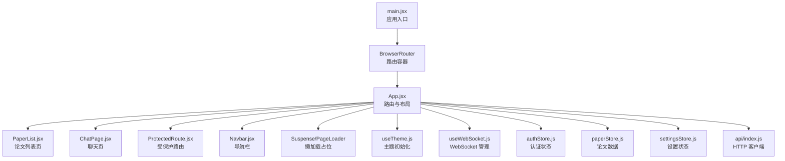
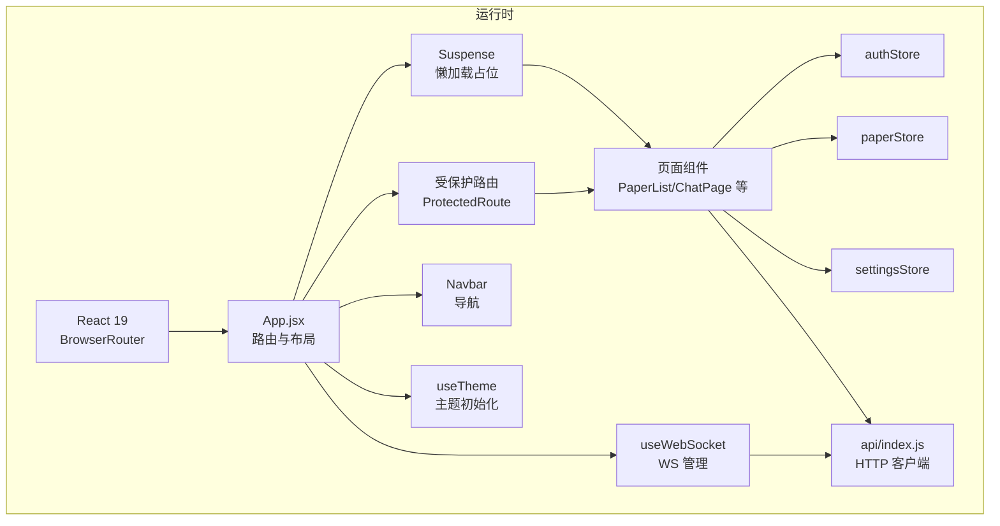
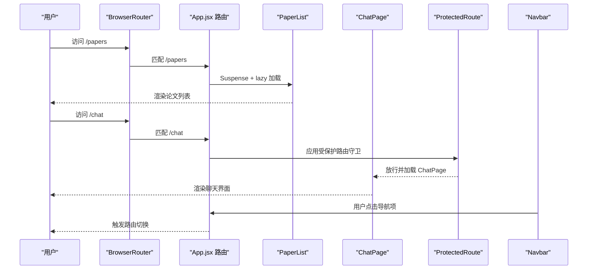
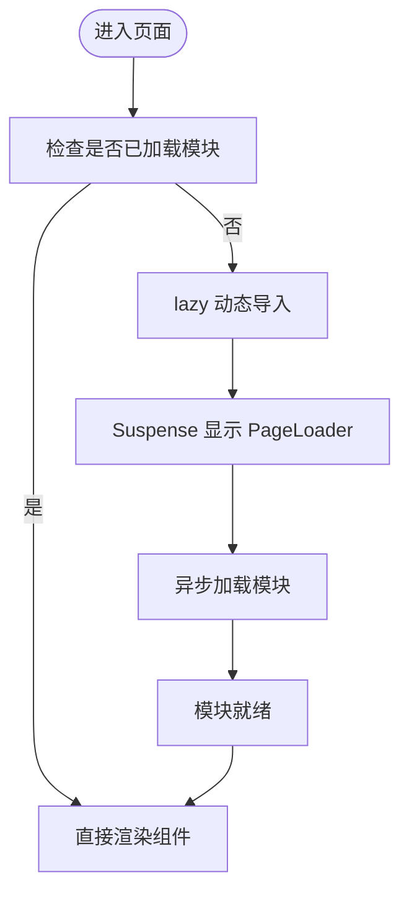
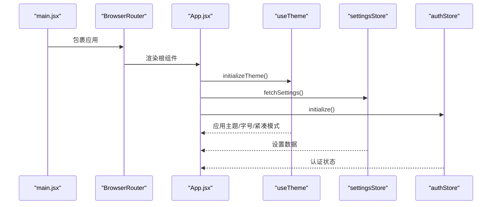
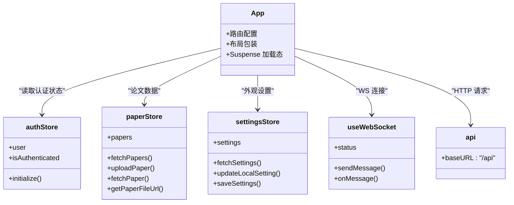
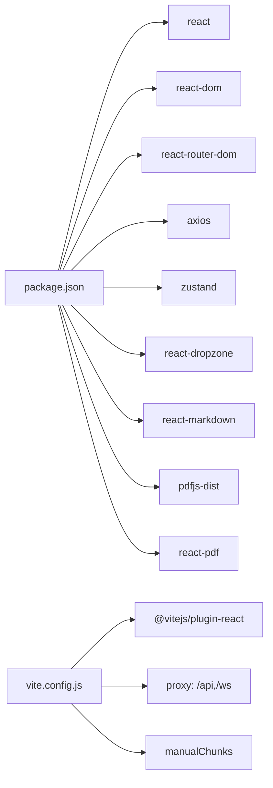

# 应用结构与路由

<cite>
**本文档引用的文件**
- [main.jsx](file://frontend/src/main.jsx)
- [App.jsx](file://frontend/src/App.jsx)
- [PaperList.jsx](file://frontend/src/pages/PaperList.jsx)
- [ChatPage.jsx](file://frontend/src/pages/ChatPage.jsx)
- [ProtectedRoute.jsx](file://frontend/src/components/ProtectedRoute.jsx)
- [Navbar.jsx](file://frontend/src/components/Navbar/Navbar.jsx)
- [useTheme.js](file://frontend/src/hooks/useTheme.js)
- [useWebSocket.js](file://frontend/src/hooks/useWebSocket.js)
- [authStore.js](file://frontend/src/stores/authStore.js)
- [paperStore.js](file://frontend/src/stores/paperStore.js)
- [settingsStore.js](file://frontend/src/stores/settingsStore.js)
- [api/index.js](file://frontend/src/api/index.js)
- [vite.config.js](file://frontend/vite.config.js)
- [package.json](file://frontend/package.json)
</cite>

## 目录
1. [简介](#简介)
2. [项目结构](#项目结构)
3. [核心组件](#核心组件)
4. [架构总览](#架构总览)
5. [详细组件分析](#详细组件分析)
6. [依赖关系分析](#依赖关系分析)
7. [性能考量](#性能考量)
8. [故障排查指南](#故障排查指南)
9. [结论](#结论)
10. [附录](#附录)

## 简介
本文件面向 PaperChat 前端应用，系统性阐述基于 React 19 的应用架构与路由体系。重点覆盖：
- 主应用组件 App.jsx 的结构组织与控制流
- 路由配置策略、动态路由参数处理、嵌套路由与导航守卫
- 代码分割与懒加载实现（Suspense、lazy）、加载状态管理
- 应用启动流程、初始化过程与全局状态设置
- 路由最佳实践与性能优化建议（预加载、错误边界）

## 项目结构
前端采用按功能域分层的目录组织：入口、页面、组件、钩子、状态管理、API 封装与构建配置。核心入口通过 BrowserRouter 包裹，App.jsx 统一声明路由与布局。

图表来源
- [main.jsx:7-13](file://frontend/src/main.jsx#L7-L13)
- [App.jsx:903-1007](file://frontend/src/App.jsx#L903-L1007)

章节来源
- [main.jsx:1-14](file://frontend/src/main.jsx#L1-L14)
- [App.jsx:903-1007](file://frontend/src/App.jsx#L903-L1007)

## 核心组件
- 应用入口与路由容器：在入口文件中使用 BrowserRouter 包裹应用，确保路由能力可用。
- 主路由与布局：App.jsx 中集中定义所有路由规则，使用 Suspense 为懒加载页面提供统一加载态。
- 页面组件：PaperList、ChatPage 等页面组件通过懒加载按需加载，减少首屏体积。
- 受保护路由：ProtectedRoute 作为路由守卫，基于认证状态决定是否放行。
- 导航栏：Navbar 提供全局导航与当前路径指示。
- 主题与设置：useTheme 在启动时初始化主题，settingsStore 管理外观设置持久化与同步。
- WebSocket：useWebSocket 提供全局连接、消息订阅与重连策略。
- 状态管理：Zustand stores（authStore、paperStore、settingsStore）提供细粒度状态与副作用封装。

章节来源
- [main.jsx:1-14](file://frontend/src/main.jsx#L1-L14)
- [App.jsx:903-1007](file://frontend/src/App.jsx#L903-L1007)
- [ProtectedRoute.jsx:1-21](file://frontend/src/components/ProtectedRoute.jsx#L1-L21)
- [Navbar.jsx:1-54](file://frontend/src/components/Navbar/Navbar.jsx#L1-L54)
- [useTheme.js:68-91](file://frontend/src/hooks/useTheme.js#L68-L91)
- [useWebSocket.js:1-180](file://frontend/src/hooks/useWebSocket.js#L1-L180)
- [authStore.js:1-23](file://frontend/src/stores/authStore.js#L1-L23)
- [paperStore.js:1-357](file://frontend/src/stores/paperStore.js#L1-L357)
- [settingsStore.js:1-131](file://frontend/src/stores/settingsStore.js#L1-L131)
- [api/index.js:1-12](file://frontend/src/api/index.js#L1-L12)

## 架构总览
React 19 应用采用“路由驱动”的页面组织方式，配合 Suspense 实现代码分割与加载态统一管理。全局状态通过 Zustand store 管理，HTTP 请求通过 axios 实例封装，WebSocket 通过自定义 hook 管理长连接与消息分发。

图表来源
- [main.jsx:7-13](file://frontend/src/main.jsx#L7-L13)
- [App.jsx:903-1007](file://frontend/src/App.jsx#L903-L1007)
- [ProtectedRoute.jsx:8-18](file://frontend/src/components/ProtectedRoute.jsx#L8-L18)
- [useTheme.js:68-91](file://frontend/src/hooks/useTheme.js#L68-L91)
- [useWebSocket.js:1-180](file://frontend/src/hooks/useWebSocket.js#L1-L180)
- [api/index.js:1-12](file://frontend/src/api/index.js#L1-L12)

## 详细组件分析

### 路由系统与导航守卫
- 动态路由参数：阅读页路由使用动态参数 id，ReaderPage 通过 useParams 获取并加载对应论文资源。
- 嵌套路由设计：AppLayout 作为通用布局包装器，为多页面提供一致的侧边导航与主内容区域。
- 导航守卫：ProtectedRoute 读取认证状态，未登录时重定向至登录页并携带来源地址，登录后可回跳。
- 404 处理：通配符路由兜底，统一使用 Suspense 加载 NotFoundPage。

图表来源
- [App.jsx:921-1004](file://frontend/src/App.jsx#L921-L1004)
- [PaperList.jsx:256](file://frontend/src/pages/PaperList.jsx#L256)
- [ChatPage.jsx:118-120](file://frontend/src/pages/ChatPage.jsx#L118-L120)
- [ProtectedRoute.jsx:8-18](file://frontend/src/components/ProtectedRoute.jsx#L8-L18)
- [Navbar.jsx:24-28](file://frontend/src/components/Navbar/Navbar.jsx#L24-L28)

章节来源
- [App.jsx:921-1004](file://frontend/src/App.jsx#L921-L1004)
- [PaperList.jsx:256](file://frontend/src/pages/PaperList.jsx#L256)
- [ChatPage.jsx:118-120](file://frontend/src/pages/ChatPage.jsx#L118-L120)
- [ProtectedRoute.jsx:8-18](file://frontend/src/components/ProtectedRoute.jsx#L8-L18)
- [Navbar.jsx:24-28](file://frontend/src/components/Navbar/Navbar.jsx#L24-L28)

### 代码分割与懒加载实现
- 懒加载页面：PaperList、ChatPage、WritingPage、KnowledgePage、SettingsPage、NotFoundPage 通过 lazy 按需加载。
- Suspense 占位：PageLoader 提供统一加载态，避免白屏与闪烁。
- 核心阅读页面：ReaderPage 保持直接导入，兼顾性能与交互体验。
- 构建分包：vite.config.js 使用 manualChunks 将第三方库拆分为 vendor、vendor-react、vendor-pdf 等，优化缓存与加载。

图表来源
- [App.jsx:25-31](file://frontend/src/App.jsx#L25-L31)
- [App.jsx:34-57](file://frontend/src/App.jsx#L34-L57)
- [App.jsx:927-929](file://frontend/src/App.jsx#L927-L929)
- [vite.config.js:23-47](file://frontend/vite.config.js#L23-L47)

章节来源
- [App.jsx:25-31](file://frontend/src/App.jsx#L25-L31)
- [App.jsx:34-57](file://frontend/src/App.jsx#L34-L57)
- [App.jsx:927-929](file://frontend/src/App.jsx#L927-L929)
- [vite.config.js:23-47](file://frontend/vite.config.js#L23-L47)

### 应用启动流程与初始化
- 启动顺序：main.jsx -> BrowserRouter -> App.jsx -> 初始化主题与设置 -> 加载认证状态。
- 主题初始化：initializeTheme 在应用启动时从 localStorage 读取并立即应用，避免闪烁。
- 设置加载：App.jsx 中在挂载后拉取设置并触发 useTheme 应用外观。
- 认证初始化：authStore.initialize 在应用启动时调用，当前实现为“始终登录”模式。

图表来源
- [main.jsx:7-13](file://frontend/src/main.jsx#L7-L13)
- [App.jsx:903-919](file://frontend/src/App.jsx#L903-L919)
- [useTheme.js:72-91](file://frontend/src/hooks/useTheme.js#L72-L91)
- [settingsStore.js:18-39](file://frontend/src/stores/settingsStore.js#L18-L39)
- [authStore.js:10-11](file://frontend/src/stores/authStore.js#L10-L11)

章节来源
- [main.jsx:7-13](file://frontend/src/main.jsx#L7-L13)
- [App.jsx:903-919](file://frontend/src/App.jsx#L903-L919)
- [useTheme.js:72-91](file://frontend/src/hooks/useTheme.js#L72-L91)
- [settingsStore.js:18-39](file://frontend/src/stores/settingsStore.js#L18-L39)
- [authStore.js:10-11](file://frontend/src/stores/authStore.js#L10-L11)

### 全局状态与数据流
- 认证状态：authStore 当前为“始终登录”，提供兼容性接口。
- 论文数据：paperStore 负责论文列表、上传、删除、全文文本、推荐、关键词提取等。
- 设置状态：settingsStore 负责外观设置的读取、本地更新与远程保存。
- WebSocket：useWebSocket 提供全局连接、消息订阅与重连；ChatPage/ReaderPage 通过 onMessage 处理业务消息。
- HTTP 客户端：api/index.js 基于 axios，统一前缀与头部。

图表来源
- [App.jsx:903-1007](file://frontend/src/App.jsx#L903-L1007)
- [authStore.js:3-20](file://frontend/src/stores/authStore.js#L3-L20)
- [paperStore.js:4-357](file://frontend/src/stores/paperStore.js#L4-L357)
- [settingsStore.js:9-131](file://frontend/src/stores/settingsStore.js#L9-L131)
- [useWebSocket.js:84-179](file://frontend/src/hooks/useWebSocket.js#L84-L179)
- [api/index.js:4-9](file://frontend/src/api/index.js#L4-L9)

章节来源
- [authStore.js:3-20](file://frontend/src/stores/authStore.js#L3-L20)
- [paperStore.js:4-357](file://frontend/src/stores/paperStore.js#L4-L357)
- [settingsStore.js:9-131](file://frontend/src/stores/settingsStore.js#L9-L131)
- [useWebSocket.js:84-179](file://frontend/src/hooks/useWebSocket.js#L84-L179)
- [api/index.js:4-9](file://frontend/src/api/index.js#L4-L9)

### 页面组件与交互要点
- PaperList：支持上传、搜索、筛选、分页、删除确认、个性化推荐等；通过 useDropzone 实现拖拽上传，导航至阅读页。
- ChatPage：会话管理、消息流式渲染、跨文档模式、联网搜索开关、意图识别与来源标注。
- ReaderPage：论文阅读、高亮/笔记、分析与深度分析、推荐、WebSocket 消息处理与状态恢复。

章节来源
- [PaperList.jsx:45-431](file://frontend/src/pages/PaperList.jsx#L45-L431)
- [ChatPage.jsx:75-551](file://frontend/src/pages/ChatPage.jsx#L75-L551)
- [App.jsx:60-757](file://frontend/src/App.jsx#L60-L757)

## 依赖关系分析
- React 生态：react、react-dom、react-router-dom、react-dropzone、react-markdown、pdfjs-dist、react-pdf。
- 状态管理：zustand。
- 构建与代理：vite、@vitejs/plugin-react；开发服务器代理 /api 与 /ws。
- 依赖分包：manualChunks 将 react、pdf、zustand、markdown 等拆分为独立 chunk，降低缓存失效影响。

图表来源
- [package.json:12-34](file://frontend/package.json#L12-L34)
- [vite.config.js:6-53](file://frontend/vite.config.js#L6-L53)

章节来源
- [package.json:12-34](file://frontend/package.json#L12-L34)
- [vite.config.js:6-53](file://frontend/vite.config.js#L6-L53)

## 性能考量
- 代码分割：通过 lazy 与 Suspense 将大页面按需加载，结合 manualChunks 优化缓存命中率。
- 并行加载：ReaderPage 在加载论文详情后，对全文文本、分析缓存、高亮与笔记等请求并行处理，缩短首屏等待。
- 渲染优化：ChatPage 的消息项使用 memo 优化，减少不必要的重渲染。
- WebSocket 流式处理：ReaderPage 与 ChatPage 基于 onMessage 的事件驱动，避免阻塞主线程。
- 预加载建议：对高频访问页面（如 /papers）可在路由切换前预取数据；对大组件（如 PDF 阅读器）可考虑预热依赖。
- 错误边界：当前未见显式 React 错误边界组件，建议在关键页面增加错误边界以提升稳定性。

章节来源
- [App.jsx:339-344](file://frontend/src/App.jsx#L339-L344)
- [ChatPage.jsx:42-74](file://frontend/src/pages/ChatPage.jsx#L42-L74)
- [vite.config.js:23-47](file://frontend/vite.config.js#L23-L47)

## 故障排查指南
- WebSocket 连接异常：检查 useWebSocket 的连接状态与重连逻辑；确认代理配置正确（/ws）。
- 页面空白或长时间加载：检查 Suspense fallback 是否正常显示，确认 lazy 组件是否成功加载。
- 认证状态异常：当前 authStore 为“始终登录”，若需真实鉴权，应完善 login/register/logout 逻辑。
- 设置未生效：确认 settingsStore 的 fetchSettings 与 useTheme 的应用顺序，检查 localStorage 写入。
- 上传失败：检查后端接口与代理配置，确认 /api/papers/upload 可达。

章节来源
- [useWebSocket.js:19-71](file://frontend/src/hooks/useWebSocket.js#L19-L71)
- [vite.config.js:8-17](file://frontend/vite.config.js#L8-L17)
- [authStore.js:3-20](file://frontend/src/stores/authStore.js#L3-L20)
- [settingsStore.js:18-39](file://frontend/src/stores/settingsStore.js#L18-L39)
- [api/index.js:4-9](file://frontend/src/api/index.js#L4-L9)

## 结论
PaperChat 前端以 React 19 为基础，采用路由驱动的页面组织与 Suspense 懒加载策略，结合 Zustand 状态管理与自定义 WebSocket Hook，形成清晰的职责分离与良好的用户体验。通过合理的代码分割与并行加载，显著优化了首屏性能。建议后续引入错误边界、增强认证逻辑与预加载策略，进一步提升稳定性与性能。

## 附录
- 路由最佳实践
  - 优先使用 Suspense 管理懒加载，避免手动控制 loading 状态。
  - 动态路由参数尽量在页面组件内处理，避免在路由层做过多业务逻辑。
  - 受保护路由统一使用守卫组件，保证权限一致性。
- 性能优化建议
  - 对大组件与大依赖启用 manualChunks 并合理命名 chunk。
  - 对高频页面与数据使用缓存策略（内存/IndexedDB），减少重复请求。
  - 使用 React Profiler 识别重渲染热点，持续优化组件 memo 与拆分。