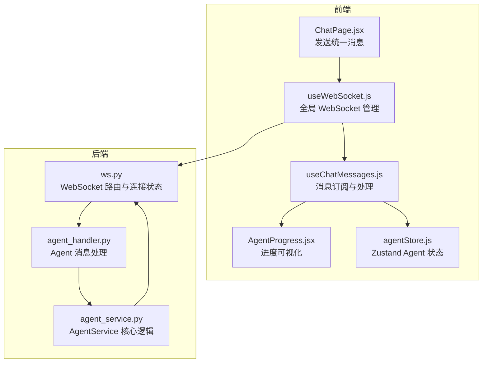
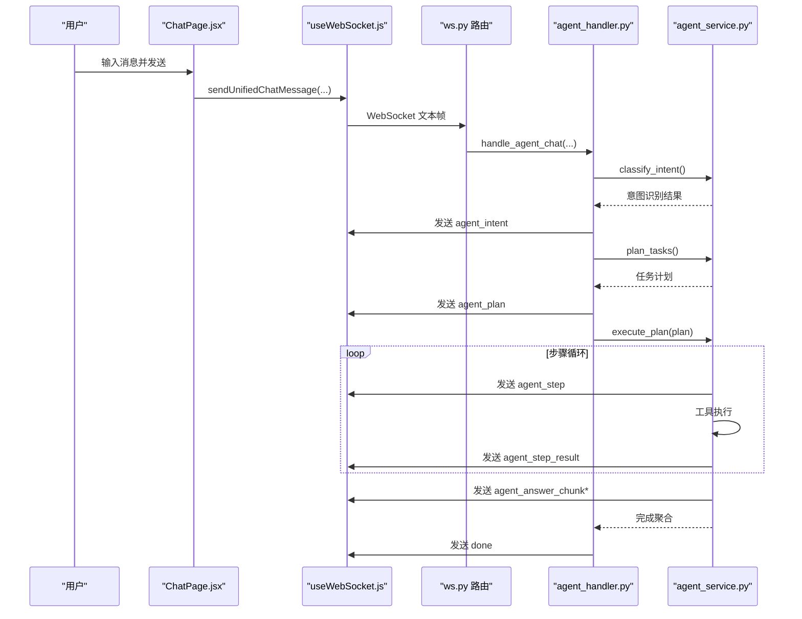
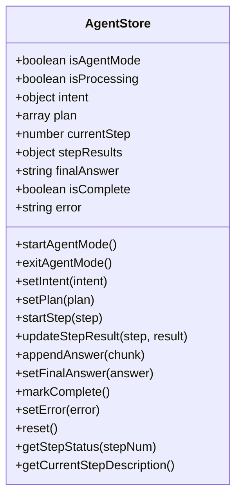
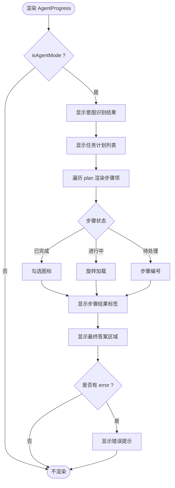
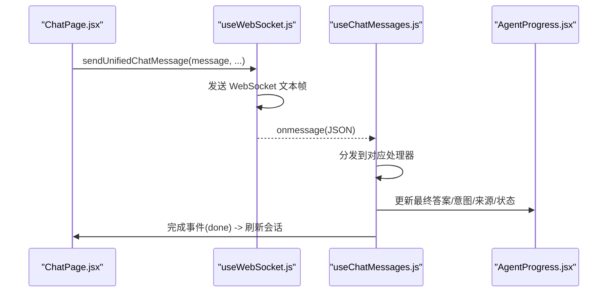
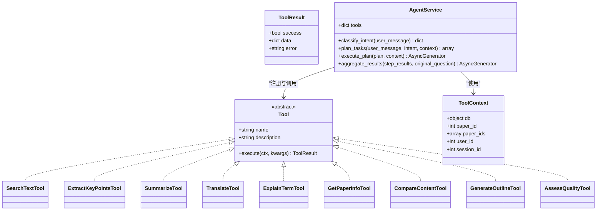
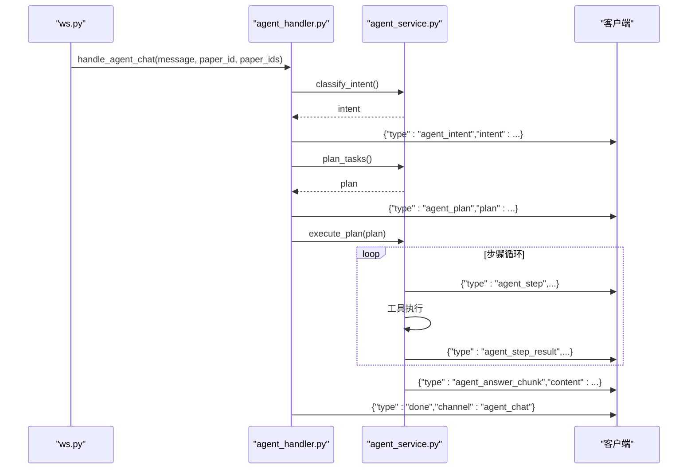
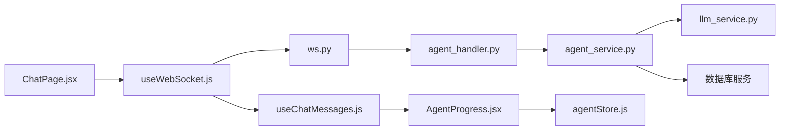

# Agent 状态管理

<cite>
**本文档引用的文件**
- [agentStore.js](file://frontend/src/stores/agentStore.js)
- [AgentProgress.jsx](file://frontend/src/components/AgentProgress/AgentProgress.jsx)
- [AgentProgress.module.css](file://frontend/src/components/AgentProgress/AgentProgress.module.css)
- [useWebSocket.js](file://frontend/src/hooks/useWebSocket.js)
- [ChatPage.jsx](file://frontend/src/pages/ChatPage.jsx)
- [useChatMessages.js](file://frontend/src/hooks/useChatMessages.js)
- [agent_handler.py](file://backend/app/handlers/agent_handler.py)
- [agent_service.py](file://backend/app/services/agent_service.py)
- [ws.py](file://backend/app/routers/ws.py)
- [config.py](file://backend/app/config.py)
</cite>

## 目录
1. [简介](#简介)
2. [项目结构](#项目结构)
3. [核心组件](#核心组件)
4. [架构总览](#架构总览)
5. [详细组件分析](#详细组件分析)
6. [依赖关系分析](#依赖关系分析)
7. [性能考量](#性能考量)
8. [故障排查指南](#故障排查指南)
9. [结论](#结论)
10. [附录](#附录)

## 简介
本文件系统性阐述 PaperChat 中 Agent 状态管理的设计与实现，覆盖智能体系统的生命周期、任务执行与进度跟踪、状态数据结构、与后端 Agent 服务的集成、实时监控与错误处理、配置管理、工具调用与结果展示策略，以及执行日志、性能监控与调试工具的实现细节。目标是帮助开发者与使用者全面理解 Agent 在前端与后端的状态流转与交互机制。

## 项目结构
PaperChat 的 Agent 状态管理横跨前端 Zustand 状态库与后端 FastAPI WebSocket 路由，形成“前端状态驱动 + 后端流式执行”的协作架构。前端通过 WebSocket 接收后端推送的 Agent 执行进度与结果，同时通过 Zustand store 维护本地 Agent 执行状态；后端通过 AgentService 将用户意图识别、任务规划、工具调用与结果聚合串联为异步流式过程，并通过 WebSocket 实时回传。

图表来源
- [ChatPage.jsx](file://frontend/src/pages/ChatPage.jsx)
- [useWebSocket.js](file://frontend/src/hooks/useWebSocket.js)
- [useChatMessages.js](file://frontend/src/hooks/useChatMessages.js)
- [AgentProgress.jsx](file://frontend/src/components/AgentProgress/AgentProgress.jsx)
- [agentStore.js](file://frontend/src/stores/agentStore.js)
- [ws.py](file://backend/app/routers/ws.py)
- [agent_handler.py](file://backend/app/handlers/agent_handler.py)
- [agent_service.py](file://backend/app/services/agent_service.py)

章节来源
- [ChatPage.jsx](file://frontend/src/pages/ChatPage.jsx)
- [useWebSocket.js](file://frontend/src/hooks/useWebSocket.js)
- [useChatMessages.js](file://frontend/src/hooks/useChatMessages.js)
- [AgentProgress.jsx](file://frontend/src/components/AgentProgress/AgentProgress.jsx)
- [agentStore.js](file://frontend/src/stores/agentStore.js)
- [ws.py](file://backend/app/routers/ws.py)
- [agent_handler.py](file://backend/app/handlers/agent_handler.py)
- [agent_service.py](file://backend/app/services/agent_service.py)

## 核心组件
- 前端 Zustand Store（agentStore.js）
  - 管理 Agent 模式开关、处理状态、意图识别结果、任务计划、当前步骤、步骤结果映射、最终答案、完成标志与错误信息。
  - 提供启动/退出 Agent 模式、设置意图/计划、更新步骤状态与结果、追加/设置最终答案、标记完成、设置错误、重置状态与查询步骤状态等动作。
- 前端组件（AgentProgress.jsx）
  - 展示意图识别结果（类型与复杂度）、任务步骤列表（编号、工具、描述、状态图标）、已完成步骤打勾、当前步骤加载动画、步骤结果标签、最终答案区域与错误提示。
- WebSocket 管理（useWebSocket.js）
  - 维护全局 WebSocket 连接状态、自动重连、消息分发、统一发送接口（支持 RAG、跨文档、统一聊天、取消等）。
- 聊天消息钩子（useChatMessages.js）
  - 统一订阅后端消息类型，处理流式内容、意图检测、引用来源、搜索状态、完成事件与错误处理。
- 后端 WebSocket 路由（ws.py）
  - 管理连接生命周期、消息类型路由、任务并发控制与取消、统一聊天入口（关键词意图识别与自动路由）。
- Agent 处理器（agent_handler.py）
  - 执行意图识别、任务规划、逐步执行与结果聚合，通过 WebSocket 流式回传进度与最终答案。
- Agent 服务（agent_service.py）
  - 定义工具基类与多种工具（搜索、摘要、翻译、术语解释、提取知识点、对比、生成提纲、质量评估、获取论文信息），实现意图识别、任务规划、执行计划与结果聚合。

章节来源
- [agentStore.js](file://frontend/src/stores/agentStore.js)
- [AgentProgress.jsx](file://frontend/src/components/AgentProgress/AgentProgress.jsx)
- [useWebSocket.js](file://frontend/src/hooks/useWebSocket.js)
- [useChatMessages.js](file://frontend/src/hooks/useChatMessages.js)
- [ws.py](file://backend/app/routers/ws.py)
- [agent_handler.py](file://backend/app/handlers/agent_handler.py)
- [agent_service.py](file://backend/app/services/agent_service.py)

## 架构总览
Agent 状态管理采用“前端状态驱动 + 后端流式执行”的双层架构：
- 前端负责状态展示与用户交互，通过 WebSocket 接收后端推送的 Agent 执行事件（意图、计划、步骤开始、步骤结果、最终答案片段、完成与错误）。
- 后端负责业务逻辑与工具调用，将复杂任务拆分为多步计划，逐步执行并聚合结果，通过异步生成器向前端流式传输进度。

图表来源
- [ChatPage.jsx](file://frontend/src/pages/ChatPage.jsx)
- [useWebSocket.js](file://frontend/src/hooks/useWebSocket.js)
- [ws.py](file://backend/app/routers/ws.py)
- [agent_handler.py](file://backend/app/handlers/agent_handler.py)
- [agent_service.py](file://backend/app/services/agent_service.py)

## 详细组件分析

### 前端状态管理（Zustand Store）
- 状态字段
  - isAgentMode：是否处于 Agent 模式
  - isProcessing：是否正在处理中
  - intent：意图识别结果（类型、复杂度、理由）
  - plan：任务计划列表（step、tool、params、description、depends_on）
  - currentStep：当前执行步骤（从1开始）
  - stepResults：步骤结果映射 { stepNum: result }
  - finalAnswer：最终答案（流式拼接）
  - isComplete：是否已完成
  - error：错误信息
- 关键动作
  - startAgentMode/reset：初始化并清空状态
  - setIntent/setPlan：设置意图与计划
  - startStep/updateStepResult：更新步骤状态与结果
  - appendAnswer/setFinalAnswer：流式与整体设置最终答案
  - markComplete/setError：完成标记与错误设置
  - getStepStatus/getCurrentStepDescription：查询步骤状态与当前步骤描述

图表来源
- [agentStore.js](file://frontend/src/stores/agentStore.js)

章节来源
- [agentStore.js](file://frontend/src/stores/agentStore.js)

### Agent 执行进度组件（AgentProgress.jsx）
- 功能特性
  - 意图识别区域：显示意图类型与复杂度标签、理由说明
  - 任务步骤列表：步骤编号、工具名称、描述、状态图标（已完成/进行中/待处理）
  - 步骤结果标签：根据 stepResults 展示摘要、检索条数、知识点数量、翻译完成、解释完成等
  - 最终答案区域：流式展示最终答案，支持“生成回答中...”占位与光标闪烁
  - 错误提示区域：展示 error 并高亮
- 样式与响应式
  - 使用模块化 CSS，提供复杂度等级样式、步骤运行动画、加载动画点、错误区域样式与移动端适配

图表来源
- [AgentProgress.jsx](file://frontend/src/components/AgentProgress/AgentProgress.jsx)
- [AgentProgress.module.css](file://frontend/src/components/AgentProgress/AgentProgress.module.css)
- [agentStore.js](file://frontend/src/stores/agentStore.js)

章节来源
- [AgentProgress.jsx](file://frontend/src/components/AgentProgress/AgentProgress.jsx)
- [AgentProgress.module.css](file://frontend/src/components/AgentProgress/AgentProgress.module.css)
- [agentStore.js](file://frontend/src/stores/agentStore.js)

### WebSocket 通信与消息订阅（useWebSocket.js / useChatMessages.js）
- useWebSocket.js
  - 全局维护 WebSocket 连接，支持自动重连（最大重试次数与延迟）
  - 提供统一发送接口：sendRagMessage、sendCrossDocMessage、sendUnifiedChatMessage、sendCancel
  - 消息分发：按 type 路由到注册的处理器集合，支持通配符 *
- useChatMessages.js
  - 订阅后端消息类型：rag_chat_chunk、cross_doc_chunk、analyze_chunk、deep_analyze_chunk、intent_detected、done、error 等
  - 处理流式内容（打字机效果）、引用来源、搜索状态、完成事件（切换会话、刷新会话列表）、取消与错误处理

图表来源
- [useWebSocket.js](file://frontend/src/hooks/useWebSocket.js)
- [useChatMessages.js](file://frontend/src/hooks/useChatMessages.js)
- [AgentProgress.jsx](file://frontend/src/components/AgentProgress/AgentProgress.jsx)
- [ChatPage.jsx](file://frontend/src/pages/ChatPage.jsx)

章节来源
- [useWebSocket.js](file://frontend/src/hooks/useWebSocket.js)
- [useChatMessages.js](file://frontend/src/hooks/useChatMessages.js)
- [AgentProgress.jsx](file://frontend/src/components/AgentProgress/AgentProgress.jsx)
- [ChatPage.jsx](file://frontend/src/pages/ChatPage.jsx)

### 后端 Agent 服务（agent_service.py）
- 工具体系
  - 工具基类 Tool：统一的 execute(ctx, **kwargs) 接口与 ToolResult 返回值
  - 工具实现：SearchText、ExtractKeyPoints、Summarize、Translate、ExplainTerm、GetPaperInfo、CompareContent、GenerateOutline、AssessQuality
- 核心流程
  - 意图识别：classify_intent，返回 intent（类型、所需工具、复杂度、理由）
  - 任务规划：plan_tasks，根据复杂度与上下文生成 plan
  - 执行计划：execute_plan，逐步执行工具，产出 step_start、step_result 事件
  - 结果聚合：aggregate_results，将多步结果整合为最终答案流
- 上下文与结果
  - ToolContext：db、paper_id、paper_ids、user_id、session_id
  - ToolResult：success、data、error

图表来源
- [agent_service.py](file://backend/app/services/agent_service.py)

章节来源
- [agent_service.py](file://backend/app/services/agent_service.py)

### 后端 Agent 处理器与 WebSocket 路由（agent_handler.py / ws.py）
- agent_handler.py
  - 接收 WebSocket 消息，调用 AgentService 完成意图识别、任务规划、逐步执行与结果聚合
  - 通过 WebSocket 发送 agent_intent、agent_plan、agent_step、agent_step_result、agent_answer_chunk、done、error
- ws.py
  - WebSocket 路由与连接状态管理，支持多种消息类型（analyze、chat、rag_chat、cross_doc_chat、agent_chat、unified_chat）
  - 统一聊天入口：基于关键词进行意图识别，自动路由到对应处理函数
  - 任务并发控制：ConnectionState.running_tasks 管理运行中的任务，支持取消

图表来源
- [agent_handler.py](file://backend/app/handlers/agent_handler.py)
- [agent_service.py](file://backend/app/services/agent_service.py)
- [ws.py](file://backend/app/routers/ws.py)

章节来源
- [agent_handler.py](file://backend/app/handlers/agent_handler.py)
- [agent_service.py](file://backend/app/services/agent_service.py)
- [ws.py](file://backend/app/routers/ws.py)

## 依赖关系分析
- 前端依赖链
  - ChatPage.jsx 通过 useWebSocket.js 发送统一聊天消息
  - useChatMessages.js 订阅并处理后端消息，驱动 AgentProgress.jsx 与 agentStore.js 更新
  - AgentProgress.jsx 依赖 agentStore.js 的状态与样式模块
- 后端依赖链
  - ws.py 路由根据消息类型分发至对应处理器（包括 agent_handler.py）
  - agent_handler.py 调用 agent_service.py 的 AgentService 完成意图识别、任务规划与执行
  - agent_service.py 依赖 llm_service 与数据库服务，封装工具调用与结果聚合

图表来源
- [ChatPage.jsx](file://frontend/src/pages/ChatPage.jsx)
- [useWebSocket.js](file://frontend/src/hooks/useWebSocket.js)
- [ws.py](file://backend/app/routers/ws.py)
- [agent_handler.py](file://backend/app/handlers/agent_handler.py)
- [agent_service.py](file://backend/app/services/agent_service.py)
- [useChatMessages.js](file://frontend/src/hooks/useChatMessages.js)
- [AgentProgress.jsx](file://frontend/src/components/AgentProgress/AgentProgress.jsx)
- [agentStore.js](file://frontend/src/stores/agentStore.js)

章节来源
- [ChatPage.jsx](file://frontend/src/pages/ChatPage.jsx)
- [useWebSocket.js](file://frontend/src/hooks/useWebSocket.js)
- [ws.py](file://backend/app/routers/ws.py)
- [agent_handler.py](file://backend/app/handlers/agent_handler.py)
- [agent_service.py](file://backend/app/services/agent_service.py)
- [useChatMessages.js](file://frontend/src/hooks/useChatMessages.js)
- [AgentProgress.jsx](file://frontend/src/components/AgentProgress/AgentProgress.jsx)
- [agentStore.js](file://frontend/src/stores/agentStore.js)

## 性能考量
- 后端性能特征
  - 意图识别：约 500ms + 200 tokens
  - 任务规划：约 1-2s + 500 tokens
  - 每步工具调用：取决于具体工具
  - 结果聚合：约 1-2s + 500-2000 tokens
  - 总体影响：简单请求增加约 1s，复杂请求增加 3-8s
- 前端性能优化
  - 使用虚拟滚动（ChatPage.jsx 中的虚拟化）提升消息列表渲染性能
  - 流式渲染（打字机效果）降低首屏等待时间
  - WebSocket 自动重连与任务取消机制减少资源占用
- 配置与缓存
  - HuggingFace 镜像与模型缓存目录设置，改善模型加载性能与稳定性

章节来源
- [agent_service.py](file://backend/app/services/agent_service.py)
- [ChatPage.jsx](file://frontend/src/pages/ChatPage.jsx)
- [config.py](file://backend/app/config.py)

## 故障排查指南
- WebSocket 连接问题
  - 现象：连接断开、无法发送消息
  - 排查：检查 useWebSocket.js 的自动重连逻辑与状态监听；确认后端 ws.py 的连接认证与路由
- 消息类型不匹配
  - 现象：前端未收到预期事件
  - 排查：核对后端 agent_handler.py 与 agent_service.py 的事件类型与负载结构；确保前端 useChatMessages.js 订阅正确
- 任务取消与并发
  - 现象：重复任务或资源泄漏
  - 排查：检查 ws.py 中 ConnectionState.running_tasks 的管理与取消逻辑；确保每次新任务创建前清理旧任务
- 工具执行错误
  - 现象：步骤结果包含 error 或异常中断
  - 排查：查看 agent_service.py 中工具执行与 ToolResult 返回；前端 agentStore.js 的 setError 动作是否被触发
- 意图识别与路由
  - 现象：统一聊天未按预期路由
  - 排查：确认 ws.py 中 classify_by_keywords 的关键词匹配与路由逻辑

章节来源
- [useWebSocket.js](file://frontend/src/hooks/useWebSocket.js)
- [ws.py](file://backend/app/routers/ws.py)
- [agent_handler.py](file://backend/app/handlers/agent_handler.py)
- [agent_service.py](file://backend/app/services/agent_service.py)
- [useChatMessages.js](file://frontend/src/hooks/useChatMessages.js)

## 结论
PaperChat 的 Agent 状态管理通过前端 Zustand 与后端异步流式执行的协同，实现了从意图识别到任务规划、工具调用与结果聚合的完整闭环。前端以 AgentProgress.jsx 与 agentStore.js 提供直观的进度与结果展示，后端以 AgentService 与工具体系保障可扩展的任务执行能力。配合 WebSocket 的实时通信与统一聊天入口，系统在易用性与可维护性之间取得良好平衡。

## 附录
- 关键状态字段与动作参考路径
  - [agentStore.js](file://frontend/src/stores/agentStore.js)
- 组件样式参考路径
  - [AgentProgress.module.css](file://frontend/src/components/AgentProgress/AgentProgress.module.css)
- WebSocket 与消息订阅参考路径
  - [useWebSocket.js](file://frontend/src/hooks/useWebSocket.js)
  - [useChatMessages.js](file://frontend/src/hooks/useChatMessages.js)
- 后端服务与路由参考路径
  - [agent_service.py](file://backend/app/services/agent_service.py)
  - [agent_handler.py](file://backend/app/handlers/agent_handler.py)
  - [ws.py](file://backend/app/routers/ws.py)
- 配置参考路径
  - [config.py](file://backend/app/config.py)