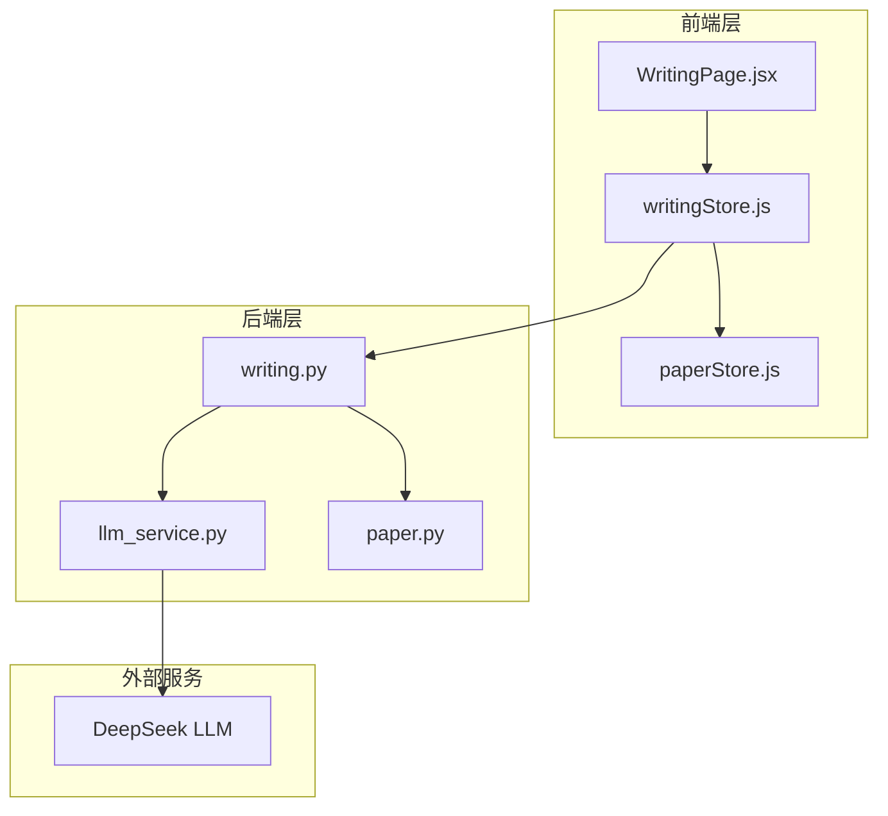
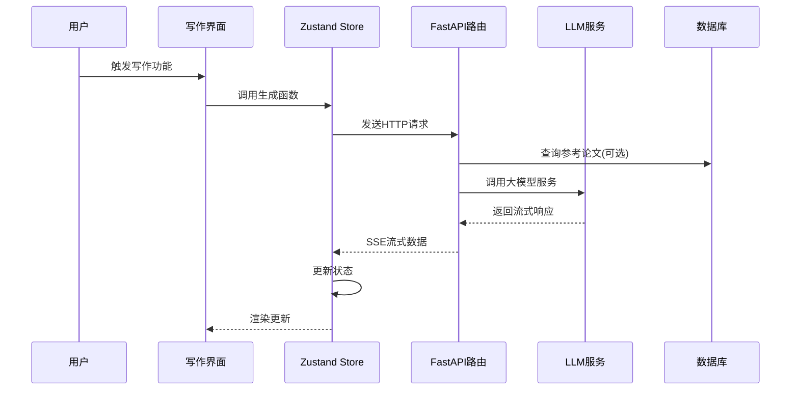
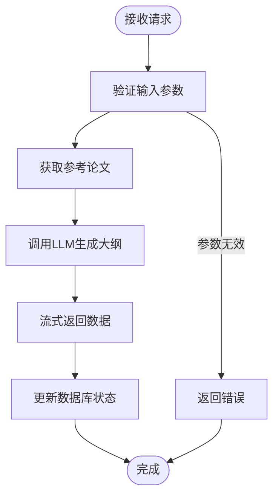
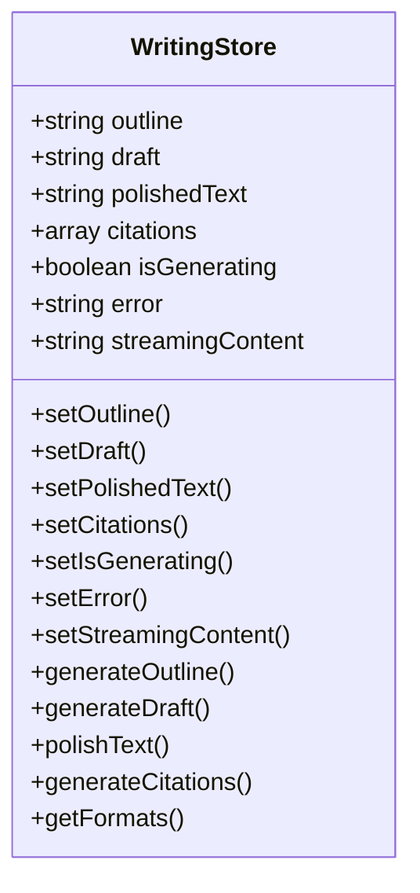
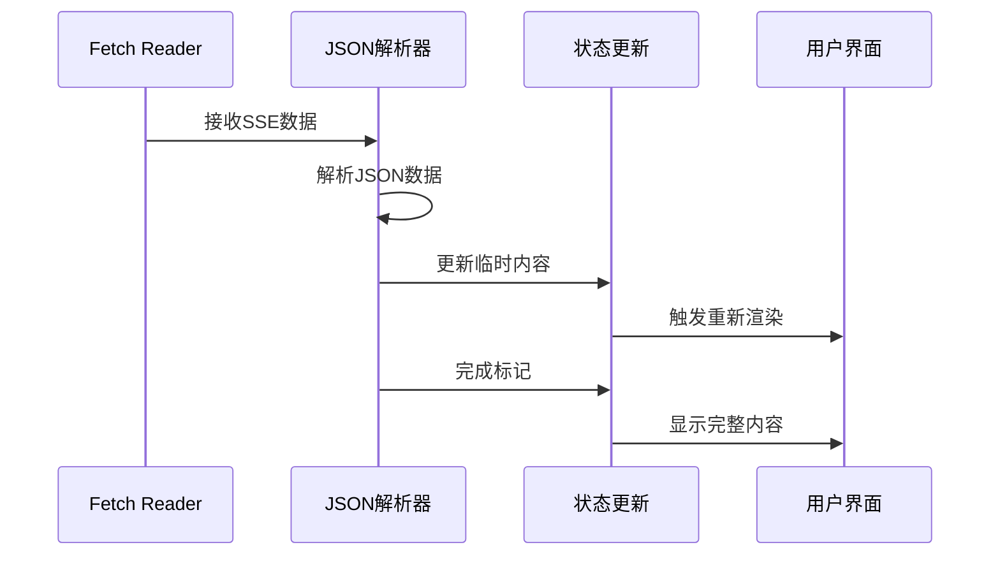
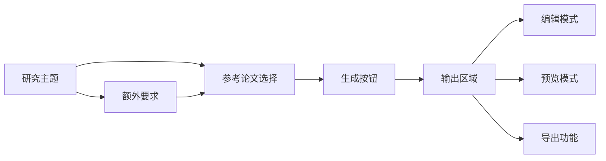
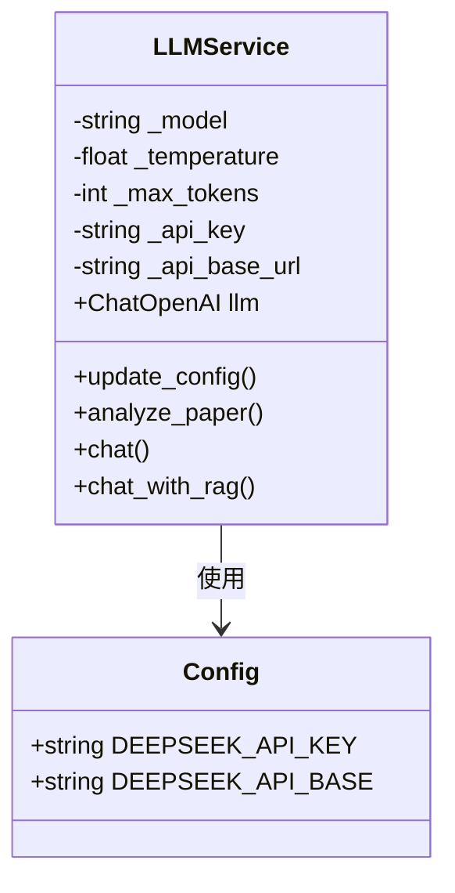
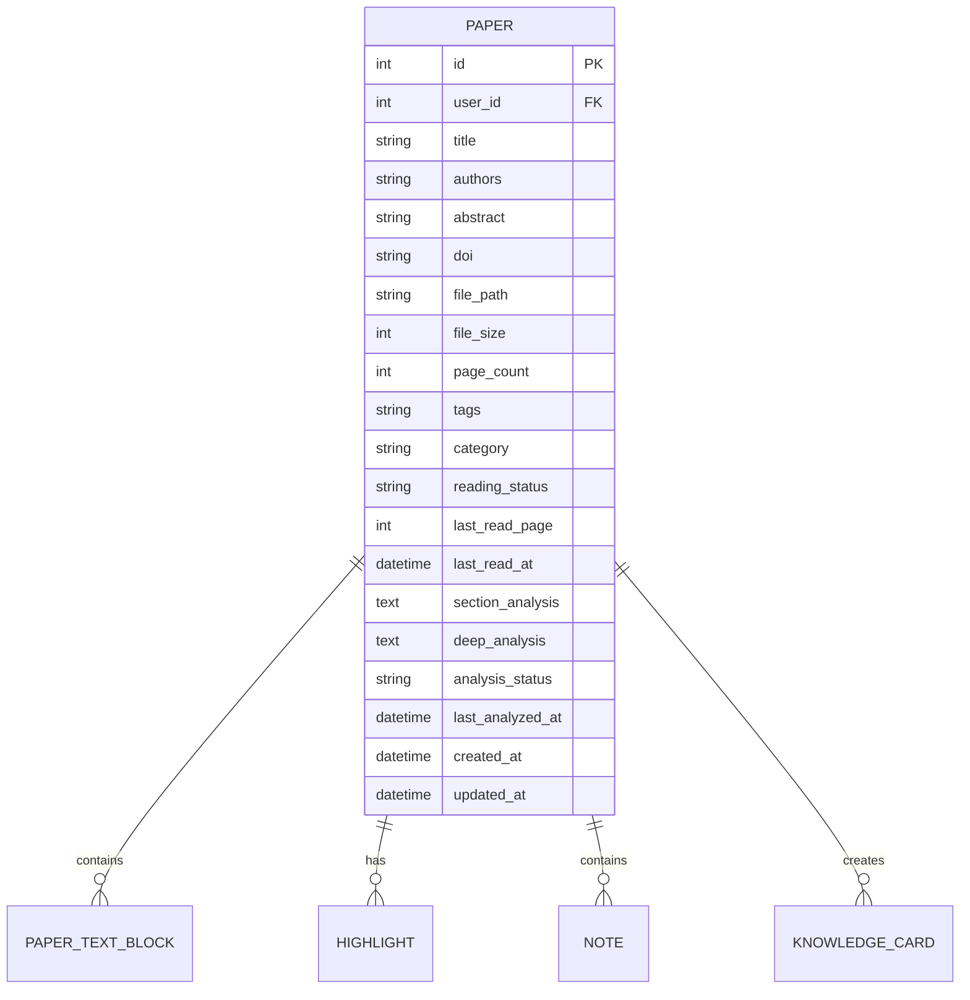
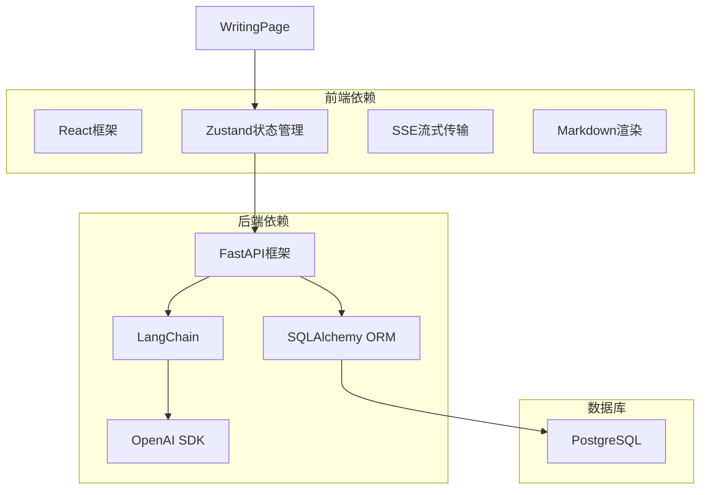

# 写作状态管理

<cite>
**本文档引用的文件**
- [writing.py](file://backend/app/routers/writing.py)
- [writingStore.js](file://frontend/src/stores/writingStore.js)
- [WritingPage.jsx](file://frontend/src/pages/WritingPage.jsx)
- [llm_service.py](file://backend/app/services/llm_service.py)
- [llm_service.py](file://backend/app/services/llm/llm_service.py)
- [paper.py](file://backend/app/models/paper.py)
- [paperStore.js](file://frontend/src/stores/paperStore.js)
</cite>

## 目录
1. [简介](#简介)
2. [项目结构](#项目结构)
3. [核心组件](#核心组件)
4. [架构概览](#架构概览)
5. [详细组件分析](#详细组件分析)
6. [依赖关系分析](#依赖关系分析)
7. [性能考虑](#性能考虑)
8. [故障排除指南](#故障排除指南)
9. [结论](#结论)

## 简介

PaperChat 的写作状态管理系统是一个完整的学术写作辅助平台，专注于为用户提供智能的写作支持。该系统通过流式生成技术，实现了大纲生成、段落初稿生成、学术润色和引用格式生成等核心功能。

系统采用前后端分离架构，后端基于 FastAPI 提供 RESTful API，前端使用 React 和 Zustand 状态管理库构建用户界面。整个系统支持实时流式响应，提供流畅的用户体验。

## 项目结构

PaperChat 的写作状态管理架构主要由以下层次组成：

**图表来源**
- [writing.py:1-287](file://backend/app/routers/writing.py#L1-L287)
- [writingStore.js:1-275](file://frontend/src/stores/writingStore.js#L1-L275)
- [WritingPage.jsx:1-800](file://frontend/src/pages/WritingPage.jsx#L1-L800)

**章节来源**
- [writing.py:1-287](file://backend/app/routers/writing.py#L1-L287)
- [writingStore.js:1-275](file://frontend/src/stores/writingStore.js#L1-L275)
- [WritingPage.jsx:1-800](file://frontend/src/pages/WritingPage.jsx#L1-L800)

## 核心组件

### 写作功能模块

系统提供四大核心写作功能：

1. **论文大纲生成** - 基于研究主题和参考论文生成结构化大纲
2. **段落初稿生成** - 根据大纲节点生成详细的学术段落
3. **学术文本润色** - 提升文本的学术性、语法性和流畅性
4. **引用格式生成** - 自动生成符合不同标准的参考文献格式

### 状态管理架构

前端使用 Zustand 创建集中式状态管理，包含以下核心状态：

- `outline`: 论文大纲内容
- `draft`: 段落初稿内容  
- `polishedText`: 润色后的文本
- `citations`: 引用列表
- `isGenerating`: 生成状态指示器
- `error`: 错误信息存储
- `streamingContent`: 流式生成的临时内容

**章节来源**
- [writingStore.js:4-34](file://frontend/src/stores/writingStore.js#L4-L34)
- [writing.py:22-46](file://backend/app/routers/writing.py#L22-L46)

## 架构概览

系统采用分层架构设计，确保各组件职责明确且松耦合：

**图表来源**
- [WritingPage.jsx:36-184](file://frontend/src/pages/WritingPage.jsx#L36-L184)
- [writingStore.js:37-97](file://frontend/src/stores/writingStore.js#L37-L97)
- [writing.py:72-108](file://backend/app/routers/writing.py#L72-L108)

## 详细组件分析

### 写作路由层

后端路由层负责处理所有写作相关的 HTTP 请求，采用流式响应机制：

#### 大纲生成功能

**图表来源**
- [writing.py:72-108](file://backend/app/routers/writing.py#L72-L108)
- [writing.py:48-69](file://backend/app/routers/writing.py#L48-L69)

#### 段落生成功能

段落生成支持多种写作风格：
- 学术风格 (academic)
- 正式风格 (formal)  
- 简洁风格 (concise)

#### 文本润色功能

提供四种润色类型：
- 学术表达优化
- 语法修正
- 流畅性提升
- 精简表达

**章节来源**
- [writing.py:72-184](file://backend/app/routers/writing.py#L72-L184)
- [writing.py:22-46](file://backend/app/routers/writing.py#L22-L46)

### 前端状态管理层

前端使用 Zustand 创建响应式状态管理：

#### 状态结构设计

**图表来源**
- [writingStore.js:4-272](file://frontend/src/stores/writingStore.js#L4-L272)

#### 流式数据处理

前端实现流式数据处理机制：

**图表来源**
- [writingStore.js:59-96](file://frontend/src/stores/writingStore.js#L59-L96)
- [writingStore.js:122-159](file://frontend/src/stores/writingStore.js#L122-L159)

**章节来源**
- [writingStore.js:1-275](file://frontend/src/stores/writingStore.js#L1-L275)

### 写作界面组件

写作界面采用标签页设计，每个功能模块独立实现：

#### 大纲生成界面

**图表来源**
- [WritingPage.jsx:36-184](file://frontend/src/pages/WritingPage.jsx#L36-L184)

#### 段落生成界面

支持参考内容输入和写作风格选择，提供实时预览功能。

#### 文本润色界面

提供对比视图功能，允许用户同时查看原文和润色后的文本。

**章节来源**
- [WritingPage.jsx:186-414](file://frontend/src/pages/WritingPage.jsx#L186-L414)

### LLM 服务集成

系统集成了 DeepSeek 大模型服务，提供强大的语言处理能力：

#### 配置管理

**图表来源**
- [llm_service.py:29-128](file://backend/app/services/llm/llm_service.py#L29-L128)

#### 提示词模板

系统使用专门的提示词模板来指导 LLM 生成高质量的写作内容。

**章节来源**
- [llm_service.py:1-200](file://backend/app/services/llm/llm_service.py#L1-L200)
- [llm_service.py:1-53](file://backend/app/services/llm_service.py#L1-L53)

### 论文数据模型

论文模型支持写作功能所需的元数据：

**图表来源**
- [paper.py:11-62](file://backend/app/models/paper.py#L11-L62)

**章节来源**
- [paper.py:1-85](file://backend/app/models/paper.py#L1-L85)

## 依赖关系分析

系统各组件之间的依赖关系如下：

**图表来源**
- [writing.py:5-17](file://backend/app/routers/writing.py#L5-L17)
- [writingStore.js:1-2](file://frontend/src/stores/writingStore.js#L1-L2)

**章节来源**
- [writing.py:1-19](file://backend/app/routers/writing.py#L1-L19)
- [writingStore.js:1-2](file://frontend/src/stores/writingStore.js#L1-L2)

## 性能考虑

### 流式响应优化

系统采用 Server-Sent Events (SSE) 实现流式响应，具有以下优势：

1. **实时反馈** - 用户可以即时看到生成过程
2. **内存效率** - 避免一次性加载大量数据
3. **网络优化** - 减少网络延迟影响

### 缓存策略

- **临时内容缓存** - 流式生成过程中的中间结果
- **配置缓存** - LLM 配置信息的本地缓存
- **错误状态缓存** - 错误信息的持久化存储

### 并发处理

系统支持多个写作任务并发执行，每个任务都有独立的状态空间，避免相互干扰。

## 故障排除指南

### 常见问题及解决方案

#### API 请求失败

**症状**: 写作功能无法正常工作，出现网络错误

**可能原因**:
- LLM 服务不可用
- 网络连接问题
- API 密钥配置错误

**解决步骤**:
1. 检查 LLM 服务状态
2. 验证网络连接
3. 确认 API 密钥配置

#### 流式响应中断

**症状**: 文本生成过程中断，无法获得完整结果

**可能原因**:
- 网络不稳定
- 服务器超时
- 客户端连接异常

**解决步骤**:
1. 检查网络连接稳定性
2. 增加超时时间配置
3. 重新发起请求

#### 状态同步问题

**症状**: 前后端状态不一致

**解决步骤**:
1. 清除浏览器缓存
2. 重新登录系统
3. 检查客户端状态同步逻辑

**章节来源**
- [writingStore.js:94-96](file://frontend/src/stores/writingStore.js#L94-L96)
- [writingStore.js:157-160](file://frontend/src/stores/writingStore.js#L157-L160)

## 结论

PaperChat 的写作状态管理系统通过精心设计的架构，为用户提供了强大而便捷的学术写作辅助功能。系统的主要特点包括：

1. **完整的写作流程** - 从大纲生成到最终润色的一站式服务
2. **实时流式体验** - 提供即时的写作反馈和预览
3. **灵活的状态管理** - 通过 Zustand 实现高效的前端状态控制
4. **可扩展的架构** - 支持未来功能的扩展和集成

该系统不仅满足了当前的写作辅助需求，还为未来的功能扩展奠定了坚实的基础。通过合理的架构设计和状态管理策略，系统能够为用户提供稳定、高效、流畅的写作体验。