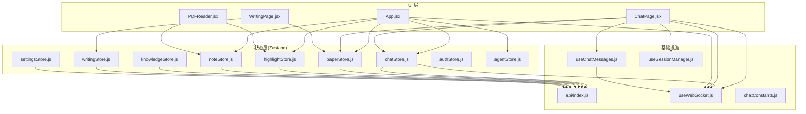
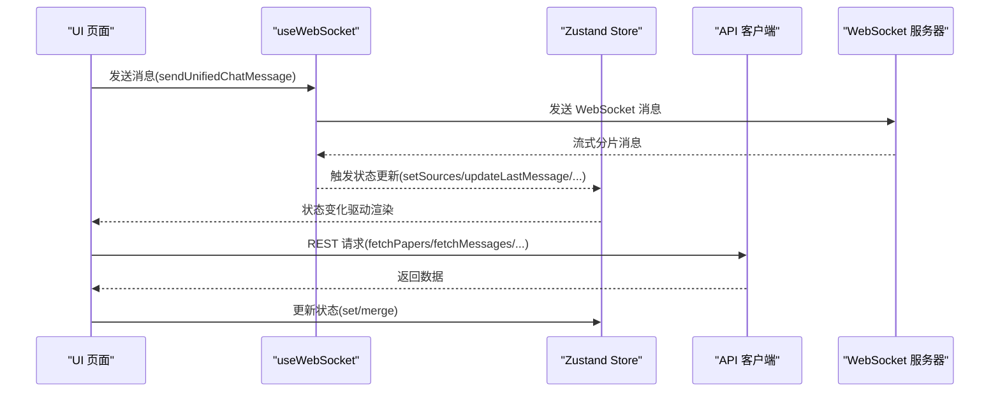
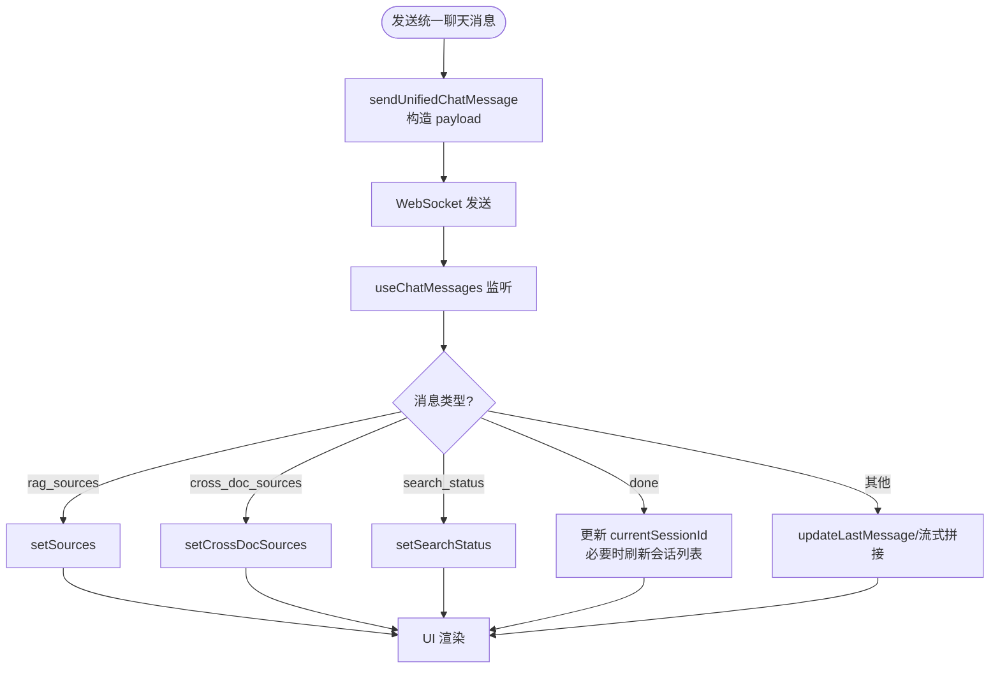
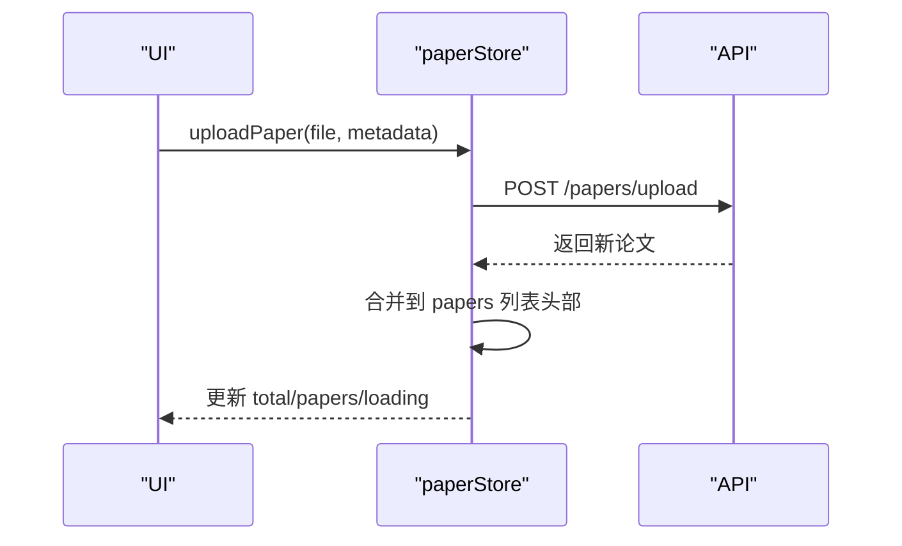
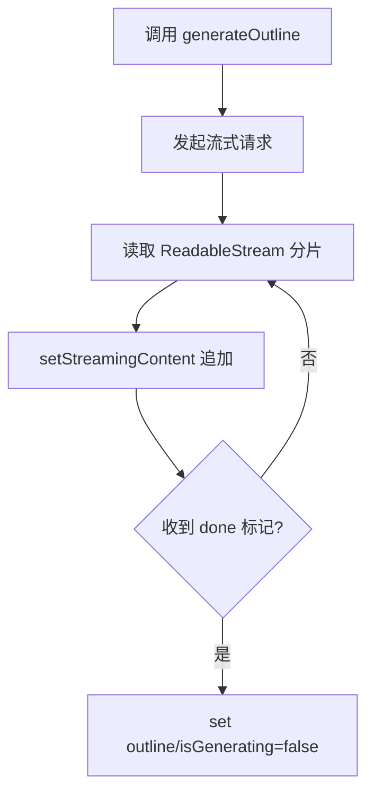
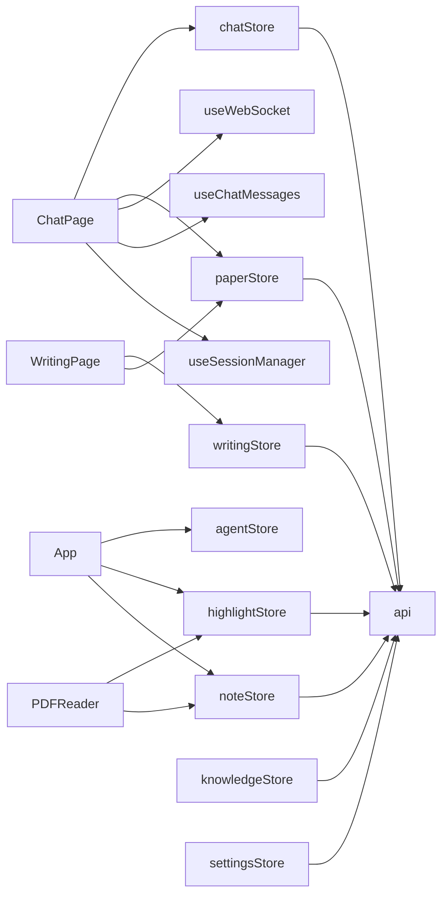

# 状态管理系统

<cite>
**本文档引用的文件**
- [chatStore.js](file://frontend/src/stores/chatStore.js)
- [paperStore.js](file://frontend/src/stores/paperStore.js)
- [highlightStore.js](file://frontend/src/stores/highlightStore.js)
- [noteStore.js](file://frontend/src/stores/noteStore.js)
- [knowledgeStore.js](file://frontend/src/stores/knowledgeStore.js)
- [writingStore.js](file://frontend/src/stores/writingStore.js)
- [settingsStore.js](file://frontend/src/stores/settingsStore.js)
- [authStore.js](file://frontend/src/stores/authStore.js)
- [agentStore.js](file://frontend/src/stores/agentStore.js)
- [App.jsx](file://frontend/src/App.jsx)
- [ChatPage.jsx](file://frontend/src/pages/ChatPage.jsx)
- [WritingPage.jsx](file://frontend/src/pages/WritingPage.jsx)
- [PDFReader.jsx](file://frontend/src/components/PDFReader/PDFReader.jsx)
- [useWebSocket.js](file://frontend/src/hooks/useWebSocket.js)
- [useChatMessages.js](file://frontend/src/hooks/useChatMessages.js)
- [useSessionManager.js](file://frontend/src/hooks/useSessionManager.js)
- [chatConstants.js](file://frontend/src/utils/chatConstants.js)
- [index.js](file://frontend/src/api/index.js)
</cite>

## 目录
1. [简介](#简介)
2. [项目结构](#项目结构)
3. [核心组件](#核心组件)
4. [架构总览](#架构总览)
5. [详细组件分析](#详细组件分析)
6. [依赖分析](#依赖分析)
7. [性能考量](#性能考量)
8. [故障排查指南](#故障排查指南)
9. [结论](#结论)
10. [附录](#附录)

## 简介
本文件系统性梳理 PaperChat 前端基于 Zustand 的状态管理架构，覆盖聊天、论文、高亮、笔记、知识库、写作、设置、认证与 Agent 等状态域。文档重点阐述：
- 各 store 的职责边界与数据结构
- 状态更新机制与异步流程
- 状态间依赖关系、数据流转与同步策略
- WebSocket 驱动的实时状态更新
- 性能优化与调试建议
- 最佳实践与错误处理策略

## 项目结构
前端状态管理采用“按功能域划分”的 store 设计，每个 store 聚合与其业务相关的状态与动作，并通过共享的 API 客户端与 WebSocket Hook 与后端交互。

图表来源
- [chatStore.js:1-417](file://frontend/src/stores/chatStore.js#L1-L417)
- [paperStore.js:1-357](file://frontend/src/stores/paperStore.js#L1-L357)
- [highlightStore.js:1-102](file://frontend/src/stores/highlightStore.js#L1-L102)
- [noteStore.js:1-145](file://frontend/src/stores/noteStore.js#L1-L145)
- [knowledgeStore.js:1-422](file://frontend/src/stores/knowledgeStore.js#L1-L422)
- [writingStore.js:1-275](file://frontend/src/stores/writingStore.js#L1-L275)
- [settingsStore.js:1-131](file://frontend/src/stores/settingsStore.js#L1-L131)
- [authStore.js:1-23](file://frontend/src/stores/authStore.js#L1-L23)
- [agentStore.js:1-132](file://frontend/src/stores/agentStore.js#L1-L132)
- [App.jsx:1-1010](file://frontend/src/App.jsx#L1-L1010)
- [ChatPage.jsx:1-434](file://frontend/src/pages/ChatPage.jsx#L1-L434)
- [WritingPage.jsx:1-1156](file://frontend/src/pages/WritingPage.jsx#L1-L1156)
- [PDFReader.jsx:1-656](file://frontend/src/components/PDFReader/PDFReader.jsx#L1-L656)
- [useWebSocket.js:1-180](file://frontend/src/hooks/useWebSocket.js#L1-L180)
- [useChatMessages.js:1-103](file://frontend/src/hooks/useChatMessages.js#L1-L103)
- [useSessionManager.js:1-111](file://frontend/src/hooks/useSessionManager.js#L1-L111)
- [chatConstants.js:1-23](file://frontend/src/utils/chatConstants.js#L1-L23)
- [index.js:1-12](file://frontend/src/api/index.js#L1-L12)

章节来源
- [App.jsx:1-1010](file://frontend/src/App.jsx#L1-L1010)
- [ChatPage.jsx:1-434](file://frontend/src/pages/ChatPage.jsx#L1-L434)
- [WritingPage.jsx:1-1156](file://frontend/src/pages/WritingPage.jsx#L1-L1156)
- [PDFReader.jsx:1-656](file://frontend/src/components/PDFReader/PDFReader.jsx#L1-L656)
- [useWebSocket.js:1-180](file://frontend/src/hooks/useWebSocket.js#L1-L180)
- [useChatMessages.js:1-103](file://frontend/src/hooks/useChatMessages.js#L1-L103)
- [useSessionManager.js:1-111](file://frontend/src/hooks/useSessionManager.js#L1-L111)
- [chatConstants.js:1-23](file://frontend/src/utils/chatConstants.js#L1-L23)
- [index.js:1-12](file://frontend/src/api/index.js#L1-L12)

## 核心组件
- 聊天状态(chatStore): 会话管理、消息流式渲染、跨文档问答、联网搜索、意图识别与来源追踪。
- 论文状态(paperStore): 论文列表、详情、上传、删除、更新、推荐、关键词提取、批量上传。
- 高亮状态(highlightStore): 论文高亮的增删改查与选中态。
- 笔记状态(noteStore): 笔记的增删改查、搜索、详情与活动笔记。
- 知识库状态(knowledgeStore): 知识卡片的增删改查、搜索、图谱、统计、自动标签、关联管理。
- 写作状态(writingStore): 大纲生成、段落生成、学术润色、引用格式生成与流式渲染。
- 设置状态(settingsStore): 用户偏好、外观设置、本地与远程同步、变更追踪。
- 认证状态(authStore): 单用户模式下的认证模拟，始终视为已登录。
- Agent 状态(agentStore): Agent 模式执行状态：意图、计划、步骤进度、最终答案、完成与错误。

章节来源
- [chatStore.js:1-417](file://frontend/src/stores/chatStore.js#L1-L417)
- [paperStore.js:1-357](file://frontend/src/stores/paperStore.js#L1-L357)
- [highlightStore.js:1-102](file://frontend/src/stores/highlightStore.js#L1-L102)
- [noteStore.js:1-145](file://frontend/src/stores/noteStore.js#L1-L145)
- [knowledgeStore.js:1-422](file://frontend/src/stores/knowledgeStore.js#L1-L422)
- [writingStore.js:1-275](file://frontend/src/stores/writingStore.js#L1-L275)
- [settingsStore.js:1-131](file://frontend/src/stores/settingsStore.js#L1-L131)
- [authStore.js:1-23](file://frontend/src/stores/authStore.js#L1-L23)
- [agentStore.js:1-132](file://frontend/src/stores/agentStore.js#L1-L132)

## 架构总览
Zustand store 通过 API 客户端与后端 REST 接口通信；聊天与分析场景通过 WebSocket 实现流式数据与实时状态更新。UI 页面通过 hooks 管理 WebSocket 订阅、会话切换与消息渲染。

图表来源
- [useWebSocket.js:140-154](file://frontend/src/hooks/useWebSocket.js#L140-L154)
- [chatStore.js:396-413](file://frontend/src/stores/chatStore.js#L396-L413)
- [useChatMessages.js:39-97](file://frontend/src/hooks/useChatMessages.js#L39-L97)
- [index.js:1-12](file://frontend/src/api/index.js#L1-L12)

## 详细组件分析

### 聊天状态(chatStore)
- 职责：维护会话列表、当前会话、消息流、跨文档问答、联网搜索、意图识别与来源。
- 数据结构要点：
  - sessions: 会话数组
  - currentSessionId: 当前会话标识
  - messages: 消息数组（含 role/content/sources）
  - sources/crossDocSources: 当前回答的引用来源
  - selectedPaperIds/isCrossDocMode: 跨文档问答上下文
  - enableSearch/searchStatus: 联网搜索开关与状态
  - currentIntent: 意图识别结果
- 更新机制：
  - 异步 CRUD：fetchSessions/createSession/deleteSession/getOrCreateSessionByPaper/renameSession/autoNameSession
  - 消息流式：addMessage/updateLastMessage/setSources/clearMessages/reset
  - 跨文档：addPaperToCrossDoc/removePaperFromCrossDoc/setCrossDocPapers/setCrossDocSources/createCrossDocSession
  - 统一聊天：sendUnifiedChatMessage 通过 WebSocket 发送统一协议消息
- 依赖与同步：
  - 与 useWebSocket 集成，通过 useChatMessages 监听流式分片、意图与完成事件，自动更新 sources、crossDocSources、searchStatus、currentSessionId 并触发会话列表刷新。

图表来源
- [chatStore.js:396-413](file://frontend/src/stores/chatStore.js#L396-L413)
- [useChatMessages.js:42-77](file://frontend/src/hooks/useChatMessages.js#L42-L77)

章节来源
- [chatStore.js:1-417](file://frontend/src/stores/chatStore.js#L1-L417)
- [useChatMessages.js:1-103](file://frontend/src/hooks/useChatMessages.js#L1-L103)
- [ChatPage.jsx:1-434](file://frontend/src/pages/ChatPage.jsx#L1-L434)

### 论文状态(paperStore)
- 职责：论文列表、详情、上传、删除、更新、全文文本、阅读状态、推荐、关键词提取、批量上传。
- 数据结构要点：
  - papers/total/loading/error/currentPaper
  - recommendations/personalRecommendations/webRecommendations 及其 loading 状态
- 更新机制：
  - fetchPapers/fetchPaper/uploadPaper/deletePaper/updatePaper
  - fetchPaperText/getPaperFileUrl
  - 标记阅读：markAsReading（同时更新当前论文与列表项）
  - 推荐：fetchRecommendations/fetchPersonalRecommendations/fetchWebRecommendations
  - 关键词：extractKeywords（更新 store 中的 tags 字段）
  - 批量：batchUpload/batchUploadZip（支持进度回调）

图表来源
- [paperStore.js:66-104](file://frontend/src/stores/paperStore.js#L66-L104)

章节来源
- [paperStore.js:1-357](file://frontend/src/stores/paperStore.js#L1-L357)
- [App.jsx:309-419](file://frontend/src/App.jsx#L309-L419)

### 高亮状态(highlightStore)
- 职责：论文高亮的增删改查与活动高亮。
- 数据结构要点：
  - highlights/activeHighlight/loading/error
- 更新机制：
  - fetchHighlights/createHighlight/updateHighlight/deleteHighlight
  - setActiveHighlight/clearHighlights/clearError

章节来源
- [highlightStore.js:1-102](file://frontend/src/stores/highlightStore.js#L1-L102)
- [PDFReader.jsx:238-261](file://frontend/src/components/PDFReader/PDFReader.jsx#L238-L261)

### 笔记状态(noteStore)
- 职责：笔记的增删改查、搜索、详情与活动笔记。
- 数据结构要点：
  - notes/activeNote/searchResults/loading/error
- 更新机制：
  - fetchNotes/createNote/updateNote/deleteNote/searchNotes/fetchNote
  - setActiveNote/clearSearchResults/clearNotes/clearError

章节来源
- [noteStore.js:1-145](file://frontend/src/stores/noteStore.js#L1-L145)
- [App.jsx:520-587](file://frontend/src/App.jsx#L520-L587)

### 知识库状态(knowledgeStore)
- 职责：知识卡片的增删改查、搜索、图谱、统计、自动标签、关联管理。
- 数据结构要点：
  - cards/currentCard/searchResults/graphData/stats/loading/error
  - 分页与筛选：currentPage/pageSize/filters
- 更新机制：
  - fetchCards/fetchCard/createCard/updateCard/deleteCard
  - createFromHighlight/createFromChat/searchCards/fetchGraphData/fetchStats
  - findRelations/fetchCardRelations/createRelation/deleteRelation/autoTag
  - setCurrentCard/clearCurrentCard/reset

章节来源
- [knowledgeStore.js:1-422](file://frontend/src/stores/knowledgeStore.js#L1-L422)

### 写作状态(writingStore)
- 职责：大纲生成、段落生成、学术润色、引用格式生成与流式渲染。
- 数据结构要点：
  - outline/draft/polishedText/citations/isGenerating/streamingContent/error
- 更新机制：
  - generateOutline/generateDraft/polishText（均支持流式，通过 ReadableStream 逐块更新 streamingContent）
  - generateCitations（非流式）
  - getFormats（获取支持的格式与风格列表）
  - 重置：reset

图表来源
- [writingStore.js:37-97](file://frontend/src/stores/writingStore.js#L37-L97)

章节来源
- [writingStore.js:1-275](file://frontend/src/stores/writingStore.js#L1-L275)
- [WritingPage.jsx:1-800](file://frontend/src/pages/WritingPage.jsx#L1-L800)

### 设置状态(settingsStore)
- 职责：用户偏好与外观设置的本地与远程同步、变更追踪与提示。
- 数据结构要点：
  - settings/loading/saving/error/hasChanges/pendingChanges/toastMessage
- 更新机制：
  - fetchSettings（拉取远程设置，同步外观到 localStorage）
  - updateLocalSetting（本地更新并记录 pendingChanges，同时同步外观到 localStorage）
  - saveSettings（提交 pendingChanges，合并返回的新设置，同步外观到 localStorage）
  - resetSettings（重置为默认值）
  - clearToast

章节来源
- [settingsStore.js:1-131](file://frontend/src/stores/settingsStore.js#L1-L131)

### 认证状态(authStore)
- 职责：单用户模式下的认证模拟，始终视为已登录。
- 数据结构要点：
  - user/isAuthenticated/loading/error
  - 提供兼容性方法（login/register/logout/fetchUser/updateUser/clearError），实际为空操作

章节来源
- [authStore.js:1-23](file://frontend/src/stores/authStore.js#L1-L23)

### Agent 状态(agentStore)
- 职责：Agent 模式执行状态管理：意图识别、任务计划、步骤进度、最终答案、完成与错误。
- 数据结构要点：
  - isAgentMode/isProcessing/intent/plan/currentStep/stepResults/finalAnswer/isComplete/error
- 更新机制：
  - startAgentMode/exitAgentMode/setIntent/setPlan/startStep/updateStepResult/appendAnswer/setFinalAnswer/markComplete/setError/reset
  - getStepStatus/getCurrentStepDescription

章节来源
- [agentStore.js:1-132](file://frontend/src/stores/agentStore.js#L1-L132)
- [App.jsx:135-189](file://frontend/src/App.jsx#L135-L189)

## 依赖分析
- 组件耦合与内聚：
  - ChatPage 与 paperStore、chatStore、useWebSocket、useChatMessages、useSessionManager 高度耦合，负责统一聊天体验。
  - App.jsx 在阅读页面中集成 agentStore、highlightStore、noteStore，实现论文阅读与标注、笔记联动。
  - WritingPage 与 paperStore、writingStore 联动，支撑写作与引用生成。
  - PDFReader 与 highlightStore、noteStore 联动，实现高亮与笔记的创建与跳转。
- 外部依赖：
  - axios 作为 API 客户端，统一基地址与请求头。
  - WebSocket 作为实时通信通道，集中管理连接、重连与消息分发。
- 潜在循环依赖：
  - store 之间无直接相互依赖，通过 UI 页面与 hooks 协调，避免循环依赖风险。

图表来源
- [ChatPage.jsx:1-434](file://frontend/src/pages/ChatPage.jsx#L1-L434)
- [App.jsx:1-1010](file://frontend/src/App.jsx#L1-L1010)
- [WritingPage.jsx:1-1156](file://frontend/src/pages/WritingPage.jsx#L1-L1156)
- [PDFReader.jsx:1-656](file://frontend/src/components/PDFReader/PDFReader.jsx#L1-L656)
- [index.js:1-12](file://frontend/src/api/index.js#L1-L12)

章节来源
- [ChatPage.jsx:1-434](file://frontend/src/pages/ChatPage.jsx#L1-L434)
- [App.jsx:1-1010](file://frontend/src/App.jsx#L1-L1010)
- [WritingPage.jsx:1-1156](file://frontend/src/pages/WritingPage.jsx#L1-L1156)
- [PDFReader.jsx:1-656](file://frontend/src/components/PDFReader/PDFReader.jsx#L1-L656)
- [index.js:1-12](file://frontend/src/api/index.js#L1-L12)

## 性能考量
- 聊天消息虚拟化：ChatPage 使用 @tanstack/react-virtual 对消息列表进行虚拟滚动，减少 DOM 节点数量，提升长对话性能。
- PDF 阅读懒加载：PDFReader 在滚动模式下使用 IntersectionObserver 懒加载可见页面，降低初始渲染压力。
- 流式渲染：聊天与写作均采用流式渲染，逐步更新状态，避免一次性大对象更新带来的卡顿。
- 本地存储同步：settingsStore 在更新外观设置时同步写入 localStorage，避免闪烁并提升首次加载速度。
- WebSocket 复用：全局 WebSocket 连接与处理器，减少重复连接与内存占用。

## 故障排查指南
- WebSocket 连接问题：
  - 检查 useWebSocket 的连接状态与重连逻辑，确认服务端 WebSocket 地址与鉴权参数。
  - 使用 onMessage 订阅 'error' 与 'cancelled' 事件，定位异常与取消原因。
- 聊天消息丢失或错乱：
  - 确认 useChatMessages 的订阅顺序与 isChattingRef 控制，避免非聊天状态下接收分片。
  - 检查 setSources/setCrossDocSources/setSearchStatus 的调用时机与消息类型匹配。
- 写作流式渲染异常：
  - 检查 ReadableStream 的解析逻辑，确保 'data: ' 前缀与 JSON 结构正确。
  - 关注 done/error 标记，及时结束渲染并清理状态。
- 论文上传/批量导入失败：
  - 查看 onUploadProgress 回调与错误响应，确认文件大小与格式限制。
  - 确认 fetchPapers 刷新逻辑，避免列表不同步。
- 高亮/笔记操作失败：
  - 检查后端接口返回与错误提示，确认权限与数据完整性。
  - 确认 activeHighlight/activeNote 的状态同步与清理逻辑。

章节来源
- [useWebSocket.js:1-180](file://frontend/src/hooks/useWebSocket.js#L1-L180)
- [useChatMessages.js:1-103](file://frontend/src/hooks/useChatMessages.js#L1-L103)
- [writingStore.js:1-275](file://frontend/src/stores/writingStore.js#L1-L275)
- [paperStore.js:1-357](file://frontend/src/stores/paperStore.js#L1-L357)
- [highlightStore.js:1-102](file://frontend/src/stores/highlightStore.js#L1-L102)
- [noteStore.js:1-145](file://frontend/src/stores/noteStore.js#L1-L145)

## 结论
PaperChat 的 Zustand 状态管理以“功能域”为中心，结合 WebSocket 实现实时交互与流式渲染，配合 hooks 抽象复杂的状态订阅与会话管理，形成清晰的职责边界与稳定的运行机制。通过虚拟化、懒加载与本地存储同步等手段，兼顾性能与用户体验。建议持续完善错误监控与日志记录，进一步增强可观测性与可维护性。

## 附录
- 最佳实践
  - 将副作用封装为 store 动作，避免在组件中直接调用 API。
  - 使用 loading/error 字段统一错误处理与用户反馈。
  - 对长列表使用虚拟化，对大文档使用懒加载。
  - 对流式数据采用增量更新，避免全量替换。
- 调试工具
  - 在开发环境开启 React DevTools 与 Zustand Devtools，观察状态变化轨迹。
  - 使用浏览器 Network 面板监控 WebSocket 与 API 请求。
  - 在关键路径添加日志，定位消息类型与状态更新时机。