# 知识库状态管理

<cite>
**本文档引用的文件**
- [knowledge.py](file://backend/app/models/knowledge.py)
- [knowledge.py](file://backend/app/routers/knowledge.py)
- [knowledge_service.py](file://backend/app/services/knowledge_service.py)
- [knowledgeStore.js](file://frontend/src/stores/knowledgeStore.js)
- [KnowledgePage.jsx](file://frontend/src/pages/KnowledgePage.jsx)
- [KnowledgeCardEditor.jsx](file://frontend/src/components/KnowledgeCardEditor/KnowledgeCardEditor.jsx)
- [paper.py](file://backend/app/models/paper.py)
- [highlight.py](file://backend/app/models/highlight.py)
- [note.py](file://backend/app/models/note.py)
- [paper.py](file://backend/app/schemas/paper.py)
- [highlight.py](file://backend/app/schemas/highlight.py)
- [note.py](file://backend/app/schemas/note.py)
- [recommendations.py](file://backend/app/routers/recommendations.py)
- [recommendation_service.py](file://backend/app/services/recommendation_service.py)
- [rag_service.py](file://backend/app/services/rag_service.py)
</cite>

## 目录
1. [简介](#简介)
2. [项目结构](#项目结构)
3. [核心组件](#核心组件)
4. [架构概览](#架构概览)
5. [详细组件分析](#详细组件分析)
6. [依赖分析](#依赖分析)
7. [性能考虑](#性能考虑)
8. [故障排除指南](#故障排除指南)
9. [结论](#结论)

## 简介

PaperChat 知识库状态管理系统是一个完整的学术知识管理解决方案，专注于论文阅读过程中的知识提取、组织和检索。该系统通过智能的自动提取机制、灵活的标签系统和强大的搜索功能，帮助用户高效地管理和利用学术知识。

系统的核心特性包括：
- 智能知识卡片创建（从高亮、问答、分析自动提取）
- 多维度标签和分类系统
- 向量检索和关键词混合搜索
- 知识图谱构建和关联分析
- 个性化推荐算法
- 实时状态管理和同步

## 项目结构

PaperChat 采用前后端分离的架构设计，主要分为三个层次：

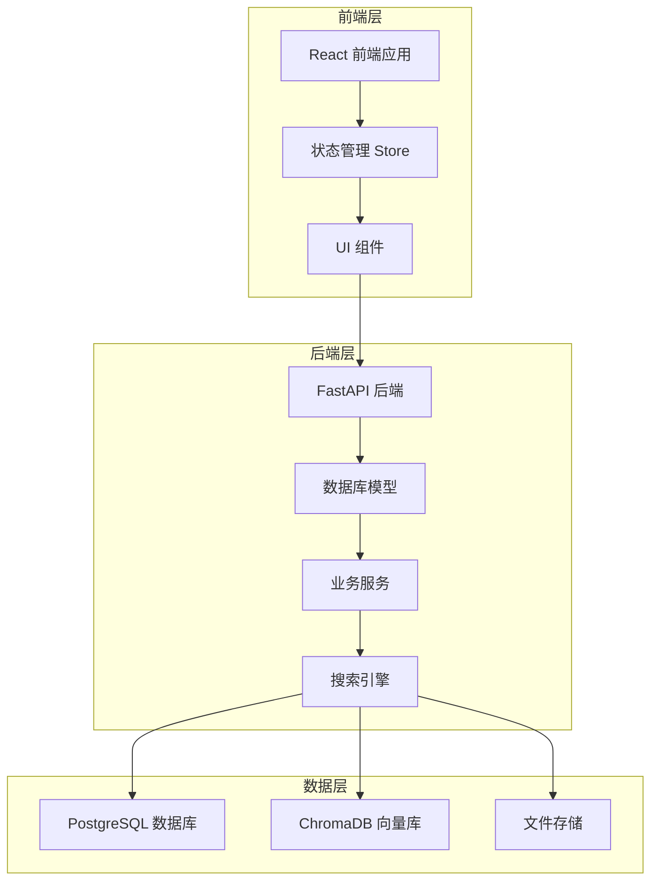

**图表来源**
- [knowledgeStore.js:1-422](file://frontend/src/stores/knowledgeStore.js#L1-L422)
- [knowledge.py:1-80](file://backend/app/models/knowledge.py#L1-L80)
- [knowledge_service.py:1-662](file://backend/app/services/knowledge_service.py#L1-L662)

**章节来源**
- [knowledgeStore.js:1-422](file://frontend/src/stores/knowledgeStore.js#L1-L422)
- [knowledge.py:1-80](file://backend/app/models/knowledge.py#L1-L80)
- [knowledge_service.py:1-662](file://backend/app/services/knowledge_service.py#L1-L662)

## 核心组件

### 知识卡片模型

知识卡片是系统的核心实体，负责存储从各种来源提取的学术知识。每个知识卡片都包含丰富的元数据和关联信息。

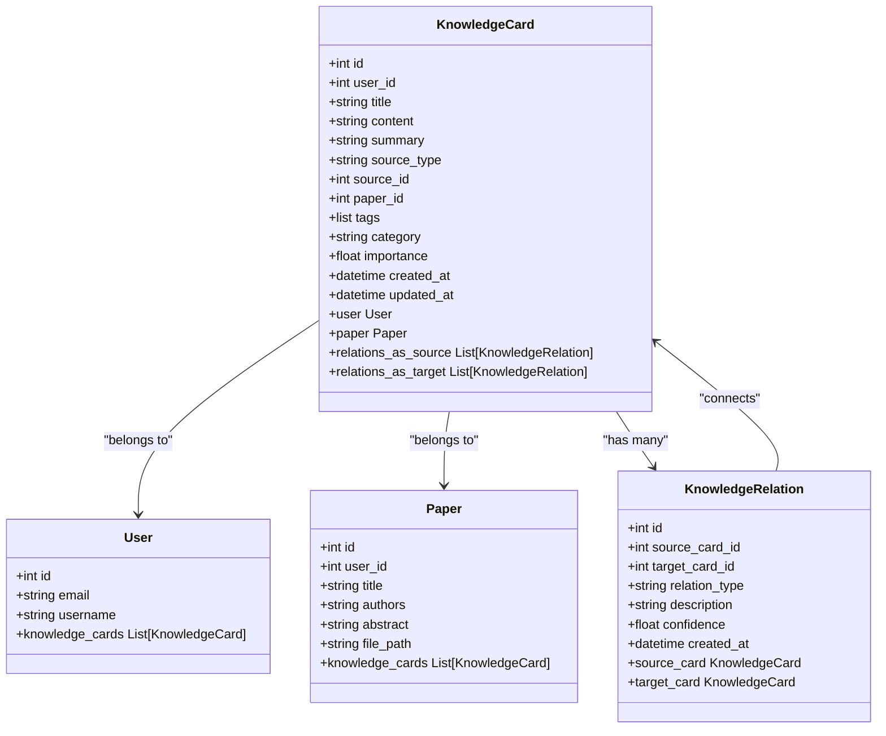

**图表来源**
- [knowledge.py:14-80](file://backend/app/models/knowledge.py#L14-L80)
- [paper.py:11-62](file://backend/app/models/paper.py#L11-L62)

### 状态管理架构

前端采用 Zustand 状态管理库，实现了完整的知识库状态管理：

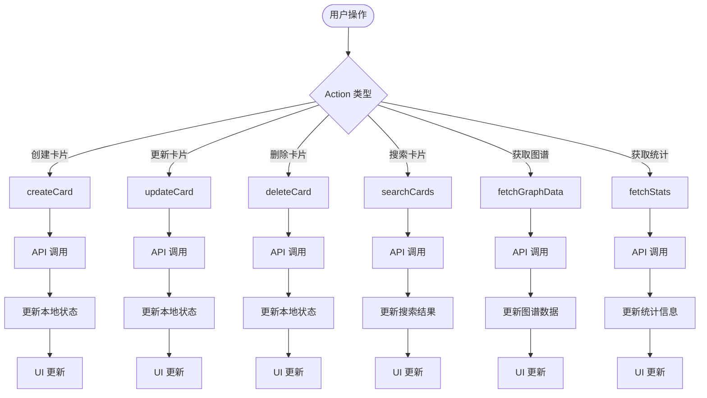

**图表来源**
- [knowledgeStore.js:94-171](file://frontend/src/stores/knowledgeStore.js#L94-L171)
- [knowledgeStore.js:227-249](file://frontend/src/stores/knowledgeStore.js#L227-L249)

**章节来源**
- [knowledge.py:14-80](file://backend/app/models/knowledge.py#L14-L80)
- [knowledgeStore.js:1-422](file://frontend/src/stores/knowledgeStore.js#L1-L422)

## 架构概览

PaperChat 知识库状态管理采用现代化的全栈架构，结合了多种技术优势：

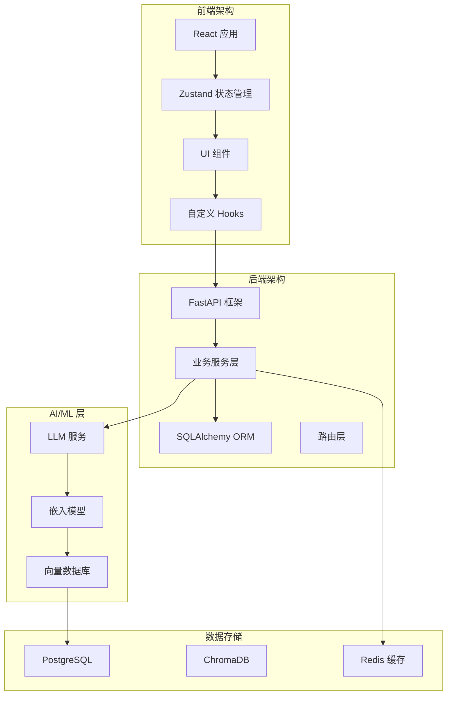

**图表来源**
- [knowledgeStore.js:1-422](file://frontend/src/stores/knowledgeStore.js#L1-L422)
- [knowledge_service.py:1-662](file://backend/app/services/knowledge_service.py#L1-L662)
- [rag_service.py:1-415](file://backend/app/services/rag_service.py#L1-L415)

### 数据流处理

系统实现了完整的数据流处理管道，从原始数据到最终展示：

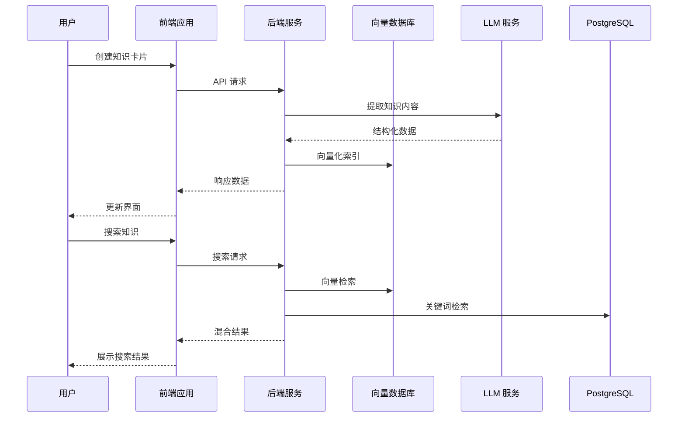

**图表来源**
- [knowledge.py:345-356](file://backend/app/routers/knowledge.py#L345-L356)
- [knowledge_service.py:350-464](file://backend/app/services/knowledge_service.py#L350-L464)

**章节来源**
- [knowledge.py:1-550](file://backend/app/routers/knowledge.py#L1-L550)
- [knowledge_service.py:1-662](file://backend/app/services/knowledge_service.py#L1-L662)

## 详细组件分析

### 知识卡片状态管理

#### 前端状态管理

前端使用 Zustand 实现了完整的知识卡片状态管理，包括：

**核心状态属性**：
- `cards`: 知识卡片列表
- `currentCard`: 当前选中的卡片
- `searchResults`: 搜索结果
- `graphData`: 知识图谱数据
- `stats`: 统计信息
- `loading`: 加载状态
- `error`: 错误信息

**筛选和分页状态**：
- `currentPage`: 当前页码
- `pageSize`: 每页数量
- `filters`: 筛选条件（分类、来源类型、标签、搜索关键词）

**章节来源**
- [knowledgeStore.js:4-418](file://frontend/src/stores/knowledgeStore.js#L4-L418)

#### 后端 API 管理

后端提供了完整的知识卡片 CRUD 操作和高级功能：

**核心 API 端点**：
- `GET /knowledge/cards`: 获取知识卡片列表（支持分页、筛选、搜索）
- `POST /knowledge/cards`: 创建知识卡片
- `GET /knowledge/cards/{id}`: 获取卡片详情
- `PUT /knowledge/cards/{id}`: 更新卡片
- `DELETE /knowledge/cards/{id}`: 删除卡片

**高级功能 API**：
- `POST /knowledge/cards/from-highlight/{id}`: 从高亮创建卡片
- `POST /knowledge/cards/from-chat`: 从问答创建卡片
- `GET /knowledge/search`: 全局搜索
- `GET /knowledge/graph`: 获取知识图谱
- `GET /knowledge/stats`: 获取统计信息

**章节来源**
- [knowledge.py:130-546](file://backend/app/routers/knowledge.py#L130-L546)

### 自动提取机制

系统实现了多种智能提取机制，从不同来源自动创建知识卡片：

#### 高亮提取流程

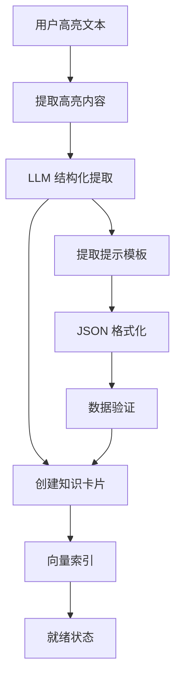

**图表来源**
- [knowledge_service.py:82-162](file://backend/app/services/knowledge_service.py#L82-L162)

#### 问答提取流程

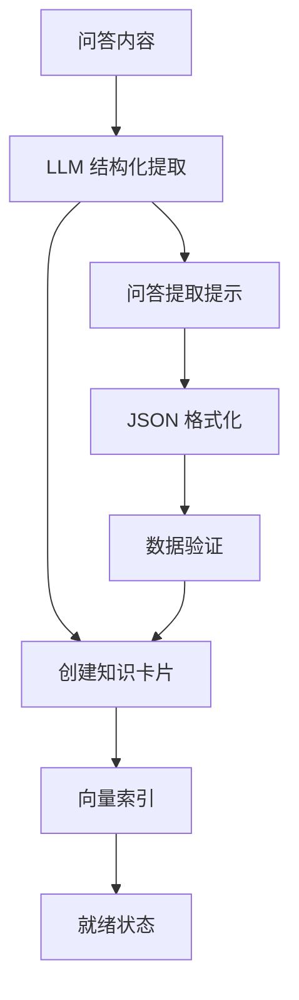

**图表来源**
- [knowledge_service.py:164-231](file://backend/app/services/knowledge_service.py#L164-L231)

**章节来源**
- [knowledge_service.py:20-76](file://backend/app/services/knowledge_service.py#L20-L76)

### 搜索和检索系统

#### 混合检索架构

系统采用了向量检索和关键词检索相结合的混合架构：

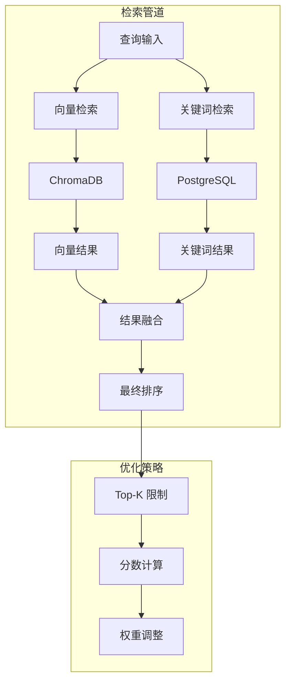

**图表来源**
- [knowledge_service.py:350-464](file://backend/app/services/knowledge_service.py#L350-L464)

#### 检索算法实现

**向量检索**：
- 使用句子嵌入模型生成向量
- ChromaDB 存储和查询向量
- 余弦相似度计算

**关键词检索**：
- PostgreSQL 全文搜索
- 标题和内容模糊匹配
- 标签精确匹配

**结果融合**：
- RRF（Reciprocal Rank Fusion）算法
- 向量分数和关键词分数加权
- 最终排序输出

**章节来源**
- [knowledge_service.py:350-464](file://backend/app/services/knowledge_service.py#L350-L464)
- [rag_service.py:236-309](file://backend/app/services/rag_service.py#L236-L309)

### 知识图谱构建

#### 图谱数据结构

系统实现了完整的知识图谱功能，支持卡片间的关系管理和可视化：

**节点数据结构**：
- `id`: 卡片 ID
- `title`: 标题
- `summary`: 摘要
- `content`: 内容
- `tags`: 标签列表
- `category`: 分类
- `importance`: 重要性
- `paper_id`: 关联论文
- `source_type`: 来源类型
- `created_at`: 创建时间

**边数据结构**：
- `id`: 关系 ID
- `source`: 源卡片 ID
- `target`: 目标卡片 ID
- `type`: 关系类型
- `description`: 描述
- `confidence`: 置信度

**章节来源**
- [knowledge_service.py:526-592](file://backend/app/services/knowledge_service.py#L526-L592)

### 标签系统和分类

#### 标签生成机制

系统实现了智能化的标签生成功能：

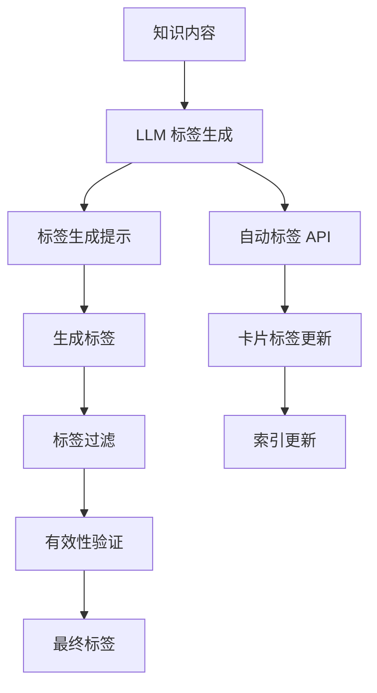

**图表来源**
- [knowledge_service.py:233-258](file://backend/app/services/knowledge_service.py#L233-L258)

#### 分类管理

**分类策略**：
- 手动分类
- 自动分类（基于内容分析）
- 分类统计和可视化

**标签云生成**：
- 统计标签出现频率
- 动态字体大小
- 交互式标签筛选

**章节来源**
- [knowledgeStore.js:272-289](file://frontend/src/stores/knowledgeStore.js#L272-L289)
- [knowledge_service.py:594-657](file://backend/app/services/knowledge_service.py#L594-L657)

### 关联分析和推荐

#### 知识关联发现

系统提供了智能的关联分析功能：

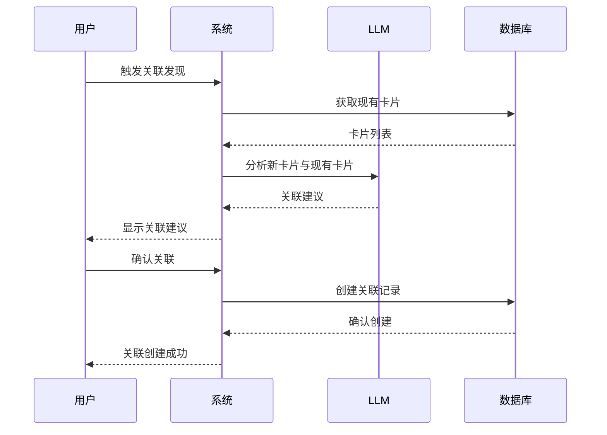

**图表来源**
- [knowledge_service.py:259-348](file://backend/app/services/knowledge_service.py#L259-L348)

#### 推荐算法

**相似论文推荐**：
- 基于内容相似性（余弦相似度）
- 论文嵌入向量计算
- 用户历史分析

**个性化推荐**：
- 用户画像构建
- 研究兴趣分析
- 阅读状态权重
- 时间衰减因子

**章节来源**
- [recommendations.py:18-118](file://backend/app/routers/recommendations.py#L18-L118)
- [recommendation_service.py:150-399](file://backend/app/services/recommendation_service.py#L150-L399)

## 依赖分析

### 组件耦合关系

系统采用了松耦合的设计模式，各组件之间通过清晰的接口进行通信：

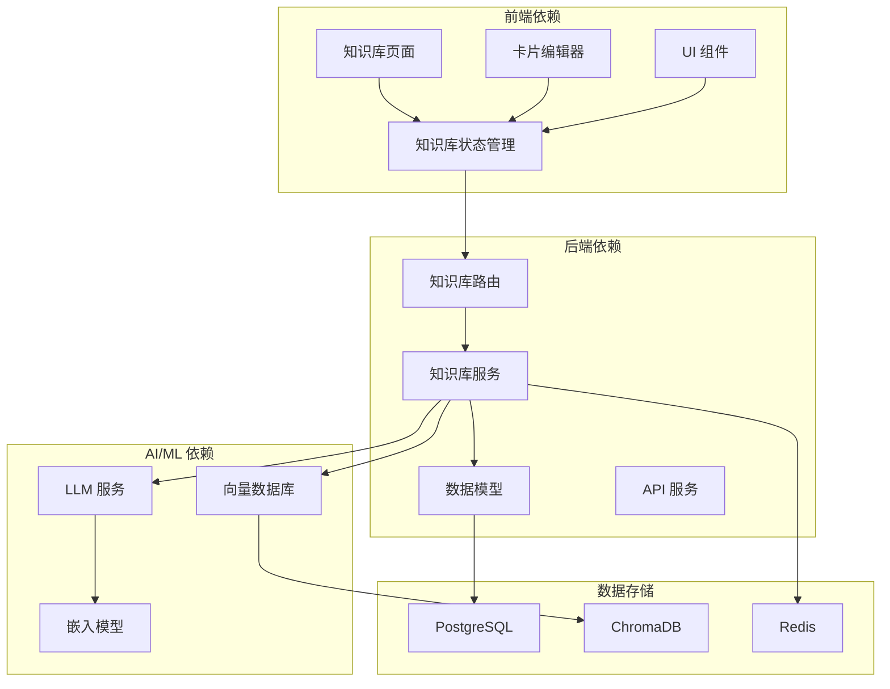

**图表来源**
- [knowledgeStore.js:1-422](file://frontend/src/stores/knowledgeStore.js#L1-L422)
- [knowledge.py:1-550](file://backend/app/routers/knowledge.py#L1-L550)
- [knowledge_service.py:1-662](file://backend/app/services/knowledge_service.py#L1-L662)

### 外部依赖

**核心依赖包**：
- **FastAPI**: Web 框架
- **SQLAlchemy**: ORM 框架
- **Zustand**: 状态管理
- **ChromaDB**: 向量数据库
- **SentenceTransformers**: 嵌入模型
- **LangChain**: LLM 集成

**开发依赖**：
- **Vite**: 构建工具
- **React**: UI 框架
- **Axios**: HTTP 客户端

**章节来源**
- [knowledgeStore.js:1-422](file://frontend/src/stores/knowledgeStore.js#L1-L422)
- [knowledge.py:1-550](file://backend/app/routers/knowledge.py#L1-L550)

## 性能考虑

### 向量检索优化

系统在向量检索方面采用了多项优化策略：

**索引优化**：
- ChromaDB 持久化存储
- HNSW 图结构优化
- 余弦相似度空间

**并发处理**：
- 异步嵌入模型加载
- 线程池执行器
- 事件循环集成

**缓存策略**：
- 嵌入向量缓存
- BM25 索引缓存
- 结果缓存

### 搜索性能

**混合检索优化**：
- RRF 算法快速融合
- Top-K 限制减少计算
- 分数阈值过滤

**数据库优化**：
- 索引优化
- 查询缓存
- 连接池管理

### 内存管理

**前端内存优化**：
- 状态分片管理
- 组件卸载清理
- 无限滚动优化

**后端内存优化**：
- 异步数据库连接
- 对象池管理
- 垃圾回收优化

## 故障排除指南

### 常见问题诊断

**知识提取失败**：
1. 检查 LLM 服务连接
2. 验证输入内容格式
3. 查看日志错误信息

**向量检索异常**：
1. 确认 ChromaDB 服务状态
2. 检查嵌入模型加载
3. 验证索引完整性

**状态同步问题**：
1. 检查 WebSocket 连接
2. 验证 API 响应
3. 查看前端控制台错误

### 错误处理策略

**前端错误处理**：
- 统一错误状态管理
- 用户友好的错误提示
- 自动重试机制

**后端错误处理**：
- 异常捕获和日志记录
- 优雅降级策略
- 健康检查监控

**章节来源**
- [knowledgeStore.js:68-73](file://frontend/src/stores/knowledgeStore.js#L68-L73)
- [knowledge_service.py:131-137](file://backend/app/services/knowledge_service.py#L131-L137)

## 结论

PaperChat 知识库状态管理系统是一个功能完整、架构清晰的学术知识管理解决方案。系统通过智能的自动提取机制、灵活的标签系统、强大的搜索功能和可视化展示，为用户提供了高效的学术知识管理体验。

**主要优势**：
- **智能化提取**: 支持从高亮、问答、分析等多种来源自动提取知识
- **强大的搜索**: 混合检索架构提供精准的知识检索体验
- **可视化管理**: 知识图谱和统计信息帮助用户理解知识结构
- **高性能架构**: 向量检索和缓存优化确保系统响应速度
- **用户体验**: 直观的界面和流畅的操作体验

**未来发展方向**：
- 增强 AI 辅助功能
- 扩展协作功能
- 优化移动端体验
- 加强隐私保护机制

该系统为学术研究和学习提供了强有力的技术支撑，能够有效提升知识管理效率和质量。