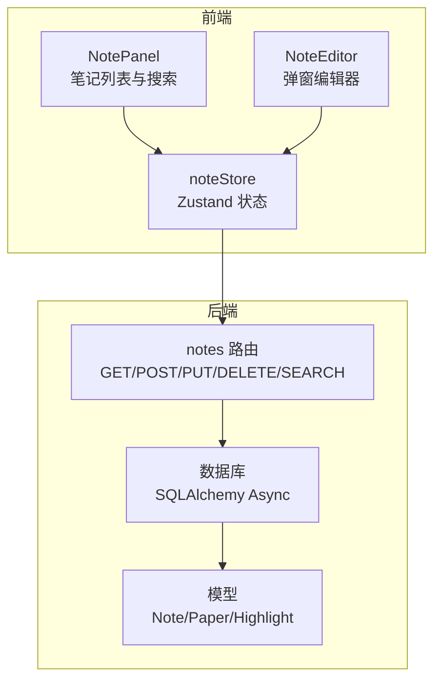
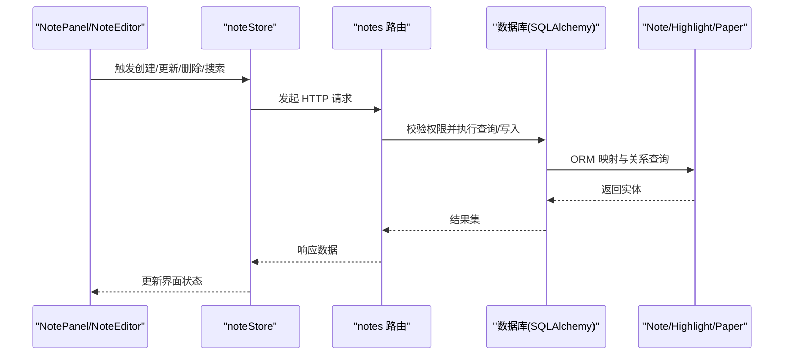
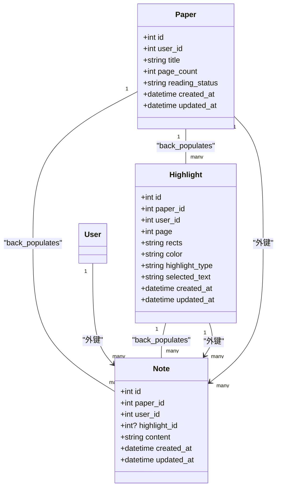
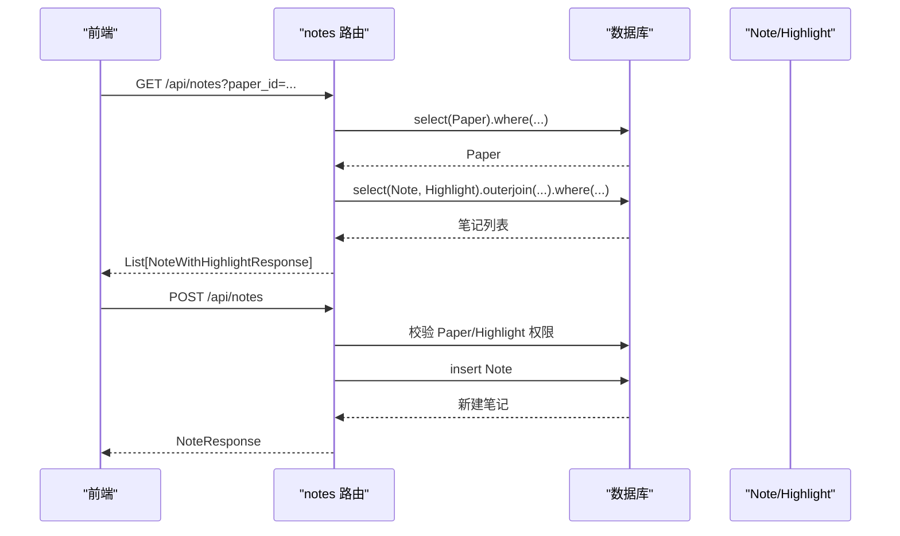
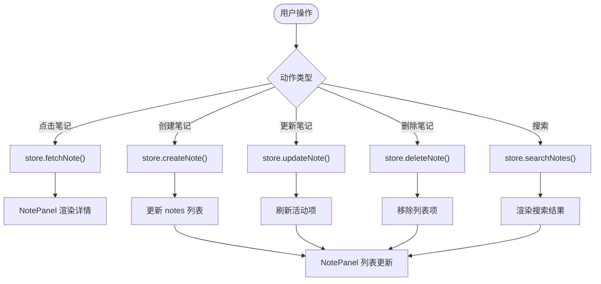
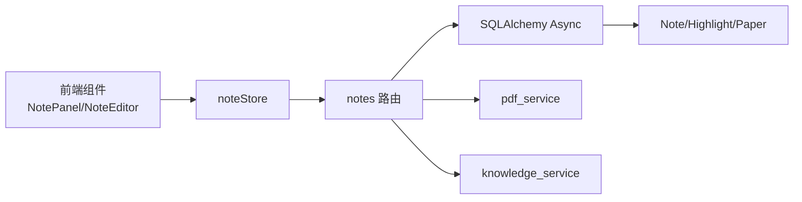

# 笔记状态管理

<cite>
**本文引用的文件**
- [backend/app/models/note.py](file://backend/app/models/note.py)
- [backend/app/schemas/note.py](file://backend/app/schemas/note.py)
- [backend/app/routers/notes.py](file://backend/app/routers/notes.py)
- [backend/app/models/highlight.py](file://backend/app/models/highlight.py)
- [backend/app/models/paper.py](file://backend/app/models/paper.py)
- [backend/app/database.py](file://backend/app/database.py)
- [backend/app/main.py](file://backend/app/main.py)
- [frontend/src/stores/noteStore.js](file://frontend/src/stores/noteStore.js)
- [frontend/src/components/NoteEditor/NoteEditor.jsx](file://frontend/src/components/NoteEditor/NoteEditor.jsx)
- [frontend/src/components/NotePanel/NotePanel.jsx](file://frontend/src/components/NotePanel/NotePanel.jsx)
- [frontend/src/utils/MarkdownRenderer.jsx](file://frontend/src/utils/MarkdownRenderer.jsx)
- [backend/app/services/knowledge_service.py](file://backend/app/services/knowledge_service.py)
- [backend/app/services/pdf_service.py](file://backend/app/services/pdf_service.py)
</cite>

## 目录
1. [简介](#简介)
2. [项目结构](#项目结构)
3. [核心组件](#核心组件)
4. [架构总览](#架构总览)
5. [详细组件分析](#详细组件分析)
6. [依赖分析](#依赖分析)
7. [性能考虑](#性能考虑)
8. [故障排查指南](#故障排查指南)
9. [结论](#结论)
10. [附录](#附录)

## 简介
本文件面向 PaperChat 的“笔记状态管理”子系统，系统性阐述笔记的创建、编辑、删除、分类与关联管理；深入解析笔记数据结构、时间戳管理、与论文及高亮的关联关系；覆盖全文搜索与快速访问能力；并给出导入导出、版本控制与备份恢复的实现建议，以及笔记模板、Markdown 支持与协作状态管理策略。

## 项目结构
- 后端采用 FastAPI + SQLAlchemy Async 架构，笔记相关逻辑集中在路由层、模型层与服务层。
- 前端使用 Zustand 管理笔记状态，NotePanel 与 NoteEditor 提供笔记列表与编辑体验。
- 笔记与论文、高亮形成清晰的外键关联，支持按论文维度隔离与权限校验。

图表来源
- [frontend/src/components/NotePanel/NotePanel.jsx:1-275](file://frontend/src/components/NotePanel/NotePanel.jsx#L1-L275)
- [frontend/src/components/NoteEditor/NoteEditor.jsx:1-204](file://frontend/src/components/NoteEditor/NoteEditor.jsx#L1-L204)
- [frontend/src/stores/noteStore.js:1-145](file://frontend/src/stores/noteStore.js#L1-L145)
- [backend/app/routers/notes.py:1-350](file://backend/app/routers/notes.py#L1-L350)
- [backend/app/database.py:1-81](file://backend/app/database.py#L1-L81)
- [backend/app/models/note.py:1-34](file://backend/app/models/note.py#L1-L34)
- [backend/app/models/paper.py:1-85](file://backend/app/models/paper.py#L1-L85)
- [backend/app/models/highlight.py:1-37](file://backend/app/models/highlight.py#L1-L37)

章节来源
- [backend/app/main.py:1-114](file://backend/app/main.py#L1-L114)
- [backend/app/database.py:1-81](file://backend/app/database.py#L1-L81)

## 核心组件
- 笔记模型与关系
  - Note 表包含内容、时间戳、与 Paper、User、Highlight 的外键关联。
  - Note 与 Highlight 为可选关联，支持“基于高亮创建笔记”的场景。
- 笔记 API
  - 提供按论文获取全部笔记、按 ID 获取详情、创建、更新、删除、全文模糊搜索。
  - 每个操作均进行用户与论文权限校验，确保数据隔离。
- 前端状态与 UI
  - noteStore 统一管理笔记列表、活动笔记、搜索结果与加载/错误状态。
  - NotePanel 提供搜索、展开/折叠、编辑、删除等交互；NoteEditor 提供弹窗编辑与快捷键保存。

章节来源
- [backend/app/models/note.py:11-34](file://backend/app/models/note.py#L11-L34)
- [backend/app/schemas/note.py:7-36](file://backend/app/schemas/note.py#L7-L36)
- [backend/app/routers/notes.py:21-350](file://backend/app/routers/notes.py#L21-L350)
- [frontend/src/stores/noteStore.js:4-145](file://frontend/src/stores/noteStore.js#L4-L145)
- [frontend/src/components/NotePanel/NotePanel.jsx:17-275](file://frontend/src/components/NotePanel/NotePanel.jsx#L17-L275)
- [frontend/src/components/NoteEditor/NoteEditor.jsx:17-204](file://frontend/src/components/NoteEditor/NoteEditor.jsx#L17-L204)

## 架构总览
笔记状态管理贯穿“前端状态 → API 路由 → 数据模型 → 数据库”的链路，同时通过外键关系与权限校验保障数据一致性与安全性。

图表来源
- [frontend/src/stores/noteStore.js:12-123](file://frontend/src/stores/noteStore.js#L12-L123)
- [backend/app/routers/notes.py:21-350](file://backend/app/routers/notes.py#L21-L350)
- [backend/app/models/note.py:11-34](file://backend/app/models/note.py#L11-L34)
- [backend/app/models/highlight.py:10-37](file://backend/app/models/highlight.py#L10-L37)
- [backend/app/models/paper.py:11-85](file://backend/app/models/paper.py#L11-L85)

## 详细组件分析

### 笔记数据模型与关系
- Note
  - 主键、paper_id、user_id、highlight_id、content、created_at、updated_at。
  - 关系：back_populates 到 Paper、User、Highlight。
- Highlight
  - 与 Note 建立一对多关系，支持级联删除孤儿笔记。
- Paper
  - 与 Note 建立一对多关系，支持按论文聚合展示与权限校验。

图表来源
- [backend/app/models/note.py:11-34](file://backend/app/models/note.py#L11-L34)
- [backend/app/models/highlight.py:10-37](file://backend/app/models/highlight.py#L10-L37)
- [backend/app/models/paper.py:11-85](file://backend/app/models/paper.py#L11-L85)

章节来源
- [backend/app/models/note.py:11-34](file://backend/app/models/note.py#L11-L34)
- [backend/app/models/highlight.py:10-37](file://backend/app/models/highlight.py#L10-L37)
- [backend/app/models/paper.py:11-85](file://backend/app/models/paper.py#L11-L85)

### 笔记 API 工作流
- 获取笔记列表
  - 校验论文存在且属于当前用户，按创建时间倒序返回笔记与关联高亮文本。
- 创建笔记
  - 校验论文与可选高亮归属，创建后返回最新记录。
- 获取笔记详情
  - 外连接高亮，返回带高亮文本的响应。
- 更新笔记
  - 若更新高亮 ID，需再次校验高亮归属；内容可选更新。
- 删除笔记
  - 校验权限后删除。
- 搜索笔记
  - 支持按关键词模糊匹配内容，可选限定论文范围，按更新时间倒序。

图表来源
- [backend/app/routers/notes.py:21-137](file://backend/app/routers/notes.py#L21-L137)
- [backend/app/schemas/note.py:20-36](file://backend/app/schemas/note.py#L20-L36)

章节来源
- [backend/app/routers/notes.py:21-350](file://backend/app/routers/notes.py#L21-L350)
- [backend/app/schemas/note.py:7-36](file://backend/app/schemas/note.py#L7-L36)

### 前端状态与 UI 交互
- noteStore
  - 管理 notes、activeNote、searchResults、loading、error。
  - 提供 fetchNotes、createNote、updateNote、deleteNote、searchNotes、fetchNote、setActiveNote、clearSearchResults、clearNotes、clearError。
- NotePanel
  - 支持搜索、展开/折叠、编辑、删除；格式化时间、摘要展示。
- NoteEditor
  - 弹窗编辑、快捷键保存、删除确认、高亮文本预览。

图表来源
- [frontend/src/stores/noteStore.js:12-123](file://frontend/src/stores/noteStore.js#L12-L123)
- [frontend/src/components/NotePanel/NotePanel.jsx:17-275](file://frontend/src/components/NotePanel/NotePanel.jsx#L17-L275)
- [frontend/src/components/NoteEditor/NoteEditor.jsx:17-204](file://frontend/src/components/NoteEditor/NoteEditor.jsx#L17-L204)

章节来源
- [frontend/src/stores/noteStore.js:4-145](file://frontend/src/stores/noteStore.js#L4-L145)
- [frontend/src/components/NotePanel/NotePanel.jsx:17-275](file://frontend/src/components/NotePanel/NotePanel.jsx#L17-L275)
- [frontend/src/components/NoteEditor/NoteEditor.jsx:17-204](file://frontend/src/components/NoteEditor/NoteEditor.jsx#L17-L204)

### 全文搜索与快速访问
- 后端搜索
  - 基于 content 的模糊匹配，可选限定 paper_id，按 updated_at 倒序。
- 前端搜索
  - NotePanel 内置本地过滤，支持按笔记内容与高亮文本匹配。
- 快速访问
  - NotePanel 展示时间戳相对值与摘要，便于快速定位。

章节来源
- [backend/app/routers/notes.py:285-350](file://backend/app/routers/notes.py#L285-L350)
- [frontend/src/components/NotePanel/NotePanel.jsx:26-89](file://frontend/src/components/NotePanel/NotePanel.jsx#L26-L89)

### 笔记与论文、高亮的关联关系
- 关联设计
  - Note.paper_id → Paper.id，Note.user_id → User.id，Note.highlight_id → Highlight.id。
  - Highlight.notes 级联删除孤儿笔记，保证高亮删除后笔记不会悬挂。
- 权限与可见性
  - 所有读写操作均校验 user_id 与 paper_id，防止越权访问。

章节来源
- [backend/app/models/note.py:16-30](file://backend/app/models/note.py#L16-L30)
- [backend/app/models/highlight.py:29-33](file://backend/app/models/highlight.py#L29-L33)
- [backend/app/models/paper.py:50-54](file://backend/app/models/paper.py#L50-L54)
- [backend/app/routers/notes.py:36-46](file://backend/app/routers/notes.py#L36-L46)

### 时间戳管理
- Note.created_at、updated_at 使用数据库默认值与更新触发器，确保每次更新自动刷新 updated_at。
- 前端展示采用相对时间格式，提升可读性。

章节来源
- [backend/app/models/note.py:24-25](file://backend/app/models/note.py#L24-L25)
- [frontend/src/components/NotePanel/NotePanel.jsx:54-83](file://frontend/src/components/NotePanel/NotePanel.jsx#L54-L83)

### 导入导出、版本控制与备份恢复
- 导入导出
  - 建议以 JSON 格式导出笔记列表（含 content、highlight_id、created_at、updated_at），导入时按 paper_id 与 user_id 校验后批量写入。
- 版本控制
  - 可引入 NoteHistory 表记录每次更新的 content 快照与变更人；或在业务层以增量日志形式记录变更。
- 备份恢复
  - 定期导出笔记数据与关联高亮；恢复时先恢复高亮再恢复笔记，避免外键约束失败。

说明：上述为实现建议，当前仓库未提供具体导入导出与版本控制实现。

### 笔记模板系统与 Markdown 支持
- 模板系统
  - 可在后端维护模板集合，前端选择模板后填充默认内容与高亮提示。
- Markdown 支持
  - 前端使用 Markdown 渲染组件，统一标题层级与段落样式，提升阅读体验。

章节来源
- [frontend/src/utils/MarkdownRenderer.jsx:23-30](file://frontend/src/utils/MarkdownRenderer.jsx#L23-L30)

### 协作功能状态管理策略
- 并发写入
  - 建议在 API 层引入乐观锁（如版本号）或悲观锁，避免并发更新冲突。
- 实时同步
  - 可结合 WebSocket 推送其他用户更新，前端 store 同步远端状态并合并本地变更。
- 权限隔离
  - 所有协作操作必须校验用户与论文权限，防止越权。

说明：当前仓库未提供协作与 WebSocket 实现，以上为通用策略建议。

## 依赖分析
- 组件耦合
  - noteStore 仅依赖 API 层，耦合度低；NotePanel/NoteEditor 仅消费 store 状态，职责清晰。
  - 后端 notes 路由依赖数据库与认证中间件，通过 Pydantic Schema 控制请求/响应。
- 外部依赖
  - 前端：Zustand、React、ReactMarkdown。
  - 后端：FastAPI、SQLAlchemy Async、pdfplumber（用于 PDF 元数据与文本块提取）。

图表来源
- [frontend/src/stores/noteStore.js:1-145](file://frontend/src/stores/noteStore.js#L1-L145)
- [backend/app/routers/notes.py:1-350](file://backend/app/routers/notes.py#L1-L350)
- [backend/app/services/pdf_service.py:1-194](file://backend/app/services/pdf_service.py#L1-L194)
- [backend/app/services/knowledge_service.py:1-662](file://backend/app/services/knowledge_service.py#L1-L662)

章节来源
- [backend/app/routers/notes.py:1-350](file://backend/app/routers/notes.py#L1-L350)
- [backend/app/database.py:1-81](file://backend/app/database.py#L1-L81)
- [backend/app/main.py:1-114](file://backend/app/main.py#L1-L114)

## 性能考虑
- 查询优化
  - Notes/Highlights/Papers 均建立索引（如 paper_id、user_id、created_at），减少排序与过滤成本。
- 分页与限制
  - 搜索与列表接口建议增加分页与条数上限，避免一次性返回过多数据。
- 前端渲染
  - NotePanel 对长内容进行摘要与折叠，减少 DOM 渲染压力。
- 数据库事务
  - 使用异步会话与自动提交/回滚，降低连接占用。

## 故障排查指南
- 权限错误
  - 现象：返回“论文不存在或无权限访问/笔记不存在或无权限”。
  - 排查：确认当前用户与 paper_id、note_id 的归属关系；检查路由中的权限校验逻辑。
- 外键约束
  - 现象：删除高亮时报外键约束错误。
  - 排查：确认 Highlight.notes 的级联策略；或先删除相关笔记。
- 前端状态不同步
  - 现象：更新/删除后 UI 未刷新。
  - 排查：确认 noteStore 的更新逻辑是否正确替换/移除对应项；检查错误处理分支是否清除了错误状态。

章节来源
- [backend/app/routers/notes.py:42-46](file://backend/app/routers/notes.py#L42-L46)
- [backend/app/routers/notes.py:100-104](file://backend/app/routers/notes.py#L100-L104)
- [backend/app/routers/notes.py:213-217](file://backend/app/routers/notes.py#L213-L217)
- [frontend/src/stores/noteStore.js:39-42](file://frontend/src/stores/noteStore.js#L39-L42)
- [frontend/src/stores/noteStore.js:61-66](file://frontend/src/stores/noteStore.js#L61-L66)
- [frontend/src/stores/noteStore.js:79-86](file://frontend/src/stores/noteStore.js#L79-L86)

## 结论
PaperChat 的笔记状态管理以“模型-路由-状态-UI”四层协同实现，具备完善的权限校验、高亮关联与全文搜索能力。通过明确的数据结构与清晰的前后端职责划分，系统在易用性与可维护性之间取得平衡。后续可在导入导出、版本控制、协作与备份方面进一步增强，以满足更复杂的使用场景。

## 附录
- 相关服务参考
  - 知识服务：提供从高亮/对话提取知识卡片的能力，可与笔记联动生成结构化知识。
  - PDF 服务：提供元数据与文本块提取，为笔记与高亮的来源提供支撑。

章节来源
- [backend/app/services/knowledge_service.py:82-162](file://backend/app/services/knowledge_service.py#L82-L162)
- [backend/app/services/pdf_service.py:14-194](file://backend/app/services/pdf_service.py#L14-L194)