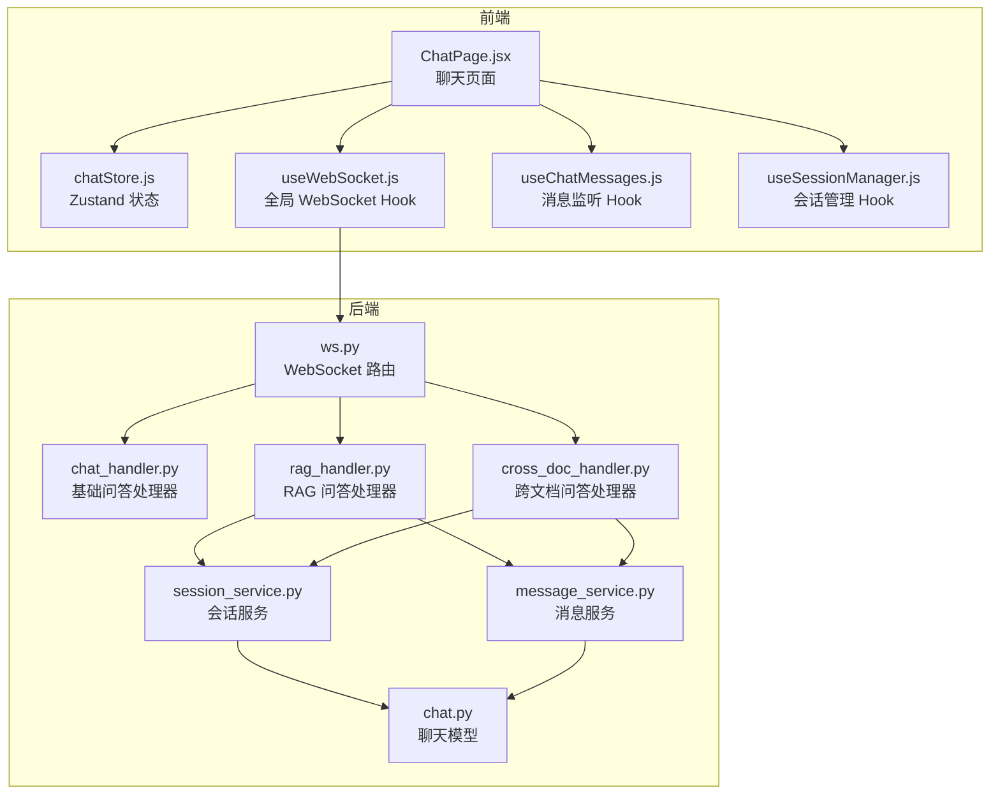
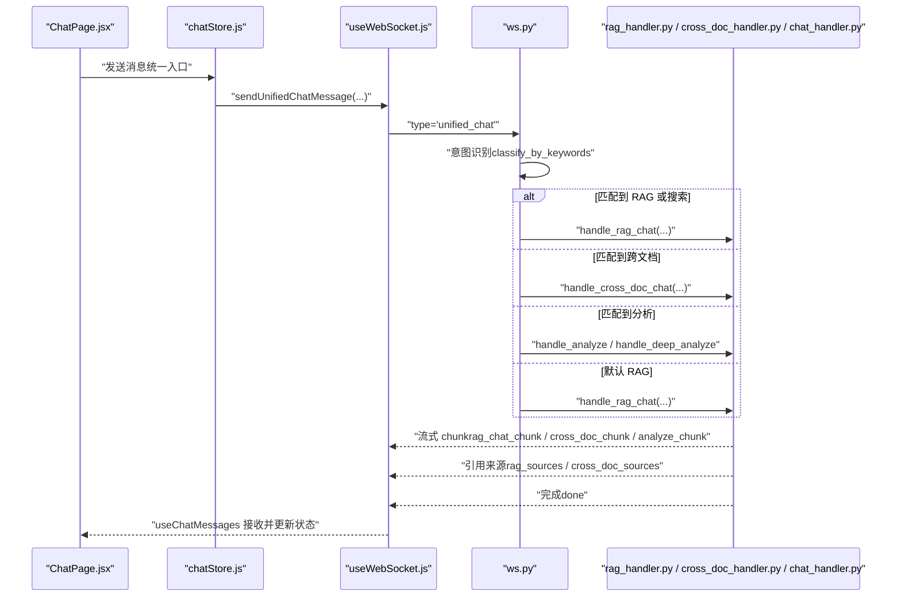
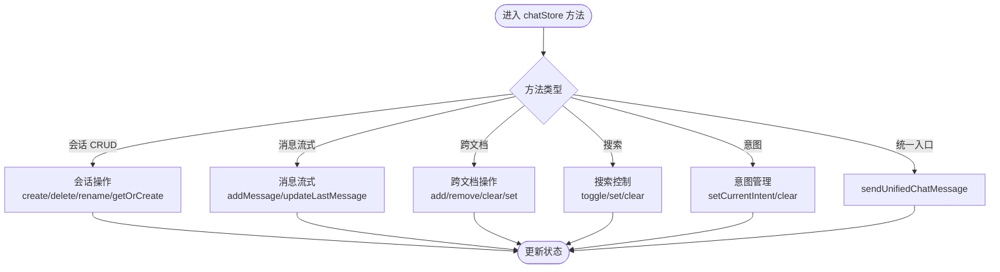
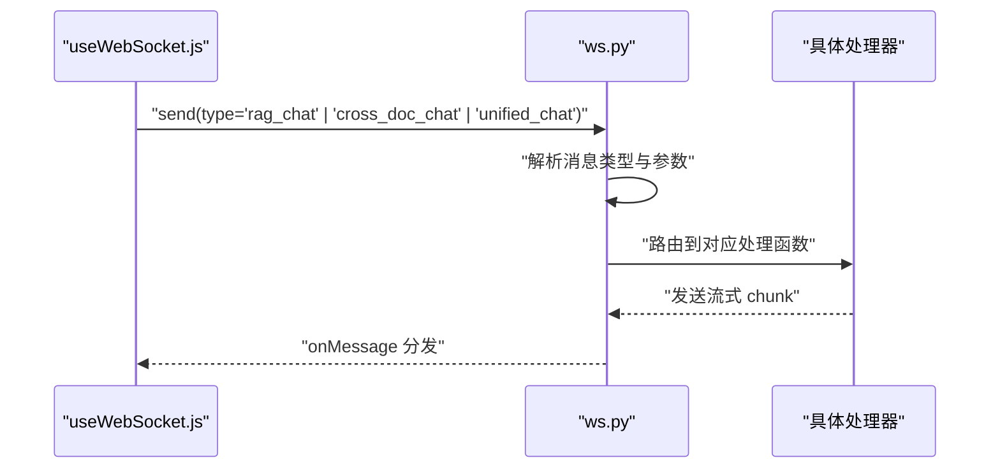
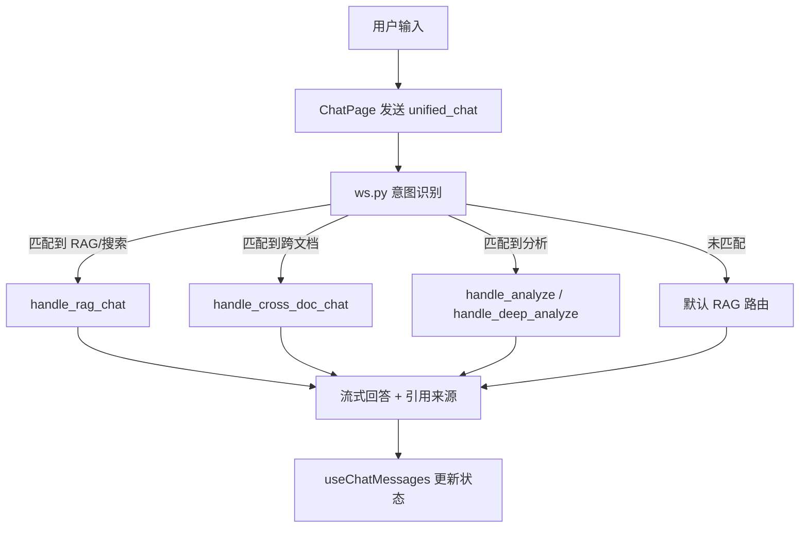
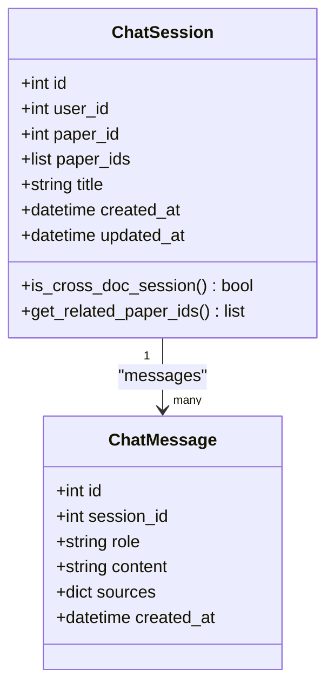
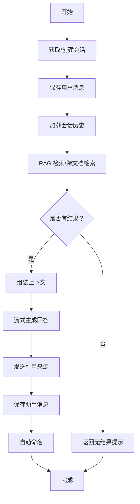
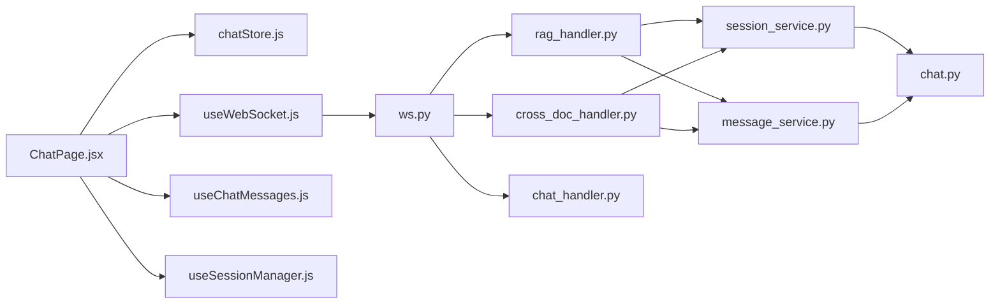

# 聊天状态管理

<cite>
**本文档引用的文件**
- [chatStore.js](file://frontend/src/stores/chatStore.js)
- [useWebSocket.js](file://frontend/src/hooks/useWebSocket.js)
- [ChatPage.jsx](file://frontend/src/pages/ChatPage.jsx)
- [useChatMessages.js](file://frontend/src/hooks/useChatMessages.js)
- [useSessionManager.js](file://frontend/src/hooks/useSessionManager.js)
- [ws.py](file://backend/app/routers/ws.py)
- [chat_handler.py](file://backend/app/handlers/chat_handler.py)
- [rag_handler.py](file://backend/app/handlers/rag_handler.py)
- [cross_doc_handler.py](file://backend/app/handlers/cross_doc_handler.py)
- [session_service.py](file://backend/app/services/session_service.py)
- [message_service.py](file://backend/app/services/message_service.py)
- [chat.py](file://backend/app/models/chat.py)
</cite>

## 目录
1. [简介](#简介)
2. [项目结构](#项目结构)
3. [核心组件](#核心组件)
4. [架构总览](#架构总览)
5. [详细组件分析](#详细组件分析)
6. [依赖分析](#依赖分析)
7. [性能考虑](#性能考虑)
8. [故障排查指南](#故障排查指南)
9. [结论](#结论)
10. [附录](#附录)

## 简介
本文件面向 PaperChat 的聊天状态管理，系统性阐述基于 Zustand 的前端状态管理与后端 WebSocket 路由、处理器之间的协作机制。重点覆盖以下方面：
- 前端 Zustand 状态模型：会话 sessions、消息 messages、引用 sources、跨文档模式与联网搜索状态
- 会话 CRUD 与自动命名机制
- 消息流式处理与打字机渲染
- 统一聊天入口（意图识别与路由）
- WebSocket 集成、错误处理与重连策略
- 性能优化建议与最佳实践

## 项目结构
PaperChat 的聊天状态管理横跨前后端：
- 前端：Zustand 状态仓库、WebSocket Hook、页面组件与消息钩子
- 后端：WebSocket 路由、多类处理器（基础问答、RAG、跨文档）、服务层与模型

图表来源
- [ChatPage.jsx:1-433](file://frontend/src/pages/ChatPage.jsx#L1-L433)
- [chatStore.js:1-417](file://frontend/src/stores/chatStore.js#L1-L417)
- [useWebSocket.js:1-180](file://frontend/src/hooks/useWebSocket.js#L1-L180)
- [useChatMessages.js:1-103](file://frontend/src/hooks/useChatMessages.js#L1-L103)
- [useSessionManager.js:1-111](file://frontend/src/hooks/useSessionManager.js#L1-L111)
- [ws.py:1-436](file://backend/app/routers/ws.py#L1-L436)
- [chat_handler.py:1-32](file://backend/app/handlers/chat_handler.py#L1-L32)
- [rag_handler.py:1-217](file://backend/app/handlers/rag_handler.py#L1-L217)
- [cross_doc_handler.py:1-95](file://backend/app/handlers/cross_doc_handler.py#L1-L95)
- [session_service.py:1-134](file://backend/app/services/session_service.py#L1-L134)
- [message_service.py:1-72](file://backend/app/services/message_service.py#L1-L72)
- [chat.py:1-71](file://backend/app/models/chat.py#L1-L71)

章节来源
- [ChatPage.jsx:1-433](file://frontend/src/pages/ChatPage.jsx#L1-L433)
- [chatStore.js:1-417](file://frontend/src/stores/chatStore.js#L1-L417)
- [useWebSocket.js:1-180](file://frontend/src/hooks/useWebSocket.js#L1-L180)
- [ws.py:1-436](file://backend/app/routers/ws.py#L1-L436)

## 核心组件
- Zustand 聊天状态仓库（chatStore）
  - 状态字段：sessions、currentSessionId、messages、sources、isLoading、error、selectedPaperIds、crossDocSources、isCrossDocMode、enableSearch、searchStatus、currentIntent
  - 会话管理：fetchSessions、createSession、getOrCreateSessionByPaper、deleteSession、renameSession、setCurrentSession、fetchMessages、clearMessages、reset
  - 自动命名：autoNameSession
  - 消息流式处理：addMessage、updateLastMessage、setSources、clearSearchState
  - 跨文档问答：addPaperToCrossDoc、removePaperFromCrossDoc、clearCrossDocPapers、setCrossDocPapers、setCrossDocSources、createCrossDocSession
  - 联网搜索：toggleSearch、setSearchStatus
  - 统一聊天入口：setCurrentIntent、clearCurrentIntent、sendUnifiedChatMessage
- WebSocket Hook（useWebSocket）
  - 全局连接、断线重连、消息分发、发送多种消息类型（rag_chat、cross_doc_chat、unified_chat、cancel）
- 页面与钩子
  - ChatPage：输入、发送、虚拟滚动、意图展示、来源渲染
  - useChatMessages：统一订阅消息类型，驱动打字机、设置来源、意图、完成回调
  - useSessionManager：会话 CRUD、切换、重命名

章节来源
- [chatStore.js:1-417](file://frontend/src/stores/chatStore.js#L1-L417)
- [useWebSocket.js:1-180](file://frontend/src/hooks/useWebSocket.js#L1-L180)
- [ChatPage.jsx:1-433](file://frontend/src/pages/ChatPage.jsx#L1-L433)
- [useChatMessages.js:1-103](file://frontend/src/hooks/useChatMessages.js#L1-L103)
- [useSessionManager.js:1-111](file://frontend/src/hooks/useSessionManager.js#L1-L111)

## 架构总览
统一聊天入口通过 WebSocket 将用户消息路由至不同处理器，后端根据意图识别与参数决定具体执行路径，并通过流式消息将回答与来源回传前端。

图表来源
- [ChatPage.jsx:179-208](file://frontend/src/pages/ChatPage.jsx#L179-L208)
- [chatStore.js:395-413](file://frontend/src/stores/chatStore.js#L395-L413)
- [useWebSocket.js:140-154](file://frontend/src/hooks/useWebSocket.js#L140-L154)
- [ws.py:262-417](file://backend/app/routers/ws.py#L262-L417)
- [rag_handler.py:29-217](file://backend/app/handlers/rag_handler.py#L29-L217)
- [cross_doc_handler.py:14-95](file://backend/app/handlers/cross_doc_handler.py#L14-L95)
- [chat_handler.py:11-32](file://backend/app/handlers/chat_handler.py#L11-L32)
- [useChatMessages.js:39-97](file://frontend/src/hooks/useChatMessages.js#L39-L97)

## 详细组件分析

### Zustand 聊天状态仓库（chatStore）
- 数据结构与职责
  - sessions：会话列表，包含 id、paper_id、paper_ids、title 等
  - messages：当前会话消息数组，每条消息含 id、role、content、sources
  - sources：当前回答的论文引用来源
  - selectedPaperIds / crossDocSources / isCrossDocMode：跨文档问答状态
  - enableSearch / searchStatus：联网搜索开关与状态
  - currentIntent：统一入口的意图识别结果
- 会话 CRUD
  - fetchSessions/fetchMessages：拉取会话与消息
  - createSession/getOrCreateSessionByPaper：创建或获取默认会话
  - deleteSession/renameSession/updateSessionTitle：删除与重命名
  - setCurrentSession：切换当前会话并清空来源
  - clearMessages/reset：清空消息与重置状态
- 自动命名
  - autoNameSession：基于首条消息清理后截断生成标题
- 跨文档问答
  - addPaperToCrossDoc/removePaperFromCrossDoc/setCrossDocPapers/clearCrossDocPapers：维护选中论文集合与模式状态
  - setCrossDocSources/createCrossDocSession：设置跨文档来源与创建跨文档会话
- 联网搜索
  - toggleSearch/setSearchStatus/clearSearchState：控制与清理搜索状态
- 统一聊天入口
  - setCurrentIntent/clearCurrentIntent：意图状态管理
  - sendUnifiedChatMessage：向后端发送统一聊天消息（携带 paper_id/paper_ids/session_id/enable_search）

图表来源
- [chatStore.js:22-413](file://frontend/src/stores/chatStore.js#L22-L413)

章节来源
- [chatStore.js:1-417](file://frontend/src/stores/chatStore.js#L1-L417)

### WebSocket 集成与消息分发（useWebSocket + ws.py）
- useWebSocket
  - 全局单例连接、自动重连、订阅消息类型、发送多种消息类型
  - 提供 sendRagMessage/sendCrossDocMessage/sendUnifiedChatMessage/sendCancel/onMessage
- ws.py
  - 验证 JWT Token，建立连接后循环接收消息
  - 消息类型路由：analyze、chat、rag_chat、deep_analyze、agent_chat、cross_doc_chat、cancel、unified_chat
  - unified_chat：意图识别后路由到对应处理器；支持取消任务
  - 统一错误处理与任务清理

图表来源
- [useWebSocket.js:100-178](file://frontend/src/hooks/useWebSocket.js#L100-L178)
- [ws.py:114-436](file://backend/app/routers/ws.py#L114-L436)

章节来源
- [useWebSocket.js:1-180](file://frontend/src/hooks/useWebSocket.js#L1-L180)
- [ws.py:1-436](file://backend/app/routers/ws.py#L1-L436)

### 统一聊天入口与意图识别
- ChatPage
  - 发送消息前进行自动命名、添加本地占位消息、启动打字机、清空来源与搜索状态
  - 通过 sendUnifiedChatMessage 发送统一聊天消息
- useChatMessages
  - 订阅 rag_chat_chunk/cross_doc_chunk/analyze_chunk/deep_analyze_chunk、rag_sources/cross_doc_sources、search_status、done、intent_detected、cancelled、error
  - 根据 channel 更新会话 ID 并触发会话列表刷新
- ws.py unified_chat
  - 使用关键词分类器进行意图识别，返回 intent/tool/confidence/matched
  - 根据匹配结果路由到 analyze_paper、deep_analyze_paper、cross_doc_chat、rag_chat 或 fallback

图表来源
- [ChatPage.jsx:179-208](file://frontend/src/pages/ChatPage.jsx#L179-L208)
- [useChatMessages.js:39-97](file://frontend/src/hooks/useChatMessages.js#L39-L97)
- [ws.py:262-417](file://backend/app/routers/ws.py#L262-L417)

章节来源
- [ChatPage.jsx:1-433](file://frontend/src/pages/ChatPage.jsx#L1-L433)
- [useChatMessages.js:1-103](file://frontend/src/hooks/useChatMessages.js#L1-L103)
- [ws.py:262-417](file://backend/app/routers/ws.py#L262-L417)

### 会话与消息持久化（后端）
- 会话服务
  - get_or_create_session：按 session_id/user_id/paper_id 获取或创建会话
  - auto_title：前若干条消息自动更新标题
- 消息服务
  - load_chat_history：按会话加载最近 N 条消息，构建 LangChain 历史
  - save_message：保存用户/助手消息及来源
  - get_paper_full_text/get_paper_text_blocks：论文文本与文本块查询
- 模型
  - ChatSession：会话表，支持单论文与多论文（paper_ids）
  - ChatMessage：消息表，包含 JSON 字段 sources 存放引用来源

图表来源
- [chat.py:14-71](file://backend/app/models/chat.py#L14-L71)

章节来源
- [session_service.py:17-54](file://backend/app/services/session_service.py#L17-L54)
- [message_service.py:24-54](file://backend/app/services/message_service.py#L24-L54)
- [chat.py:14-71](file://backend/app/models/chat.py#L14-L71)

### RAG 问答与跨文档问答处理流程
- RAG 流程
  - 获取/创建会话 → 保存用户消息 → 加载历史 → 检索相关片段
  - 若无片段且存在文本块 → 重建索引后重检
  - 可选联网搜索 → 组装上下文 → 流式生成回答 → 发送来源 → 保存助手消息 → 自动命名 → 完成
- 跨文档问答流程
  - 获取/创建会话 → 保存用户消息（含 paper_ids）→ 加载历史 → 检索多篇论文 → 发送来源 → 流式生成回答 → 保存助手消息 → 自动命名 → 完成

图表来源
- [rag_handler.py:29-217](file://backend/app/handlers/rag_handler.py#L29-L217)
- [cross_doc_handler.py:14-95](file://backend/app/handlers/cross_doc_handler.py#L14-L95)

章节来源
- [rag_handler.py:1-217](file://backend/app/handlers/rag_handler.py#L1-L217)
- [cross_doc_handler.py:1-95](file://backend/app/handlers/cross_doc_handler.py#L1-L95)

## 依赖分析
- 前端依赖
  - ChatPage 依赖 chatStore、useWebSocket、useChatMessages、useSessionManager
  - chatStore 依赖 API（通过 api/index.js，未在本文档展开）
  - useWebSocket 依赖浏览器原生 WebSocket，内置重连与消息分发
- 后端依赖
  - ws.py 依赖各处理器与服务层（llm_service、rag_service、search_service 等）
  - 处理器依赖服务层与模型层，完成会话、消息、检索与搜索的组合

图表来源
- [ChatPage.jsx:1-433](file://frontend/src/pages/ChatPage.jsx#L1-L433)
- [chatStore.js:1-417](file://frontend/src/stores/chatStore.js#L1-L417)
- [useWebSocket.js:1-180](file://frontend/src/hooks/useWebSocket.js#L1-L180)
- [useChatMessages.js:1-103](file://frontend/src/hooks/useChatMessages.js#L1-L103)
- [useSessionManager.js:1-111](file://frontend/src/hooks/useSessionManager.js#L1-L111)
- [ws.py:1-436](file://backend/app/routers/ws.py#L1-L436)
- [rag_handler.py:1-217](file://backend/app/handlers/rag_handler.py#L1-L217)
- [cross_doc_handler.py:1-95](file://backend/app/handlers/cross_doc_handler.py#L1-L95)
- [chat_handler.py:1-32](file://backend/app/handlers/chat_handler.py#L1-L32)
- [session_service.py:1-134](file://backend/app/services/session_service.py#L1-L134)
- [message_service.py:1-72](file://backend/app/services/message_service.py#L1-L72)
- [chat.py:1-71](file://backend/app/models/chat.py#L1-L71)

章节来源
- [ChatPage.jsx:1-433](file://frontend/src/pages/ChatPage.jsx#L1-L433)
- [ws.py:1-436](file://backend/app/routers/ws.py#L1-L436)

## 性能考虑
- 前端
  - 虚拟滚动：使用 @tanstack/react-virtual 对长消息列表进行虚拟化，减少 DOM 节点数量
  - 打字机渲染：增量更新最后一条消息，避免全量重渲染
  - 本地占位消息：发送前插入 user/assistant 占位消息，提升交互即时性
  - 状态最小化：仅在必要时更新 sources、searchStatus、currentIntent 等
- 后端
  - 流式响应：处理器以异步迭代方式发送 chunk，降低首字延迟
  - 任务取消：统一的 cancel 消息与 running_tasks 管理，避免僵尸任务
  - 检索与索引：若无索引则重建索引，确保检索效率
  - 会话历史：限制加载最近 N 条消息，控制上下文长度

[本节为通用性能讨论，无需列出章节来源]

## 故障排查指南
- WebSocket 未连接
  - 现象：发送消息返回“未连接”
  - 排查：确认 useWebSocket 的连接状态，检查 token 与路由
  - 参考
    - [useWebSocket.js:100-107](file://frontend/src/hooks/useWebSocket.js#L100-L107)
- 会话获取/创建失败
  - 现象：fetchSessions/createSession 报错
  - 排查：查看 chatStore 中 error 字段，确认后端接口与鉴权
  - 参考
    - [chatStore.js:23-71](file://frontend/src/stores/chatStore.js#L23-L71)
- 无检索结果
  - 现象：RAG 回答提示“未能检索到相关内容”
  - 排查：确认论文是否解析完成、是否存在文本块、是否重建索引
  - 参考
    - [rag_handler.py:48-89](file://backend/app/handlers/rag_handler.py#L48-L89)
- 跨文档来源为空
  - 现象：cross_doc_sources 为空
  - 排查：确认 paper_ids 是否正确传递、检索是否命中
  - 参考
    - [cross_doc_handler.py:29-56](file://backend/app/handlers/cross_doc_handler.py#L29-L56)
- 意图识别未匹配
  - 现象：统一入口走默认 RAG
  - 排查：检查关键词分类器配置与消息内容
  - 参考
    - [ws.py:282-416](file://backend/app/routers/ws.py#L282-L416)

章节来源
- [useWebSocket.js:100-107](file://frontend/src/hooks/useWebSocket.js#L100-L107)
- [chatStore.js:23-71](file://frontend/src/stores/chatStore.js#L23-L71)
- [rag_handler.py:48-89](file://backend/app/handlers/rag_handler.py#L48-L89)
- [cross_doc_handler.py:29-56](file://backend/app/handlers/cross_doc_handler.py#L29-L56)
- [ws.py:282-416](file://backend/app/routers/ws.py#L282-L416)

## 结论
PaperChat 的聊天状态管理以 Zustand 为核心，结合统一 WebSocket 入口与多处理器路由，实现了从会话管理、消息流式渲染到跨文档与联网搜索的完整链路。通过意图识别与任务管理，系统在易用性与扩展性之间取得平衡。建议在生产环境中进一步完善错误边界、监控与日志，以及针对大消息与高并发场景的性能优化。

[本节为总结性内容，无需列出章节来源]

## 附录
- 使用场景示例（路径指引）
  - 新建会话并发送消息：[ChatPage.jsx:180-208](file://frontend/src/pages/ChatPage.jsx#L180-L208)
  - 跨文档问答：[chatStore.js:303-378](file://frontend/src/stores/chatStore.js#L303-L378)、[cross_doc_handler.py:14-95](file://backend/app/handlers/cross_doc_handler.py#L14-L95)
  - 联网搜索：[rag_handler.py:91-121](file://backend/app/handlers/rag_handler.py#L91-L121)
  - 自动命名：[chatStore.js:174-187](file://frontend/src/stores/chatStore.js#L174-L187)、[session_service.py:45-54](file://backend/app/services/session_service.py#L45-L54)
  - 统一聊天入口：[ws.py:262-417](file://backend/app/routers/ws.py#L262-L417)、[chatStore.js:395-413](file://frontend/src/stores/chatStore.js#L395-L413)

[本节为补充说明，无需列出章节来源]