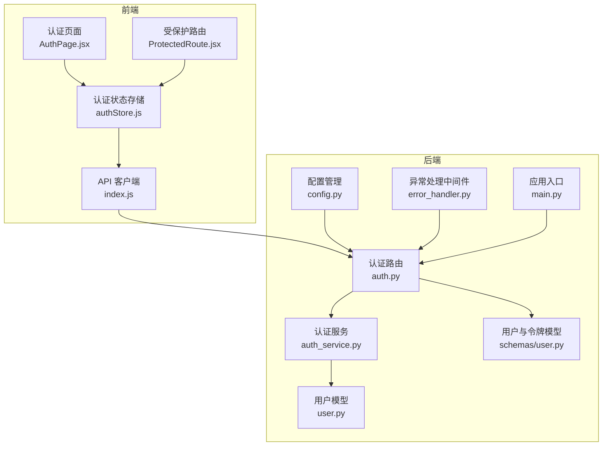
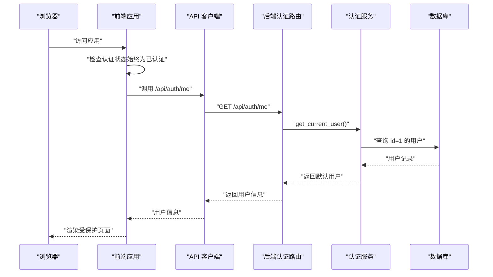
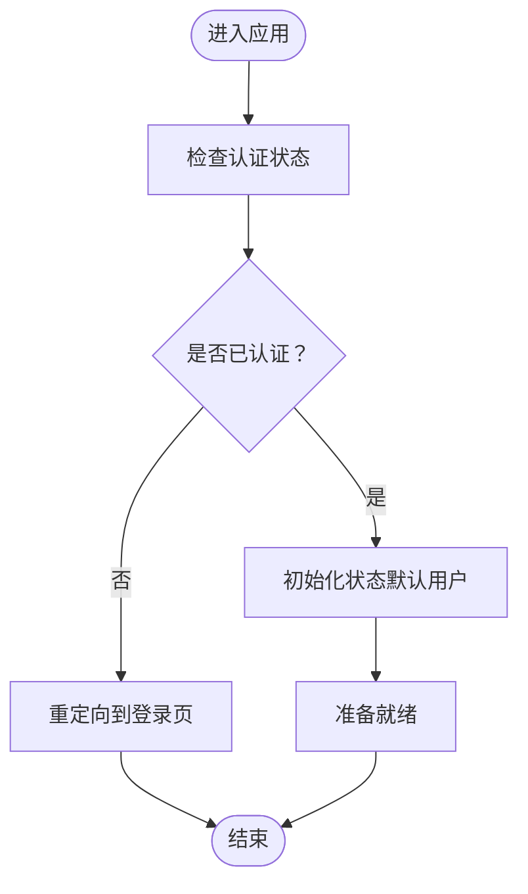
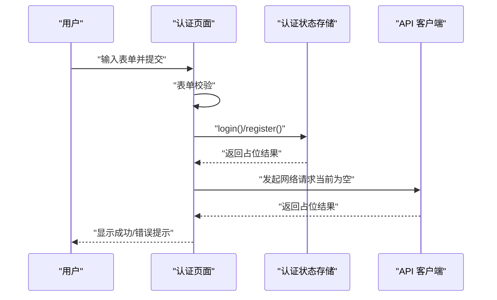
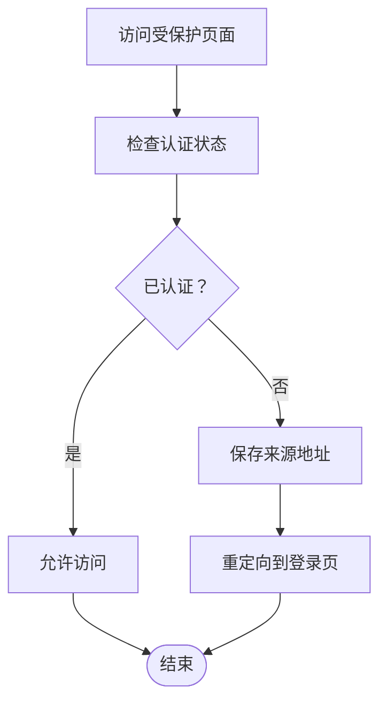
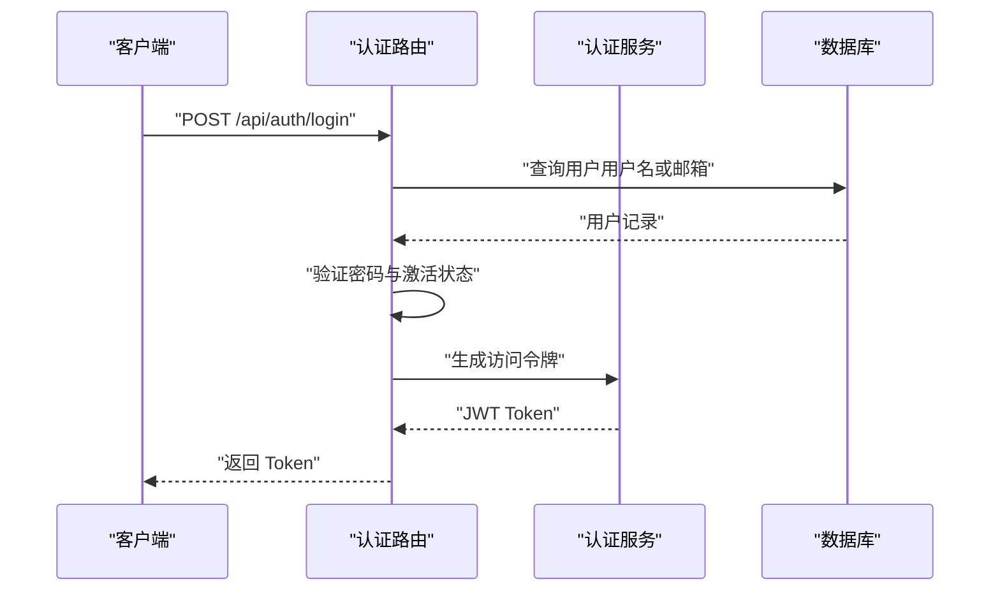
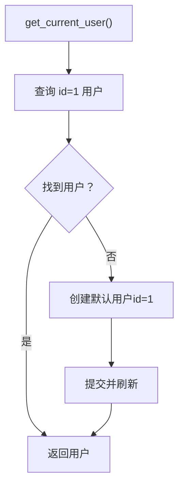
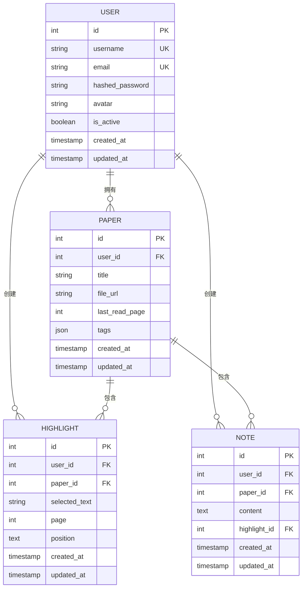
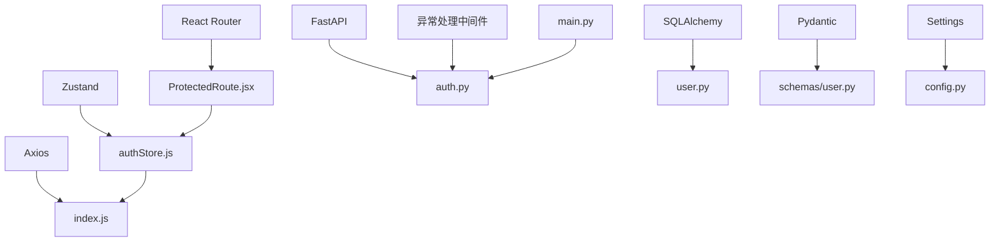

# 认证状态管理

<cite>
**本文档引用的文件**
- [authStore.js](file://frontend/src/stores/authStore.js)
- [AuthPage.jsx](file://frontend/src/pages/AuthPage.jsx)
- [ProtectedRoute.jsx](file://frontend/src/components/ProtectedRoute.jsx)
- [index.js](file://frontend/src/api/index.js)
- [auth.py](file://backend/app/routers/auth.py)
- [auth_service.py](file://backend/app/services/auth_service.py)
- [user.py](file://backend/app/models/user.py)
- [user.py](file://backend/app/schemas/user.py)
- [config.py](file://backend/app/config.py)
- [error_handler.py](file://backend/app/middleware/error_handler.py)
- [main.py](file://backend/app/main.py)
</cite>

## 目录
1. [简介](#简介)
2. [项目结构](#项目结构)
3. [核心组件](#核心组件)
4. [架构总览](#架构总览)
5. [详细组件分析](#详细组件分析)
6. [依赖关系分析](#依赖关系分析)
7. [性能考虑](#性能考虑)
8. [故障排除指南](#故障排除指南)
9. [结论](#结论)

## 简介
本文件针对 PaperChat 的认证状态管理进行全面技术说明，涵盖前端状态管理、后端认证流程、数据模型与安全策略。当前项目采用“个人使用模式”，即无需登录即可使用系统，系统会自动为首个访问用户提供默认账户。本文档将详细解释：
- 用户认证与授权的状态管理实现
- 登录状态、令牌管理与权限控制
- 认证数据结构设计（用户信息、会话状态、安全令牌）
- 与后端 API 的集成方式、错误处理机制
- 多用户支持、第三方登录与安全策略的扩展建议
- 认证流程的状态管理、会话持久化与安全防护

## 项目结构
PaperChat 的认证状态管理由前后端协同实现：
- 前端使用 Zustand 管理认证状态，并通过受保护路由控制访问
- 后端提供认证路由与服务，当前版本采用“默认用户”模式，无需真实登录
- API 层通过 Axios 进行统一请求封装

**图表来源**
- [authStore.js:1-23](file://frontend/src/stores/authStore.js#L1-L23)
- [AuthPage.jsx:1-245](file://frontend/src/pages/AuthPage.jsx#L1-L245)
- [ProtectedRoute.jsx:1-21](file://frontend/src/components/ProtectedRoute.jsx#L1-L21)
- [index.js:1-12](file://frontend/src/api/index.js#L1-L12)
- [auth.py:1-186](file://backend/app/routers/auth.py#L1-L186)
- [auth_service.py:1-40](file://backend/app/services/auth_service.py#L1-L40)
- [user.py:1-36](file://backend/app/models/user.py#L1-L36)
- [user.py:1-42](file://backend/app/schemas/user.py#L1-L42)
- [config.py:1-44](file://backend/app/config.py#L1-L44)
- [error_handler.py:1-92](file://backend/app/middleware/error_handler.py#L1-L92)
- [main.py:1-114](file://backend/app/main.py#L1-L114)

**章节来源**
- [authStore.js:1-23](file://frontend/src/stores/authStore.js#L1-L23)
- [AuthPage.jsx:1-245](file://frontend/src/pages/AuthPage.jsx#L1-L245)
- [ProtectedRoute.jsx:1-21](file://frontend/src/components/ProtectedRoute.jsx#L1-L21)
- [index.js:1-12](file://frontend/src/api/index.js#L1-L12)
- [auth.py:1-186](file://backend/app/routers/auth.py#L1-L186)
- [auth_service.py:1-40](file://backend/app/services/auth_service.py#L1-L40)
- [user.py:1-36](file://backend/app/models/user.py#L1-L36)
- [user.py:1-42](file://backend/app/schemas/user.py#L1-L42)
- [config.py:1-44](file://backend/app/config.py#L1-L44)
- [error_handler.py:1-92](file://backend/app/middleware/error_handler.py#L1-L92)
- [main.py:1-114](file://backend/app/main.py#L1-L114)

## 核心组件
- 前端认证状态存储（Zustand）
  - 管理用户信息、认证状态、加载状态与错误信息
  - 提供初始化、登录、注册、登出、获取用户信息、更新用户等方法（当前为空操作以兼容）
- 认证页面（React）
  - 负责表单校验、登录/注册提交、错误展示与路由跳转
- 受保护路由（React Router）
  - 未登录用户重定向至登录页
- API 客户端（Axios）
  - 统一的请求封装，baseURL 指向 /api
- 后端认证路由（FastAPI）
  - 提供注册、登录、登出、获取当前用户、更新用户信息等接口
- 认证服务（FastAPI）
  - 当前版本实现“默认用户”模式，自动创建并返回 id=1 的用户
- 数据模型与序列化（SQLAlchemy + Pydantic）
  - 用户模型、用户创建/登录/响应模型、JWT Token 模型
- 配置管理（Pydantic Settings）
  - 包含 JWT 秘钥、算法、过期时间、CORS 等配置
- 异常处理中间件（FastAPI）
  - 统一处理验证错误、HTTP 异常、数据库异常与通用异常

**章节来源**
- [authStore.js:1-23](file://frontend/src/stores/authStore.js#L1-L23)
- [AuthPage.jsx:1-245](file://frontend/src/pages/AuthPage.jsx#L1-L245)
- [ProtectedRoute.jsx:1-21](file://frontend/src/components/ProtectedRoute.jsx#L1-L21)
- [index.js:1-12](file://frontend/src/api/index.js#L1-L12)
- [auth.py:1-186](file://backend/app/routers/auth.py#L1-L186)
- [auth_service.py:1-40](file://backend/app/services/auth_service.py#L1-L40)
- [user.py:1-36](file://backend/app/models/user.py#L1-L36)
- [user.py:1-42](file://backend/app/schemas/user.py#L1-L42)
- [config.py:1-44](file://backend/app/config.py#L1-L44)
- [error_handler.py:1-92](file://backend/app/middleware/error_handler.py#L1-L92)

## 架构总览
PaperChat 的认证状态管理采用“前端轻量状态 + 后端默认用户”的混合模式：
- 前端：始终认为用户已认证，提供空操作的登录/注册方法以保持接口一致性
- 后端：提供标准认证接口，但通过服务层返回默认用户（id=1），实现“无需登录”的个人使用场景
- 安全：JWT 配置项存在但当前未启用实际令牌；如需启用，应结合后端路由与前端存储策略

**图表来源**
- [AuthPage.jsx:1-245](file://frontend/src/pages/AuthPage.jsx#L1-L245)
- [auth.py:134-144](file://backend/app/routers/auth.py#L134-L144)
- [auth_service.py:13-39](file://backend/app/services/auth_service.py#L13-L39)
- [user.py:1-36](file://backend/app/models/user.py#L1-L36)

**章节来源**
- [auth.py:134-144](file://backend/app/routers/auth.py#L134-L144)
- [auth_service.py:13-39](file://backend/app/services/auth_service.py#L13-L39)
- [user.py:1-36](file://backend/app/models/user.py#L1-L36)

## 详细组件分析

### 前端认证状态存储（Zustand）
- 状态字段
  - user：默认用户对象（id=1）
  - isAuthenticated：始终为真
  - isLoading：加载状态
  - error：错误信息
- 方法
  - initialize：初始化（当前为空）
  - login/register/logout/fetchUser/updateUser/clearError：当前为空操作，仅返回占位结果
- 设计意图
  - 保持与标准认证接口的兼容性，便于未来接入真实登录流程

**图表来源**
- [authStore.js:1-23](file://frontend/src/stores/authStore.js#L1-L23)
- [ProtectedRoute.jsx:1-21](file://frontend/src/components/ProtectedRoute.jsx#L1-L21)

**章节来源**
- [authStore.js:1-23](file://frontend/src/stores/authStore.js#L1-L23)
- [ProtectedRoute.jsx:1-21](file://frontend/src/components/ProtectedRoute.jsx#L1-L21)

### 认证页面（React）
- 功能
  - 切换登录/注册模式
  - 表单校验（用户名、邮箱、密码、确认密码）
  - 提交登录/注册，处理错误与成功提示
  - 已登录用户自动跳转首页
- 交互
  - 使用前端认证状态进行条件渲染与跳转
  - 调用认证状态存储的方法（当前为空操作）

**图表来源**
- [AuthPage.jsx:1-245](file://frontend/src/pages/AuthPage.jsx#L1-L245)
- [authStore.js:1-23](file://frontend/src/stores/authStore.js#L1-L23)
- [index.js:1-12](file://frontend/src/api/index.js#L1-L12)

**章节来源**
- [AuthPage.jsx:1-245](file://frontend/src/pages/AuthPage.jsx#L1-L245)
- [authStore.js:1-23](file://frontend/src/stores/authStore.js#L1-L23)
- [index.js:1-12](file://frontend/src/api/index.js#L1-L12)

### 受保护路由（React Router）
- 逻辑
  - 未登录用户重定向至登录页，并携带来源地址
  - 已登录用户放行
- 作用
  - 控制页面访问权限，确保受保护资源仅对已认证用户开放

**图表来源**
- [ProtectedRoute.jsx:1-21](file://frontend/src/components/ProtectedRoute.jsx#L1-L21)

**章节来源**
- [ProtectedRoute.jsx:1-21](file://frontend/src/components/ProtectedRoute.jsx#L1-L21)

### 后端认证路由（FastAPI）
- 路由
  - POST /api/auth/register：注册用户（用户名、邮箱、密码）
  - POST /api/auth/login：登录（用户名或邮箱 + 密码），返回 JWT Token
  - POST /api/auth/logout：登出（当前为无状态说明）
  - GET /api/auth/me：获取当前用户信息
  - PUT /api/auth/me：更新当前用户信息（邮箱、头像）
- 安全
  - 登录时验证用户存在与密码正确性
  - 检查用户是否激活
  - 生成 JWT Token 并返回过期时间

**图表来源**
- [auth.py:71-118](file://backend/app/routers/auth.py#L71-L118)
- [auth_service.py:13-39](file://backend/app/services/auth_service.py#L13-L39)

**章节来源**
- [auth.py:71-118](file://backend/app/routers/auth.py#L71-L118)
- [auth.py:134-144](file://backend/app/routers/auth.py#L134-L144)
- [auth.py:147-185](file://backend/app/routers/auth.py#L147-L185)

### 认证服务（FastAPI）
- 默认用户模式
  - 查询 id=1 的用户，不存在则自动创建
  - 返回默认用户对象，实现“无需登录”的个人使用场景
- 用途
  - 为前端提供稳定的用户上下文，便于后续扩展真实认证

**图表来源**
- [auth_service.py:13-39](file://backend/app/services/auth_service.py#L13-L39)

**章节来源**
- [auth_service.py:13-39](file://backend/app/services/auth_service.py#L13-L39)

### 数据模型与序列化
- 用户模型（SQLAlchemy）
  - 字段：id、username、email、hashed_password、avatar、is_active、created_at、updated_at
  - 关系：与论文、高亮、笔记、聊天会话、记忆、反馈、知识卡片的关联
- 用户相关 Pydantic 模型
  - UserBase、UserCreate、UserLogin、UserResponse、Token
- 用途
  - 后端数据持久化与 API 输入输出的结构化约束

**图表来源**
- [user.py:1-36](file://backend/app/models/user.py#L1-L36)

**章节来源**
- [user.py:1-36](file://backend/app/models/user.py#L1-L36)
- [user.py:1-42](file://backend/app/schemas/user.py#L1-L42)

### 配置管理（JWT 与 CORS）
- JWT 配置
  - secret_key、algorithm、access_token_expires_in
- CORS 配置
  - 允许的源、凭证、方法与头部
- 用途
  - 控制认证令牌的安全策略与跨域行为

**章节来源**
- [config.py:1-44](file://backend/app/config.py#L1-L44)

### 异常处理中间件（FastAPI）
- 统一处理
  - Pydantic 验证错误、HTTP 异常、SQLAlchemy 错误、通用异常
- 返回格式
  - 标准化的错误响应结构（code、message、data）

**章节来源**
- [error_handler.py:1-92](file://backend/app/middleware/error_handler.py#L1-L92)

## 依赖关系分析
- 前端依赖
  - Zustand：状态管理
  - React Router：路由与受保护路由
  - Axios：HTTP 客户端
- 后端依赖
  - FastAPI：Web 框架
  - SQLAlchemy：ORM 与数据库
  - Pydantic：数据验证与序列化
  - Settings：配置管理
- 耦合与内聚
  - 前端认证状态与路由耦合度低，便于扩展
  - 后端认证路由与服务解耦，便于替换实现

**图表来源**
- [authStore.js:1-23](file://frontend/src/stores/authStore.js#L1-L23)
- [ProtectedRoute.jsx:1-21](file://frontend/src/components/ProtectedRoute.jsx#L1-L21)
- [index.js:1-12](file://frontend/src/api/index.js#L1-L12)
- [auth.py:1-186](file://backend/app/routers/auth.py#L1-L186)
- [user.py:1-36](file://backend/app/models/user.py#L1-L36)
- [user.py:1-42](file://backend/app/schemas/user.py#L1-L42)
- [config.py:1-44](file://backend/app/config.py#L1-L44)
- [error_handler.py:1-92](file://backend/app/middleware/error_handler.py#L1-L92)
- [main.py:1-114](file://backend/app/main.py#L1-L114)

**章节来源**
- [authStore.js:1-23](file://frontend/src/stores/authStore.js#L1-L23)
- [ProtectedRoute.jsx:1-21](file://frontend/src/components/ProtectedRoute.jsx#L1-L21)
- [index.js:1-12](file://frontend/src/api/index.js#L1-L12)
- [auth.py:1-186](file://backend/app/routers/auth.py#L1-L186)
- [user.py:1-36](file://backend/app/models/user.py#L1-L36)
- [user.py:1-42](file://backend/app/schemas/user.py#L1-L42)
- [config.py:1-44](file://backend/app/config.py#L1-L44)
- [error_handler.py:1-92](file://backend/app/middleware/error_handler.py#L1-L92)
- [main.py:1-114](file://backend/app/main.py#L1-L114)

## 性能考虑
- 前端
  - Zustand 状态粒度适中，避免过度拆分导致的重复渲染
  - 受保护路由仅做轻量判断，减少计算开销
- 后端
  - 默认用户模式减少数据库查询与令牌生成开销
  - 路由层尽量保持无状态，降低中间件复杂度
- 安全
  - 如启用真实认证，建议使用短有效期令牌与刷新策略，结合黑名单或撤销列表

## 故障排除指南
- 前端
  - 认证状态异常：检查状态存储初始化与受保护路由逻辑
  - 表单校验失败：查看认证页面的表单校验规则与错误提示
- 后端
  - 登录失败：检查用户名/邮箱与密码验证、用户激活状态
  - 数据库异常：查看异常处理中间件返回的标准化错误
  - 配置问题：核对 JWT 配置与 CORS 设置

**章节来源**
- [AuthPage.jsx:1-245](file://frontend/src/pages/AuthPage.jsx#L1-L245)
- [error_handler.py:1-92](file://backend/app/middleware/error_handler.py#L1-L92)
- [config.py:1-44](file://backend/app/config.py#L1-L44)

## 结论
PaperChat 当前采用“默认用户 + 前端轻量状态”的认证策略，满足个人使用场景下的零登录体验。该设计通过最小化后端复杂度与前端状态管理，实现了快速可用性。若未来需要扩展为真实多用户体系，可在现有接口基础上：
- 后端启用 JWT 令牌与权限中间件
- 前端引入令牌存储与自动刷新机制
- 增加第三方登录与会话持久化策略
- 强化安全配置与异常处理