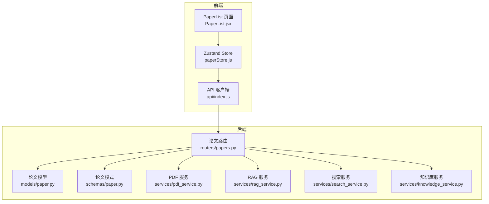
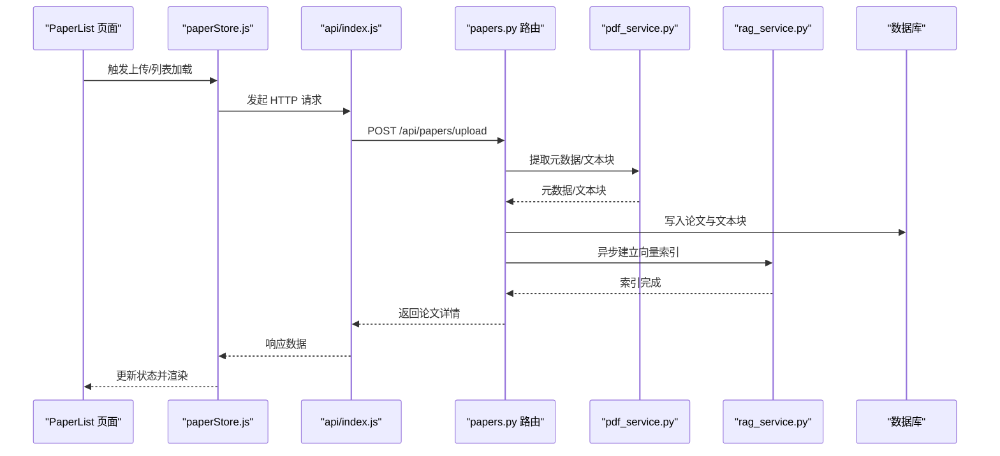
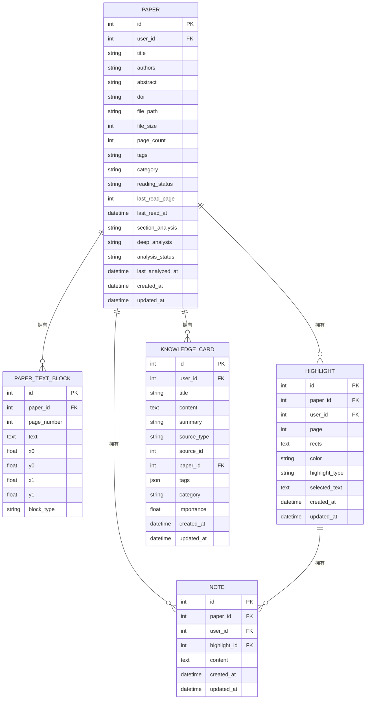
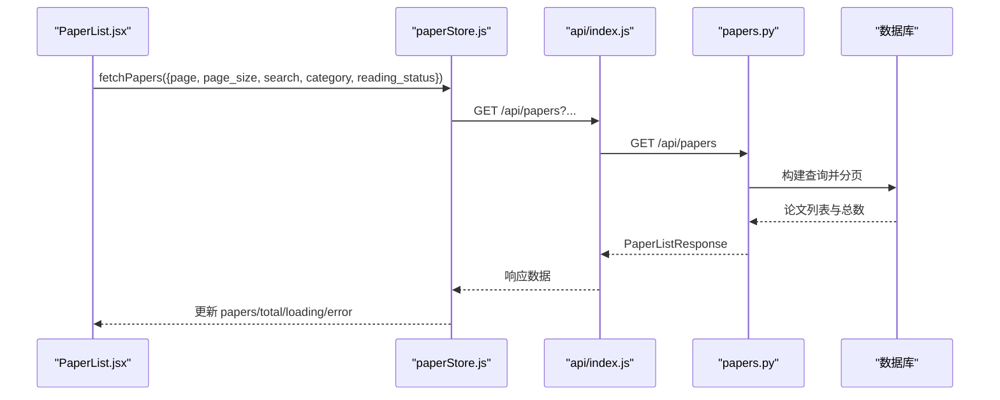
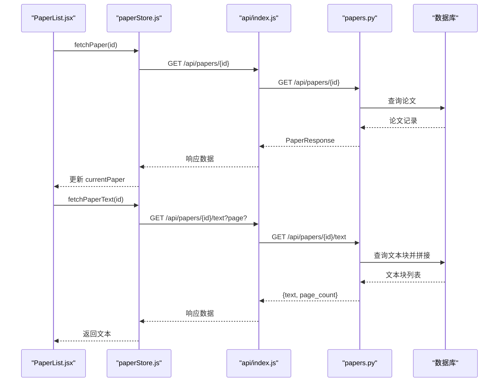
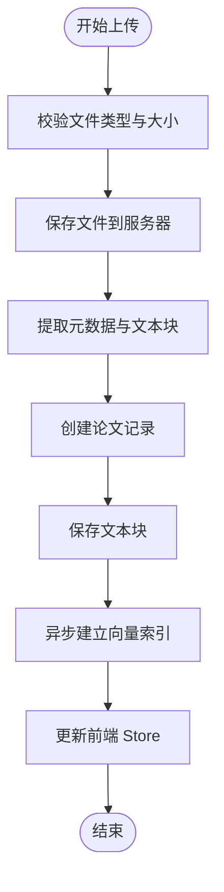
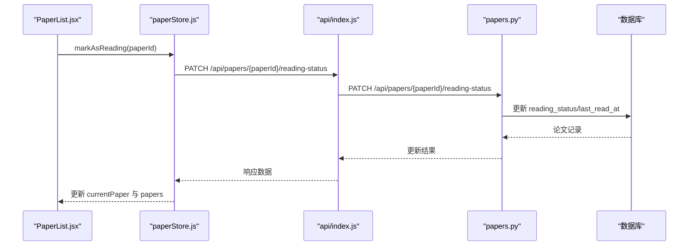
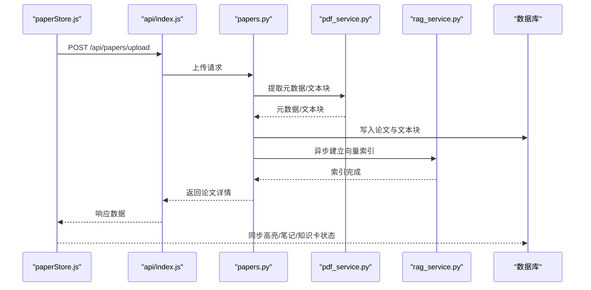
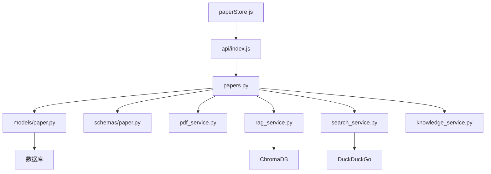

# 论文状态管理

<cite>
**本文档引用的文件**
- [backend/app/models/paper.py](file://backend/app/models/paper.py)
- [backend/app/schemas/paper.py](file://backend/app/schemas/paper.py)
- [backend/app/routers/papers.py](file://backend/app/routers/papers.py)
- [frontend/src/stores/paperStore.js](file://frontend/src/stores/paperStore.js)
- [backend/app/services/pdf_service.py](file://backend/app/services/pdf_service.py)
- [backend/app/services/search_service.py](file://backend/app/services/search_service.py)
- [backend/app/services/knowledge_service.py](file://backend/app/services/knowledge_service.py)
- [backend/app/models/highlight.py](file://backend/app/models/highlight.py)
- [backend/app/models/note.py](file://backend/app/models/note.py)
- [backend/app/models/knowledge.py](file://backend/app/models/knowledge.py)
- [frontend/src/pages/PaperList.jsx](file://frontend/src/pages/PaperList.jsx)
- [frontend/src/api/index.js](file://frontend/src/api/index.js)
- [backend/app/services/rag_service.py](file://backend/app/services/rag_service.py)
- [backend/app/config.py](file://backend/app/config.py)
</cite>

## 目录
1. [简介](#简介)
2. [项目结构](#项目结构)
3. [核心组件](#核心组件)
4. [架构总览](#架构总览)
5. [详细组件分析](#详细组件分析)
6. [依赖关系分析](#依赖关系分析)
7. [性能考虑](#性能考虑)
8. [故障排除指南](#故障排除指南)
9. [结论](#结论)
10. [附录](#附录)

## 简介
本文件面向 PaperChat 的论文状态管理，系统性阐述论文数据的状态管理架构，涵盖论文列表获取、单篇论文详情、论文元数据管理、论文状态更新机制、缓存策略、加载状态管理、错误处理机制、论文与高亮/笔记/知识库的关联关系与数据同步策略，以及论文搜索、筛选与排序的实现细节。同时提供状态持久化、性能优化与调试工具的使用方法，帮助开发者与使用者高效理解与维护该模块。

## 项目结构
PaperChat 采用前后端分离架构：
- 后端基于 FastAPI，提供论文管理、PDF 解析、RAG 检索、知识库服务等接口。
- 前端基于 React + Zustand，通过 axios 与后端交互，管理论文列表、详情、上传、删除、状态更新等状态。

**图表来源**
- [frontend/src/pages/PaperList.jsx:45-431](file://frontend/src/pages/PaperList.jsx#L45-L431)
- [frontend/src/stores/paperStore.js:1-357](file://frontend/src/stores/paperStore.js#L1-L357)
- [frontend/src/api/index.js:1-12](file://frontend/src/api/index.js#L1-L12)
- [backend/app/routers/papers.py:1-1034](file://backend/app/routers/papers.py#L1-L1034)
- [backend/app/models/paper.py:1-85](file://backend/app/models/paper.py#L1-L85)
- [backend/app/schemas/paper.py:1-83](file://backend/app/schemas/paper.py#L1-L83)
- [backend/app/services/pdf_service.py:1-194](file://backend/app/services/pdf_service.py#L1-L194)
- [backend/app/services/rag_service.py:1-400](file://backend/app/services/rag_service.py#L1-L400)
- [backend/app/services/search_service.py:1-113](file://backend/app/services/search_service.py#L1-L113)
- [backend/app/services/knowledge_service.py:1-662](file://backend/app/services/knowledge_service.py#L1-L662)

**章节来源**
- [frontend/src/pages/PaperList.jsx:45-431](file://frontend/src/pages/PaperList.jsx#L45-L431)
- [frontend/src/stores/paperStore.js:1-357](file://frontend/src/stores/paperStore.js#L1-L357)
- [frontend/src/api/index.js:1-12](file://frontend/src/api/index.js#L1-L12)
- [backend/app/routers/papers.py:1-1034](file://backend/app/routers/papers.py#L1-L1034)

## 核心组件
- 论文模型与模式：定义论文实体、文本块、阅读状态、分析缓存字段，以及与高亮、笔记、知识卡的关系。
- 论文路由：提供论文列表、详情、上传、删除、文本提取、阅读状态更新等接口。
- 前端 Store：集中管理论文列表、详情、加载状态、错误状态、推荐数据等。
- PDF 服务：负责 PDF 元数据与文本块提取。
- RAG 服务：论文向量化索引、混合检索与跨论文检索。
- 搜索服务：网络学术搜索与缓存。
- 知识库服务：从高亮/对话提取知识卡片、自动生成标签、知识关联发现、检索与统计。

**章节来源**
- [backend/app/models/paper.py:11-85](file://backend/app/models/paper.py#L11-L85)
- [backend/app/schemas/paper.py:7-83](file://backend/app/schemas/paper.py#L7-L83)
- [backend/app/routers/papers.py:91-462](file://backend/app/routers/papers.py#L91-L462)
- [frontend/src/stores/paperStore.js:4-357](file://frontend/src/stores/paperStore.js#L4-L357)
- [backend/app/services/pdf_service.py:11-194](file://backend/app/services/pdf_service.py#L11-L194)
- [backend/app/services/rag_service.py:16-400](file://backend/app/services/rag_service.py#L16-L400)
- [backend/app/services/search_service.py:10-113](file://backend/app/services/search_service.py#L10-L113)
- [backend/app/services/knowledge_service.py:79-662](file://backend/app/services/knowledge_service.py#L79-L662)

## 架构总览
论文状态管理贯穿“上传解析—索引构建—状态更新—检索展示—知识沉淀”的闭环流程。前端通过 Store 发起请求，后端路由协调服务层完成 PDF 解析、向量化索引、数据库写入与关系维护；前端 Store 同步更新本地状态，实现无感刷新与一致的用户体验。

**图表来源**
- [frontend/src/pages/PaperList.jsx:110-127](file://frontend/src/pages/PaperList.jsx#L110-L127)
- [frontend/src/stores/paperStore.js:66-104](file://frontend/src/stores/paperStore.js#L66-L104)
- [frontend/src/api/index.js:1-12](file://frontend/src/api/index.js#L1-L12)
- [backend/app/routers/papers.py:156-262](file://backend/app/routers/papers.py#L156-L262)
- [backend/app/services/pdf_service.py:14-118](file://backend/app/services/pdf_service.py#L14-L118)
- [backend/app/services/rag_service.py:183-232](file://backend/app/services/rag_service.py#L183-L232)

## 详细组件分析

### 论文模型与关系
论文模型包含阅读状态、最后阅读时间、分析缓存字段，并与文本块、高亮、笔记、知识卡建立一对多关系。文本块模型记录每页的文本与几何信息，便于 PDF 阅读器定位。

**图表来源**
- [backend/app/models/paper.py:11-85](file://backend/app/models/paper.py#L11-L85)
- [backend/app/models/highlight.py:10-37](file://backend/app/models/highlight.py#L10-L37)
- [backend/app/models/note.py:11-34](file://backend/app/models/note.py#L11-L34)
- [backend/app/models/knowledge.py:14-80](file://backend/app/models/knowledge.py#L14-L80)

**章节来源**
- [backend/app/models/paper.py:11-85](file://backend/app/models/paper.py#L11-L85)
- [backend/app/models/highlight.py:10-37](file://backend/app/models/highlight.py#L10-L37)
- [backend/app/models/note.py:11-34](file://backend/app/models/note.py#L11-L34)
- [backend/app/models/knowledge.py:14-80](file://backend/app/models/knowledge.py#L14-L80)

### 论文列表获取与筛选排序
- 列表接口支持分页、搜索（标题/作者模糊匹配）、分类过滤、阅读状态过滤，并按创建时间倒序返回。
- 前端通过 Store 的 fetchPapers 方法发起请求，携带分页与筛选参数，Store 更新 papers 与 total，并处理加载与错误状态。

**图表来源**
- [frontend/src/pages/PaperList.jsx:84-96](file://frontend/src/pages/PaperList.jsx#L84-L96)
- [frontend/src/stores/paperStore.js:21-47](file://frontend/src/stores/paperStore.js#L21-L47)
- [backend/app/routers/papers.py:91-153](file://backend/app/routers/papers.py#L91-L153)

**章节来源**
- [backend/app/routers/papers.py:91-153](file://backend/app/routers/papers.py#L91-L153)
- [frontend/src/stores/paperStore.js:21-47](file://frontend/src/stores/paperStore.js#L21-L47)
- [frontend/src/pages/PaperList.jsx:84-96](file://frontend/src/pages/PaperList.jsx#L84-L96)

### 单篇论文详情与文本提取
- 详情接口校验论文归属，返回论文响应模型。
- 文本提取接口支持按页提取或全量提取，返回拼接文本与页数。
- 文本块接口返回带坐标信息的文本块列表，供 PDF 阅读器渲染高亮与定位。

**图表来源**
- [frontend/src/stores/paperStore.js:49-63](file://frontend/src/stores/paperStore.js#L49-L63)
- [backend/app/routers/papers.py:264-291](file://backend/app/routers/papers.py#L264-L291)
- [backend/app/routers/papers.py:419-462](file://backend/app/routers/papers.py#L419-L462)

**章节来源**
- [backend/app/routers/papers.py:264-291](file://backend/app/routers/papers.py#L264-L291)
- [backend/app/routers/papers.py:419-462](file://backend/app/routers/papers.py#L419-L462)
- [frontend/src/stores/paperStore.js:49-63](file://frontend/src/stores/paperStore.js#L49-L63)

### 论文元数据管理与上传
- 上传接口支持单文件与批量上传（ZIP），进行文件类型与大小校验，提取 PDF 元数据与文本块，创建论文记录并异步建立向量索引。
- 前端 Store 在上传成功后更新列表与总数，并触发进度回调。

**图表来源**
- [backend/app/routers/papers.py:156-262](file://backend/app/routers/papers.py#L156-L262)
- [backend/app/services/pdf_service.py:14-118](file://backend/app/services/pdf_service.py#L14-L118)
- [frontend/src/stores/paperStore.js:66-104](file://frontend/src/stores/paperStore.js#L66-L104)

**章节来源**
- [backend/app/routers/papers.py:156-262](file://backend/app/routers/papers.py#L156-L262)
- [backend/app/services/pdf_service.py:14-118](file://backend/app/services/pdf_service.py#L14-L118)
- [frontend/src/stores/paperStore.js:66-104](file://frontend/src/stores/paperStore.js#L66-L104)

### 论文状态更新机制
- 阅读状态更新接口支持将状态设为 "reading"/"finished"，并更新最后阅读时间。
- 前端 Store 的 markAsReading 方法调用 PATCH 接口，同步更新当前论文与列表中的论文状态。

**图表来源**
- [frontend/src/stores/paperStore.js:177-204](file://frontend/src/stores/paperStore.js#L177-L204)
- [backend/app/routers/papers.py:44-88](file://backend/app/routers/papers.py#L44-L88)

**章节来源**
- [backend/app/routers/papers.py:44-88](file://backend/app/routers/papers.py#L44-L88)
- [frontend/src/stores/paperStore.js:177-204](file://frontend/src/stores/paperStore.js#L177-L204)

### 缓存策略与加载状态管理
- 向量检索：RAG 服务对每篇论文独立 collection，使用 ChromaDB 持久化；BM25 索引按 paper_id 缓存，避免重复构建。
- 搜索缓存：网络搜索服务维护内存缓存，支持超时控制与容量淘汰。
- 前端状态：Store 统一管理 loading、error、papers、total、currentPaper 等状态，确保 UI 一致性与无闪烁体验。

**章节来源**
- [backend/app/services/rag_service.py:16-400](file://backend/app/services/rag_service.py#L16-L400)
- [backend/app/services/search_service.py:10-113](file://backend/app/services/search_service.py#L10-L113)
- [frontend/src/stores/paperStore.js:4-357](file://frontend/src/stores/paperStore.js#L4-L357)

### 错误处理机制
- 后端：统一的 HTTP 异常抛出与错误响应，包含状态码与错误详情；文件清理逻辑防止异常中断导致资源泄露。
- 前端：Store 在请求前后设置 loading 与 error，捕获并显示错误；PaperList 页面提供错误横幅与关闭按钮。

**章节来源**
- [backend/app/routers/papers.py:177-261](file://backend/app/routers/papers.py#L177-L261)
- [frontend/src/stores/paperStore.js:40-46](file://frontend/src/stores/paperStore.js#L40-L46)
- [frontend/src/pages/PaperList.jsx:232-238](file://frontend/src/pages/PaperList.jsx#L232-L238)

### 论文与高亮/笔记/知识库的关联与同步
- 高亮与笔记：论文与高亮、笔记建立一对多关系，高亮可关联笔记；删除论文时通过级联删除清理高亮与笔记。
- 知识库：论文与知识卡建立一对多关系，知识卡可关联论文；知识库服务支持从高亮/对话提取知识卡片、自动生成标签、发现关联、检索与统计。

**图表来源**
- [backend/app/routers/papers.py:156-262](file://backend/app/routers/papers.py#L156-L262)
- [backend/app/services/pdf_service.py:14-118](file://backend/app/services/pdf_service.py#L14-L118)
- [backend/app/services/rag_service.py:183-232](file://backend/app/services/rag_service.py#L183-L232)
- [backend/app/models/paper.py:38-59](file://backend/app/models/paper.py#L38-L59)

**章节来源**
- [backend/app/models/paper.py:38-59](file://backend/app/models/paper.py#L38-L59)
- [backend/app/services/knowledge_service.py:79-231](file://backend/app/services/knowledge_service.py#L79-L231)

### 论文搜索、筛选与排序
- 后端：支持关键词模糊搜索（标题/作者）、分类过滤、阅读状态过滤、按创建时间倒序排序。
- 前端：PaperList 页面提供搜索输入、分类选择、阅读状态选择，使用防抖优化搜索体验。

**章节来源**
- [backend/app/routers/papers.py:91-153](file://backend/app/routers/papers.py#L91-L153)
- [frontend/src/pages/PaperList.jsx:192-230](file://frontend/src/pages/PaperList.jsx#L192-L230)

### 状态持久化与性能优化
- 状态持久化：ChromaDB 持久化存储论文向量索引；SQLite 存储论文元数据与关系；模型缓存于 HF_HOME。
- 性能优化：RAG 服务懒加载嵌入模型、线程池执行同步任务、BM25 索引缓存、RRF 融合排序；前端 Store 避免重复渲染，批量更新状态。

**章节来源**
- [backend/app/services/rag_service.py:26-94](file://backend/app/services/rag_service.py#L26-L94)
- [backend/app/config.py:7-11](file://backend/app/config.py#L7-L11)

### 调试工具与使用方法
- 前端：Store 提供 clearError、clearCurrentPaper、clearRecommendations、clearWebRecommendations 等清理方法；上传进度回调可用于调试。
- 后端：日志记录搜索缓存命中、RAG 索引状态、异常堆栈；可通过接口查看索引状态与重建索引。

**章节来源**
- [frontend/src/stores/paperStore.js:171-267](file://frontend/src/stores/paperStore.js#L171-L267)
- [backend/app/services/search_service.py:62-108](file://backend/app/services/search_service.py#L62-L108)
- [backend/app/services/rag_service.py:372-395](file://backend/app/services/rag_service.py#L372-L395)

## 依赖关系分析

**图表来源**
- [frontend/src/stores/paperStore.js:1-357](file://frontend/src/stores/paperStore.js#L1-L357)
- [frontend/src/api/index.js:1-12](file://frontend/src/api/index.js#L1-L12)
- [backend/app/routers/papers.py:1-1034](file://backend/app/routers/papers.py#L1-L1034)
- [backend/app/models/paper.py:1-85](file://backend/app/models/paper.py#L1-L85)
- [backend/app/schemas/paper.py:1-83](file://backend/app/schemas/paper.py#L1-L83)
- [backend/app/services/pdf_service.py:1-194](file://backend/app/services/pdf_service.py#L1-L194)
- [backend/app/services/rag_service.py:1-400](file://backend/app/services/rag_service.py#L1-L400)
- [backend/app/services/search_service.py:1-113](file://backend/app/services/search_service.py#L1-L113)
- [backend/app/services/knowledge_service.py:1-662](file://backend/app/services/knowledge_service.py#L1-L662)

**章节来源**
- [backend/app/routers/papers.py:1-1034](file://backend/app/routers/papers.py#L1-L1034)

## 性能考虑
- 懒加载与并发：嵌入模型懒加载、线程池执行同步任务、并行跨论文检索。
- 缓存策略：BM25 索引缓存、搜索结果缓存、ChromaDB 持久化减少重复计算。
- 分页与排序：后端分页与排序，前端防抖搜索，避免高频请求。
- 异步索引：上传完成后异步建立向量索引，不阻塞响应。

[本节为通用指导，无需特定文件引用]

## 故障排除指南
- 上传失败：检查文件类型与大小限制、磁盘空间、PDF 有效性；查看后端异常响应与前端错误横幅。
- 搜索无结果：确认网络连接、搜索服务缓存状态、查询关键词；查看日志与缓存清理。
- 阅读状态更新失败：确认论文归属、状态值合法性；检查后端异常与前端错误状态。
- 知识库异常：检查向量化索引状态、模型加载情况、数据库连接；必要时重建索引。

**章节来源**
- [backend/app/routers/papers.py:177-261](file://backend/app/routers/papers.py#L177-L261)
- [backend/app/services/search_service.py:98-103](file://backend/app/services/search_service.py#L98-L103)
- [backend/app/services/rag_service.py:372-395](file://backend/app/services/rag_service.py#L372-L395)
- [frontend/src/stores/paperStore.js:40-46](file://frontend/src/stores/paperStore.js#L40-L46)

## 结论
PaperChat 的论文状态管理通过清晰的前后端职责划分、完善的模型关系设计、稳健的缓存与异步处理机制，实现了从上传解析到状态更新、从检索展示到知识沉淀的完整闭环。前端 Store 与后端服务协同，确保了良好的用户体验与系统的可维护性。建议在生产环境中进一步完善监控与告警、模型版本管理与索引重建策略，以提升稳定性与可扩展性。

[本节为总结性内容，无需特定文件引用]

## 附录
- 配置项：数据库连接、JWT、CORS、上传目录与大小限制、HF 模型缓存路径等。
- 接口清单：论文列表、详情、上传、删除、文本提取、阅读状态更新、批量上传等。

**章节来源**
- [backend/app/config.py:15-44](file://backend/app/config.py#L15-L44)
- [backend/app/routers/papers.py:91-1034](file://backend/app/routers/papers.py#L91-L1034)