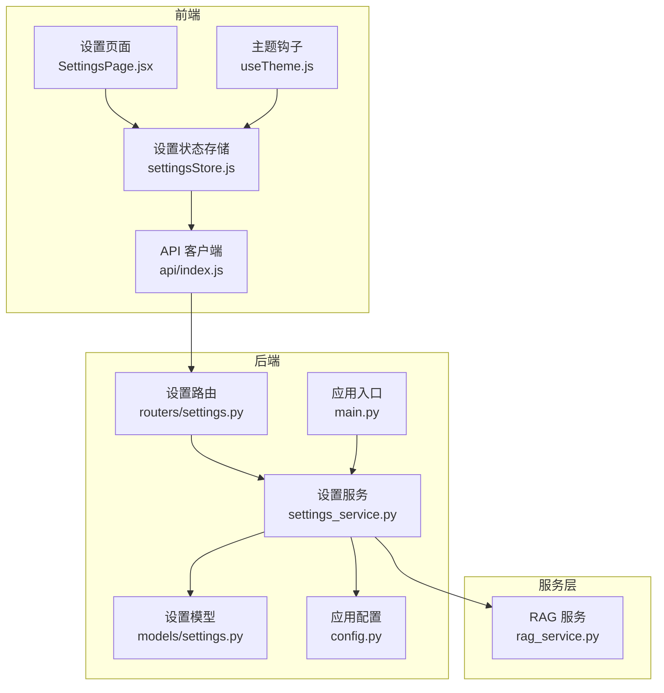
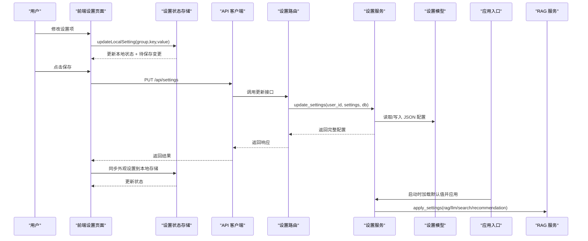
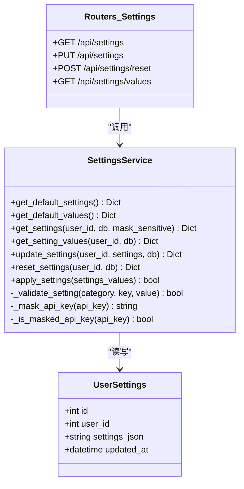
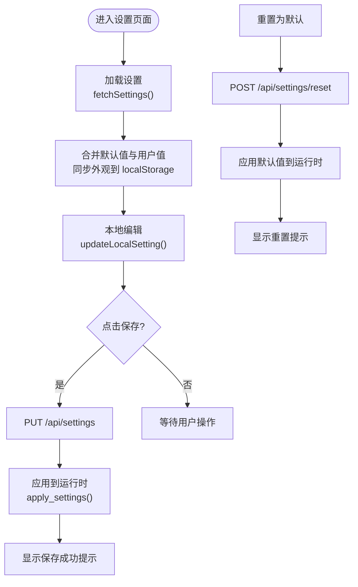
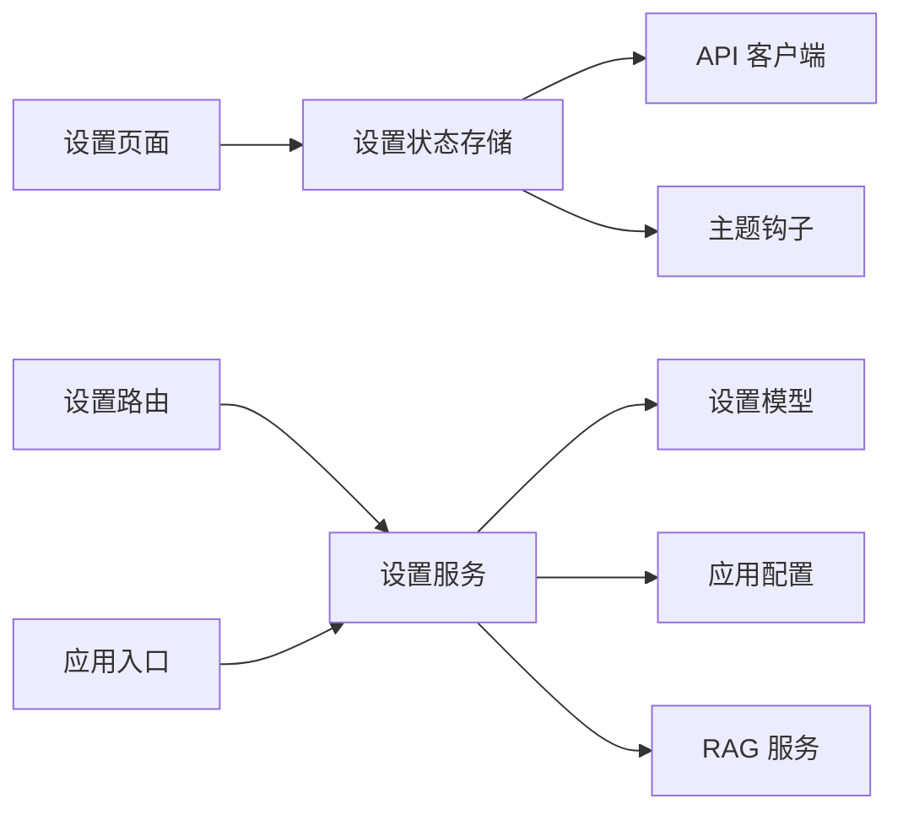

# 设置状态管理

<cite>
**本文引用的文件**
- [settings.py](file://backend/app/models/settings.py)
- [settings_service.py](file://backend/app/services/settings_service.py)
- [settings.py](file://backend/app/routers/settings.py)
- [settingsStore.js](file://frontend/src/stores/settingsStore.js)
- [SettingsPage.jsx](file://frontend/src/pages/SettingsPage.jsx)
- [useTheme.js](file://frontend/src/hooks/useTheme.js)
- [config.py](file://backend/app/config.py)
- [index.js](file://frontend/src/api/index.js)
- [main.py](file://backend/app/main.py)
- [rag_service.py](file://backend/app/services/rag_service.py)
</cite>

## 目录
1. [简介](#简介)
2. [项目结构](#项目结构)
3. [核心组件](#核心组件)
4. [架构总览](#架构总览)
5. [详细组件分析](#详细组件分析)
6. [依赖关系分析](#依赖关系分析)
7. [性能考量](#性能考量)
8. [故障排查指南](#故障排查指南)
9. [结论](#结论)
10. [附录](#附录)

## 简介
本文件面向 PaperChat 的“设置状态管理”子系统，系统性阐述用户偏好设置、主题配置与功能开关的全链路实现。内容覆盖：
- 设置数据的存储策略与默认值管理
- 配置验证机制与敏感信息脱敏
- 设置项之间的依赖关系、动态更新与实时生效
- 设置导入导出、配置同步与备份恢复能力
- 设置界面的状态管理、表单验证与用户体验优化

## 项目结构
设置状态管理横跨前后端，采用“前端状态 + 后端持久化 + 服务运行时应用”的三层架构：
- 前端负责用户交互、本地缓存与即时反馈
- 后端负责持久化、默认值与运行时配置应用
- 服务层负责将设置映射到具体业务服务（LLM/RAG/搜索/推荐）

图表来源
- [settingsStore.js:1-131](file://frontend/src/stores/settingsStore.js#L1-L131)
- [SettingsPage.jsx:1-330](file://frontend/src/pages/SettingsPage.jsx#L1-L330)
- [useTheme.js:1-91](file://frontend/src/hooks/useTheme.js#L1-L91)
- [index.js:1-12](file://frontend/src/api/index.js#L1-L12)
- [settings.py:1-94](file://backend/app/routers/settings.py#L1-L94)
- [settings_service.py:1-523](file://backend/app/services/settings_service.py#L1-L523)
- [settings.py:1-30](file://backend/app/models/settings.py#L1-L30)
- [config.py:1-44](file://backend/app/config.py#L1-L44)
- [main.py:1-114](file://backend/app/main.py#L1-L114)
- [rag_service.py:1-200](file://backend/app/services/rag_service.py#L1-L200)

章节来源
- [settings.py:1-94](file://backend/app/routers/settings.py#L1-L94)
- [settings_service.py:1-523](file://backend/app/services/settings_service.py#L1-L523)
- [settings.py:1-30](file://backend/app/models/settings.py#L1-L30)
- [settingsStore.js:1-131](file://frontend/src/stores/settingsStore.js#L1-L131)
- [SettingsPage.jsx:1-330](file://frontend/src/pages/SettingsPage.jsx#L1-L330)
- [useTheme.js:1-91](file://frontend/src/hooks/useTheme.js#L1-L91)
- [config.py:1-44](file://backend/app/config.py#L1-L44)
- [index.js:1-12](file://frontend/src/api/index.js#L1-L12)
- [main.py:1-114](file://backend/app/main.py#L1-L114)
- [rag_service.py:1-200](file://backend/app/services/rag_service.py#L1-L200)

## 核心组件
- 设置模型（后端）：以 JSON 文本形式存储用户设置，支持按用户隔离与时间戳更新。
- 设置服务：提供默认值、校验、合并、脱敏、持久化、运行时应用等功能。
- 设置路由：暴露获取、更新、重置、读取纯值等 API。
- 设置状态存储（前端）：Zustand 状态管理，支持本地缓存、待保存变更、提示消息。
- 设置页面：根据后端返回的“含元数据配置”渲染表单控件。
- 主题钩子：将外观设置同步到 DOM 属性与本地存储，避免闪烁。
- 应用入口：启动时加载默认用户设置并应用到运行时。

章节来源
- [settings.py:11-30](file://backend/app/models/settings.py#L11-L30)
- [settings_service.py:168-523](file://backend/app/services/settings_service.py#L168-L523)
- [settings.py:17-94](file://backend/app/routers/settings.py#L17-L94)
- [settingsStore.js:9-131](file://frontend/src/stores/settingsStore.js#L9-L131)
- [SettingsPage.jsx:23-185](file://frontend/src/pages/SettingsPage.jsx#L23-L185)
- [useTheme.js:13-91](file://frontend/src/hooks/useTheme.js#L13-L91)
- [main.py:34-46](file://backend/app/main.py#L34-L46)

## 架构总览
设置状态管理遵循“前端本地状态 + 后端持久化 + 服务运行时应用”的设计原则，确保用户交互即时、配置持久可靠、系统行为可动态调整。

图表来源
- [SettingsPage.jsx:232-244](file://frontend/src/pages/SettingsPage.jsx#L232-L244)
- [settingsStore.js:41-94](file://frontend/src/stores/settingsStore.js#L41-L94)
- [index.js:4-9](file://frontend/src/api/index.js#L4-L9)
- [settings.py:31-63](file://backend/app/routers/settings.py#L31-L63)
- [settings_service.py:329-404](file://backend/app/services/settings_service.py#L329-L404)
- [settings.py:19-26](file://backend/app/models/settings.py#L19-L26)
- [main.py:34-46](file://backend/app/main.py#L34-L46)
- [rag_service.py:55-77](file://backend/app/services/rag_service.py#L55-L77)

## 详细组件分析

### 后端：设置模型与服务
- 设置模型
  - 单表存储，主键、用户标识、JSON 文本、更新时间戳。
  - JSON 字段存储用户自定义配置，未定义字段默认为空对象。
- 设置服务
  - 默认配置：集中定义所有设置项的分类、类型、取值范围与标签说明，便于前端渲染与校验。
  - 校验规则：按类型进行范围与枚举校验；密码类型支持脱敏。
  - 合并与覆盖：将用户自定义配置与默认配置合并，用户值优先。
  - 脱敏策略：API Key 仅在返回给前端时脱敏，数据库不存储明文。
  - 运行时应用：将纯值配置应用到各业务服务（LLM/RAG/搜索/推荐），部分参数即时生效，部分仅影响新索引。
  - 敏感值判断：严格判断“脱敏格式”，避免误判真实密钥。
- 设置路由
  - GET /api/settings：返回含元数据的完整配置（含脱敏 API Key）。
  - PUT /api/settings：更新配置并应用到运行时。
  - POST /api/settings/reset：重置为默认值并应用。
  - GET /api/settings/values：返回纯值配置（不含元数据）。

图表来源
- [settings.py:11-30](file://backend/app/models/settings.py#L11-L30)
- [settings_service.py:168-523](file://backend/app/services/settings_service.py#L168-L523)
- [settings.py:17-94](file://backend/app/routers/settings.py#L17-L94)

章节来源
- [settings.py:11-30](file://backend/app/models/settings.py#L11-L30)
- [settings_service.py:177-431](file://backend/app/services/settings_service.py#L177-L431)
- [settings.py:17-94](file://backend/app/routers/settings.py#L17-L94)

### 前端：设置状态存储与页面
- 设置状态存储
  - 管理 settings、loading/saving/error、hasChanges、pendingChanges、toastMessage 等。
  - 支持本地更新（updateLocalSetting）与批量保存（saveSettings）。
  - 将外观设置同步到 localStorage，避免首屏闪烁。
  - 重置设置（resetSettings）与错误提示。
- 设置页面
  - 根据配置项类型渲染滑块、数值、下拉、文本、密码、开关等控件。
  - 分组展示（个性化、AI 模型、RAG、搜索、推荐、通用）。
  - 保存与重置按钮，禁用态与加载态提示。
- 主题钩子
  - 初始化主题（initializeTheme），避免闪烁。
  - 响应式应用主题、字体大小、紧凑模式到 DOM 属性与 CSS 变量。

图表来源
- [settingsStore.js:18-125](file://frontend/src/stores/settingsStore.js#L18-L125)
- [SettingsPage.jsx:212-329](file://frontend/src/pages/SettingsPage.jsx#L212-L329)
- [useTheme.js:72-91](file://frontend/src/hooks/useTheme.js#L72-L91)

章节来源
- [settingsStore.js:9-131](file://frontend/src/stores/settingsStore.js#L9-L131)
- [SettingsPage.jsx:23-185](file://frontend/src/pages/SettingsPage.jsx#L23-L185)
- [useTheme.js:13-91](file://frontend/src/hooks/useTheme.js#L13-L91)

### 配置验证与默认值管理
- 默认值集中定义：包含分类、类型、取值范围、标签与描述，前端据此渲染表单与校验。
- 校验策略：
  - 数值/滑块：类型为数字，且在 min/max 范围内。
  - 下拉选择：值必须在 options 中。
  - 文本/密码：类型为字符串。
  - 开关：布尔值。
- 脱敏策略：API Key 返回时脱敏，数据库不存储明文；严格判断“脱敏格式”避免误判。
- 环境变量回退：若用户未设置 API Key，使用环境变量中的默认值。

章节来源
- [settings_service.py:19-165](file://backend/app/services/settings_service.py#L19-L165)
- [settings_service.py:190-231](file://backend/app/services/settings_service.py#L190-L231)
- [settings_service.py:232-244](file://backend/app/services/settings_service.py#L232-L244)
- [settings_service.py:324-327](file://backend/app/services/settings_service.py#L324-L327)

### 运行时应用与实时生效
- LLM 配置：模型、温度、最大 Token、API Key、Base URL；API Key 为脱敏值时不更新。
- RAG 配置：top_k、分块大小、块重叠；top_k 即时生效，分块参数仅影响新索引。
- 搜索与推荐：超时、最大结果数、推荐数量等，即时生效。
- 应用入口：启动时加载默认用户（id=1）的设置并应用到运行时。

章节来源
- [settings_service.py:454-518](file://backend/app/services/settings_service.py#L454-L518)
- [rag_service.py:55-77](file://backend/app/services/rag_service.py#L55-L77)
- [main.py:34-46](file://backend/app/main.py#L34-L46)

### 设置导入导出、同步与备份恢复
- 导入/导出
  - 当前实现：通过 API 读取完整配置（含元数据）与纯值配置，可用于备份与恢复。
  - 建议扩展：增加导入/导出接口，支持 JSON 文件导入/导出，包含默认值与用户值合并策略。
- 同步与备份
  - 前端：外观设置同步到 localStorage，避免刷新丢失。
  - 后端：用户设置以 JSON 形式持久化，支持重置为默认值。
- 恢复
  - 通过重置接口恢复默认值，并应用到运行时；或通过导入接口恢复用户自定义配置。

章节来源
- [settings.py:17-94](file://backend/app/routers/settings.py#L17-L94)
- [settingsStore.js:24-33](file://frontend/src/stores/settingsStore.js#L24-L33)
- [settingsStore.js:103-112](file://frontend/src/stores/settingsStore.js#L103-L112)

## 依赖关系分析
- 前端依赖
  - 设置状态存储依赖 API 客户端与主题钩子。
  - 设置页面依赖设置状态存储与样式模块。
- 后端依赖
  - 设置路由依赖认证中间件与数据库会话。
  - 设置服务依赖模型、配置与各业务服务。
- 运行时依赖
  - 应用入口在启动时加载默认用户设置并应用到运行时。
  - RAG 服务支持运行时配置更新（top_k 即时生效）。

图表来源
- [SettingsPage.jsx:212-329](file://frontend/src/pages/SettingsPage.jsx#L212-L329)
- [settingsStore.js:9-131](file://frontend/src/stores/settingsStore.js#L9-L131)
- [index.js:4-9](file://frontend/src/api/index.js#L4-L9)
- [useTheme.js:13-91](file://frontend/src/hooks/useTheme.js#L13-L91)
- [settings.py:17-94](file://backend/app/routers/settings.py#L17-L94)
- [settings_service.py:168-523](file://backend/app/services/settings_service.py#L168-L523)
- [settings.py:11-30](file://backend/app/models/settings.py#L11-L30)
- [config.py:15-44](file://backend/app/config.py#L15-L44)
- [main.py:34-46](file://backend/app/main.py#L34-L46)
- [rag_service.py:55-77](file://backend/app/services/rag_service.py#L55-L77)

章节来源
- [settings.py:1-94](file://backend/app/routers/settings.py#L1-L94)
- [settings_service.py:1-523](file://backend/app/services/settings_service.py#L1-L523)
- [settings.py:1-30](file://backend/app/models/settings.py#L1-L30)
- [settingsStore.js:1-131](file://frontend/src/stores/settingsStore.js#L1-L131)
- [SettingsPage.jsx:1-330](file://frontend/src/pages/SettingsPage.jsx#L1-L330)
- [useTheme.js:1-91](file://frontend/src/hooks/useTheme.js#L1-L91)
- [config.py:1-44](file://backend/app/config.py#L1-L44)
- [index.js:1-12](file://frontend/src/api/index.js#L1-L12)
- [main.py:1-114](file://backend/app/main.py#L1-L114)
- [rag_service.py:1-200](file://backend/app/services/rag_service.py#L1-L200)

## 性能考量
- 前端
  - 本地状态与 localStorage 同步，避免频繁网络请求导致的闪烁与卡顿。
  - 表单控件按类型渲染，减少不必要的重渲染。
- 后端
  - JSON 存储简化了 Schema 变更成本，但需注意字段校验与默认值合并的复杂度。
  - 运行时应用配置时，仅对即时生效的参数进行更新，避免对重型服务造成抖动。
- 服务层
  - RAG 的分块参数仅影响新索引，避免对现有索引的频繁重建。

## 故障排查指南
- 配置校验失败
  - 现象：更新设置时报错。
  - 排查：确认设置项类型与取值范围是否符合默认配置定义。
- API Key 脱敏问题
  - 现象：前端显示脱敏值，但后端未保存明文。
  - 排查：确认脱敏格式严格匹配“脱敏值”判断逻辑。
- 运行时未生效
  - 现象：修改某些参数后系统行为未变化。
  - 排查：确认该参数是否为“仅影响新索引”或“仅即时生效”。

章节来源
- [settings_service.py:348-357](file://backend/app/services/settings_service.py#L348-L357)
- [settings_service.py:432-452](file://backend/app/services/settings_service.py#L432-L452)
- [settings_service.py:454-518](file://backend/app/services/settings_service.py#L454-L518)
- [rag_service.py:61-77](file://backend/app/services/rag_service.py#L61-L77)

## 结论
PaperChat 的设置状态管理通过“前端本地状态 + 后端持久化 + 服务运行时应用”的架构实现了高可用、易扩展的配置体系。默认值集中管理、严格的配置校验与脱敏策略保障了配置安全与一致性；外观设置的本地同步与初始化主题避免了首屏闪烁；运行时应用机制使关键参数能够即时生效。建议后续增强导入导出与备份恢复能力，进一步完善配置迁移与团队协作场景下的配置管理。

## 附录
- API 端点
  - GET /api/settings：获取完整配置（含元数据，API Key 脱敏）
  - PUT /api/settings：更新配置并应用到运行时
  - POST /api/settings/reset：重置为默认值并应用
  - GET /api/settings/values：获取纯值配置（不含元数据）
- 默认设置分类与关键项
  - LLM：模型、温度、最大 Token、API Key、Base URL
  - RAG：top_k、分块大小、块重叠
  - 搜索：最大结果数、超时
  - 推荐：top_k
  - 外观：主题、强调色、字体大小、紧凑模式
  - 通用：最大文件大小、对话历史条数

章节来源
- [settings.py:17-94](file://backend/app/routers/settings.py#L17-L94)
- [settings_service.py:19-165](file://backend/app/services/settings_service.py#L19-L165)