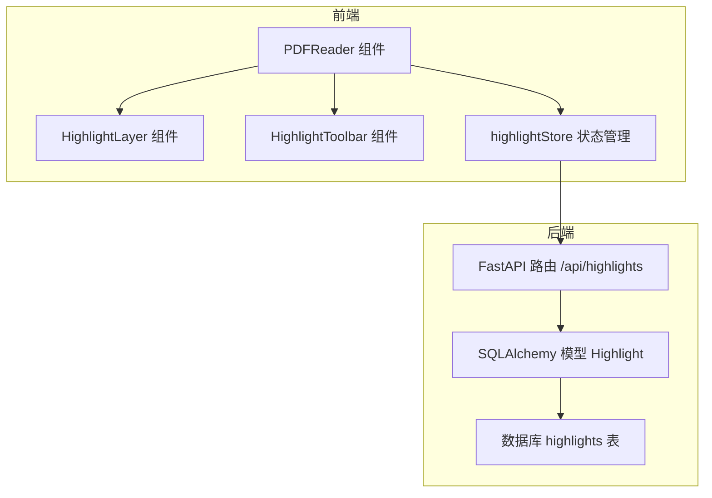
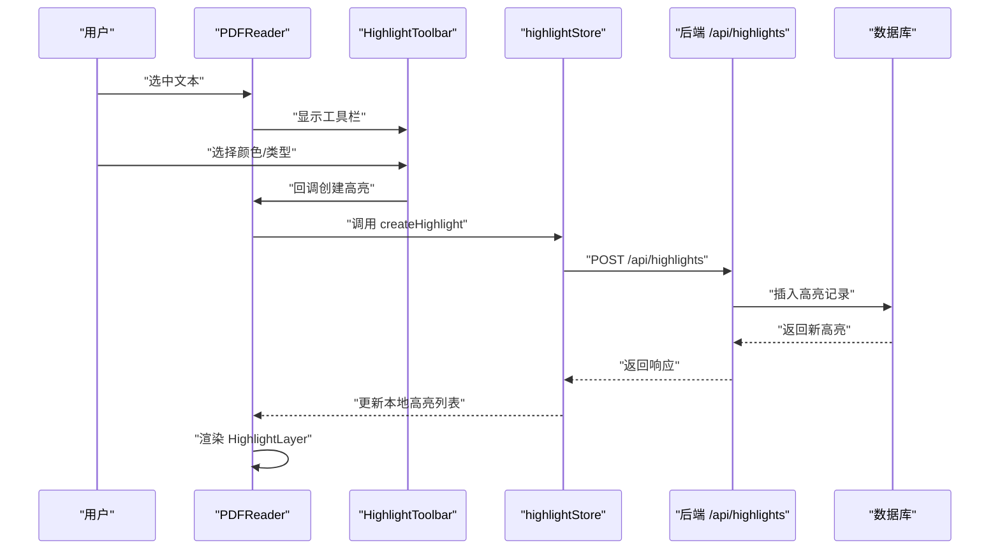
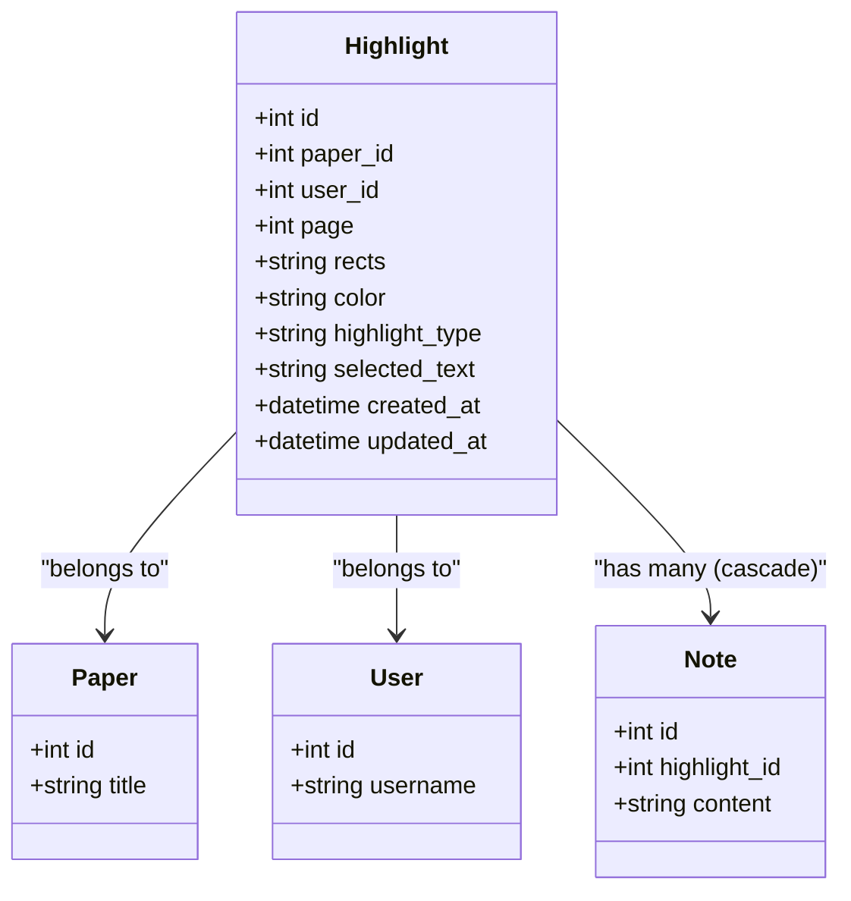
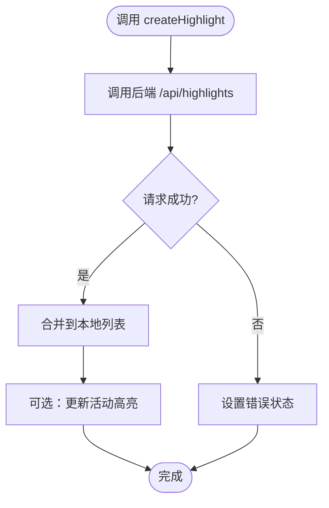
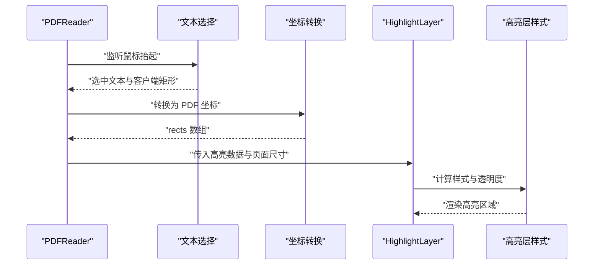
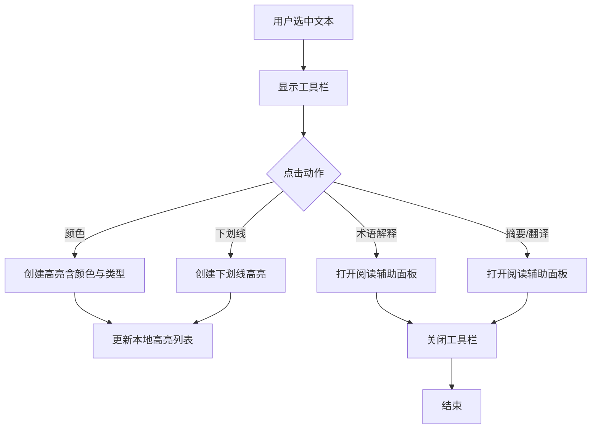
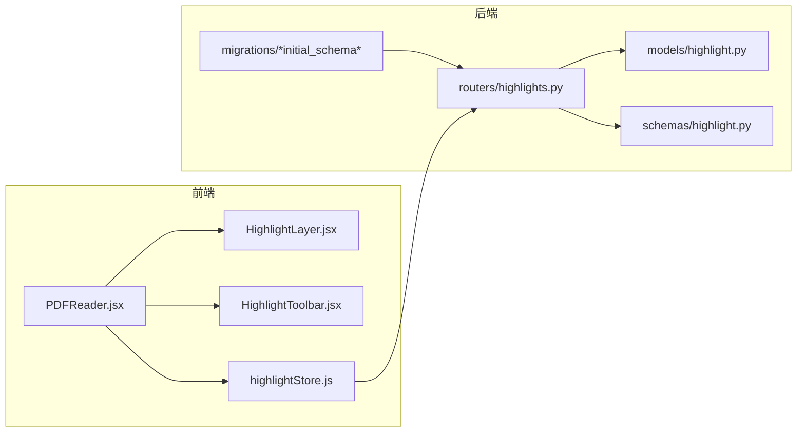

# 高亮状态管理

<cite>
**本文引用的文件**
- [backend/app/models/highlight.py](file://backend/app/models/highlight.py)
- [backend/app/schemas/highlight.py](file://backend/app/schemas/highlight.py)
- [backend/app/routers/highlights.py](file://backend/app/routers/highlights.py)
- [backend/migrations/versions/6895243c431d_initial_schema.py](file://backend/migrations/versions/6895243c431d_initial_schema.py)
- [frontend/src/stores/highlightStore.js](file://frontend/src/stores/highlightStore.js)
- [frontend/src/components/HighlightLayer/HighlightLayer.jsx](file://frontend/src/components/HighlightLayer/HighlightLayer.jsx)
- [frontend/src/components/HighlightToolbar/HighlightToolbar.jsx](file://frontend/src/components/HighlightToolbar/HighlightToolbar.jsx)
- [frontend/src/components/PDFViewer/PDFViewer.jsx](file://frontend/src/components/PDFViewer/PDFViewer.jsx)
- [frontend/src/components/PDFReader/PDFReader.jsx](file://frontend/src/components/PDFReader/PDFReader.jsx)
- [frontend/src/hooks/useWebSocket.js](file://frontend/src/hooks/useWebSocket.js)
- [backend/app/routers/ws.py](file://backend/app/routers/ws.py)
</cite>

## 目录
1. [简介](#简介)
2. [项目结构](#项目结构)
3. [核心组件](#核心组件)
4. [架构总览](#架构总览)
5. [详细组件分析](#详细组件分析)
6. [依赖分析](#依赖分析)
7. [性能考虑](#性能考虑)
8. [故障排查指南](#故障排查指南)
9. [结论](#结论)
10. [附录](#附录)

## 简介
本文档围绕 PaperChat 的高亮状态管理进行系统性技术说明，覆盖高亮的创建、编辑、删除与同步机制；高亮数据结构设计（位置信息、颜色配置、文本内容）；与 PDF 渲染层的集成（实时预览、批量操作）；持久化策略、冲突解决与性能优化；以及高亮工具栏集成、快捷键支持与用户体验优化。

## 项目结构
高亮系统由前后端协同实现：
- 后端提供高亮的 CRUD 接口与数据库模型，使用 SQLAlchemy ORM 映射到 highlights 表，并通过索引提升查询性能。
- 前端通过 zustand 状态管理维护高亮集合，结合 PDF 阅读器组件在页面上叠加高亮层，实现实时预览与交互。
- WebSocket 路由用于实时通信（非高亮主流程），但整体状态仍以 REST API 为主。

图表来源
- [frontend/src/components/PDFReader/PDFReader.jsx](file://frontend/src/components/PDFReader/PDFReader.jsx)
- [frontend/src/components/HighlightLayer/HighlightLayer.jsx](file://frontend/src/components/HighlightLayer/HighlightLayer.jsx)
- [frontend/src/components/HighlightToolbar/HighlightToolbar.jsx](file://frontend/src/components/HighlightToolbar/HighlightToolbar.jsx)
- [frontend/src/stores/highlightStore.js](file://frontend/src/stores/highlightStore.js)
- [backend/app/routers/highlights.py](file://backend/app/routers/highlights.py)
- [backend/app/models/highlight.py](file://backend/app/models/highlight.py)

章节来源
- [backend/app/routers/highlights.py](file://backend/app/routers/highlights.py)
- [backend/app/models/highlight.py](file://backend/app/models/highlight.py)
- [frontend/src/stores/highlightStore.js](file://frontend/src/stores/highlightStore.js)
- [frontend/src/components/PDFReader/PDFReader.jsx](file://frontend/src/components/PDFReader/PDFReader.jsx)

## 核心组件
- 数据模型与接口
  - 后端模型定义了高亮的字段：所属论文、用户、页码、矩形区域（JSON 字符串）、颜色、高亮类型、选中文本、时间戳等。
  - Pydantic Schema 提供创建、更新、响应的数据契约。
  - FastAPI 路由提供获取论文高亮、创建、更新、删除接口，并进行用户与论文归属校验。
- 前端状态与渲染
  - zustand 管理高亮集合、活动高亮、加载与错误状态，封装网络请求。
  - PDFReader 负责文本选择、坐标转换、工具栏弹出与高亮创建；HighlightLayer 将高亮区域叠加到 PDF 页面上；HighlightToolbar 提供颜色与动作按钮。
- 数据持久化与索引
  - Alembic 迁移为 highlights 表建立 paper_id 与 user_id 索引，加速按论文与用户维度的查询。

章节来源
- [backend/app/models/highlight.py](file://backend/app/models/highlight.py)
- [backend/app/schemas/highlight.py](file://backend/app/schemas/highlight.py)
- [backend/app/routers/highlights.py](file://backend/app/routers/highlights.py)
- [backend/migrations/versions/6895243c431d_initial_schema.py](file://backend/migrations/versions/6895243c431d_initial_schema.py)
- [frontend/src/stores/highlightStore.js](file://frontend/src/stores/highlightStore.js)
- [frontend/src/components/HighlightLayer/HighlightLayer.jsx](file://frontend/src/components/HighlightLayer/HighlightLayer.jsx)
- [frontend/src/components/HighlightToolbar/HighlightToolbar.jsx](file://frontend/src/components/HighlightToolbar/HighlightToolbar.jsx)

## 架构总览
高亮状态管理采用“前端状态 + 后端持久化”的双层架构：
- 用户在 PDF 上选中文本，工具栏弹出，选择颜色与类型后创建高亮。
- 前端将选区坐标与文本发送至后端，后端校验权限并落库，返回最新高亮。
- 前端刷新本地高亮列表并在当前页叠加高亮层，实现实时预览。
- 支持更新颜色与类型、删除高亮；页面切换或滚动模式下按页渲染高亮。

图表来源
- [frontend/src/components/PDFReader/PDFReader.jsx](file://frontend/src/components/PDFReader/PDFReader.jsx)
- [frontend/src/components/HighlightToolbar/HighlightToolbar.jsx](file://frontend/src/components/HighlightToolbar/HighlightToolbar.jsx)
- [frontend/src/stores/highlightStore.js](file://frontend/src/stores/highlightStore.js)
- [backend/app/routers/highlights.py](file://backend/app/routers/highlights.py)

## 详细组件分析

### 数据模型与接口
- 模型字段
  - 主键 id、paper_id、user_id、page、rects（JSON 字符串）、color、highlight_type、selected_text、created_at、updated_at。
  - 关系：与 Paper、User 双向关联，与 Note 一对多级联删除。
- Schema
  - 创建：paper_id、page、rects、color、highlight_type、selected_text。
  - 更新：color、highlight_type（可选）。
  - 响应：包含完整字段，支持 from_attributes。
- 路由
  - GET /paper/{paper_id}：按论文与用户过滤，按页与创建时间排序。
  - POST：创建高亮，校验论文归属。
  - PUT：更新高亮颜色与类型。
  - DELETE：删除高亮。

图表来源
- [backend/app/models/highlight.py](file://backend/app/models/highlight.py)

章节来源
- [backend/app/models/highlight.py](file://backend/app/models/highlight.py)
- [backend/app/schemas/highlight.py](file://backend/app/schemas/highlight.py)
- [backend/app/routers/highlights.py](file://backend/app/routers/highlights.py)

### 前端状态管理（Zustand）
- 状态属性
  - highlights：当前论文高亮列表
  - activeHighlight：当前选中高亮
  - loading、error：加载与错误状态
- 核心方法
  - fetchHighlights：拉取论文高亮
  - createHighlight：创建高亮并合并到列表
  - updateHighlight：更新高亮并替换列表项
  - deleteHighlight：删除高亮并清理活动高亮
  - setActiveHighlight：设置活动高亮
  - clearHighlights/clearError：清理状态

图表来源
- [frontend/src/stores/highlightStore.js](file://frontend/src/stores/highlightStore.js)
- [backend/app/routers/highlights.py](file://backend/app/routers/highlights.py)

章节来源
- [frontend/src/stores/highlightStore.js](file://frontend/src/stores/highlightStore.js)

### PDF 渲染与高亮层集成
- PDFViewer
  - 使用 pdfjs-dist 渲染 Canvas，计算缩放比例与页面尺寸，提供给上层组件。
- PDFReader
  - react-pdf 文档加载与页面渲染；处理文本选择、坐标转换（像素↔PDF 坐标）、工具栏定位与显示。
  - 将高亮数据按页过滤并传递给 HighlightLayer。
  - 支持单页与滚动两种视图模式，滚动模式使用 IntersectionObserver 懒加载。
- HighlightLayer
  - 将 JSON 格式的 rects 转换为页面像素坐标，叠加绝对定位的 div 实现高亮区域渲染。
  - 支持三种高亮类型：高亮、下划线、删除线；根据是否为活动高亮调整透明度。
  - 点击高亮触发上层回调，便于选中与编辑。

图表来源
- [frontend/src/components/PDFReader/PDFReader.jsx](file://frontend/src/components/PDFReader/PDFReader.jsx)
- [frontend/src/components/HighlightLayer/HighlightLayer.jsx](file://frontend/src/components/HighlightLayer/HighlightLayer.jsx)
- [frontend/src/components/PDFViewer/PDFViewer.jsx](file://frontend/src/components/PDFViewer/PDFViewer.jsx)

章节来源
- [frontend/src/components/PDFReader/PDFReader.jsx](file://frontend/src/components/PDFReader/PDFReader.jsx)
- [frontend/src/components/HighlightLayer/HighlightLayer.jsx](file://frontend/src/components/HighlightLayer/HighlightLayer.jsx)
- [frontend/src/components/PDFViewer/PDFViewer.jsx](file://frontend/src/components/PDFViewer/PDFViewer.jsx)

### 高亮工具栏与快捷键
- HighlightToolbar
  - 预设颜色列表；提供“保存为知识卡片”、“下划线”、“添加笔记”、“取消”等按钮。
  - 根据选中文本长度动态显示术语解释或长文本摘要/翻译按钮。
  - 自动边界检测，确保工具栏不超出视口。
- 快捷键支持
  - 支持方向键、空格键、Home/End 进行翻页与定位，避免在输入框内触发。
- 与阅读辅助联动
  - 工具栏可触发术语解释、摘要生成、翻译等阅读辅助功能。

图表来源
- [frontend/src/components/HighlightToolbar/HighlightToolbar.jsx](file://frontend/src/components/HighlightToolbar/HighlightToolbar.jsx)
- [frontend/src/components/PDFReader/PDFReader.jsx](file://frontend/src/components/PDFReader/PDFReader.jsx)

章节来源
- [frontend/src/components/HighlightToolbar/HighlightToolbar.jsx](file://frontend/src/components/HighlightToolbar/HighlightToolbar.jsx)
- [frontend/src/components/PDFReader/PDFReader.jsx](file://frontend/src/components/PDFReader/PDFReader.jsx)

### 同步机制与实时预览
- 同步路径
  - 前端创建/更新/删除高亮均通过 REST API 与后端交互，后端校验用户与论文归属。
  - 前端收到响应后更新本地状态，HighlightLayer 依据最新高亮数据即时重绘。
- 批量操作
  - 通过按页过滤高亮数据，逐页渲染高亮层，避免一次性渲染过多节点导致卡顿。
  - 滚动模式下使用懒加载，仅渲染可见页面，进一步优化性能。
- 与 WebSocket 的关系
  - 项目提供 WebSocket 路由用于分析与问答等场景，高亮状态管理不依赖 WebSocket，保持稳定与可控。

章节来源
- [backend/app/routers/highlights.py](file://backend/app/routers/highlights.py)
- [frontend/src/stores/highlightStore.js](file://frontend/src/stores/highlightStore.js)
- [frontend/src/components/PDFReader/PDFReader.jsx](file://frontend/src/components/PDFReader/PDFReader.jsx)
- [backend/app/routers/ws.py](file://backend/app/routers/ws.py)
- [frontend/src/hooks/useWebSocket.js](file://frontend/src/hooks/useWebSocket.js)

## 依赖分析
- 后端依赖
  - FastAPI 路由依赖 SQLAlchemy 会话与模型，Pydantic Schema 作为数据契约。
  - Alembic 迁移为高亮表建立索引，提升查询效率。
- 前端依赖
  - react-pdf 与 pdfjs-dist 提供 PDF 渲染能力。
  - zustand 管理全局高亮状态。
  - HighlightLayer 依赖页面尺寸与缩放比例，确保坐标转换正确。

图表来源
- [backend/app/routers/highlights.py](file://backend/app/routers/highlights.py)
- [backend/app/models/highlight.py](file://backend/app/models/highlight.py)
- [backend/app/schemas/highlight.py](file://backend/app/schemas/highlight.py)
- [backend/migrations/versions/6895243c431d_initial_schema.py](file://backend/migrations/versions/6895243c431d_initial_schema.py)
- [frontend/src/components/PDFReader/PDFReader.jsx](file://frontend/src/components/PDFReader/PDFReader.jsx)
- [frontend/src/components/HighlightLayer/HighlightLayer.jsx](file://frontend/src/components/HighlightLayer/HighlightLayer.jsx)
- [frontend/src/components/HighlightToolbar/HighlightToolbar.jsx](file://frontend/src/components/HighlightToolbar/HighlightToolbar.jsx)
- [frontend/src/stores/highlightStore.js](file://frontend/src/stores/highlightStore.js)

章节来源
- [backend/app/routers/highlights.py](file://backend/app/routers/highlights.py)
- [backend/app/models/highlight.py](file://backend/app/models/highlight.py)
- [backend/app/schemas/highlight.py](file://backend/app/schemas/highlight.py)
- [backend/migrations/versions/6895243c431d_initial_schema.py](file://backend/migrations/versions/6895243c431d_initial_schema.py)
- [frontend/src/components/PDFReader/PDFReader.jsx](file://frontend/src/components/PDFReader/PDFReader.jsx)
- [frontend/src/components/HighlightLayer/HighlightLayer.jsx](file://frontend/src/components/HighlightLayer/HighlightLayer.jsx)
- [frontend/src/components/HighlightToolbar/HighlightToolbar.jsx](file://frontend/src/components/HighlightToolbar/HighlightToolbar.jsx)
- [frontend/src/stores/highlightStore.js](file://frontend/src/stores/highlightStore.js)

## 性能考虑
- 坐标转换与渲染
  - HighlightLayer 对每个高亮矩形进行像素坐标转换，建议限制单页高亮数量或采用虚拟化策略。
  - 滚动模式下仅渲染可见页面，减少 DOM 节点数量。
- 网络与状态
  - zustand 状态更新采用不可变合并与局部替换，避免全量重渲染。
  - 后端路由按页与时间排序，有利于前端分页展示与增量刷新。
- 数据库索引
  - highlights 表对 paper_id 与 user_id 建立索引，显著降低查询成本。

章节来源
- [frontend/src/components/HighlightLayer/HighlightLayer.jsx](file://frontend/src/components/HighlightLayer/HighlightLayer.jsx)
- [frontend/src/components/PDFReader/PDFReader.jsx](file://frontend/src/components/PDFReader/PDFReader.jsx)
- [backend/migrations/versions/6895243c431d_initial_schema.py](file://backend/migrations/versions/6895243c431d_initial_schema.py)

## 故障排查指南
- 权限与资源不存在
  - 后端在创建/更新/删除高亮时会校验论文是否存在且属于当前用户；若不存在将返回 404。
- 前端错误处理
  - highlightStore 在请求失败时设置错误状态与提示，调用方需捕获异常并提示用户。
- 坐标转换异常
  - HighlightLayer 在解析 rects JSON 失败时会记录错误并跳过该高亮；检查前端传入的 selectionRects 是否为有效数组。
- 工具栏不显示或位置异常
  - 确认 PDF 页面尺寸已加载（pageDimensions），并确保缩放比例 scale 正确传入 HighlightLayer。

章节来源
- [backend/app/routers/highlights.py](file://backend/app/routers/highlights.py)
- [frontend/src/stores/highlightStore.js](file://frontend/src/stores/highlightStore.js)
- [frontend/src/components/HighlightLayer/HighlightLayer.jsx](file://frontend/src/components/HighlightLayer/HighlightLayer.jsx)
- [frontend/src/components/PDFReader/PDFReader.jsx](file://frontend/src/components/PDFReader/PDFReader.jsx)

## 结论
PaperChat 的高亮状态管理以清晰的前后端职责划分实现：后端提供安全可靠的高亮 CRUD 与数据契约，前端通过状态管理与 PDF 渲染层实现实时预览与交互体验。通过索引优化、按页渲染与懒加载策略，系统在功能完整性与性能之间取得良好平衡。未来可在批量操作、冲突解决与跨设备同步方面进一步增强。

## 附录
- 数据结构要点
  - 位置信息：rects 为 JSON 字符串，包含多个矩形（x0,y0,x1,y1）。
  - 颜色配置：字符串形式的颜色值，默认黄色。
  - 文本内容：selected_text 保存用户选中的文本，便于后续阅读辅助与知识卡片生成。
- 扩展建议
  - 批量操作：提供批量创建/更新/删除接口，前端采用批处理队列减少网络往返。
  - 冲突解决：引入版本号或时间戳字段，后端在并发更新时进行冲突检测与合并。
  - 跨设备同步：在现有 REST 流程基础上增加 WebSocket 广播或轮询，推送高亮变更。