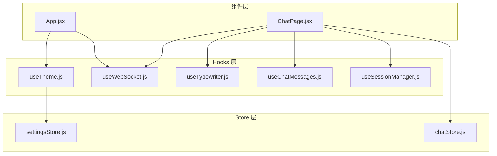
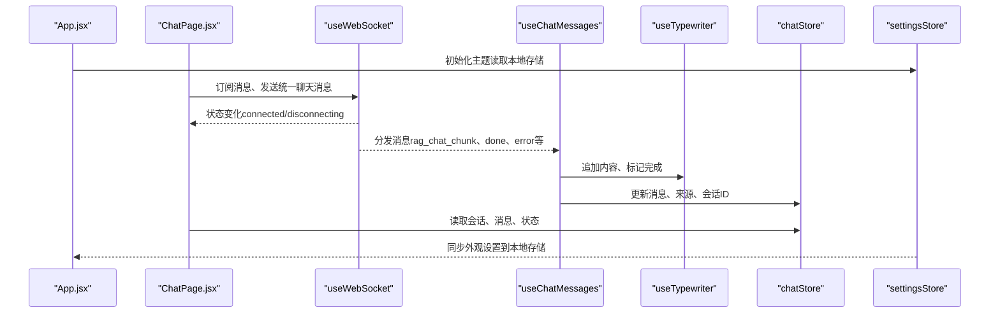
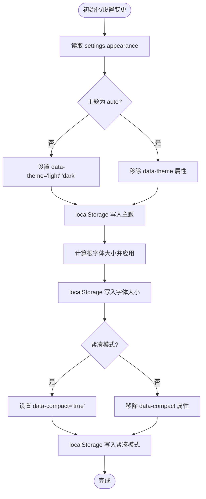
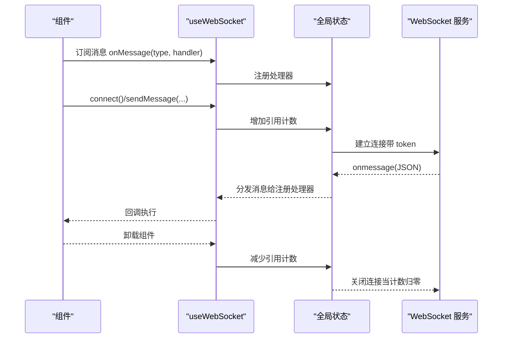
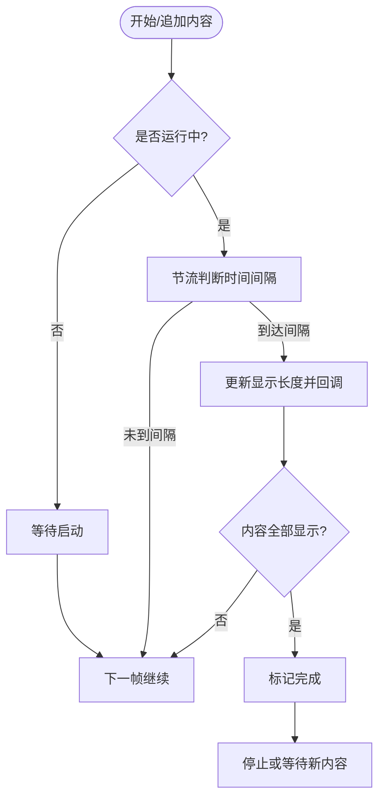
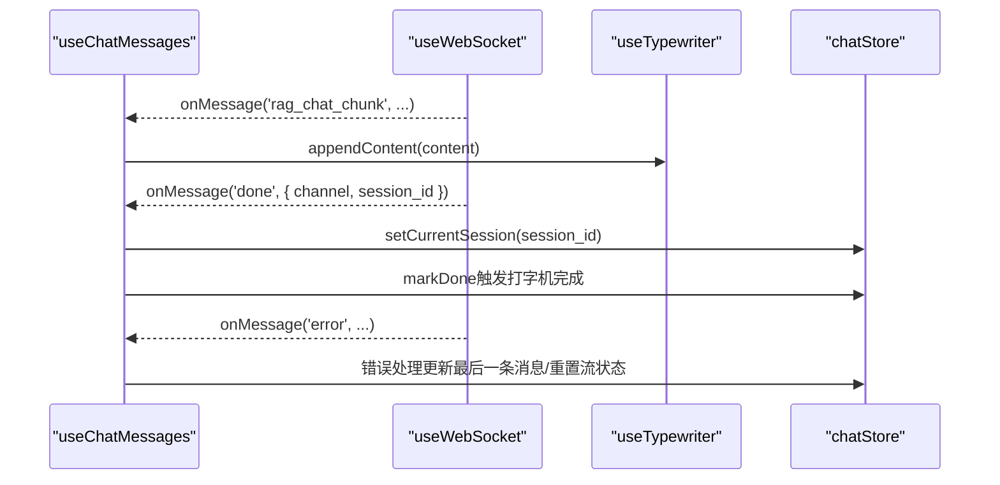
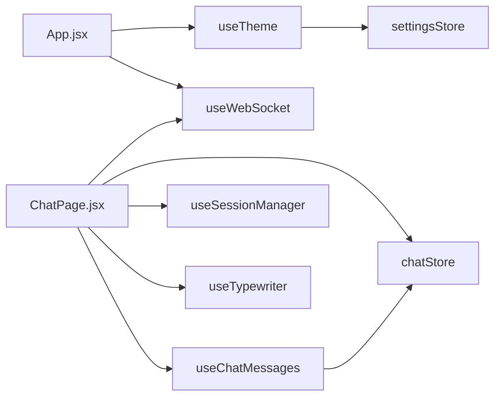

# 自定义 Hooks

<cite>
**本文档引用的文件**
- [useTheme.js](file://frontend/src/hooks/useTheme.js)
- [useWebSocket.js](file://frontend/src/hooks/useWebSocket.js)
- [useTypewriter.js](file://frontend/src/hooks/useTypewriter.js)
- [useChatMessages.js](file://frontend/src/hooks/useChatMessages.js)
- [useSessionManager.js](file://frontend/src/hooks/useSessionManager.js)
- [settingsStore.js](file://frontend/src/stores/settingsStore.js)
- [chatStore.js](file://frontend/src/stores/chatStore.js)
- [App.jsx](file://frontend/src/App.jsx)
- [ChatPage.jsx](file://frontend/src/pages/ChatPage.jsx)
- [index.css](file://frontend/src/index.css)
- [App.css](file://frontend/src/App.css)
</cite>

## 目录
1. [简介](#简介)
2. [项目结构](#项目结构)
3. [核心组件](#核心组件)
4. [架构总览](#架构总览)
5. [详细组件分析](#详细组件分析)
6. [依赖关系分析](#依赖关系分析)
7. [性能考量](#性能考量)
8. [故障排查指南](#故障排查指南)
9. [结论](#结论)
10. [附录](#附录)

## 简介
本文件面向 PaperChat 前端的自定义 Hooks 系统，重点覆盖以下方面：
- 设计理念与复用性：围绕“关注点分离”“可组合性”“最小副作用”的原则，将状态、生命周期与业务逻辑封装为可复用的 Hook。
- WebSocket 连接管理 Hook：集中管理全局 WebSocket 生命周期、消息路由、重连策略与并发连接控制。
- 主题切换 Hook：统一管理主题、字体大小、紧凑模式，并与本地存储与全局 CSS 变量联动。
- 与 Store 的协作：通过 Zustand Store 管理复杂状态，Hook 仅负责副作用与 UI 交互。
- 性能优化与错误处理：包括请求节流、帧动画、自动重连、状态持久化与降级处理。
- 测试与调试建议：提供可操作的测试路径与调试技巧，便于快速定位问题。
- 集成模式与使用场景：给出典型页面与组件的集成方式，帮助开发者正确使用。

## 项目结构
PaperChat 前端采用“组件 + Hooks + Store”的分层组织方式：
- 组件层：页面组件与业务组件，负责渲染与用户交互。
- Hooks 层：封装可复用的副作用与业务逻辑，如 WebSocket 管理、打字机效果、消息监听、会话管理等。
- Store 层：使用 Zustand 管理全局状态，如设置、聊天会话、消息、高亮等。

图表来源
- [App.jsx](file://frontend/src/App.jsx)
- [ChatPage.jsx](file://frontend/src/pages/ChatPage.jsx)
- [useTheme.js](file://frontend/src/hooks/useTheme.js)
- [useWebSocket.js](file://frontend/src/hooks/useWebSocket.js)
- [useTypewriter.js](file://frontend/src/hooks/useTypewriter.js)
- [useChatMessages.js](file://frontend/src/hooks/useChatMessages.js)
- [useSessionManager.js](file://frontend/src/hooks/useSessionManager.js)
- [settingsStore.js](file://frontend/src/stores/settingsStore.js)
- [chatStore.js](file://frontend/src/stores/chatStore.js)

章节来源
- [App.jsx](file://frontend/src/App.jsx)
- [ChatPage.jsx](file://frontend/src/pages/ChatPage.jsx)

## 核心组件
- useTheme：主题、字体大小、紧凑模式的统一管理，支持自动模式与本地持久化。
- useWebSocket：全局 WebSocket 管理，提供连接状态、消息订阅、发送封装与自动重连。
- useTypewriter：基于 requestAnimationFrame 的打字机效果，适合流式渲染。
- useChatMessages：统一处理聊天与分析类 WebSocket 消息，对接 Store 与 UI。
- useSessionManager：封装会话的创建、切换、删除与标题编辑逻辑。

章节来源
- [useTheme.js](file://frontend/src/hooks/useTheme.js)
- [useWebSocket.js](file://frontend/src/hooks/useWebSocket.js)
- [useTypewriter.js](file://frontend/src/hooks/useTypewriter.js)
- [useChatMessages.js](file://frontend/src/hooks/useChatMessages.js)
- [useSessionManager.js](file://frontend/src/hooks/useSessionManager.js)

## 架构总览
整体交互流程如下：
- 应用启动时初始化主题，避免闪烁。
- 页面组件通过 useWebSocket 获取连接状态与消息订阅能力。
- useChatMessages 统一处理消息类型，驱动 Store 更新与 UI 渲染。
- useTypewriter 控制流式输出节奏，提升用户体验。
- useSessionManager 管理会话生命周期，保证状态一致性。
- useTheme 与 settingsStore 协作，实现外观设置的持久化与即时生效。

图表来源
- [App.jsx](file://frontend/src/App.jsx)
- [ChatPage.jsx](file://frontend/src/pages/ChatPage.jsx)
- [useWebSocket.js](file://frontend/src/hooks/useWebSocket.js)
- [useChatMessages.js](file://frontend/src/hooks/useChatMessages.js)
- [useTypewriter.js](file://frontend/src/hooks/useTypewriter.js)
- [chatStore.js](file://frontend/src/stores/chatStore.js)
- [settingsStore.js](file://frontend/src/stores/settingsStore.js)

## 详细组件分析

### useTheme：主题与外观设置 Hook
- 功能特性
  - 主题：支持 light/dark/auto，auto 时移除 data-theme 属性，交由 CSS 媒体查询决定。
  - 字体大小：以倍数形式控制根元素字体大小，同时写入本地存储。
  - 紧凑模式：通过 data-compact 属性控制布局紧凑程度。
  - 初始化：提供 initializeTheme，在应用启动时从本地存储读取并立即应用，避免闪烁。
- 参数与返回
  - 无参数；内部通过 settingsStore 的 settings.appearance 读取配置。
  - 无显式返回值；副作用为修改 documentElement 的属性与样式。
- 副作用与持久化
  - 每次设置变更都会写入 localStorage，确保刷新后仍保持一致。
- 与 Store 的关系
  - 依赖 settingsStore 的 settings 与本地同步逻辑，确保设置变更即时反映到 DOM。
- 使用场景
  - 在 App.jsx 中首次渲染前调用 initializeTheme。
  - 在设置页面中通过 settingsStore 的 updateLocalSetting 触发外观变更。

图表来源
- [useTheme.js](file://frontend/src/hooks/useTheme.js)
- [settingsStore.js](file://frontend/src/stores/settingsStore.js)
- [index.css](file://frontend/src/index.css)

章节来源
- [useTheme.js](file://frontend/src/hooks/useTheme.js)
- [settingsStore.js](file://frontend/src/stores/settingsStore.js)
- [index.css](file://frontend/src/index.css)
- [App.jsx](file://frontend/src/App.jsx)

### useWebSocket：全局 WebSocket 管理 Hook
- 功能特性
  - 全局连接：单例连接，多处订阅共享同一 WebSocket 实例。
  - 状态管理：通过 useSyncExternalStore 暴露连接状态，支持订阅与快照。
  - 自动重连：指数退避式重连，最多重试固定次数。
  - 消息路由：按消息类型分发至全局处理器，支持通配符订阅。
  - 并发控制：通过引用计数在最后一个组件卸载时关闭连接。
  - 发送封装：提供通用 sendMessage 与专用 RAG/跨文档/统一聊天消息发送方法。
- 参数与返回
  - 无参数；返回 { status, sendMessage, sendRagMessage, sendCrossDocMessage, sendUnifiedChatMessage, sendCancel, onMessage, connect }。
- 副作用与持久化
  - 通过 localStorage 读取 token 注入连接 URL；连接状态与消息处理器为进程内全局状态。
- 错误处理
  - onclose 触发重连；onerror 输出错误日志；发送失败时返回 false 并打印警告。
- 使用场景
  - 在 ChatPage.jsx 中订阅消息、发送统一聊天消息。
  - 在 App.jsx 中处理分析类消息与 Agent 相关消息。

图表来源
- [useWebSocket.js](file://frontend/src/hooks/useWebSocket.js)
- [ChatPage.jsx](file://frontend/src/pages/ChatPage.jsx)
- [App.jsx](file://frontend/src/App.jsx)

章节来源
- [useWebSocket.js](file://frontend/src/hooks/useWebSocket.js)
- [ChatPage.jsx](file://frontend/src/pages/ChatPage.jsx)
- [App.jsx](file://frontend/src/App.jsx)

### useTypewriter：打字机效果 Hook
- 功能特性
  - 基于 requestAnimationFrame 的节流更新，与浏览器刷新率同步，减少卡顿。
  - 支持字符间隔与每帧字符数配置，平滑控制输出节奏。
  - 提供 appendContent/start/markDone/stop/reset 等方法，便于与流式消息配合。
- 参数与返回
  - 参数：updateLastMessage、onComplete、options（charInterval、charsPerTick）。
  - 返回：{ appendContent, start, markDone, stop, reset, fullContentRef, isRunningRef }。
- 使用场景
  - 在 useChatMessages 中接收流式消息，逐步更新最后一条消息内容。

图表来源
- [useTypewriter.js](file://frontend/src/hooks/useTypewriter.js)
- [useChatMessages.js](file://frontend/src/hooks/useChatMessages.js)

章节来源
- [useTypewriter.js](file://frontend/src/hooks/useTypewriter.js)
- [useChatMessages.js](file://frontend/src/hooks/useChatMessages.js)
- [ChatPage.jsx](file://frontend/src/pages/ChatPage.jsx)

### useChatMessages：聊天消息统一处理 Hook
- 功能特性
  - 统一订阅多种消息类型（RAG、跨文档、分析、深度分析、意图检测、完成、取消、错误）。
  - 将消息映射到 Store 方法（更新消息、来源、会话、搜索状态等）。
  - 支持自定义错误与取消处理回调。
- 参数与返回
  - 参数：onMessage、typewriter、isChattingRef、currentSessionIdRef、setSources、setCrossDocSources、setSearchStatus、updateLastMessage、setCurrentSession、fetchSessions、onError、onCancelled、resetStreamState。
  - 返回：currentIntent、setCurrentIntent。
- 使用场景
  - 在 ChatPage.jsx 中注入 onMessage，驱动打字机与 Store 更新。

图表来源
- [useChatMessages.js](file://frontend/src/hooks/useChatMessages.js)
- [useWebSocket.js](file://frontend/src/hooks/useWebSocket.js)
- [useTypewriter.js](file://frontend/src/hooks/useTypewriter.js)
- [chatStore.js](file://frontend/src/stores/chatStore.js)

章节来源
- [useChatMessages.js](file://frontend/src/hooks/useChatMessages.js)
- [ChatPage.jsx](file://frontend/src/pages/ChatPage.jsx)
- [chatStore.js](file://frontend/src/stores/chatStore.js)

### useSessionManager：会话管理 Hook
- 功能特性
  - 新建会话：根据是否跨文档模式选择创建普通或跨文档会话。
  - 切换会话：停止聊天、重置流状态、加载消息。
  - 删除会话：确认提示、必要时停止聊天。
  - 编辑标题：支持回车保存、ESC 取消。
- 参数与返回
  - 参数：isChatting、isCrossDocMode、selectedPaperIds、selectedPaperId、currentSessionId、handleStop、resetStreamState、createCrossDocSession、createSession、setCurrentSession、fetchMessages、deleteSession、renameSession。
  - 返回：handleNewSession、handleSwitchSession、handleDeleteSession、handleStartEditing、handleSaveTitle、handleCancelEditing、handleEditKeyDown、editingSessionId、editingTitle、setEditingTitle。
- 使用场景
  - 在 ChatPage.jsx 的侧边栏与输入区域中调用，统一管理会话生命周期。

章节来源
- [useSessionManager.js](file://frontend/src/hooks/useSessionManager.js)
- [ChatPage.jsx](file://frontend/src/pages/ChatPage.jsx)

## 依赖关系分析
- 组件对 Hooks 的依赖
  - App.jsx 依赖 useTheme 与 useWebSocket，用于全局外观与消息通道。
  - ChatPage.jsx 依赖 useWebSocket、useChatMessages、useSessionManager、useTypewriter、chatStore，构成聊天主流程。
- Hooks 对 Store 的依赖
  - useTheme 依赖 settingsStore 的 settings 与本地同步。
  - useChatMessages 依赖 chatStore 的消息、来源、会话与搜索状态更新。
- 外部依赖
  - useWebSocket 依赖浏览器 WebSocket API 与 localStorage。
  - useTypewriter 依赖 requestAnimationFrame。

图表来源
- [App.jsx](file://frontend/src/App.jsx)
- [ChatPage.jsx](file://frontend/src/pages/ChatPage.jsx)
- [useTheme.js](file://frontend/src/hooks/useTheme.js)
- [useWebSocket.js](file://frontend/src/hooks/useWebSocket.js)
- [useChatMessages.js](file://frontend/src/hooks/useChatMessages.js)
- [useSessionManager.js](file://frontend/src/hooks/useSessionManager.js)
- [useTypewriter.js](file://frontend/src/hooks/useTypewriter.js)
- [settingsStore.js](file://frontend/src/stores/settingsStore.js)
- [chatStore.js](file://frontend/src/stores/chatStore.js)

章节来源
- [App.jsx](file://frontend/src/App.jsx)
- [ChatPage.jsx](file://frontend/src/pages/ChatPage.jsx)

## 性能考量
- 帧动画与节流
  - useTypewriter 使用 requestAnimationFrame 与时间戳节流，避免频繁重排，降低主线程压力。
- 连接复用与并发控制
  - useWebSocket 通过全局单例连接与引用计数，避免重复连接与资源浪费。
- 状态订阅与最小化渲染
  - useSyncExternalStore 仅在状态变化时通知订阅者，减少无效重渲染。
- 本地存储与初始化
  - useTheme 的 initializeTheme 在应用启动阶段从 localStorage 读取并立即应用，避免首屏闪烁与二次渲染。
- Store 精细化更新
  - chatStore 与 settingsStore 使用局部状态更新，避免全量替换导致的昂贵计算。

[本节为通用性能讨论，无需特定文件来源]

## 故障排查指南
- WebSocket 无法连接
  - 检查 token 是否存在（localStorage 中），确认 WS_URL 是否正确拼接。
  - 查看 onerror 日志与 onclose 重连行为，确认 MAX_RETRIES 与 RETRY_DELAY 设置。
  - 在 ChatPage.jsx 中检查 wsStatus，确保发送前状态为 connected。
- 消息未显示
  - 确认 onMessage 订阅是否正确，注意类型匹配与通配符订阅。
  - 检查 useChatMessages 的 isChattingRef 条件，避免非聊天状态下忽略 chunk。
- 打字机不生效
  - 确认 typewriter.start 已调用，appendContent 是否被调用，markDone 是否在完成后触发。
- 主题不生效
  - 检查 useTheme 是否在 App.jsx 初始化阶段调用 initializeTheme。
  - 确认 data-theme 与 data-compact 属性是否正确设置，以及 localStorage 是否写入成功。
- 设置未持久化
  - 检查 settingsStore 的 updateLocalSetting 与 saveSettings 是否正确同步到 localStorage。

章节来源
- [useWebSocket.js](file://frontend/src/hooks/useWebSocket.js)
- [useChatMessages.js](file://frontend/src/hooks/useChatMessages.js)
- [useTypewriter.js](file://frontend/src/hooks/useTypewriter.js)
- [useTheme.js](file://frontend/src/hooks/useTheme.js)
- [settingsStore.js](file://frontend/src/stores/settingsStore.js)

## 结论
PaperChat 的自定义 Hooks 系统通过“集中式状态 + 分离式副作用 + 可组合 Hook”的设计，实现了：
- 明确的关注点分离：UI、状态、网络、动画各司其职。
- 高复用性：多个页面与组件可共享同一套 Hook，降低重复代码。
- 良好的性能与稳定性：帧动画、连接复用、自动重连与本地持久化共同保障体验。
- 易于扩展：新增消息类型、主题变量或 Store 方法时，Hook 层面改动最小。

[本节为总结性内容，无需特定文件来源]

## 附录

### Hook 使用最佳实践
- 在组件中优先使用 useSyncExternalStore 订阅状态，避免手动订阅导致的泄漏。
- 将消息订阅与清理逻辑成对出现，确保卸载时及时移除订阅。
- 对于流式消息，结合 useTypewriter 控制输出节奏，避免 UI 抖动。
- 将 Store 的复杂状态更新封装到 Hook 中，保持组件简洁。

### 测试方法与调试技巧
- 单元测试（建议）
  - 对 useTypewriter 的 tick、appendContent、start/markDone/stop/reset 进行断言。
  - 对 useChatMessages 的消息分发与错误处理进行模拟测试。
- 端到端测试（建议）
  - 在 ChatPage.jsx 中模拟 WebSocket 服务器，验证消息订阅、会话切换与来源展示。
- 调试技巧
  - 在 useWebSocket 中增加日志，记录连接、消息与重连过程。
  - 在 useTheme 中检查 localStorage 与 DOM 属性变化，确认初始化与更新链路。
  - 在 App.jsx 与 ChatPage.jsx 中使用浏览器开发者工具的 React DevTools，观察状态变化与渲染次数。

[本节为通用指导，无需特定文件来源]