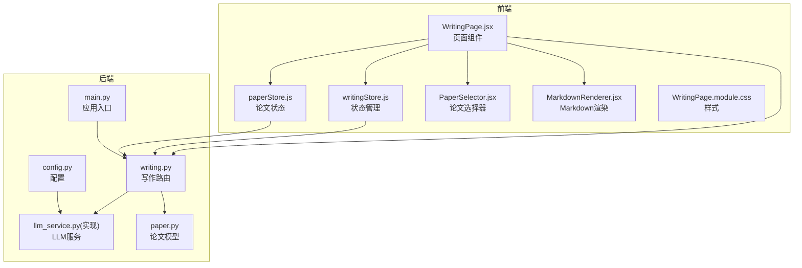
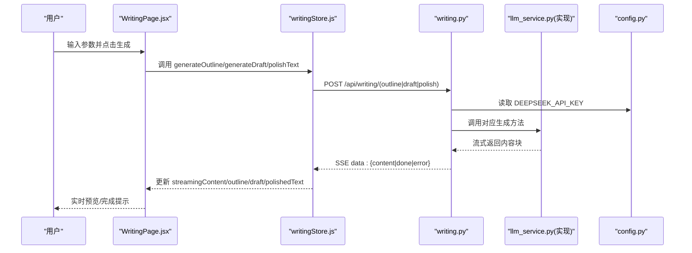
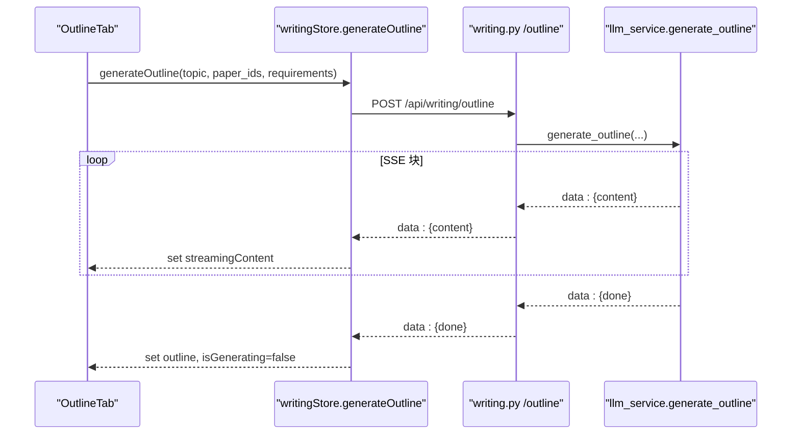
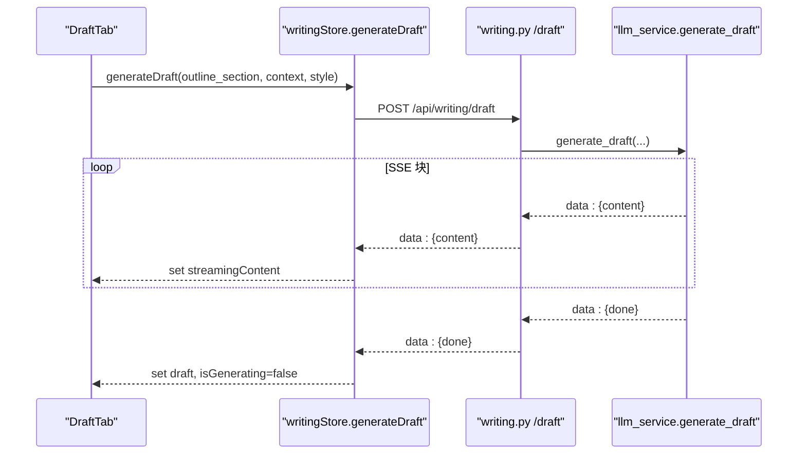
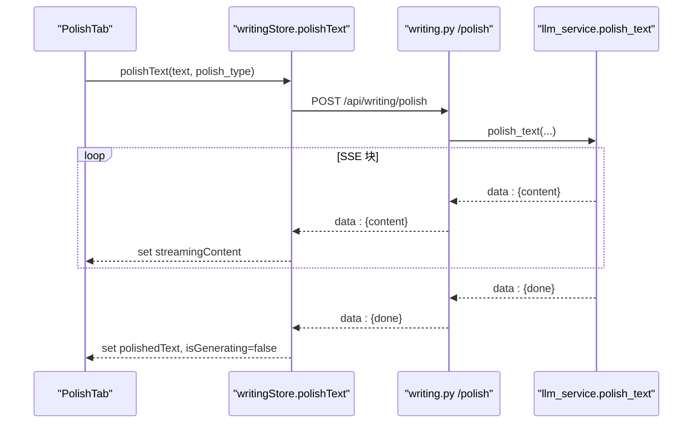
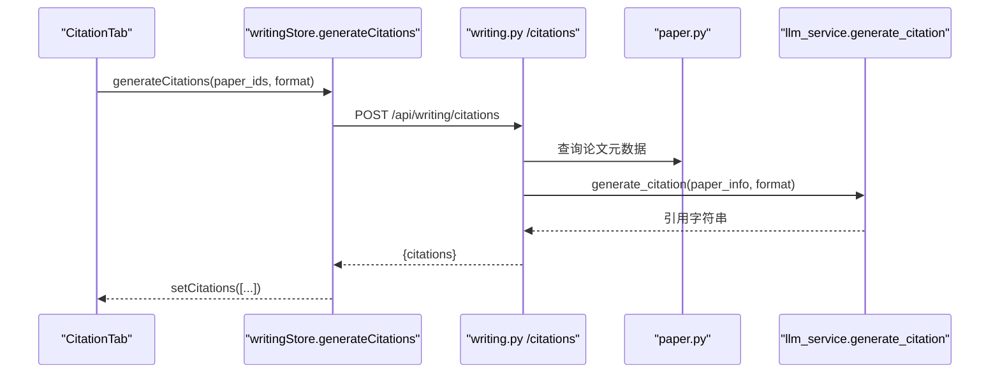
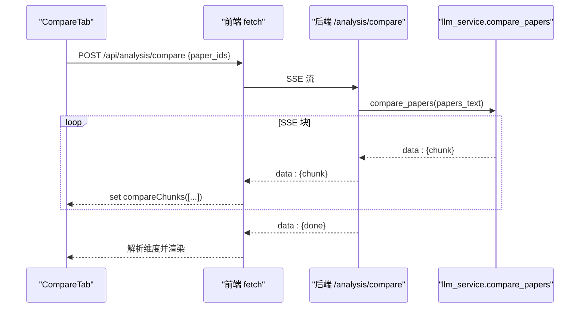
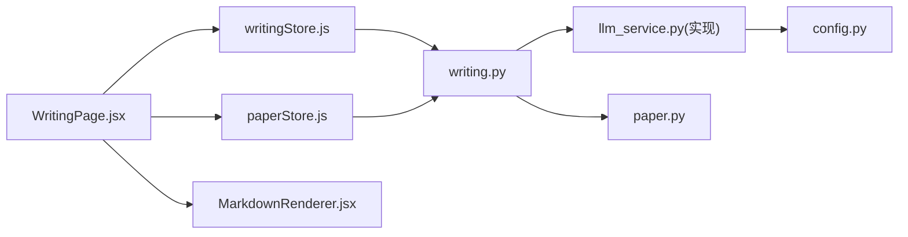

# 写作页面

<cite>
**本文档引用的文件**
- [WritingPage.jsx](file://frontend/src/pages/WritingPage.jsx)
- [writingStore.js](file://frontend/src/stores/writingStore.js)
- [writing.py](file://backend/app/routers/writing.py)
- [llm_service.py（兼容层）](file://backend/app/services/llm_service.py)
- [llm_service.py（实现）](file://backend/app/services/llm/llm_service.py)
- [paper.py](file://backend/app/models/paper.py)
- [PaperSelector.jsx](file://frontend/src/components/PaperSelector/PaperSelector.jsx)
- [paperStore.js](file://frontend/src/stores/paperStore.js)
- [MarkdownRenderer.jsx](file://frontend/src/utils/MarkdownRenderer.jsx)
- [WritingPage.module.css](file://frontend/src/pages/WritingPage.module.css)
- [config.py](file://backend/app/config.py)
- [main.py](file://backend/app/main.py)
</cite>

## 目录
1. [简介](#简介)
2. [项目结构](#项目结构)
3. [核心组件](#核心组件)
4. [架构总览](#架构总览)
5. [详细组件分析](#详细组件分析)
6. [依赖分析](#依赖分析)
7. [性能考虑](#性能考虑)
8. [故障排查指南](#故障排查指南)
9. [结论](#结论)
10. [附录](#附录)

## 简介
本文件面向“写作辅助页面组件”的技术文档，围绕论文大纲生成、段落扩写、学术润色、引用格式生成、论文对比分析等能力，系统阐述前端页面、状态管理、后端路由与服务、以及与论文选择、内容提取、AI 服务的集成方式。文档同时覆盖参数配置、内容预览与导出、编辑器集成、实时预览与格式化支持、性能优化与缓存策略、用户体验设计以及与知识库的联动与内容复用机制。

## 项目结构
写作页面位于前端 pages 目录，采用模块化组件与状态管理分离的设计：
- 页面组件：负责 UI 布局、输入输出、导出与对比分析的流式处理
- 状态管理：集中管理写作任务的流式内容、生成状态与错误
- 组件库：论文选择器、Markdown 渲染器等复用组件
- 后端路由：提供大纲、段落、润色、引用、格式列表等接口
- 服务层：封装 LLM 调用与提示词模板，统一流式输出
- 模型层：论文与文本块模型，支撑内容提取与缓存

图表来源
- [WritingPage.jsx:1-1156](file://frontend/src/pages/WritingPage.jsx#L1-L1156)
- [writingStore.js:1-275](file://frontend/src/stores/writingStore.js#L1-L275)
- [writing.py:1-287](file://backend/app/routers/writing.py#L1-L287)
- [llm_service.py（实现）:1-710](file://backend/app/services/llm/llm_service.py#L1-L710)
- [paper.py:1-85](file://backend/app/models/paper.py#L1-L85)
- [PaperSelector.jsx:1-244](file://frontend/src/components/PaperSelector/PaperSelector.jsx#L1-L244)
- [paperStore.js:1-357](file://frontend/src/stores/paperStore.js#L1-L357)
- [MarkdownRenderer.jsx:1-33](file://frontend/src/utils/MarkdownRenderer.jsx#L1-L33)
- [WritingPage.module.css:1-930](file://frontend/src/pages/WritingPage.module.css#L1-L930)
- [config.py:1-44](file://backend/app/config.py#L1-L44)
- [main.py:1-114](file://backend/app/main.py#L1-L114)

章节来源
- [WritingPage.jsx:1-1156](file://frontend/src/pages/WritingPage.jsx#L1-L1156)
- [writingStore.js:1-275](file://frontend/src/stores/writingStore.js#L1-L275)
- [writing.py:1-287](file://backend/app/routers/writing.py#L1-L287)
- [llm_service.py（实现）:1-710](file://backend/app/services/llm/llm_service.py#L1-L710)
- [paper.py:1-85](file://backend/app/models/paper.py#L1-L85)
- [PaperSelector.jsx:1-244](file://frontend/src/components/PaperSelector/PaperSelector.jsx#L1-L244)
- [paperStore.js:1-357](file://frontend/src/stores/paperStore.js#L1-L357)
- [MarkdownRenderer.jsx:1-33](file://frontend/src/utils/MarkdownRenderer.jsx#L1-L33)
- [WritingPage.module.css:1-930](file://frontend/src/pages/WritingPage.module.css#L1-L930)
- [config.py:1-44](file://backend/app/config.py#L1-L44)
- [main.py:1-114](file://backend/app/main.py#L1-L114)

## 核心组件
- 写作页面组件：提供大纲生成、段落扩写、学术润色、引用格式生成、论文对比分析五个 Tab，支持参数配置、内容预览、编辑与导出。
- 写作状态管理：集中维护生成状态、流式内容、错误信息，并封装流式调用与非流式调用。
- 论文选择器：支持论文筛选、全选/清空、最大选择数控制与确认回调。
- Markdown 渲染器：自定义组件，降级标题层级，统一段落、列表、表格、代码块等样式。
- 后端写作路由：提供大纲、段落、润色、引用生成与格式列表查询接口，统一使用 SSE 流式响应。
- LLM 服务：封装 DeepSeek 模型调用，提供大纲、段落、润色、引用生成等方法，支持流式输出与配置热更新。
- 论文模型：存储论文元数据与分析缓存字段，支撑内容提取与引用生成。

章节来源
- [WritingPage.jsx:35-414](file://frontend/src/pages/WritingPage.jsx#L35-L414)
- [writingStore.js:4-272](file://frontend/src/stores/writingStore.js#L4-L272)
- [PaperSelector.jsx:22-241](file://frontend/src/components/PaperSelector/PaperSelector.jsx#L22-L241)
- [MarkdownRenderer.jsx:23-30](file://frontend/src/utils/MarkdownRenderer.jsx#L23-L30)
- [writing.py:72-287](file://backend/app/routers/writing.py#L72-L287)
- [llm_service.py（实现）:29-710](file://backend/app/services/llm/llm_service.py#L29-L710)
- [paper.py:11-85](file://backend/app/models/paper.py#L11-L85)

## 架构总览
写作页面的端到端流程如下：
- 前端页面收集用户输入（主题、要求、论文选择、风格、润色类型等），通过状态管理发起请求。
- 状态管理封装 fetch 或 api 请求，调用后端写作路由接口。
- 后端路由根据请求体调用 LLM 服务，LLM 服务构造提示词并调用 DeepSeek 模型，按块流式返回内容。
- 前端接收 SSE 流，逐步更新状态中的流式内容，最终完成生成并允许导出或对比。

图表来源
- [WritingPage.jsx:35-414](file://frontend/src/pages/WritingPage.jsx#L35-L414)
- [writingStore.js:37-222](file://frontend/src/stores/writingStore.js#L37-L222)
- [writing.py:72-184](file://backend/app/routers/writing.py#L72-L184)
- [llm_service.py（实现）:474-598](file://backend/app/services/llm/llm_service.py#L474-L598)
- [config.py:25-26](file://backend/app/config.py#L25-L26)

## 详细组件分析

### 大纲生成（OutlineTab）
- 功能要点
  - 输入：研究主题、额外要求、可选参考论文列表
  - 流式生成：后端通过 SSE 返回增量内容，前端实时拼接并展示
  - 编辑/预览：支持切换编辑器与 Markdown 预览
  - 导出：将生成内容保存为 Markdown 文件
- 关键实现
  - 前端：收集参数，调用状态管理的 generateOutline，监听 streamingContent 并更新输出区域
  - 状态管理：封装 fetch 请求，解析 SSE，维护 isGenerating、streamingContent、outline 状态
  - 后端：路由接收 topic、paper_ids、requirements，调用 LLM 服务生成大纲，SSE 返回
  - LLM 服务：构造提示词，调用 DeepSeek，逐块返回内容

图表来源
- [WritingPage.jsx:36-184](file://frontend/src/pages/WritingPage.jsx#L36-L184)
- [writingStore.js:37-97](file://frontend/src/stores/writingStore.js#L37-L97)
- [writing.py:72-108](file://backend/app/routers/writing.py#L72-L108)
- [llm_service.py（实现）:474-517](file://backend/app/services/llm/llm_service.py#L474-L517)

章节来源
- [WritingPage.jsx:36-184](file://frontend/src/pages/WritingPage.jsx#L36-L184)
- [writingStore.js:37-97](file://frontend/src/stores/writingStore.js#L37-L97)
- [writing.py:72-108](file://backend/app/routers/writing.py#L72-L108)
- [llm_service.py（实现）:474-517](file://backend/app/services/llm/llm_service.py#L474-L517)

### 段落扩写（DraftTab）
- 功能要点
  - 输入：大纲节点、可选参考内容、写作风格（学术/正式/简洁）
  - 流式生成：同上，实时展示生成过程
  - 编辑/预览：支持切换编辑器与 Markdown 预览
- 关键实现
  - 前端：收集 outline_section、context、style，调用 generateDraft
  - 状态管理：封装 /writing/draft 接口，维护 draft 状态
  - 后端：校验风格参数，调用 LLM 服务生成段落
  - LLM 服务：根据风格映射构建提示词，流式返回

图表来源
- [WritingPage.jsx:187-298](file://frontend/src/pages/WritingPage.jsx#L187-L298)
- [writingStore.js:100-160](file://frontend/src/stores/writingStore.js#L100-L160)
- [writing.py:111-139](file://backend/app/routers/writing.py#L111-L139)
- [llm_service.py（实现）:519-560](file://backend/app/services/llm/llm_service.py#L519-L560)

章节来源
- [WritingPage.jsx:187-298](file://frontend/src/pages/WritingPage.jsx#L187-L298)
- [writingStore.js:100-160](file://frontend/src/stores/writingStore.js#L100-L160)
- [writing.py:111-139](file://backend/app/routers/writing.py#L111-L139)
- [llm_service.py（实现）:519-560](file://backend/app/services/llm/llm_service.py#L519-L560)

### 学术润色（PolishTab）
- 功能要点
  - 输入：待润色文本、润色类型（学术表达/语法修正/流畅性/精简表达）
  - 流式生成：实时展示润色过程
  - 对比视图：可切换原文与润色后内容对比
  - 预览/编辑：支持 Markdown 预览与编辑器切换
- 关键实现
  - 前端：收集 polish_type，调用 polishText，支持 showCompare 控制对比视图
  - 状态管理：封装 /writing/polish 接口，维护 polishedText
  - 后端：校验 polish_type，调用 LLM 服务执行润色
  - LLM 服务：根据类型映射构建提示词，流式返回

图表来源
- [WritingPage.jsx:301-414](file://frontend/src/pages/WritingPage.jsx#L301-L414)
- [writingStore.js:163-222](file://frontend/src/stores/writingStore.js#L163-L222)
- [writing.py:142-184](file://backend/app/routers/writing.py#L142-L184)
- [llm_service.py（实现）:562-598](file://backend/app/services/llm/llm_service.py#L562-L598)

章节来源
- [WritingPage.jsx:301-414](file://frontend/src/pages/WritingPage.jsx#L301-L414)
- [writingStore.js:163-222](file://frontend/src/stores/writingStore.js#L163-L222)
- [writing.py:142-184](file://backend/app/routers/writing.py#L142-L184)
- [llm_service.py（实现）:562-598](file://backend/app/services/llm/llm_service.py#L562-L598)

### 引用格式生成（CitationTab）
- 功能要点
  - 输入：论文列表、引用格式（APA/MLA/Chicago/GB/T 7714）
  - 非流式生成：一次性返回所有引用
  - 复制与批量复制：支持单项复制与一键复制全部
- 关键实现
  - 前端：收集 paper_ids 与 format，调用 generateCitations，渲染列表
  - 状态管理：封装 /writing/citations 接口，维护 citations 状态
  - 后端：校验 format，逐条查询论文元数据，调用 LLM 服务生成引用
  - LLM 服务：优先使用规则模板生成，不依赖 LLM；不支持的格式再走 LLM

图表来源
- [WritingPage.jsx:417-559](file://frontend/src/pages/WritingPage.jsx#L417-L559)
- [writingStore.js:225-242](file://frontend/src/stores/writingStore.js#L225-L242)
- [writing.py:187-262](file://backend/app/routers/writing.py#L187-L262)
- [paper.py:11-85](file://backend/app/models/paper.py#L11-L85)
- [llm_service.py（实现）:599-660](file://backend/app/services/llm/llm_service.py#L599-L660)

章节来源
- [WritingPage.jsx:417-559](file://frontend/src/pages/WritingPage.jsx#L417-L559)
- [writingStore.js:225-242](file://frontend/src/stores/writingStore.js#L225-L242)
- [writing.py:187-262](file://backend/app/routers/writing.py#L187-L262)
- [paper.py:11-85](file://backend/app/models/paper.py#L11-L85)
- [llm_service.py（实现）:599-660](file://backend/app/services/llm/llm_service.py#L599-L660)

### 论文对比分析（CompareTab）
- 功能要点
  - 输入：2-10 篇论文（支持搜索、标签化展示、移除）
  - 流式分析：SSE 返回维度与内容，前端解析并渲染
  - 导出：将选中论文与分析维度导出为 Markdown
- 关键实现
  - 前端：构建 /analysis/compare 请求，解析 data: 块，维护 compareChunks 与 compareDimensions
  - 后端：路由转发至分析服务，LLM 服务执行多论文对比，流式返回
  - 解析：前端按行解析 JSON 块，提取维度标题与内容

图表来源
- [WritingPage.jsx:562-802](file://frontend/src/pages/WritingPage.jsx#L562-L802)
- [writing.py:1-287](file://backend/app/routers/writing.py#L1-L287)
- [llm_service.py（实现）:429-449](file://backend/app/services/llm/llm_service.py#L429-L449)

章节来源
- [WritingPage.jsx:562-802](file://frontend/src/pages/WritingPage.jsx#L562-L802)
- [writing.py:1-287](file://backend/app/routers/writing.py#L1-L287)
- [llm_service.py（实现）:429-449](file://backend/app/services/llm/llm_service.py#L429-L449)

### 论文选择器（PaperSelector）
- 功能要点
  - 支持搜索标题/作者、全选/清空、最大选择数限制
  - 与写作页面联动，传递选中论文 ID
- 关键实现
  - 前端：usePaperStore 获取论文列表，过滤与切换选中状态
  - 与写作页面：通过 onConfirm 回调返回选中 ID 列表

章节来源
- [PaperSelector.jsx:22-241](file://frontend/src/components/PaperSelector/PaperSelector.jsx#L22-L241)
- [paperStore.js:22-47](file://frontend/src/stores/paperStore.js#L22-L47)

### Markdown 渲染与编辑器集成
- Markdown 渲染器：统一标题降级、段落、列表、表格、代码块样式，适配卡片内展示
- 编辑器：Textarea 支持实时编辑与预览切换
- 实时预览：SSE 流式内容通过 ReactMarkdown 渲染，支持对比视图

章节来源
- [MarkdownRenderer.jsx:23-30](file://frontend/src/utils/MarkdownRenderer.jsx#L23-L30)
- [WritingPage.jsx:171-179](file://frontend/src/pages/WritingPage.jsx#L171-L179)
- [WritingPage.jsx:286-294](file://frontend/src/pages/WritingPage.jsx#L286-L294)
- [WritingPage.jsx:402-410](file://frontend/src/pages/WritingPage.jsx#L402-L410)

## 依赖分析
- 前端依赖
  - 写作页面依赖状态管理与论文状态，论文选择器依赖论文状态
  - Markdown 渲染器独立，被各 Tab 的输出区域复用
- 后端依赖
  - 写作路由依赖认证中间件、数据库会话、LLM 服务
  - LLM 服务依赖配置（API Key、Base URL）、提示词模板
  - 论文模型提供论文元数据与分析缓存字段

图表来源
- [WritingPage.jsx:1-1156](file://frontend/src/pages/WritingPage.jsx#L1-L1156)
- [writingStore.js:1-275](file://frontend/src/stores/writingStore.js#L1-L275)
- [writing.py:1-287](file://backend/app/routers/writing.py#L1-L287)
- [llm_service.py（实现）:1-710](file://backend/app/services/llm/llm_service.py#L1-L710)
- [paper.py:1-85](file://backend/app/models/paper.py#L1-L85)
- [config.py:1-44](file://backend/app/config.py#L1-L44)

章节来源
- [WritingPage.jsx:1-1156](file://frontend/src/pages/WritingPage.jsx#L1-L1156)
- [writingStore.js:1-275](file://frontend/src/stores/writingStore.js#L1-L275)
- [writing.py:1-287](file://backend/app/routers/writing.py#L1-L287)
- [llm_service.py（实现）:1-710](file://backend/app/services/llm/llm_service.py#L1-L710)
- [paper.py:1-85](file://backend/app/models/paper.py#L1-L85)
- [config.py:1-44](file://backend/app/config.py#L1-L44)

## 性能考虑
- 流式传输
  - 后端使用 SSE，前端按块解析，降低首屏等待时间
  - 前端仅追加增量内容，避免重复渲染整段内容
- LLM 配置热更新
  - LLM 服务支持运行时更新模型、温度、最大 token、API Key 与 Base URL，失败时保留原实例
- 缓存策略
  - 论文模型包含分析缓存字段（章节概述、深度分析、状态与时间戳），可用于减少重复分析
- 前端优化
  - Markdown 渲染器使用 memo 包裹，减少不必要的重渲染
  - 对话/对比分析使用 AbortController 与清理函数，避免内存泄漏

章节来源
- [llm_service.py（实现）:70-128](file://backend/app/services/llm/llm_service.py#L70-L128)
- [paper.py:30-36](file://backend/app/models/paper.py#L30-L36)
- [MarkdownRenderer.jsx:23-30](file://frontend/src/utils/MarkdownRenderer.jsx#L23-L30)
- [WritingPage.jsx:578-585](file://frontend/src/pages/WritingPage.jsx#L578-L585)

## 故障排查指南
- 生成失败
  - 检查后端健康状态与 API Key 配置
  - 查看前端状态管理中的 error 字段与后端返回的 detail
- SSE 解析失败
  - 前端解析逻辑会忽略解析失败的行，若长时间无数据，检查后端是否返回 done 或 error
- 引用生成异常
  - 校验格式参数是否在支持列表内；逐条检查论文是否存在与可访问
- 性能问题
  - 减少一次性传入的上下文长度；适当调整 LLM 温度与最大 token
  - 利用论文模型的分析缓存字段，避免重复计算

章节来源
- [writingStore.js:93-96](file://frontend/src/stores/writingStore.js#L93-L96)
- [writing.py:155-161](file://backend/app/routers/writing.py#L155-L161)
- [WritingPage.jsx:671-674](file://frontend/src/pages/WritingPage.jsx#L671-L674)
- [config.py:25-26](file://backend/app/config.py#L25-L26)

## 结论
写作页面通过清晰的组件划分与状态管理，实现了从论文选择、内容提取到 AI 服务调用的完整闭环。前后端均采用流式传输与增量渲染，显著提升了用户体验。结合论文模型的分析缓存与 LLM 配置热更新，系统具备良好的可扩展性与稳定性。未来可在提示词模板本地化、引用格式规则完善、知识库联动等方面进一步增强。

## 附录
- 参数配置
  - API Key：通过配置文件读取，支持运行时更新但需注意脱敏值跳过更新
  - CORS：允许本地开发源访问
- 用户体验设计
  - 响应式布局，适配不同屏幕尺寸
  - 标签化论文选择、对比视图、一键复制引用
- 与知识库联动
  - 论文模型包含分析缓存字段，可作为知识库的轻量缓存；后续可扩展为完整的知识卡片与复用机制

章节来源
- [config.py:25-38](file://backend/app/config.py#L25-L38)
- [WritingPage.module.css:554-596](file://frontend/src/pages/WritingPage.module.css#L554-L596)
- [paper.py:30-36](file://backend/app/models/paper.py#L30-L36)