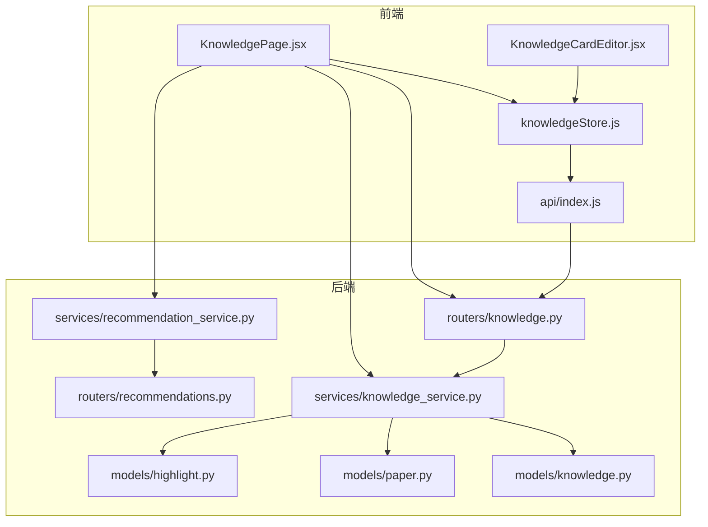
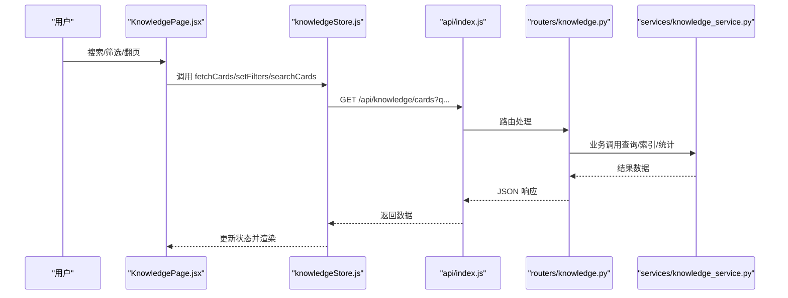
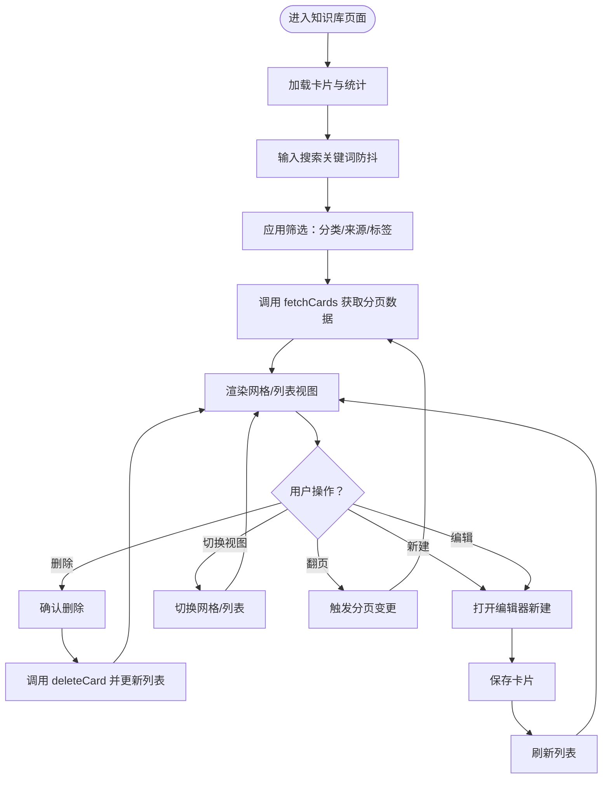
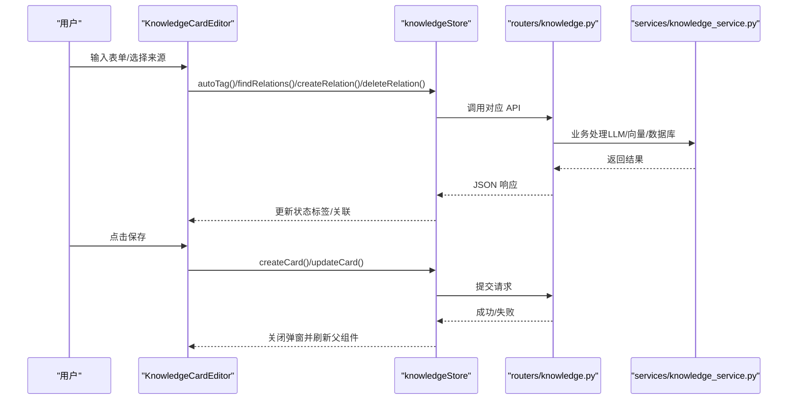
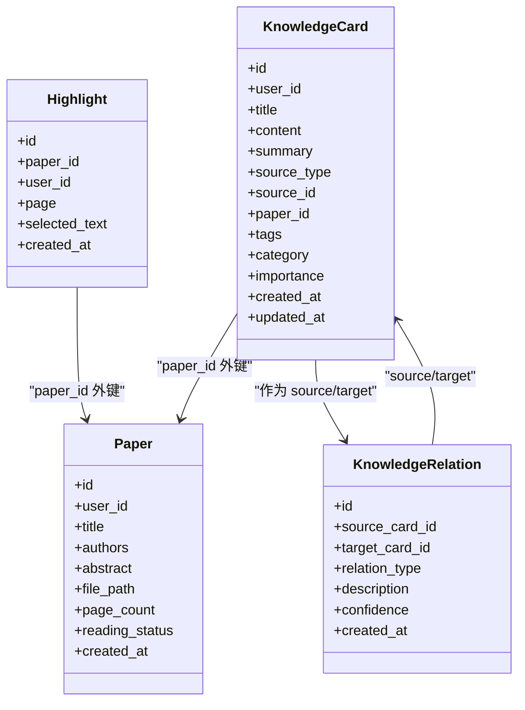
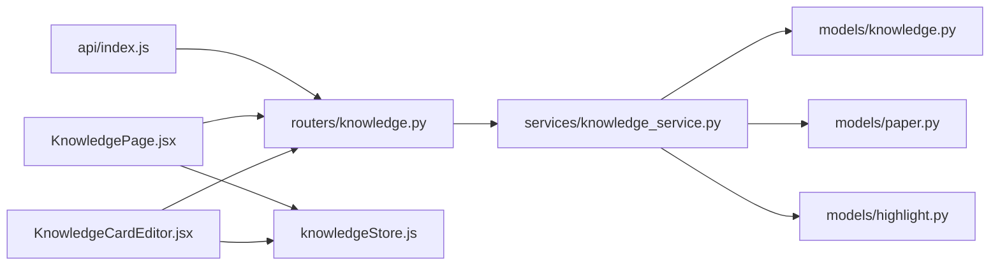

# 知识库页面

<cite>
**本文引用的文件**
- [KnowledgePage.jsx](file://frontend/src/pages/KnowledgePage.jsx)
- [KnowledgeCardEditor.jsx](file://frontend/src/components/KnowledgeCardEditor/KnowledgeCardEditor.jsx)
- [knowledgeStore.js](file://frontend/src/stores/knowledgeStore.js)
- [knowledge.py](file://backend/app/models/knowledge.py)
- [knowledge_service.py](file://backend/app/services/knowledge_service.py)
- [knowledge.py（后端路由）](file://backend/app/routers/knowledge.py)
- [paper.py](file://backend/app/models/paper.py)
- [highlight.py](file://backend/app/models/highlight.py)
- [recommendations.py](file://backend/app/routers/recommendations.py)
- [recommendation_service.py](file://backend/app/services/recommendation_service.py)
- [Recommendations.jsx](file://frontend/src/components/Recommendations/Recommendations.jsx)
- [index.js（前端API）](file://frontend/src/api/index.js)
</cite>

## 目录
1. [简介](#简介)
2. [项目结构](#项目结构)
3. [核心组件](#核心组件)
4. [架构总览](#架构总览)
5. [详细组件分析](#详细组件分析)
6. [依赖关系分析](#依赖关系分析)
7. [性能考虑](#性能考虑)
8. [故障排查指南](#故障排查指南)
9. [结论](#结论)
10. [附录](#附录)

## 简介
本技术文档围绕“知识库页面”组件，系统阐述其设计思路、功能架构与实现细节。重点覆盖：
- 知识卡片的展示逻辑与网格/列表双视图
- 分类管理、标签系统与来源类型
- 搜索过滤机制与分页
- 创建、编辑、删除与自动关联发现
- 与论文阅读功能的关联（从高亮/问答提取知识点）
- 数据持久化、向量索引与检索
- 与推荐系统的集成与个性化展示

## 项目结构
知识库页面位于前端 pages 层，通过 zustand 状态管理连接后端 API；后端提供知识库 CRUD、搜索、统计、图谱与自动标签/关联能力，并与论文、高亮模型耦合。

图表来源
- [KnowledgePage.jsx:33-344](file://frontend/src/pages/KnowledgePage.jsx#L33-L344)
- [KnowledgeCardEditor.jsx:23-492](file://frontend/src/components/KnowledgeCardEditor/KnowledgeCardEditor.jsx#L23-L492)
- [knowledgeStore.js:4-422](file://frontend/src/stores/knowledgeStore.js#L4-L422)
- [knowledge.py（后端路由）:19-550](file://backend/app/routers/knowledge.py#L19-L550)
- [knowledge_service.py:79-662](file://backend/app/services/knowledge_service.py#L79-L662)
- [knowledge.py:14-80](file://backend/app/models/knowledge.py#L14-L80)
- [recommendations.py:15-234](file://backend/app/routers/recommendations.py#L15-L234)
- [recommendation_service.py:20-565](file://backend/app/services/recommendation_service.py#L20-L565)
- [paper.py:11-85](file://backend/app/models/paper.py#L11-L85)
- [highlight.py:10-37](file://backend/app/models/highlight.py#L10-L37)

章节来源
- [KnowledgePage.jsx:33-344](file://frontend/src/pages/KnowledgePage.jsx#L33-L344)
- [knowledgeStore.js:4-422](file://frontend/src/stores/knowledgeStore.js#L4-L422)
- [knowledge.py（后端路由）:19-550](file://backend/app/routers/knowledge.py#L19-L550)

## 核心组件
- 知识库页面（KnowledgePage）：负责卡片列表渲染、搜索过滤、分页、统计侧边栏与创建/编辑入口。
- 知识卡片编辑器（KnowledgeCardEditor）：支持手动/高亮/问答/分析四种来源创建，标签自动生成，关联发现与管理。
- 状态管理（knowledgeStore）：封装知识卡列表、详情、搜索、统计、图谱、关联、自动标签等 API 调用与本地状态。
- 后端服务（KnowledgeService）：实现从高亮/问答提取、自动标签、关联发现、全文检索、向量索引、统计与图谱数据聚合。
- 论文与高亮模型：支撑“从高亮提取”的来源类型与论文关联。

章节来源
- [KnowledgePage.jsx:33-344](file://frontend/src/pages/KnowledgePage.jsx#L33-L344)
- [KnowledgeCardEditor.jsx:23-492](file://frontend/src/components/KnowledgeCardEditor/KnowledgeCardEditor.jsx#L23-L492)
- [knowledgeStore.js:4-422](file://frontend/src/stores/knowledgeStore.js#L4-L422)
- [knowledge_service.py:79-662](file://backend/app/services/knowledge_service.py#L79-L662)
- [knowledge.py:14-80](file://backend/app/models/knowledge.py#L14-L80)
- [paper.py:11-85](file://backend/app/models/paper.py#L11-L85)
- [highlight.py:10-37](file://backend/app/models/highlight.py#L10-L37)

## 架构总览
知识库页面采用“前端状态 + 后端服务”的分层架构：
- 前端通过 axios 实例统一访问 /api 前缀接口
- 知识库路由提供 CRUD、搜索、统计、图谱、自动标签、关联管理等接口
- 知识服务封装 LLM 提示词与向量检索，实现“从高亮/问答提取”“自动标签”“关联发现”“全文检索”
- 论文与高亮模型为“来源类型”提供数据基础

图表来源
- [KnowledgePage.jsx:57-124](file://frontend/src/pages/KnowledgePage.jsx#L57-L124)
- [knowledgeStore.js:41-74](file://frontend/src/stores/knowledgeStore.js#L41-L74)
- [knowledge.py（后端路由）:130-192](file://backend/app/routers/knowledge.py#L130-L192)
- [knowledge_service.py:350-465](file://backend/app/services/knowledge_service.py#L350-L465)
- [index.js（前端API）:1-12](file://frontend/src/api/index.js#L1-L12)

## 详细组件分析

### 知识库页面（KnowledgePage）
- 视图与交互
  - 支持网格/列表两种视图切换
  - 顶部统计卡片展示总数、关联数
  - 侧边栏统计：分类分布、来源分布、标签云
  - 搜索防抖（300ms），支持关键词、分类、来源类型、标签筛选
  - 分页控制与清空筛选
- 卡片渲染
  - 列表视图：标题、摘要、标签、创建时间
  - 网格视图：标题、内容摘要、展开/收起、标签、来源徽章、操作按钮
- 编辑器弹窗
  - 打开/关闭、新建/编辑模式区分
  - 与知识卡片编辑器组件解耦

图表来源
- [KnowledgePage.jsx:57-124](file://frontend/src/pages/KnowledgePage.jsx#L57-L124)
- [KnowledgePage.jsx:209-262](file://frontend/src/pages/KnowledgePage.jsx#L209-L262)
- [KnowledgePage.jsx:346-428](file://frontend/src/pages/KnowledgePage.jsx#L346-L428)

章节来源
- [KnowledgePage.jsx:33-344](file://frontend/src/pages/KnowledgePage.jsx#L33-L344)

### 知识卡片编辑器（KnowledgeCardEditor）
- 表单字段：标题、内容、摘要、标签、分类、来源类型、论文关联、重要性
- 标签管理：输入框+回车添加、删除、AI 自动生成（支持现有卡片与新建预览）
- 关联管理：发现关联（LLM 分析）、添加/删除关联、双向显示
- 保存与关闭：校验必填项，提交后关闭弹窗
- 来源类型：手动、高亮、问答、分析；其中“高亮/问答”受论文关联约束

图表来源
- [KnowledgeCardEditor.jsx:120-152](file://frontend/src/components/KnowledgeCardEditor/KnowledgeCardEditor.jsx#L120-L152)
- [KnowledgeCardEditor.jsx:154-196](file://frontend/src/components/KnowledgeCardEditor/KnowledgeCardEditor.jsx#L154-L196)
- [KnowledgeCardEditor.jsx:198-220](file://frontend/src/components/KnowledgeCardEditor/KnowledgeCardEditor.jsx#L198-L220)
- [knowledgeStore.js:364-422](file://frontend/src/stores/knowledgeStore.js#L364-L422)
- [knowledge.py（后端路由）:311-343](file://backend/app/routers/knowledge.py#L311-L343)
- [knowledge_service.py:233-258](file://backend/app/services/knowledge_service.py#L233-L258)

章节来源
- [KnowledgeCardEditor.jsx:23-492](file://frontend/src/components/KnowledgeCardEditor/KnowledgeCardEditor.jsx#L23-L492)
- [knowledgeStore.js:364-422](file://frontend/src/stores/knowledgeStore.js#L364-L422)

### 状态管理（knowledgeStore）
- 状态域：cards、totalCount、currentCard、searchResults、graphData、stats、loading、error、filters、currentPage、pageSize
- 关键动作：
  - 列表：fetchCards（带分页与筛选参数）
  - 单卡：fetchCard、createCard、updateCard、deleteCard
  - 来源创建：createFromHighlight、createFromChat
  - 搜索：searchCards（Top-K）
  - 图谱：fetchGraphData
  - 统计：fetchStats
  - 关联：findRelations、fetchCardRelations、createRelation、deleteRelation
  - 自动标签：autoTag
  - 重置：reset

章节来源
- [knowledgeStore.js:4-422](file://frontend/src/stores/knowledgeStore.js#L4-L422)

### 后端服务与路由（KnowledgeService / routers/knowledge.py）
- 路由能力
  - 列表：GET /knowledge/cards（分页、关键词、分类、来源、标签）
  - 单卡：GET/PUT/DELETE /knowledge/cards/{id}
  - 创建：POST /knowledge/cards
  - 来源创建：POST /knowledge/cards/from-highlight/{id}、POST /knowledge/cards/from-chat
  - 搜索：GET /knowledge/search（向量+关键词融合）
  - 关联：GET /knowledge/cards/{id}/relations、POST /knowledge/relations、DELETE /knowledge/relations/{id}
  - 图谱：GET /knowledge/graph
  - 统计：GET /knowledge/stats
  - 自动标签：POST /knowledge/cards/{id}/auto-tag
- 服务实现要点
  - 从高亮/问答提取：LLM 提示词解析 JSON，失败回退；自动生成标签
  - 关联发现：构建现有卡片摘要列表，LLM 输出候选关联
  - 检索：ChromaDB 向量检索 + 数据库关键词检索融合，按分数排序
  - 索引：创建/删除卡片时维护向量集合
  - 统计：分类、来源、标签云聚合

图表来源
- [knowledge.py:14-80](file://backend/app/models/knowledge.py#L14-L80)
- [paper.py:11-85](file://backend/app/models/paper.py#L11-L85)
- [highlight.py:10-37](file://backend/app/models/highlight.py#L10-L37)

章节来源
- [knowledge.py（后端路由）:130-546](file://backend/app/routers/knowledge.py#L130-L546)
- [knowledge_service.py:79-662](file://backend/app/services/knowledge_service.py#L79-L662)

### 搜索与过滤机制
- 前端
  - 搜索防抖：300ms，触发 searchCards
  - 筛选：分类、来源类型、标签、关键词，组合为 URL 查询参数
- 后端
  - 列表查询：关键词在标题/内容/标签上模糊匹配；分类/来源/标签精确过滤
  - 全局搜索：向量检索 + 关键词检索融合，返回 Top-K，按分数排序

章节来源
- [KnowledgePage.jsx:63-71](file://frontend/src/pages/KnowledgePage.jsx#L63-L71)
- [knowledgeStore.js:226-249](file://frontend/src/stores/knowledgeStore.js#L226-L249)
- [knowledge.py（后端路由）:130-192](file://backend/app/routers/knowledge.py#L130-L192)
- [knowledge_service.py:350-465](file://backend/app/services/knowledge_service.py#L350-L465)

### 创建、编辑、删除与排序
- 创建
  - 手动：POST /knowledge/cards
  - 高亮：POST /knowledge/cards/from-highlight/{id}
  - 问答：POST /knowledge/cards/from-chat
- 编辑：PUT /knowledge/cards/{id}
- 删除：DELETE /knowledge/cards/{id}
- 排序：按创建时间倒序（后端）

章节来源
- [knowledge.py（后端路由）:194-308](file://backend/app/routers/knowledge.py#L194-L308)
- [knowledge.py（后端路由）:311-343](file://backend/app/routers/knowledge.py#L311-L343)

### 标签系统与分类管理
- 标签
  - 手动输入与 AI 自动生成
  - 自动标签：LLM 提示词生成，最多 5 个
- 分类
  - 单字段字符串，支持统计与筛选
- 标签云
  - 后端聚合所有卡片标签，前端渲染权重化标签云

章节来源
- [KnowledgeCardEditor.jsx:120-152](file://frontend/src/components/KnowledgeCardEditor/KnowledgeCardEditor.jsx#L120-L152)
- [knowledgeStore.js:364-393](file://frontend/src/stores/knowledgeStore.js#L364-L393)
- [knowledge_service.py:233-258](file://backend/app/services/knowledge_service.py#L233-L258)
- [knowledge.py（后端路由）:519-546](file://backend/app/routers/knowledge.py#L519-L546)

### 关联管理与知识图谱
- 关联类型：related、prerequisite、extends、supports、contradicts
- 关联发现：LLM 分析新卡片与现有卡片摘要，返回候选
- 图谱数据：节点为卡片，边为关联，包含置信度与描述

章节来源
- [KnowledgeCardEditor.jsx:154-196](file://frontend/src/components/KnowledgeCardEditor/KnowledgeCardEditor.jsx#L154-L196)
- [knowledge.py（后端路由）:359-496](file://backend/app/routers/knowledge.py#L359-L496)
- [knowledge_service.py:259-349](file://backend/app/services/knowledge_service.py#L259-L349)
- [knowledge_service.py:526-593](file://backend/app/services/knowledge_service.py#L526-L593)

### 与论文阅读的关联
- 来源类型
  - highlight：来自高亮，需关联论文与高亮记录
  - chat：来自问答，可选关联论文
  - manual/analysis：手动或分析提取
- 高亮提取
  - 从 Highlight.selected_text 生成标题/内容/摘要，自动标签，写入 KnowledgeCard 并建立向量索引

章节来源
- [KnowledgePage.jsx:8-13](file://frontend/src/pages/KnowledgePage.jsx#L8-L13)
- [knowledge.py（后端路由）:311-343](file://backend/app/routers/knowledge.py#L311-L343)
- [knowledge_service.py:82-162](file://backend/app/services/knowledge_service.py#L82-L162)
- [highlight.py:10-37](file://backend/app/models/highlight.py#L10-L37)
- [paper.py:11-85](file://backend/app/models/paper.py#L11-L85)

### 与推荐系统的集成
- 论文推荐
  - 相似论文：基于论文嵌入余弦相似度
  - 个性化推荐：基于用户画像（研究兴趣、偏好、术语使用、背景）与论文嵌入综合评分
- 网络学术推荐：基于 arXiv/Google Scholar 等站点搜索
- 知识库与推荐的结合
  - 知识库卡片可作为论文阅读的补充与延伸，推荐系统可辅助发现相关论文，进而引导用户从高亮/问答中提取知识点

章节来源
- [recommendations.py:18-234](file://backend/app/routers/recommendations.py#L18-L234)
- [recommendation_service.py:150-561](file://backend/app/services/recommendation_service.py#L150-L561)
- [Recommendations.jsx:1-265](file://frontend/src/components/Recommendations/Recommendations.jsx#L1-L265)

## 依赖关系分析
- 前端依赖
  - axios 实例统一访问 /api
  - zustand 管理知识库状态
  - 组件间通过 props 与状态共享协作
- 后端依赖
  - FastAPI 路由 + SQLAlchemy 模型 + 知识服务
  - ChromaDB 向量索引 + LLM 提示词
  - 论文/高亮模型为来源类型提供数据

图表来源
- [index.js（前端API）:1-12](file://frontend/src/api/index.js#L1-L12)
- [knowledge.py（后端路由）:19-550](file://backend/app/routers/knowledge.py#L19-L550)
- [knowledge_service.py:79-662](file://backend/app/services/knowledge_service.py#L79-L662)
- [knowledge.py:14-80](file://backend/app/models/knowledge.py#L14-L80)
- [paper.py:11-85](file://backend/app/models/paper.py#L11-L85)
- [highlight.py:10-37](file://backend/app/models/highlight.py#L10-L37)
- [KnowledgePage.jsx:33-344](file://frontend/src/pages/KnowledgePage.jsx#L33-L344)
- [KnowledgeCardEditor.jsx:23-492](file://frontend/src/components/KnowledgeCardEditor/KnowledgeCardEditor.jsx#L23-L492)

章节来源
- [index.js（前端API）:1-12](file://frontend/src/api/index.js#L1-L12)
- [knowledge.py（后端路由）:19-550](file://backend/app/routers/knowledge.py#L19-L550)

## 性能考虑
- 搜索性能
  - 向量检索 + 关键词检索融合，减少漏检与提升速度
  - ChromaDB 针对用户维度建立 collection，避免跨用户扫描
- 索引与缓存
  - 创建/更新卡片后即时向量化索引
  - 删除卡片时清理向量索引
- 前端优化
  - 搜索防抖（300ms）
  - 分页加载，避免一次性渲染大量卡片
- LLM 调用
  - 关联发现与标签生成按需触发，避免频繁调用
- 推荐系统
  - 嵌入向量缓存，刷新论文推荐时可选择禁用缓存重新计算

章节来源
- [knowledge_service.py:374-465](file://backend/app/services/knowledge_service.py#L374-L465)
- [knowledge_service.py:466-525](file://backend/app/services/knowledge_service.py#L466-L525)
- [KnowledgePage.jsx:63-71](file://frontend/src/pages/KnowledgePage.jsx#L63-L71)
- [recommendation_service.py:89-129](file://backend/app/services/recommendation_service.py#L89-L129)

## 故障排查指南
- 常见错误与定位
  - 列表加载失败：检查 /api/knowledge/cards 请求与后端异常
  - 搜索无结果：确认关键词长度、是否命中标签/标题/内容
  - 删除失败：确认权限与卡片是否存在
  - 自动标签/关联失败：检查 LLM 提示词解析与网络连通性
- 前端调试
  - 查看 knowledgeStore 中 error 字段
  - 在浏览器网络面板观察 /api 请求状态
- 后端调试
  - 检查知识服务日志与异常捕获
  - 确认 ChromaDB collection 是否存在与可写

章节来源
- [knowledgeStore.js:67-73](file://frontend/src/stores/knowledgeStore.js#L67-L73)
- [knowledgeStore.js:109-115](file://frontend/src/stores/knowledgeStore.js#L109-L115)
- [knowledgeStore.js:226-249](file://frontend/src/stores/knowledgeStore.js#L226-L249)
- [knowledge_service.py:131-138](file://backend/app/services/knowledge_service.py#L131-L138)
- [knowledge_service.py:346-348](file://backend/app/services/knowledge_service.py#L346-L348)

## 结论
知识库页面通过清晰的前后端分层与完善的 API 能力，实现了从“高亮/问答提取”到“标签/关联/图谱”的全链路知识管理。配合论文阅读与推荐系统，形成“阅读—提取—组织—发现”的闭环体验。建议持续优化 LLM 调用成本与向量检索稳定性，进一步完善批量操作与导入导出能力。

## 附录
- API 一览（部分）
  - GET /api/knowledge/cards
  - POST /api/knowledge/cards
  - GET/PUT/DELETE /api/knowledge/cards/{id}
  - POST /api/knowledge/cards/from-highlight/{id}
  - POST /api/knowledge/cards/from-chat
  - GET /api/knowledge/search
  - GET/POST/DELETE /api/knowledge/relations
  - GET /api/knowledge/graph
  - GET /api/knowledge/stats
  - POST /api/knowledge/cards/{id}/auto-tag
- 前端模块
  - KnowledgePage.jsx：页面容器与交互
  - KnowledgeCardEditor.jsx：卡片编辑与来源创建
  - knowledgeStore.js：状态与 API 调用封装
  - api/index.js：axios 实例