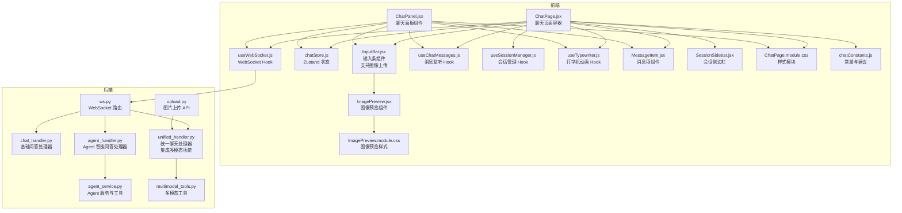
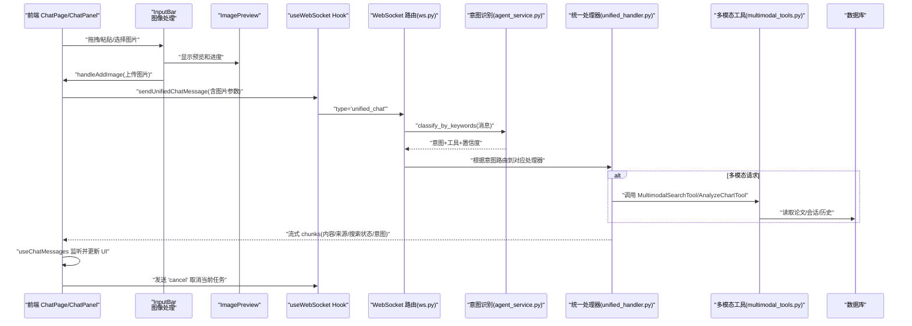
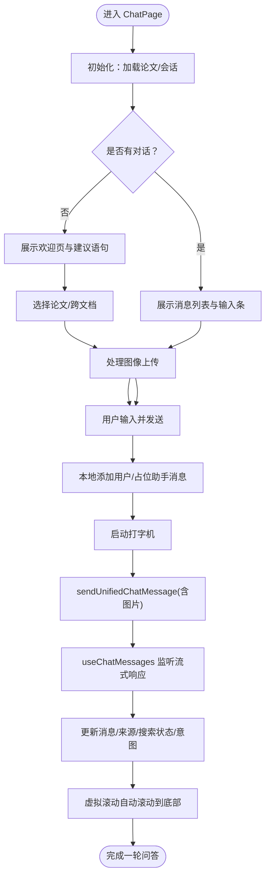
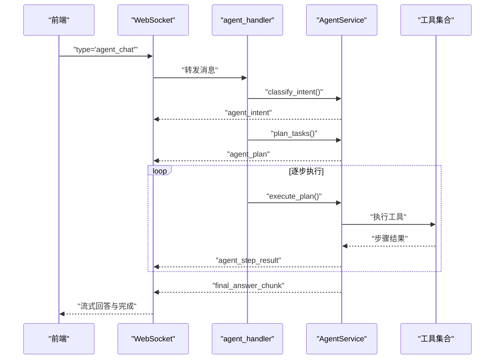
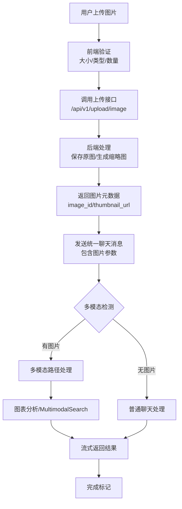
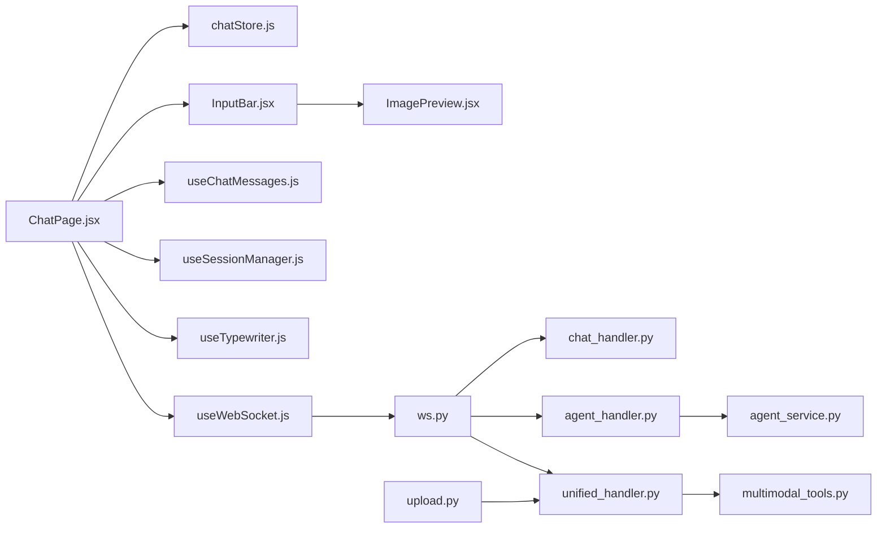

# 聊天页面

<cite>
**本文引用的文件**
- [ChatPage.jsx](file://frontend/src/pages/ChatPage.jsx)
- [ChatPanel.jsx](file://frontend/src/components/ChatPanel/ChatPanel.jsx)
- [ImagePreview.jsx](file://frontend/src/components/ChatPage/ImagePreview.jsx)
- [ImagePreview.module.css](file://frontend/src/components/ChatPage/ImagePreview.module.css)
- [InputBar.jsx](file://frontend/src/components/ChatPage/InputBar.jsx)
- [chatStore.js](file://frontend/src/stores/chatStore.js)
- [useWebSocket.js](file://frontend/src/hooks/useWebSocket.js)
- [useChatMessages.js](file://frontend/src/hooks/useChatMessages.js)
- [useSessionManager.js](file://frontend/src/hooks/useSessionManager.js)
- [useTypewriter.js](file://frontend/src/hooks/useTypewriter.js)
- [MessageItem.jsx](file://frontend/src/components/ChatPage/MessageItem.jsx)
- [SessionSidebar.jsx](file://frontend/src/components/ChatPage/SessionSidebar.jsx)
- [ChatPage.module.css](file://frontend/src/pages/ChatPage.module.css)
- [chatConstants.js](file://frontend/src/utils/chatConstants.js)
- [upload.py](file://backend/app/routers/upload.py)
- [multimodal_tools.py](file://backend/app/tools/multimodal_tools.py)
- [unified_handler.py](file://backend/app/handlers/unified_handler.py)
- [ws.py](file://backend/app/routers/ws.py)
- [chat_handler.py](file://backend/app/handlers/chat_handler.py)
- [agent_handler.py](file://backend/app/handlers/agent_handler.py)
- [agent_service.py](file://backend/app/services/agent_service.py)
</cite>

## 更新摘要
**变更内容**
- 新增图像预览组件（ImagePreview）及其样式系统
- 增强输入条组件（InputBar）支持图像拖拽上传、剪贴板粘贴功能
- 实现完整的图像上传流程，包括进度显示、错误处理和重试机制
- 后端新增图片上传 API，支持多格式图片处理和压缩
- 统一聊天处理器集成多模态分析功能，支持图表分析和图片搜索

## 目录
1. [简介](#简介)
2. [项目结构](#项目结构)
3. [核心组件](#核心组件)
4. [架构总览](#架构总览)
5. [详细组件分析](#详细组件分析)
6. [图像处理功能](#图像处理功能)
7. [依赖关系分析](#依赖关系分析)
8. [性能考虑](#性能考虑)
9. [故障排查指南](#故障排查指南)
10. [结论](#结论)
11. [附录](#附录)

## 简介
本文件为统一聊天界面（聊天页面）的全面技术文档，围绕"统一聊天"能力展开，涵盖设计理念、实时通信架构、消息流与状态同步、组件集成方式、消息历史与输入处理、与 Agent 智能体系统的集成模式（意图识别与任务执行）、响应式设计与样式定制、用户体验优化策略，以及错误处理、网络异常恢复与性能监控方案。

**更新** 新增图像处理功能，包括图像预览、拖拽上传、剪贴板粘贴等增强功能，支持多模态聊天体验。

## 项目结构
聊天页面位于前端工程的页面层与组件层，配合全局状态管理与 WebSocket 通信，后端通过统一 WebSocket 路由进行消息分发与处理，并集成 Agent 智能体系统实现意图识别与多步任务执行。新增图像处理相关组件和后端上传接口。



**图表来源**
- [ChatPage.jsx:23-433](file://frontend/src/pages/ChatPage.jsx#L23-L433)
- [ChatPanel.jsx:120-644](file://frontend/src/components/ChatPanel/ChatPanel.jsx#L120-L644)
- [ImagePreview.jsx:1-61](file://frontend/src/components/ChatPage/ImagePreview.jsx#L1-L61)
- [InputBar.jsx:1-163](file://frontend/src/components/ChatPage/InputBar.jsx#L1-L163)
- [chatStore.js:1-417](file://frontend/src/stores/chatStore.js#L1-L417)
- [useWebSocket.js:1-180](file://frontend/src/hooks/useWebSocket.js#L1-L180)
- [useChatMessages.js:1-103](file://frontend/src/hooks/useChatMessages.js#L1-L103)
- [useSessionManager.js:1-111](file://frontend/src/hooks/useSessionManager.js#L1-L111)
- [useTypewriter.js:1-117](file://frontend/src/hooks/useTypewriter.js#L1-L117)
- [MessageItem.jsx:1-36](file://frontend/src/components/ChatPage/MessageItem.jsx#L1-L36)
- [SessionSidebar.jsx:1-74](file://frontend/src/components/ChatPage/SessionSidebar.jsx#L1-L74)
- [ChatPage.module.css:1-933](file://frontend/src/pages/ChatPage.module.css#L1-L933)
- [chatConstants.js:1-23](file://frontend/src/utils/chatConstants.js#L1-L23)
- [ImagePreview.module.css:1-129](file://frontend/src/components/ChatPage/ImagePreview.module.css#L1-L129)
- [ws.py:76-436](file://backend/app/routers/ws.py#L76-L436)
- [chat_handler.py:11-32](file://backend/app/handlers/chat_handler.py#L11-L32)
- [agent_handler.py:11-67](file://backend/app/handlers/agent_handler.py#L11-L67)
- [agent_service.py:401-435](file://backend/app/services/agent_service.py#L401-L435)
- [upload.py:1-87](file://backend/app/routers/upload.py#L1-L87)
- [multimodal_tools.py:1-324](file://backend/app/tools/multimodal_tools.py#L1-L324)
- [unified_handler.py:249-418](file://backend/app/handlers/unified_handler.py#L249-L418)

**章节来源**
- [ChatPage.jsx:23-433](file://frontend/src/pages/ChatPage.jsx#L23-L433)
- [ChatPanel.jsx:120-644](file://frontend/src/components/ChatPanel/ChatPanel.jsx#L120-L644)
- [ImagePreview.jsx:1-61](file://frontend/src/components/ChatPage/ImagePreview.jsx#L1-L61)
- [InputBar.jsx:1-163](file://frontend/src/components/ChatPage/InputBar.jsx#L1-L163)
- [chatStore.js:1-417](file://frontend/src/stores/chatStore.js#L1-L417)
- [useWebSocket.js:1-180](file://frontend/src/hooks/useWebSocket.js#L1-L180)
- [ws.py:76-436](file://backend/app/routers/ws.py#L76-L436)

## 核心组件
- 聊天页面容器（ChatPage）：负责初始化、虚拟滚动、欢迎页与聊天页切换、输入处理、会话管理、Paper 选择、意图展示、消息渲染与来源展示。**新增** 图像状态管理与上传处理。
- 聊天面板（ChatPanel）：提供统一聊天入口，支持单/跨文档问答、会话列表、论文选择、搜索开关、输入与发送、来源高亮与跳转。
- 图像预览组件（ImagePreview）：**新增** 三态状态管理（上传中、就绪、错误），支持进度显示、移除操作和重试机制。
- 输入条组件（InputBar）：**增强** 支持图像拖拽上传、剪贴板粘贴、文件选择，集成图像预览展示。
- 状态管理（chatStore）：集中管理会话、消息、来源、跨文档模式、联网搜索状态、意图状态与统一聊天消息发送。
- WebSocket Hook（useWebSocket）：全局 WebSocket 连接、消息订阅、重连策略、统一消息发送（RAG、跨文档、统一聊天、取消）。
- 消息监听 Hook（useChatMessages）：订阅各类流式消息（RAG、跨文档、分析、深度分析、意图检测、完成、取消、错误），驱动打字机与状态更新。
- 会话管理 Hook（useSessionManager）：新建/切换/删除/重命名会话，处理编辑态与冲突。
- 打字机动画 Hook（useTypewriter）：基于 requestAnimationFrame 的流式内容渲染，支持追加、开始、标记完成、停止、重置。
- 组件：MessageItem、SessionSidebar 提供消息渲染、输入交互与会话管理 UI。
- 样式：ChatPage.module.css 提供响应式布局、消息气泡、来源标签、输入控件与交互反馈。
- 常量：chatConstants.js 定义意图标签与建议语句，提升引导体验。

**章节来源**
- [ChatPage.jsx:23-433](file://frontend/src/pages/ChatPage.jsx#L23-L433)
- [ChatPanel.jsx:120-644](file://frontend/src/components/ChatPanel/ChatPanel.jsx#L120-L644)
- [ImagePreview.jsx:1-61](file://frontend/src/components/ChatPage/ImagePreview.jsx#L1-L61)
- [InputBar.jsx:1-163](file://frontend/src/components/ChatPage/InputBar.jsx#L1-L163)
- [chatStore.js:1-417](file://frontend/src/stores/chatStore.js#L1-L417)
- [useWebSocket.js:1-180](file://frontend/src/hooks/useWebSocket.js#L1-L180)
- [useChatMessages.js:1-103](file://frontend/src/hooks/useChatMessages.js#L1-L103)
- [useSessionManager.js:1-111](file://frontend/src/hooks/useSessionManager.js#L1-L111)
- [useTypewriter.js:1-117](file://frontend/src/hooks/useTypewriter.js#L1-L117)
- [MessageItem.jsx:1-36](file://frontend/src/components/ChatPage/MessageItem.jsx#L1-L36)
- [SessionSidebar.jsx:1-74](file://frontend/src/components/ChatPage/SessionSidebar.jsx#L1-L74)
- [ChatPage.module.css:1-933](file://frontend/src/pages/ChatPage.module.css#L1-L933)
- [chatConstants.js:1-23](file://frontend/src/utils/chatConstants.js#L1-L23)

## 架构总览
统一聊天通过 WebSocket 在前后端之间建立长连接，前端使用统一消息类型"unified_chat"，后端根据关键词进行意图识别，动态路由到分析、深度分析、跨文档问答或 RAG 问答；Agent 模式下进一步进行意图识别、任务规划、逐步执行与结果聚合。**新增** 多模态图像处理流程，支持图表分析和图片搜索。



**图表来源**
- [ws.py:262-417](file://backend/app/routers/ws.py#L262-L417)
- [agent_service.py:401-435](file://backend/app/services/agent_service.py#L401-L435)
- [useWebSocket.js:140-154](file://frontend/src/hooks/useWebSocket.js#L140-L154)
- [useChatMessages.js:39-97](file://frontend/src/hooks/useChatMessages.js#L39-L97)
- [unified_handler.py:249-418](file://backend/app/handlers/unified_handler.py#L249-L418)
- [multimodal_tools.py:128-210](file://backend/app/tools/multimodal_tools.py#L128-L210)

## 详细组件分析

### 组件 A：统一聊天页面（ChatPage）
- 设计理念
  - 以"统一入口"为核心，通过关键词意图识别自动路由到不同能力（分析、深度分析、跨文档、RAG 问答）。
  - 支持单文档与跨文档两种模式，动态展示引用来源与跨文档来源。
  - 流式输出采用打字机效果，增强实时反馈；支持停止生成与错误恢复。
  - **新增** 支持图像上传和多模态聊天，用户可上传图片参与对话。
- 关键实现
  - 初始化加载论文与会话列表；维护当前会话 ID 引用；自动滚动至底部；虚拟滚动优化消息列表渲染。
  - 输入处理：回车发送、禁用条件（聊天中/未连接/无论文）；首次消息自动命名会话；清空搜索状态与来源。
  - **增强** 图像处理：限制最多4张图片，每张不超过10MB；上传成功后生成缩略图URL；发送消息时包含图片元数据。
  - WebSocket：统一消息发送、取消、消息监听；打字机控制；会话变更与来源更新。
  - 意图展示：根据意图标签与置信度展示提示条；建议语句引导用户。
  - 来源展示：单文档显示 PDF 页面来源；跨文档显示论文来源与页码。
- 与 Store 集成
  - 通过 chatStore 管理会话、消息、来源、跨文档模式与搜索状态；与 useSessionManager 协作完成会话 CRUD。
- 与组件集成
  - MessageItem 渲染消息；InputBar 提供输入与发送/停止；SessionSidebar 展示会话列表；SelectedPapersBar 展示所选论文。
- 样式与响应式
  - 侧边栏固定宽度，主聊天区域自适应；消息气泡、来源标签、输入框与搜索开关均具备响应式与主题变量支持。



**图表来源**
- [ChatPage.jsx:65-208](file://frontend/src/pages/ChatPage.jsx#L65-L208)
- [useChatMessages.js:39-97](file://frontend/src/hooks/useChatMessages.js#L39-L97)
- [useTypewriter.js:66-80](file://frontend/src/hooks/useTypewriter.js#L66-L80)

**章节来源**
- [ChatPage.jsx:23-433](file://frontend/src/pages/ChatPage.jsx#L23-L433)
- [MessageItem.jsx:1-36](file://frontend/src/components/ChatPage/MessageItem.jsx#L1-L36)
- [InputBar.jsx:1-79](file://frontend/src/components/ChatPage/InputBar.jsx#L1-L79)
- [SessionSidebar.jsx:1-74](file://frontend/src/components/ChatPage/SessionSidebar.jsx#L1-L74)
- [ChatPage.module.css:1-933](file://frontend/src/pages/ChatPage.module.css#L1-L933)
- [chatConstants.js:1-23](file://frontend/src/utils/chatConstants.js#L1-L23)

### 组件 B：聊天面板（ChatPanel）
- 设计理念
  - 作为独立聊天组件，可在 PDF 阅读器或其他场景复用；提供统一入口与跨文档能力。
- 关键实现
  - 基于 paperId 或 crossDoc 模式自动创建/获取会话；虚拟滚动与自动滚动；输入框自适应高度；搜索开关与状态指示。
  - 统一消息发送：优先 sendUnifiedChatMessage，否则根据模式选择 RAG 或跨文档；错误处理与状态重置。
  - 引用来源渲染：支持单文档与跨文档来源，点击跳转到对应页码或切换论文。
- 与 Store 集成
  - 使用 chatStore 的统一方法：创建/切换/删除会话、添加消息、设置来源、跨文档操作、搜索状态管理。
- 与组件集成
  - MessageItem 支持引用高亮与点击跳转；PaperSelector 用于跨文档论文选择。

**章节来源**
- [ChatPanel.jsx:120-644](file://frontend/src/components/ChatPanel/ChatPanel.jsx#L120-L644)
- [chatStore.js:1-417](file://frontend/src/stores/chatStore.js#L1-L417)

### 组件 C：图像预览组件（ImagePreview）
- 设计理念
  - 三态状态管理：上传中（显示进度条和百分比）、就绪（显示缩略图和移除按钮）、错误（显示错误信息和重试按钮）。
  - 响应式网格布局，支持多张图片同时预览。
- 关键实现
  - 上传中状态：垂直居中显示进度轨道和进度文本，支持实时更新进度百分比。
  - 就绪状态：显示缩略图，悬停显示移除按钮，支持点击移除图片。
  - 错误状态：显示"上传失败"文本和重试按钮，支持重新上传。
  - 最大显示4张图片，每张图片尺寸80x80px，支持圆角边框和阴影效果。
- 交互设计
  - 移除按钮采用半透明背景，悬停时变为红色强调。
  - 进度条使用渐变色填充，动画过渡效果。
  - 错误重试按钮采用扁平化设计，悬停时有轻微背景变化。

**章节来源**
- [ImagePreview.jsx:1-61](file://frontend/src/components/ChatPage/ImagePreview.jsx#L1-L61)
- [ImagePreview.module.css:1-129](file://frontend/src/components/ChatPage/ImagePreview.module.css#L1-L129)

### 组件 D：输入条组件（InputBar）
- 设计理念
  - 增强的输入体验，支持文本输入、图像上传、论文选择和搜索开关。
  - 响应式设计，适配不同屏幕尺寸。
- 关键实现
  - **新增** 图像上传功能：文件选择按钮、拖拽区域、剪贴板粘贴检测。
  - **增强** 事件处理：handleDragOver、handleDrop、handlePaste 处理不同上传方式。
  - **新增** 图像预览集成：当存在图片时显示 ImagePreview 组件。
  - 禁用条件：当有图片上传中时禁用发送按钮，确保上传完成后再发送消息。
  - 文件类型限制：仅接受 image/* 类型文件，支持常见图片格式。
- 上传流程
  - 文件选择：点击上传按钮触发文件选择对话框。
  - 拖拽上传：在输入区域拖拽图片文件，自动触发上传。
  - 剪贴板上传：粘贴图片到输入框，自动检测并上传。
  - 上传限制：最多4张图片，每张不超过10MB。
- 与父组件通信
  - onAddImage：添加图片回调，触发 ChatPage 的图片上传处理。
  - onRemoveImage：移除图片回调，更新图片数组状态。

**章节来源**
- [InputBar.jsx:1-163](file://frontend/src/components/ChatPage/InputBar.jsx#L1-L163)

### 组件 E：状态管理（chatStore）
- 会话管理
  - 获取/创建/删除/重命名会话；自动命名首条消息；切换会话时清空来源。
- 消息管理
  - 添加本地消息（用于流式显示）；更新最后一条消息；清空消息与重置状态。
- 跨文档与搜索
  - 添加/移除/清空跨文档论文；设置/清除跨文档来源；切换联网搜索与搜索状态。
- 统一聊天
  - 维护 currentIntent；发送统一聊天消息（WebSocket）。

**章节来源**
- [chatStore.js:1-417](file://frontend/src/stores/chatStore.js#L1-L417)

### 组件 F：WebSocket 连接与消息分发（useWebSocket）
- 连接管理
  - 全局单例连接，带 token 认证；断线重连（最多 5 次，间隔 3 秒）；状态订阅（useSyncExternalStore）。
- 消息发送
  - sendRagMessage、sendCrossDocMessage、sendUnifiedChatMessage、sendCancel；统一类型路由。
- 消息订阅
  - onMessage(type, handler) 支持通配符"*"；返回取消订阅函数。

**章节来源**
- [useWebSocket.js:1-180](file://frontend/src/hooks/useWebSocket.js#L1-L180)

### 组件 G：消息监听与 UI 更新（useChatMessages）
- 订阅类型
  - RAG/跨文档/分析/深度分析片段、意图检测、完成、取消、错误。
- 行为
  - 追加流式内容到打字机；设置来源；更新搜索状态；标记完成并刷新会话；错误时回退到 lastMessage 并重置流状态。

**章节来源**
- [useChatMessages.js:1-103](file://frontend/src/hooks/useChatMessages.js#L1-L103)

### 组件 H：会话管理（useSessionManager）
- 功能
  - 新建会话（单/跨文档）；切换会话并拉取消息；删除会话；重命名（双击编辑）；键盘快捷键支持。

**章节来源**
- [useSessionManager.js:1-111](file://frontend/src/hooks/useSessionManager.js#L1-L111)

### 组件 I：打字机动画（useTypewriter）
- 特性
  - 基于 requestAnimationFrame 的节流更新；可配置字符间隔与每帧字符数；暴露 appendContent/start/markDone/stop/reset 与内部引用。
- 用途
  - 与 useChatMessages 协作，实现流式内容的平滑渲染与完成回调。

**章节来源**
- [useTypewriter.js:1-117](file://frontend/src/hooks/useTypewriter.js#L1-L117)

### 组件 J：Agent 智能体系统
- 意图识别
  - 基于关键词的快速识别，返回 intent/tool/confidence/matched。
- 任务规划与执行
  - AgentService：意图识别 → 任务规划 → 逐步执行 → 结果聚合；支持多步工具链与错误处理。
- WebSocket 集成
  - agent_handler 接收消息，向前端推送 agent_intent、agent_plan、agent_step、agent_step_result、agent_answer_chunk、done。



**图表来源**
- [agent_handler.py:11-67](file://backend/app/handlers/agent_handler.py#L11-L67)
- [agent_service.py:473-760](file://backend/app/services/agent_service.py#L473-L760)
- [ws.py:202-222](file://backend/app/routers/ws.py#L202-L222)

**章节来源**
- [agent_service.py:401-435](file://backend/app/services/agent_service.py#L401-L435)
- [agent_handler.py:11-67](file://backend/app/handlers/agent_handler.py#L11-L67)
- [ws.py:202-222](file://backend/app/routers/ws.py#L202-L222)

## 图像处理功能

### 前端图像处理流程
- 图像上传限制
  - 最多4张图片，每张不超过10MB
  - 支持常见图片格式：JPG、PNG、GIF、WEBP、BMP
  - 上传状态三态管理：uploading、ready、error
- 上传流程
  1. 用户选择/拖拽/粘贴图片
  2. 前端验证文件大小和类型
  3. 显示上传中状态和进度
  4. 调用后端上传接口
  5. 成功后生成缩略图URL
  6. 发送消息时包含图片元数据
- 图像预览组件
  - 80x80px 固定尺寸
  - 圆角边框和阴影效果
  - 悬停显示移除按钮
  - 错误状态支持重试

### 后端图像处理流程
- 上传接口
  - POST /api/v1/upload/image
  - 支持文件类型验证和大小限制
  - 自动生成 image_id 用于标识
- 图像处理
  - 保存原始图片
  - 生成200x200像素缩略图
  - 大于2MB的图片自动压缩到1920px边
  - 支持透明通道处理（PNG转RGB）
- 响应格式
  ```json
  {
    "image_id": "string",
    "thumbnail_url": "string",
    "compressed_url": "string|null",
    "original_name": "string",
    "size": "number"
  }
  ```

### 多模态聊天集成
- 统一处理器增强
  - 检测图片参数，自动识别多模态请求
  - 支持四种多模态路径：
    1. 有图片+有论文：图表分析
    2. 有图片+无论文：直接图片分析
    3. 有图片+搜索意图：多模态搜索
    4. 纯文本多模态：从论文提取图片后分析
- 工具集成
  - AnalyzeChartTool：分析PDF图表
  - MultimodalSearchTool：基于图片和文本的搜索
  - ExtractTableTool：提取表格数据



**图表来源**
- [upload.py:20-75](file://backend/app/routers/upload.py#L20-L75)
- [unified_handler.py:249-418](file://backend/app/handlers/unified_handler.py#L249-L418)
- [multimodal_tools.py:18-96](file://backend/app/tools/multimodal_tools.py#L18-L96)

**章节来源**
- [upload.py:1-87](file://backend/app/routers/upload.py#L1-L87)
- [unified_handler.py:249-418](file://backend/app/handlers/unified_handler.py#L249-L418)
- [multimodal_tools.py:1-324](file://backend/app/tools/multimodal_tools.py#L1-L324)

## 依赖关系分析
- 前端依赖
  - ChatPage/ChatPanel 依赖 chatStore、useWebSocket、useChatMessages、useSessionManager、useTypewriter、MessageItem、InputBar、SessionSidebar。
  - **新增** InputBar 依赖 ImagePreview 组件。
  - useWebSocket 与后端 ws.py 建立双向通信；useChatMessages 与后端处理器（chat_handler、agent_handler、cross_doc）协作。
- 后端依赖
  - ws.py 路由统一调度；agent_service 提供意图识别与工具链；handlers 负责具体业务处理。
  - **新增** upload.py 提供图片上传服务；unified_handler 集成多模态功能。
- 耦合与内聚
  - 前端通过 Hook 抽象 WebSocket 与消息监听，降低组件耦合；chatStore 聚合状态，便于跨组件共享。
- 循环依赖
  - 未见循环依赖；各模块职责清晰。



**图表来源**
- [ChatPage.jsx:23-52](file://frontend/src/pages/ChatPage.jsx#L23-L52)
- [useWebSocket.js:84-179](file://frontend/src/hooks/useWebSocket.js#L84-L179)
- [ws.py:76-120](file://backend/app/routers/ws.py#L76-L120)
- [chat_handler.py:11-32](file://backend/app/handlers/chat_handler.py#L11-L32)
- [agent_handler.py:11-67](file://backend/app/handlers/agent_handler.py#L11-L67)
- [agent_service.py:473-534](file://backend/app/services/agent_service.py#L473-L534)
- [InputBar.jsx:1-163](file://frontend/src/components/ChatPage/InputBar.jsx#L1-L163)
- [ImagePreview.jsx:1-61](file://frontend/src/components/ChatPage/ImagePreview.jsx#L1-L61)
- [upload.py:1-87](file://backend/app/routers/upload.py#L1-L87)
- [unified_handler.py:249-418](file://backend/app/handlers/unified_handler.py#L249-L418)
- [multimodal_tools.py:1-324](file://backend/app/tools/multimodal_tools.py#L1-L324)

**章节来源**
- [ChatPage.jsx:23-52](file://frontend/src/pages/ChatPage.jsx#L23-L52)
- [useWebSocket.js:84-179](file://frontend/src/hooks/useWebSocket.js#L84-L179)
- [ws.py:76-120](file://backend/app/routers/ws.py#L76-L120)

## 性能考虑
- 虚拟滚动
  - 使用 @tanstack/react-virtual 对消息列表进行虚拟化，估算高度、少量 overscan，显著降低大消息列表的重排与重绘成本。
- 流式渲染
  - useTypewriter 基于 requestAnimationFrame，按帧增量更新，避免频繁 setState 导致的抖动。
- WebSocket 连接复用
  - 全局单例连接与引用计数，减少重复握手与资源占用；断线重连指数退避，避免风暴。
- 消息监听去噪
  - 仅在聊天中接受 chunk，避免非活跃状态下渲染干扰。
- 搜索与来源
  - 搜索状态与来源按需更新，避免不必要的重渲染；跨文档来源按会话粒度管理。
- **新增** 图像处理性能
  - 前端限制图片数量和大小，避免内存溢出
  - 后端自动压缩大图片，减少传输和存储开销
  - 缩略图缓存，提升预览性能

## 故障排查指南
- WebSocket 未连接
  - 现象：输入按钮禁用、连接提示闪烁。
  - 排查：检查 token 是否有效；查看 useWebSocket 状态订阅；确认后端路由是否正确。
- 消息不显示或延迟
  - 现象：发送后无流式片段。
  - 排查：确认 onMessage 订阅是否生效；检查后端处理器是否正常；查看"done"消息是否到达以触发完成回调。
- 取消无效
  - 现象：点击停止无响应。
  - 排查：确认 sendCancel 是否发送；后端是否收到"cancel"并广播"cancelled"。
- 跨文档来源为空
  - 现象：跨文档问答无来源。
  - 排查：确认 cross_doc_sources 是否被设置；前端是否处于跨文档模式。
- 意图识别不匹配
  - 现象：未触发预期功能。
  - 排查：检查关键词匹配规则；确认后端 classify_by_keywords 返回值。
- **新增** 图像上传失败
  - 现象：图片上传进度卡住或显示错误。
  - 排查：检查文件大小是否超过10MB；确认图片格式是否受支持；查看后端上传接口响应。
- **新增** 多模态功能异常
  - 现象：包含图片的消息未触发多模态处理。
  - 排查：确认消息中是否包含多模态关键词；检查后端 unified_handler 是否正确识别图片参数。

**章节来源**
- [useWebSocket.js:156-162](file://frontend/src/hooks/useWebSocket.js#L156-L162)
- [useChatMessages.js:84-92](file://frontend/src/hooks/useChatMessages.js#L84-L92)
- [ws.py:252-260](file://backend/app/routers/ws.py#L252-L260)

## 结论
统一聊天页面通过"统一入口 + 意图识别 + 多路由处理"的架构，实现了从简单问答到跨文档分析与智能体任务的全场景覆盖。**新增** 的图像处理功能进一步增强了聊天体验，支持多模态交互。前端以 Hook 与 Store 解耦，后端以 WebSocket 路由与处理器分层，既保证了扩展性，也兼顾了实时性与用户体验。建议持续优化关键词匹配与工具链规划，完善错误上报与性能监控，以进一步提升稳定性与可维护性。

## 附录
- 响应式设计与样式定制
  - 使用 CSS 变量与模块化样式，支持主题切换；消息气泡、来源标签、输入框与搜索开关具备响应式布局。
  - **新增** 图像预览组件使用 Flexbox 布局，支持响应式网格显示。
- 用户体验优化
  - 打字机效果、自动滚动、输入自适应高度、会话重命名、跨文档来源高亮与跳转、意图提示条。
  - **新增** 图像上传进度可视化、错误状态明确提示、一键移除功能。
- 性能监控建议
  - 记录 WebSocket 连接耗时、消息首包延迟、流式片段间隔、取消次数与成功率；埋点 onMessage 订阅与渲染耗时。
  - **新增** 图像上传耗时统计、多模态处理时间监控、缩略图生成性能指标。