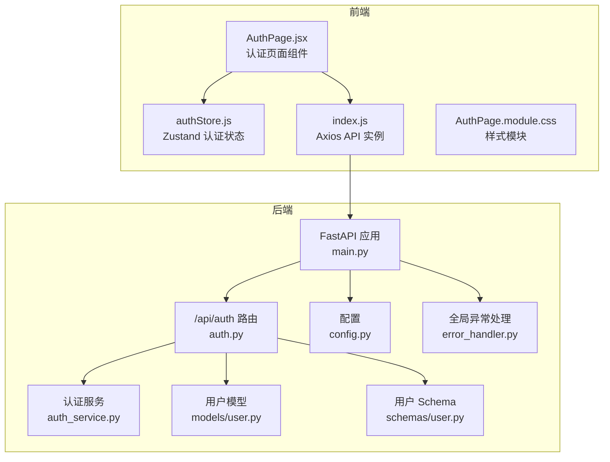
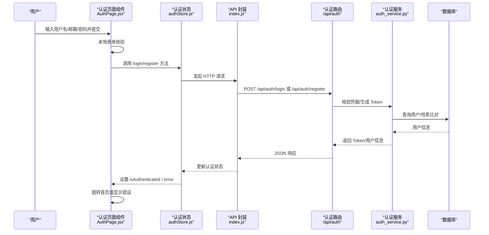
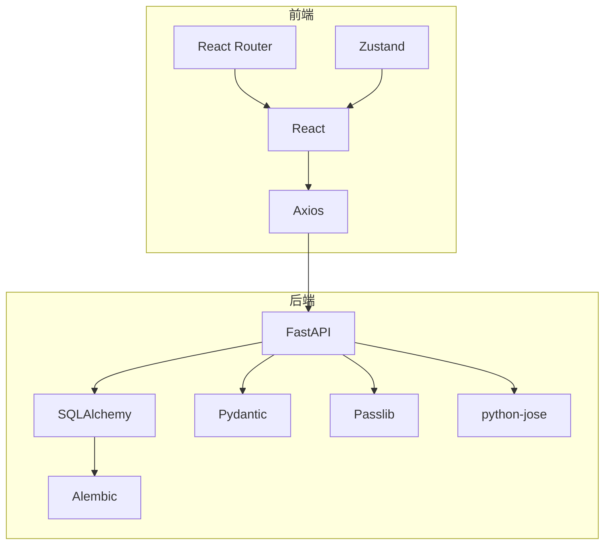
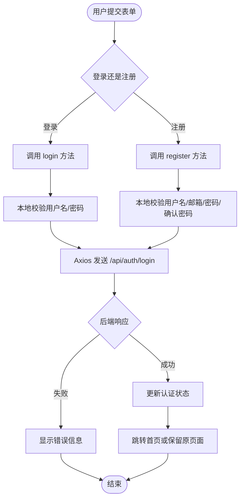

# 认证页面

<cite>
**本文引用的文件**
- [AuthPage.jsx](file://frontend/src/pages/AuthPage.jsx)
- [AuthPage.module.css](file://frontend/src/pages/AuthPage.module.css)
- [authStore.js](file://frontend/src/stores/authStore.js)
- [index.js](file://frontend/src/api/index.js)
- [auth.py](file://backend/app/routers/auth.py)
- [auth_service.py](file://backend/app/services/auth_service.py)
- [user.py](file://backend/app/models/user.py)
- [user.py](file://backend/app/schemas/user.py)
- [config.py](file://backend/app/config.py)
- [main.py](file://backend/app/main.py)
- [error_handler.py](file://backend/app/middleware/error_handler.py)
- [requirements.txt](file://backend/requirements.txt)
</cite>

## 目录
1. [简介](#简介)
2. [项目结构](#项目结构)
3. [核心组件](#核心组件)
4. [架构总览](#架构总览)
5. [详细组件分析](#详细组件分析)
6. [依赖分析](#依赖分析)
7. [性能考量](#性能考量)
8. [故障排查指南](#故障排查指南)
9. [结论](#结论)
10. [附录](#附录)

## 简介
本技术文档围绕认证页面组件展开，系统性阐述用户认证界面的设计理念与安全实现，覆盖登录/注册表单的验证逻辑、错误处理与用户体验设计；同时深入解析认证状态管理、JWT 令牌处理与会话持久化机制，以及认证页面与后端 API 的交互流程、错误码映射与安全策略。文档还讨论多因素认证、密码重置与账户激活的扩展实现思路，并给出第三方认证与 OAuth 流程的集成建议。

## 项目结构
认证页面位于前端工程的页面层，采用 React 组件 + Zustand 状态管理 + Axios API 封装的方式；后端基于 FastAPI 提供认证路由与服务，使用 SQLAlchemy 进行用户模型持久化，Pydantic 进行数据校验，JWT 作为无状态认证载体。整体采用前后端分离架构，通过 /api 前缀进行通信。

图表来源
- [AuthPage.jsx:1-245](file://frontend/src/pages/AuthPage.jsx#L1-L245)
- [authStore.js:1-23](file://frontend/src/stores/authStore.js#L1-L23)
- [index.js:1-12](file://frontend/src/api/index.js#L1-L12)
- [auth.py:1-186](file://backend/app/routers/auth.py#L1-L186)
- [auth_service.py:1-40](file://backend/app/services/auth_service.py#L1-L40)
- [user.py:1-36](file://backend/app/models/user.py#L1-L36)
- [user.py:1-42](file://backend/app/schemas/user.py#L1-L42)
- [config.py:1-44](file://backend/app/config.py#L1-L44)
- [main.py:1-114](file://backend/app/main.py#L1-L114)
- [error_handler.py:1-92](file://backend/app/middleware/error_handler.py#L1-L92)

章节来源
- [AuthPage.jsx:1-245](file://frontend/src/pages/AuthPage.jsx#L1-L245)
- [authStore.js:1-23](file://frontend/src/stores/authStore.js#L1-L23)
- [index.js:1-12](file://frontend/src/api/index.js#L1-L12)
- [auth.py:1-186](file://backend/app/routers/auth.py#L1-L186)
- [auth_service.py:1-40](file://backend/app/services/auth_service.py#L1-L40)
- [user.py:1-36](file://backend/app/models/user.py#L1-L36)
- [user.py:1-42](file://backend/app/schemas/user.py#L1-L42)
- [config.py:1-44](file://backend/app/config.py#L1-L44)
- [main.py:1-114](file://backend/app/main.py#L1-L114)
- [error_handler.py:1-92](file://backend/app/middleware/error_handler.py#L1-L92)

## 核心组件
- 前端认证页面组件：负责表单渲染、本地校验、提交处理、错误展示与路由跳转。
- 前端认证状态管理：当前实现为“个人使用模式”，始终返回已登录状态并提供空操作的登录/注册方法，以兼容后续扩展。
- 前端 API 封装：基于 Axios 创建带基础路径 /api 的实例，统一处理请求头。
- 后端认证路由：提供注册、登录、登出、获取当前用户信息等接口，返回 Token 与用户信息。
- 后端认证服务：在个人使用模式下返回默认用户，必要时自动创建默认用户记录。
- 后端模型与 Schema：定义用户字段、Token 结构与 Pydantic 校验规则。
- 后端配置：包含 JWT 密钥、算法与过期时间等关键安全参数。
- 后端异常处理：统一返回标准化错误响应，便于前端展示与调试。

章节来源
- [AuthPage.jsx:1-245](file://frontend/src/pages/AuthPage.jsx#L1-L245)
- [authStore.js:1-23](file://frontend/src/stores/authStore.js#L1-L23)
- [index.js:1-12](file://frontend/src/api/index.js#L1-L12)
- [auth.py:1-186](file://backend/app/routers/auth.py#L1-L186)
- [auth_service.py:1-40](file://backend/app/services/auth_service.py#L1-L40)
- [user.py:1-36](file://backend/app/models/user.py#L1-L36)
- [user.py:1-42](file://backend/app/schemas/user.py#L1-L42)
- [config.py:1-44](file://backend/app/config.py#L1-L44)
- [error_handler.py:1-92](file://backend/app/middleware/error_handler.py#L1-L92)

## 架构总览
认证页面从前端发起登录/注册请求，后端路由接收请求并调用认证服务与数据库，返回 Token 或用户信息。前端根据返回结果更新状态并进行页面跳转。错误通过全局异常处理中间件统一格式化返回。

图表来源
- [AuthPage.jsx:67-97](file://frontend/src/pages/AuthPage.jsx#L67-L97)
- [authStore.js:13-18](file://frontend/src/stores/authStore.js#L13-L18)
- [index.js:4-9](file://frontend/src/api/index.js#L4-L9)
- [auth.py:71-118](file://backend/app/routers/auth.py#L71-L118)
- [auth_service.py:13-39](file://backend/app/services/auth_service.py#L13-L39)

## 详细组件分析

### 前端认证页面组件（AuthPage.jsx）
- 设计理念
  - 使用标签页切换在登录与注册之间切换，减少页面跳转成本。
  - 表单字段按需渲染：注册时显示邮箱与确认密码，登录时隐藏邮箱。
  - 提交按钮禁用与加载动画，提升交互反馈。
- 验证逻辑
  - 登录：用户名非空、密码非空。
  - 注册：用户名非空、邮箱非空且有效、密码长度≥6、两次密码一致。
- 错误处理
  - 本地表单错误优先显示；若后端返回错误，覆盖本地错误。
  - 成功注册后自动切换到登录态并清空敏感字段。
- 用户体验
  - 响应式样式适配移动端；聚焦态输入框高亮；悬停按钮阴影变化。
- 路由与状态
  - 已登录状态下根据 from 参数跳转至原目标页面；首次进入清除错误状态。

章节来源
- [AuthPage.jsx:6-28](file://frontend/src/pages/AuthPage.jsx#L6-L28)
- [AuthPage.jsx:43-65](file://frontend/src/pages/AuthPage.jsx#L43-L65)
- [AuthPage.jsx:67-97](file://frontend/src/pages/AuthPage.jsx#L67-L97)
- [AuthPage.jsx:99-108](file://frontend/src/pages/AuthPage.jsx#L99-L108)
- [AuthPage.module.css:1-241](file://frontend/src/pages/AuthPage.module.css#L1-L241)

### 前端认证状态管理（authStore.js）
- 当前实现
  - 默认用户：id=1，username/email 为默认值，始终返回已登录。
  - 所有认证方法均为空操作，返回成功占位，确保组件兼容性。
- 扩展建议
  - 替换为真实后端认证逻辑，引入 Token 存储与刷新、错误清理、用户信息拉取等。

章节来源
- [authStore.js:1-23](file://frontend/src/stores/authStore.js#L1-L23)

### 前端 API 封装（index.js）
- 基础配置
  - baseURL 为 /api，统一 Content-Type。
  - 可扩展拦截器以注入 Authorization 头（如携带 JWT）。
- 交互要点
  - 与后端路由前缀保持一致，简化调用。

章节来源
- [index.js:4-9](file://frontend/src/api/index.js#L4-L9)

### 后端认证路由（auth.py）
- 接口能力
  - POST /api/auth/register：用户名唯一性与邮箱唯一性校验，密码哈希后创建用户。
  - POST /api/auth/login：支持用户名或邮箱登录，校验密码与账户启用状态，签发 JWT。
  - POST /api/auth/logout：无状态登出说明（客户端删除 Token 即可）。
  - GET /api/auth/me：获取当前用户信息（依赖认证依赖注入）。
  - PUT /api/auth/me：更新邮箱与头像，邮箱唯一性校验。
- 错误码映射
  - 用户名/邮箱已存在：400。
  - 用户名或密码错误：401。
  - 账户被禁用：401。
  - 参数校验失败：422（由全局异常处理统一返回）。
  - 数据库错误：500（由全局异常处理统一返回）。

章节来源
- [auth.py:27-68](file://backend/app/routers/auth.py#L27-L68)
- [auth.py:71-118](file://backend/app/routers/auth.py#L71-L118)
- [auth.py:121-131](file://backend/app/routers/auth.py#L121-L131)
- [auth.py:134-144](file://backend/app/routers/auth.py#L134-L144)
- [auth.py:147-185](file://backend/app/routers/auth.py#L147-L185)

### 后端认证服务（auth_service.py）
- 个人使用模式
  - 总是返回默认用户（id=1），若不存在则自动创建。
  - 无需外部认证依赖，适合本地开发与演示场景。
- 安全注意
  - 默认用户密码字段为“不使用”，实际部署应替换为真实密码策略。

章节来源
- [auth_service.py:13-39](file://backend/app/services/auth_service.py#L13-L39)

### 后端模型与 Schema（models/user.py, schemas/user.py）
- 用户模型
  - 字段：id、username（唯一）、email（唯一）、hashed_password、avatar、is_active、时间戳。
  - 关系：与论文、高亮、笔记、聊天会话、记忆、反馈、知识卡片等关联。
- Pydantic Schema
  - UserCreate：用户名长度、邮箱、密码长度校验。
  - UserLogin：用户名与密码。
  - UserResponse：返回用户基本信息与激活状态。
  - Token：access_token、token_type、expires_in。

章节来源
- [user.py:11-36](file://backend/app/models/user.py#L11-L36)
- [user.py:8-42](file://backend/app/schemas/user.py#L8-L42)

### 后端配置（config.py）
- JWT 配置
  - secret_key、algorithm、过期时间（分钟）。
- 其他配置
  - 数据库 URL、CORS 允许源、上传目录与大小限制等。

章节来源
- [config.py:28-31](file://backend/app/config.py#L28-L31)

### 后端异常处理（error_handler.py）
- 统一响应
  - Pydantic 校验错误：422，包含字段、消息与类型。
  - HTTP 异常：透传状态码与详情。
  - 数据库错误：500，统一消息。
  - 通用异常：500，统一消息。
- 前端收益
  - 错误结构一致，便于前端统一展示与调试。

章节来源
- [error_handler.py:11-70](file://backend/app/middleware/error_handler.py#L11-L70)

### 后端应用入口（main.py）
- 生命周期
  - 启动时初始化数据库、加载默认用户配置。
  - 关闭时释放数据库连接。
- 中间件
  - CORS 配置与全局异常处理注册。
- 路由注册
  - 包含认证相关路由与其他业务路由。

章节来源
- [main.py:16-52](file://backend/app/main.py#L16-L52)
- [main.py:70-95](file://backend/app/main.py#L70-L95)

## 依赖分析
- 前端依赖
  - React、React Router、Zustand、Axios。
- 后端依赖
  - FastAPI、SQLAlchemy、Pydantic、Passlib（密码哈希）、python-jose（JWT）、Alembic（迁移）。
- 安全相关
  - JWT 密钥与算法配置在后端；前端当前未使用 Token，后续需完善。

图表来源
- [requirements.txt:1-19](file://backend/requirements.txt#L1-L19)
- [main.py:10-13](file://backend/app/main.py#L10-L13)

章节来源
- [requirements.txt:1-19](file://backend/requirements.txt#L1-L19)
- [main.py:10-13](file://backend/app/main.py#L10-L13)

## 性能考量
- 前端
  - 表单本地校验减少无效请求；禁用提交按钮避免重复提交。
  - 样式模块化，避免全局污染；响应式适配提升移动端性能。
- 后端
  - 异步数据库访问与路由解耦；JWT 无状态特性降低会话开销。
  - 唯一性约束与索引（用户名、邮箱）提升查询效率。
- 安全与可用性
  - 严格参数校验与错误码映射，减少异常传播与资源浪费。

## 故障排查指南
- 常见问题
  - 登录失败：检查用户名/邮箱与密码是否匹配，确认账户是否启用。
  - 注册失败：检查用户名与邮箱唯一性，密码长度与二次确认一致性。
  - 参数校验失败：检查请求体字段与长度限制。
  - 数据库错误：检查数据库连接与迁移状态。
- 前端定位
  - 查看控制台网络请求与响应；确认 /api 前缀是否正确。
- 后端定位
  - 查看全局异常处理返回的错误结构；核对 JWT 配置与密钥。
- 建议
  - 在生产环境开启日志记录与错误上报；对敏感操作增加限频与风控。

章节来源
- [error_handler.py:11-70](file://backend/app/middleware/error_handler.py#L11-L70)
- [auth.py:40-54](file://backend/app/routers/auth.py#L40-L54)
- [auth.py:94-107](file://backend/app/routers/auth.py#L94-L107)
- [config.py:28-31](file://backend/app/config.py#L28-L31)

## 结论
当前认证页面采用“个人使用模式”实现，前端始终视为已登录，后端提供默认用户与基础认证路由。该设计降低了初始复杂度，便于快速迭代。后续建议完善前端 Token 管理与刷新、后端密码策略与安全配置、以及扩展多因素认证、密码重置与账户激活等高级功能，以满足更严格的生产需求。

## 附录

### 认证流程与数据流（代码级）

图表来源
- [AuthPage.jsx:67-97](file://frontend/src/pages/AuthPage.jsx#L67-L97)
- [auth.py:71-118](file://backend/app/routers/auth.py#L71-L118)