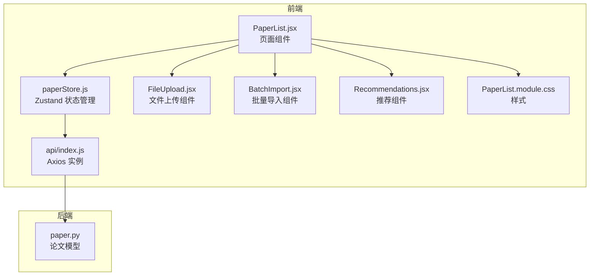
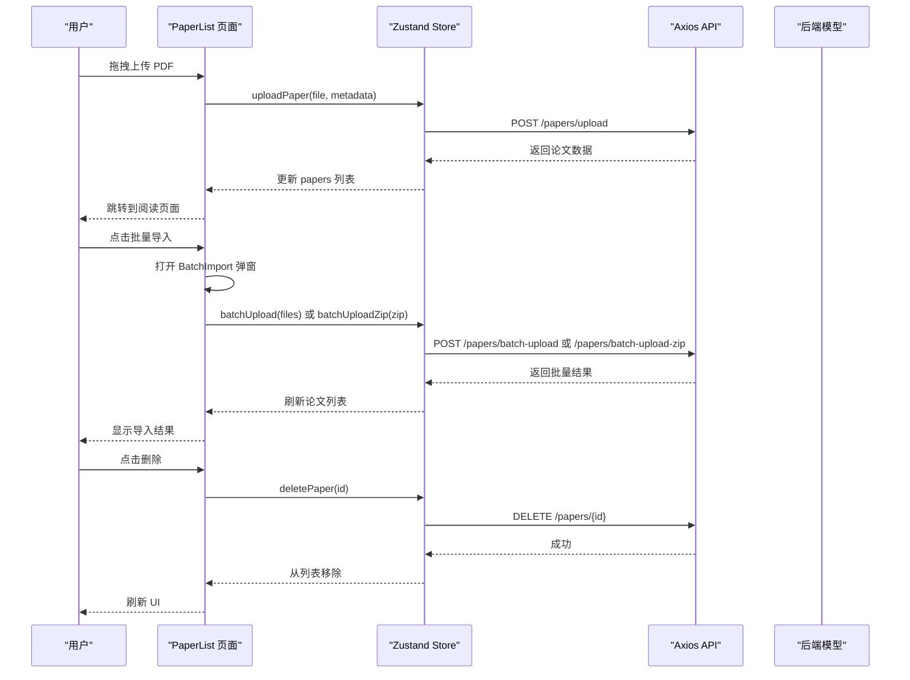
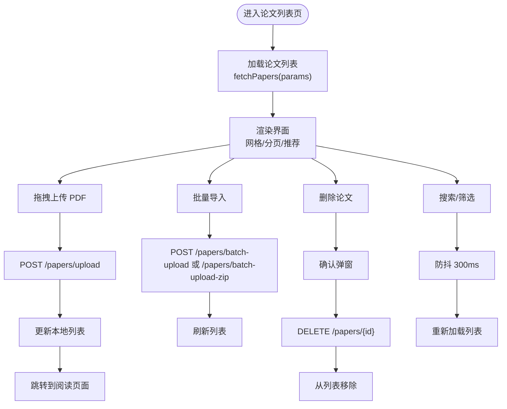
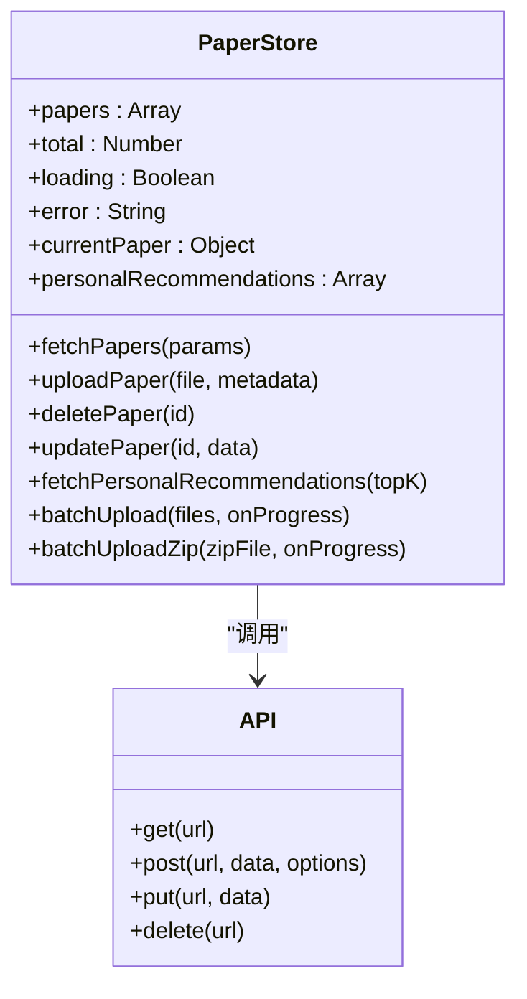
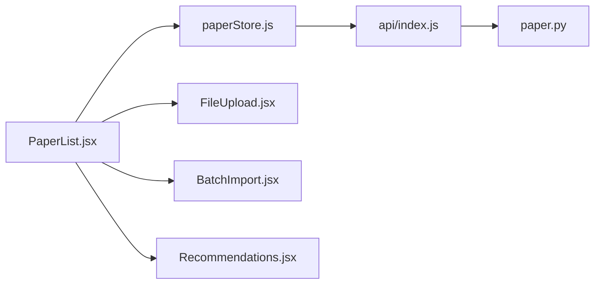

# 论文列表页

<cite>
**本文档引用的文件**
- [PaperList.jsx](file://frontend/src/pages/PaperList.jsx)
- [paperStore.js](file://frontend/src/stores/paperStore.js)
- [PaperList.module.css](file://frontend/src/pages/PaperList.module.css)
- [FileUpload.jsx](file://frontend/src/components/FileUpload/FileUpload.jsx)
- [BatchImport.jsx](file://frontend/src/components/BatchImport/BatchImport.jsx)
- [Recommendations.jsx](file://frontend/src/components/Recommendations/Recommendations.jsx)
- [paper.py](file://backend/app/models/paper.py)
- [index.js](file://frontend/src/api/index.js)
- [App.jsx](file://frontend/src/App.jsx)
- [main.jsx](file://frontend/src/main.jsx)
</cite>

## 目录
1. [简介](#简介)
2. [项目结构](#项目结构)
3. [核心组件](#核心组件)
4. [架构总览](#架构总览)
5. [详细组件分析](#详细组件分析)
6. [依赖关系分析](#依赖关系分析)
7. [性能考量](#性能考量)
8. [故障排除指南](#故障排除指南)
9. [结论](#结论)

## 简介
论文列表页是系统的核心入口页面，负责展示用户的论文集合、提供上传与批量导入能力、支持搜索与筛选、分页浏览，并集成了个性化推荐模块。该页面采用现代化的卡片式布局，结合 ZUSTAND 状态管理器实现高效的状态同步与响应式交互体验。页面还内置了论文删除确认、错误提示与加载状态等用户体验设计，确保在复杂操作下的稳定性与易用性。

## 项目结构
论文列表页位于前端目录的 pages 层级，配合 stores 层的状态管理与 components 层的通用组件，形成清晰的分层架构：
- 页面层：PaperList.jsx 负责整体布局与业务逻辑
- 状态管理层：paperStore.js 使用 ZUSTAND 提供论文 CRUD、上传、推荐等功能
- 组件层：FileUpload、BatchImport、Recommendations 等复用组件
- 样式层：PaperList.module.css 提供学术风格的视觉设计
- 后端模型：backend/app/models/paper.py 定义论文数据结构与字段

**图表来源**
- [PaperList.jsx:1-431](file://frontend/src/pages/PaperList.jsx#L1-L431)
- [paperStore.js:1-357](file://frontend/src/stores/paperStore.js#L1-L357)
- [PaperList.module.css:1-800](file://frontend/src/pages/PaperList.module.css#L1-L800)
- [FileUpload.jsx:1-92](file://frontend/src/components/FileUpload/FileUpload.jsx#L1-L92)
- [BatchImport.jsx:1-334](file://frontend/src/components/BatchImport/BatchImport.jsx#L1-L334)
- [Recommendations.jsx:1-265](file://frontend/src/components/Recommendations/Recommendations.jsx#L1-L265)
- [index.js:1-12](file://frontend/src/api/index.js#L1-L12)
- [paper.py:1-85](file://backend/app/models/paper.py#L1-L85)

**章节来源**
- [PaperList.jsx:1-431](file://frontend/src/pages/PaperList.jsx#L1-L431)
- [paperStore.js:1-357](file://frontend/src/stores/paperStore.js#L1-L357)
- [PaperList.module.css:1-800](file://frontend/src/pages/PaperList.module.css#L1-L800)
- [FileUpload.jsx:1-92](file://frontend/src/components/FileUpload/FileUpload.jsx#L1-L92)
- [BatchImport.jsx:1-334](file://frontend/src/components/BatchImport/BatchImport.jsx#L1-L334)
- [Recommendations.jsx:1-265](file://frontend/src/components/Recommendations/Recommendations.jsx#L1-L265)
- [index.js:1-12](file://frontend/src/api/index.js#L1-L12)
- [paper.py:1-85](file://backend/app/models/paper.py#L1-L85)

## 核心组件
- 论文列表页（PaperList）：聚合所有功能，包括论文卡片渲染、搜索过滤、分页、上传与批量导入、删除确认、个性化推荐等。
- 论文状态管理（paperStore）：基于 ZUSTAND 的集中式状态管理，封装论文列表、上传、删除、更新、推荐等 API 调用与本地状态更新。
- 文件上传组件（FileUpload）：提供拖拽上传 PDF 的 UI 与交互，支持进度反馈与错误提示。
- 批量导入组件（BatchImport）：支持多文件上传与 ZIP 导入，提供进度条与结果统计。
- 推荐组件（Recommendations）：展示个性化推荐论文，支持刷新与折叠控制。

**章节来源**
- [PaperList.jsx:45-428](file://frontend/src/pages/PaperList.jsx#L45-L428)
- [paperStore.js:4-354](file://frontend/src/stores/paperStore.js#L4-L354)
- [FileUpload.jsx:6-92](file://frontend/src/components/FileUpload/FileUpload.jsx#L6-L92)
- [BatchImport.jsx:19-334](file://frontend/src/components/BatchImport/BatchImport.jsx#L19-L334)
- [Recommendations.jsx:28-265](file://frontend/src/components/Recommendations/Recommendations.jsx#L28-L265)

## 架构总览
论文列表页采用“页面组件 + ZUSTAND 状态管理 + 通用组件”的分层架构：
- 页面组件负责视图渲染与用户交互，通过自定义 Hook usePaperStore 访问状态与动作。
- ZUSTAND store 将网络请求与本地状态合并，保证 UI 与数据的一致性。
- 通用组件（上传、批量导入、推荐）复用性强，便于扩展与维护。
- 后端模型定义论文字段，前端通过 API 与后端交互，实现论文的增删改查与推荐。

**图表来源**
- [PaperList.jsx:110-144](file://frontend/src/pages/PaperList.jsx#L110-L144)
- [paperStore.js:65-126](file://frontend/src/stores/paperStore.js#L65-L126)
- [BatchImport.jsx:49-113](file://frontend/src/components/BatchImport/BatchImport.jsx#L49-L113)
- [index.js:4-9](file://frontend/src/api/index.js#L4-L9)
- [paper.py:11-62](file://backend/app/models/paper.py#L11-L62)

## 详细组件分析

### 论文列表页（PaperList）
- 设计理念：采用卡片式布局，强调学术风格与可读性；顶部提供上传与批量导入入口，中部为个性化推荐区，底部为论文网格与分页。
- 布局结构：头部（Logo、副标题、上传与批量导入按钮）、个性化推荐区块、搜索与筛选栏、错误提示、论文网格、分页控件、模态框（上传、批量导入、删除确认）。
- 功能特性：
  - 搜索过滤：支持按标题/作者搜索，按分类与阅读状态筛选，使用防抖优化请求频率。
  - 分页：固定每页数量，计算总页数，支持上一页/下一页切换。
  - 上传：集成 react-dropzone，限制单文件 PDF，最大 50MB，支持拖拽与点击选择。
  - 批量导入：支持多文件上传与 ZIP 导入，提供进度条与结果统计。
  - 删除确认：二次确认弹窗，防止误删。
  - 个性化推荐：加载并展示推荐论文，支持刷新。
- 用户交互流程：点击卡片进入阅读页面；点击删除按钮触发确认弹窗；上传完成后自动跳转阅读页面。

**图表来源**
- [PaperList.jsx:72-144](file://frontend/src/pages/PaperList.jsx#L72-L144)
- [paperStore.js:21-47](file://frontend/src/stores/paperStore.js#L21-L47)
- [PaperList.jsx:110-144](file://frontend/src/pages/PaperList.jsx#L110-L144)

**章节来源**
- [PaperList.jsx:45-428](file://frontend/src/pages/PaperList.jsx#L45-L428)
- [PaperList.module.css:1-800](file://frontend/src/pages/PaperList.module.css#L1-L800)

### 论文状态管理（paperStore）
- 数据结构：存储 papers、total、loading、error、currentPaper、推荐相关状态等。
- 核心动作：
  - fetchPapers：构建查询参数，发起 GET 请求，更新列表与总数。
  - uploadPaper：构造 FormData，支持标题、分类、标签元数据，监听上传进度，成功后更新本地列表。
  - deletePaper：发起 DELETE 请求，成功后从本地列表移除。
  - updatePaper：发起 PUT 请求，更新本地列表与当前论文。
  - fetchPersonalRecommendations：获取个性化推荐，支持 loading 状态。
  - batchUpload/batchUploadZip：批量上传与 ZIP 导入，支持进度回调与刷新列表。
- 状态更新策略：每次网络请求前后切换 loading 状态，统一捕获错误并设置 error 字段，保证 UI 一致性。

**图表来源**
- [paperStore.js:4-354](file://frontend/src/stores/paperStore.js#L4-L354)
- [index.js:4-9](file://frontend/src/api/index.js#L4-L9)

**章节来源**
- [paperStore.js:4-354](file://frontend/src/stores/paperStore.js#L4-L354)

### 文件上传组件（FileUpload）
- 功能：提供拖拽上传 PDF 的 UI，支持单文件限制与最大 50MB，显示上传进度与错误提示。
- 交互：拖拽激活状态、点击选择文件、上传中禁用交互、错误回显。
- 与页面集成：PaperList 中的上传弹窗使用该组件，或直接调用 uploadPaper 动作。

**章节来源**
- [FileUpload.jsx:6-92](file://frontend/src/components/FileUpload/FileUpload.jsx#L6-L92)
- [PaperList.jsx:110-127](file://frontend/src/pages/PaperList.jsx#L110-L127)

### 批量导入组件（BatchImport）
- 功能：支持多文件上传与 ZIP 导入两种方式，提供文件列表、进度条、结果统计与错误详情。
- 交互：Tab 切换（批量上传/ZIP 导入）、拖拽与点击选择、清空与移除文件、上传按钮禁用逻辑。
- 与状态管理：调用 store 的 batchUpload 与 batchUploadZip，成功后刷新列表并回调父组件。

**章节来源**
- [BatchImport.jsx:19-334](file://frontend/src/components/BatchImport/BatchImport.jsx#L19-L334)
- [paperStore.js:286-352](file://frontend/src/stores/paperStore.js#L286-L352)

### 个性化推荐组件（Recommendations）
- 功能：展示个性化推荐论文，支持刷新、折叠、相似度与匹配原因标识。
- 与状态管理：依赖 store 的推荐状态与加载状态，支持网络学术推荐区域（可选）。
- 在论文列表页中作为区块展示，提供“为你推荐”标题与空状态提示。

**章节来源**
- [Recommendations.jsx:28-265](file://frontend/src/components/Recommendations/Recommendations.jsx#L28-L265)
- [PaperList.jsx:178-190](file://frontend/src/pages/PaperList.jsx#L178-L190)

### 辅助功能与工具函数
- 状态映射：将阅读状态 unread/reading/finished 映射为中文标签与颜色，用于卡片徽章与时间显示。
- 日期格式化：formatDate 将 ISO 日期格式化为本地化日期字符串。
- 阅读时间格式化：formatReadTime 输出年-月-日 时:分 的时间格式。
- 文件大小格式化：formatFileSize 将字节转换为 B/KB/MB 并保留一位小数。

**章节来源**
- [PaperList.jsx:9-43](file://frontend/src/pages/PaperList.jsx#L9-L43)

## 依赖关系分析
- 组件耦合：PaperList 直接依赖 usePaperStore，间接依赖 FileUpload、BatchImport、Recommendations。
- 状态管理：paperStore 通过 axios 实例与后端交互，维护本地状态与网络状态同步。
- 后端模型：后端论文模型定义字段（标题、作者、摘要、文件路径、大小、页数、标签、分类、阅读状态、最后阅读时间、分析缓存等），前端通过 API 读取与更新。

**图表来源**
- [PaperList.jsx:1-8](file://frontend/src/pages/PaperList.jsx#L1-L8)
- [paperStore.js:1-3](file://frontend/src/stores/paperStore.js#L1-L3)
- [index.js:1-12](file://frontend/src/api/index.js#L1-L12)
- [paper.py:11-62](file://backend/app/models/paper.py#L11-L62)

**章节来源**
- [PaperList.jsx:1-8](file://frontend/src/pages/PaperList.jsx#L1-L8)
- [paperStore.js:1-3](file://frontend/src/stores/paperStore.js#L1-L3)
- [index.js:1-12](file://frontend/src/api/index.js#L1-L12)
- [paper.py:11-62](file://backend/app/models/paper.py#L11-L62)

## 性能考量
- 列表加载与分页：固定每页数量，仅在必要时请求，减少不必要的网络往返。
- 搜索防抖：输入搜索关键词后延迟 300ms 再请求，降低频繁请求带来的压力。
- 上传进度：在 store 中监听上传进度事件，避免重复渲染与状态抖动。
- 懒加载页面：App.jsx 中对核心页面进行懒加载，减少首屏资源占用。
- 卡片渲染优化：使用 CSS Grid 自适应布局，避免过度嵌套与复杂计算。

[本节为通用性能建议，无需特定文件引用]

## 故障排除指南
- 上传失败：检查文件类型与大小限制（PDF，最大 50MB），查看 store 中的 error 字段与控制台日志。
- 批量导入失败：确认 ZIP 结构与 PDF 文件命名规范，查看结果统计中的失败详情。
- 删除失败：确认网络连接与权限，查看错误提示并重试。
- 列表为空：检查搜索条件与筛选项，尝试清除筛选或刷新页面。
- 推荐加载失败：检查个性化推荐接口可用性，尝试手动刷新。

**章节来源**
- [paperStore.js:40-46](file://frontend/src/stores/paperStore.js#L40-L46)
- [paperStore.js:97-103](file://frontend/src/stores/paperStore.js#L97-L103)
- [BatchImport.jsx:63-67](file://frontend/src/components/BatchImport/BatchImport.jsx#L63-L67)
- [PaperList.jsx:232-238](file://frontend/src/pages/PaperList.jsx#L232-L238)

## 结论
论文列表页通过清晰的分层架构与 ZUSTAND 状态管理，实现了论文的高效展示与交互。页面集成了上传、批量导入、搜索过滤、分页、删除确认与个性化推荐等核心功能，辅以状态映射、日期与文件大小格式化等工具函数，提升了用户体验与可维护性。未来可在以下方面持续优化：进一步细化错误处理与重试机制、增强键盘快捷键支持、引入虚拟滚动以提升大列表性能、完善国际化与无障碍访问。