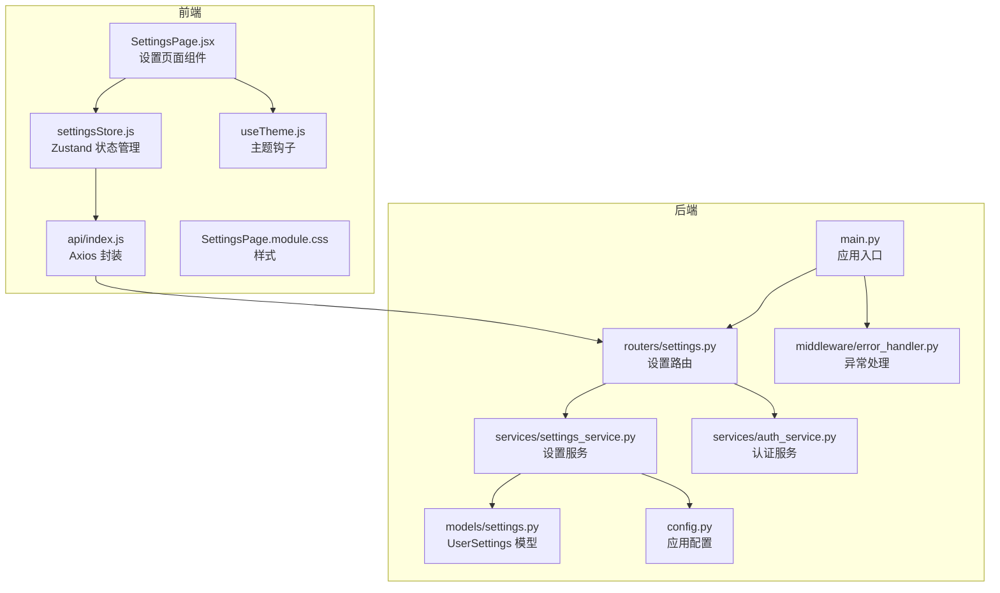
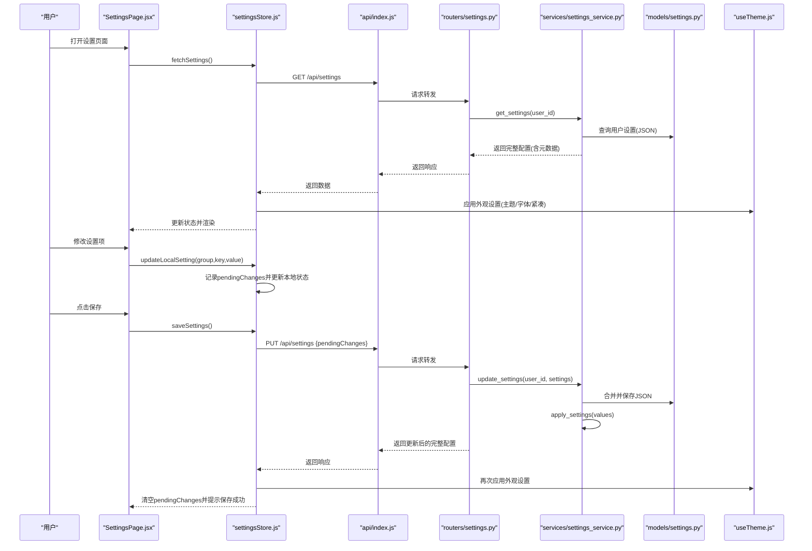
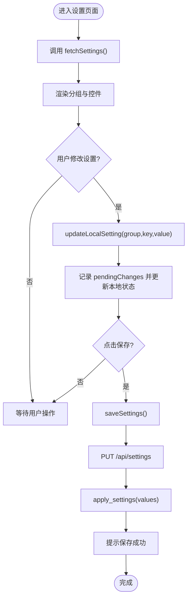
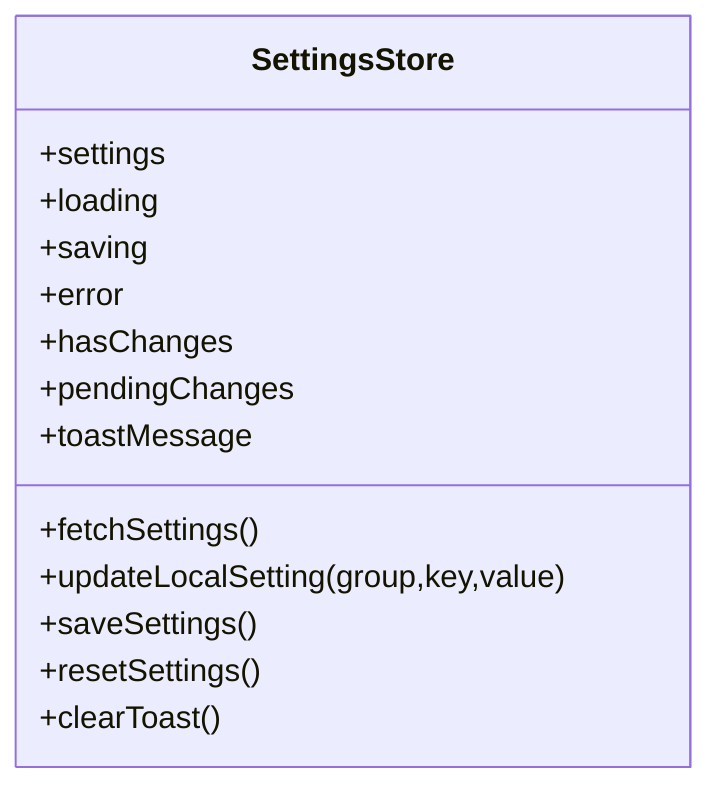
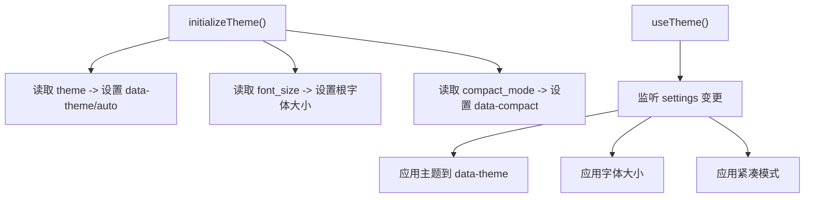
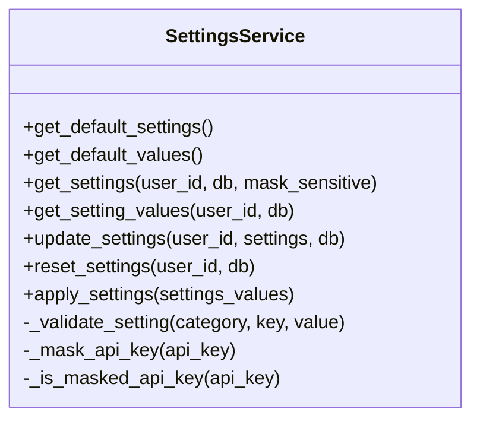
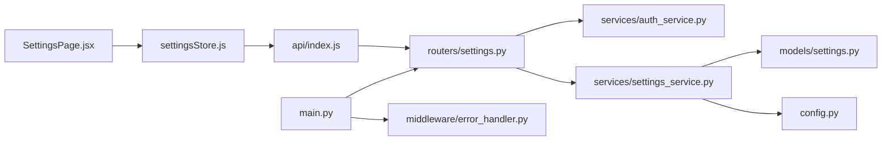

# 设置页面

<cite>
**本文引用的文件**
- [SettingsPage.jsx](file://frontend/src/pages/SettingsPage.jsx)
- [settingsStore.js](file://frontend/src/stores/settingsStore.js)
- [settings.py](file://backend/app/routers/settings.py)
- [settings.py](file://backend/app/models/settings.py)
- [settings_service.py](file://backend/app/services/settings_service.py)
- [useTheme.js](file://frontend/src/hooks/useTheme.js)
- [index.js](file://frontend/src/api/index.js)
- [config.py](file://backend/app/config.py)
- [auth_service.py](file://backend/app/services/auth_service.py)
- [error_handler.py](file://backend/app/middleware/error_handler.py)
- [main.py](file://backend/app/main.py)
- [SettingsPage.module.css](file://frontend/src/pages/SettingsPage.module.css)
</cite>

## 目录
1. [简介](#简介)
2. [项目结构](#项目结构)
3. [核心组件](#核心组件)
4. [架构总览](#架构总览)
5. [详细组件分析](#详细组件分析)
6. [依赖关系分析](#依赖关系分析)
7. [性能考量](#性能考量)
8. [故障排查指南](#故障排查指南)
9. [结论](#结论)
10. [附录](#附录)

## 简介
本技术文档围绕“设置页面”组件进行深入解析，涵盖用户偏好设置、主题切换、语言配置等设置项的实现细节；阐述设置数据的本地存储机制、云端同步与隐私保护策略；分析设置页面与认证系统、权限管理的集成关系；提供设置界面的表单验证、实时预览与批量修改能力；并说明设置数据的备份恢复、导入导出与版本兼容性处理，以及设置变更的通知机制与应用生效策略。

## 项目结构
设置页面位于前端 React 应用中，采用模块化组织：
- 页面组件：负责渲染设置分组、控件类型与交互逻辑
- 状态管理：基于 Zustand 的 settingsStore，封装加载、更新、保存、重置与提示
- 主题钩子：useTheme 负责将外观设置应用到 DOM 属性与 CSS 变量
- API 封装：统一的 axios 实例，基础路径指向 /api
- 后端路由：提供设置的获取、更新、重置与值读取接口
- 服务层：SettingsService 统一管理默认配置、校验、合并、脱敏与运行时应用
- 模型层：UserSettings 使用 JSON 字段持久化用户配置
- 认证与权限：个人使用模式下的默认用户获取，无需登录即可访问设置

图表来源
- [SettingsPage.jsx:1-330](file://frontend/src/pages/SettingsPage.jsx#L1-L330)
- [settingsStore.js:1-131](file://frontend/src/stores/settingsStore.js#L1-L131)
- [useTheme.js:1-91](file://frontend/src/hooks/useTheme.js#L1-L91)
- [index.js:1-12](file://frontend/src/api/index.js#L1-L12)
- [settings.py:1-94](file://backend/app/routers/settings.py#L1-L94)
- [settings_service.py:1-523](file://backend/app/services/settings_service.py#L1-L523)
- [settings.py:1-30](file://backend/app/models/settings.py#L1-L30)
- [config.py:1-44](file://backend/app/config.py#L1-L44)
- [auth_service.py:1-40](file://backend/app/services/auth_service.py#L1-L40)
- [error_handler.py:1-92](file://backend/app/middleware/error_handler.py#L1-L92)
- [main.py:1-114](file://backend/app/main.py#L1-L114)

章节来源
- [SettingsPage.jsx:1-330](file://frontend/src/pages/SettingsPage.jsx#L1-L330)
- [settingsStore.js:1-131](file://frontend/src/stores/settingsStore.js#L1-L131)
- [useTheme.js:1-91](file://frontend/src/hooks/useTheme.js#L1-L91)
- [index.js:1-12](file://frontend/src/api/index.js#L1-L12)
- [settings.py:1-94](file://backend/app/routers/settings.py#L1-L94)
- [settings_service.py:1-523](file://backend/app/services/settings_service.py#L1-L523)
- [settings.py:1-30](file://backend/app/models/settings.py#L1-L30)
- [config.py:1-44](file://backend/app/config.py#L1-L44)
- [auth_service.py:1-40](file://backend/app/services/auth_service.py#L1-L40)
- [error_handler.py:1-92](file://backend/app/middleware/error_handler.py#L1-L92)
- [main.py:1-114](file://backend/app/main.py#L1-L114)

## 核心组件
- 设置页面组件：按分组渲染设置项，支持滑块、数字、选择、文本、密码、开关与主题选择等控件类型，并提供保存与重置操作。
- 状态管理：集中管理设置数据、加载状态、保存状态、错误状态、待提交变更与提示消息，支持本地即时更新与云端同步。
- 主题钩子：将外观设置映射到 DOM 属性与 CSS 变量，实现主题、强调色、字体大小与紧凑模式的实时预览。
- API 封装：统一的 axios 实例，基础路径为 /api，便于后端路由对接。
- 设置服务：提供默认配置、配置校验、合并用户配置、脱敏敏感信息、运行时应用配置到各服务的能力。
- 认证服务：个人使用模式下自动创建默认用户，无需登录即可访问设置。
- 异常处理：统一捕获验证、HTTP、数据库与通用异常，返回标准化错误响应。

章节来源
- [SettingsPage.jsx:212-330](file://frontend/src/pages/SettingsPage.jsx#L212-L330)
- [settingsStore.js:9-128](file://frontend/src/stores/settingsStore.js#L9-L128)
- [useTheme.js:13-66](file://frontend/src/hooks/useTheme.js#L13-L66)
- [index.js:1-12](file://frontend/src/api/index.js#L1-L12)
- [settings_service.py:168-523](file://backend/app/services/settings_service.py#L168-L523)
- [auth_service.py:13-40](file://backend/app/services/auth_service.py#L13-L40)
- [error_handler.py:11-92](file://backend/app/middleware/error_handler.py#L11-L92)

## 架构总览
设置页面的前后端交互遵循“页面组件 -> 状态管理 -> API -> 路由 -> 服务 -> 模型”的链路，同时通过主题钩子实现前端的实时预览。后端在应用启动时加载默认用户配置并应用到运行时服务。

图表来源
- [SettingsPage.jsx:212-330](file://frontend/src/pages/SettingsPage.jsx#L212-L330)
- [settingsStore.js:18-94](file://frontend/src/stores/settingsStore.js#L18-L94)
- [index.js:1-12](file://frontend/src/api/index.js#L1-L12)
- [settings.py:17-63](file://backend/app/routers/settings.py#L17-L63)
- [settings_service.py:245-404](file://backend/app/services/settings_service.py#L245-L404)
- [settings.py:11-30](file://backend/app/models/settings.py#L11-L30)
- [useTheme.js:13-66](file://frontend/src/hooks/useTheme.js#L13-L66)

## 详细组件分析

### 设置页面组件（SettingsPage.jsx）
- 分组配置：定义个性化设置、AI 模型设置、RAG 检索设置、联网搜索设置、推荐设置与通用设置等分组及其图标。
- 控件类型：根据配置的 type 渲染不同控件，包括滑块、数字、选择、文本、密码、开关与主题选择，并提供描述与范围提示。
- 交互逻辑：监听变更回调，调用状态管理的 updateLocalSetting；保存按钮触发 saveSettings；重置按钮触发 resetSettings。
- 加载与错误：支持加载中状态与错误重试；底部操作栏固定在屏幕底部，包含保存与重置按钮及提示消息。

图表来源
- [SettingsPage.jsx:212-330](file://frontend/src/pages/SettingsPage.jsx#L212-L330)
- [settingsStore.js:18-94](file://frontend/src/stores/settingsStore.js#L18-L94)

章节来源
- [SettingsPage.jsx:5-185](file://frontend/src/pages/SettingsPage.jsx#L5-L185)
- [SettingsPage.jsx:187-210](file://frontend/src/pages/SettingsPage.jsx#L187-L210)
- [SettingsPage.jsx:212-330](file://frontend/src/pages/SettingsPage.jsx#L212-L330)

### 状态管理（settingsStore.js）
- 数据结构：settings、loading、saving、error、hasChanges、pendingChanges、toastMessage。
- 加载流程：fetchSettings 发起 GET 请求，成功后同步外观设置到 localStorage，避免主题闪烁。
- 本地更新：updateLocalSetting 支持即时预览，同时记录待保存的变更；对外观设置即时写入 localStorage。
- 保存流程：saveSettings 发起 PUT 请求，成功后同步外观设置到 localStorage，并显示提示消息。
- 重置流程：resetSettings 发起 POST /api/settings/reset，成功后同步外观设置到 localStorage，并显示提示消息。
- 提示管理：clearToast 清除提示消息。

图表来源
- [settingsStore.js:9-128](file://frontend/src/stores/settingsStore.js#L9-L128)

章节来源
- [settingsStore.js:9-131](file://frontend/src/stores/settingsStore.js#L9-L131)

### 主题钩子（useTheme.js）
- 主题应用：根据设置或 localStorage 决定 data-theme 属性，支持 auto、light、dark；自动同步到 localStorage。
- 字体大小：将缩放比例应用到根元素字体大小，同时同步到 localStorage。
- 紧凑模式：通过 data-compact 属性控制布局紧凑程度，同时同步到 localStorage。
- 初始化：initializeTheme 在应用启动时从 localStorage 读取并立即应用，避免首次渲染闪烁。

图表来源
- [useTheme.js:13-66](file://frontend/src/hooks/useTheme.js#L13-L66)
- [useTheme.js:72-91](file://frontend/src/hooks/useTheme.js#L72-L91)

章节来源
- [useTheme.js:13-91](file://frontend/src/hooks/useTheme.js#L13-L91)

### API 封装（api/index.js）
- 基础配置：baseURL 为 /api，统一 Content-Type。
- 与后端路由对接：前端通过 axios 实例调用 /api/settings、/api/settings/reset 等端点。

章节来源
- [index.js:1-12](file://frontend/src/api/index.js#L1-L12)

### 后端路由（routers/settings.py）
- GET /api/settings：返回完整配置（含元数据），API Key 已脱敏。
- PUT /api/settings：更新配置，返回更新后的完整配置，并应用到运行时。
- POST /api/settings/reset：重置为默认值，返回默认配置，并应用默认值到运行时。
- GET /api/settings/values：返回纯值配置（不含元数据），供后端服务读取。

章节来源
- [settings.py:17-94](file://backend/app/routers/settings.py#L17-L94)

### 设置服务（services/settings_service.py）
- 默认配置：定义各分组的键、类型、默认值、范围与描述，供前端渲染表单。
- 配置校验：按类型与范围校验用户输入，确保数据有效性。
- 合并策略：将用户自定义配置与默认配置合并，优先使用用户值。
- 脱敏策略：对 API Key 进行脱敏处理，仅显示最后4位；保存时跳过脱敏值。
- 运行时应用：将配置应用到 LLM、RAG、搜索与推荐服务，实现设置生效。
- 重置逻辑：删除用户配置，返回默认配置。

图表来源
- [settings_service.py:168-523](file://backend/app/services/settings_service.py#L168-L523)

章节来源
- [settings_service.py:19-165](file://backend/app/services/settings_service.py#L19-L165)
- [settings_service.py:245-523](file://backend/app/services/settings_service.py#L245-L523)

### 数据模型（models/settings.py）
- UserSettings：以 JSON 字段存储用户配置，唯一约束 user_id，包含更新时间戳。
- 与服务层配合：服务层解析 JSON 并与默认配置合并，再返回给前端。

章节来源
- [settings.py:11-30](file://backend/app/models/settings.py#L11-L30)

### 认证与权限（services/auth_service.py）
- 默认用户：个人使用模式下自动创建默认用户（id=1），无需登录即可访问设置。
- 依赖注入：路由通过依赖注入获取当前用户，保证设置操作绑定到默认用户。

章节来源
- [auth_service.py:13-40](file://backend/app/services/auth_service.py#L13-L40)

### 异常处理（middleware/error_handler.py）
- 统一处理：捕获 Pydantic 验证错误、HTTP 异常、SQLAlchemy 错误与通用异常，返回标准化 JSON。
- 前端友好：错误消息包含字段、消息与类型，便于前端展示与定位问题。

章节来源
- [error_handler.py:11-92](file://backend/app/middleware/error_handler.py#L11-L92)

### 应用入口（main.py）
- 生命周期：启动时初始化数据库，加载默认用户配置并应用到运行时服务。
- 路由注册：包含设置路由，确保 /api/settings 等端点可用。

章节来源
- [main.py:16-53](file://backend/app/main.py#L16-L53)
- [main.py:98-114](file://backend/app/main.py#L98-L114)

## 依赖关系分析
- 前端依赖：SettingsPage.jsx 依赖 settingsStore.js 与 useTheme.js；settingsStore.js 依赖 api/index.js；CSS 为页面样式。
- 后端依赖：routers/settings.py 依赖 auth_service.py 与 settings_service.py；settings_service.py 依赖 models/settings.py 与 config.py；main.py 注册路由并设置异常处理。

图表来源
- [SettingsPage.jsx:1-330](file://frontend/src/pages/SettingsPage.jsx#L1-L330)
- [settingsStore.js:1-131](file://frontend/src/stores/settingsStore.js#L1-L131)
- [index.js:1-12](file://frontend/src/api/index.js#L1-L12)
- [settings.py:1-94](file://backend/app/routers/settings.py#L1-L94)
- [auth_service.py:1-40](file://backend/app/services/auth_service.py#L1-L40)
- [settings_service.py:1-523](file://backend/app/services/settings_service.py#L1-L523)
- [settings.py:1-30](file://backend/app/models/settings.py#L1-L30)
- [config.py:1-44](file://backend/app/config.py#L1-L44)
- [main.py:1-114](file://backend/app/main.py#L1-L114)
- [error_handler.py:1-92](file://backend/app/middleware/error_handler.py#L1-L92)

章节来源
- [settings.py:1-94](file://backend/app/routers/settings.py#L1-L94)
- [settings_service.py:1-523](file://backend/app/services/settings_service.py#L1-L523)
- [settings.py:1-30](file://backend/app/models/settings.py#L1-L30)
- [config.py:1-44](file://backend/app/config.py#L1-L44)
- [auth_service.py:1-40](file://backend/app/services/auth_service.py#L1-L40)
- [error_handler.py:1-92](file://backend/app/middleware/error_handler.py#L1-L92)
- [main.py:1-114](file://backend/app/main.py#L1-L114)

## 性能考量
- 前端性能
  - 即时预览：updateLocalSetting 与 useTheme.js 的副作用在本地执行，避免频繁网络请求，提升交互流畅度。
  - 批量变更：pendingChanges 一次性提交，减少网络往返次数。
  - 本地存储：外观设置同步到 localStorage，避免重复计算与闪烁。
- 后端性能
  - 配置合并：服务层在内存中合并默认配置与用户配置，复杂度与设置项数量线性相关。
  - 脱敏与保存：保存时跳过脱敏值，减少不必要的数据库写入。
  - 运行时应用：apply_settings 仅在更新时触发，避免对所有服务进行无谓更新。

## 故障排查指南
- 加载失败
  - 症状：设置页面显示错误并提供重试按钮。
  - 排查：检查 /api/settings 的响应与后端异常处理；确认数据库连接正常。
- 保存失败
  - 症状：保存按钮禁用或显示错误提示。
  - 排查：检查 /api/settings 的请求体是否符合类型与范围；查看服务层校验错误；确认数据库写入成功。
- 重置失败
  - 症状：重置后仍显示旧配置。
  - 排查：确认 /api/settings/reset 成功；检查服务层重置逻辑与运行时应用。
- 主题不生效
  - 症状：切换主题后界面未变化。
  - 排查：确认 useTheme.js 正确应用 data-theme；检查 localStorage 中的 theme 值；确认 CSS 变量与媒体查询生效。
- API Key 脱敏问题
  - 症状：API Key 显示为脱敏值且无法保存。
  - 排查：确认前端未提交脱敏值；服务层跳过脱敏值的保存逻辑；必要时检查环境变量中的默认 Key。

章节来源
- [settingsStore.js:36-93](file://frontend/src/stores/settingsStore.js#L36-L93)
- [settings_service.py:245-404](file://backend/app/services/settings_service.py#L245-L404)
- [useTheme.js:13-66](file://frontend/src/hooks/useTheme.js#L13-L66)
- [error_handler.py:11-92](file://backend/app/middleware/error_handler.py#L11-L92)

## 结论
设置页面通过清晰的前后端职责划分与完善的本地/云端协同机制，实现了用户偏好的灵活配置与实时预览。默认配置与校验保障了设置的稳定性，脱敏策略保护了敏感信息，运行时应用确保设置生效。整体设计兼顾易用性与可维护性，为后续扩展（如多用户、云端同步、导入导出）提供了良好基础。

## 附录

### 设置项类型与默认值概览
- 个性化设置（appearance）
  - 主题模式：light/dark/auto
  - 强调色：blue/purple/green/orange
  - 字体大小：范围与步进
  - 紧凑模式：布尔开关
- AI 模型设置（llm）
  - 模型选择：下拉列表
  - 回答温度：范围与步进
  - 最大 Token 数：范围与步进
  - API Key：密码输入（支持脱敏）
  - API Base URL：文本输入
- RAG 检索设置（rag）
  - 检索数量：范围与步进
  - 分块大小：范围与步进
  - 块重叠：范围与步进
- 联网搜索设置（search）
  - 最大搜索结果：范围与步进
  - 搜索超时：范围与步进
- 推荐设置（recommendation）
  - 推荐数量：范围与步进
- 通用设置（general）
  - 最大文件大小：范围与步进
  - 对话历史条数：范围与步进

章节来源
- [settings_service.py:19-165](file://backend/app/services/settings_service.py#L19-L165)

### 本地存储与外观设置映射
- 主题：localStorage 键为 paperchat_theme
- 字体大小：localStorage 键为 paperchat_font_size
- 紧凑模式：localStorage 键为 paperchat_compact_mode
- 初始化：initializeTheme 从 localStorage 读取并立即应用，避免闪烁

章节来源
- [settingsStore.js:4-33](file://frontend/src/stores/settingsStore.js#L4-L33)
- [useTheme.js:72-91](file://frontend/src/hooks/useTheme.js#L72-L91)

### 隐私保护与安全策略
- API Key 脱敏：前端显示脱敏值，后端保存时跳过脱敏值；若用户未提供则使用环境变量中的默认 Key。
- 传输安全：建议在生产环境中启用 HTTPS 与安全的 CORS 配置。
- 权限控制：个人使用模式下默认用户 id=1，无需登录；如需多用户，请扩展认证与权限模块。

章节来源
- [settings_service.py:232-287](file://backend/app/services/settings_service.py#L232-L287)
- [settings_service.py:323-327](file://backend/app/services/settings_service.py#L323-L327)
- [config.py:25-31](file://backend/app/config.py#L25-L31)
- [auth_service.py:13-40](file://backend/app/services/auth_service.py#L13-L40)

### 设置变更通知与应用生效策略
- 前端：保存成功后显示提示消息；useTheme.js 即时应用外观设置。
- 后端：PUT /api/settings 后调用 apply_settings 将配置应用到运行时服务；GET /api/settings/values 供后端服务读取纯值配置。

章节来源
- [settingsStore.js:82-93](file://frontend/src/stores/settingsStore.js#L82-L93)
- [settings_service.py:454-519](file://backend/app/services/settings_service.py#L454-L519)
- [settings.py:83-94](file://backend/app/routers/settings.py#L83-L94)