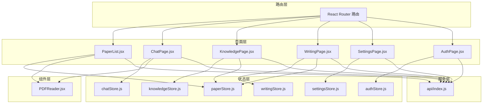
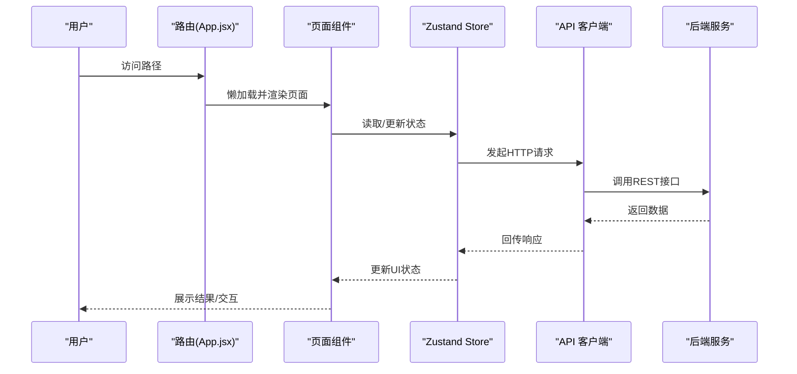
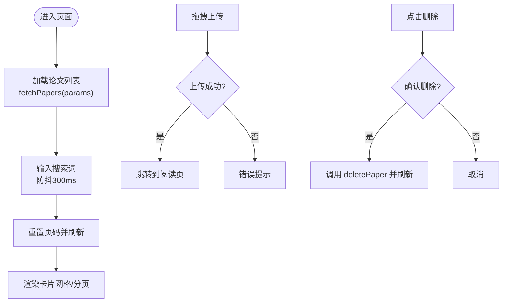
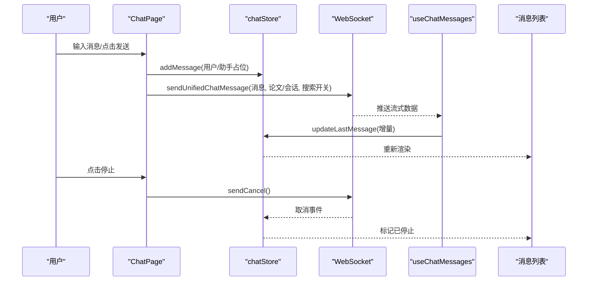
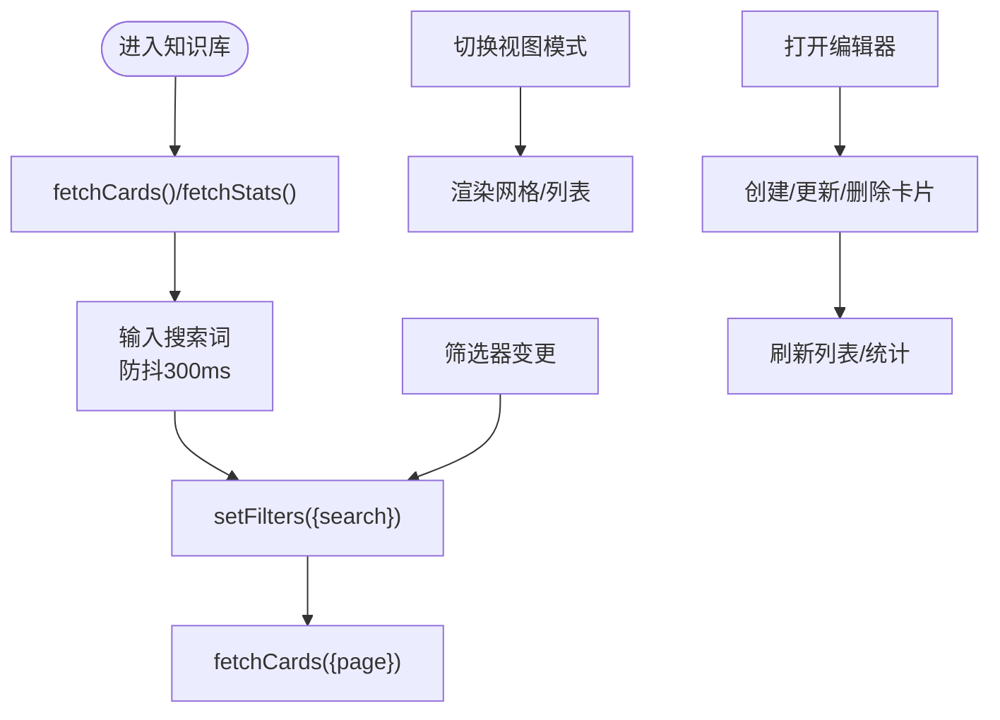
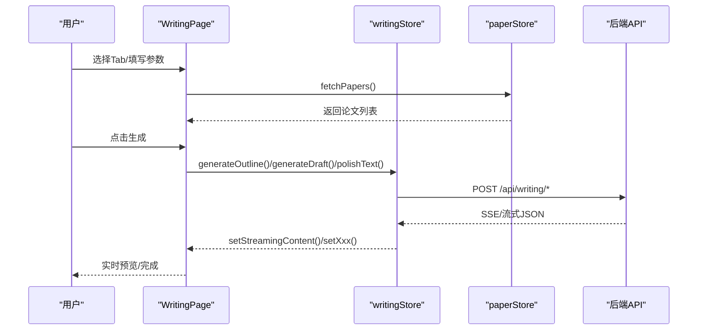
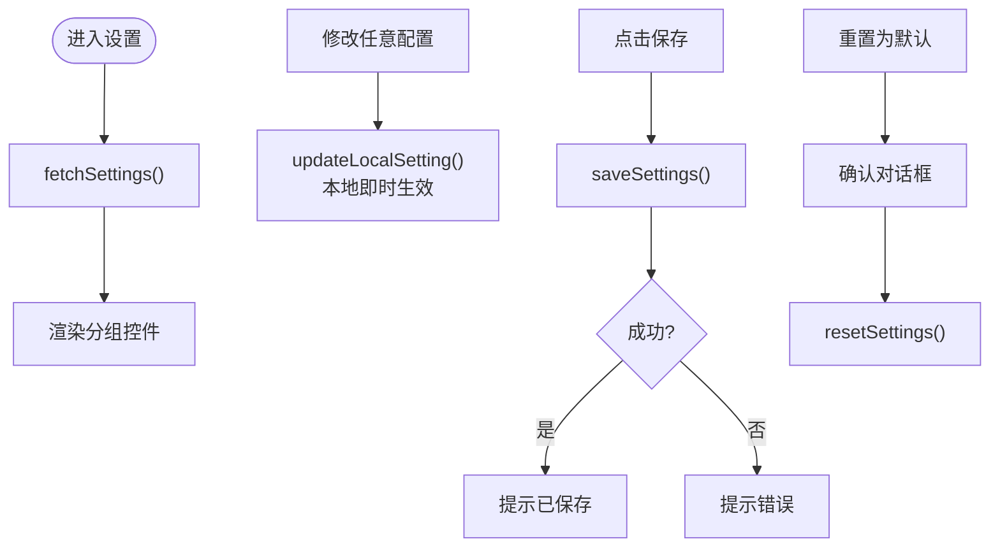
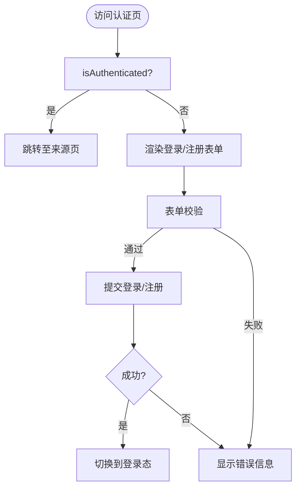
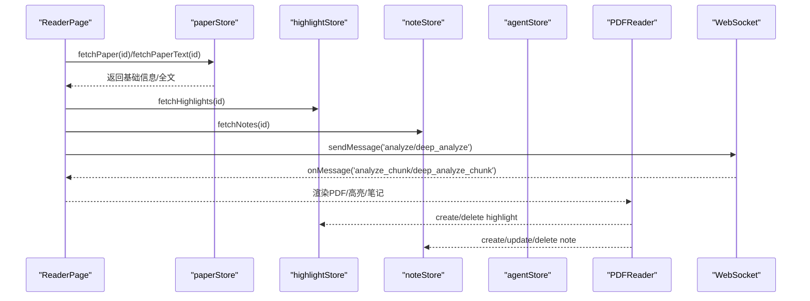
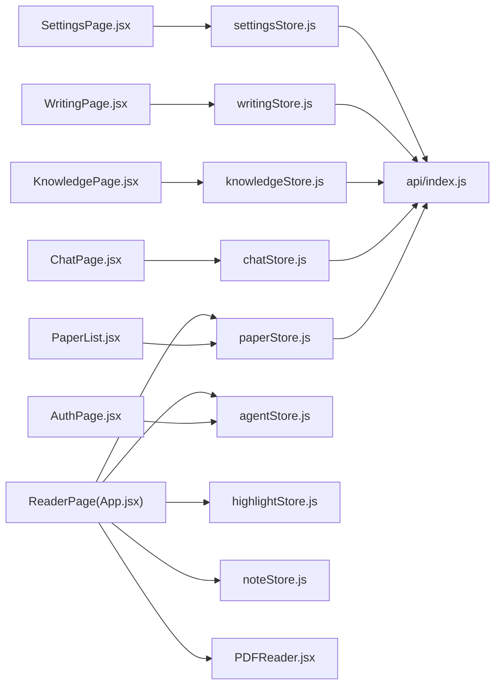

# 页面组件

<cite>
**本文引用的文件**
- [PaperList.jsx](file://frontend/src/pages/PaperList.jsx)
- [ChatPage.jsx](file://frontend/src/pages/ChatPage.jsx)
- [KnowledgePage.jsx](file://frontend/src/pages/KnowledgePage.jsx)
- [WritingPage.jsx](file://frontend/src/pages/WritingPage.jsx)
- [SettingsPage.jsx](file://frontend/src/pages/SettingsPage.jsx)
- [AuthPage.jsx](file://frontend/src/pages/AuthPage.jsx)
- [App.jsx](file://frontend/src/App.jsx)
- [paperStore.js](file://frontend/src/stores/paperStore.js)
- [chatStore.js](file://frontend/src/stores/chatStore.js)
- [knowledgeStore.js](file://frontend/src/stores/knowledgeStore.js)
- [writingStore.js](file://frontend/src/stores/writingStore.js)
- [settingsStore.js](file://frontend/src/stores/settingsStore.js)
- [authStore.js](file://frontend/src/stores/authStore.js)
- [PDFReader.jsx](file://frontend/src/components/PDFReader/PDFReader.jsx)
- [index.js](file://frontend/src/api/index.js)
</cite>

## 目录
1. [简介](#简介)
2. [项目结构](#项目结构)
3. [核心组件](#核心组件)
4. [架构总览](#架构总览)
5. [详细组件分析](#详细组件分析)
6. [依赖分析](#依赖分析)
7. [性能考量](#性能考量)
8. [故障排查指南](#故障排查指南)
9. [结论](#结论)
10. [附录](#附录)

## 简介
本技术文档面向 PaperChat 的页面组件系统，覆盖论文列表页、聊天页、知识库页、写作页、设置页与认证页六大页面，系统阐述其设计理念、实现细节、数据流与状态管理、用户交互逻辑、页面间导航与数据传递、生命周期管理、错误处理与性能优化策略，并提供测试与调试建议及与底层组件的集成模式。

## 项目结构
前端采用 React + Zustand + Vite 架构，页面组件位于 frontend/src/pages，状态管理位于 frontend/src/stores，核心 API 客户端位于 frontend/src/api，页面通过懒加载与 Suspense 提升首屏性能；阅读器与高亮等核心能力封装在 components 中，供阅读页复用。

图表来源
- [App.jsx:25-31](file://frontend/src/App.jsx#L25-L31)
- [PaperList.jsx:45-59](file://frontend/src/pages/PaperList.jsx#L45-L59)
- [ChatPage.jsx:22-51](file://frontend/src/pages/ChatPage.jsx#L22-L51)
- [KnowledgePage.jsx:33-50](file://frontend/src/pages/KnowledgePage.jsx#L33-L50)
- [WritingPage.jsx:1-7](file://frontend/src/pages/WritingPage.jsx#L1-L7)
- [SettingsPage.jsx:212-224](file://frontend/src/pages/SettingsPage.jsx#L212-L224)
- [AuthPage.jsx:6-11](file://frontend/src/pages/AuthPage.jsx#L6-L11)
- [paperStore.js:4-357](file://frontend/src/stores/paperStore.js#L4-L357)
- [chatStore.js:4-417](file://frontend/src/stores/chatStore.js#L4-L417)
- [knowledgeStore.js:4-422](file://frontend/src/stores/knowledgeStore.js#L4-L422)
- [writingStore.js:4-275](file://frontend/src/stores/writingStore.js#L4-L275)
- [settingsStore.js:9-131](file://frontend/src/stores/settingsStore.js#L9-L131)
- [authStore.js:3-23](file://frontend/src/stores/authStore.js#L3-L23)
- [PDFReader.jsx:13-24](file://frontend/src/components/PDFReader/PDFReader.jsx#L13-L24)
- [index.js:1-12](file://frontend/src/api/index.js#L1-L12)

章节来源
- [App.jsx:25-31](file://frontend/src/App.jsx#L25-L31)
- [index.js:1-12](file://frontend/src/api/index.js#L1-L12)

## 核心组件
- 论文列表页：负责论文上传、分页、筛选、搜索、删除与个性化推荐展示，使用纸张仓库与拖拽上传。
- 聊天页：提供会话管理、消息流式渲染、跨文档问答、联网搜索开关、意图识别与来源标注。
- 知识库页：卡片列表、网格/列表视图、标签云、分类与来源筛选、创建/编辑/删除卡片。
- 写作页：大纲生成、段落生成、文本润色、引用格式生成、论文对比分析（SSE 流式解析）。
- 设置页：主题、字体、紧凑模式、LLM/RAG/搜索/推荐等多组配置项的可视化与持久化。
- 认证页：登录/注册切换、表单校验、错误提示与跳转。
- 阅读页：三栏布局（解析/笔记/推荐），PDF 阅读器、高亮、笔记、关键词与分析结果联动。

章节来源
- [PaperList.jsx:45-431](file://frontend/src/pages/PaperList.jsx#L45-L431)
- [ChatPage.jsx:22-436](file://frontend/src/pages/ChatPage.jsx#L22-L436)
- [KnowledgePage.jsx:33-429](file://frontend/src/pages/KnowledgePage.jsx#L33-L429)
- [WritingPage.jsx:1-1156](file://frontend/src/pages/WritingPage.jsx#L1-L1156)
- [SettingsPage.jsx:212-330](file://frontend/src/pages/SettingsPage.jsx#L212-L330)
- [AuthPage.jsx:6-245](file://frontend/src/pages/AuthPage.jsx#L6-L245)
- [App.jsx:60-757](file://frontend/src/App.jsx#L60-L757)

## 架构总览
页面组件通过路由懒加载与 Suspense 提升首屏性能；状态管理采用 Zustand，按功能域拆分 Store；API 通过 axios 实例统一管理；阅读器组件复用性强，贯穿论文解析与笔记高亮。

图表来源
- [App.jsx:25-31](file://frontend/src/App.jsx#L25-L31)
- [index.js:1-12](file://frontend/src/api/index.js#L1-L12)
- [paperStore.js:21-47](file://frontend/src/stores/paperStore.js#L21-L47)
- [chatStore.js:22-41](file://frontend/src/stores/chatStore.js#L22-L41)
- [knowledgeStore.js:40-74](file://frontend/src/stores/knowledgeStore.js#L40-L74)
- [writingStore.js:36-97](file://frontend/src/stores/writingStore.js#L36-L97)
- [settingsStore.js:18-39](file://frontend/src/stores/settingsStore.js#L18-L39)

## 详细组件分析

### 论文列表页（PaperList）
- 设计理念：以“上传-阅读-管理”为主线，提供拖拽上传、分页筛选、搜索与删除，辅以个性化推荐增强发现体验。
- 数据流与状态管理：
  - 使用 paperStore 进行论文列表、上传、删除、推荐等操作。
  - 本地状态维护搜索词、分类、阅读状态、分页、上传进度与模态框。
- 用户交互：
  - 搜索防抖（300ms）、拖拽上传、分页导航、删除二次确认、批量导入。
- 生命周期与错误处理：
  - 首次加载与筛选变化触发列表刷新；错误通过 banner 展示并提供清除。
- 性能优化：
  - 列表分页（每页固定数量）、搜索防抖、推荐异步加载。

图表来源
- [PaperList.jsx:72-96](file://frontend/src/pages/PaperList.jsx#L72-L96)
- [PaperList.jsx:98-108](file://frontend/src/pages/PaperList.jsx#L98-L108)
- [PaperList.jsx:110-127](file://frontend/src/pages/PaperList.jsx#L110-L127)
- [PaperList.jsx:136-144](file://frontend/src/pages/PaperList.jsx#L136-L144)
- [paperStore.js:21-47](file://frontend/src/stores/paperStore.js#L21-L47)

章节来源
- [PaperList.jsx:45-431](file://frontend/src/pages/PaperList.jsx#L45-L431)
- [paperStore.js:4-357](file://frontend/src/stores/paperStore.js#L4-L357)

### 聊天页（ChatPage）
- 设计理念：围绕“会话-消息-来源”的核心闭环，支持单/跨文档问答、联网搜索、意图识别与流式输出。
- 数据流与状态管理：
  - chatStore 管理会话、消息、来源、跨文档模式、联网搜索状态。
  - WebSocket hook 与 useChatMessages hook 协同处理流式消息与停止生成。
- 用户交互：
  - 输入框自动增高、Shift+Enter 换行、Enter 发送、停止生成、论文选择器、建议问题。
- 生命周期与错误处理：
  - 初始化加载会话与论文；发送前校验状态；WS 断连时禁用发送。
- 性能优化：
  - Typewriter 钩子增量渲染；消息末尾自动滚动；跨文档模式下来源聚合。

图表来源
- [ChatPage.jsx:161-190](file://frontend/src/pages/ChatPage.jsx#L161-L190)
- [ChatPage.jsx:80-130](file://frontend/src/pages/ChatPage.jsx#L80-L130)
- [chatStore.js:395-413](file://frontend/src/stores/chatStore.js#L395-L413)

章节来源
- [ChatPage.jsx:22-436](file://frontend/src/pages/ChatPage.jsx#L22-L436)
- [chatStore.js:4-417](file://frontend/src/stores/chatStore.js#L4-L417)

### 知识库页（KnowledgePage）
- 设计理念：以卡片为中心的知识管理，支持网格/列表视图、标签云、分类与来源筛选、创建/编辑/删除。
- 数据流与状态管理：
  - knowledgeStore 管理卡片列表、分页、筛选、统计、搜索与关系。
  - 本地状态维护编辑器开闭、视图模式、搜索词与过滤器。
- 用户交互：
  - 搜索防抖、筛选器联动、分页导航、视图切换、卡片编辑弹窗。
- 生命周期与错误处理：
  - 首次加载统计与卡片；错误时提供重试按钮。
- 性能优化：
  - 分页加载、标签云动态排序、列表/网格切换减少 DOM 重排。

图表来源
- [KnowledgePage.jsx:57-61](file://frontend/src/pages/KnowledgePage.jsx#L57-L61)
- [KnowledgePage.jsx:63-71](file://frontend/src/pages/KnowledgePage.jsx#L63-L71)
- [KnowledgePage.jsx:109-123](file://frontend/src/pages/KnowledgePage.jsx#L109-L123)
- [knowledgeStore.js:40-74](file://frontend/src/stores/knowledgeStore.js#L40-L74)

章节来源
- [KnowledgePage.jsx:33-429](file://frontend/src/pages/KnowledgePage.jsx#L33-L429)
- [knowledgeStore.js:4-422](file://frontend/src/stores/knowledgeStore.js#L4-L422)

### 写作页（WritingPage）
- 设计理念：提供“大纲-段落-润色-引用-对比”五步写作流程，支持流式生成与对比分析。
- 数据流与状态管理：
  - writingStore 管理大纲、草稿、润色文本、引用列表、生成状态与流式内容。
  - paperStore 提供论文列表用于选择参考。
- 用户交互：
  - 大纲/段落/润色/引用/对比五个 Tab，支持导出、复制、对比视图。
- 生命周期与错误处理：
  - 流式生成通过 fetch + ReadableStream 解析；对比分析通过 SSE 解析 JSON 行。
- 性能优化：
  - 流式增量渲染；对比分析按行解析，避免一次性解析大块文本。

图表来源
- [WritingPage.jsx:36-184](file://frontend/src/pages/WritingPage.jsx#L36-L184)
- [WritingPage.jsx:186-298](file://frontend/src/pages/WritingPage.jsx#L186-L298)
- [WritingPage.jsx:300-414](file://frontend/src/pages/WritingPage.jsx#L300-L414)
- [WritingPage.jsx:416-559](file://frontend/src/pages/WritingPage.jsx#L416-L559)
- [WritingPage.jsx:561-800](file://frontend/src/pages/WritingPage.jsx#L561-L800)
- [writingStore.js:36-97](file://frontend/src/stores/writingStore.js#L36-L97)
- [writingStore.js:99-160](file://frontend/src/stores/writingStore.js#L99-L160)
- [writingStore.js:162-222](file://frontend/src/stores/writingStore.js#L162-L222)
- [writingStore.js:224-242](file://frontend/src/stores/writingStore.js#L224-L242)

章节来源
- [WritingPage.jsx:1-1156](file://frontend/src/pages/WritingPage.jsx#L1-L1156)
- [writingStore.js:4-275](file://frontend/src/stores/writingStore.js#L4-L275)
- [paperStore.js:49-63](file://frontend/src/stores/paperStore.js#L49-L63)

### 设置页（SettingsPage）
- 设计理念：将系统配置按组组织，提供滑块、数字、下拉、文本、密码、开关、主题等多种控件，支持本地即时生效与远程持久化。
- 数据流与状态管理：
  - settingsStore 管理完整配置树、待保存变更、保存/重置流程与提示。
  - 本地存储同步外观设置，避免主题闪烁。
- 用户交互：
  - 分组卡片、控件联动、保存/重置、提示消息。
- 生命周期与错误处理：
  - 加载失败提供重试；保存/重置前后端交互并同步本地存储。
- 性能优化：
  - 控件级本地更新，批量提交，减少网络往返。

图表来源
- [SettingsPage.jsx:212-330](file://frontend/src/pages/SettingsPage.jsx#L212-L330)
- [settingsStore.js:18-39](file://frontend/src/stores/settingsStore.js#L18-L39)
- [settingsStore.js:63-94](file://frontend/src/stores/settingsStore.js#L63-L94)
- [settingsStore.js:96-125](file://frontend/src/stores/settingsStore.js#L96-L125)

章节来源
- [SettingsPage.jsx:1-330](file://frontend/src/pages/SettingsPage.jsx#L1-L330)
- [settingsStore.js:9-131](file://frontend/src/stores/settingsStore.js#L9-L131)

### 认证页（AuthPage）
- 设计理念：简化登录/注册流程，提供表单校验、错误提示与自动跳转。
- 数据流与状态管理：
  - authStore 在单用户模式下始终视为已登录，保留兼容性方法。
- 用户交互：
  - Tab 切换、表单校验、提交按钮禁用状态。
- 生命周期与错误处理：
  - 已登录自动跳转；首次进入清除错误；切换模式重置表单。
- 性能优化：
  - 无网络请求，纯前端状态切换。

图表来源
- [AuthPage.jsx:22-28](file://frontend/src/pages/AuthPage.jsx#L22-L28)
- [AuthPage.jsx:43-65](file://frontend/src/pages/AuthPage.jsx#L43-L65)
- [AuthPage.jsx:67-97](file://frontend/src/pages/AuthPage.jsx#L67-L97)
- [authStore.js:3-23](file://frontend/src/stores/authStore.js#L3-L23)

章节来源
- [AuthPage.jsx:1-245](file://frontend/src/pages/AuthPage.jsx#L1-L245)
- [authStore.js:3-23](file://frontend/src/stores/authStore.js#L3-L23)

### 阅读页（App.jsx 中的 ReaderPage）
- 设计理念：三栏布局（解析/笔记/推荐）+ PDF 阅读器，支持高亮、笔记、关键词与分析结果联动。
- 数据流与状态管理：
  - paperStore 提供论文元数据、全文文本、分析缓存与推荐。
  - highlightStore/noteStore 管理高亮与笔记。
  - agentStore 管理分析任务意图与步骤。
- 用户交互：
  - 分析按钮（章节概述/深度分析）、拖拽调整面板宽度、笔记编辑弹窗。
- 生命周期与错误处理：
  - 并行加载论文文本与分析缓存；清理时保留分析结果以便返回恢复。
- 性能优化：
  - 并行请求、增量解析 JSON 行、流式渲染。

图表来源
- [App.jsx:309-419](file://frontend/src/App.jsx#L309-L419)
- [App.jsx:134-307](file://frontend/src/App.jsx#L134-L307)
- [PDFReader.jsx:13-24](file://frontend/src/components/PDFReader/PDFReader.jsx#L13-L24)

章节来源
- [App.jsx:60-757](file://frontend/src/App.jsx#L60-L757)
- [PDFReader.jsx:1-200](file://frontend/src/components/PDFReader/PDFReader.jsx#L1-L200)

## 依赖分析
- 页面到 Store：各页面通过 useXxxStore 访问状态与动作，形成单向数据流。
- Store 到 API：store 内部封装 HTTP 请求，集中处理错误与 loading。
- 页面到组件：阅读页复用 PDFReader、ExplanationPanel、NotePanel 等组件。
- 路由懒加载：主应用对页面组件进行懒加载，提升首屏性能。

图表来源
- [PaperList.jsx:4-7](file://frontend/src/pages/PaperList.jsx#L4-L7)
- [ChatPage.jsx:2-4](file://frontend/src/pages/ChatPage.jsx#L2-L4)
- [KnowledgePage.jsx:2-5](file://frontend/src/pages/KnowledgePage.jsx#L2-L5)
- [WritingPage.jsx:1-7](file://frontend/src/pages/WritingPage.jsx#L1-L7)
- [SettingsPage.jsx:1-3](file://frontend/src/pages/SettingsPage.jsx#L1-L3)
- [AuthPage.jsx:1-4](file://frontend/src/pages/AuthPage.jsx#L1-L4)
- [App.jsx:60-104](file://frontend/src/App.jsx#L60-L104)
- [PDFReader.jsx:1-9](file://frontend/src/components/PDFReader/PDFReader.jsx#L1-L9)
- [index.js:1-12](file://frontend/src/api/index.js#L1-L12)

章节来源
- [App.jsx:60-104](file://frontend/src/App.jsx#L60-L104)
- [index.js:1-12](file://frontend/src/api/index.js#L1-L12)

## 性能考量
- 懒加载与 Suspense：页面组件懒加载，配合骨架屏提升首屏体验。
- 并行加载：阅读页并行获取文本与分析缓存，减少等待时间。
- 流式渲染：聊天与写作均采用流式增量渲染，降低首帧延迟。
- 防抖与分页：搜索与分页减少无效请求与渲染压力。
- 本地存储：设置页将外观配置写入 localStorage，避免闪烁与重复请求。

## 故障排查指南
- 认证页：
  - 已登录自动跳转：检查 isAuthenticated 状态与来源路径。
  - 表单校验失败：关注字段必填与密码长度规则。
- 论文列表页：
  - 上传失败：检查文件类型、大小限制与后端返回错误。
  - 删除失败：确认权限与网络状态。
- 聊天页：
  - 发送失败：检查 WebSocket 连接状态与 isChatting 标志。
  - 停止生成：确认 sendCancel 是否被调用且消息末尾追加提示。
- 知识库页：
  - 加载失败：查看错误提示并重试；确认筛选条件。
- 写作页：
  - 流式解析异常：检查 SSE 数据格式与 JSON 行解析逻辑。
  - 对比分析失败：确认至少选择 2 篇论文与后端服务可用。
- 设置页：
  - 保存失败：检查 pendingChanges 与后端返回错误。
- 阅读页：
  - PDF 加载失败：检查文件 URL 与 worker 配置。
  - 分析结果不显示：确认 WebSocket 连接与消息通道。

章节来源
- [AuthPage.jsx:22-28](file://frontend/src/pages/AuthPage.jsx#L22-L28)
- [PaperList.jsx:110-127](file://frontend/src/pages/PaperList.jsx#L110-L127)
- [ChatPage.jsx:161-190](file://frontend/src/pages/ChatPage.jsx#L161-L190)
- [KnowledgePage.jsx:209-219](file://frontend/src/pages/KnowledgePage.jsx#L209-L219)
- [WritingPage.jsx:607-702](file://frontend/src/pages/WritingPage.jsx#L607-L702)
- [settingsStore.js:63-94](file://frontend/src/stores/settingsStore.js#L63-L94)
- [PDFReader.jsx:62-67](file://frontend/src/components/PDFReader/PDFReader.jsx#L62-L67)

## 结论
PaperChat 页面组件系统以清晰的职责划分与状态管理实现了高效、可扩展的用户体验。页面间通过路由与共享 Store 实现松耦合集成，阅读器组件复用性强，写作与聊天场景充分利用流式渲染提升交互效率。建议持续优化网络错误兜底与性能监控，进一步完善测试覆盖与调试工具链。

## 附录
- 测试方法建议：
  - 页面组件：使用 React Testing Library 模拟 Store 与路由，验证渲染与交互。
  - Store：使用 Jest mock API，断言状态变更与副作用。
  - 阅读器：模拟 PDF 文件与高亮事件，验证坐标转换与工具栏显示。
  - 写作页：mock SSE/ReadableStream，验证增量渲染与错误处理。
- 调试技巧：
  - 在浏览器开发者工具中观察网络面板与 WebSocket 事件。
  - 在控制台打印关键状态变化，定位异步流程问题。
  - 使用 React DevTools Profiler 分析渲染热点。