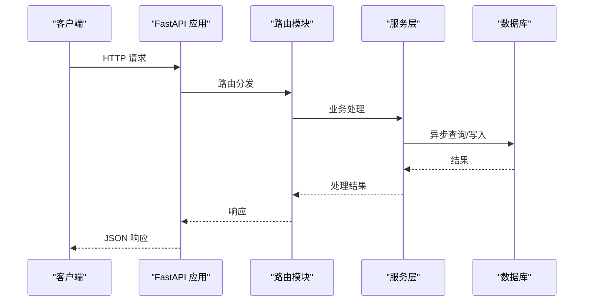
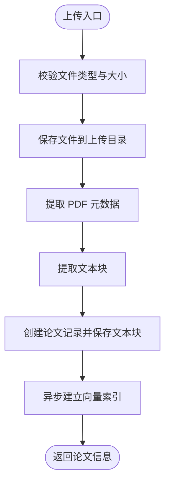
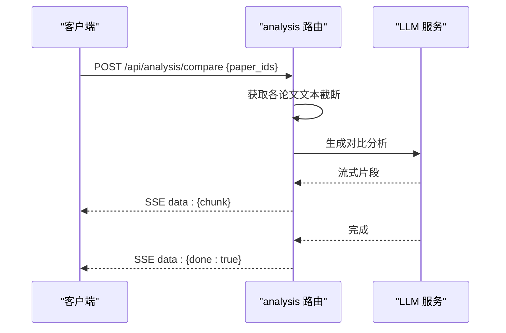
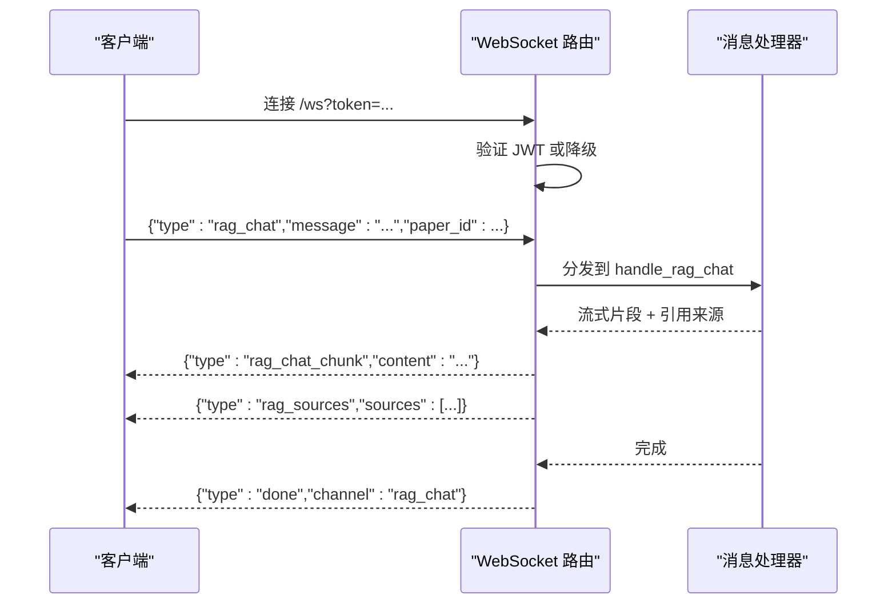
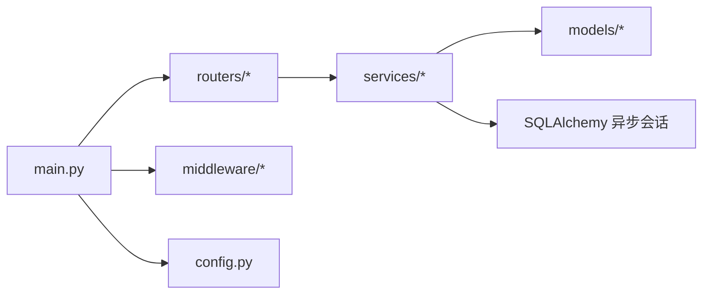

# API 路由系统

<cite>
**本文档引用的文件**
- [backend/app/main.py](file://backend/app/main.py)
- [backend/app/routers/__init__.py](file://backend/app/routers/__init__.py)
- [backend/app/middleware/error_handler.py](file://backend/app/middleware/error_handler.py)
- [backend/app/routers/papers.py](file://backend/app/routers/papers.py)
- [backend/app/routers/chat.py](file://backend/app/routers/chat.py)
- [backend/app/routers/auth.py](file://backend/app/routers/auth.py)
- [backend/app/routers/highlights.py](file://backend/app/routers/highlights.py)
- [backend/app/routers/knowledge.py](file://backend/app/routers/knowledge.py)
- [backend/app/routers/notes.py](file://backend/app/routers/notes.py)
- [backend/app/routers/writing.py](file://backend/app/routers/writing.py)
- [backend/app/routers/recommendations.py](file://backend/app/routers/recommendations.py)
- [backend/app/routers/settings.py](file://backend/app/routers/settings.py)
- [backend/app/routers/reading.py](file://backend/app/routers/reading.py)
- [backend/app/routers/analysis.py](file://backend/app/routers/analysis.py)
- [backend/app/routers/ws.py](file://backend/app/routers/ws.py)
- [backend/app/routers/feedback.py](file://backend/app/routers/feedback.py)
- [backend/app/config.py](file://backend/app/config.py)
</cite>

## 目录
1. [简介](#简介)
2. [项目结构](#项目结构)
3. [核心组件](#核心组件)
4. [架构总览](#架构总览)
5. [详细组件分析](#详细组件分析)
6. [依赖分析](#依赖分析)
7. [性能考虑](#性能考虑)
8. [故障排除指南](#故障排除指南)
9. [结论](#结论)
10. [附录](#附录)

## 简介
本文件系统性梳理 PaperChat 的 FastAPI 路由体系，覆盖论文管理、智能分析、问答系统、高亮标注、知识库、写作辅助、推荐系统、设置管理、阅读辅助、分析服务、用户认证以及 WebSocket 实时通信等模块。文档重点阐述：
- 路由分组策略与命名空间组织
- 中间件与全局异常处理集成
- 权限控制与用户认证流程
- 各模块的 HTTP 方法、URL 模式、请求参数、响应格式与错误处理
- 测试与调试建议

## 项目结构
PaperChat 后端采用 FastAPI + SQLAlchemy + 异步数据库驱动的现代化架构。路由按功能域拆分为独立模块，通过统一入口集中注册，配合全局中间件与异常处理，形成清晰的分层与职责分离。

```mermaid
graph TB
subgraph "应用入口"
MAIN["main.py<br/>创建 FastAPI 应用<br/>注册中间件与路由"]
CONFIG["config.py<br/>应用配置"]
end
subgraph "中间件"
ERR["middleware/error_handler.py<br/>全局异常处理"]
end
subgraph "路由模块"
AUTH["routers/auth.py<br/>认证"]
PAPERS["routers/papers.py<br/>论文管理"]
CHAT["routers/chat.py<br/>会话与消息"]
HIGHLIGHTS["routers/highlights.py<br/>高亮标注"]
NOTES["routers/notes.py<br/>笔记"]
KNOWLEDGE["routers/knowledge.py<br/>知识库"]
WRITING["routers/writing.py<br/>写作辅助"]
RECOMM["routers/recommendations.py<br/>推荐系统"]
SETTINGS["routers/settings.py<br/>设置管理"]
READING["routers/reading.py<br/>阅读辅助"]
ANALYSIS["routers/analysis.py<br/>分析服务"]
FEEDBACK["routers/feedback.py<br/>反馈"]
WS["routers/ws.py<br/>WebSocket"]
end
MAIN --> ERR
MAIN --> AUTH
MAIN --> PAPERS
MAIN --> CHAT
MAIN --> HIGHLIGHTS
MAIN --> NOTES
MAIN --> KNOWLEDGE
MAIN --> WRITING
MAIN --> RECOMM
MAIN --> SETTINGS
MAIN --> READING
MAIN --> ANALYSIS
MAIN --> FEEDBACK
MAIN --> WS
MAIN --> CONFIG
```

**图表来源**
- [backend/app/main.py:55-95](file://backend/app/main.py#L55-L95)
- [backend/app/routers/__init__.py:1-27](file://backend/app/routers/__init__.py#L1-L27)
- [backend/app/middleware/error_handler.py:73-92](file://backend/app/middleware/error_handler.py#L73-L92)

**章节来源**
- [backend/app/main.py:1-114](file://backend/app/main.py#L1-L114)
- [backend/app/routers/__init__.py:1-27](file://backend/app/routers/__init__.py#L1-L27)
- [backend/app/config.py:15-44](file://backend/app/config.py#L15-L44)

## 核心组件
- 应用入口与生命周期
  - 通过异步生命周期管理数据库初始化、默认用户配置加载与关闭。
  - 注册全局 CORS 中间件与统一异常处理。
  - 集中注册所有路由模块，提供健康检查端点。
- 中间件与异常处理
  - 统一处理 Pydantic 参数校验、HTTP 异常、SQLAlchemy 数据库异常与通用异常，返回结构化错误响应。
- 路由分组与命名空间
  - 每个功能域独立模块，使用前缀与标签组织，便于维护与扩展。
- 权限控制
  - 通过依赖注入获取当前用户，结合数据库权限校验，确保资源隔离与安全访问。

**章节来源**
- [backend/app/main.py:16-53](file://backend/app/main.py#L16-L53)
- [backend/app/main.py:70-95](file://backend/app/main.py#L70-L95)
- [backend/app/middleware/error_handler.py:11-92](file://backend/app/middleware/error_handler.py#L11-L92)

## 架构总览
PaperChat 的路由架构遵循“模块化 + 分层”的设计原则：
- 路由层：按功能域划分，每个模块导出独立的 APIRouter 实例。
- 业务层：服务层封装具体业务逻辑（如 LLM、RAG、推荐、知识图谱等）。
- 数据层：异步 SQLAlchemy 会话管理，支持复杂查询与事务。
- 中间件层：CORS、异常处理、权限校验等横切关注点。
- WebSocket 层：统一消息路由与任务调度，支持并发与取消。

**图表来源**
- [backend/app/main.py:82-93](file://backend/app/main.py#L82-L93)
- [backend/app/routers/papers.py:156-262](file://backend/app/routers/papers.py#L156-L262)
- [backend/app/routers/chat.py:68-118](file://backend/app/routers/chat.py#L68-L118)

## 详细组件分析

### 论文管理路由（papers）
- 功能概览
  - 支持论文上传（单文件/批量/ZIP）、PDF 元数据与文本块解析、全文检索、文件下载、文本与块级内容获取、阅读状态更新、批量上传统计。
- 路由与方法
  - GET /api/papers：分页查询论文列表（支持搜索、分类、阅读状态筛选）
  - POST /api/papers/upload：上传单篇 PDF
  - POST /api/papers/batch-upload：批量上传 PDF
  - POST /api/papers/batch-upload-zip：从 ZIP 批量导入
  - GET /api/papers/{paper_id}：获取论文详情
  - PUT /api/papers/{paper_id}：更新论文信息
  - DELETE /api/papers/{paper_id}：删除论文（级联删除）
  - PATCH /api/papers/{paper_id}/reading-status：更新阅读状态与时间
  - GET /api/papers/{paper_id}/file：下载 PDF 文件
  - GET /api/papers/{paper_id}/text：获取论文文本（可按页筛选）
  - GET /api/papers/{paper_id}/blocks：获取文本块（带坐标）
- 权限与安全
  - 所有操作均通过依赖注入获取当前用户，并校验论文归属。
- 错误处理
  - 文件类型/大小限制、解析失败、数据库异常等均有明确的 HTTP 状态码与错误信息。
- 响应格式
  - 使用 Pydantic 模型序列化响应，如 PaperResponse、PaperListResponse、BatchUploadResponse 等。

**图表来源**
- [backend/app/routers/papers.py:156-262](file://backend/app/routers/papers.py#L156-L262)
- [backend/app/routers/papers.py:521-647](file://backend/app/routers/papers.py#L521-L647)
- [backend/app/routers/papers.py:649-800](file://backend/app/routers/papers.py#L649-L800)

**章节来源**
- [backend/app/routers/papers.py:91-154](file://backend/app/routers/papers.py#L91-L154)
- [backend/app/routers/papers.py:156-262](file://backend/app/routers/papers.py#L156-L262)
- [backend/app/routers/papers.py:264-463](file://backend/app/routers/papers.py#L264-L463)
- [backend/app/routers/papers.py:465-519](file://backend/app/routers/papers.py#L465-L519)
- [backend/app/routers/papers.py:521-647](file://backend/app/routers/papers.py#L521-L647)
- [backend/app/routers/papers.py:649-800](file://backend/app/routers/papers.py#L649-L800)

### 智能分析路由（analysis）
- 功能概览
  - 多论文对比分析与文献综述生成，支持流式返回。
- 路由与方法
  - POST /api/analysis/compare：多论文对比分析（SSE）
  - POST /api/analysis/review：文献综述生成（SSE）
- 请求参数
  - paper_ids：论文 ID 列表（2-10 篇）
- 响应格式
  - SSE 流式响应，逐块返回 JSON 片段，结束时发送 done 标记。
- 错误处理
  - 论文数量限制、内容截断、LLM 生成异常等。

**图表来源**
- [backend/app/routers/analysis.py:88-149](file://backend/app/routers/analysis.py#L88-L149)
- [backend/app/routers/analysis.py:152-214](file://backend/app/routers/analysis.py#L152-L214)

**章节来源**
- [backend/app/routers/analysis.py:88-149](file://backend/app/routers/analysis.py#L88-L149)
- [backend/app/routers/analysis.py:152-214](file://backend/app/routers/analysis.py#L152-L214)

### 问答系统路由（chat）
- 功能概览
  - 会话管理（创建、查询、更新、删除），消息查询（分页），跨文档会话，单论文默认会话获取。
- 路由与方法
  - GET /api/chat/sessions：获取会话列表（可按论文筛选）
  - POST /api/chat/sessions：创建会话（支持单论文或跨文档）
  - GET /api/chat/sessions/{session_id}：获取会话详情（含消息历史）
  - GET /api/chat/sessions/{session_id}/messages：分页获取消息
  - PUT /api/chat/sessions/{session_id}：更新会话标题
  - DELETE /api/chat/sessions/{session_id}：删除会话
  - GET /api/chat/sessions/by-paper/{paper_id}：获取或创建默认会话
  - POST /api/chat/sessions/cross-doc：创建跨文档会话
- 权限与安全
  - 严格校验会话归属与论文权限。
- 响应格式
  - 统一返回结构化 JSON，包含消息计数、跨文档标识、时间戳等。

**章节来源**
- [backend/app/routers/chat.py:21-65](file://backend/app/routers/chat.py#L21-L65)
- [backend/app/routers/chat.py:68-119](file://backend/app/routers/chat.py#L68-L119)
- [backend/app/routers/chat.py:121-172](file://backend/app/routers/chat.py#L121-L172)
- [backend/app/routers/chat.py:174-225](file://backend/app/routers/chat.py#L174-L225)
- [backend/app/routers/chat.py:227-293](file://backend/app/routers/chat.py#L227-L293)
- [backend/app/routers/chat.py:295-352](file://backend/app/routers/chat.py#L295-L352)
- [backend/app/routers/chat.py:354-417](file://backend/app/routers/chat.py#L354-L417)

### 高亮标注路由（highlights）
- 功能概览
  - 论文高亮标注的增删改查，支持颜色、类型、选中文本等属性。
- 路由与方法
  - GET /api/highlights/paper/{paper_id}：获取论文所有高亮
  - POST /api/highlights：创建高亮
  - PUT /api/highlights/{highlight_id}：更新高亮
  - DELETE /api/highlights/{highlight_id}：删除高亮
- 权限与安全
  - 校验论文归属与高亮所有权。

**章节来源**
- [backend/app/routers/highlights.py:20-55](file://backend/app/routers/highlights.py#L20-L55)
- [backend/app/routers/highlights.py:58-106](file://backend/app/routers/highlights.py#L58-L106)
- [backend/app/routers/highlights.py:108-152](file://backend/app/routers/highlights.py#L108-L152)
- [backend/app/routers/highlights.py:154-187](file://backend/app/routers/highlights.py#L154-L187)

### 知识库路由（knowledge）
- 功能概览
  - 知识卡片的 CRUD、搜索、自动标签、关系管理、知识图谱与统计信息。
- 路由与方法
  - GET /api/knowledge/cards：分页查询卡片（支持筛选与搜索）
  - POST /api/knowledge/cards：创建卡片
  - GET /api/knowledge/cards/{card_id}：获取卡片详情
  - PUT /api/knowledge/cards/{card_id}：更新卡片
  - DELETE /api/knowledge/cards/{card_id}：删除卡片
  - POST /api/knowledge/cards/from-highlight/{highlight_id}：从高亮提取卡片
  - POST /api/knowledge/cards/from-chat：从问答提取卡片
  - GET /api/knowledge/search：全局搜索卡片
  - GET /api/knowledge/cards/{card_id}/relations：获取卡片关系
  - POST /api/knowledge/cards/{card_id}/find-relations：自动发现关系
  - POST /api/knowledge/relations：创建关系
  - DELETE /api/knowledge/relations/{relation_id}：删除关系
  - GET /api/knowledge/graph：获取知识图谱数据
  - GET /api/knowledge/stats：获取统计信息
  - POST /api/knowledge/cards/{card_id}/auto-tag：自动生成标签
- 权限与安全
  - 所有操作均校验卡片归属与用户权限。
- 响应格式
  - 使用 Pydantic 模型定义响应结构，如 KnowledgeCardResponse、KnowledgeRelationResponse、GraphDataResponse、StatsResponse 等。

**章节来源**
- [backend/app/routers/knowledge.py:130-192](file://backend/app/routers/knowledge.py#L130-L192)
- [backend/app/routers/knowledge.py:194-222](file://backend/app/routers/knowledge.py#L194-L222)
- [backend/app/routers/knowledge.py:224-245](file://backend/app/routers/knowledge.py#L224-L245)
- [backend/app/routers/knowledge.py:247-280](file://backend/app/routers/knowledge.py#L247-L280)
- [backend/app/routers/knowledge.py:282-309](file://backend/app/routers/knowledge.py#L282-L309)
- [backend/app/routers/knowledge.py:311-343](file://backend/app/routers/knowledge.py#L311-L343)
- [backend/app/routers/knowledge.py:345-357](file://backend/app/routers/knowledge.py#L345-L357)
- [backend/app/routers/knowledge.py:359-391](file://backend/app/routers/knowledge.py#L359-L391)
- [backend/app/routers/knowledge.py:393-409](file://backend/app/routers/knowledge.py#L393-L409)
- [backend/app/routers/knowledge.py:411-468](file://backend/app/routers/knowledge.py#L411-L468)
- [backend/app/routers/knowledge.py:470-497](file://backend/app/routers/knowledge.py#L470-L497)
- [backend/app/routers/knowledge.py:499-507](file://backend/app/routers/knowledge.py#L499-L507)
- [backend/app/routers/knowledge.py:509-517](file://backend/app/routers/knowledge.py#L509-L517)
- [backend/app/routers/knowledge.py:519-546](file://backend/app/routers/knowledge.py#L519-L546)

### 写作辅助路由（writing）
- 功能概览
  - 大纲生成、段落初稿、学术润色、引用格式生成，支持流式输出。
- 路由与方法
  - POST /api/writing/outline：生成论文大纲（SSE）
  - POST /api/writing/draft：生成段落初稿（SSE）
  - POST /api/writing/polish：学术润色（SSE）
  - POST /api/writing/citations：批量生成引用（非流式）
  - GET /api/writing/formats：获取支持的格式与类型列表
- 请求参数
  - OutlineRequest、DraftRequest、PolishRequest、CitationRequest
- 错误处理
  - 校验润色类型与引用格式的有效性。

**章节来源**
- [backend/app/routers/writing.py:72-109](file://backend/app/routers/writing.py#L72-L109)
- [backend/app/routers/writing.py:111-140](file://backend/app/routers/writing.py#L111-L140)
- [backend/app/routers/writing.py:142-185](file://backend/app/routers/writing.py#L142-L185)
- [backend/app/routers/writing.py:187-263](file://backend/app/routers/writing.py#L187-L263)
- [backend/app/routers/writing.py:265-287](file://backend/app/routers/writing.py#L265-L287)

### 推荐系统路由（recommendations）
- 功能概览
  - 相似论文推荐、个性化推荐、刷新缓存、网络搜索推荐。
- 路由与方法
  - GET /api/papers/{paper_id}/recommendations：相似论文推荐
  - GET /api/recommendations：个性化推荐
  - POST /api/papers/{paper_id}/recommendations/refresh：刷新推荐缓存
  - GET /api/papers/{paper_id}/web-recommendations：网络学术搜索
- 查询参数
  - top_k：返回数量（默认 5，最大 20）

**章节来源**
- [backend/app/routers/recommendations.py:18-76](file://backend/app/routers/recommendations.py#L18-L76)
- [backend/app/routers/recommendations.py:78-119](file://backend/app/routers/recommendations.py#L78-L119)
- [backend/app/routers/recommendations.py:121-178](file://backend/app/routers/recommendations.py#L121-L178)
- [backend/app/routers/recommendations.py:180-234](file://backend/app/routers/recommendations.py#L180-L234)

### 设置管理路由（settings）
- 功能概览
  - 获取/更新/重置用户配置；获取纯值配置。
- 路由与方法
  - GET /api/settings：获取完整配置（含元数据）
  - PUT /api/settings：更新配置并应用到运行时
  - POST /api/settings/reset：重置为默认值
  - GET /api/settings/values：获取纯值配置
- 响应格式
  - 返回配置字典，敏感信息（如 API Key）脱敏显示。

**章节来源**
- [backend/app/routers/settings.py:17-29](file://backend/app/routers/settings.py#L17-L29)
- [backend/app/routers/settings.py:31-63](file://backend/app/routers/settings.py#L31-L63)
- [backend/app/routers/settings.py:65-81](file://backend/app/routers/settings.py#L65-L81)
- [backend/app/routers/settings.py:83-94](file://backend/app/routers/settings.py#L83-L94)

### 阅读辅助路由（reading）
- 功能概览
  - 术语解释、文本摘要、翻译，均支持流式返回。
- 路由与方法
  - POST /api/reading/explain-term：术语解释（SSE）
  - POST /api/reading/summarize：文本摘要（SSE）
  - POST /api/reading/translate：文本翻译（SSE）
- 请求参数
  - ExplainRequest、SummarizeRequest、TranslateRequest
- 错误处理
  - 文本长度限制与异常捕获。

**章节来源**
- [backend/app/routers/reading.py:32-61](file://backend/app/routers/reading.py#L32-L61)
- [backend/app/routers/reading.py:63-95](file://backend/app/routers/reading.py#L63-L95)
- [backend/app/routers/reading.py:97-130](file://backend/app/routers/reading.py#L97-L130)

### 用户认证路由（auth）
- 功能概览
  - 用户注册、登录、登出、获取当前用户信息、更新个人信息。
- 路由与方法
  - POST /api/auth/register：注册（创建用户）
  - POST /api/auth/login：登录（返回 JWT Token）
  - POST /api/auth/logout：登出（客户端删除 token）
  - GET /api/auth/me：获取当前用户信息
  - PUT /api/auth/me：更新当前用户信息（邮箱、头像）
- 权限与安全
  - 登录使用 JWT，登出为无状态（客户端删除 token）。
- 响应格式
  - Token 模型包含 access_token、token_type、expires_in。

**章节来源**
- [backend/app/routers/auth.py:27-69](file://backend/app/routers/auth.py#L27-L69)
- [backend/app/routers/auth.py:71-119](file://backend/app/routers/auth.py#L71-L119)
- [backend/app/routers/auth.py:121-132](file://backend/app/routers/auth.py#L121-L132)
- [backend/app/routers/auth.py:134-145](file://backend/app/routers/auth.py#L134-L145)
- [backend/app/routers/auth.py:147-186](file://backend/app/routers/auth.py#L147-L186)

### WebSocket 路由（ws）
- 功能概览
  - 统一的实时通信端点，支持论文分析、问答、RAG、跨文档问答、Agent 问答、深度分析等。
- 路由与方法
  - WS /ws：WebSocket 端点，支持多种消息类型与任务取消。
- 消息类型
  - analyze、chat、rag_chat、deep_analyze、agent_chat、cross_doc_chat、unified_chat、cancel
- 响应格式
  - SSE 风格的消息类型与数据结构，包含 chunk、sources、search_status、done、error 等。
- 权限与安全
  - 支持 JWT 认证，无 token 时降级为默认用户。

**图表来源**
- [backend/app/routers/ws.py:76-102](file://backend/app/routers/ws.py#L76-L102)
- [backend/app/routers/ws.py:114-184](file://backend/app/routers/ws.py#L114-L184)
- [backend/app/routers/ws.py:185-251](file://backend/app/routers/ws.py#L185-L251)
- [backend/app/routers/ws.py:262-417](file://backend/app/routers/ws.py#L262-L417)

**章节来源**
- [backend/app/routers/ws.py:32-54](file://backend/app/routers/ws.py#L32-L54)
- [backend/app/routers/ws.py:76-102](file://backend/app/routers/ws.py#L76-L102)
- [backend/app/routers/ws.py:114-184](file://backend/app/routers/ws.py#L114-L184)
- [backend/app/routers/ws.py:185-251](file://backend/app/routers/ws.py#L185-L251)
- [backend/app/routers/ws.py:262-417](file://backend/app/routers/ws.py#L262-L417)

### 反馈路由（feedback）
- 功能概览
  - 对问答消息进行点赞/点踩与文字反馈；统计反馈数据；差评自动重跑。
- 路由与方法
  - POST /api/feedback/：提交反馈
  - GET /api/feedback/stats：获取反馈统计
  - GET /api/feedback/message/{message_id}：获取指定消息的反馈
  - POST /api/feedback/regenerate/{message_id}：负面反馈自动重跑
  - GET /api/feedback/history：获取反馈历史
- 权限与安全
  - 校验消息归属与用户权限。

**章节来源**
- [backend/app/routers/feedback.py:50-136](file://backend/app/routers/feedback.py#L50-L136)
- [backend/app/routers/feedback.py:138-171](file://backend/app/routers/feedback.py#L138-L171)
- [backend/app/routers/feedback.py:173-203](file://backend/app/routers/feedback.py#L173-L203)
- [backend/app/routers/feedback.py:205-363](file://backend/app/routers/feedback.py#L205-L363)
- [backend/app/routers/feedback.py:365-408](file://backend/app/routers/feedback.py#L365-L408)

### 笔记路由（notes）
- 功能概览
  - 论文笔记的增删改查，支持与高亮关联与模糊搜索。
- 路由与方法
  - GET /api/notes：获取论文所有笔记（含高亮文本）
  - POST /api/notes：创建笔记
  - GET /api/notes/{note_id}：获取笔记详情（含高亮文本）
  - PUT /api/notes/{note_id}：更新笔记
  - DELETE /api/notes/{note_id}：删除笔记
  - GET /api/notes/search：搜索笔记（模糊匹配内容）
- 权限与安全
  - 校验论文与高亮归属。

**章节来源**
- [backend/app/routers/notes.py:21-75](file://backend/app/routers/notes.py#L21-L75)
- [backend/app/routers/notes.py:77-138](file://backend/app/routers/notes.py#L77-L138)
- [backend/app/routers/notes.py:140-183](file://backend/app/routers/notes.py#L140-L183)
- [backend/app/routers/notes.py:185-248](file://backend/app/routers/notes.py#L185-L248)
- [backend/app/routers/notes.py:250-282](file://backend/app/routers/notes.py#L250-L282)
- [backend/app/routers/notes.py:285-350](file://backend/app/routers/notes.py#L285-L350)

## 依赖分析
- 模块耦合
  - 主入口集中注册路由，降低模块间耦合；各路由模块通过依赖注入获取数据库会话与当前用户。
- 外部依赖
  - LLM 服务、RAG 服务、推荐服务、知识服务等通过服务层抽象，路由层仅负责协议与参数。
- 循环依赖
  - 通过服务层与依赖注入避免循环导入；WebSocket 路由通过字符串导入处理器模块。

**图表来源**
- [backend/app/main.py:82-93](file://backend/app/main.py#L82-L93)
- [backend/app/routers/__init__.py:1-27](file://backend/app/routers/__init__.py#L1-L27)

**章节来源**
- [backend/app/main.py:82-93](file://backend/app/main.py#L82-L93)
- [backend/app/routers/__init__.py:1-27](file://backend/app/routers/__init__.py#L1-L27)

## 性能考虑
- 异步 I/O 与并发
  - 使用异步 FastAPI 与 SQLAlchemy，上传与 LLM 生成采用异步任务，避免阻塞。
- 缓存与向量化
  - 推荐系统与知识库支持缓存与向量索引，减少重复计算。
- SSE 流式传输
  - 分析与问答采用 SSE，前端可逐步渲染，提升交互体验。
- 文件与内存
  - PDF 解析与文本截断限制，避免超长内容导致内存压力。

[本节为通用指导，无需列出具体文件来源]

## 故障排除指南
- 常见错误与定位
  - 参数校验失败：检查请求体与查询参数是否符合模型定义。
  - 未授权访问：确认 JWT Token 是否有效、用户是否激活。
  - 资源不存在或无权限：核对论文/会话/卡片等归属关系。
  - 数据库异常：查看服务层日志与数据库连接状态。
- 调试技巧
  - 启用 debug 模式，观察响应结构与状态码。
  - 使用浏览器开发者工具监控 SSE 流与 WebSocket 消息。
  - 在服务层添加日志，定位 LLM 与 RAG 调用问题。
- 全局异常处理
  - 统一返回结构化错误，包含 code、message、data 字段，便于前端展示。

**章节来源**
- [backend/app/middleware/error_handler.py:11-92](file://backend/app/middleware/error_handler.py#L11-L92)
- [backend/app/main.py:79-81](file://backend/app/main.py#L79-L81)

## 结论
PaperChat 的 API 路由系统以模块化与分层为核心设计思想，结合统一的中间件与异常处理，实现了论文管理、智能分析、问答系统、高亮标注、知识库、写作辅助、推荐系统、设置管理、阅读辅助、分析服务、用户认证与 WebSocket 实时通信的完整能力。通过严格的权限控制与流式传输，系统在易用性与性能之间取得良好平衡。建议在生产环境中进一步完善鉴权策略、监控与日志体系，并持续优化向量化与缓存策略以提升推荐与检索性能。

[本节为总结性内容，无需列出具体文件来源]

## 附录
- 健康检查
  - GET /api/health：返回应用状态信息。
- CORS 配置
  - 通过配置文件设置允许的源、方法与头部。
- 配置项
  - 包括数据库连接、JWT 密钥、上传目录与大小限制、CORS 源等。

**章节来源**
- [backend/app/main.py:102-114](file://backend/app/main.py#L102-L114)
- [backend/app/config.py:33-38](file://backend/app/config.py#L33-L38)