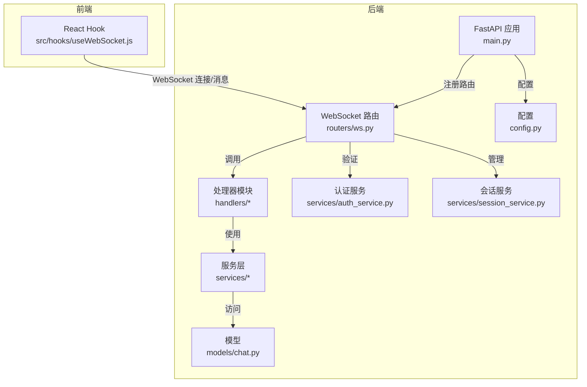
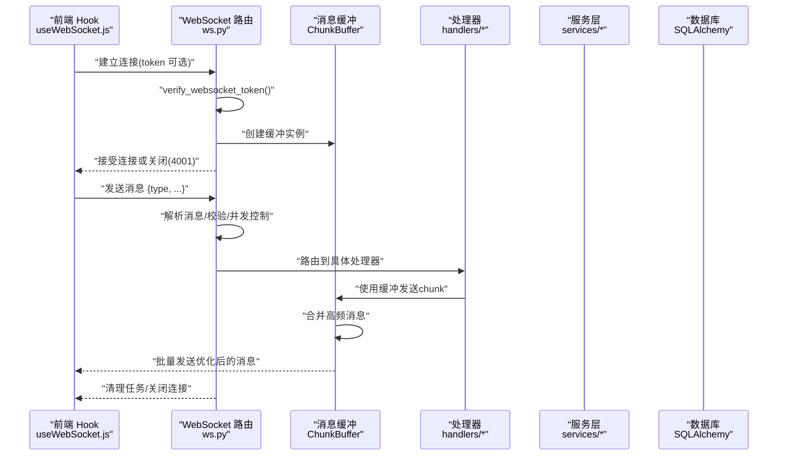
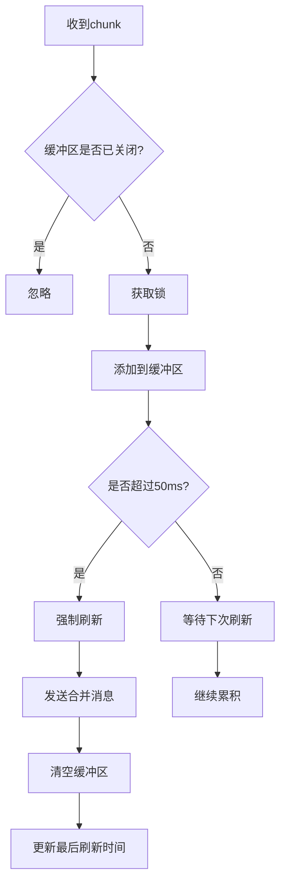
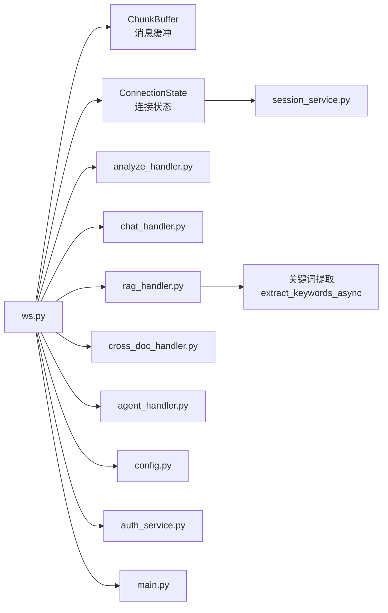

# WebSocket 路由

<cite>
**本文档引用的文件**
- [ws.py](file://backend/app/routers/ws.py)
- [useWebSocket.js](file://frontend/src/hooks/useWebSocket.js)
- [analyze_handler.py](file://backend/app/handlers/analyze_handler.py)
- [chat_handler.py](file://backend/app/handlers/chat_handler.py)
- [rag_handler.py](file://backend/app/handlers/rag_handler.py)
- [cross_doc_handler.py](file://backend/app/handlers/cross_doc_handler.py)
- [agent_handler.py](file://backend/app/handlers/agent_handler.py)
- [session_service.py](file://backend/app/services/session_service.py)
- [auth_service.py](file://backend/app/services/auth_service.py)
- [config.py](file://backend/app/config.py)
- [main.py](file://backend/app/main.py)
</cite>

## 更新摘要
**变更内容**
- 新增智能消息聚合缓冲机制，显著提升WebSocket性能
- 增强连接状态管理，支持跨处理器的状态共享
- 完善JWT安全验证机制，确保连接安全性
- 优化处理器实现，统一使用缓冲机制
- 增强错误处理和异常恢复机制

## 目录
1. [简介](#简介)
2. [项目结构](#项目结构)
3. [核心组件](#核心组件)
4. [架构总览](#架构总览)
5. [详细组件分析](#详细组件分析)
6. [依赖关系分析](#依赖关系分析)
7. [性能考虑](#性能考虑)
8. [故障排查指南](#故障排查指南)
9. [结论](#结论)
10. [附录](#附录)

## 简介
本文件系统性地文档化了基于 FastAPI 的增强型 WebSocket 路由实现，覆盖连接建立、消息路由、断线重连、会话管理、权限验证、并发控制、错误处理、心跳检测建议、性能优化以及实时通知与协作能力。该实现支持论文分析、问答、RAG 问答、跨文档问答、Agent 智能问答等多场景，并通过统一的消息协议与前端进行流式交互。**更新后的版本包含了智能消息聚合缓冲、连接状态管理和增强的JWT安全验证机制**。

## 项目结构
后端采用 FastAPI + SQLAlchemy 异步 ORM，WebSocket 路由位于独立模块，配合多个处理器模块与服务层协同工作；前端通过自定义 React Hook 管理 WebSocket 连接与消息订阅。

**图表来源**
- [main.py:55-95](file://backend/app/main.py#L55-L95)
- [ws.py:32-54](file://backend/app/routers/ws.py#L32-L54)

**章节来源**
- [main.py:55-95](file://backend/app/main.py#L55-L95)
- [ws.py:32-54](file://backend/app/routers/ws.py#L32-L54)

## 核心组件
- **智能消息聚合缓冲**：`ChunkBuffer`类提供高频消息合并功能，显著减少WebSocket消息数量，提升性能。
- **连接状态管理**：`ConnectionState`类在各处理器间共享连接状态，包括论文上下文、会话ID、用户ID等。
- **JWT安全验证**：增强的`verify_websocket_token`函数提供安全的身份验证机制。
- **统一消息路由**：WebSocket端点负责消息解析与类型分发，支持取消任务、统一聊天入口等功能。
- **并发控制**：基于`running_tasks`字典的并发控制机制，确保同一时间仅允许一个同类型任务运行。
- **错误处理**：统一的WebSocket异常捕获与清理，向客户端发送error消息。
- **前端集成**：Hook提供连接状态、消息订阅、重连策略与发送方法。

**章节来源**
- [ws.py:36-89](file://backend/app/routers/ws.py#L36-L89)
- [ws.py:130-139](file://backend/app/routers/ws.py#L130-L139)
- [ws.py:106-128](file://backend/app/routers/ws.py#L106-L128)
- [ws.py:150-510](file://backend/app/routers/ws.py#L150-L510)

## 架构总览
增强的WebSocket路由作为入口，负责：
- 连接鉴权与降级
- 智能消息聚合与缓冲
- 连接状态管理与共享
- 消息解析与类型分发
- 任务调度与并发控制
- 与处理器模块解耦协作
- 与服务层交互以持久化会话与消息

**图表来源**
- [ws.py:150-510](file://backend/app/routers/ws.py#L150-L510)
- [ws.py:36-89](file://backend/app/routers/ws.py#L36-L89)
- [useWebSocket.js:19-59](file://frontend/src/hooks/useWebSocket.js#L19-L59)

## 详细组件分析

### 智能消息聚合缓冲机制

#### ChunkBuffer 类设计
`ChunkBuffer`类提供了智能的消息聚合功能，通过时间间隔合并高频WebSocket消息，显著减少消息数量：

- **默认配置**：50ms合并间隔，对用户体验影响极小（人眼感知延迟约100ms）
- **性能收益**：通常可减少80-90%的WebSocket消息数量
- **前端优化**：降低React重渲染频率，提升整体流畅度
- **线程安全**：使用asyncio.Lock确保并发安全

#### 缓冲策略

**章节来源**
- [ws.py:36-89](file://backend/app/routers/ws.py#L36-L89)
- [ws.py:91-104](file://backend/app/routers/ws.py#L91-L104)

### 连接状态管理

#### ConnectionState 类
`ConnectionState`类提供了跨处理器共享的连接状态管理：

- **共享状态**：paper_context、current_paper_id、current_session_id、current_user_id
- **聊天历史**：维护ChatMessageHistory实例
- **任务管理**：running_tasks字典跟踪所有运行中的任务
- **生命周期**：在连接建立时创建，在连接关闭时清理

#### 状态同步机制
处理器之间通过共享的ConnectionState实例进行状态同步，确保：
- 论文上下文的一致性
- 用户会话的连续性
- 任务执行的协调性

**章节来源**
- [ws.py:130-139](file://backend/app/routers/ws.py#L130-L139)

### 增强的JWT安全验证

#### verify_websocket_token 函数
增强了的JWT验证机制提供了双重安全保障：

- **匿名降级**：无token时使用默认用户（个人使用模式）
- **JWT验证**：提供token时进行JWT解码与用户校验
- **状态检查**：确保用户处于激活状态
- **异常处理**：统一的异常捕获与降级处理

#### 安全特性
- 使用settings.JWT_SECRET_KEY和settings.JWT_ALGORITHM进行验证
- 支持settings.DEFAULT_USER_ID的匿名访问
- 异常情况下自动降级为默认用户

**章节来源**
- [ws.py:106-128](file://backend/app/routers/ws.py#L106-L128)
- [auth_service.py:14-41](file://backend/app/services/auth_service.py#L14-L41)
- [config.py:31-34](file://backend/app/config.py#L31-L34)

### WebSocket 端点与消息协议
- **端点路径**：/ws
- **查询参数**：token（JWT，可选）
- **支持的消息类型**：
  - analyze：论文章节概述
  - chat：基于全文上下文的基础问答
  - rag_chat：RAG 问答（支持联网搜索）
  - cross_doc_chat：跨文档问答
  - deep_analyze：深度分析
  - agent_chat：Agent 智能问答
  - unified_chat：统一聊天入口（意图识别后自动路由）
  - cancel：取消当前所有运行中的任务
- **响应类型**：
  - 各类 *_chunk：流式输出片段（使用缓冲机制）
  - done：任务完成，携带channel与session_id
  - error：错误信息
  - rag_sources/cross_doc_sources：引用来源列表
  - search_status/index_status：搜索/索引状态
  - keywords_result：关键词提取结果
  - agent_*：Agent模式下的意图、计划、步骤与最终答案片段
  - intent_detected：统一入口的意图识别结果

**章节来源**
- [ws.py:150-176](file://backend/app/routers/ws.py#L150-L176)
- [ws.py:194-497](file://backend/app/routers/ws.py#L194-L497)

### 处理器模块与数据流

#### 论文分析与深度分析
- **输入**：text（论文文本）、paper_id（可选）
- **输出**：analyze_chunk/deep_analyze_chunk片段，完成后发送done
- **行为**：使用ChunkBuffer进行消息聚合，保存章节概述/深度分析缓存，异步提取关键词并回传

#### 基础问答（全文上下文）
- **输入**：message
- **输出**：chat_chunk片段，完成后发送done
- **行为**：使用ChunkBuffer进行消息聚合

#### RAG 问答（含联网搜索）
- **输入**：message、paper_id、session_id、user_id、enable_search（可选）
- **流程要点**：
  - 获取/创建会话并保存用户消息
  - 检索相关文本块，若无则尝试重建索引或降级为论文预览
  - 可选联网搜索，推送search_status
  - 组装上下文与消息，流式获取回复（使用ChunkBuffer）
  - 发送rag_sources，保存assistant消息，自动更新标题，发送done
- **异常**：无检索/搜索结果时返回提示并完成

#### 跨文档问答
- **输入**：message、paper_ids、session_id、user_id
- **流程要点**：
  - 获取/创建会话并保存用户消息（附带paper_ids）
  - 检索多篇论文的相关结果，组装sources并流式返回（使用ChunkBuffer）
  - 保存assistant消息，自动更新标题，发送done

#### Agent 智能问答
- **输入**：message、paper_id、paper_ids
- **流程要点**：
  - 意图识别、任务规划、逐步执行，期间发送agent_*事件
  - 最终返回agent_answer_chunk（使用ChunkBuffer），发送done

**章节来源**
- [analyze_handler.py:14-52](file://backend/app/handlers/analyze_handler.py#L14-L52)
- [chat_handler.py:12-34](file://backend/app/handlers/chat_handler.py#L12-L34)
- [rag_handler.py:31-253](file://backend/app/handlers/rag_handler.py#L31-253)
- [cross_doc_handler.py:15-99](file://backend/app/handlers/cross_doc_handler.py#L15-L99)
- [agent_handler.py:12-75](file://backend/app/handlers/agent_handler.py#L12-L75)

### 前端集成与断线重连
- **连接策略**：
  - 自动连接：首次使用时建立连接，支持带token或匿名
  - 断线重连：最多重试固定次数，指数退避
  - 状态管理：提供连接状态订阅
- **发送消息**：
  - sendMessage：通用消息
  - sendRagMessage/sendCrossDocMessage/sendUnifiedChatMessage：专用消息
  - sendCancel：取消当前任务
- **消息订阅**：onMessage(typeOrHandler, handler)支持按类型或通配符订阅

**章节来源**
- [useWebSocket.js:19-71](file://frontend/src/hooks/useWebSocket.js#L19-L71)
- [useWebSocket.js:100-177](file://frontend/src/hooks/useWebSocket.js#L100-L177)

### 错误处理与异常恢复
- **后端**：
  - WebSocketDisconnect与通用异常捕获，清理任务并关闭连接
  - 各处理器内部捕获异常并向客户端发送error
  - ChunkBuffer的线程安全保证
- **前端**：
  - onclose触发重连计数与定时重连
  - onerror记录错误

**章节来源**
- [ws.py:498-510](file://backend/app/routers/ws.py#L498-L510)
- [useWebSocket.js:45-56](file://frontend/src/hooks/useWebSocket.js#L45-L56)

## 依赖关系分析

**图表来源**
- [ws.py:23-31](file://backend/app/routers/ws.py#L23-L31)
- [ws.py:36-89](file://backend/app/routers/ws.py#L36-L89)
- [ws.py:130-139](file://backend/app/routers/ws.py#L130-L139)
- [rag_handler.py:22-29](file://backend/app/handlers/rag_handler.py#L22-L29)

## 性能考虑
- **智能消息聚合**：ChunkBuffer类将高频消息合并，通常减少80-90%的WebSocket消息数量
- **缓冲策略优化**：50ms的默认合并间隔对用户体验影响极小，但能显著提升性能
- **并发限制**：同一类型任务仅保留一个运行实例，避免资源竞争与重复计算
- **异步索引重建**：当论文索引缺失时，后台重建并通知前端，同时提供降级方案
- **关键词提取**：异步执行并设置超时，避免阻塞主流程
- **前端重连**：指数退避与最大重试次数，减少无效连接开销
- **内存管理**：ChunkBuffer使用asyncio.Lock确保线程安全，防止竞态条件
- **连接状态共享**：ConnectionState减少重复状态初始化开销
- **建议优化**：
  - 心跳检测：建议在客户端与服务端分别实现ping/pong，周期性检测连接健康
  - 背压控制：在高频流式输出场景下，前端可引入节流与缓冲队列
  - 连接池与限流：对LLM与检索服务增加速率限制与超时配置
  - 缓存策略：对热点论文的检索结果与关键词进行短期缓存

## 故障排查指南
- **连接失败（4001）**：确认token是否有效、用户是否激活；无token时为匿名模式
- **任务被取消**：发送cancel或新任务抢占导致旧任务取消
- **RAG无结果**：检查论文是否解析完成、索引是否存在；必要时等待重建或启用联网搜索
- **跨文档无结果**：确认paper_ids是否正确、论文是否完成索引
- **Agent无进展**：检查意图识别与任务规划服务可用性
- **前端不断重连**：检查网络状况与后端健康状态；查看浏览器控制台错误日志
- **消息丢失**：检查ChunkBuffer是否正确配置，确认缓冲区未提前关闭
- **性能问题**：监控WebSocket消息数量，调整ChunkBuffer的interval_ms参数

**章节来源**
- [ws.py:177-181](file://backend/app/routers/ws.py#L177-L181)
- [ws.py:252-260](file://backend/app/routers/ws.py#L252-L260)
- [rag_handler.py:48-106](file://backend/app/handlers/rag_handler.py#L48-L106)
- [cross_doc_handler.py:32-45](file://backend/app/handlers/cross_doc_handler.py#L32-L45)
- [useWebSocket.js:48-51](file://frontend/src/hooks/useWebSocket.js#L48-L51)

## 结论
该增强的WebSocket路由实现了高内聚、低耦合的实时通信架构，通过智能消息聚合缓冲、连接状态管理和增强的JWT安全验证，显著提升了性能和安全性。通过统一的消息协议与处理器模块解耦，支持多种复杂场景（分析、问答、RAG、跨文档、Agent）。配合完善的会话管理、并发控制与错误处理机制，能够满足学术论文阅读与问答系统的实时性与可靠性需求。**更新后的版本在保持原有功能的基础上，通过智能缓冲机制和状态管理进一步提升了用户体验和系统稳定性**。

## 附录

### 消息协议定义与示例
- **请求消息**
  - 分析：{"type": "analyze", "text": "...", "paper_id": N}
  - 基础问答：{"type": "chat", "message": "..."}
  - RAG问答：{"type": "rag_chat", "message": "...", "paper_id": N, "session_id": N, "user_id": N, "enable_search": boolean}
  - 跨文档问答：{"type": "cross_doc_chat", "message": "...", "paper_ids": [N,...], "session_id": N, "user_id": N}
  - 深度分析：{"type": "deep_analyze", "text": "...", "paper_id": N}
  - Agent问答：{"type": "agent_chat", "message": "...", "paper_id": N, "paper_ids": [N,...]}
  - 统一聊天：{"type": "unified_chat", "message": "...", "paper_id": N, "paper_ids": [N,...], "session_id": N, "enable_search": boolean}
  - 取消任务：{"type": "cancel"}
- **响应消息**
  - 流式片段：{"type": "xxx_chunk", "content": "..."}
  - 完成：{"type": "done", "channel": "...", "session_id": N}
  - 错误：{"type": "error", "message": "..."}
  - 引用来源：{"type": "rag_sources"/"cross_doc_sources", "sources": [...]}
  - 搜索/索引状态：{"type": "search_status"/"index_status", "...": "..."}
  - 关键词结果：{"type": "keywords_result", "keywords": [...], "paper_id": N}
  - Agent事件：{"type": "agent_intent"/"agent_plan"/"agent_step"/"agent_step_result"/"agent_answer_chunk"}

**章节来源**
- [ws.py:150-176](file://backend/app/routers/ws.py#L150-L176)
- [rag_handler.py:140-210](file://backend/app/handlers/rag_handler.py#L140-L210)
- [cross_doc_handler.py:47-84](file://backend/app/handlers/cross_doc_handler.py#L47-L84)
- [agent_handler.py:19-56](file://backend/app/handlers/agent_handler.py#L19-L56)

### 智能缓冲配置参考
- **默认缓冲间隔**：50ms
- **性能收益**：通常减少80-90%的消息数量
- **用户体验影响**：对人眼感知延迟约100ms，影响极小
- **适用场景**：高频流式输出、实时问答、论文分析等
- **自定义配置**：可通过修改interval_ms参数调整缓冲策略

**章节来源**
- [ws.py:36-43](file://backend/app/routers/ws.py#L36-L43)
- [ws.py:44-46](file://backend/app/routers/ws.py#L44-L46)