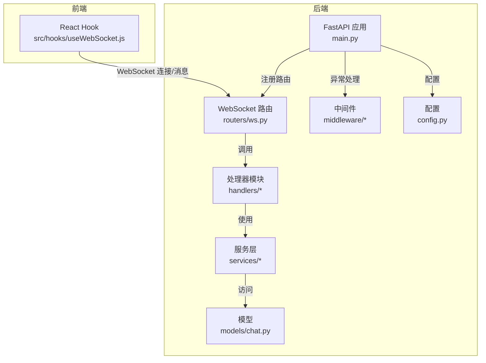
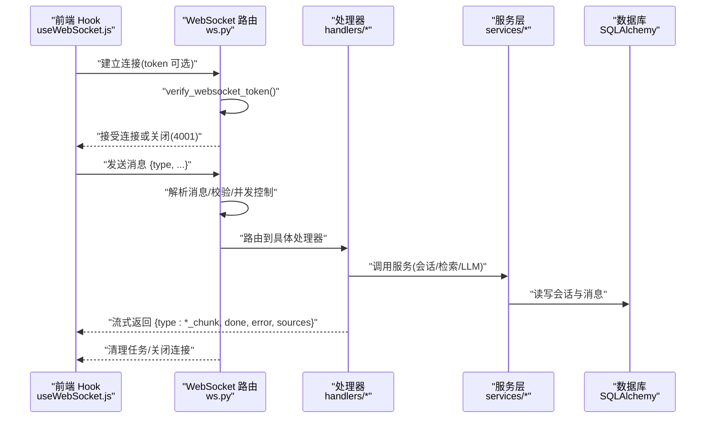
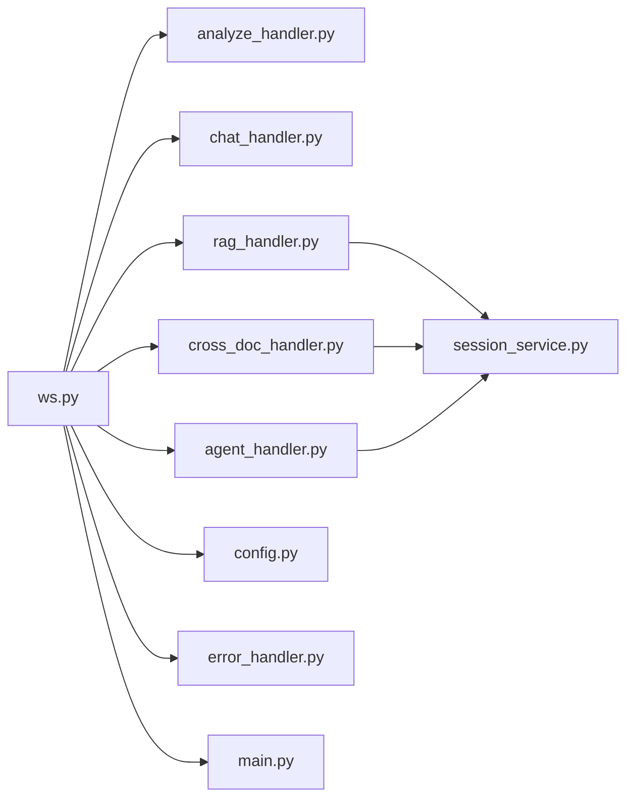

# WebSocket 路由

<cite>
**本文档引用的文件**
- [ws.py](file://backend/app/routers/ws.py)
- [useWebSocket.js](file://frontend/src/hooks/useWebSocket.js)
- [main.py](file://backend/app/main.py)
- [analyze_handler.py](file://backend/app/handlers/analyze_handler.py)
- [chat_handler.py](file://backend/app/handlers/chat_handler.py)
- [rag_handler.py](file://backend/app/handlers/rag_handler.py)
- [cross_doc_handler.py](file://backend/app/handlers/cross_doc_handler.py)
- [agent_handler.py](file://backend/app/handlers/agent_handler.py)
- [session_service.py](file://backend/app/services/session_service.py)
- [error_handler.py](file://backend/app/middleware/error_handler.py)
- [config.py](file://backend/app/config.py)
- [chat.py](file://backend/app/models/chat.py)
</cite>

## 目录
1. [简介](#简介)
2. [项目结构](#项目结构)
3. [核心组件](#核心组件)
4. [架构总览](#架构总览)
5. [详细组件分析](#详细组件分析)
6. [依赖关系分析](#依赖关系分析)
7. [性能考虑](#性能考虑)
8. [故障排查指南](#故障排查指南)
9. [结论](#结论)
10. [附录](#附录)

## 简介
本文件系统性地文档化了基于 FastAPI 的 WebSocket 路由实现，覆盖连接建立、消息路由、断线重连、会话管理、权限验证、并发控制、错误处理、心跳检测建议、性能优化以及实时通知与协作能力。该实现支持论文分析、问答、RAG 问答、跨文档问答、Agent 智能问答等多场景，并通过统一的消息协议与前端进行流式交互。

## 项目结构
后端采用 FastAPI + SQLAlchemy 异步 ORM，WebSocket 路由位于独立模块，配合多个处理器模块与服务层协同工作；前端通过自定义 React Hook 管理 WebSocket 连接与消息订阅。

图表来源
- [main.py:55-95](file://backend/app/main.py#L55-L95)
- [ws.py:76-102](file://backend/app/routers/ws.py#L76-L102)

章节来源
- [main.py:55-95](file://backend/app/main.py#L55-L95)
- [ws.py:76-102](file://backend/app/routers/ws.py#L76-L102)

## 核心组件
- WebSocket 端点与路由分发：统一入口接收消息，按 type 路由至不同处理器，支持取消任务、统一聊天入口（意图识别与自动路由）。
- 权限验证：JWT 解码校验，支持匿名降级（无 token 时默认用户）。
- 会话管理：基于数据库的会话创建与标题自动更新，支持单论文与跨文档会话。
- 并发控制：ConnectionState 维护 running_tasks，同一时间仅允许一个同类型任务运行，新任务到来时取消旧任务。
- 错误处理：统一的 WebSocket 异常捕获与清理，向客户端发送 error 消息。
- 前端集成：Hook 提供连接状态、消息订阅、重连策略与发送方法。

章节来源
- [ws.py:32-54](file://backend/app/routers/ws.py#L32-L54)
- [ws.py:56-65](file://backend/app/routers/ws.py#L56-L65)
- [ws.py:114-436](file://backend/app/routers/ws.py#L114-L436)
- [session_service.py:17-35](file://backend/app/services/session_service.py#L17-L35)
- [chat.py:14-51](file://backend/app/models/chat.py#L14-L51)

## 架构总览
WebSocket 路由作为入口，负责：
- 连接鉴权与降级
- 消息解析与类型分发
- 任务调度与并发控制
- 与处理器模块解耦协作
- 与服务层交互以持久化会话与消息

图表来源
- [ws.py:76-102](file://backend/app/routers/ws.py#L76-L102)
- [ws.py:114-436](file://backend/app/routers/ws.py#L114-L436)
- [useWebSocket.js:19-59](file://frontend/src/hooks/useWebSocket.js#L19-L59)

## 详细组件分析

### WebSocket 端点与消息协议
- 端点路径：/ws
- 查询参数：token（JWT，可选）
- 支持的消息类型：
  - analyze：论文章节概述
  - chat：基于全文上下文的基础问答
  - rag_chat：RAG 问答（支持联网搜索）
  - cross_doc_chat：跨文档问答
  - deep_analyze：深度分析
  - agent_chat：Agent 智能问答
  - unified_chat：统一聊天入口（意图识别后自动路由）
  - cancel：取消当前所有运行中的任务
- 响应类型：
  - 各类 *_chunk：流式输出片段
  - done：任务完成，携带 channel 与 session_id
  - error：错误信息
  - rag_sources/cross_doc_sources：引用来源列表
  - search_status/index_status：搜索/索引状态
  - keywords_result：关键词提取结果
  - agent_*：Agent 模式下的意图、计划、步骤与最终答案片段
  - intent_detected：统一入口的意图识别结果

章节来源
- [ws.py:76-102](file://backend/app/routers/ws.py#L76-L102)
- [ws.py:120-417](file://backend/app/routers/ws.py#L120-L417)

### 权限验证与连接降级
- 若未提供 token，则使用默认用户（个人使用模式），便于本地调试与演示。
- 若提供 token，将进行 JWT 解码与用户校验，要求用户存在且处于激活状态。

章节来源
- [ws.py:32-54](file://backend/app/routers/ws.py#L32-L54)

### 会话管理与并发控制
- 会话管理：
  - 获取或创建会话，支持单论文与跨文档会话
  - 自动更新会话标题（前两条消息且标题为默认值）
- 并发控制：
  - ConnectionState 维护 running_tasks 字典
  - 同一类型任务仅允许一个运行，新任务到达时取消旧任务
  - finally 中统一取消并关闭连接

章节来源
- [session_service.py:17-35](file://backend/app/services/session_service.py#L17-L35)
- [ws.py:56-65](file://backend/app/routers/ws.py#L56-L65)
- [ws.py:130-135](file://backend/app/routers/ws.py#L130-L135)
- [ws.py:424-436](file://backend/app/routers/ws.py#L424-L436)

### 处理器模块与数据流

#### 论文分析与深度分析
- 输入：text（论文文本）、paper_id（可选）
- 输出：analyze_chunk/deep_analyze_chunk 片段，完成后发送 done
- 行为：保存章节概述/深度分析缓存，异步提取关键词并回传

章节来源
- [analyze_handler.py:13-49](file://backend/app/handlers/analyze_handler.py#L13-L49)
- [analyze_handler.py:51-87](file://backend/app/handlers/analyze_handler.py#L51-L87)

#### 基础问答（全文上下文）
- 输入：message
- 输出：chat_chunk 片段，完成后发送 done

章节来源
- [chat_handler.py:11-32](file://backend/app/handlers/chat_handler.py#L11-L32)

#### RAG 问答（含联网搜索）
- 输入：message、paper_id、session_id、user_id、enable_search（可选）
- 流程要点：
  - 获取/创建会话并保存用户消息
  - 检索相关文本块，若无则尝试重建索引或降级为论文预览
  - 可选联网搜索，推送 search_status
  - 组装上下文与消息，流式获取回复
  - 发送 rag_sources，保存 assistant 消息，自动更新标题，发送 done
- 异常：无检索/搜索结果时返回提示并完成

章节来源
- [rag_handler.py:29-234](file://backend/app/handlers/rag_handler.py#L29-L234)

#### 跨文档问答
- 输入：message、paper_ids、session_id、user_id
- 流程要点：
  - 获取/创建会话并保存用户消息（附带 paper_ids）
  - 检索多篇论文的相关结果，组装 sources 并流式返回
  - 保存 assistant 消息，自动更新标题，发送 done

章节来源
- [cross_doc_handler.py:14-95](file://backend/app/handlers/cross_doc_handler.py#L14-L95)

#### Agent 智能问答
- 输入：message、paper_id、paper_ids
- 流程要点：
  - 意图识别、任务规划、逐步执行，期间发送 agent_* 事件
  - 最终返回 agent_answer_chunk，发送 done

章节来源
- [agent_handler.py:11-67](file://backend/app/handlers/agent_handler.py#L11-L67)

### 前端集成与断线重连
- 连接策略：
  - 自动连接：首次使用时建立连接，支持带 token 或匿名
  - 断线重连：最多重试固定次数，指数退避
  - 状态管理：提供连接状态订阅
- 发送消息：
  - sendMessage：通用消息
  - sendRagMessage/sendCrossDocMessage/sendUnifiedChatMessage：专用消息
  - sendCancel：取消当前任务
- 消息订阅：onMessage(typeOrHandler, handler) 支持按类型或通配符订阅

章节来源
- [useWebSocket.js:19-71](file://frontend/src/hooks/useWebSocket.js#L19-L71)
- [useWebSocket.js:100-177](file://frontend/src/hooks/useWebSocket.js#L100-L177)

### 错误处理与异常恢复
- 后端：
  - WebSocketDisconnect 与通用异常捕获，清理任务并关闭连接
  - 各处理器内部捕获异常并向客户端发送 error
- 前端：
  - onclose 触发重连计数与定时重连
  - onerror 记录错误

章节来源
- [ws.py:424-436](file://backend/app/routers/ws.py#L424-L436)
- [rag_handler.py:225-233](file://backend/app/handlers/rag_handler.py#L225-L233)
- [useWebSocket.js:45-56](file://frontend/src/hooks/useWebSocket.js#L45-L56)

### 数据模型与会话持久化
- ChatSession：支持单论文与跨文档会话，维护标题与关联论文 ID 列表
- ChatMessage：记录角色、内容、来源与时间戳

章节来源
- [chat.py:14-51](file://backend/app/models/chat.py#L14-L51)
- [chat.py:53-71](file://backend/app/models/chat.py#L53-L71)

## 依赖关系分析

图表来源
- [ws.py:23-27](file://backend/app/routers/ws.py#L23-L27)
- [rag_handler.py:13-17](file://backend/app/handlers/rag_handler.py#L13-L17)
- [cross_doc_handler.py:10-11](file://backend/app/handlers/cross_doc_handler.py#L10-L11)
- [agent_handler.py:8](file://backend/app/handlers/agent_handler.py#L8)
- [session_service.py:12](file://backend/app/services/session_service.py#L12)
- [config.py:15-44](file://backend/app/config.py#L15-L44)
- [error_handler.py:73-92](file://backend/app/middleware/error_handler.py#L73-L92)
- [main.py:82-93](file://backend/app/main.py#L82-L93)

## 性能考虑
- 流式输出：各处理器均采用异步迭代器逐片发送，降低首字节延迟与内存占用。
- 并发限制：同一类型任务仅保留一个运行实例，避免资源竞争与重复计算。
- 异步索引重建：当论文索引缺失时，后台重建并通知前端，同时提供降级方案。
- 关键词提取：异步执行并设置超时，避免阻塞主流程。
- 前端重连：指数退避与最大重试次数，减少无效连接开销。
- 建议优化：
  - 心跳检测：建议在客户端与服务端分别实现 ping/pong，周期性检测连接健康。
  - 背压控制：在高频流式输出场景下，前端可引入节流与缓冲队列。
  - 连接池与限流：对 LLM 与检索服务增加速率限制与超时配置。
  - 缓存策略：对热点论文的检索结果与关键词进行短期缓存。

[本节为通用性能建议，无需特定文件引用]

## 故障排查指南
- 连接失败（4001）：确认 token 是否有效、用户是否激活；无 token 时为匿名模式。
- 任务被取消：发送 cancel 或新任务抢占导致旧任务取消。
- RAG 无结果：检查论文是否解析完成、索引是否存在；必要时等待重建或启用联网搜索。
- 跨文档无结果：确认 paper_ids 是否正确、论文是否完成索引。
- Agent 无进展：检查意图识别与任务规划服务可用性。
- 前端不断重连：检查网络状况与后端健康状态；查看浏览器控制台错误日志。

章节来源
- [ws.py:104-107](file://backend/app/routers/ws.py#L104-L107)
- [ws.py:252-260](file://backend/app/routers/ws.py#L252-L260)
- [rag_handler.py:48-106](file://backend/app/handlers/rag_handler.py#L48-L106)
- [cross_doc_handler.py:32-45](file://backend/app/handlers/cross_doc_handler.py#L32-L45)
- [useWebSocket.js:48-51](file://frontend/src/hooks/useWebSocket.js#L48-L51)

## 结论
该 WebSocket 路由实现了高内聚、低耦合的实时通信架构，通过统一的消息协议与处理器模块解耦，支持多种复杂场景（分析、问答、RAG、跨文档、Agent）。配合完善的会话管理、并发控制与错误处理机制，能够满足学术论文阅读与问答系统的实时性与可靠性需求。建议后续补充心跳检测与限流策略以进一步提升稳定性与用户体验。

[本节为总结性内容，无需特定文件引用]

## 附录

### 消息协议定义与示例
- 请求消息
  - 分析：{"type": "analyze", "text": "...", "paper_id": N}
  - 基础问答：{"type": "chat", "message": "..."}
  - RAG 问答：{"type": "rag_chat", "message": "...", "paper_id": N, "session_id": N, "user_id": N, "enable_search": boolean}
  - 跨文档问答：{"type": "cross_doc_chat", "message": "...", "paper_ids": [N,...], "session_id": N, "user_id": N}
  - 深度分析：{"type": "deep_analyze", "text": "...", "paper_id": N}
  - Agent 问答：{"type": "agent_chat", "message": "...", "paper_id": N, "paper_ids": [N,...]}
  - 统一聊天：{"type": "unified_chat", "message": "...", "paper_id": N, "paper_ids": [N,...], "session_id": N, "enable_search": boolean}
  - 取消任务：{"type": "cancel"}
- 响应消息
  - 流式片段：{"type": "xxx_chunk", "...": "..."}
  - 完成：{"type": "done", "channel": "...", "session_id": N}
  - 错误：{"type": "error", "message": "..."}
  - 引用来源：{"type": "rag_sources"/"cross_doc_sources", "sources": [...]}
  - 搜索/索引状态：{"type": "search_status"/"index_status", "...": "..."}
  - 关键词结果：{"type": "keywords_result", "keywords": [...], "paper_id": N}
  - Agent 事件：{"type": "agent_intent"/"agent_plan"/"agent_step"/"agent_step_result"/"agent_answer_chunk"}

章节来源
- [ws.py:84-102](file://backend/app/routers/ws.py#L84-L102)
- [rag_handler.py:140-210](file://backend/app/handlers/rag_handler.py#L140-L210)
- [cross_doc_handler.py:47-84](file://backend/app/handlers/cross_doc_handler.py#L47-L84)
- [agent_handler.py:19-56](file://backend/app/handlers/agent_handler.py#L19-L56)